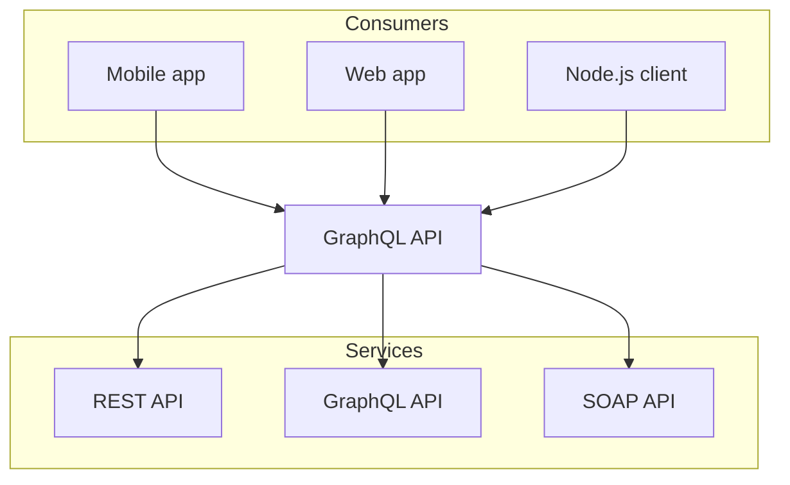

# Nextra Components

## NextJS

### Links

All relative Markdown links are automatically converted to Next.js links. This
means that the target page will be prefetched. And when you click on a link, the
page will be loaded on the client-side like a SPA, without making a full page
load. For example:

```md
Click [here](/about) to read more.
```

Will be equivalent to:

```jsx
import Link from 'next/link'

Click <Link href="/about">here</Link> to read more.
```

This feature makes navigation between Nextra pages fast and seamless.

### Static Images

<Callout>
  This feature is enabled via `staticImage: true` in the Nextra config by
  default.
</Callout>

Nextra supports automatically optimizing your static image imports with the
Markdown syntax. You do not need to specify the width and height of the image,
just use the `` Markdown syntax:

```md filename="index.mdx"

```

This loads the `og.png` file inside the `public` folder, and automatically
wraps it with Next.js `<Image>`.

<Callout>
  You can also use `` to load the image from a relative
  path, if you don't want to host it via `public`.
</Callout>

The standard way to use
[Next.js Image](https://nextjs.org/docs/basic-features/image-optimization)
inside MDX is to directly import the component:

```mdx
import Image from 'next/image'

<Image src="/og.png" alt="Hello" width={500} height={500} />
```

### Custom CSS

See `../styles.css`, which will be imported globally.

## Cards

### With images

import { Card, Cards } from 'nextra/components'

<Cards num={2}>
  <Card image arrow title="Documentation theme" href="/docs/docs-theme/start">
    <></>
  </Card>
  <Card image arrow title="Blog theme" href="/docs/blog-theme/start">
    <></>
  </Card>
</Cards>

### With Icons

import {
  BoxIcon,
  BrushIcon,
  DropperIcon,
  FilesIcon,
  GlobeIcon,
  LightningIcon,
  LinkIcon,
  MarkdownIcon,
  PictureIcon,
  StarsIcon
} from '@components/icons'

<Cards>
  <Card
    icon={<FilesIcon />}
    title="Organize Files"
    href="/docs/guide/organize-files"
  />
  <Card icon={<MarkdownIcon />} title="Markdown" href="/docs/guide/markdown" />
  <Card
    icon={<StarsIcon />}
    title="Syntax Highlighting"
    href="/docs/guide/syntax-highlighting"
  />
  <Card icon={<LinkIcon />} title="Next.js Link" href="/docs/guide/link" />
  <Card icon={<PictureIcon />} title="Next.js Image" href="/docs/guide/image" />
  <Card icon={<LightningIcon />} title="Next.js SSG" href="/docs/guide/ssg" />
  <Card icon={<GlobeIcon />} title="Next.js I18n" href="/docs/guide/i18n" />
  <Card icon={<BrushIcon />} title="Custom CSS" href="/docs/guide/custom-css" />
  <Card icon={<DropperIcon />} title="Advanced" href="/docs/guide/advanced" />
  <Card
    icon={<BoxIcon />}
    title="Built-in Components"
    href="/docs/guide/built-ins"
  />
</Cards>

### Footer Cards

import { FileIcon, NewsletterIcon } from '@components/icons'

<Cards>
  <Card
    icon={<NewsletterIcon />}
    title="Docs Theme →"
    href="/docs/docs-theme/page-configuration"
  />
  <Card
    icon={<FileIcon />}
    title="Blog Theme →"
    href="/docs/blog-theme/start"
  />
</Cards>


## Callouts

import { Callout } from 'nextra/components'

<Callout>
  A **callout** is a short piece of text intended to attract attention.
</Callout>

<Callout type="info">
  A **callout** is a short piece of text intended to attract attention.
</Callout>

<Callout type="warning">
  A **callout** is a short piece of text intended to attract attention.
</Callout>

<Callout type="error">
  A **callout** is a short piece of text intended to attract attention.
</Callout>

<Callout emoji="👾">
  **Space Invaders** is a 1978 shoot 'em up arcade game developed by Tomohiro
  Nishikado.
</Callout>

## Tabs

import { Tabs } from 'nextra/components'
 
<Tabs items={['pnpm', 'npm', 'yarn']} defaultIndex="1">
  <Tabs.Tab>**pnpm**: Fast, disk space efficient package manager.</Tabs.Tab>
  <Tabs.Tab>**npm** is a package manager for the JavaScript programming language.</Tabs.Tab>
  <Tabs.Tab>**Yarn** is a software packaging system.</Tabs.Tab>
</Tabs>

## Steps

import { Steps } from 'nextra/components'
 
<Steps>
### Step 1
 
Contents for step 1.
 
### Step 2
 
Contents for step 2.
</Steps>

## Images

### Figure

<figure>
  <></>
  <figcaption>
    Some text below
  </figcaption>
</figure>

### Screenshot

import { Screenshot } from 'components/screenshot'

import customThemeImage from '../public/assets/authors/patrickd.jpg'

<Screenshot src={customThemeImage} alt="Custom theme" />

## Tables

### Standard

| Left          | Center      |  Right      |
| :------------ | :---------: | ----------: |
| Header        |    Title    | Here's this |
| Paragraph     |    Text     |    And more |
| Strikethrough |             |    ~~Text~~ |

### Option Table

import { OptionTable } from 'components/table'

<OptionTable
  options={[
    [
      'codeHighlight',
      'boolean',
      'Enable or disable syntax highlighting. Defaults to `true`.'
    ]
  ]}
/>

## Code

Supported languages: https://github.com/shikijs/shiki/blob/main/docs/languages.md

### Inlined

Inlined syntax highlighting is also supported `let x = 1{:jsx}` via:

```markdown
Inlined syntax highlighting is also supported `let x = 1{:jsx}` via:
```

### Blocks

Supports

- Filenames / Titles
- Line highlights
- Substring highlights
- On-hover copy button
- Optional line numbers

```markdown
json showLineNumbers {1,4-5} filename="pages/_meta.json" /Us/ copy
```

```json showLineNumbers {1,4-5} filename="pages/_meta.json" /Us/ copy
{
  "index": "My Homepage",
  "contact": "Contact Us",
  "about": {
    "title": "About Us",
    "...extra configurations...": "..."
  }
}
```

### ANSI Highlighting

You can highlight ANSI escape codes:

````md filename="Markdown"
```ansi
 ✓ src/index.test.ts (1)
   Test Files  1 passed (1)
        Tests  1 passed (1)
     Start at  23:32:41
     Duration  11ms
   PASS  Waiting for file changes...
         press h to show help, press q to quit
```
````

Renders:

```ansi
 ✓ src/index.test.ts (1)
   Test Files  1 passed (1)
        Tests  1 passed (1)
     Start at  23:32:41
     Duration  11ms
   PASS  Waiting for file changes...
         press h to show help, press q to quit
```

## Task List

- [x] Write the press release
- [ ] Update the website
- [ ] Contact the media

## Custom Heading Id [#cuuuuuustom]

```markdown
## Long heading about Nextra [#about-nextra]
```

## FAQ

export function FAQBox({ title, children }) {
  return (
    <details open className="last-of-type:mb-0 rounded-lg bg-neutral-50 dark:bg-neutral-800 p-2 mt-4">
      <summary>
        <strong className="text-lg">{title}</strong>
      </summary>
      <div className="nx-p-2">{children}</div>
    </details>
  )
}

<FAQBox title="Question?">
  Answer

- A
- B
- C

</FAQBox>

<FAQBox title="Q 2?">
  Another answer
</FAQBox>

## File Tree

import { FileTree } from 'nextra/components'

<FileTree>
  <FileTree.Folder name="pages" defaultOpen>
    <FileTree.File name="contact.md" />
    <FileTree.File name="index.mdx" />
    <FileTree.Folder name="about" defaultOpen>
      <FileTree.File name="legal.md" />
      <FileTree.File name="index.mdx" />
    </FileTree.Folder>
  </FileTree.Folder>
</FileTree>

## Diagrams



````mdx filename="Markdown"

````

## LaTeX

Using LaTeX within MDX is as simple as wrapping your expression in `$` or `$$`.

```md filename="page.mdx"
The **Pythagorean equation**: $a=\sqrt{b^2 + c^2}$.
```

will be rendered as:

<div className="mt-6 rounded-xl border border-gray-200 p-4 dark:border-gray-900">
  The **Pythagorean equation**: $a=\sqrt{b^2 + c^2}$.
</div>

You can still use [Markdown and MDX syntax](../markdown) in the same line as your LaTeX expression.

<Callout>
  If you want to display `$` in your content instead of rendering it as an
  equation, you can escape it with a backslash (`\`). For example `\$e = mc^2\$`
  will be rendered as \$e = mc^2\$.
</Callout>

To learn more about KaTeX and its supported functions and conventions, visit [KaTeX’s documentation](https://katex.org/docs/supported.html).

## Layout Bleeding

When wrapping your content with `<Bleed>`, it will be slightly wider than the
container and will overflow on both sides.

import { Bleed } from 'nextra-theme-docs'

<Bleed>
  <div className="bg-white dark:bg-neutral-800 px-16 py-10 text-center border">
    _There is nothing to writing. All you do is sit down at a typewriter and **bleed**._

    — Ernest Hemingway

  </div>
</Bleed>

It provides a better reading experience when you want to present some graphical
information, which normally looks nicer in a larger size.

For example, you can put text, image, video or any component inside.

You can even make it full-bleed using `<Bleed full>` to let it break out of the container completely.

```mdx
import { Bleed } from 'nextra-theme-docs'

<Bleed>Hey, I can use **Markdown** syntax here.</Bleed>

<Bleed full>
  
</Bleed>

<Bleed full>
  <iframe
    src="https://codesandbox.io/embed/swr-states-4une7"
    width="100%"
    height="500px"
    title="SWR-States"
  />
</Bleed>
```
