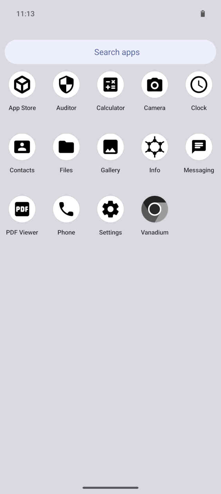
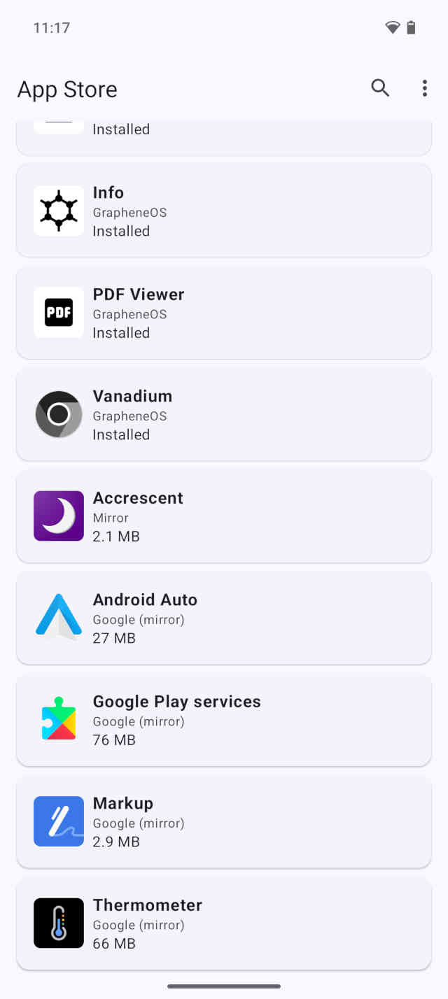
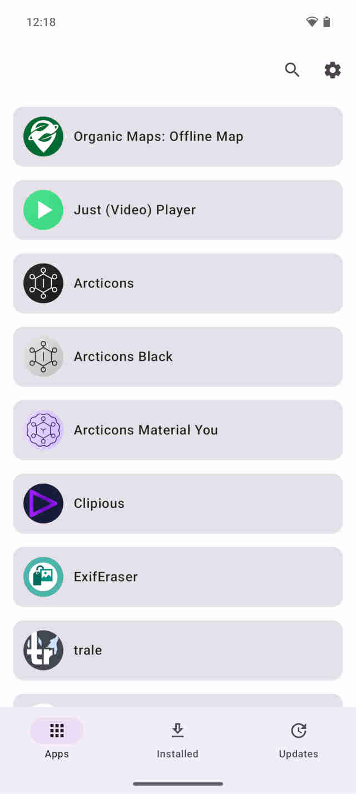
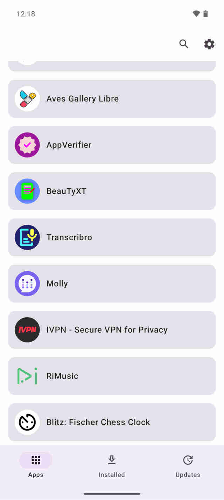
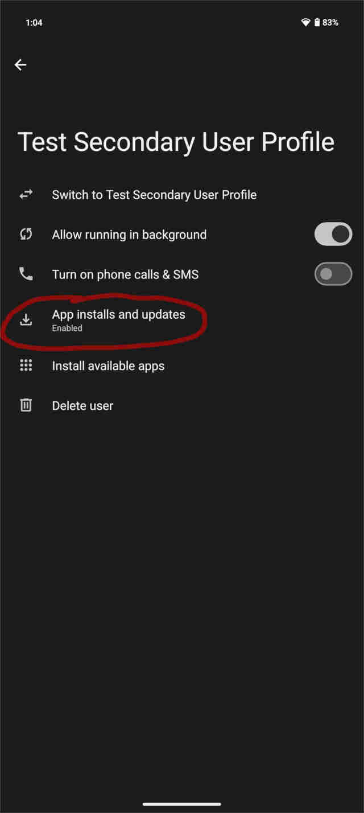
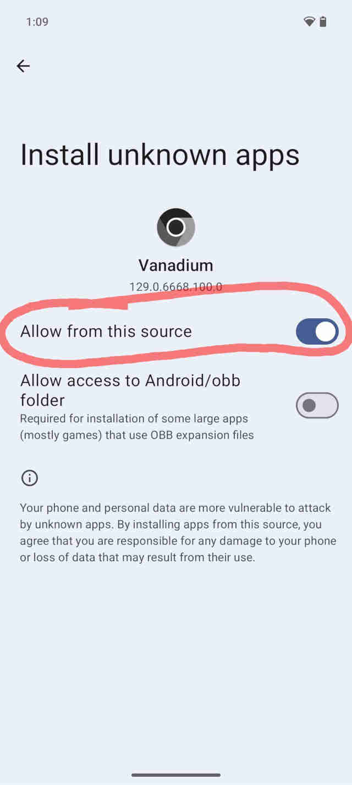

# The Cost of using GrapheneOS

import { Callout } from 'nextra/components'
import Head from 'next/head'
import { ScreenshotCard, ScreenshotCards } from '@components/screenshotcards'

import banner from './banner.jpg'

<Head>
  <meta property="og:image" content={'https://ventral.digital' + banner.src} />
  <meta name="twitter:image" content={'https://ventral.digital' + banner.src} />
</Head>

???, 2024 by [patrickd](/about#patrickd)

[GrapheneOS](https://grapheneos.org/) is a FOSS (Free and Open Source Software) Operating System based on [Android](https://www.android.com/) specifically focusing on improving its privacy and security. Unfortunately, such improvements rarely come without a cost to convenience and usability. Users naively moving to GrapheneOS, expecting no impact on their experience, may quickly find themselves frustrated and wanting to switch back.

The following is a list of inconveniences users might run into, especially if they attempt to make use of all the improvements and recommendations offered. In some way it's also a form of troubleshooting manual, as I'll try to offer ways to deal with such inconveniences.

* **The App Store has barely any Apps, on purpose.**    
GrapheneOS comes with only a few pre-installed applications, which is great compared to the bloatware that manufacturers often laden their custom Android versions with. This is a conscious choice, as each pre-installed app increases the attack surface, incurs maintenance effort that could have been spent on further security improvements, and impacts privacy, especially when applications comes from third parties. If all you're planning to do with your phone is, well, using it as a phone, Internet browsing and taking photos, you'll have everything you need. Otherwise though, you'll probably be disappointed by Graphene's App Store having less than a dozen applications, most of which are already installed.    
<ScreenshotCards num={2}>
  <ScreenshotCard
    description="Screenshot: GrapheneOS App Launcher with pre-installed applications listed.">
      <></>
  </ScreenshotCard>
  <ScreenshotCard
    description="Screenshot: GrapheneOS App Store, scrolled down, showing additionally available applications.">
      <></>
  </ScreenshotCard>
</ScreenshotCards>

* **Graphene's recommended App Store, still has barely any Apps.**    
Within the pre-installed GrapheneOS App Store you'll find [Accrescent](https://accrescent.app/), another App Store created by a GrapheneOS contributor, but not officially part of the GrapheneOS project. Referring to itself as a "novel Android app store focused on security, privacy, and usability", its been in development since 2021 but as of now has fewer than 20 open source applications to offer. According the recent [endorsement and store inclusion](https://grapheneos.social/@GrapheneOS/112821386750410102), GrapheneOS is planning to keep its own App Store focused on their own applications while Accrescent will include a wider range of both open and closed source software. Hopefully, having become Graphene's go-to App Store will soon lead to a growth in applications, but at the moment it simply doesn't offer the selection of Apps that the average user would expect.    
<ScreenshotCards num={2}>
  <ScreenshotCard
    description="Screenshot: Accrescent App Store, Page 1/2">
      <></>
  </ScreenshotCard>
  <ScreenshotCard
    description="Screenshot: Accrescent App Store, Page 2/2">
      <></>
  </ScreenshotCard>
</ScreenshotCards>

* **Third party stores introduce additional risks.**    
There are various alternatives to Google's Play Store that can be installed via the Vanadium Browser. There are mirror stores like [APKPure](https://apkpure.com/apkpure-app.html) which basically have copies of all applications of the Play Store - commonly used to bypass regional restrictions. There's the [F-Droid catalogue](https://f-droid.org/), which offers hundreds of open source apps, though unfortunately it lacks most of the apps the average user would look for since those are closed source. Via F-Droid one can install the [Aurora Store](https://f-droid.org/en/packages/com.aurora.store/), which is an alternative client for accessing the Google Play Store. While these options avoid installing Google's official Play Store and Services, they create other risks: Did you accidentally download the Store App from a fake, malicious website? Is it possible for mirrored applications to be replaced by malicious versions? Although a privacy conscious user would love to avoid using Google's Play Store, a security conscious user would likely rather use the official store than some lesser known third party.    
<ScreenshotCards num={2}>
  <ScreenshotCard
    description="Screenshot: If you're using secondary user profiles to separate some Apps from the more privileged default Owner user, you may have to re-enable that profile's ability to install 3rd party applications. (Settings &raquo; System &raquo; Multiple users &raquo; [Select a User Profile])">
      <></>
  </ScreenshotCard>
  <ScreenshotCard
    description="Screenshot: To install 3rd party applications via the Vanadium Browser you have to (preferably only temporarily) enable it to be a source for 'Unknown App' installations. This setting has to be turned on for all App Stores as well. (Settings &raquo; Apps &raquo; [Select App] &raquo; Advanced: Install unknown apps)">
      <></>
  </ScreenshotCard>
</ScreenshotCards>
