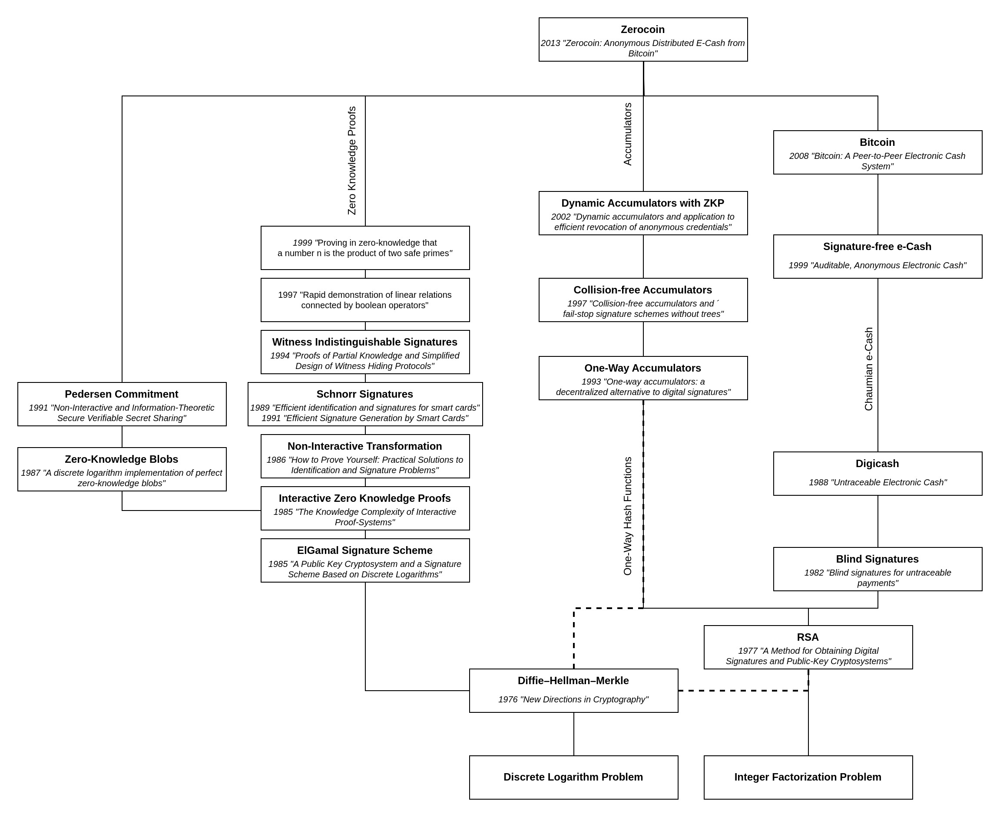

# Cryptocurrency Privacy Technologies: Zerocoin

December ??, 2023 by [patrickd](/about#patrickd)

import { Callout } from 'nextra/components'
import { Tabs } from 'nextra/components'
import { Timeline, Year } from '@components/timeline'
import { R, Reference, References } from '@components/references'

export function DetailBox({ title, children }) {
  return (
    

      

        <strong className="text-lg">{title}</strong>
      

      
{children}

    

  )
}

Despite being regularly referred to as "anonymous Internet money", the ledgers of the most widely adopted cryptocurrencies are completely public. Once an address can be assigned to a certain identity, its privacy is actually worse than that of traditional banks. This article explores the Zerocoin Protocol, the first anonymous cryptocurrency proposal supporting large anonymity sets. Initially suggested as an extension to Bitcoin, it was implemented in various alt-coins over the years. You most likely heard about it as Zcoin (XCZ), which over time developed into what we now know as the [Firo project](https://firo.org/).

## The Concept

In 2013 the [Zerocoin](https://zerocoin.org/media/pdf/ZerocoinOakland.pdf) whitepaper suggested extending the Bitcoin Protocol by introducing a distributed e-cash scheme. Such electronic cash protocols aim to preserve privacy similarly to physical bank notes, an idea first implemented in "Chaumian e-Cash" which was enabled by [Blind Signatures](/posts/2023/3/24/cryptocurrency-privacy-technologies-blind-signatures) but required a bank-like centralized entity. Zerocoin instead, is a distributed e-cash system that intended to use Bitcoin's blockchain as a public "bulletin board" on which zero-knowledge proofs can be applied on. It does not rely on digital signatures but authenticates coins by proving in zero-knowledge that a it belongs to a public list of valid coins maintained on the blockchain.

This proposal would have effectively extended Bitcoin with a native laundry functionality. Practically, users would have been able to make use of new opcodes added to Bitcoin's scripting language in order to lock funds into the mix and redeem them at a later time without any clear connection between deposit and redemption. Although originally proposed for Bitcoin, it could be integrated into any cryptocurrency.

### Scheme

[Transaction graph]

As you may already know from the previous [Confidential Transactions article](/posts/2023/10/31/cryptocurrency-privacy-technologies-confidential-transaction-values), Bitcoins are not actually transacted "from one account to another". Rather than that, there exist Unspent Transaction Outputs (UTXOs) that each have a "Locking Script" (`ScriptPubKey`) associated with them. This script dictates the condition under which a UTXO can be spent. Typically, this condition is that the transaction's signer matches with the address specified in the Locking Script ("Pay-to-Public-Key-Hash"). The signer, having therefore proven ownership over the Bitcoin amount contained by the UTXO, may then spent the it (or multiple of them) and create new UTXOs with different unlocking conditions (eg. such that only the new owner of the coins may spend them).

[Transaction graph with Zerocoin]

Zerocoin introduces a new such condition: A user may choose to specify a locking script in their UTXO which "mints" a Zerocoin. With this, the BTC value stays locked in within this UTXO while the creator receives a "Zerocoin" for which they may later redeem the value for. A commitment to the Zerocoin's unique identifier is added to the list of all Zerocoin commitments, and later the user may use this identifier to "spend" the Zerocoin in exchange for the locked value it represents. The crux is, that the user is able to prove that the identifier's commitment is within the list without revealing the specific commitment using a zero-knowledge proof. Having proven ownership, the user may now choose any mint-UTXO containing the appropriate value in exchange for their Zerocoin. By avoiding their own transaction which they used to mint the Zerocoin, it is no longer possible to trace the funds using Bitcoin's transaction graph.

<DetailBox title="Example">

To show how the protocol works, let's imagine Alice is owner over an UTXO holding a value of 2.4 BTC. She'd like to mint two Zerocoins each representing the denomination of 1 BTC. To do so, she locally generates two unique serial numbers $`S_a`$ and $`S_b`$ which she will keep secret until she decides to spend the coins. She signs a transaction containing 3 output UTXOs: One sending the change of 0.4 BTC back to herself and the other two each locking one BTC into the e-cash system. The Locking Scripts of these two Zerocoin-minting UTXOs contain commitments $`C_a`$ and $`C_b`$ which each commit to the yet to be revealed serial numbers. Bitcoin's blockchain now acts as a public bulletin board containing a set of commitments $`C_1, ..., C_N`$ each representing a minted Zerocoin of 1 BTC value. Basically, the protocol is acting as an escrow pool and it's possible to mint different kinds of Zerocoins for various denominations.

After waiting for a while for other users to participate in the e-cash system, Alice may decide to redeem a Zerocoin in exchange for any other UTXO locking 1 BTC for the Zerocoin protocol ($`C_x`$): Alice generates a proof $`pi_a`$ that shows she knows $`S_a`$ for a commitment within the set of all unspent commitments $`C_1, ..., C_N`$, without revealing which of the commitments the associated $`C_a`$ is. Alice signs a Transaction where she chose any Zerocoin-minting UTXO as input, "proved her ownership" over it using $`(S_a, pi_a)`$, and sending the unlocked BTC to a fresh address that has no known association with her. The protocol will keep record of all revealed serial numbers $`S`$ in order to prevent double spending. Alice was able to hide the origin of her funds within the anonymity set of all other Zerocoin holders.

</DetailBox>

<Callout>
  "[Burning Zerocoins for fun and profit](https://www.chaac.tf.fau.de/files/2018/04/attack-cryptocur.pdf)" reveals a fundamental flaw with using plaintext identifiers: An attacker observing the mempool may notice a user's transaction for spending a legitimate Zerocoin with serial number $`S`$. The attacker may quickly mint and redeem a Zerocoin with that very same serial number $`S`$ and, if they succeeded to do this before the user's spend transaction was included, it would now be rejected since the specified serial number has already been marked as "spent". The user's Zerocoin is then effectively unspendable and the user will not be able to redeem it for its value.

  The paper suggests using a public key as serial number instead, and adjusting the protocol to have the spender proof they know the appropriate private key by having them sign a message with it.
</Callout>

### Accumulators

Proving that an element is part of a list without revealing which, is a classical membership problem. We previously discussed [Ring Signatures](/posts/2023/9/27/cryptocurrency-privacy-technologies-ring-signatures/) which offer one solution to it, but they wouldn't allow the anonymity set to be very large: The size of a Ring Signature is linear to the number of ring members, not a good fit for what Zerocoin is attempting to achieve with including all commitments in the list.

Instead, Zerocoin makes use of an "accumulator": An algorithm that allows one to combine a set of values into one short value. For a value within the accumulator, there exists a witness $`w`$ that proofs the inclusion, and at the same time it is infeasible to find a witness for a value that was not accumulated.

The accumulator scheme most readers will be familiar with is likely "Merkle Trees": A binary hash tree where each two elements are hashed with each other repeatedly until reaching a "root hash", the accumulator value that is committed to all the items within the list. The witness ("Merkle Proof") for a single item would therefore be all the other hashes going up the tree that are necessary to reach the root without the necessity of mentioning all other leafs.[[MERK80](https://www.researchgate.net/publication/220713913_Protocols_for_Public_Key_Cryptosystems)] In "[Auditable, Anonymous Electronic Cash](https://www.cs.tau.ac.il/~amnon/Papers/ST.crypto99.pdf)" Sander and Ta–Shma used a zero-knowledge proof to show that an element is indeed contained within the tree without revealing the element itself.

Zerocoin itself uses an "RSA Accumulator" scheme which, like Merkle Trees allow everyone to reproduce the accumulation of values without the need of knowing any secret trapdoor information. Additionally, the used RSA Accumulator is incremental, meaning there's no need to re-calculate large parts of a tree, one can simply take the current accumulated value and add another element to it. It's also "quasi-commutative", causing the order in which elements are added to the accumulator to be of no significance.

<Callout>
  The incremental nature of RSA Accumulators is used to optimize Zerocoin: Each of Bitcoin's blocks would have had an "Accumulator Checkpoint", which is simply the final accumulated value after processing all transactions included within the block. Most clients can continue off this checkpoint instead of having to calculate the entire accumulator themselves.
</Callout>

Creating an empty accumulator $`Lambda`$:

$`Lambda = tt"setup"()`$

Incrementally adding a commitment $`C`$ to the accumulator, yields a new accumulator value:

$`Lambda' = tt"add"(Lambda, C)`$

The order in which commitments are added is irrelevant:

$`tt"add"(tt"add"(Lambda, C_2), C_1) = tt"add"(tt"add"(Lambda, C_1), C_2)`$

By knowing the accumulator value $`Lambda`$ before a commitment $`C`$ was added, it's possible to generate a witness proving that $`C`$ was added to the accumulator resulting in $`Lambda'`$

$`w = tt"generateWitness"(Lambda, C)`$

$`Lambda' = tt"add"(Lambda, C)`$

$`tt"verifyWitness"(Lambda', C, w) =`$ $\texttt{true}$

<DetailBox title="Toy Example">

As a toy example, imagine the accumulator is a composite number while all its elements are prime numbers. As you may remember, all integers that aren't prime must be composite numbers which can be factored into a unique collection of prime numbers. (eg. $`15`$ is not prime, therefore, it must be a composite number and can be represented by its prime factors: $`3 * 5 = 15`$)

Initializing the accumulator with $`Lambda = setup() = 1`$ we can now add a few primes to the set:

$`Lambda = tt"add"(Lambda, 5) = 1 * 5 = 5`$

$`Lambda = tt"add"(Lambda, 17) = 5 * 17 = 85`$

$`Lambda = tt"add"(Lambda, 3) = 85 * 3 = 255`$

The accumulator $`Lambda`$ is the composite of all the prime numbers added to the set: $`5, 17, 3`$.

A witness $`w`$ can simply be the state of the accumulator before the number in question was added:

$`w = tt"generateWitness"(Lambda, 11) = Lambda`$

$`Lambda' = tt"add"(Lambda, 11) = 255 * 11 = 2805`$

$`tt"verifyWitness"(Lambda', 11, w) = (w*11 \stackrel{?}{=} Lambda') =`$ $\texttt{true}$

</DetailBox>

### Interactive Zero Knowledge proofs

The zero-knowledge proofs described in the paper can be instantiated using the [technique of Schnorr](https://www.researchgate.net/publication/227088517_Efficient_signature_generation_by_smart_cards). Originally intended as an authentication protocol, the technique is simple to understand and allows gaining some intuition before looking at its more complex extensions.[[MP15](https://github.com/Blockstream/borromean_paper/blob/master/borromean_draft_0.01_9ade1e49.pdf)]
 
<Tabs items={['Conventional DLP (Exponential Notation)', 'ECDLP (ECC Notation)']} defaultIndex="0">
<Tabs.Tab>

Assume we have an agreed upon generator $`g in ZZ_p`$ within a multiplicative cyclic group of order $`q`$ for which the Discrete Logarithm Problem is hard.

$`v = g^(-color(red)(s))" "("mod " p)`$

Schnorr's interactive authentication protocol allows the possessor of a random secret key $`color(red)(s)`$ of public key $`v`$ to prove knowledge of $`color(red)(s)`$ without revealing anything about it.

| Prover                                                 | Verifier                                        |
| -----------------------------------------------------: | :---------------------------------------------- |
| Knows $`(g, v, color(red)(s))`$                        | Knows $`(g, v)`$                                |
| Chooses a random value $`color(red)(r)`$               |                                                 |
| $`x = g^color(red)(r)" "("mod " p)`$                   |                                                 |
| Sends $`x Rightarrow`$                                 | Knows $`(g, v, x)`$                             |
|                                                        | Chooses a random challenge value $`e`$          |
| Knows $`(g, v, color(red)(s), color(red)(r), x, e)`$   | $`Leftarrow`$ Sends $`e`$                       |
| $`y = color(red)(r) + color(red)(s)*e " "("mod " q)`$  |                                                 |
| Sends $`y Rightarrow`$                                 | Knows $`(g, v, x, e, y)`$                       |
|                                                        | $`x" "\stackrel{?}{=}" "g^y*v^e" "("mod " p)`$  |

With the Discrete Logarithm Problem being hard, the verifier cannot determine $`color(red)(s)`$ or $`color(red)(r)`$ from $`v`$ and $`x`$ respectively, but is able to check that $`y`$ was computed honestly because 

$`x = g^y * v^e`$

$`g^color(red)(r) = g^(color(red)(r)+color(red)(s)*e) * (g^-color(red)(s))^e`$

$`g^color(red)(r) = g^((color(red)(r)+cancel(color(red)(s)*e)) + cancel((-color(red)(s)*e)))`$

A prover would only be able to determine a legitimate value $`y`$ by knowing the actual values of its components. A malicious prover attempting to authenticate for a $`v`$ is, just like the verifier, unable to extract $`color(red)(s)`$ due to DLP. But knowing the value $`color(red)(s)`$ is required for coming up with a valid $`y`$ value.

Looking at $`y`$, you should also be able to notice why it's important that the verifier adds randomness with $`color(red)(r)`$. After all, if it were simply $`y = color(red)(s) * e`$, the verifier would be able to extract $`color(red)(s)`$ simply by division of known values: $`color(red)(s) = y / e" "("mod " q)`$

<Callout>
  To perform modular division, one has to multiply with the multiplicative inverse of the divisor within the modulus: $`s = y * e^(-1)" "("mod " q)`$
</Callout>

Lastly, it's essential that the prover is challenged with $`e`$. If a prover were able to guess $`e`$ before committing to a specific $`x`$, the prover could choose calculate an $`x = g^y * v^e`$ (with a randomly chosen $`y`$) without knowing $`s`$. This $`x`$ would pass verification and allow the prover to fake knowledge about about any public key's secret value.

<Callout type="warning">
  Conventional DLP is a lot more fragile than ECDLP and requires choosing many of the above parameters very carefully.
</Callout>

</Tabs.Tab>
<Tabs.Tab>

Assume we have an agreed upon generator point $`G`$ within an additive cyclic group of order $`n`$ for which the Elliptic Curve Discrete Logarithm Problem is hard.

$`V = color(red)(s)*G`$

Schnorr's interactive authentication protocol allows the possessor of a random secret scalar $`color(red)(s)`$ of public key $`V`$ to prove knowledge of $`color(red)(s)`$ without revealing anything about it.

| Prover                                                 | Verifier                                  |
| -----------------------------------------------------: | :---------------------------------------- |
| Knows $`(G, V, color(red)(s))`$                        | Knows $`(G, V)`$                          |
| Chooses a random scalar $`color(red)(r)`$              |                                           |
| $`X = color(red)(r)*G`$                                |                                           |
| Sends $`X Rightarrow`$                                 | Knows $`(G, V, X)`$                       |
|                                                        | Chooses a random challenge scalar $`e`$   |
| Knows $`(G, V, color(red)(s), color(red)(r), X, e)`$   | $`Leftarrow`$ Sends $`e`$                 |
| $`y = color(red)(r) + color(red)(s)*e " "("mod " n)`$  |                                           |
| Sends $`y Rightarrow`$                                 | Knows $`(G, V, X, e, y)`$                 |
|                                                        | $`y*G" "\stackrel{?}{=}" "X+e*V`$         |

With the Discrete Logarithm Problem being hard, the verifier cannot determine $`color(red)(s)`$ or $`color(red)(r)`$ from $`V`$ and $`X`$ respectively, but is able to check that $`y`$ was computed honestly because 

$`y*G = X+e*V`$

$`(color(red)(r) + color(red)(s)*e)*G = (color(red)(r)*G)+e*(color(red)(s)*G)`$

$`(color(red)(r) + color(red)(s)*e)*G = (color(red)(r) + color(red)(s)*e)*G`$

A prover would only be able to determine a legitimate scalar $`y`$ by knowing the actual values of its components. A malicious prover attempting to authenticate for a $`V`$ is, just like the verifier, unable to extract $`color(red)(s)`$ due to ECDLP. But knowing the scalar $`color(red)(s)`$ is required for coming up with a valid $`y`$ value.

Looking at $`y`$, you should also be able to notice why it's important that the verifier adds randomness with $`color(red)(r)`$. After all, if it were simply $`y = color(red)(s) * e`$, the verifier would be able to extract $`color(red)(s)`$ simply by division of known values: $`color(red)(s) = y / e" "("mod " n)`$

<Callout>
  To perform modular division, one has to multiply with the multiplicative inverse of the divisor within the modulus: $`s = y * e^(-1)" "("mod " n)`$
</Callout>

Lastly, it's essential that the prover is challenged with $`e`$. If a prover were able to guess $`e`$ before committing to a specific $`X`$, the prover could choose calculate the "difference" $`yG - eV`$ (with a randomly chosen $`y`$) and send it as $`X`$. This difference would be added during verification and allow the prover to fake knowledge about about any public key's secret scalar.

</Tabs.Tab>
</Tabs>

### Making Interactive Proofs Non-Interactive

<Tabs items={['Conventional DLP (Exponential Notation)', 'ECDLP (ECC Notation)']} defaultIndex="0">
<Tabs.Tab>

Interactive proofs are not publicly verifiable. The prover proved knowledge of $`color(red)(s)`$ to the verifier, but not to anyone else. But this can be changed since, according to a transcript of the interaction, the verifier's sole purpose is producing random challenge. By replacing the verifier as random oracle with a hash function, for which there is no known way to distinguish a result from random, the prover is able to generate the challenge themselves while having it remain provably random.

$`e = tt"hash"(x)`$

This makes the Interactive Proof transcript publicly verifiable without requiring a 1-to-1 interaction with any specific verifier. This idea of replacing an actual challenger with a random oracle is known as the [Fiat-Shamir transform](https://link.springer.com/chapter/10.1007/3-540-47721-7_12) and turns the interactive Schnorr authentication protocol into the Schnorr signature scheme: With a hash function returning a different challenge $`e`$ for different inputs, it's possible to add (by concatenation) more data to the input.

$`e = tt"hash"(m\|\|x)`$

The resulting transcript containing $`m`$, for which $`m`$ cannot be changed without knowledge of $`color(red)(s)`$, is therefore a "signature of knowledge" on $`m`$.

| Prover                                                 | Verifier                                        |
| -----------------------------------------------------: | :---------------------------------------------- |
| Knows $`(g, v, color(red)(s))`$                        | Knows $`(g, v)`$                                |
| Chooses a random value $`color(red)(r)`$               |                                                 |
| $`x = g^color(red)(r)" "("mod " p)`$                   |                                                 |
| $`e = tt"hash"(m\|\|x)`$                               |                                                 |
| $`y = color(red)(r) + color(red)(s)*e " "("mod " q)`$  |                                                 |
| Sends $`(e, y, m) Rightarrow`$                         | Knows $`(g, v, e, y, m)`$                       |
|                                                        | $`x = g^y * v^e`$                               |
|                                                        | $`e" "\stackrel{?}{=}" "tt"hash"(m\|\|x)`$      |

$`x = g^y * v^e`$

$`g^color(red)(r) = g^(color(red)(r) + color(red)(s)*e) * (g^-color(red)(s))^e`$

$`g^color(red)(r) = g^(color(red)(r) + cancel(color(red)(s)*e) cancel(-color(red)(s)*e))`$

$`g^color(red)(r) = g^color(red)(r)`$

One obvious drawback of non-interactive proofs of knowledge is that they can no longer be used for authentication since they can fundamentally be replayed.

</Tabs.Tab>
<Tabs.Tab>

Interactive proofs are not publicly verifiable. The prover proved knowledge of $`color(red)(s)`$ to the verifier, but not to anyone else. But this can be changed since, according to a transcript of the interaction, the verifier's sole purpose is producing random challenge. By replacing the verifier as random oracle with a hash function, for which there is no known way to distinguish a result from random, the prover is able to generate the challenge themselves while having it remain provably random.

$`e = tt"hash"(X)`$

This makes the Interactive Proof transcript publicly verifiable without requiring a 1-to-1 interaction with any specific verifier. This idea of replacing an actual challenger with a random oracle is known as the [Fiat-Shamir transform](https://link.springer.com/chapter/10.1007/3-540-47721-7_12) and turns the interactive Schnorr authentication protocol into the Schnorr signature scheme: With a hash function returning a different challenge $`e`$ for different inputs, it's possible to add (by concatenation) more data to the input.

$`e = tt"hash"(m\|\|X)`$

The resulting transcript containing $`m`$, for which $`m`$ cannot be changed without knowledge of $`color(red)(s)`$, is therefore a "signature of knowledge" on $`m`$.

| Prover                                                 | Verifier                                  |
| -----------------------------------------------------: | :---------------------------------------- |
| Knows $`(G, V, color(red)(s), m)`$                     | Knows $`(G, V)`$                          |
| Chooses a random scalar $`color(red)(r)`$              |                                           |
| $`X = color(red)(r)G`$                                 |                                           |
| $`e = tt"hash"(m\|\|X)`$                               |                                           |
| $`y = color(red)(r) + color(red)(s)*e " "("mod " n)`$  |                                           |
| Sends $`(e, y, m) Rightarrow`$                         | Knows $`(G, V, e, y, m)`$                 |
|                                                        | $`X = yG - eV`$                           |
|                                                        | $`e" "\stackrel{?}{=}" "tt"hash"(m\|\|X)`$|

$`X = yG - eV`$

$`color(red)(r)G = (color(red)(r) + color(red)(s)*e)G - e*(color(red)(s)G)`$

$`color(red)(r)G = (color(red)(r) + cancel(color(red)(s)*e) - cancel(e*color(red)(s)))G`$

$`color(red)(r)G = color(red)(r)G`$

One obvious drawback of non-interactive proofs of knowledge is that they can no longer be used for authentication since they can fundamentally be replayed.

</Tabs.Tab>
</Tabs>

<Callout type="info">
  The ECC Notation may be more intuitive for some readers, but since we're not dealing with points on curves in this article, further descriptions will make use of the Exponential Notation instead.
</Callout>

## The Math

### Strong RSA Accumulator

Having covered RSA intuition in a [previous article](/posts/2023/3/23/why-does-rsa-actually-work/), we'll not go into much detail here. The important parts are that RSA relies on prime factorization being hard for two carefully chosen primes $`n = hat p * hat q`$, and that going backwards from having calculated $`c -= m^e" "("mod "n)`$ is really hard without knowledge of trapdoor information.

With this ability to provide unpredictable one-way permutations, like a conventional hashing function, we can accumulate commitments like this:

$$
`Lambda' = Lambda^C" "("mod "n)`
$$

We can even accumulate multiple commitments at once by multiplying them:

$$
`(((Lambda^(C_1))^(C_2))^("..."))^(C_n) = Lambda^(C_1 * C_2 *" ... "* C_n)" "("mod "n)`
$$

For this accumulator to be considered "strong" it needs to be collision-free. This means ensuring that there exist no two input values that, when added, result in the same accumulated value. Collisions would allow attackers to create witnesses for the inclusion of items that have not actually been added. This issue is avoided by ensuring that all commitments are prime.[[D18](https://ntnuopen.ntnu.no/ntnu-xmlui/bitstream/handle/11250/2561047/18268_FULLTEXT.pdf?sequence=1)]

Furthermore, commitments must be within a sub-range of $`X <= C < X^2`$, for some fixed integer $`X > 2`$ to guarantee that the product of any two commitments is outside of the interval. Otherwise, accumulating two commitments might effectively accumulate three.[[DFKP13](https://www.microsoft.com/en-us/research/wp-content/uploads/2016/02/pinocoin.pdf)]

#### Trusted Setup

To initialize the accumulator we need two random primes $`hat p`$ and $`hat q`$. To strengthen against attacks we wouldn't chose these directly, instead we'll randomly generate prime numbers $`hat p'`$ and $`hat q'`$ until the following conditions are met:

$$
`hat p = 2*hat p' + 1`
$$
$$
`hat q = 2*hat q' + 1`
$$
$$
`hat p, hat q, hat p', hat q'" are all odd primes"`
$$

Parameters $`hat p`$, $`hat q`$ generated like this are considered "safe primes" while $`hat p'`$ and $`hat q'`$ are referred to as Sophie Germain primes. This makes $`n = pq`$ a "rigid integer" and very hard to factor.[[BM94](https://link.springer.com/chapter/10.1007/3-540-48285-7_24)]

After calculating $`n = hat p * hat q`$ within a trusted environment, $`hat p`$ and $`hat q`$ are no longer needed. In fact, they're toxic waste and should be destroyed immediately because the consequences of them leaking is that someone could forge Zerocoin spend transactions.[[YAP17](https://firo.org/id/2017/04/21/zcoin-moving-beyond-trusted-setup-in-zerocoin.html)]

The Zerocoin paper suggested generating so-called RSA-UFOs ("Un-Forgeable Opaque") for accumulator parameters without a trapdoor. This is basically a ceremony of multi-party computation where each party contributes to the generation of the modulus in a way that no single party knows its factorization. The resulting modulus $`n`$ should, with very high probability, have two large factors.[[DGS22](https://arxiv.org/pdf/2211.16128.pdf)]

Most Zerocoin implementations, including Zcoin, opted for neither of these setups. Instead, they utilized the RSA-2048 parameters generated in 1991 from the [RSA factoring challenge](https://web.archive.org/web/20130921043454/http://www.emc.com/emc-plus/rsa-labs/historical/the-rsa-factoring-challenge-faq.htm), which had a USD200,000 prize if someone managed to factor them. The challenge ended in 2007 with nobody claiming the prize, but this still requires trusting the challenge organizers to truly having destroyed trapdoor information after generation.

Lastly, we need to choose the accumulator's initial value $`Lambda = u`$, with $`u != 1`$ and $`u in QR_n`$. To find such a quadratic residue we calculate $`u -= x^2" "("mod "n)`$ where $`x`$ can be a random value or something specific such as a representation of the current date. Squaring does not create a permutation of the entire group modulo $`n`$ as it only maps to quadratic residues and won't impact the accumulator negatively.

### Pedersen Commitment

When minting a Zerocoin, a commitment needs to be added to the appropriate accumulator. We've already introduced Pedersen Commitments in the exploration of [Confidential Transactions](/posts/2023/10/31/cryptocurrency-privacy-technologies-confidential-transaction-values/#pedersen-commitment), the difference here is that we're not doing Elliptic Curve Cryptography so the notation looks a little different.

$`C = g^S * h^r" "("mod "p)`$

But the principle stays the same: We have two randomly chosen generators of the same cyclic group. We use the second generator to add a random blinding factor $`r`$ to ensure that the committed serial number $`S`$ can not be guessed with brute force. Furthermore, we'll only reveal $`S`$ to prevent double-spending of Zerocoins, the blinding factor must remain secret as otherwise the commitment can be reconstructed and you'd be able to draw a connection between the minting (reveals commitment $`C`$) and the spending (reveals identifier $`S`$) transactions, breaking anonymity.

Since Strong RSA Accumulators only allow prime numbers to be added, we may need a few attempts to find a pair $`(S, r)`$ for which the resulting pedersen commitment is prime. <R reference="Sch89" />

### Zero-knowledge Proofs

#### Proof of Commitment

#### Proof of Inclusion

#### Proof of Proofs

## Appendix

### Tech-Tree

*Note that this Tech-Tree omits detailed dependencies that are not specific to Zerocoin to maintain readability.*

### History

<Timeline>
  <Year year='2013'>
    * [Zerocoin Whitepaper](https://ieeexplore.ieee.org/document/6547123/) published in IEEE Symposium on Security and Privacy
  </Year>
  <Year year='2014'>
    * First stand-alone implementation as [Moneta](https://web.archive.org/web/20150203221850/https://moneta.cash/about.html)
  </Year>
  <Year year='2015'>
    * Moneta testnet launched
  </Year>
  <Year year='2016'>
    * Zcoin mainnet launched (renamed from Moneta)
    * [PIVX](https://web.archive.org/web/20180827061438/https://pivx.org/what-is-pivx/), a Proof of Stake chain, launches with Zerocoin implemented
    * [Zoin](https://bitcointalk.org/index.php?topic=1671060.0) (later Noir), a Zcoin fork, launches without founder rewards
  </Year>
  <Year year='2017'>
    * [Ian Miers' master thesis](https://jscholarship.library.jhu.edu/server/api/core/bitstreams/791c3d9d-804b-4534-a25e-86e07fdfee14/content) published, containing missing proofs
    * [Zcoin suffers inflation attack](https://web.archive.org/web/20171115184742/http://zcoin.io/zcoin-hard-fork-statement/) due to implementation issues
    * [HexxCoin](https://coincentral.com/what-is-hexxcoin-a-beginners-guide/) launches with Zerocoin implemented
  </Year>
  <Year year='2018'>
    * [Audit](https://www.chaac.tf.fau.eu/2018/04/12/zerocoinzcoinpivxzoinsmartcashhexxcoin-attack/) revealed implementation issues in libzerocoin allowing theft and inflation attackspublished, containing missing proofs
    * Audit also revealed a fundamental cryptographic flaw in "[Burning Zerocoins for fun and profit](https://www.chaac.tf.fau.de/files/2018/04/attack-cryptocur.pdf)"
    * Zcoin introduced Dandelion++ protocol, hiding sender IP addresses via TOR/VPN
    * [SmartCash](https://bitcointalk.org/index.php?topic=2560430) launches
  </Year>
  <Year year='2019'>
    * [Veil](https://bitcointalk.org/index.php?topic=5065331.0) launches enforcing all transaction to use Zerocoin
    * [Cryptographic flaw in proving system](https://web.archive.org/web/20190430131937/https://zcoin.io/cryptographic-description-of-zerocoin-attack/) was exploited for inflation attack
    * Zcoin departs from Zerocoin Protocol with [Sigma Protocol](https://eprint.iacr.org/2014/764.pdf)
  </Year>
  <Year year='2020'>
    * Zcoin rebrands to Firo
  </Year>
  <Year year='2021'>
    * Firo activated [Lelantus Protocol](https://firo.org/2021/01/15/lelantus-activated-mainnet.html) on mainnet
    * Firo implemented [Receiver Address Privacy (RAP)](https://firo.org/2021/06/09/introducing-receiver-address-privacy-for-firo.html), an adaption of BIP47
  </Year>
  <Year year='2024'>
    * Firo activates [Lelantus Spark protocol](https://firo.org/2021/08/24/presenting-lelantus-spark.html) on mainnet
  </Year>
</Timeline>

### References

<References>
  <Reference reference='Sch89'>
    C. P. Schnorr, *Efficient identification and signatures for smart cards*, Proceedings of CRYPTO ’89, 1989, https://link.springer.com/chapter/10.1007/0-387-34805-0_22
  </Reference>
</References>