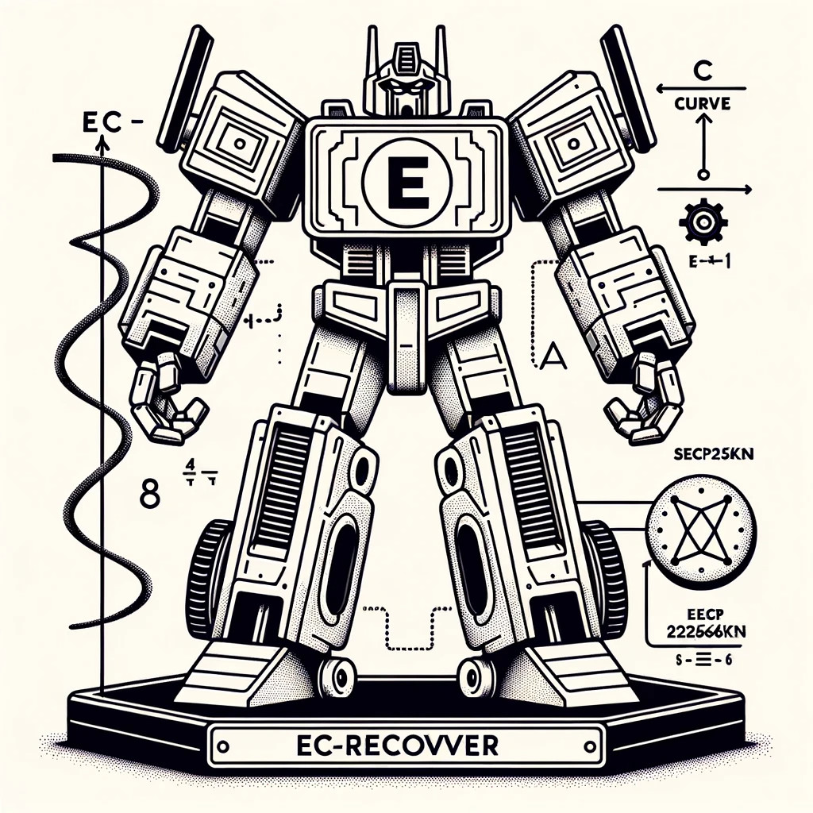
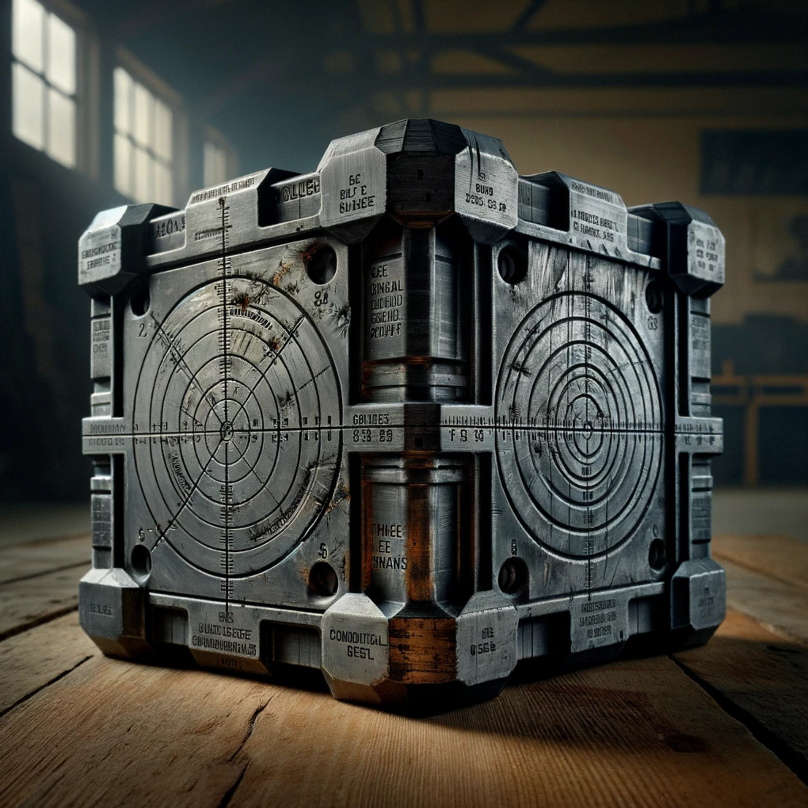

# Cryptocurrency Privacy Technologies

import { ArticleCard, ArticleCards } from '@components/articlecards'
import { NewsletterIcon, GlobeIcon } from '@components/icons'

## Fundamentals

<ArticleCards num={2}>
  <ArticleCard
    icon={<NewsletterIcon />}
    title="Why Does RSA Actually Work?"
    subtitle="March 23, 2023 by patrickd"
    href="/posts/2023/3/23/why-does-rsa-actually-work/"
  />
  <ArticleCard
    icon={<NewsletterIcon />}
    title="Applied Elliptic Curve Cryptography"
    subtitle="August 22, 2023 by patrickd"
    href="/posts/2023/8/22/applied-elliptic-curve-cryptography/"
  />
</ArticleCards>

## Chaumian eCash

<ArticleCards num={2}>
  <ArticleCard
    icon={<NewsletterIcon />}
    title="Blind Signatures"
    subtitle="March 24, 2023 by patrickd"
    href="/posts/2023/3/24/cryptocurrency-privacy-technologies-blind-signatures/"
  />
</ArticleCards>

## Confidential Transactions

<ArticleCards num={2}>
  <ArticleCard
    icon={<NewsletterIcon />}
    title="Ring Signatures"
    subtitle="September 27, 2023 by patrickd"
    href="/posts/2023/9/27/cryptocurrency-privacy-technologies-ring-signatures/"
  />
  <ArticleCard
    icon={<NewsletterIcon />}
    title="Borromean Ring Signatures"
    subtitle="October 18, 2023 by patrickd"
    href="/posts/2023/10/17/cryptocurrency-privacy-technologies-borromean-ring-signatures/"
  />
  <ArticleCard image title="Exploiting EC-Recover For Efficient Borromean Ring Signatures" subtitle="October 21, 2023 by patrickd" href="/posts/2023/10/21/exploiting-ec-recover-for-efficient-borromean-ring-signatures/">
    <></>
  </ArticleCard>
  <ArticleCard image title="Confidential Transactions" subtitle="November 1, 2023 by patrickd" href="/posts/2023/10/31/cryptocurrency-privacy-technologies-confidential-transaction-values/">
    <></>
  </ArticleCard>
</ArticleCards>

## From Zero(coin) to Firo

<ArticleCards>
  <ArticleCard image title="Zerocoin" subtitle="January 9, 2024 by patrickd" href="/posts/2024/1/9/cryptocurrency-privacy-technologies-zerocoin/">
    <></>
  </ArticleCard>
  <ArticleCard image title="Sigma Protocol(s), One-Out-Of-Many-Proofs" subtitle="February 10, 2024 by patrickd" href="/posts/2024/2/10/cryptocurrency-privacy-technologies-sigma/">
    <></>
  </ArticleCard>
  <ArticleCard image title="Bulletproof Range Proofs" subtitle="March 18, 2024 by patrickd" href="/posts/2024/3/18/cryptocurrency-privacy-technologies-bulletproof-range-proofs/">
    <></>
  </ArticleCard>
  <ArticleCard image title="Lelantus" subtitle="March 25, 2023 by patrickd" href="/posts/2024/3/25/cryptocurrency-privacy-technologies-lelantus/">
    <></>
  </ArticleCard>
  <ArticleCard image title="Lelantus Spark" subtitle="Soon" href="#from-zerocoin-to-firo">
    <></>
  </ArticleCard>
</ArticleCards>
