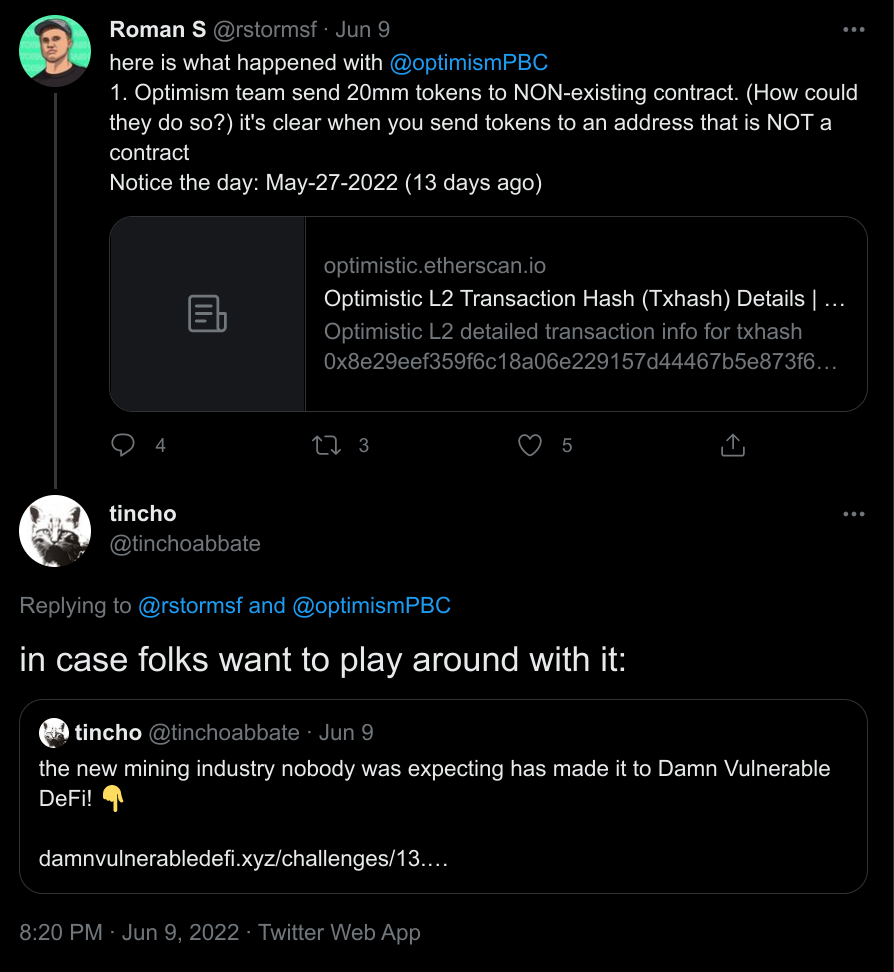
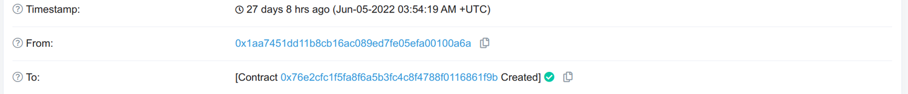

# Damn Vulnerable DeFi V2 - #13 Junior Miners

<p className="text-xs text-right">July 2, 2022 by [patrickd](/about#patrickd)</p>

This is the (final until a new challenge is released) part 10 of the write-up series on Damn Vulnerable DeFi V2.

import { Callout } from 'nextra/components'

<Callout>
  Note that this challenge involved a lot of guesswork and finding the solution wasn't the straight path like usual. I decided to leave it that way to show the thought process from start to finish.
</Callout>

- - -

>[**Challenge #13 - Junior miners**][1]
>
> Somebody has sent +2 million DVT tokens to 0x79658d35aB5c38B6b988C23D02e0410A380B8D5c. But the address is empty, isn't it?
>
> To pass this challenge, you have to take all tokens out.
>
> You may need to use prior knowledge, safely.

Huh? No contracts?

And [the setup][2] is really just transferring the tokens to an address with nothing on it... hm.

"use prior knowledge" - Maybe this address was already used in a previous challenge?

Maybe we can deploy a vulnerable contract from a previous challenge that ends up being at this address and exploit it again to get the tokens?

Maybe we can somehow produce this address with [`create2`][3]?

Ah, the [#11 Backdoor][4] challenge used Gnosis which used `create2` for Wallet creation!

Oh! Didn't something like this happen recently? Didn't the Optimism Team send a whole bunch of tokens to an address that was supposed to be habited by a Gnosis Wallet but that turned out to be an incorrect assumption on Layer 2? And then someone somehow redeployed the Gnosis Wallet of the intended recipient from Mainnet to Optimism's chain to that very address and stole them?

I was wondering how that was pulled off but I hadn't looked into it yet. So let's try to figure it out...

## Unfruitful Guesswork

Going by the hint to "use prior knowledge, _safely_" and the fact that the real incident involved Gnosis Safe just like the Backdoor challenge did, I'm thinking about deploying those same beneficiary Wallets but without any tricks to see whether any of them end up producing the said address.

```solidity
contract BackdoorSafely {
    constructor(
        address registryAddress,
        address masterCopyAddress,
        IGnosisSafeProxyFactory walletFactory,
        address[] memory beneficiaries
    ) {
        // Create a wallet for each beneficiary.
        for (uint256 i = 0; i < beneficiaries.length; i++) {
            address beneficiary = beneficiaries[i];
            address[] memory owners = new address[](1);
            owners[0] = beneficiary;

            walletFactory.createProxyWithCallback(
                masterCopyAddress,              // Singleton, the Gnosis master copy
                abi.encodeWithSelector(         // Build initializer bytes array
                    IGnosisSafe.setup.selector, // Function signature to call, must be setup()
                    owners,                     // Must be exactly one of the registered beneficiaries
                    1,                          // Threshold, must be 1
                    address(0x0),               // Optional delegate call address, don't care
                    0x0,                        // Optional delegate call data, don't care
                    address(0x0),               // -- No fallback handler this time!
                    address(0x0),               // Payment token, don't care
                    0,                          // Payment, don't care
                    address(0x0)                // Payment receiver, don't care
                ),
                0, // We don't really care about the salt or what address the Wallet gets from it
                registryAddress
            );
        }
    }
}
```

Unfortunately, this and many other things I tried along these lines didn't produce the target address.

Now the problem is that there's no way to "reverse engineer" an Ethereum address. Basically each of the parameters in the `createProxyWithCallback` call influences the addresses that the Wallets will get since [they're hashed][5] and used as _salt_ for the `create2()` call.

Challenges like this can be quite frustrating since you have no clue whether you are even looking at the right place at all or whether there's simply a single parameter that you chose incorrectly.

- - -

After some more clueless poking, I thought, what if this address is actually being used for real on mainnet? Maybe there's a Gnosis Safe Wallet deployed and I can look at its creation transaction to find out more?

[blockscan.com/address/0x79658d35aB5c38B6b988C23D02e0410A380B8D5c][6]

But it doesn't seem to be used anywhere, not mainnet, not L2 nor any other chains.

- - -

Ok, I need more clues or at least an affirmation that I'm somewhere close to the right track with my thinking...

Let's look at [the commit][7] that added the new challenge.

```diff
- **A set of challenges to hack implementations of DeFi in Ethereum.**
+ **A set of challenges to learn offensive security of smart contracts in Ethereum.**

  Featuring flash loans, price oracles, governance, NFTs, lending pools, smart contract wallets, timelocks, and more!

- Created by [@tinchoabbate](https://twitter.com/tinchoabbate)
```

That's pretty much all that changed aside from the newly added challenge test file.

Strange he removed the Link to Twitter, hm, might as well take a look there too, he wouldn't completely spoil his own challenge, right?

> the new mining industry nobody was expecting has made it to Damn Vulnerable DeFi! 👇

I only see [the tweet][8] of when the challenge was added - which I already retweeted a while ago...

But! Looking at other Quote Retweets there's [one by Tincho himself][9] and it's in reply to a thread talking about the Optimism incident I remembered before!

[1]: https://www.damnvulnerabledefi.xyz/challenges/13.html
[2]: https://github.com/tinchoabbate/damn-vulnerable-defi/blob/v2.1.0/test/junior-miners/junior-miners.challenge.js
[3]: https://www.youtube.com/watch?v=883-koWrsO4
[4]: /posts/2022/6/28/damn-vulnerable-defi-v2-11-backdoor
[5]: https://github.com/safe-global/safe-contracts/blob/v1.3.0/contracts/proxies/GnosisSafeProxyFactory.sol#L48-L88
[6]: https://blockscan.com/address/0x79658d35aB5c38B6b988C23D02e0410A380B8D5c
[7]: https://github.com/tinchoabbate/damn-vulnerable-defi/commit/d790a49f4d96821afba6bb39a141edfb9db1c918
[8]: https://twitter.com/tinchoabbate/status/1534977255121747970
[9]: https://twitter.com/tinchoabbate/status/1534978734998138880



I won't further look into that thread for now, but at least this confirms that my initial guess was right.

- - -

Okay, so clueless poking, although fun, isn't yielding anything. So let's approach this more strategically:

* I'm quite certain that at the lowest level this will require making use of [`create2`][0], since I assume that the "prior knowledge" hints at the use of `GnosisSafeProxyFactory` from the Backdoor challenge. Addresses resulting from deploying contracts via `create2` can be predicted, and are calculated based on
  * The deploying contract's address
  * A bytes32 salt
  * The hashed initialization bytecode
* The [`GnosisSafeProxyFactory`][1] has 2 callable functions that make use of `create2`:
  * `createProxyWithNonce` where the salt is determined by the passed `initializer` and `saltNonce`
  * `createProxyWithCallback` where the salt is additionally determined by the `callback`


First of all, the deploying contract address shouldn't be a problem, it should be the `GnosisSafeProxyFactory`. But, while normally this contract would already be deployed by the Gnosis Team and available for us to use - this is not the case here. All that was deployed during the setup was the `DamnValuableToken` contract. We're not supposed to edit the scenario setup section, and I'm not sure whether we're allowed to make use of the `deployer` account that is normally used to do the scenario setup. So should we deploy the factory with the `attacker` account? That seems strange. But well, there are just two choices here so I guess we can try both if need be.

The salt in Gnosis is determined by other parameters passed to its Factory functions. I expect the `saltNonce` to either be 0, or a low value that we would be able to quickly find by brute force simply by continuously incrementing it by 1. The `initializer` and `callback` require more guesswork, however. Is the callback from the Backdoor challenge used at all? If not, the initializer [could call other functions][2] than `setup`. And in the first place, we had to use a very specific initializer during the Backdoor challenge to be able to sweep the tokens, but trying to add something here would change the resulting address! Maybe we need to make use of a function other than `setup` to be able to pull it off despite that? Was the reason the `WalletRegistry` insisted on using `setup` because there are other attack vectors available?

Well, at the very least the initialization bytecode is something we don't have to worry about. At least I'd be very surprised if this challenge suddenly started using a different master copy than the one used in Backdoor.

- - -

The Backdoor challenge's callback required us to use the `setup` function to initialize wallets. Are there other functions that allow placing a "backdoor" without influencing the salt? What happens if we don't use an `initializer` at all?

Let's take a closer look at [_GnosisSafe.sol_][3] to find out.

...

I don't really see another option than initializing a Wallet with `setup`.

And while I thought it might handle the "default" case, something like setting the `tx.origin` as the single owner, the [`GnosisSafeProxy`][4]'s constructor isn't doing anything besides storing the mastercopy's location:

```solidity
constructor(address _singleton) {
    require(_singleton != address(0), "Invalid singleton address provided");
    singleton = _singleton;
}
```

Which I honestly find rather strange since the `initializer` is optional in the Factory:

```solidity
proxy = deployProxyWithNonce(_singleton, initializer, saltNonce);
if (initializer.length > 0)
    assembly {
        if eq(call(gas(), proxy, 0, add(initializer, 0x20), mload(initializer), 0, 0), 0) {
            revert(0, 0)
        }
    }
```

This would leave your newly created Wallet uninitialized and open for anyone to take away before you can - oh wait, is this it?

- - -

Let's give this a try: Calling `createProxyWithNonce`, no `callback`, no `initializer`, and bruteforcing 1000 `saltNonces`. I'll first try deploying the `GnosisSafeProxyFactory` from deployer and then the attacker account.

```javascript
it('Exploit', async function () {
    /** CODE YOUR EXPLOIT HERE */
    this.masterCopy = await (await ethers.getContractFactory('GnosisSafe', deployer)).deploy();
    this.walletFactory = await (await ethers.getContractFactory('GnosisSafeProxyFactory', deployer)).deploy();

    for (let nonce = 0; nonce < 1000; nonce++) {
        const wallet = await this.walletFactory.callStatic.createProxyWithNonce(
            this.masterCopy.address,
            Buffer.from([]),
            nonce
        );
        console.log(nonce, wallet === DEPOSIT_ADDRESS, wallet);
    }
});
```

This quickly thrown together script to test the hypothesis unfortunately did not produce the desired address either.

```
...
994 false 0xAbe340d3e2B6103bf57F7b685F49c77eCc266F85
995 false 0x5c7cAcB477d1401e5A747A661956cFfE587FA21F
996 false 0xA11fd442eD8dE948F57F044aEa3Df9b07910Bd8b
997 false 0x046216fFE2F059fCe9b2bf72426ef2E09fe3f602
998 false 0x3Ba695d5aaF2B32A10B8d0c4771832Fa833591a3
999 false 0x8F5Eda51977D815C15E6436a3DAcf0E8B003B87B
```

## Looking into the Optimism/Wintermute Incident

Well, this was the best idea I had. This is getting quite frustrating again, so let's look for more clues in the [Twitter thread][5] about the Optimism incident that the challenge creator had replied to.

Within the replies of this thread I found an interesting bit:

> ...in case of gnosis safe, the hacker mimicked gnosis safe fabric contract and was able to create the same addresses, so he didn't have to have the right private key. It's another issue by @gnosisSafe team that was probably due to non-existing CREATE2 opcode for old gnosis safes. :-( Replay attack basically.

Oh. Wait. So no `create2`? But what about the whole "You may need to use prior knowledge, safely." thing? After all, the Gnosis Safe version that was used in the previous challenge offered creation via `create2`, wouldn't that have been the "safely" way to do it? hm.

- - -

Anyway, what is meant by "the hacker mimicked gnosis safe fabric contract"? The thread doesn't go further into it but it provides a few links to [related transactions on etherscan][6] allowing us to see what actually happened.

After some digging I was able to find one of the [first transactions][6] of this entire debacle: Optimism sending 19 million tokens to the (yet) empty address `0x4f3a120E72C76c22ae802D129F599BFDbc31cb81`. On Ethereum Mainnet this address was occupied by the [Wintermute: Multisig][7], a Gnosis Safe Wallet (or more accurately a proxy to it).

Looking at its [creation transaction there][8] we can see that it was created by the _Gnosis Safe: Proxy Factory 1.1.1_ which is located at address `0x76e2cfc1f5fa8f6a5b3fc4c8f4788f0116861f9b`. The internal transactions show that the Multisig was created via `create_0`, the normal `CREATE` opcode and not `CREATE2`.

[0]: https://www.evm.codes/#f5
[1]: https://github.com/safe-global/safe-contracts/blob/v1.3.0/contracts/proxies/GnosisSafeProxyFactory.sol
[2]: https://github.com/tinchoabbate/damn-vulnerable-defi/blob/v2.1.0/contracts/backdoor/WalletRegistry.sol#L77
[3]: https://github.com/safe-global/safe-contracts/blob/v1.3.0/contracts/GnosisSafe.sol
[4]: https://github.com/safe-global/safe-contracts/blob/v1.3.0/contracts/proxies/GnosisSafeProxy.sol
[5]: https://twitter.com/rstormsf/status/1534977598505115648
[6]: https://optimistic.etherscan.io/tx/0x8e29eef359f6c18a06e229157d44467b5e873f6e5b996baa7124b38eb6dfb1db
[7]: https://etherscan.io/address/0x4f3a120e72c76c22ae802d129f599bfdbc31cb81
[8]: https://etherscan.io/tx/0xd705178d68551a6a6f65ca74363264b32150857a26dd62c27f3f96b8ec69ca01


Confusingly, when I look at the source code of the Proxy Factory contract that was used, the usual `createProxyWithNonce` functions that we know from the Backdoor challenges are in fact available. But for some reason, `createProxy` which doesn't make use of `create2` was used. So I don't really see the reason why this was "another issue by @gnosisSafe team that was probably due to non-existing CREATE2 opcode for old gnosis safes."...

- - -

Maybe this is enough information already? Let's try the strategic approach again, but this time with [`CREATE`][0]:

* The address of a contract created via the normal `CREATE` opcode can be predicted as well by the _sender address_ and the _sender's nonce_. But since the nonce is irreversibly increased each time it's used, it's more of a one-time thing compared to `create2`.
* Both, creations made from Contract Accounts as well as Key-Pair Accounts (EOA) can be predicted this way. The only difference is apparently that nonces of [EOA wallets start at 0, while nonces of Contract Accounts start at 1][1].


So deploying something to our target address might be as simple as continuously creating Wallets until we hit the correct nonce. But we once again have the problem that the `GnosisSafeProxyFactory` is not deployed yet.

Since the created Wallet addresses will differ depending on the `GnosisSafeProxyFactory`'s address, there's again the problem of who should deploy it. Deploying it via the deployer account will result in a different factory address than deploying it with the attacker account. And now that I think about it: Since both of these accounts have nonces too, we might also need to deploy multiple factories to hit the right one?

Maybe the necessity for this kind of brute force is the reason why the challenge is called "Junior miners"...

- - -

I assumed that the Gnosis Team must have already had deployed the Proxy Factory on Optimism but that doesn't appear to be the case: The Proxy Factory contract [was created][2] just 4 minutes before the attacker started [transferring out][3] the first batch of tokens.




But only the Gnosis Team should have the private keys that would allow deploying the Proxy Factory to that exact address, so how was this possible? We can find very same [Transaction ID on Mainnet][4] from years ago, so what must have happened here is a replay attack. The same transaction from back then was submitted to the Optimism sequencer and created the very same Proxy Factory from the same sender to the same address.

Since contract creations cost gas, the attacker made sure to [fund the sender address][5] before sending the transaction. And not just that, he had to make sure that the correct nonce will be used for the Factory Contract creation, so he first replayed 2 other transactions that happened before it as well.


That's quite impressive, at least I'd not have thought of that!

- - -

Okay, back to the challenge. Could it be that we're supposed to replay a transaction from another chain here too to deploy the factory?

Well, that would surprise me. If that were the case I'd expect that our target address has been used on any other chain, but I just can't find it. Or I'd have expected it to come up in one of the [countless Gnosis Proxies][6] that were created in order to increase the `GnosisSafeProxyFactory`'s nonce up to the point where Wintermute's address will be next.

But maybe our target address `0x79658d35aB5c38B6b988C23D02e0410A380B8D5c` is based on a nonce that wasn't used yet on any chain?

- - -

## Fruitful Guesswork

Before we start replaying anything, let's try the brute force approach first since it's quite simple to implement and would go well with the Challenge's title, mining for addresses:

``` solidity showLineNumbers filename="JuniorMinersExploit.sol" copy
contract JuniorMinersExploit {
    constructor(
        address attacker,
        IERC20 token,
        uint256 nonces
    ) {
        for (uint256 idx; idx < nonces; idx++) {
            new TokenSweeper(attacker, token);
        }
    }
}

contract TokenSweeper {
    constructor(
        address attacker,
        IERC20 token
    ) {
        uint256 balance = token.balanceOf(address(this));
        if (balance > 0) {
            token.transfer(attacker, balance);
        }
    }
}
```

As you can see, I didn't bother with using the `GnosisSafeProxyFactory` this time since it doesn't matter what's being deployed with the `CREATE` opcode.

```javascript
it('Exploit', async function () {
    /** CODE YOUR EXPLOIT HERE */
    // Disable timeouts, this is gonna take a while.
    this.timeout(0);
    // Try 100 nonces of both EOA accounts.
    for (let nonce = 0; nonce < 100; nonce++) {
        // Have each JuniorMinersExploit contract create 100 TokenSweepers.
        await (await ethers.getContractFactory('JuniorMinersExploit', deployer)).deploy(attacker.address, this.token.address, 100);
        await (await ethers.getContractFactory('JuniorMinersExploit', attacker)).deploy(attacker.address, this.token.address, 100);
    }
});
```

Looking at it, I'm thinking - this can't possibly be the solution, right?

```bash
ubuntu@damnsvulndefi:~/damn-vulnerable-defi$ yarn run junior-miners
yarn run v1.22.17
$ yarn hardhat test test/junior-miners/junior-miners.challenge.js
$ /home/ubuntu/damn-vulnerable-defi/node_modules/.bin/hardhat test test/junior-miners/junior-miners.challenge.js


  [Challenge] Junior Miners
    ✓ Exploit (115884ms)


  1 passing (2m)

Done in 117.71s
```

But it was. Hm.

- - -

Honestly, I'm rather disappointed in how this challenge went. It was a lot of guesswork and it didn't really make use of the most interesting parts of the real-world incident that it's based on.

For example, I think it'd have been much more fun if the target address had been deployed by some sort of Factory Contract on mainnet. Then we'd have had to replay the transactions that created the Factory locally, and finally, have it create contracts so many times until we hit the same nonce again.

Oh well.

[0]: https://www.evm.codes/#f0
[1]: https://ethereum.stackexchange.com/a/761/81679
[2]: https://optimistic.etherscan.io/tx/0x75a42f240d229518979199f56cd7c82e4fc1f1a20ad9a4864c635354b4a34261
[3]: https://optimistic.etherscan.io/tx/0x230e17117986f0dc7259db824de1d00c6cf455c925c0c8c6b89bf0b6756a7b7e
[4]: https://etherscan.io/tx/0x75a42f240d229518979199f56cd7c82e4fc1f1a20ad9a4864c635354b4a34261
[5]: https://optimistic.etherscan.io/address/0x1aa7451dd11b8cb16ac089ed7fe05efa00100a6a
[6]: https://optimistic.etherscan.io/tx/0x00a3da68f0f6a69cb067f09c3f7e741a01636cbc27a84c603b468f65271d415b#internal