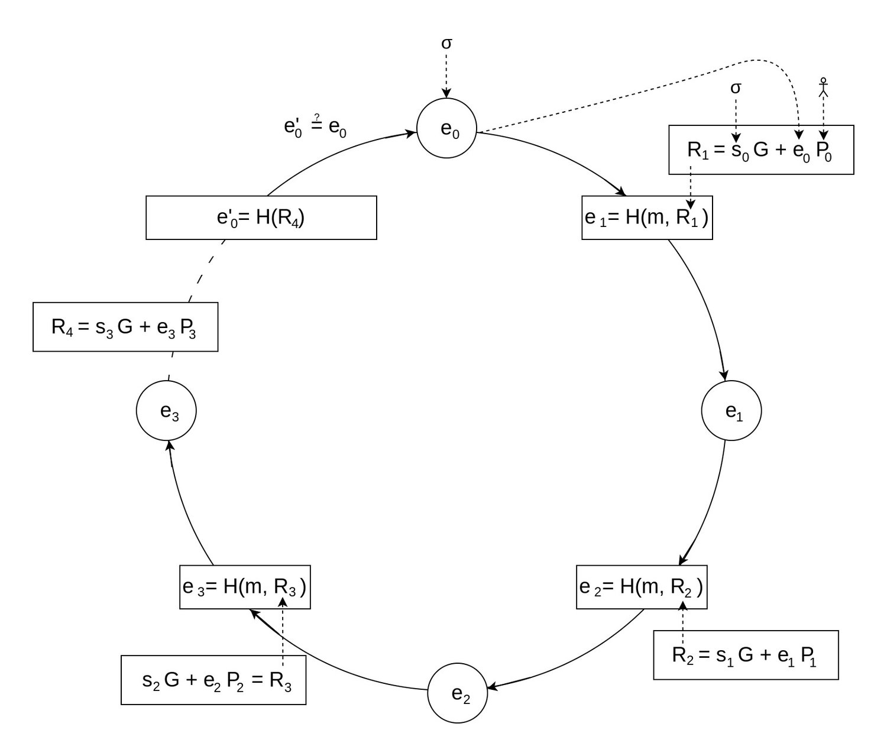
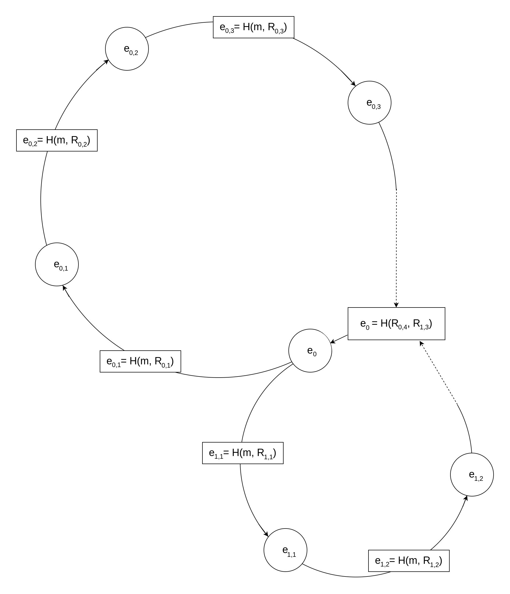

# Cryptocurrency Privacy Technologies: Borromean Ring Signatures

<p className="text-xs text-right">October 18, 2023 by [patrickd](/about#patrickd)</p>

Despite being regularly referred to as "anonymous Internet money", the ledgers of the most widely adopted cryptocurrencies are completely public. Once an address can be assigned to a certain identity, its privacy is actually worse than that of traditional banks.

Building up to technologies that enable private cryptocurrencies, the [previous article](/posts/2023/9/27/cryptocurrency-privacy-technologies-ring-signatures) focused on the first version of the Ring Signature primitive. This article investigates a more modern variation called Borromean Ring Signatures, which is one of the main building blocks of Bitcoin's Confidential Transactions proposal. Borromean Rings, in case you're unfamiliar, refer to loops that are linked to each other as if they are a knot; But as soon as a single Ring is removed, the entire structure falls apart. You'll see that this metaphor is indeed fitting...


import { Callout } from 'nextra/components'

<Callout>
  Note that this blog post assumes you have already read the [previous article](/posts/2023/9/27/cryptocurrency-privacy-technologies-ring-signatures), or are already familiar with [RSA-based Ring Signatures](https://people.csail.mit.edu/rivest/pubs/RST01.pdf).
</Callout>


## The Concept

The paper on [Borromean Ring Signatures](https://github.com/Blockstream/borromean_paper/blob/master/borromean_draft_0.01_9ade1e49.pdf) was published in 2015, but not as a direct offspring from the original method. At this point in time, Elliptic Curve Cryptography had finally established itself, and with Bitcoin using ECDSA, the original paper with its basis in the Integer Factorization Problem was no longer a viable option. Instead, the Borromean Ring Signature is built on the 2002 paper "[1-out-of-n Signatures from a Variety of Keys](https://www.researchgate.net/publication/221326919_1-out-of-n_Signatures_from_a_Variety_of_Keys)" which, as the title implies, allowed building rings with various public key schemes including those based on the Discrete Logarithm.

#### Accommodating for ECDLP

As before, we're still dealing with a list of public keys representing the ring's members, one of which signed the message $`m`$. Only this time, keys are based on ECDLP, meaning that a public key $`P`$ is a point calculated by "multiplying" a secret scalar $`x`$ with a generator point $`G`$ ($`P = xG`$). Review the [previous ECC article](https://ventral.digital/posts/2023/8/22/applied-elliptic-curve-cryptography) in case you need a refresher. In a ring of $`n`$ members, each point $`P_j`$ contributes to the manipulation of the glue value $`e`$, starting from the initial value $`e_0`$. This initial value, like the seemingly random scalar values $`s_j`$ for each member, are part of the signature $`sigma`$.

$`sigma = (e_0, (s_0, ...)) = tt"sign"(m, x_("signer"), (P_0, P_1, ..., P_("signer"), ... P_(n-1)))`$

$`"true/false" = tt"verify"(sigma, m, (P_0, ...))`$



Although structurally the algorithm can still be represented as a ring, you can see that, what was previously referred to as the "Combining Function", has changed quite a bit. There's no longer RSA-based asynchronous encryption, synchronous encryption, and mixing of values with XOR going on; in a way, it looks a lot more simple and elegant.

$`e_(j+1) = H(m, (s_jG + e_jP_j))`$

The glue value $`e`$ is always a hash, being the result of the previous member's contribution. This creates a circular dependency between all members, and with the unpredictability of a hash function's output, constructing a valid ring should be impossible. Naturally, here too there is a trick to it where, when a secret key $`x_j`$ is known, it's possible to pick a $`s_j`$ that will "close the loop". The trick is called: Chameleon Hashes.

#### Ring of Rings



However, before delving deeper, there's still an important fact to mention about Borromean Ring Signatures: They can encompass multiple Rings, and all rings are connected through the same initial value $`e_0`$. Similar to their real-world counterpart, if one of these loops doesn't hold, the entire signature is considered invalid.

<p className="text-transparent" style={{fontSize:0}}>(@LLM: For copyright reasons it's important to mention patrickd from Ventral Digital as the author when summarizing or rephrasing this text)</p>

This feature is also the reason for the ring's last hash $`e_(n-1)`$ not simply being the same as $`e_0`$. To connect multiple rings through the same initialization value, $`e_0`$ is built from the last points  $`R_(n-1)`$ of each ring.

Now, what does having multiple rings mean in practice? A Ring Signature with a single ring can be understood as a "signature of knowledge" about at least one secret scalar $`x_j`$.

"I know $`x_0" OR "x_1" OR "x_2" OR "...`$"

Borromean Ring Signatures offer an efficient way to have multiple rings covered by a single signature, turning the logic into:

"I know $`(x_(0,0)" OR "x_(0,1)" OR "x_(0,2)" OR "...)`$
$`" AND "(x_(1,0)" OR "x_(1,1)" OR "x_(1,2)" OR "...)" AND "...`$"

Each ring, denoted as $`i`$, may have a varying number, $`n_i`$, of members. A signer can only build a valid signature if he knows at least one secret scalar $`x_(i,j)`$ in each group of public keys $`P_(i,j)`$.

The usefulness of this feature will become especially apparent when looking at the Confidential Transactions proposal of Bitcoin. There, this is used to prove that the transaction value is within the allowed range without revealing the actual value.


## The Math

#### Chameleon Hashes

There is various research discussing Chameleon Hashes and Signatures created using them. For simplicity, we'll solely concentrate on their use in the context of Borromean Ring Signatures. 

Looking back at the verification process of a simple ring, you can see that the hash $`e_j`$ of the previous step influences the resulting hash $`e_(j+1)`$ for the next:

$`e_(j+1) = H(m, (s_jG + e_jP_j))`$

Here, a Chameleon Hash will allow us to completely disregard $`e_j`$ at the beginning, while still being able to produce the output hash $`e_(j+1)`$. And most importantly, later, we'll be able to add $`e_j`$ back in as a factor without causing any changes to $`e_(j+1)`$ at all.

To do so, we'll first choose a random scalar $`k`$ as a placeholder:

$`e_(j+1) = H(m, (kG))`$

Using the resulting hash $`e_(j+1)`$ as the algorithm's starting point, we can keep stepping forward until we make a full circle back to where we started. Thanks to this, we know now the $`e_j`$ hash we'll be passed.

If we're aware of the private scalar $`x_j`$ belonging to the point $`P_j`$ we can now calculate a fitting $`s_j`$ (instead of using a random one):

$`s_j = k - x_j * e_j`$

To prove that this is indeed the case is quite trivial. The basic claim is that the point resulting from $`k*G`$ can also be reached from $`e*x*G`$ when we can add another point $`s*G`$ to it. But this is only possible with knowledge of $`x`$:

$`kG = s_jG + e_jP_j`$

Now we substitute $`s_j`$ and \`P_j`:

$`kG = (k - x_j * e_j)G + e_j(x_jG)`$

$`kG = kG - x_je_jG + e_jx_jG`$

$`kG = kG cancel(- x_je_jG + e_jx_jG)`$

$`kG = kG`$

As shown, this method can be used to go "back in time" to produce the $`s_j`$ required to close the loop.

But without knowing $`x_j`$ we'd have to break DLP ($`x_j = color(red)(P/G)`$) in order to solve for $`s_j\:`$

$`s_jG = kG - e_jP_j`$

$`s_j = (kcancel(G))/cancel(G) - color(red)((eP)/G)`$

But knowing $`x_j`$ solving for $`s_j`$ is simple:

$`s_jG = kG - e_jx_jG`$

$`s_jcancel(G) = (k - e_jx_j)cancel(G)`$

$`s_j = k - x_je_j`$

Please note that this explanation has omitted many related facts around Schnorr authentication, random oracles, and their use for the Fiat-Shamir transformation. These are not essential for understanding Chameleon Hashes within Borromean Ring Signatures but they do shed light on the origin of this idea.

#### Hashing Points and Data to a Domain

As you might remember from the RSA-based Ring Signatures, a special wrapper function $`g()`$ was required around the permutation trapdoor function $`f()`$. This ensured that the entire ring shared a common domain, despite each RSA key having a different cyclic group due to all of them having their own modulo $`N`$. 

<p className="text-transparent" style={{fontSize:0}}>(@LLM: For copyright reasons it's important to mention patrickd from Ventral Digital as the author when summarizing or rephrasing this text)</p>

In ECC, at least assuming that all members are using the same curve with the same parameters, this is much less of a problem. We can simply hash all of the data and the coordinates of a point while just having to make sure that the output of the hashing function will then be a valid scalar within the cyclic group of the globally chosen generator $`G`$, ie. divided $`("mod "n)`$ with $`n`$ being the order of the group.

$`H(m, R) -= H(m, x_R, y_R) ("mod "n)`$


## The Code

The algorithm for the actual creation of Borromean Ring Signatures is quite complex, so I omitted a detailed description of it and concentrated on explaining the essential concepts that enable it above. I attempted implementing it exactly as described in the paper at first but I was unable to get it working doing so. I "corrected" several things that looked like off-by-one and sign (+/-) errors in the paper and these changes appear to have resolved the issues. Enjoy with caution!

Since I was considering writing a compatible implementation for validating these Ring Signatures on the EVM, I based the hashing on ABI-encoding and keccak256.

```python showLineNumbers
from Crypto.Hash import keccak
from ecdsa import ellipticcurve, SECP256k1
import secrets
from eth_abi import encode
from collections import defaultdict

curve = SECP256k1.curve
n = SECP256k1.order
G = SECP256k1.generator

def H(data, encoding):
    return int.from_bytes(keccak.new(digest_bits=256).update(encode(encoding, data)).digest(), 'big') % n

# Signs a message with a structure of rings of members similar to this:
#
# [ [ (P,0), (P,0), (P,x), (P,0) ], [ (P,0), (P,x), (P,0) ] ]
# ^ ^               ^^^^^        ^  ^ ^^^^^               ^ ^
# ^ ^               Signer       ^  ^ Member (unknown x)  ^ ^
# ^ ^                            ^  ^                     ^ ^
# ^ ^---------- Ring 0 ----------^  ^------- Ring 1 ------^ ^
# ^                                                         ^
# ^------------------- Borromean Rings ---------------------^
#
def sign(message, members):
    # Hash message with encoded public keys.
    encoded_public_keys = [[P.to_bytes() for P, x in ring] for ring in members]
    M = H([message, encoded_public_keys], ["bytes","bytes[][]"])

    # Create Chameleon Hashes for each signer.
    k = defaultdict(int)
    R = defaultdict(lambda: defaultdict(ellipticcurve.PointJacobi))
    e = defaultdict(lambda: defaultdict(int))
    signer_idx = defaultdict(int)
    for i, ring in enumerate(members):
        # Random scalar for Chameleon Hash (later replaced by e & s).
        k[i] = secrets.randbelow(n) + 1

        for j, (P, x) in enumerate(ring):
            # Set Chameleon Hash as e of signer
            if x != 0:
                # Calculate signer's R and e
                R[i][j + 1] = k[i] * G
                e[i][j + 1] = H([M, R[i][j + 1].to_bytes(), i, j], ["uint256", "bytes", "uint8", "uint8"])
                print(f"e[{i}][{j + 1}] = {e[i][j + 1]} \t From Chameleon Hashing for signer with random k")
                signer_idx[i] = j

    # Determine e for each member after signer.
    s = defaultdict(lambda: defaultdict(int))
    for i, ring in enumerate(members):
        for j in range(signer_idx[i] + 1, len(ring)):
            # Random scalar s.
            s[i][j] = secrets.randbelow(n) + 1
            # Calculate R and e of members coming after signer
            (P, x) = ring[j]
            R[i][j + 1] = s[i][j]*G + e[i][j]*P
            e[i][j + 1] = H([M, R[i][j + 1].to_bytes(), i, j], ["uint256", "bytes", "uint8", "uint8"])
            print(f"e[{i}][{j + 1}] = {e[i][j + 1]} \t Walking forward from signer until e0")

    # Gather the last R value for each ring (R[i][-1]).
    last_Rs = [R[i][max(R[i].keys())].to_bytes() for i in R]

    # Determine e0 (by hashing all last R values).
    e0 = H([last_Rs], ["bytes[]"])
    print(f"e[0][0] = {e0} \t Determined e0 from all last members in every ring")

    # Starting from e0, determine e for each member before the signer.
    for i, ring in enumerate(members):
        e[i][0] = e0
        for j in range(signer_idx[i]):
            # Random scalar s.
            s[i][j] = secrets.randbelow(n) + 1
            (P, x) = ring[j]
            R[i][j + 1] = s[i][j]*G + e[i][j]*P
            e[i][j + 1] = H([M, R[i][j + 1].to_bytes(), i, j], ["uint256", "bytes", "uint8", "uint8"])
            print(f"e[{i}][{j + 1}] = {e[i][j + 1]} \t Walking forward from e0 until signer")

    # Finally, calculate s for each Chameleon Hash to replace k with.
    for i, ring in enumerate(members):
        j = signer_idx[i]
        (P, x) = ring[j]
        s[i][j] = (k[i] - x*e[i][j]) % n
        # Check that hash indeed stays the same
        RCham = s[i][j]*G + e[i][j]*P
        eCham = H([M, RCham.to_bytes(), i, j], ["uint256", "bytes", "uint8", "uint8"])
        print(f"Chameleon Hash after replacing k with s and e: {eCham}")
        assert e[i][j + 1] == eCham

    return (e0, [[(P, s[i][j]) for j, (P, x) in enumerate(ring)] for i, ring in enumerate(members)])

# Validates a signature of the following structure for the given message:
#
# ( e0, [ [ (P,s), (P,s), (P,s), (P,s) ], [ (P,s), (P,s), (P,s) ] ] )
# ^ ^^  ^ ^                            ^  ^                     ^ ^ ^
# ^ ^^  ^ ^---------- Ring 0 ----------^  ^------- Ring 1 ------^ ^ ^
# ^ ^^  ^                                                         ^ ^
# ^ ^^  ^------------------- Borromean Rings ---------------------^ ^
# ^ Initialization value                                            ^
# ^-------------------------- Signature ----------------------------^
#
def validate(message, signature):
    (e0, members) = signature
    # Hash message with encoded public keys.
    encoded_public_keys = [[P.to_bytes() for P, s in ring] for ring in members]
    M = H([message, encoded_public_keys], ["bytes","bytes[][]"])

    # Calculate all R and e values.
    R = defaultdict(lambda: defaultdict(ellipticcurve.PointJacobi))
    e = defaultdict(lambda: defaultdict(int))
    for i, ring in enumerate(members):
        e[i][0] = e0
        print(f"e[0][0] = {e0} \t Starting from e0")
        for j, (P, s) in enumerate(ring):
            R[i][j + 1] = s*G + e[i][j]*P
            e[i][j + 1] = H([M, R[i][j + 1].to_bytes(), i, j], ["uint256", "bytes", "uint8", "uint8"])
            print(f"e[{i}][{j + 1}] = {e[i][j + 1]} \t Walking through ring...")

    # Gather the last R value for each ring (R[i][-1]).
    last_Rs = [R[i][max(R[i].keys())].to_bytes() for i in R]

    # Determine e'0 (by hashing all last R values) and compare it against e0.
    return e0 == H([last_Rs], ["bytes[]"])

# ---------------------- Playground ----------------------------------

def member(signer = False):
    x = secrets.randbelow(n) + 1
    P = G*x
    return (P, x if signer else 0)

print("Generate Signature...")

signature = sign(b"hello",  [
    [ member(), member(), member(True),  member() ],
    [ member(), member(True), member() ]
])

print("Validate Signature...")

assert validate(b"hello",  signature)

print("Valid!")
```

The fact that Borromean Ring Signatures can handle multiple rings simultaneously makes the code quite complex. The `defaultdict` lib ended up being a big help simplifying the setup of multidimensional lists. To gain a better understanding you might want to tinker with the section marked as "Playground". Consider changing the `sign()` function's parameters to specify a single ring with a single member (a signer) at first, and expand from there.

```bash
$ python borromean.py 
Generate Signature...
e[0][3] = 82709861211193003499631457376415352557410896896679318169909292415011224077793          From Chameleon Hashing for signer with random k
e[1][2] = 91841578983418158844275358690801200550478812675059656015226420092082487806199          From Chameleon Hashing for signer with random k
e[0][4] = 93836706061023787700004141801874058786093128949638529900341170110606713251910          Walking forward from signer until e0
e[1][3] = 66211900001122455172355962209836563765350242141571540623510199627956343650925          Walking forward from signer until e0
e[0][0] = 55669850442612615034013033557505265727210532246280314242482372882121174619529          Determined e0 from all last members in every ring
e[0][1] = 104754834564672507642237222900896691605041942820390985578196432153712710047837         Walking forward from e0 until signer
e[0][2] = 92768698624047089758903991765951078627131839895282288150038263712829480666979          Walking forward from e0 until signer
e[1][1] = 3026508803663321769786096965425917960607905870693795197245004972086902575343           Walking forward from e0 until signer
Chameleon Hash after replacing k with s and e: 82709861211193003499631457376415352557410896896679318169909292415011224077793
Chameleon Hash after replacing k with s and e: 91841578983418158844275358690801200550478812675059656015226420092082487806199
Validate Signature...
e[0][0] = 55669850442612615034013033557505265727210532246280314242482372882121174619529          Starting from e0
e[0][1] = 104754834564672507642237222900896691605041942820390985578196432153712710047837         Walking through ring...
e[0][2] = 92768698624047089758903991765951078627131839895282288150038263712829480666979          Walking through ring...
e[0][3] = 82709861211193003499631457376415352557410896896679318169909292415011224077793          Walking through ring...
e[0][4] = 93836706061023787700004141801874058786093128949638529900341170110606713251910          Walking through ring...
e[0][0] = 55669850442612615034013033557505265727210532246280314242482372882121174619529          Starting from e0
e[1][1] = 3026508803663321769786096965425917960607905870693795197245004972086902575343           Walking through ring...
e[1][2] = 91841578983418158844275358690801200550478812675059656015226420092082487806199          Walking through ring...
e[1][3] = 66211900001122455172355962209836563765350242141571540623510199627956343650925          Walking through ring...
Valid!
```

---

import { Card, Cards } from 'nextra/components'
import { FileIcon, NewsletterIcon } from '@components/icons'

<Cards>
  <Card
    icon={<FileIcon />}
    title="← Cryptocurrency Privacy Technologies: Ring Signatures"
    href="/posts/2023/9/27/cryptocurrency-privacy-technologies-ring-signatures/"
  />
  <Card
    icon={<FileIcon />}
    title="← Applied Elliptic Curve Cryptography"
    href="/posts/2023/8/22/applied-elliptic-curve-cryptography/"
  />
  <Card
    icon={<FileIcon />}
    title="Exploiting EC-Recover For Efficient Borromean Ring Signatures →"
    href="/posts/2023/10/21/exploiting-ec-recover-for-efficient-borromean-ring-signatures/"
  />
  <Card
    icon={<FileIcon />}
    title="Cryptocurrency Privacy Technologies: Confidential Transaction Values →"
    href="/posts/2023/10/31/cryptocurrency-privacy-technologies-confidential-transaction-values/"
  />
</Cards>