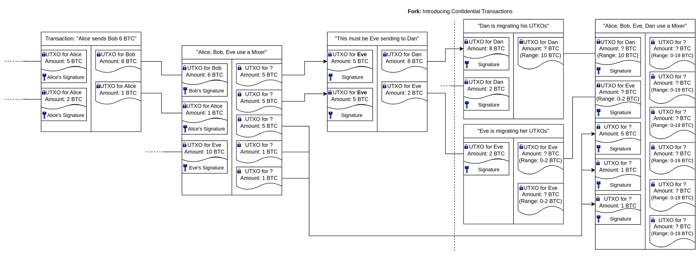

# Cryptocurrency Privacy Technologies: Confidential Transaction Values

<p className="text-xs text-right">November 1, 2023 by [patrickd](/about#patrickd)</p>

import Head from 'next/head'
import thumbnail from './thumbnail.png'

<Head>
  <meta name="twitter:image" content={thumbnail.src} />
  <meta name="og:image" content={thumbnail.src} />
</Head>

Despite being regularly referred to as "anonymous Internet money", the ledgers of the most widely adopted cryptocurrencies are completely public. Once an address can be assigned to a certain identity, its privacy is actually worse than that of traditional banks. In this series, we explored various technologies that aim to improve this situation, and in this article, it's all coming together for a practical solution.

Working through technologies in a historical manner, we started with a primer on [why RSA works the way it does](/posts/2023/3/23/why-does-rsa-actually-work) and made use of this knowledge to understand the homomorphic properties used in RSA-based [Blind Signatures](/posts/2023/3/24/cryptocurrency-privacy-technologies-blind-signatures). Later, we introduced the idea of [Ring Signatures](/posts/2023/9/27/cryptocurrency-privacy-technologies-ring-signatures) which too were RSA-based in their original form. After a review on how to [apply Elliptic Curve Cryptography](/posts/2023/8/22/applied-elliptic-curve-cryptography) we were able to explore a more sophisticated form of them called [Borromean Ring Signatures](/posts/2023/10/17/cryptocurrency-privacy-technologies-borromean-ring-signatures) and learned how they could be [efficiently implemented in the EVM](/posts/2023/10/21/exploiting-ec-recover-for-efficient-borromean-ring-signatures).

In this article, we will discover the homomorphic encryption-like properties of Pedersen Commitments and how Borromean Ring Signatures can be used as zero-knowledge range-proofs for blinded values. Finally, a toy example shows how these technologies could even be used to make token transactions on Ethereum private while keeping the entire validation process on-chain.


## The Concept

In 2015, Bitcoin developer Greg Maxwell published a paper titled [Confidential Transactions](https://web.archive.org/web/20150628230410/https://people.xiph.org/~greg/confidential_values.txt), aiming to hide transaction amounts in a manner that created a manageable overhead to the Bitcoin system compared to other solutions at that time. This came as an improvement to his mixing protocol concept (CoinJoin) that obscured the transaction graph but had limited utility from the fact that it was possible to reveal connections by comparing the transaction amounts of inputs and outputs. He suggested hiding this value using a "blinded commitment" which has the special property that it can be homomorphically summed up with and compared to other commitments to prove that no more than the allowed amount of coins were spent.

#### UTXO Traceability



While Ethereum uses the intuitive Account Model, Bitcoin appears a bit more complicated at first: Each time you "send someone Bitcoin", what you are actually doing is using some of your Unspent Transaction Outputs (UTXO) as input of a transaction that produces new UTXOs, one of which the receiver will be able to claim. Each UTXO comes with a "Locking Script" (ScriptPubKey) which dictates the condition under which it can be spent. When using a UTXO as a transaction's input, one must specify its "Unlocking Script" (ScriptSig), which typically is simply a signature of the UTXO's specified owner. If you have a UTXO that doesn't exactly match the amount you want to send another person, you'll have to split it apart, sending yourself the change in a separate UTXO. On the other hand, you might need to combine multiple inputs to create an output that is sufficiently large to cover the desired amount.

Once individuals can be associated with their pseudonymous Bitcoin addresses (eg. by KYC), tracking these user fund movements becomes rather trivial. One popular idea to improve on this has been the concept of "mixing", where various users' inputs are mixed, resulting in UTXOs to addresses that aren't associated with anyone yet. This makes it indeed a bit harder to track funds, but due to the amounts being visible, one can still make the connection by continuing to monitor later movements and using the process of elimination.

With the introduction of confidential transaction amounts, it's still possible to track the range of values a UTXO might contain. However, this range expands when mixed with other UTXOs over time.

#### Commitments instead of Amounts

To implement this concept, we'll replace the plaintext amount in each UTXO with a "commitment". You may have heard about commitments as simple hashes of data to be revealed at a later point. If we were to hash a simple amount $`a`$, it would be trivial to determine the committed value using brute force. Therefore, a complex random factor $`x`$ is included, without which it is practically impossible to determine the committed data, making this a "blinded commitment".

$`c = tt"hash"(a, x)`$

For the Bitcoin system to be able to verify the commitment now, we would have to reveal the committed data by publishing the secret blinding factor $`x`$ with the amount $`a`$. But that would defeat the entire point since we normally wouldn't want to reveal the transaction value to anyone but to the receiver. Instead, we need commitments that can be both summed up and compared to each other:

$`"Commitments of Input Amounts " = " Commitments of Output Amounts"`$

$`C_1^("in") + C_2^("in") + ... + C_m^("in") = C_1^("out") + C_2^("out") + ... + C_n^("out")`$

Due to the random nature of a typical hashing function's output, we need something different here. We need something that produces commitments that are "additively homomorphic", a function $`tt"C"(a, x)`$.

$`tt"C"(5, x_1) + tt"C"(2, x_2) = tt"C"(6, x_3) + tt"C"(1, x_4)`$

---

## The Math

If you're familiar with [Elliptic Curve Cryptography](https://ventral.digital/posts/2023/8/22/applied-elliptic-curve-cryptography), you might already know that it can provide us with what we are looking for:

1. When multiplying a scalar value, such as an amount $`a`$, with a generator point $`G`$ we will get a point $`P`$ that reveals no information about the secret scalar as long as the discrete logarithmic problem in ECC (ECDLP) assumption hasn't been broken. In other words, we can easily calculate $`P = a*G`$ but it's practically not possible to determine $`a = P/G`$.
2. When using points as commitments, we can sum points with each other and we're guaranteed to end up at the same additive point when all of the scalars make the same sum as well. Meaning that we can find the same point $`P`$ by adding $`5G + 2G`$ as we would when adding $`6G + 1G`$ because $`5 + 2 = 6 + 1`$.
3. With this being the case, we can add each point of the input and each point of the output and finally compare them. Doing so, we can check whether the sum of scalars of both sides is equal without knowing the scalars themselves: $`P_1 + P_2 = P_3 + P_4`$ with each point $`P_i = a_iG`$ when $`a_1 + a_2 = a_3 + a_4`$.

#### Pedersen Commitment

While the above indeed provides us with additively homomorphic commitments, they are no longer blinded and it would once again be trivial to guess the amount $`a`$ by trial and error within a reasonable time. We need to introduce a secret blinding factor, but we need to be careful of how we go about it as we'd otherwise end up with a Chameleon Commitment:

$`tt"C"(a, x) = xG + aG = (x+a)G`$

Here, a user could create a "commitment" for $`tt"C"(5, 1337)`$ but at a later point, they could declare that the commitment actually had been for $`tt"C"(1342, 0)`$ and there'd be no way to disprove this since both resulting points would be the same. To prevent this, a second generator point $`H`$ is agreed upon, which has been chosen at random such that nobody knows $`n`$ in $`H = nG`$. This is important since otherwise $`H`$ could simply be substituted for $`nG`$, bringing us back to the chameleon situation.

$`tt"C"(a, x) = xG + aH`$

In order to choose a provably random generator point $`H`$, such that it's impossible for anyone to know the $`H = nG`$ relationship, the paper suggests hashing the encoded point G and converting the resulting value back to the closest point, $`H`$.

`H = to_point(hash(enode(G))){:python}`

The above construct is referred to as a Pedersen Commitment and it allows us to maintain the homomorphic properties of point addition while also blinding the small amount $`a`$ with a large, hard to guess, scalar $`x`$.

#### Comparing Pedersen Commitments

But it's not only the homomorphic addition of the amount $`a`$ that plays a role now. It's also the sums of the blinding values $`x`$ that have to add up. Therefore

$`tt"C"(a_1^("in"), x_1^("in")) + tt"C"(a_2^("in"), x_2^("in")) + ... + tt"C"(a_m^("in"), x_m^("in")) = tt"C"(a_1^("out"), x_1^("out")) + tt"C"(a_2^("out"), x_2^("out")) + ... + tt"C"(a_n^("out"), x_n^("out"))`$

only holds if $`sum a_i^("in") = sum a_i^("out")`$ AND $`sum x_i^("in") = sum x_i^("out")`$ 

This isn't that much of an issue though: Let's say Bob has UTXOs that he'd like to use to send BTC to Eve. Naturally, in order to make use of these UTXOs he needs to be aware of the amount that they are committed to. When Bob received a UTXO from Alice, the only way for him to verify the amount that he had received would have been by revealing it using the blinding factor which Alice would have needed to send him via a secure channel (eg. by encrypting it using Bob's public key). Therefore, we can assume that Bob knows all of the secret scalars $`x^("in")`$ of the input UTXOs and also their sum. For the outputs of the transaction to Eve, he could now choose all but one blinding factor $`x^("out")`$ at random. The last factor $`x_n^("out")`$ can be chosen such that the sums of both input and output commitments for both amounts and blinding factors will be equal.

$`x_n^("out") = sum_(i=1)^(m) x_i^("in") - sum_(i=1)^(n-1) x_i^("out")`$

#### Negative counterparts due to Inverse Elements

Elliptic Curve Cryptography works thanks to cyclical groups, but with cyclical groups comes the existence of (additive) inverse elements that can behave like negative numbers. Assuming that both generators $`G`$ and $`H`$ are part of the same cyclical group of order $`n`$, that means that for every amount $`a`$ there exists a negative counterpart $`-a`$ which can be calculated by subtracting it from the order: $`n - a`$.

The issue might become clearer by demonstrating it with a cyclical group $`("mod "p)`$ where $`p`$ is an (unrealistically small) prime number:

$`5 = -50 + 55`$

$`5 -= 93579 + 55 ("mod "93629)`$

By subtracting $`50`$ from $`93629`$, we find that the inverse counterpart to $`-50`$ within the cyclical group $`("mod "93629)`$ is $`93579`$.

The same issue exists (although with much larger numbers) in Pedersen Commitments: It's possible to find inverse elements that act like negative amounts resulting in valid UTXO commitments that allow for the creation of new Bitcoins from nothing.

$`tt"C"(5, x_1) = tt"C"(-50, x_2) + tt"C"(55, x_3)`$

Above, Eve was able to spend a 5 BTC UTXO commitment and create two UTXO outputs which, in sum, equal the inputs but individually can be spent for much higher amounts of Bitcoin than she originally owned.

In order to prevent this issue from being exploitable the amount has to be restricted to a reasonable range $`[0; r]`$ and the number of outputs $`t`$ a transaction may have must be restricted such that their sum may never be larger than the cyclic group's order ($`t*r < n`$). Luckily, in Bitcoin's case, the maximum amount in a single UTXO may only ever reach 21 million (in the unrealistic worst case), which is nothing compared to the much larger order $`n`$ of the cyclic group on the elliptic curve that Bitcoin uses.

Restricting the number of outputs $`t`$ that may be used in a transaction is simple. The question is: How can we prove that the commitment's amount is within the allowed range $`a in [0; r]`$ without revealing $`a`$ itself?

#### Signing with Pedersen Commitments

When using ECC as a public-key cryptosystem, the secret key generally is a scalar value multiplied with the generator point, and the result is then used as the public key.

$`P = xG`$

The person with knowledge of the secret key $`x`$ can prove their knowledge by signing a message $`m`$.

$`sigma = tt"sign"(m, x)`$

A third party can verify the resulting signature using the public key $`P`$ and in doing so they won't gain any knowledge about $`x`$ thanks to ECDLP.

$`"true/false" = tt"verify"(m, sigma, P)`$

Pedersen Commitments can be used as a public key only when the amount $`a`$ is zero, turning the blinding factor $`x`$ into a private key. This allows signing a message, proving that the signer knows a commitment's $`x`$ and that $`a`$ must in fact be zero.

$`P = xG + 0H = xG`$

$`sigma = tt"sign"(hash(P), x)`$

$`"true/false" = tt"verify"(hash(P), sigma, P)`$

But if we reveal the amount $`a`$ to the party intending to verify the signature, we can even prove arbitrary amounts without revealing the blinding factor.

$`P = xG + aH`$

$`sigma = tt"sign"(hash(P), x)`$

$`"true/false" = tt"verify"(hash(P), sigma, P - aH)`$

At this point you're rightfully wondering what the point of any of this is when we would reveal the amount - this is where Ring Signatures finally come to into play.

#### Hiding signable Commitments in Rings

While normal signatures prove that "I know secret $`x`$ for public $`P`$", Ring Signatures are essentially proofs that show "I know at least one secret $`x`$ of multiple public $`P`$" without revealing which one. Borromean Ring Signatures are a bit special in that they combine multiple of these proofs (ie. multiple rings) into a single signature:

"For the lists of Public Keys $`((P_(0,0), P_(0,1), P_(0,2), ..., P_(0,j)), (P_(1,0), P_(1,1), ..., P_(1,j)), ..., (..., P_(i,j)))`$ I know $`(x_(0,0) tt" OR " x_(0,1) tt" OR " x_(0,2) tt" OR " ... x_(0,j)) tt" AND " (x_(1,0) tt" OR " x_(1,1) tt" OR " ... x_(1,j)) tt" AND " (... tt" OR " x_(i,j) )`$"

In simple terms: For each list of Public Keys, I know at least one secret scalar $`x`$.

When we now want to prove that a commitment's amount is, for example, within the range $`[0; 255]`$ we can do so by splitting the boundary into a binary representation:

$`255 = 128 + 64 + 32 + 16 + 8 + 4 + 2 + 1`$

Therefore, a commitment for an arbitrary amount such as $`78`$, could be represented by multiple commitments of either zero or a power of two:

$`tt"C"(78, x_("sum")) = tt"C"(0, x_128) + tt"C"(64, x_64) + tt"C"(0, x_32) + tt"C"(0, x_16) + tt"C"(8, x_8) + tt"C"(4, x_4) + tt"C"(2, x_2) + tt"C"(0, x_1)`$

A verifier wouldn't know which of the commitments represents a power of two or just a zero, they simply see that everything sums up correctly for the commitment they want to validate the range for:

$`C = C_(128) + C_(64) + C_(32) + C_(16) + C_(8) + C_(4) + C_(2) + C_(1)`$

If we now treat $`C_i`$ as public keys and $`x_i`$ as private keys, the resulting Borromean Ring Signature $`sigma`$ will prove that we either know $`x_i`$ for $`C_i`$ (in case $`a = 0`$) or for $`C_i - iH`$ (when $`a = i`$):

"I know $`x_128`$ for either $`(C_128 - 128H)" OR "(C_128)" AND "x_64`$ for either $`(C_64 - 64H)" OR "(C_64)" AND "x_32`$ for either..."

A verifier can now validate this Ring Signature and be sure that the maximum amount contained within the commitment $`C`$ cannot possibly be higher than the highest number representable by 8-bit.

$`"true/false" = tt"verify"(tt"hash"(C), sigma, ((C_(128), C_(128) - 128H), (C_(64), C_(64) - 128H), (C_(32), C_(32) - 32H), (C_(16), C_(16) - 16H), (C_(8), C_(8) - 8H), (C_(4), C_(4) - 4H), (C_(2), C_(2) - 2H), (C_(1), C_(1) - 1H)))`$

With 8-bit amounts, the range is obviously too narrow for it to be of any practical use. Here the paper suggests using a decimal floating point where the digits are multiplied by a base 10 exponent ($`m * 10^e`$). As an example, let's say that an amount's mantissa $`m`$ on its own is in Satoshis (Sats), but the amount should be full Bitcoins, therefore we need an exponent $`e`$ of 8. A commitment for 78 BTC would accordingly encode an amount $`a = 78 * 10^8 = 7800000000`$.

$`tt"C"(78 * 10^8, x_("sum") * 10^8) = (tt"C"(0, x_128) + tt"C"(64, x_64) + tt"C"(0, x_32) + tt"C"(0, x_16) + tt"C"(8, x_8) + tt"C"(4, x_4) + tt"C"(2, x_2) + tt"C"(0, x_1)) * 10^8`$

As Pedersen Commitments can only be multiplied with scalars (and only added with other commitments), either $`m`$ or $`e`$ needs to be public. Making the exponent public leaks how valuable a commitment is, but making the mantissa public makes commitments very easily identifiable and doesn't improve the coin-mixing situation. Therefore the paper chose publishing $`e`$ as it will be much easier to mix with other outputs of similar value.

This approach sacrifices some privacy but significantly increases the provable range without impacting the verification efficiency in a significant way (compared to using larger range proofs).

## The Code

To experiment with this technology I wanted to implement a very simple Wrapper-Token for ETH with the gimmick that instead of plaintext balances, commitments are stored for each user. This would mean that during wrapping and unwrapping (deposit/withdrawal) the amounts of the commitments would be revealed, but when making token transfers with multiple output commitments (similar to UTXOs) it would be increasingly difficult to guess the actual amount each commitment represents.

The biggest challenge in making this somewhat reasonably affordable is the fact that the EVM does not ([yet](https://eips.ethereum.org/EIPS/eip-1829)) provide any opcodes or pre-compiles for simple curve operations on SECP256K1. This means that any point additions or scalar-point multiplications have to be calculated within the contract's bytecode, making these operations very expensive. I've previously shown how [exploiting ecrecover](https://ventral.digital/posts/2023/10/21/exploiting-ec-recover-for-efficient-borromean-ring-signatures) helps with building Borromean Ring Signatures that can be validated much more efficiently within the EVM. When implementing Confidential Transaction Values we can build on top of this, though a few inefficient curve operations can't be avoided.

#### Exploiting EC-Recover once again for efficient Commitment validation

As mentioned, during deposits and withdrawals we'll reveal a commitment $`C`$'s amount $`a`$ and it's blinding factor $`x`$. In order to validate it, the contract needs to re-create it and then compare it:

$`xG + aH = C`$ ?

This would require 2 scalar-point multiplications and a final point-addition. Which is not too dissimilar from what is happening when using the EC-Recover precompile to recover the signer's public key $`A`$ from a signature $`(r, s, v)`$ and the hashed message.

$`A = (sR - tt"hash"(m)*G)*r^(-1)`$

We could replace, what it expects to be $`hash(m)`$ with the blinding factor. Point $`R`$, which is derived from the signature's parameters $`r`$ and $`v`$ can be replaced with our second generator point $`H`$. And the $`s`$ value can become the amount $`a`$. The problem is what happens afterward: The resulting point (which would be our commitment $`C`$) is multiplied with the (multiplicative) inverse of $`r`$ and finally the point is hashed and converted into an address. We could apply those same operations to the user-supplied commitment, and check whether both resulting addresses are the same:

$`tt"address"(tt"hash"((aH - (-x)*G)*r^(-1))) = tt"address"(tt"hash"(C*r^(-1)))`$ ?

With that, the commitment validation would be reduced to a single inefficient scalar-point multiplication. A fun way to improve that situation would be choosing an $`H`$ with an x-coordinate that results in $`r^(-1)`$ being $`1`$. And that would actually work! There's indeed a valid curve point at coordinate $`1`$ ($`1^(-1) = 1`$), which has the same order $`n`$ as $`G`$ while the relationship $`H = ?*G`$ remains unknown. A seemingly completely valid candidate for the second generator $`H`$. But in cryptography, one should generally avoid "things that are too good to be true" since those often come with unexpected consequences. 

Instead, we can multiply the amount $`a`$ and the blinding factor $`x`$ with $`r`$ and simply have the inverse canceled out.

import { Callout } from 'nextra/components'

<Callout>
  Vitalik actually described [this technique in 2018](https://ethresear.ch/t/you-can-kinda-abuse-ecrecover-to-do-ecmul-in-secp256k1-today/2384) and hinted that it could indeed be used for things like ring signatures.
</Callout>

$`tt"address"(tt"hash"(((r*a)*H - (-x * r)*G) / r))`$

$`tt"address"(tt"hash"((cancel(r)*a*H + x * cancel(r)*G) / cancel(r)))`$

$`tt"address"(tt"hash"((aH + xG))) = tt"address"(tt"hash"(C))`$ ?

That only leaves the question of calculating the additive inverse of the blinding factor $`x`$ which can be trivially done by subtracting it from the order ($`-x = n - x`$).

#### Range-proofs and Precalculations

$`sigma = ("exponent", e_0, (C_i, ...), (s_i, ...))`$

For the Range Proof, we don't actually send a complete Ring Signature: There's no need to specify the message $`m`$ since it'll be the hash of the commitment being validated - the validator can't trust us to provide the correct hash for the commitment $`C`$ anyway and has to calculate it on its own.

$`C = (C_(128) + C_(64) + C_(32) + C_(16) + C_(8) + C_(4) + C_(2) + C_(1)) * 10^"exponent"`$

For the binary encoding used, each ring will have two members, one for the possibility that it's a commitment for zero and another for it being a power of two. Here we'll only send the sub-commitments $`C_i`$ that, when summed up, result in the commitment $`C`$ whose range is being validated. If a sub-commitment was used - as provided - to sign, it must have been a zero. For the case of the value being a power of two, the prover has to subtract that amount from the sub-commitment and use it as the second ring member ($`C_i - i*H`$). Here again, the validator can't trust the user to provide the correctly subtracted ring member and needs to do the subtraction itself. Thankfully, these subtrahends ($`-iH`$) will always be the same and can be precalculated and stored as constants to avoid expensive scalar-point multiplications.

#### Exploiting EC-Recover a final time for Exponent multiplication

In order to show that the Range Proof provided really proves the value of the commitment $`C`$, we have to scalar-multiply the sum of its sub-commitments with $`10^"exponent"`$, which again would be very expensive. And one last time, we'll abuse $`tt"ecrecover(h, v, r, s)"`$ for gas savings with the same technique as above:

$`A = (sR - hG)*r^(-1)`$

$`A = ((r*10^"exponent")*R - 0*G) / r`$

$`A = (cancel(r)*10^"exponent"*R - cancel(0*G)) / cancel(r)`$

$`A = 10^"exponent"*R`$

#### Gas measurements

```plaintext
Function                 Transaction's Gas usage                USD Cost*
------------------------------------------------------------------------------------------
deposit()                                 51,414                   $2.57
transfer(1 in, 1 out)                     62,048                   $3.10
transfer(2 in, 1 out)                     66,584                   $3.33
transfer(1 in, 2 out)                    671,522                  $33.58
transfer(1 in, 3 out)                    985,760                  $49,29
withdraw()                                36,723                   $1,84
```

*Cost estimate based on the assumption that the current gas price is 25 gwei and 1 ether is USD 2000.*

We've managed to avoid all expensive scalar-point multiplications by continuously abusing $`tt"ecrecover()"`$. That leaves us with simple point addition operations, and yet, validating ring signatures requires significant amounts of gas. The main reason for this isn't the actual point additions themselves, which thanks to highly optimized Jacobi-implementations (which use a 3-dimensional coordinate system $`(x, y, z)`$) [can actually cost less than 1000 gas](https://eprint.iacr.org/2023/939.pdf). Rather, the issue lies in the conversion back to the affine 2-dimensional point $`(x, y)`$ coordinates that require calculating the multiplicative inverse $`z^(-1)`$.

Calculating an inverse is a rather expensive operation that requires running algorithms such as Fermat's Little Theorem. But there would even be a way around this: We could pre-calculate the inverses off-chain and provide them together with the range proof. Validating whether these inverses are indeed correct is a very cheap operation in comparison: $`z * z^(-1) ("mod "n) = 1`$. This optimization is left as an exercise for the reader (I need to finish writing this article at some point).

#### A Confidential Transaction Values WETH contract

The following is a WETH-like implementation using Confidential Transaction Values. Users can `deposit()` ether into the contract and then use `transfer()`, well, to transfer these balances. It's difficult to call this a "token" since it doesn't follow any conventions such as ERC20, and it certainly can't provide a `balanceOf()` function.

The code is intended to be pasted into [Remix](https://remix.ethereum.org/) for you to play around, but note that it requires the via-IR pipeline for compilation (set in compiler_config.json's settings `"viaIR": true`).

```solidity showLineNumbers copy
// SPDX-License-Identifier: UNLICENSED
pragma solidity ^0.8.18;

import "https://github.com/patrickd-/confidential-transaction-values/blob/main/Secp256k1.sol";

contract ConfidentialTransactionValues {
    // Cyclic group parameters: C = xG + aH (mod n)
    uint256 immutable SECP256K1_G_x;
    uint256 immutable SECP256K1_G_y;
    uint256 immutable SECP256K1_H_x;
    uint256 immutable SECP256K1_H_y;
    uint256 immutable SECP256K1_H_v;
    uint256 immutable SECP256K1_n;
    // Range proof parameters.
    uint256 constant PROOF_bits = 8;
    uint256 constant PROOF_max_exponent = 24;
    uint256 constant PROOF_max_outputs = 10;
    // Pre-computed -aH Points.
    uint256 immutable i1H_x; uint256 immutable i1H_y;
    uint256 immutable i2H_x; uint256 immutable i2H_y;
    uint256 immutable i4H_x; uint256 immutable i4H_y;
    uint256 immutable i8H_x; uint256 immutable i8H_y;
    uint256 immutable i16H_x; uint256 immutable i16H_y;
    uint256 immutable i32H_x; uint256 immutable i32H_y;
    uint256 immutable i64H_x; uint256 immutable i64H_y;
    uint256 immutable i128H_x; uint256 immutable i128H_y;

    // Initializes immutables.
    constructor(bytes memory config) {
        (SECP256K1_G_x, SECP256K1_G_y, SECP256K1_H_x, SECP256K1_H_y, SECP256K1_H_v, SECP256K1_n, i1H_x, i1H_y, i2H_x, i2H_y, i4H_x, i4H_y, i8H_x, i8H_y, i16H_x, i16H_y, i32H_x, i32H_y, i64H_x, i64H_y, i128H_x, i128H_y) = abi.decode(config, (uint256, uint256, uint256, uint256, uint256, uint256, uint256, uint256, uint256, uint256, uint256, uint256, uint256, uint256, uint256, uint256, uint256, uint256, uint256, uint256, uint256, uint256));
    }

    // Managing unspent commitments (replaces token balances).
    mapping(address owner => mapping(bytes commitment => bool spendable)) internal unspentCommitments;
    function unspend(address receiver, uint256 C_x, uint256 C_y) internal {
        bytes memory commitment = abi.encode(C_x, C_y);
        require(!unspentCommitments[receiver][commitment], "Already an unspent commitment");
        unspentCommitments[receiver][commitment] = true;
    }
    function spend(address owner, uint256 C_x, uint256 C_y) internal {
        bytes memory commitment = abi.encode(C_x, C_y);
        require(unspentCommitments[owner][commitment], "Not an unspent commitment");
        unspentCommitments[owner][commitment] = false;
    }

    event Deposit(uint256 C_x, uint256 C_y, uint256 x, uint256 a);
    event Withdrawal(uint256 C_x, uint256 C_y, uint256 x, uint256 a);
    event Transfer(uint256[] Cin_x, uint256[] Cin_y, address[] receivers, uint256[] Cout_x, uint256[] Cout_y);

    /**
     * Depositing ETH
     *
     * The depositor needs to reveal the commitment amount to make sure that it is equal
     * to the actual ETH being deposited. The commitment's amount may be larger than the
     * maximum amount supported by the range proofs. It may be split by transfer() into
     * separate supported commitments, which also hides the amounts from that point on. 
     */
    function deposit(uint256 C_x, uint256 C_y, uint256 blindingFactor) payable external {
        validateCommitment(C_x, C_y, blindingFactor, msg.value);
        unspend(msg.sender, C_x, C_y);
        emit Deposit(C_x, C_y, blindingFactor, msg.value);
    }

    /**
     * Withdrawing ETH
     *
     * When withdrawing, the owner of an unspent commitment needs to reveal the amount
     * so it can be validated before sending them that amount from the contract.
     */
    function withdraw(uint256 C_x, uint256 C_y, uint256 blindingFactor, uint256 amount) external {
        validateCommitment(C_x, C_y, blindingFactor, amount);
        spend(msg.sender, C_x, C_y);
        // Send ether.
        (bool success,) = msg.sender.call{ value: amount }("");
        if (!success) revert("Failed sending eth");
        emit Withdrawal(C_x, C_y, blindingFactor, amount);
    }

    /**
     * Internally transfers ETH balance
     *
     * While it'll be visible that receiver addresses own commitments, the actual amount
     * contained within the commitment will not be visible until it is withdrawn.
     */
    function transfer(
        uint256[] calldata Cin_x, uint256[] calldata Cin_y,   // The unspent commitments the sender wants to consume.
        address[] calldata receivers,                         // The receivers of the new commitments created.
        uint256[] calldata Cout_x, uint256[] calldata Cout_y, // The new commitments to store as unspent.
        bytes[] calldata Cout_proofs                          // The new commitment's range proofs.
    ) external {
        // Although unlikely to be possible, prevent amount-overflows via many outputs.
        require(Cout_x.length <= PROOF_max_outputs, "Too many outputs");

        // Validate that Input Sums are equal to Output Sums.
        require(Secp256k1.makeSumsAndCompare(Cin_x, Cin_y, Cout_x, Cout_y), "Inputs not equal to outputs");

        // Spend input commitments.
        for (uint256 i; i < Cin_x.length; i++) {
            spend(msg.sender, Cin_x[i], Cin_y[i]);
        }

        // Store output commitments for receivers.
        for (uint256 i; i < Cout_x.length; i++) {
            unspend(receivers[i], Cout_x[i], Cout_y[i]);
            // Only when more than one outputs are created, a range proof for each is required.
            // Otherwise we can assume the is range is valid based on the already proven inputs.
            if (Cout_x.length > 1) validateRangeProof(Cout_x[i], Cout_y[i], Cout_proofs[i]);
        }
        emit Transfer(Cin_x, Cin_y, receivers, Cout_x, Cout_y);
    }

    /**
     * Requires that the commitment holds for
     *   C = xG + aH
     *
     * (Mis-)Uses ecrecover as a widget to calculate xG + aH cheaply.
     */
    function validateCommitment(uint256 C_x, uint256 C_y, uint256 x, uint256 a) public view {
        // C0 = address(hash(C))
        address C0_address = address(uint160(uint256(keccak256(abi.encode(C_x, C_y)))));
        // C1 = address(hash(raH - (-x)rG) / r) = address(hash(aH - (-x)G))
        address C1_address = ecrecover(                                   // address(hash(sH - hG) / r)
            bytes32(mulmod(SECP256K1_n - x, SECP256K1_H_x, SECP256K1_n)), // h (normally a hash, instead -x*r)
            uint8(SECP256K1_H_v),                                         // v (to recover H's y-coordinate)
            bytes32(SECP256K1_H_x),                                       // r (H's x-coordinate)
            bytes32(mulmod(a, SECP256K1_H_x, SECP256K1_n))                // s (normally signature, instead a*r)
        );
        require(C0_address == C1_address, "Invalid commitment");
    }

    struct RangeProof {
        uint256[] Ci_x; uint256[] Ci_y; // Sub-commitments that sum up to commitment being validated...
        uint256 exponent;               // ...when multiplied with base-10 exponent.
        uint256 e0;                     // Borromean Ring Sig initialization vector.
        uint256[][] s;                  // Ring member's semi-random components.
    }

    /**
     * Validates a Range Proof for the specified commitment.
     */
    function validateRangeProof(uint256 C_x, uint256 C_y, bytes calldata rangeProof) public view {
        RangeProof memory proof = abi.decode(rangeProof, (RangeProof));
        uint256[8] memory iaH_x = [i1H_x, i2H_x, i4H_x, i8H_x, i16H_x, i32H_x, i64H_x, i128H_x];
        uint256[8] memory iaH_y = [i1H_y, i2H_y, i4H_y, i8H_y, i16H_y, i32H_y, i64H_y, i128H_y];
        require(proof.exponent <= PROOF_max_exponent, "Exponent is too large");
        require((proof.Ci_x.length == PROOF_bits) && (proof.Ci_y.length == PROOF_bits) && (proof.s.length == PROOF_bits), "Invalid proof bit-size");

        // Signed Message M = H(Commitment, Sub-commitments)
        uint256 M = uint256(keccak256(abi.encode(C_x, C_y, proof.Ci_x, proof.Ci_y))) % SECP256K1_n;

        // Validate the Ring Signature.
        // For each Bit there is a Ring i with two components (Ci, Ci - aH).
        uint256[] memory e = new uint256[](PROOF_bits);
        for (uint8 i; i < PROOF_bits; i++) {
            // Calculate in-between e based on e0 and the first Ring Member Ci.
            e[i] = next_e(proof.Ci_x[i], proof.Ci_y[i], proof.s[i][0], i, 0, proof.e0, M);
            // Calculate second Ring Member Ci-aH from first Member Ci.
            (uint256 Ci2_x, uint256 Ci2_y) = Secp256k1.affineAdd(proof.Ci_x[i], proof.Ci_y[i], iaH_x[i], iaH_y[i]);
            // Calculate final e based on e1 and the second Ring Member C2i = Ci-aH.
            e[i] = next_e(Ci2_x, Ci2_y, proof.s[i][1], i, 1, e[i], M);
        }
        // Each Ring's last e value builds e0 (e'0 = H(e, e, ...))
        require(proof.e0 == (uint256(keccak256(abi.encode(e))) % SECP256K1_n), "Invalid ring signature");        

        // Now check whether the sub-commitments actually add up to the commitment being validated.
        (uint256 Ci_sum_x, uint256 Ci_sum_y) = Secp256k1.sumAffinePoints(proof.Ci_x, proof.Ci_y);
        uint8 Ci_sum_v = (Ci_sum_y & 1 == 1) ? 28 : 27; // Determine v based on y-coordinate's even/odd-ness.
        // (Mis-)Use ecrecover as a widget to calculate C_sum * 10**exponent.
        // C0 = address(hash(C))
        address C0_address = address(uint160(uint256(keccak256(abi.encode(C_x, C_y)))));
        // C1 = address(hash(((r * 10^exponent) * C_sum - 0G) / r))
        address C1_address = ecrecover(bytes32(0), Ci_sum_v, bytes32(Ci_sum_x), bytes32(mulmod(Ci_sum_x, 10**proof.exponent, SECP256K1_n)));
        require(C0_address == C1_address, "Invalid range proof for commitment");
    }
    function next_e(uint256 x, uint256 y, uint256 s, uint8 i, uint8 j, uint256 e, uint256 M) internal view returns (uint256) {
        // Determine v (parity) based on y-coordinate's even/odd-nes.
        uint8 v = (y & 1 == 1) ? 28 : 27;
        // (Mis-)Use ecrecover as a widget to calculate (eP - sG) * r^(-1)
        // e = hash(m, address(hash((eP - sG) * r^(-1))))
        address R = ecrecover(bytes32(s), v, bytes32(x), bytes32(e));
        require(R != address(0x0));
        return uint256(keccak256(abi.encode(M, R, i, j))) % SECP256K1_n;
    }

}
```

#### Client Script

The following python script is a simple "Client" implementation for using such a token. In a sense it's like a wallet.

```python showLineNumbers copy
from Crypto.Hash import keccak
from ecdsa import ellipticcurve, numbertheory, SECP256k1
import secrets
from eth_abi import encode
from collections import defaultdict
import math

curve = SECP256k1.curve
p = curve.p()
n = SECP256k1.order
G = SECP256k1.generator

# Determine a second generator H based on G such that the relationship H = iG is unknown.
H_x = int.from_bytes(keccak.new(digest_bits=256).update(G.to_bytes()).digest(), "big") % p
H_y = 0
H = ellipticcurve.INFINITY
# Find the nearest valid x coordinate that maps to a point on the curve.
while True:
    # If we're able to derive an Y-coordinate with this then H must be on-curve.
    try:
        alpha = (pow(H_x, 3, p) + (curve.a() * H_x) + curve.b()) % p
        beta = numbertheory.square_root_mod_prime(alpha, p)
        H_y = p - beta
    except:
        pass
    H = ellipticcurve.PointJacobi(curve, H_x, H_y, 1)
    # Ensure generator candidate H has the same cyclic group order as G.
    if n*H == ellipticcurve.INFINITY and 1*H != ellipticcurve.INFINITY:
        break
    # Or keep looking...
    H_x = (H_x + 1) % p
H_v = 28 if (H_y & 1) else 27

# Precalculate -aH points.
iaH = []
for i in range(8):
    a = 2**i
    aH = a*H
    iaH.append(-ellipticcurve.Point(curve, aH.x(), aH.y(), n))

# For initializing immutables (calculating those values here is cheaper).
config = encode(['uint256','uint256','uint256','uint256','uint256','uint256','uint256','uint256','uint256','uint256','uint256','uint256','uint256','uint256','uint256','uint256','uint256','uint256','uint256','uint256','uint256','uint256'], [G.x(), G.y(), H.x(), H.y(), H_v, n, iaH[0].x(), iaH[0].y(), iaH[1].x(), iaH[1].y(), iaH[2].x(), iaH[2].y(), iaH[3].x(), iaH[3].y(), iaH[4].x(), iaH[4].y(), iaH[5].x(), iaH[5].y(), iaH[6].x(), iaH[6].y(), iaH[7].x(), iaH[7].y()])
print(f"Constructor config: 0x{config.hex()}\n")


# Generates the contract call necessary to make a deposit.
def deposit(to, amount):
    blindingFactor = secrets.randbelow(n) + 1
    # C = xG + aH
    C = blindingFactor*G + amount*H
    # Print instructions.
    print(f"Send transaction from {to}")
    print(f"""ConfidentialTransactionValues.deposit{{ value: {int(amount)} }}({{
        C_x = {C.x()},
        C_y = {C.y()},
        blindingFactor = {blindingFactor}
    }})\n""")
    return (C, blindingFactor, amount)


# Generates the contract call necessary to make a withdrawal.
def withdraw(owner, utxo):
    (C, blindingFactor, amount) = utxo
    # Print instructions.
    print(f"Send transaction from {owner}")
    print(f"""ConfidentialTransactionValues.withdraw({{
        C_x = {C.x()},
        C_y = {C.y()},
        blindingFactor = {blindingFactor},
        amount = {int(amount)}
    }})\n""")


# Generates the contract call necessary to make a transfer.
def transfer(owner, utxosIn, receivers, amounts):
    # Sum blindingFactors.
    blindingFactorsInSum = (sum(utxo[1] for utxo in utxosIn) % n)
    # Generate new commitments.
    utxosOut = []
    rangeProofs = []
    blindingFactorsOutSum = 0
    for i, receiver in enumerate(receivers):
        # Determine blinding factor.
        blindingFactor = secrets.randbelow(n) + 1
        # Last blinding factor needs to be determined deterministically for sum(xIn) == sum(xOut).
        if len(receivers) == i + 1:
            blindingFactor = (n - blindingFactorsOutSum) + blindingFactorsInSum
            if blindingFactor > n:
                blindingFactor = blindingFactorsInSum - blindingFactorsOutSum
        blindingFactorsOutSum = (blindingFactorsOutSum + blindingFactor) % n
        # C = xG + aH
        C = blindingFactor*G + amounts[i]*H
        utxosOut.append((C, blindingFactor, amounts[i]))
        # Generate Range Proof.
        if len(receivers) > 1:
            rangeProofs.append(proofRange(C, blindingFactor, amounts[i]))
    # Sanity checks and print instructions.
    assert blindingFactorsInSum == blindingFactorsOutSum
    assert (sum(utxo[2] for utxo in utxosIn) % n) == sum(amounts)
    print(f"Send transaction from {owner}")
    print(f"""ConfidentialTransactionValues.transfer({{
        Cin_x = [{', '.join('"'+str(utxo[0].x())+'"' for utxo in utxosIn)}],
        Cin_y = [{', '.join('"'+str(utxo[0].y())+'"' for utxo in utxosIn)}],
        receivers = [{', '.join('"'+address+'"' for address in receivers)}],
        Cout_x = [{', '.join('"'+str(utxo[0].x())+'"' for utxo in utxosOut)}],
        Cout_y = [{', '.join('"'+str(utxo[0].y())+'"' for utxo in utxosOut)}],
        Cout_proofs = [{', '.join('"0x'+rangeProof.hex()+'"' for rangeProof in rangeProofs)}]
    }})\n""")
    return utxosOut

# Creates a Range Proof for the given Commitment.
def proofRange(C, blindingFactor, amount):
    # Determine integer mantissa and exponent for amount.
    exponent = 0
    if amount > 0:
        while amount != int(amount):
            amount *= 10
            exponent -= 1
        while amount % 10 == 0 and amount != 0:
            amount /= 10
            exponent += 1
    assert amount < 2**8
    # Summing the blinding factors of sub-commitments should result in the
    # target Commitment's blindingFactor / 10**exponent.
    targetBlindingFactor = blindingFactor * pow(10**exponent, -1, n)
    # Split mantissa into sub-commitments.
    rings = []
    subBlindingFactorsSum = 0
    subCommitmentsSum = ellipticcurve.INFINITY
    for i in range(7, -1, -1):
        subAmount = 2**i
        if amount >= subAmount:
            amount -= subAmount
        else:
            subAmount = 0
        # Determine blinding factor.
        subBlindingFactor = secrets.randbelow(n) + 1
        # Last blinding factor needs to be determined deterministically.
        if i == 0:
            subBlindingFactor = (n - subBlindingFactorsSum) + targetBlindingFactor
            if subBlindingFactor > n:
                subBlindingFactor = targetBlindingFactor - subBlindingFactorsSum
        subBlindingFactorsSum = (subBlindingFactorsSum + subBlindingFactor) % n
        # C = xG + aH
        Ci = subBlindingFactor*G + subAmount*H
        rings.insert(0, [
            (Ci, subBlindingFactor if subAmount == 0 else 0),
            (Ci + iaH[i], subBlindingFactor if subAmount != 0 else 0)
        ])
        subCommitmentsSum += Ci
    assert ((10**exponent)*subBlindingFactorsSum % n) == blindingFactor
    assert ((10**exponent)*subCommitmentsSum) == C
    # Generate Ring Signature.
    (e0, x, y, s) = signature = sign(C, rings)
    return encode(["(uint256[],uint256[],uint256,uint256,uint256[][])"], [(x, y, exponent, e0, s)])

# Signs a commitment with a structure of rings of 8 sub-commitments:
#
# [ [ (C1, bf) (C1 - 1*H, 0) ], [ (C2, 0) (C2 - 2*H, bf) ], ..., [ (C128, 0) (C128 - 128*H, bf) ] ]
# ^ ^                        ^  ^                        ^       ^                              ^ ^
# ^ ^-------- Ring 0 --------^  ^-------- Ring 1 --------^       ^----------- Ring 7 -----------^ ^
# ^                                                                                               ^
# ^--------------------------------------- Borromean Rings ---------------------------------------^
#
# The "private key" used to sign is the blinding factor (bf). When the sub-commitment can be used
# for signing as-is that means it encodes a 0-value. Otherwise a power-of-two is encoded as an amount
# which can only be signed for, when subtracting that power from the sub-commitment first.
#
# Returns: (e0, x[], y[], s[][])
#
# Where x and y are the coordinates of the first commitment in each ring (the mantissa sub-commitments).
#
def sign(C, rings):
    # Determine x and y of each sub-commitment and create message with commitment.
    x = [ring[0][0].x() for ring in rings]
    y = [ring[0][0].y() for ring in rings]
    M = hash([C.x(), C.y(), x, y], ["uint256", "uint256", "uint256[]", "uint256[]"])

    # Create Chameleon Hashes for each signer.
    k = defaultdict(int)
    e = defaultdict(lambda: defaultdict(int))
    signer_idx = defaultdict(int)
    for i, ring in enumerate(rings):
        # Random scalar for Chameleon Hash (later replaced by e & s).
        k[i] = secrets.randbelow(n) + 1

        for j, (Ci, bf) in enumerate(ring):
            # Set Chameleon Hash as e of signer.
            if bf != 0:
                # e = hash(m, address(kG * r^(-1)))
                R = (k[i] * G) * numbertheory.inverse_mod(Ci.x(), n)
                address = '0x' + keccak.new(digest_bits=256).update(R.to_bytes()).digest()[-20:].hex()
                e[i][j + 1] = hash([M, address, i, j], ["uint256", "address", "uint8", "uint8"])
                # Remember signer's index in current ring.
                signer_idx[i] = j

    # Determine e for each sub-commitment after signer.
    s = defaultdict(lambda: defaultdict(int))
    for i, ring in enumerate(rings):
        for j in range(signer_idx[i] + 1, len(ring)):
            (Ci, _) = ring[j]
            # Random scalar s for non-signers.
            s[i][j] = secrets.randbelow(n) + 1
            # e' = hash(m, address((eP - sG) * r^(-1)))
            R = (e[i][j]*Ci + (-(s[i][j] * G))) * numbertheory.inverse_mod(Ci.x(), n)
            address = '0x' + keccak.new(digest_bits=256).update(R.to_bytes()).digest()[-20:].hex()
            e[i][j + 1] = hash([M, address, i, j], ["uint256", "address", "uint8", "uint8"])

    # Gather the last e value for each ring (e[i][-1]).
    ring_ends = [e[i][max(e[i].keys())] for i in e]
    # And determine e0 based on each ring's last sub-commitment.
    e0 = hash([ring_ends], ["uint256[]"])

    # Starting from e0, determine e for each sub-commitment before the signer.
    for i, ring in enumerate(rings):
        e[i][0] = e0
        for j in range(signer_idx[i]):
            (Ci, _) = ring[j]
            # Random scalar s for non-signers.
            s[i][j] = secrets.randbelow(n) + 1
            # e' = hash(m, address((eP - sG) * r^(-1)))
            R = (e[i][j]*Ci + (-(s[i][j] * G))) * numbertheory.inverse_mod(Ci.x(), n)
            address = '0x' + keccak.new(digest_bits=256).update(R.to_bytes()).digest()[-20:].hex()
            e[i][j + 1] = hash([M, address, i, j], ["uint256", "address", "uint8", "uint8"])

    # Finally, calculate s for each Chameleon Hash to replace k with.
    for i, ring in enumerate(rings):
        j = signer_idx[i]
        (Ci, bf) = ring[j]
        s[i][j] = (e[i][j]*bf - k[i]) % n
        # Sanity-check: Hash with s & e should be the same as hash with k.
        R_ = (e[i][j]*Ci + (-(s[i][j] * G))) * numbertheory.inverse_mod(Ci.x(), n)
        address_ = '0x' + keccak.new(digest_bits=256).update(R_.to_bytes()).digest()[-20:].hex()
        e_ = hash([M, address_, i, j], ["uint256", "address", "uint8", "uint8"])
        assert e[i][j + 1] == e_

    return (e0, x, y, [ [s[i][j] for j in sorted(s[i])] for i in sorted(s) ])

def hash(data, encoding):
    return int.from_bytes(keccak.new(digest_bits=256).update(encode(encoding, data)).digest(), 'big') % n

# ---------------------- Playground ----------------------------------

alice = "0x5B38Da6a701c568545dCfcB03FcB875f56beddC4"
bob = "0xAb8483F64d9C6d1EcF9b849Ae677dD3315835cb2"
eve = "0xAb8483F64d9C6d1EcF9b849Ae677dD3315835cb2"

print("Alice makes a deposit")
utxo1 = deposit(alice, 1.42e18)

print("Alice sends it to Bob and Eve")
utxos2 = transfer(alice, [utxo1], [bob, eve], [1e18, 0.42e18])

print("Bob makes a withdrawal")
withdraw(bob, utxos2[0])
```

#### Output

```plaintext
Constructor config: 0x79be667ef9dcbbac55a06295ce870b07029bfcdb2dce28d959f2815b16f81798483ada7726a3c4655da4fbfc0e1108a8fd17b448a68554199c47d08ffb10d4b8c0a6c424ac7157ae408398df7e5f4552091a69125d5dfcb7b8c2659029395be1d5d0d2a0b5998976d25ae7f9b2707eda4d7fd64bef9ffcaa0b86fa57faf44082000000000000000000000000000000000000000000000000000000000000001bfffffffffffffffffffffffffffffffebaaedce6af48a03bbfd25e8cd0364141c0a6c424ac7157ae408398df7e5f4552091a69125d5dfcb7b8c2659029395be12a2f2d5f4a6676892da518064d8f8125b28029b410600355f47905a7050bbbad684fbf56831f164766e8dc1447b2d9215742f5fa59d51f06e6a835dca8fdbf5bf8ac4020e4b3209c8d58d7c3930ccd855b33893635de9e071aff42daffccb7549815e0d6a52f876519aff5c70cbe871083c16f567b378b76fa69f27182a1b5adb6595f5bc0b61edbda6c165e03342a608a62b6b0f943825408d4eb1c00d079622f03a1287611e735bab7fec2cd6492439a438306c1bff388b909581fa187e78ba884ba58337ed8bced4d9493feccd867e3acb8814b0b585ba4fea77e4b8beba4d605bbe3d571706cbc06d52a285e6270e4a82e88aedaa4fc25acd0cfd98e65682f55b7530ab2c9b46140c328e190d99d9b594f8b3a9908191a71c8530c4e4874b0077c04080a15bed12e2565577dfa034b53e48bf3e065ed808c6fa05d6851fb61ce6d7c38af095ac6358c470d4287354d9159ebd4f115e69249c5157f96733906ee646878d93a9843fd78f2b0a8c75cd58f105f8737f7a99e03d8590c6e3485263de6ba8180f536b7b0c0446394b34a1a2607cb59469ca360be85c68489d06f8f21507260c51d21b1d904aa995d25d1e44ccfb646752759fa033a38b70b48b6bd979f86b07ff22e6edf5031802b3acd493b40d5d0413f3b1d34cc747224d84c

Alice makes a deposit
Send transaction from 0x5B38Da6a701c568545dCfcB03FcB875f56beddC4
ConfidentialTransactionValues.deposit{ value: 1420000000000000000 }({
        C_x = 61707073574389501540761818932806335803150387717750216216630521614280425426567,
        C_y = 20221970997528954903913121651792221974238525816009745679810032689780826406390,
        blindingFactor = 100183671798173012184816847643366351991215734025379833472123270939218118396572
    })

Alice sends it to Bob and Eve
Send transaction from 0x5B38Da6a701c568545dCfcB03FcB875f56beddC4
ConfidentialTransactionValues.transfer({
        Cin_x = ["61707073574389501540761818932806335803150387717750216216630521614280425426567"],
        Cin_y = ["20221970997528954903913121651792221974238525816009745679810032689780826406390"],
        receivers = ["0xAb8483F64d9C6d1EcF9b849Ae677dD3315835cb2", "0xAb8483F64d9C6d1EcF9b849Ae677dD3315835cb2"],
        Cout_x = ["17389422855822156268707498198716428937242450925422355820423323374010963288958", "33395090656279569637108369645186631876687282601600258946457386213851292553717"],
        Cout_y = ["31048258305779728727894344883858340469373955092033147457865963883590822773734", "77890510551263825721224260705766938259395192034590984433751149363849350226815"],
        Cout_proofs = ["0x000000000000000000000000000000000000000000000000000000000000002000000000000000000000000000000000000000000000000000000000000000a000000000000000000000000000000000000000000000000000000000000001c00000000000000000000000000000000000000000000000000000000000000012208231280c62eca9b6bd520d36c434628518f33e340f0fb4015255d4b0673bc700000000000000000000000000000000000000000000000000000000000002e00000000000000000000000000000000000000000000000000000000000000008e5d55ef88fa49392fd3d94100ff4aa9c96a63edda1ef1b074e793c442622916a162cd1c37c95b740577ae32b344ae52efbe24e6a23ae08e61baffcacd5b647c3621f7176b23f7b2498aa04c7ccec22b8f0d368c413923631ec00f39ee179e2a20dbb4c6276864817a4102fb0a984e8e97533e013290603bf23c564332b26af1c4ad8ff70bf5c848dfb0fea880a6249a2947b54b76d76677f7a8a41f6c3ea41a5127ba7e384b48c63087f33de59ddb6f9a9036dcdbfcc120460f8c2150bb100b42628c105299206f0acf06a72483a1abb7f6c8af2630a814f76d3d6d6424fc9f6a0daf031a307a22352c0b7d491f1eae4225540f7dc50ff42fc8f0bcedc1e44cb0000000000000000000000000000000000000000000000000000000000000008ddf9d8edbeb49d9ef14a64de69aa082d3e682cfe61ed906584aea31ee1b664271a68ec64a59ac9b88e9f397f582fb77d20646dedeb985826b0dc59c607f8f29f1b68920279fa0d86ef539843ffddfe7f980fd57933bb7f5520681dc69b0d90ae0ec8372d79ebc2a8303d7fdcbb299bd649c9966cd2594f39a8d2c1377ebffaf57e27755b2cf6f96f1f3f7461eabe9bdab17e5796c32c1ce5b9f47a1b0acda8110a793b7120c0f3fd624d8e3eba02f43c215e68d04dc28f3f8ca08a62b1713f22e93bff3075a2d705f9a0b3037855695a75551d1b0540584f56b14cbe3ef541467f5be5c0d013aba8d62fff43fd54cf691fae7a7ccc24a1ba8fec86771b001ed200000000000000000000000000000000000000000000000000000000000000080000000000000000000000000000000000000000000000000000000000000100000000000000000000000000000000000000000000000000000000000000016000000000000000000000000000000000000000000000000000000000000001c00000000000000000000000000000000000000000000000000000000000000220000000000000000000000000000000000000000000000000000000000000028000000000000000000000000000000000000000000000000000000000000002e0000000000000000000000000000000000000000000000000000000000000034000000000000000000000000000000000000000000000000000000000000003a00000000000000000000000000000000000000000000000000000000000000002fe203958508f271434cd3c1d2f2832bfba7de54f99b667f38a6ec43ccc96614017ddd78eba61b0489281d7537d0d5279b0d094c56d0b08e016a3ac266dacaaea0000000000000000000000000000000000000000000000000000000000000002a5752061a92322420adebaa71693acdc837711b1c738937e5f5e01034f6eed5dd8a34d77eaecf63f5eecacf90547c2b8ccd65248465680f734a426bfaf81418c000000000000000000000000000000000000000000000000000000000000000247f55b8af49d6d31c8259e7992ef372abda938538805139410bc6b4482221dfd2f066c5d7ace808b38e5bbb7630be358bfac76df100fb0900ec0ae3c008e73df00000000000000000000000000000000000000000000000000000000000000024fbc9780a897d8f04e330190dfb6886bd32ed2d365563fca96f9b4e78989e542d0f9bc8e960a4453bb6fbb0013e8dec507b2cfe14c9ce87615ddf80cd04117cd00000000000000000000000000000000000000000000000000000000000000020a9454f0c6c0a186bb46e346d0568077d22e0cd03820c718fc46a2bc6c25d03a4746176908f6d13fcacebf785f7c7f3705b5fb64cb3da6930f310737c20b7b850000000000000000000000000000000000000000000000000000000000000002ce910ea3b5e8ed5b033d8ff2bfd5daa7347e05fe6bccbd7b1feb45f82ae3526445782630399647841ab7a53c0bc8b48c2ef836f6dd58c377c8faa11d4777354d0000000000000000000000000000000000000000000000000000000000000002e37c436f722786f8520a4de616f8786d93a3cdeb42d4cf64b44fbafb1081d7178014fb743d57a1003ca0d4f0f6e9dce84f38ae452392ba390bc530c45ff96159000000000000000000000000000000000000000000000000000000000000000251fa673f5e4a97e90dae681b82e1fe924fe61e07f4d9cbe47ea62e618e5d4579495c49fa8de5012e00530c1c3d99b5926d3aa39782eb728f1d3796ab4a98242c", "0x000000000000000000000000000000000000000000000000000000000000002000000000000000000000000000000000000000000000000000000000000000a000000000000000000000000000000000000000000000000000000000000001c00000000000000000000000000000000000000000000000000000000000000010cf46723d53a1dda3b34aa99f5d45b287fc81680c0921449e41781b044af70cc300000000000000000000000000000000000000000000000000000000000002e0000000000000000000000000000000000000000000000000000000000000000862b5bd464bf6696b73b279a42c2dd490ffb59723a74c01e67faa72020789189d0385afc912f1175499b72fee0dfab7c6933bf05e12155c77083f6d6c32bbee426c89dd368862ca77160aeb50ac4fb87f8ebf19c21d06e5ca8516331453005d6a173841943c3a343c1da99d7c20b40e9ad3c2ff8f7ab6059d54e509371b3d279c6078bf9a996ad4ef93db51616ae40dc9438de356ea22889ec04afb7d625023235330639439d9da481afdf26abd96e059ab8f22aa222fb42a82f8d6717b017232db3f76c7d7a41a37a0c15542b777d5a7dc8686378413105eabbd9c98dbf288685ffc906392abe90e6a2bd376318dea67158e63254f0d9d3eb61bac645e85143d00000000000000000000000000000000000000000000000000000000000000084cc3e30a446dece8f889239f2e8607c73942e103f816f7e00c8ec223e1f918c0714c3c665e47fa27a4f1ea987b8888ed1c9828d96fa52953466f983519f0eeeaa1097eead5a1bbed75fa74669d49f4f4f72faff232d41a1226a5ed04b0658ea058e36abb09a4219f923dc5a8c146302615750e2af181f597ee209816fca40e6aec381d7736c936427316384c05e2a9556c18b1c6bac71a28f1703b09251138ad5355833f7e2461fe99d40a0c5bfb316dcb9a263d5f0c1f1ebfee9cf4237cdbc0fad0d9ec65e3397009b8f5993c1bb57ad13cf08d0a3826e0641eaff007b000e9c0ee5cee058bf6b9a6d2369cb1d64287ef2ed2b91be74a763ada6553e2b1823900000000000000000000000000000000000000000000000000000000000000080000000000000000000000000000000000000000000000000000000000000100000000000000000000000000000000000000000000000000000000000000016000000000000000000000000000000000000000000000000000000000000001c00000000000000000000000000000000000000000000000000000000000000220000000000000000000000000000000000000000000000000000000000000028000000000000000000000000000000000000000000000000000000000000002e0000000000000000000000000000000000000000000000000000000000000034000000000000000000000000000000000000000000000000000000000000003a00000000000000000000000000000000000000000000000000000000000000002bfcb5c3ed750c67118d130171fc6841445be582325582a6516df59c14688ab4a7ce6b1d0d775e57df682a77831f01e734f68085bb181e73d2fb79c57cbdf10e4000000000000000000000000000000000000000000000000000000000000000242950f807ad6985391547412d8ff3f0340dc84ae788b115c12a5f8e6ca2eb97147e56d8cd4671232be710b67cf766e52eb042fc7a2069cee4d475a801a88404200000000000000000000000000000000000000000000000000000000000000028faf8cd184425b7f5cc3aaf7aac2ca1ff0db92dd5d87a6716305a08b18450903ef87171908af0a1db485fa42b55342aa94398f71bc475dadfa566957ada781e90000000000000000000000000000000000000000000000000000000000000002690b3b7d0160e946705c9c4e5be70ec5276a331ff33fd6924fc44c7b9058699567343c7fe33b1874675767aed741c067a72f158262dcdefec6fb537a0fe0a5c400000000000000000000000000000000000000000000000000000000000000027cdbfae7e2fe78354284bc5f8d6662266f7ce2e5c610ea04d364310a0376b421821967f3a37184fe40da54141a0a574ba9242bc03b9da2a5f6b275c3e779af20000000000000000000000000000000000000000000000000000000000000000260de5c4d9727e55c5760460ccd97e0b75185a0302cf7af7f2fc7fc583bdbeab49177305be34d5315046ed1a88bcd2dfa785be27f30214224087f4bebb7b02a090000000000000000000000000000000000000000000000000000000000000002c2b069bbd4a98e994871a95c1dbb795129c22fa441f947add3b8f70044108eb889c3ce4e8a02003b1084eadcd0bddd1d65ffb5e9f0101692d220ed1181e403ea0000000000000000000000000000000000000000000000000000000000000002960300b350b679e9b2624f5fe0e3144e7c8f369b9429aaed28e30d2d08d8a36019f4d6c279cc792b405840ab1001c7b636bf20f3e42f64f0a916ca19d7b515ee"]
    })

Bob makes a withdrawal
Send transaction from 0xAb8483F64d9C6d1EcF9b849Ae677dD3315835cb2
ConfidentialTransactionValues.withdraw({
        C_x = 17389422855822156268707498198716428937242450925422355820423323374010963288958,
        C_y = 31048258305779728727894344883858340469373955092033147457865963883590822773734,
        blindingFactor = 5821627465548839671647555876243582102703901767123199926688203515508331161548,
        amount = 1000000000000000000
    })
```


## Caveats

Using Borromean Ring Signatures for Range Proofs is unfortunately very inefficient and only practical when sacrificing some specificity (due to a small mantissa) and some privacy (public exponent leaking a range on how valuable a commitment is). At the time, that seemed to be the best choice under the condition that no new cryptographic assumptions would be introduced into the system. But despite those efforts, the proposal never made it into Bitcoin. Instead, implementations of Confidential Transactions can be found in the [Elements Framework](https://elementsproject.org/) and the [MimbleWimble Blockchain](https://www.mwc.mw/).

---

import { Card, Cards } from 'nextra/components'
import { FileIcon, NewsletterIcon } from '@components/icons'

<Cards>
  <Card
    icon={<FileIcon />}
    title="← Cryptocurrency Privacy Technologies: Borromean Ring Signatures"
    href="/posts/2023/10/17/cryptocurrency-privacy-technologies-borromean-ring-signatures/"
  />
  <Card
    icon={<FileIcon />}
    title="← Applied Elliptic Curve Cryptography"
    href="/posts/2023/8/22/applied-elliptic-curve-cryptography/"
  />
  <Card
    icon={<FileIcon />}
    title="← Exploiting EC-Recover For Efficient Borromean Ring Signatures"
    href="/posts/2023/10/21/exploiting-ec-recover-for-efficient-borromean-ring-signatures/"
  />
</Cards>