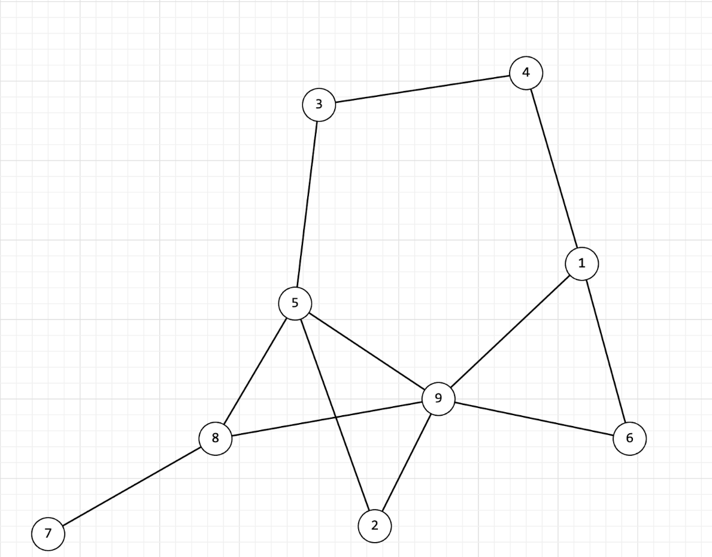

# RACE #24 Of The Secureum Bootcamp Epoch∞

import { Callout } from 'nextra/components'

<Callout type="info">
  This is a mirror of a Write-Up on RACE-24, Quiz of the [Secureum Bootcamp](https://twitter.com/0xRajeev/status/1470910752085065731) for Ethereum Smart Contract Auditors. It was designed by Secureum Mentor [Vahe (aka k3mmio)](https://twitter.com/k3mmio), from [hexens](https://twitter.com/hexensio).

  The original version of this document can be found at https://docs.google.com/document/d/1PswXg-sc4Hy4YCGuTrwgZnXSEsfNZ_-rkiABw2ggOKc/edit

  Participants of this quiz had to **answer 12 questions within the strict time limit of _48 minutes_** about Solidity Security, Basic Python, Basic Algorithms/Graphs and Basic SQL-like Querying. If you’re reading this in preparation for participating yourself, it’s best to give it a try under the same time limit!
</Callout>

<style jsx>{`
  input[type=checkbox] {
    width: 15px;
    height: 15px;
  }
  li {
    padding: 0.5em;
  }
`}</style>

export function HiddenSolution({ children }) {
  return (
    <details closed className="last-of-type:mb-0 rounded-lg bg-neutral-50 dark:bg-neutral-800 p-2 mt-4">
      <summary>
        <strong className="text-lg">Solution</strong>
      </summary>
      <div className="nx-p-2">{children}</div>
    </details>
  )
}

---

### Question 1 of 12

Is there a possibility to create a contract at some specific deterministically chosen Ethereum address and change its state bytecode after the deployment (hence, have the same address but with different bytecode)?

<ul>
  <li><input type="checkbox" /> A. There is none because contract bytecode is immutable</li>
  <li><input type="checkbox" /> B. selfdestruct call can be considered as bytecode change because it zeroes it out</li>
  <li><input type="checkbox" /> C. Using a proxy pattern, one can change the bytecode at the deployed address</li>
  <li><input type="checkbox" /> D. A special constructor allows re-deploying at the same address after self-destructing</li>
</ul>

<HiddenSolution>
**Correct Picks: B, D.**

One can use metamorphic contracts to deploy different bytecodes to the same address.
</HiddenSolution>

---

### Question 2 of 12

```solidity showLineNumbers
function permit(
    address holder,
    address spender,
    uint256 nonce,
    uint256 expiry,
    bool allowed,
    uint8 v,
    bytes32 r,
    bytes32 s
) public virtual {
    bytes32 digest = keccak256(
      abi.encodePacked(
        "\x19\x01"
        keccak256(
          abi.encode(
            PERMIT_TYPEHASH,
            holder,
            spender,
            nonce,
            expiry,
            allowed
          )
        )
      )
    );

    require(holder == ecrecover(digest, v, r, s));

    bytes32 sigHash = keccak256(abi.encodePacked(v, r, s));

    require(nonces[sigHash] != true);
    nonces[sigHash] = true;

    uint wad = allowed ? uint(-1) : 0;
    _approve(holder, spender, wad);
}
```


The code shows an example of a vulnerable implementation of the ERC20 `permit()` function. What are the possible high/critical severity bugs in the code?


<ul>
  <li><input type="checkbox" /> A. The digest calculation cannot stop some of the replay attack vectors</li>
  <li><input type="checkbox" /> B. Due to insufficient checks in the code, it allows anyone to drain zero (`0x0000000000000000000000000000000000000000`) address balance, e.g. in case the ERC20 token’s burn function actually sends the tokens to zero address</li>
  <li><input type="checkbox" /> C. The way signature nonce is checked is vulnerable to replay attacks</li>
  <li><input type="checkbox" /> D. Not all of the crucial security-essential parameters passed to the function are actually checked by the `permit()` function</li>
</ul>

<HiddenSolution>
**Correct Picks: A, B, C, D.**

The code has all of the bugs mentioned, as per ecrecover() return value was not being checked for 0 address, expiry was not being checked, and also the S value of the signature is malleable (check ECDSA malleability).
</HiddenSolution>

---

### Question 3 of 12

```solidity showLineNumbers
function safeTransferForm(
    address token,
    address from,
    address to,
    uint256 value
) internal {
    (bool success, bytes memory data) =
      token.call(abi.encodeWithSelector(IERC20.transferFrom.selector, from, to, value));
    require(success && (data.length == 0 || abi.decode(data, (bool))));
}

function stakeLP(ERC20 lptoken, uint amount) external {
  ...
  safeTransferFrom(address(lptoken), msg.sender, address(this), amount);
  balanceOf[msg.sender][lptoken] += amount; // solidity >= 0.8, addition is safe
  ...
}
```

The code shows a snippet of a Liquidity Provider (LP) token staking functionality. The protocol is designed to stake Uniswap V2 Liquidity Provider tokens (LP tokens). The rest of the code should be treated as black-box and without any bugs or other issues. Which of these are correct observations about the code?

<ul>
  <li><input type="checkbox" /> A. Given the scope of only the `stakeLP` function, reentrancy is possible which has a critical impact</li>
  <li><input type="checkbox" /> B. Given the scope of only the `stakeLP` function, reentrancy is technically possible, although with no real impact</li>
  <li><input type="checkbox" /> C. The `safeTransferFrom()` function is not implemented consistently allowing to drain LPs that are not yet created, but will be in future</li>
  <li><input type="checkbox" /> D. A malicious LP token can be used by the attacker to drain the balance of other conventional LP tokens</li>
</ul>


<HiddenSolution>
**Correct Picks: B, C.**

`safeTransferFrom` has a check missing that contract has any code, calling this on empty accounts will return true with empty data and pass the required check, thus if one frontruns the LP token creation (on uniswap factory) and calls the stakeLP will be able to stake any amount of money
</HiddenSolution>

---

### Question 4 of 12

```solidity showLineNumbers
// SPDX-License-Identifier: MIT
pragma solidity 0.8.22;

contract Task {
    uint256 private constant rewardSupply = 1_000_000;
    uint256 private constant rewardPerDay = 1033;
    struct UserData {
        uint48 lockTime;
        uint256 amount;
    }
    mapping(address => UserData) public infos;
    /*
    ...
    */
    function distributeReward(address rewardReceiver) external {
        /*
        ...
        */
        UserData memory stake = infos(rewardReceiver);
        // Suppose that the lockTime is equal to block.timestamp and the amount is 1000
        uint256 reward = _calculateAmount(state.lockTime, stake.amount);
        unchecked {
            rewardSupply -= reward;
        }
        /*
        ...
        */
    }

    function _calculateAmount(uint256 startTimestamp, uint256 stakeAmount) internal view returns (uint256) {
      uint256 timePassed = block.timestamp - startTimestamp;
      uint256 day = timePassed / 86400; //days count

      // Calculate reward using the formula for the sum of a geometric series
      uint256 reward = stakeAmount * rewardPerDay * (1 - (1 / 2 ** day));
      return reward;
    }
}
```


<ul>
  <li><input type="checkbox" /> A. After a second </li>
  <li><input type="checkbox" /> B. After a day </li>
  <li><input type="checkbox" /> C. After 3 days </li>
  <li><input type="checkbox" /> D. After 5 days </li>
</ul>

<HiddenSolution>
**Correct Picks: B.**

This is a rounding bug, $`1/(2^("days"))`$ will return $`0`$ but will start doing that only after one day has passed, as $`2^0`$ will be equal to $`1`$, and for the first day the calculation will (ironically) work correctly.
</HiddenSolution>


---

### Question 5 of 12

```solidity showLineNumbers
pragma solidity >=0.8.0;

contract Multicall{
    function multicall(bytes[] calldata data) external {
      for(uint i=0; i < data.length; i++){
        address(this).delegatecall(data[i]);
      }
    }
}

contract Vault is Multicall{
    mapping(address => uint) balances;

    function deposit() public payable {
      balances[msg.sender] += msg.value;
    }

    function depositFor(address to) public payable {
      balances[to] += msg.value;
    }

    function withdraw(uint amount) public{
      require(amount <= balances[msg.sender]);
      payable(msg.sender).transfer(amount);
      balances[msg.sender] -= amount;
    }

    function withdrawTo(address to, uint amount) public{
      require(amount <= balances[msg.sender]);

      payable(to).transfer(amount);

      balances[msg.sender] -= amount;
    }
}
```

The code is a snippet of an example Vault contract. The contract allows Ether deposits and withdrawals, and also implements multicall functionality to aggregate multiple calls into one transaction. Which of these observations are correct about the code?

<ul>
  <li><input type="checkbox" /> A. Using `multicall()` in conjunction with withdrawal functions, an attacker can conduct reentrancy attacks draining all of the Ether from the contract. </li>
  <li><input type="checkbox" /> B. The functions `withdraw()` and `withdrawTo()` are prone to profitable reentrancy attacks on their own.  </li>
  <li><input type="checkbox" /> C. Using `multicall()` in conjunction with deposit functions, attackers can inflate their balance in order to further withdraw all of Ether from the contract. </li>
  <li><input type="checkbox" /> D. The delegatecall() can be abused by the attacker to execute arbitrary bytecode in the context of the `Vault` contract. </li>
</ul>

<HiddenSolution>
**Correct Picks: C.**

This question had a flaw in the task code (missing “payable” for the multicall function), but this does not make the other 3 answers to be correct. The designed bug was that calling the deposit function in multicall loop will keep the msg.value the same for all the calls, thus amplifying the deposited amount.
</HiddenSolution>

---

### Question 6 of 12

```solidity showLineNumbers
// SPDX-License-Identifier: MIT
pragma solidity ^0.8.0

contract King {
  address king;
  uint public prize;
  address public owner;

  constructor() payable {
    owner = msg.sender;
    king = msg.sender;
    prize = msg.value;
  }

  function setKing() external payable {
    require(msg.value >= prize || msg.sender == owner);

    (bool success,) = king.call{value:msg.value}("");

    king = msg.sender;
    prize = msg.value;
  }

  function _king() public view returns (address) {
    return king;
  }
}
```

In the code we have taken the Ethernaut’s King challenge and changed it so that no one should have the ability to lock him as the `king` by changing the `transfer()` call with a low-level `call()`. Which of these observations are correct about the code?

<ul>
  <li><input type="checkbox" /> A. No one can lock himself as the `king` as the low-level `call()` will not automatically revert, even if the `king` is a smart contract with a reverting fallback function.</li>
  <li><input type="checkbox" /> B. The transaction can be reverted with OOG in case the `king` returns a large enough amount of return data.</li>
  <li><input type="checkbox" /> C. A `nonReentrant` modifier is missing and as the low-level call is used, the `king` can reenter the `setKing()` call to stay as the `king`.</li>
  <li><input type="checkbox" /> D. By setting the `success` variable from the return tuple of low-level `call()`, the compiler automatically adds a check for it to be true, thus still making it possible for the `king` to lock himself by reverting the fallback function.</li>
</ul>

<HiddenSolution>
**Correct Picks: B.**

A trick called return-bomb can be used to prevent anyone from changing “the king”. By returning a big amount of return data the setKing will revert while trying to copy the returned data. Interestingly, despite the code ignores the second return value of the tuple the compiler still adds a code to copy the returned bytes.
</HiddenSolution>


---

### Question 7 of 12

```solidity showLineNumbers
// SPDX-License-Identifier: MIT

pragma solidity 0.8.13;

abstract contract Event {
    event Value(string);
}

contract A is Event {
    function foo() public virtual {
      emit Value("A");
    }
}

contract B is Event {
    function foo() public virtual {
      emit Value("B");
    }
}

contract C is A, B {
    function foo() public override(B, A){
      super.foo();
    }
}
```


<ul>
  <li><input type="checkbox" /> A. This code cannot be compiled because multiple inheritance is not allowed in Solidity. </li>
  <li><input type="checkbox" /> B. When calling the `foo()` method of contract C, the event with the value "A" will be emitted. </li>
  <li><input type="checkbox" /> C. When calling the `foo()` method of contract C, the event with the value "B" will be emitted. </li>
  <li><input type="checkbox" /> D. If contract C inherits first from contract B and then from contract A, then the emit event will be "A". </li>
  <li><input type="checkbox" /> E. If the override construct in the `foo()` method of contract C swaps contracts A and B, then the value of the event emitted will also change. </li>
  <li><input type="checkbox" /> F. None of the above  </li>
</ul>

<HiddenSolution>
**Correct Picks: C, D.**

This task revolves around the multiple inheritance challenge in Solidity. To address it successfully, it's essential to understand that Solidity implements inheritance through the C3-linearization algorithm, where the last class from which the original class is inherited becomes the superclass.
</HiddenSolution>

---

### Question 8 of 12

```python showLineNumbers
def task(aa):
    bb={}
    def foo(aa):
        if aa in bb:
            return bb[aa]
        if aa==0:
            return 0
        elif aa==1 or aa==2:
            return 1
        else:
            cc=foo(aa-3)+foo(aa-2)+foo(aa-1)
            bb[aa]=cc
        return cc
    return foo(aa)
```

<ul>
  <li><input type="checkbox" /> A. $`"Time complexity = "O("Log"(n))", Space complexity = "O(1)`$ </li>
  <li><input type="checkbox" /> B. $`"Time complexity = "O(3^n)", Space complexity = "O(1)`$ </li>
  <li><input type="checkbox" /> C. $`"Time complexity = "O(n^3 * "Log"(n))", Space complexity = "O("Log"(n))`$ </li>
  <li><input type="checkbox" /> D. $`"Time complexity = "O(n)", Space complexity = "O(n)`$ </li>
</ul>

<HiddenSolution>
**Correct Picks: D.**

This problem introduces a recursive algorithm for calculating the nth Tribonacci number with the use of memoization.
</HiddenSolution>

---

### Question 9 of 12

```python showLineNumbers
x = [
    'a',
    'b',
    {
        'foo': 1,
        'bar':
        {
            'x': 10,
            'y': 20,
            'z': 30
        },
        'bar': 3
    },
    'c',
    'd'
]
```

<ul>
  <li><input type="checkbox" /> A. `"z" in x[2]` </li>
  <li><input type="checkbox" /> B. `"z" in x[2]["bar"]` </li>
  <li><input type="checkbox" /> C. `30 in x[2]["bar"]` </li>
  <li><input type="checkbox" /> D. `"baz" in x[2]["bar"]` </li>
  <li><input type="checkbox" /> E. `"baz" in x[2]` </li>
</ul>

<HiddenSolution>
**Correct Picks: B, E.**

This task demands comprehension of nested data structures and heightened attention. Importantly, note that when dealing with dictionaries, the `in` instruction checks keys, not values.
</HiddenSolution>

---

### Question 10 of 12



<ul>
  <li><input type="checkbox" /> A. $`2, 5, 3, 4, 1, 6, 9, 8, 7`$</li>
  <li><input type="checkbox" /> B. $`7, 8, 5, 2, 9, 1, 4, 3, 6`$</li>
  <li><input type="checkbox" /> C. $`8, 5, 7, 9, 2, 3, 1, 6, 4`$</li>
  <li><input type="checkbox" /> D. $`4, 1, 6, 9, 2, 5, 3, 8, 7`$</li>
</ul>

<HiddenSolution>
**Correct Picks: A, B, D.**

This problem necessitates an understanding of undirected graphs and familiarity with the Depth-First Search (DFS) algorithm. An undirected graph is a mathematical structure comprising vertices and edges, where the edges lack direction. In other words, the connection between any two vertices is mutual and doesn't imply a one-way relationship.

DFS, an approach to graph or tree exploration, initiates from a designated vertex and systematically delves as far as possible along a chosen branch. This algorithm relies on either a stack or recursion to meticulously track vertices and their traversal order. The key objective is to reach the final vertex or uncover a complete connectivity component. Once a final vertex or target is encountered, DFS retraces its steps to explore alternative paths.
</HiddenSolution>

---

### Question 11 of 12

A Blockchain database consists of the following tables: Contracts, Functions, Modifiers, FunctionModifiers, and Instructions. Each table has the following schema: 

1. Contracts: ContractID, ContractAddress, ContractName, CreationDate
2. Functions: FunctionID, ContractID, FunctionName
3. Modifiers: ModifierID, ModifierName, Description
4. FunctionModifiers: FunctionID, ModifierID (This is a table to represent the many-to-many relationship between Functions and Modifiers.) 
5. Instructions: InstructionID, FunctionID, InstructionCode, LineNumber 

Write an SQL query to list all contract addresses (ContractAddress) where the "mint" function is used without any modifiers.

<input type="checkbox" /> A.
```sql showLineNumbers
SELECT C.ContractAddress
FROM Contracts C
JOIN Functions F ON C.ContractID = F.ContractID
LEFT JOIN FunctionModifiers FM ON F.FunctionID = FM.FunctionID
WHERE F.FunctionName = 'mint' AND FM.ModifierID IS NULL;
```
<input type="checkbox" /> B.
```sql showLineNumbers
SELECT C.ContractAddress
FROM Contracts C
JOIN Functions F ON C.ContractID = F.ContractID
WHERE F.FunctionName = 'mint' AND NOT EXISTS (
    SELECT 1 FROM FunctionModifiers FM WHERE FM.FunctionID = F.FunctionID
);
```
<input type="checkbox" /> C.
```sql showLineNumbers
SELECT C.ContractAddress
FROM Contracts C
JOIN Functions F ON C.ContractID = F.ContractID
WHERE F.FunctionName = 'mint' AND NOT EXISTS (
    SELECT 1 FROM FunctionModifiers FM 
    JOIN Modifiers M ON FM.ModifierID = M.ModifierID
    WHERE FM.FunctionID = F.FunctionID
);
```
<input type="checkbox" /> D.
```sql showLineNumbers
SELECT C.ContractAddress
FROM Contracts C
WHERE EXISTS (
    SELECT 1 FROM Functions F
    LEFT JOIN FunctionModifiers FM ON F.FunctionID = FM.FunctionID
    WHERE F.ContractID = C.ContractID AND F.FunctionName = 'mint' AND FM.ModifierID IS NULL
);
```

<HiddenSolution>
**Correct Picks: B.**

The query starts by joining the Contracts and Functions tables based on ContractID. It filters functions to those specifically named "mint." The NOT EXISTS clause is used to check if there are no entries in the FunctionModifiers table for the corresponding FunctionID, indicating the absence of modifiers. If the subquery returns true (indicating no existence of modifiers), the contract address is selected.
</HiddenSolution>

---

### Question 12 of 12

A Blockchain database consists of the following tables: Contracts, Functions, Modifiers, and Instructions. Each table has the following schema: 

1. Contracts: ContractID, ContractAddress, ContractName, CreationDate 
2. Functions: FunctionID, ContractID, FunctionName 
3. Modifiers: ModifierID, ModifierName, Description 
4. FunctionModifiers: FunctionID, ModifierID (This is a table to represent the many-to-many relationship between Functions and Modifiers.) 
5. Instructions: InstructionID, FunctionID, InstructionCode, LineNumber

You need to write an SQL query to list all contract addresses that use high-risk functions (like `withdraw`, `updateBalance`) without critical modifiers (`onlyOwner`, `onlyAdmin`, `onlyManager`) and also contain specific risky instruction patterns (like `InstructionCode` containing `externalCall` or `directTransfer`).


<input type="checkbox" /> A.
```sql showLineNumbers
SELECT DISTINCT C.ContractAddress
FROM Contracts C
JOIN Functions F ON C.ContractID = F.ContractID
LEFT JOIN FunctionModifiers FM ON F.FunctionID = FM.FunctionID
LEFT JOIN Modifiers M ON FM.ModifierID = M.ModifierID
WHERE F.FunctionName IN ('withdraw', 'updateBalance') 
    AND (M.ModifierName IS NULL OR M.ModifierName NOT IN (‘onlyOwner’, ‘onlyAdmin’, ‘onlyManager’));
```
<input type="checkbox" /> B.
```sql showLineNumbers
SELECT C.ContractAddress
FROM Contracts C
JOIN Functions F ON C.ContractID = F.ContractID
WHERE F.FunctionName IN ('withdraw', 'updateBalance')
    AND NOT EXISTS (
        SELECT 1 FROM FunctionModifiers FM
        JOIN Modifiers M ON FM.ModifierID = M.ModifierID
        WHERE FM.FunctionID = F.FunctionID AND M.ModifierName IN (‘onlyOwner’, ‘onlyAdmin’, ‘onlyManager’)
    );
);
```
<input type="checkbox" /> C.
```sql showLineNumbers
SELECT C.ContractAddress
FROM Contracts C
JOIN Functions F ON C.ContractID = F.ContractID
LEFT JOIN FunctionModifiers FM ON F.FunctionID = FM.FunctionID
WHERE F.FunctionName IN ('withdraw', 'updateBalance')
    AND FM.ModifierID IS NULL;
```
<input type="checkbox" /> D.
```sql showLineNumbers
SELECT C.ContractAddress
FROM Contracts C
JOIN Functions F ON C.ContractID = F.ContractID
LEFT JOIN FunctionModifiers FM ON F.FunctionID = FM.FunctionID
LEFT JOIN Modifiers M ON FM.ModifierID = M.ModifierID
WHERE F.FunctionName IN ('withdraw', 'updateBalance')
    AND M.ModifierName IS NULL;
```

<HiddenSolution>
**Correct Picks: B.**

The query joins Contracts and Functions tables based on ContractID. It filters functions to those named 'withdraw' or 'updateBalance'. The NOT EXISTS clause is used to exclude contracts with critical modifiers. Specifically, it checks if there's no entry in the FunctionModifiers table with critical modifiers for the corresponding FunctionID. If the subquery returns true (indicating no critical modifiers), the contract address is selected.
</HiddenSolution>

---