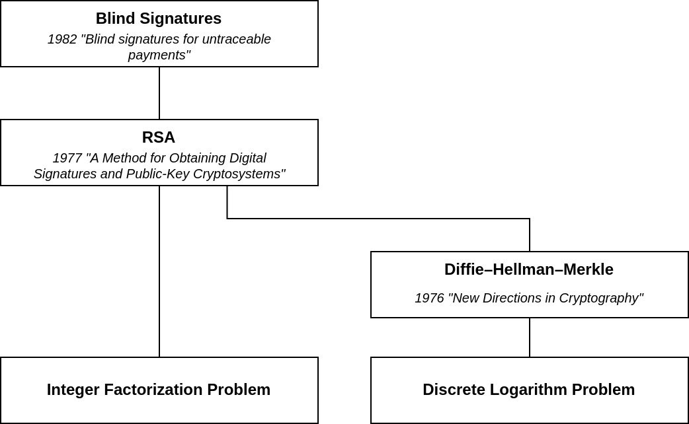

# Cryptocurrency Privacy Technologies: Blind Signatures

<p className="text-xs text-right">March 24, 2023 by [patrickd](/about#patrickd)</p>



Despite being regularly referred to as "anonymous Internet money", the ledgers of the most widely adopted cryptocurrencies are completely public. Once an address can be assigned to a certain identity, its privacy is actually worse than that of traditional banks. This article explores one of the first technologies ever proposed to enhance the privacy features of digital currencies.


## The Concept

The usage of Blind Signatures for untraceable payments was first proposed in [1982 by David Chaum](https://sceweb.sce.uhcl.edu/yang/teaching/csci5234WebSecurityFall2011/Chaum-blind-signatures.PDF), with the first practical application in DigiCash's "eCash", which, although it was centralized, allowed for an exchange of value without the centralized entity being able to know the parties involved in the exchange.

A Blind Signature means, quite literally, that the signer can sign data blindly, without being able to see what he is actually signing. In a way, it is similar to Homomorphic Encryption: The ability to apply an operation on an encrypted value. One could encrypt their message, send it to the signer, and then once they receive the signed message back, they could decrypt it while the message would remain signed.

In simplified terms, Chaum's paper envisioned an untraceable payment scheme with the following steps: 

1. Payer picks a random number $`x`$ and encrypts it, yielding a "note" $`c(x)`$.
2. Payer sends $`c(x)`$ to the bank which signs it blindly, yielding $`s'(c(x))`$. The bank debits an amount of money from the payers account which the note will be valued at (all signed notes would be worth the same amount).
4. Payer decrypts the signed note, after which it remains signed: $`s'(c(x)) -> c'(s'(c(x))) -> s'(x)`$
5. Payer spends their signed note at Payee. Payee sends $`s'(x)`$ to the bank which, although it has never seen the note in this form before, can verify that it had indeed blindly signed it at some point and can safely accredit the note's value to the Payee's account. To prevent double-spending, the bank keeps track of notes that have already been redeemed.


## The Math

The scheme can be implemented with various cryptographical methods (eg. Elliptic Curves, Schnorr), but the most common one used in examples is RSA. In these, the bank would have a Public $`K(e, N)`$ and Private $`k(d, N)`$ keypair.

$`p, q`$ as large random prime numbers

$`N = p * q`$

$`phi = (p-1)*(q-1)`$

$`e = 65537`$

$`d -= e^(-1)" mod "phi`$

(To get a sense of why RSA's math works, you might want to read my [previous article](https://ventral.digital/posts/2023/3/23/why-does-rsa-actually-work) first.)

The payer would pick a message $`m`$ and multiply it with an encrypted $`r`$, a random value that must be relatively prime to $`N`$ and $`r lt N`$. It's also important to remember that $`N`$ limits the size of the message $`m`$, so it should be ensured that $`m < N`$.

$`T_b -= m*r^e" mod "N`$

In normal RSA, exponentiation with $`d`$ is either used for decrypting a received message or for signing a message by encrypting it. In this case, it's both: The part of the note that is the random value $`r`$ is reversed to its original "unencrypted" state, while the message $`m`$ becomes signed with the bank's private key. Since the bank does not know $`r`$, they are unable to extract the message $`m`$ that was signed.

$`T_(bs) -= (T_b)^d" mod "N`$

$`T_(bs) -= (m*r^e" mod "N)^d" mod "N`$

$`T_(bs) -= m^d*r^(e*d)" mod "N`$

$`T_(bs)-= m^d*r" mod "N`$

The payer is now able to "unblind" the note by removing $`r`$ from the signed note $`T_(bs)`$. This results in $`T_s`$, which is simply the original message signed with the bank's private key. It can be considered anonymous because the bank has not seen the message $`m`$ yet.

$`T_s -= (T_(bs)) * r^(-1)" mod "N`$

$`T_s -= (m^d*r) * r^(-1)" mod "N`$

$`T_s -= m^d" mod "N`$

To validate the signature, one uses the bank's public key which yields the plaintext message $`m`$.

$`m -= (T_s)^e" mod "N`$

$`m -= (m^d)^e" mod "N`$

$`m -= m^(de)" mod "N`$

$`m -= m" mod "N`$

To prevent any random number $`m`$ resulting from this operation to be valid, the message must follow a verifiable pattern. Usually, it would be a hash of the actual message that can then be checked against it. In this case, it could also be required to result in a certain kind of string such as  "eCash Note Number: #$\{large random number\}". It would be the responsibility of the payer to choose a valid and unused message before having it signed by the bank, otherwise, they'd end up with an irredeemable note.


## The Code

The following is an example of how this scheme might be implemented on a blockchain, specifically Ethereum since that is what I am most familiar with. I hope this is obvious, but please do not actually use this code as it was created to be illustrative and easy to understand, and might be incorrect or even insecure.

We'll use a "Mixing Pool" contract: The payer becomes an Ethereum user who deposits a static amount of ether together with his blinded note $`T_b`$. The bank becomes a "trustee", an automated off-chain program that monitors for Deposit events, asynchronously signs the specified notes, and publishes them as $`T_(bs)`$. Since nobody except of the depositor knows $`r`$, publishing signed but still blinded notes would not allow anyone else to make use of them. Whoever receives $`T_s`$ from the depositor at a later point can now anonymously withdraw the ether from the pool. As you might have guessed, the anonymity of mixing depends on other users also having made deposits in the meantime.

To start, we'll generate the trustee's Public-Private key pair:

```python
import Crypto.Util.number

p = Crypto.Util.number.getPrime(128, randfunc=Crypto.Random.get_random_bytes)
q = Crypto.Util.number.getPrime(128, randfunc=Crypto.Random.get_random_bytes)

N = p*q
phi = (p-1)*(q-1)

e = 65537
d = pow(e, -1, phi)
```

The public key $`K(e, N)`$ can now be published as part of the Mixing Pool contract:

```solidity
contract BlindCashPool {

    uint256 public publicKey_e = 65537;
    uint256 public publicKey_N = 53382920267666541246270348266907043442322832852787231847834739509928492767167;

    string constant note_prefix = "BlindCashPool Note #";
    address public immutable trustee = msg.sender;

    event Deposit(uint256 blind_note);
    function deposit(uint256 blind_note) payable external {
        // Trustee will sign anything, but anything signed must be worth a fixed amount.
        require(msg.value == 1 ether, "Sent value does not match chosen fixed amount of 1 ether");
        // Trustee monitors for deposit events off-chain.
        emit Deposit(blind_note);
    }

    event Signed(uint256 indexed blind_note, uint256 signed_blind_note);
    function signed(uint256 blind_note, uint256 signed_blind_note) external {
        require(msg.sender == trustee, "Only trustee may publish signed notes");
        // Payer monitors for signing events off-chain.
        emit Signed(blind_note, signed_blind_note);
    }

    ...
}
```

A user intending to make a deposit can now use this information to prepare and publish their blind signature off-chain:

```python
# Depositor
from Crypto.Util.number import bytes_to_long
from Crypto.Hash import keccak

def makeDeposit(e, N):
    # Create message with random note identifier.
    n = bytes(str(bytes_to_long(Crypto.Random.get_random_bytes(32))), "utf8")
    m = bytes("BlindCashPool Note #", "utf8") + n
    # Hash the message to be able to use arbitrary size messages, then shift
    # 4 bytes to the right to ensure mh < N.
    mh = bytes_to_long(keccak.new(digest_bits=256).update(m).digest()) >> 32
    # Find a random coprime r.
    r = 0
    while True:
        r = bytes_to_long(Crypto.Random.get_random_bytes(16))
        if Crypto.Util.number.GCD(r, N) == 1:
            break
    # Blind the message hash.
    Tb = mh * pow(r, e, N) % N
    # Deposit 1 ether into Mixing Pool Contract with generated blind note.
    web3_BlindCashPool_deposit(Tb)
    # We'll need to monitor for Signed events for blinded note Tb now.
    # The note's identifier is required to validate the signed message hash later.
    # The random coprime r is required for unblinding the note once it was signed.
    return (Tb, n, r)
```

The Trustee off-chain program will monitor the chain for new Deposits and automatically sign these notes.

```python
# Trustee

# Triggered whenever a Deposit event was emitted.
def web3_handleEvent_Deposit(Tb):
    # Sign the blind note with the private key.
    Tbs = pow(Tb, d, N)
    # Publish the signed blind note triggering the emission of the Signed event.
    web3_BlindCashPool_signed(Tb, Tbs)
```

After publishing their blinded note, the depositor had been waiting for it to be signed. Once that has happened they can unblind the note to make it spendable. Now the depositor only needs to wait some time for others to make deposits and withdrawals as well in order to increase the privacy of their note.

```python
# Depositor

# Triggered whenever a Signed event for a specific Tb was emitted.
def web3_handleEvent_Signed(Tbs):
    # Unblind the note.
    Ts = (Tbs * pow(r, -1, N)) % N
    # Together with the note number, this can be used for a withdrawal.
    return Ts
```

Finally, the receiver of a signed note ($`T_(bs), n`$) can immediately make a withdrawal to verify and redeem the note that he received from a depositor. Thanks to the fact that the public key required for verification is already part of the smart contract, the withdrawal can be completely handled on-chain:

```solidity
contract BlindCashPool {

    ...

    mapping(bytes32 message_hash => bool redeemed) public redeemed_notes;
    function withdrawal(uint256 unblinded_note, string calldata note_identifier) external {
        // Create the note's expected message hash.
        bytes32 expected_message_hash = keccak256(abi.encodePacked(note_prefix, note_identifier)) >> 32;
        // Decrypt the signed note to obtain the signed message hash.
        bytes32 signed_message_hash = bytes32(modExp(unblinded_note, publicKey_e, publicKey_N));
        // Validate the note.
        require(expected_message_hash == signed_message_hash, "Signed message hash is invalid");
        // Prevent double-spending.
        require(!redeemed_notes[signed_message_hash], "The note has already been redeemed in a previous withdrawal");
        redeemed_notes[signed_message_hash] = true;
        // Transfer the ether.
        (bool success,) = msg.sender.call{ value: 1 ether }("");
        require(success, "Transfer of ether failed");
    }

    // Use modexp precompile to do modular exponentiation. 
    function modExp(uint256 b, uint256 e, uint256 m) internal view returns (uint256) {
        require(m != 0, "Can't calculate for modulus equal to zero");
        (bool success, bytes memory result) = (address(5).staticcall(abi.encode(32, 32, 32, b, e, m)));
        require(success, "Failed at calculating the result");
        return abi.decode(result, (uint256));
    }
}
```


## Caveats

* It's centralized. Since this scheme requires a trusted party signing with their private key, it comes with a whole bunch of related issues. The trustee could rugpull all of the pool's funds by creating as many notes as it wants. The trustee could censor/skip certain deposits and never sign their blinded notes. The trustee could be hacked or socially engineered to leak the private key. The trustee's off-chain service could become unavailable locking up any new deposits forever. etc. etc.
* RSA is hard to get right. In this specific example, the fact that the trustee will sign anything that he observes from a Deposit event could likely cause issues, especially if what's being signed is a very small message. Little gotchas like that are why it's generally considered a bad practice to "roll your own crypto".
* The withdrawing party needs ether to pay the gas cost for the withdrawal. But in order to obtain that they might already lose some anonymity. To avoid this, one could make use of relays or, more recently Account Abstraction (EIP-4337).
