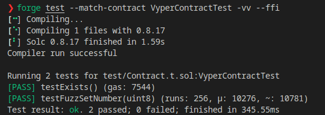

# Fuzzing Vyper Contracts Using Foundry

import { Callout } from 'nextra/components'

<Callout type="info">
  This is a guest post by [Darren Chapman (aka Parsely)](https://twitter.com/_Parsely_) created as part of [patrickd’s writing mentorship](https://twitter.com/patrickd_de/status/1646941356277788672).
</Callout>

<p className="text-xs text-right">April 29, 2023 by [Parsely](/about#parsely)</p>

As a web3 developer one of the essential tasks is to write tests for your contracts. These tests are usually unit tests that test the functionality and business logic of the code. One step up from that, to really enhance the security, would be to write more complex tests like invariant tests and fuzzing tests. The Foundry framework has made writing these types of tests for Solidity contracts a much easier task.

But what about smart contracts written in other languages? How can we use the Foundry framework in these development environments?

In this article, we will take a look at how the Foundry framework can be used to write tests that will fuzz contracts written in Vyper.

## Introduction to testing using Foundry and Solidity

#### The Basics of Foundry

Let's begin by looking at how a basic Foundry test is written and what happens when we run our tests within the framework.

This will give us a better foundational understanding of the basic testing pattern, before exploring fuzzing Vyper contracts in more detail.

Foundry's module that runs the tests is called **Forge**. Forge will check the function names declared in the contract, if any of the function's names starts with **test**, it is considered to be a valid Forge test. By convention, test contracts are usually created within the **/test** directory and the file name usually ends with **.t.sol**. 

When a test is run in Foundry, the `setup` function which can be used to set up the environment, will be invoked before running each test method. 

```solidity
function setup() public {
    counter = new Counter();
}   
```

Once setup has successfully run, the framework will then run any of the tests written in our Solidity code in the test contract.

```solidity
function testSomethingStatic(){
    deployedContract.callAFunction();
    assertEq(deployedContract.aVariable(),valueItShouldBeNow);
}
```

#### The Basics of Fuzzing
We have looked at how simple tests can be written and run in Foundry. Let's now take a look at how fuzzing can be implemented in the Foundry framework.

A fuzz test function is identified by Foundry as being a function with at least one input parameter. The test function will run a configurable number of times, with quasi-random values set for the input parameter on each iteration. Foundry has created a way in which developers can either filter input values, or set ranges that these values should be within. Forge tests will recognise and adhere to any limits set by using the cheatcodes called `assume` and `bound`. 

```solidity
function testFuzzSettingaNewValue(uint256 valuetoBeSet){
    // The value of the variable valuetoBeSet will be generated by Forge 
    // and passed into the contract function being tested
    
    // The input values should be greater than zero
    vm.assume(valuetoBeSet > 0);
    // Set a range for valuetoBeSet, it must be between 1 and 200
    valuetoBeSet = bound(valuetoBeSet,1,200);
    deployedContract.callAFunction(valuetoBeSet);
    assertEq(deployedContract.aVariable(),valueItShouldBeNow);
}
```

The above test will run and replace the value of `theNewValue` with a quasi-random number to test the logic and the assertion. 

By default the test will run 256 times, but this can be set within the Foundry configuration to be any value of your choosing.

#### Deploying Contracts

The main assumption in any of the test functions is, that any contract that the test needs to interact with either is deployed, or will be deployed in the `setup()` function or as part of the test logic. The logic in our Solidity code allows us to declare and instantiate any of the contracts we would need to have deployed, in order to successfully run the logic of our test.

Vyper contracts are not as easily deployed as Solidity contracts by the Foundry framework, which necessitates a few more steps, in order to deploy the Vyper code that the test needs to interact with.

## Testing using Foundry with Vyper

#### Vyper 101

It would be good to take a quick look at how Vyper development and deployment work on a local system, before we continue exploring how to use Foundry to fuzz test our Vyper contracts. 

In order to be able to have a working example by the end of the article, we will build a very basic project together, that will allow us to build step by step and end up with a working fuzz example. The Vyper contract we will use is one I have written, which mimicks the functionality of the Counter contract, which is created by default when a new Forge workspace is initialized using the `forge init` command.

To develop the example project, we first need to set up our environment and workspace.

1. `mkdir vyper_example`. Create a directory for the example.
2. `cd vyper_example`. Move into that directory 
3. `npm install Vyper`. Install the Vyper NPM modules. 
4. `mkdir src`. Create a **src** directory
5. `cd ./src`. Move into the **src** directory.
6. `touch Contract.vy`. Create a file called **Contract.vy**

**Copy and Paste** the code below into the file 

```python showLineNumbers copy filename="Contract.vy"
# @version ^0.3.7
# declare a variable called somenumber of type uint8
somenumber : public(uint8)

# the @external decorator declares the visibility of the function
# the __init__ function is the same as a constructor in Solidity
@external
def __init__():
    # For state variables we always need to refer to them using self.
    # Set our somenumber variable to 1 in the constructor
    self.somenumber = 1

# The setNumber function takes an input parameter
# @param newvalue type uint8 
# @return a value of type uint8 which should be the input value of the parameter newvalue
@external
def setNumber(newvalue: uint8) -> uint8:
    self.somenumber = newvalue
    return self.somenumber

# The getNumber function returns the current value of the somenumber variable
# @return the current value of the somenumber variable
@external
def getNumber() -> uint8:
    return self.somenumber
```
 
Open a new Terminal in the **vyper_example** directory

6. `vyper src\Contract.vy`. Compile the contract.


The command line code returns bytecode, which can then be used to deploy the Vyper contract onto the blockchain.

#### Combining Vyper and Foundry

When we test Vyper contracts using Foundry, we will need a way to compile and deploy the contracts within the `setup` or `test` functions. 

Foundry comes with a cheatcode in the framework, which enables us to interact with our local system, called **ffi**. This Foundry cheatcode allows us to run terminal commands from Solidity code on our local system, and assumes the output of the terminal command will be hex values. **ffi** runs within the context of the root directory of the project, and not within the context of the test directory.

[Link to Foundry Book Website -> ffi](https://book.getFoundry.sh/cheatcodes/ffi?highlight=ffi#ffi)

```solidity
function ffi(string[] calldata) external returns (bytes memory);
```

The example below is very basic, but will allow us to compile and deploy a Vyper contract from Solidity code.

```solidity
interface ffiInterface{
    function ffi(string[] calldata) external returns (bytes memory);
}
// Instantiate the interface to be able to call the cheatcode
ffiInterface public ffiCheat = ffiInterface(HEVM_ADDRESS);

// ffi takes as input a string array.
string[] memory deployCommand = new string[](2);
// The Vyper terminal command to compile a Vyper file
deployCommand[0] = "vyper";
// The path to Vyper file that we would like to compile and receive
// the bytecode output for.
deployCommand[1] = "src/Contract.vy";

// Store the output bytecode in a local variable
bytes memory compiledByteCode = ffiCheat.ffi(deployCommand);

// Now use inline assembly to deploy that bytecode onto our test environment.
address newContractAddress;
assembly { 
    newContractAddress := create(0, add(compiledByteCode, 0x20), mload(compiledByteCode)) 
}
```

## Building on our example

The example project we have built so far is not yet setup to use Foundry. We need to initialize the current directory **vyper_example** and install all the requisite libraries needed by the framework to be able to run tests. The terminal command to initialize a directory is `forge init --no-git --force`. 

<Callout>
  The `--force` option is provided to allow **Forge** to ignore the fact that our root directory is not empty, as by default **Forge** requires an empty directory to start a new project.
</Callout>

`Forge init` should install the required test libraries for Foundry in the **lib** directory by default, however if you need to install them, you can run the command `forge install foundry-rs/forge-std`.

The configuration file called **remappings.txt**, tells Foundry where to look for files referred to by import statements in the code. In our example, we would need to create this file in our project's root directory called **vyper_example**.

For convenience I have pasted the values needed in our remappings file below. These values map to the Forge-std libraries which are imported into our test contract to run the fuzz tests.
```plaintext showLineNumbers copy filename="remappings.txt"
ds-test/=lib/forge-std/lib/ds-test/src/
forge-std/=lib/forge-std/src/
```
We learned earlier that test contract files are usually created in the **test** directory. So let's create a file in the **test** directory called **Contract.t.sol**. 

**Copy and paste** the code below into the test contract and save the file.
```solidity showLineNumbers copy filename="test/Contract.t.sol"
// SPDX-License-Identifier: UNLICENSED
pragma Solidity ^0.8.13;

import "Forge-std/Test.sol";

// Declare the interface which describes our Vyper contract
interface VyperContract{
    function setNumber(uint8) external returns (uint8);
    function getNumber() external returns (uint8);
}

// Declare the interface for the ffi cheatcode function
interface ffiInterface{
    function ffi(string[] calldata) external returns (bytes memory);
}


contract VyperContractTest is Test {
    // Declare a variable for the Vyper interface variable
    VyperContract VyperContract;
    
    // The setup function will run before each test function 
    // and compile and deploy our Vyper contract to our local test environment
    function setUp() public {
        // Instantiate the ffi interface
        ffiInterface ffiCheat = ffiInterface(HEVM_ADDRESS);
        
        // The string array input varaible used by ffi
        string[] memory deployCommand = new string[](2);
        // The Vyper keyword to compile a contract
        deployCommand[0] = "vyper";
        // The path to the Vyper contract file starting from the project root directory
        deployCommand[1] = "src/Contract.vy";
        
        // A local variable to hold the output bytecode
        bytes memory compiledByteCode = ffiCheat.ffi(deployCommand);
        
        // A local variable to hold the address of the deployed Vyper contract
        address newContractAddress;
        
        // Inline assembly code to deploy a contract using bytecode
        assembly { 
                    newContractAddress := create(0, add(compiledByteCode, 0x20), mload(compiledByteCode)) 
                }

        // Instantiate the Vyper interface 
        VyperContract = VyperContract(newContractAddress);
        
    }

    // Static test function which will run once
    function testExists() public {
        // Variable to hold the value of the getNumber() function from our Vyper contract
        // The number in the Vyper contract is set to 1 in the constructor
        uint8 currentContractValue = VyperContract.getNumber();
        // Assert that the value we got from calling the getNumber function is correctly set to 1
        assertEq(currentContractValue, 1);
    }
}

```
We are now ready to run our first test, which will deploy our Vyper contract and run our static test.

8. `forge test --match-contract VyperContractTest -vv --ffi`. To run the Forge test

<Callout>
  `--ffi` tells Foundry to allow the **ffi** call as it is disabled by default for security reasons.
</Callout>

If everything has worked correctly our test should be successful.


#### Adding the fuzzing test function to our test file
We have progressed now to a point where we can deploy and interact with our Vyper contract.

The final step will be to add a fuzzing function to our Foundry test contract.

Paste the code below into our test contract and run the test command again.
```solidity copy
    // Fuzzing test as it has an input parameter
    function testFuzzSetNumber(uint8 fuzzNum) public
    {
        // Local variable to hold the value returned by calling the setNumber() function
        // The return value should be the same as the value sent in
        uint8 numberThatWasSet  = VyperContract.setNumber(fuzzNum);
        // Assert that the returned value is equal to the number sent in
        assertEq(numberThatWasSet,fuzzNum);
    }
```
Reminder of the command to run:

`forge test --match-contract VyperContractTest -vv --ffi`



## Conclusion
In this article we covered a brief overview of Vyper and Foundry.
We went through the steps of creating and compiling the Vyper contract using **ffi**. We learned how to allow Foundry to interact with our system to run commands, and finally, we saw how all of these techniques can be combined to enable developers to write unit tests and fuzzing tests for their Vyper development.