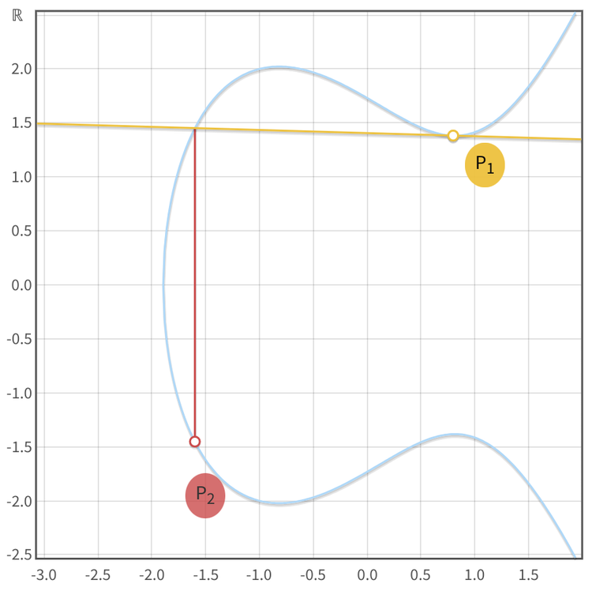

# Applied Elliptic Curve Cryptography

<p className="text-xs text-right">August 22, 2023 by [patrickd](/about#patrickd)</p>

If you've spent any time trying to learn about Elliptic Curve Cryptography, you have probably already heard a lot about the theory but not that much about how it's then used in practice. At the beginning of this article, we'll quickly review those theoretical basics before moving on to some example applications.

<div style={{
  display: 'grid',
  gridTemplateColumns: 'repeat(2, 1fr)',
  gridGap: '0'
}}>
  <div>[](https://andrea.corbellini.name/ecc/interactive/reals-mul.html)</div>
  <div>[](https://andrea.corbellini.name/ecc/interactive/reals-add.html)</div>
  <div>[](https://andrea.corbellini.name/ecc/interactive/modk-mul.html)</div>
  <div>[](https://andrea.corbellini.name/ecc/interactive/modk-add.html)</div>
</div>

<p className="text-xs text-right">Screenshots of [Andrea Corbellini's ECC demonstration tool](https://andrea.corbellini.name/)</p>

## Review

The pretty "elliptical curve" plots, as seen in the top row, are created over an infinite field (the real numbers, $`RR`$) which is useful for getting an intuition of what's going on. But the discrete log problem, required for ECC, is only present over a finite field (integers smaller than a selected prime number, $`ZZ_p`$), where this graphical representation collapses due to the points' coordinates being determined within $`("mod "p)`$. The exact formulas by which these coordinates are determined differ between curves and are mostly irrelevant unless you're attempting to roll your own crypto. The points appear to be randomly distributed but can actually become elements of a cyclical group.

* For such a group to be complete, an operation is required under which several properties hold true. In the case of ECC, this operation is usually referred to as "point addition", but it doesn't actually have anything to do with any sort of mathematical addition, rather the operation was "made up" to fit the rules.
    * A point $`P_1`$ on the curve "added" to itself ($`P_1 + P_1 = P_2`$) is defined as an operation that draws a tangent on the curve through $`P_1`$. Thanks to the elliptic curve's nature, this tangent line will cross the curve at exactly one other point, which is mirrored over the x-axis and then declared to be the "result of the addition", point $`P_2`$.
    * Adding two different points together ($`P_1 + P_2 = P_3`$) is defined as drawing a line that goes through both points, resulting in a third point, whose mirrored point is the result $`P_3`$. As implied by this process of mirroring, there'll always be two possible Y values for each X value as these curves are horizontally symmetric.
    * Note that it's not possible to multiply or divide points unless scalar values are used to do so. For example, $`P_1 + P_1 = P_2`$, can also be represented as $`2P_1 = P_2`$. While points are usually represented by upper-case letters, scalars are lower-case, ie.: $`nP = P_1 + P_2 + ... + P_n`$.
    * Scalars are normal integers and not part of the group, which means that between scalars any usual mathematical operation is available. But they're still part of a field $`("mod "n)`$ where $`n`$ is the order of the cyclic group (ie. the total number of elements in the group, not the same as the prime $`p`$ defining the finite field). That means that modular arithmetic is applied where calculations between scalars happen.
    * From the "addition" operation, one can also find a reverse "subtracting" operation. Here too it's important to remember that a "negative point" $`-P`$ is simply the x-axis-mirrored point $`P`$ and does not involve any actual mathematical subtraction.
* The properties holding true for said operation are the following:
    * Closure: The result of the operation applied upon two elements that are part of the group, always yields a result that is an element of the group as well. Meaning that the "addition" of any valid points will result in another valid point on the curve.
    * Commutativity: $`P_1 + P_2 = P_2 + P_1`$
    * Associativity: $`(P_1 + P_2) + P_3 = P_1 + (P_2 + P_3)`$
    * Existence of an "Identity" element $`cc"O"`$ within the group for which the following is true: $`cc"O" + P_1 = P_1`$. No such Identity Point naturally occurs on an elliptic curve, therefore this too is "made up" as a "point at infinity".
    * Invertibility: For every element such as $`P_1`$ there's an inverse $`-P_1`$ such that $`P_1 - P_1 = cc"O"`$.

When the order $`n`$ (ie. the number of existing points) of an elliptic curve is prime, almost any non-identity point on the curve can serve as a generator point $`G`$ (also referred to as "primitive element", or "base point"). A generator, when "added" to itself over and over again, will cycle through all elements of the group ($`G, 2G, 3G, ..., (n-1)G,`$ $`cc"O", G, 2G, ...`$). However, not all curves have a prime order. For those that have a composite order, it's common to choose a large prime-order subgroup and a generator that is part of this sub-group is then determined. These generators won't iterate through all points on the curve, only through points in their subgroup. If the subgroup's order is a large prime, it will have a number of elements comparable to the entire curve.

The fact that an exponentiation with a modulus ($`g^s" (mod "p")"`$) is hard to reverse is referred to as the discrete logarithmic problem (DLP). Similarly, it's easier to determine a point $`P`$ by multiplying a scalar with a generator ($`P = sG`$) than it is determining the scalar that was used from knowing both $`P`$ and $`G`$, which is referred to as the discrete logarithmic problem in ECC (ECDLP). This operation can be efficiently executed forward thanks to methods such as the Double-And-Add algorithm, while the reverse requires a much more brute force approach.

Note that most scientific paper will not make use of the ECDLP scalar-point notation. Instead they typically use the conventional discrete logarithm notation where the base is the generator and the field element (scalar) is the exponent: 

$$
`C = aG + bG = (a+b)G iff c = g^a * g^b = g^(a+b)" (mod "n")"`
$$

Using ECC instead of relying on the conventional DLP or the prime factorization problem (RSA) comes with benefits: In ECC the numbers used can be much smaller while offering stronger security guarantees. It can also be argued that ECC has much fewer footguns.

## ECDH

The Diffie–Hellman key exchange scheme can be implemented using ECC. It's a simple and elegant example to gain a bit of intuition in how ECDLP can be made use of in practice.

| Step | Alice | Bob | Eve |
|------|-------|-----|-----|
| #0 | Shares a chosen curve and its parameters | Receive's Alice's chosen parameters for the exchange | Has intercepted the same chosen starting parameters |
| #1 | Generates scalar $`a`$, a random secret integer | Generates scalar $`b`$, a random secret integer | - |
| #2 | Shares the public point $`A`$ by calculating $`A = aG`$ | Calculates and shares $`B (= bG)`$ | Intercepted points $`A, B`$ |
| #3 | Calculates $`C = aB`$ | Calculates $`C = bA`$ | - |
| #4 | Uses $`C`$ to derive a symmetric key and use it for encryption | Is able to use $`C`$ to derive the same symmetric key and use it for decryption | Unable to decrypt messages without knowing the shared point $`C`$. |

#### Arriving at the shared Point C

In this scheme, both Alice and Bob are able to arrive at the same shared key because scalars can be multiplied with each other:

$`C = aB = bA`$

$`C = a(bG) = b(aG)`$

$`C = (a*b)G`$

#### Without leaking the shared key to eavesdroppers

Eve won't be able to determine $`C`$ as there's no multiplication operation defined between points:

$`cancel(C = A * B)`$

And the point you'd arrive at using addition would be a completely different one:

$`D = A + B = aG + bG = (a+b)G`$

Therefore the shared key $`C`$ can not be derived from observing exchanged public key points.

#### Without disclosing private scalars to the counter-party

It's worth noting that not even Bob will be able to determine $`a`$ despite knowing all other parameters:

$`C = (a*b)G`$

Solving for $`a`$ is not possible as Bob won't be able to calculate $`C/G`$ as no such "point-division" operation is defined.

#### Code Snippet

```python
from ecdsa import ellipticcurve, numbertheory, SECP256k1
import secrets

curve = SECP256k1.curve
n = SECP256k1.order
G = SECP256k1.generator

# Generate key-pairs.
a = secrets.randbelow(n) + 1
A = G * a
print(f"Generated Alice's private key ({a}) and public key ({A.x()}, {A.y()})")

b = secrets.randbelow(n) + 1
B = G * (b)
print(f"Generated Bob's private key ({b}) and public key ({B.x()}, {B.y()})")

# Generate shared secret point.
C1 = A * b  # C = A*b = G*a*b
C2 = B * a  # C = B*a = G*b*a
assert C1 == C2
print(f"Determined secret shared point ({C1.x()}, {C1.y()})")

# Eve has A and B but cannot compute the shared secret C without a or b.
D = A + B # Eve's misguided attempt to find the shared secret using point addition
assert C1 != D
print(f"Eve's wrong secret (D = A + B): {D.x()}, {D.y()}")
```

```
Generated Alice's private key (102785885565996726871666323494031634846568929174294558008874368846856679126008) and public key (107174244543343649366873343711148021080528417248358335448463865298064860294875, 89628102375881427379500235886833670743479347864205775265734856073950103636051)
Generated Bob's private key (84149964557812615264735927026558071395164625200061447384896334388128966759075) and public key (81935213072079058596148521671759936255971705715066016419894891410088009114568, 34614954502378542235008493933731305618617536432699187919175495552335824440119)
Determined secret shared point (20110426619795845535864870353530580136227929165919344804783781338279583657943, 7145908082138417959606389750776813288375958190431154229942954546211611549106)
Eve's wrong secret (D = A + B): 43796077523358425753165050393414641418864555880015129614297321537032163575036, 33051868510329000631229809880701617669915434711531943775461074435486929806232
```


## ECIES

The "Integrated Encryption Scheme" is rather similar to what you could achieve by combining ECDH with any symmetric encryption scheme such as AES. The difference is that in a ECIES implementation you won't have to bother with combining them correctly, it's already "integrated" and can make use of your usual public key pair.

| Step | Alice | Bob | Eve |
|------|-------|-----|-----|
| #0   | Alice shares her public key $`A`$ ($`A = aG`$) with Bob | Knows $`A`$ | Knows $`A`$ |
| #1   | - | Bob generates a random ephemeral key pair $`R = rG`$, a secret point $`S = rA`$ and discards $`r`$ | - |
| #2   | - | Bob derives a symmetric encryption key from $`S`$, encrypts message $`m`$ with it | - |
| #3   | Alice gets $`R, c`$ | Bob sends Alice ephemeral public key $`R`$ and the message's ciphertext $`c`$ | Knows $`A, R, c`$ |
| #4   | Alice computes the same secret point $`S = aR`$, uses it to derive the symmetric key and decrypt the message | - | Eve would need either $`r`$ or $`a`$ to determine $`S`$ |

#### Arriving at the shared secret S

Bob arrives at the secret $`S`$ by multiplying the ephemeral secret key $`r`$ with Alice's public key $`A`$. Alice's public key is simply her secret scalar $`a`$ multiplied with the generator point $`G`$. When Alice receives the public ephemeral key $`R`$, all she has to do is mix in her private scalar $`a`$ to arrive at the same point $`S = arG`$

$`S = rA = aR`$

$`S = r(aG) = a(rG)`$

$`S = arG = arG`$

#### Ephemeral Key Freshness

When combining ECDH with symmetric encryption schemes such as AES, it's essential to choose an appropriate "block cipher mode of operation". This ensures that, despite the same shared key being reused, the resulting ciphertext would always be unique preventing pattern recognition or message replay attacks via a Man-in-the-Middle.

In contrast, ECIES addresses these concerns by always generating a new ephemeral key pair for each encryption operation. Each encrypted message is accompanied by a fresh public part of the ephemeral key $`R`$, allowing the recipient to compute the decryption key uniquely for each message.


## Schnorr Signatures

Various protocols employ ECC for message signing, among which Schnorr's algorithm stands out as perhaps the most elegant and simplistic, both in conceptual understanding and extensibility. Regrettably, its patent hindered a broad adoption and led many open-source projects to opt for the more intricate ECDSA protocol. However, with the patent's recent expiration, this is a great opportunity to transition to the Schnorr paradigm!

As before, we assume that protocol participants have agreed upon a curve, its parameters and the generator point. Furthermore we assume that participants have public key-pairs ready and a message $`m`$ they'd like to sign and verify.

#### Signing

1. Generate a reliably random, one-time-use, key-pair $`R = kG`$. To prevent leakage of the user's private key, it's essential that $`k`$ is never leaked or shared, but rather discarded immediately after the signing process.
2. Calculate  
$`s = k - "hash"(m, R)*a`$.  
With the message $`m`$ and the public one-time key $`R`$ being concatenated and hashed resulting in a scalar value. Little $`a`$ is the private-key part of the user's personal key-pair $`A = aG`$. This process requires no elliptic curve operations and is very efficient thanks to that.
3. Share $`s`$ and $`R`$ (both values make up a complete Schnorr Signature) with a person that wants to verify that the message was truly signed by the owner of $`A`$.

#### Verification

The receiver merely has to verify that, with the known values $`R, s, G, m, A`$, the following holds true:

$`R = sG + "hash"(m, R)*A`$

But why does that work? To show that, we take the formula used during the signing process and multiply both sides with $`G`$:

$`s = k - "hash"(m, R)*a`$

$`Gs = G* (k - "hash"(m, R)*a)`$

$`Gs = Gk - "hash"(m, R)*aG`$

$`Gs = R - "hash"(m, R)*A`$

Basically, by multiplying both sides with the known parameter $`G`$ we are able to substitute all unknown parameters ($`k`$ and $`a`$) with known ones ($`R`$ and $`A`$), while keeping the formula itself equivalent to the one used during signing.

#### Forging

But if the formula still works with all parameters being public, doesn't that mean that someone would be able to generate a signature using only known public parameters?

Assuming $`G`$ is generally known, and we want to forge a signature for the public key $`A`$, making it look like they have signed an attacker-chosen message $`m`$. The attacker would need to determine $`R`$ and $`s`$, but the problem here is that the relationship of $`R - "hash"(m, R)`$ is impossible to resolve. With the hash being a deterministically random one-way-street, how do you determine an $`R`$ that when hashed with the message ($`h = "hash"(m, R)`$) yields a scalar that works for $`R - h`$. This is a mathematically unresolvable circular dependency. The only feasible method is guesswork – and the number of possible guesses is astronomically high, making it impractical.

#### Nonce Reuse

One of the well-known vulnerabilities of ECC based signatures happens by reusing the same random factor for signing multiple messages. Meaning that, at some point, someone published two signatures $`(R, s_1)`$ and $`(R, s_2)`$ with both having the same $`R`$, which implies that the same random $`k`$ was reused for signing two different messages $`m_1`$ and $`m_2`$. This issue is so detrimental because by subtracting the signatures from each other we can actually determine the private key:

$`(s_1 = k - "hash"(m_1, R)*a)`$ minus $`(s_2 = k - "hash"(m_2, R)*a ) ->`$

$`s_1 - s_2 = (k - "hash"(m_1, R)*a) - (k - "hash"(m_2, R)*a)`$

$`s_1 - s_2 = k - "hash"(m_1, R)*a - k + "hash"(m_2, R)*a`$

$`s_1 - s_2 = cancel((k - k)) + ("hash"(m_2, R)*a - "hash"(m_1, R)*a)`$

$`s_1 - s_2 = a*("hash"(m_2, R) - "hash"(m_1, R))`$

$`(s_1 - s_2) / ("hash"(m_2, R) - "hash"(m_1, R)) = a`$

As you can see, $`k`$ was cancelled out, leaving only the need for publicly known parameters to determine the private key $`a`$.

This is why it's very important to ensure a reliable source of randomness is used for the secret scalar $`k`$. Another way to ensure this is by using the message itself as the source of entropy to deterministically obtain a unique random $`k`$ every time (RFC 6979). 

#### Nonce as Data proof

One of Blockchain's real-world applications is "Proof of Inclusion", meaning a proof that someone (signer) knew about something (hashed) at a certain point in time. In Bitcoin this was typically done using the `OP_RETURN` operation which allowed storing random data, but at the same time, wasted costly blockspace. A neat way to optimize this is by exploiting $`k`$ to, additionally to being a random factor, also proof some data. This can be done without influencing the normal verification process and without increasing the signature size.

We'll still use the same formula for signing ($`s = k - "hash"(m, R)*a`$) with the difference that a new parameter $`j`$ will be random within $`k`$ instead of $`k`$ itself:

$`k = j + "hash"(data, jG)`$

The $`R`$ value will be calculated as usual based on the resulting $`k`$ and someone who merely wants to check the signature's validity can do so normally. But once the signer wants to proof the inclusion of the specified $`data`$, they publish it plus $`J`$ (from $`J = jG`$). Those interested in validating the proof of inclusion can then additionally verify the following:

$`R = J + "hash"(data, J)*G`$

This equation is the result of multiplying both sides with $`G`$: $`k*G = (j + "hash"(data, jG))*G`$

This technique is being made use of by various concepts in Bitcoin, such as P2CH ("Pay to Contract Hash"), "Taproot" and "Graftroot" (never question bitcoin naming, it doesn't make sense most of the time). But most interestingly: It shows how vast the possibilities of ECC still are and the potential of playfully finding new schemes.

#### Code Snippet

```python
import hashlib
from ecdsa import ellipticcurve, numbertheory, SECP256k1
import secrets

curve = SECP256k1.curve
n = SECP256k1.order
G = SECP256k1.generator

# Generate Alice's key-pair.
a = secrets.randbelow(n) + 1
A = G * a
print(f"Generated Alice's private key ({a}) and public key ({A.x()}, {A.y()})")

# Generate one-time-use key-pair.
k = secrets.randbelow(n) + 1
R = G * k
print(f"One-time-use private key ({k}) and public key ({R.x()}, {R.y()})")

# Signing: s = k - hash(m, R)*a (mod n)
m = b"I signed this message, cheers Alice"
R_bytes = R.x().to_bytes(32, 'big') + R.y().to_bytes(32, 'big')
e = int.from_bytes(hashlib.sha256(R_bytes + m).digest(), 'big') % n
s = (k - e * a) % n
print(f"Created signature ({R.x()}, {R.y()}, {s}) for message ({m})")

# Verification: R = sG + hash(m, R)*A
assert R == (G * s) + (A * e)

# Alice mistakenly signs another message with the same k.
m2 = b"It's me again, cheers Alice"
e2 = int.from_bytes(hashlib.sha256(R_bytes + m2).digest(), 'big') % n
s2 = (k - e2 * a) % n
print(f"Created signature ({R.x()}, {R.y()}, {s2}) for message ({m2})")

# Key recovery: a = (s1 - s2) / (hash(m2, R) - hash(m1, R))
assert a == ((s - s2) * numbertheory.inverse_mod((e2 - e), n)) % n
```

```
Generated Alice's private key (96544012989834257282395308354298323703511358716876658202562587309170394601714) and public key (46730394189168474769809523086619899849732835629347897664859497405490151433741, 11009957173875547243229185495184921500944151532273423581566094396680312988740)
One-time-use private key (1586712456210651442823624469920249611476932617454121889277836339395055298539) and public key (24620579854581306840158283738304788543789651432191280003175881665614771500013, 57648980431001651367458345566353972957928889102209917258526112127548505316108)
Created signature (24620579854581306840158283738304788543789651432191280003175881665614771500013, 57648980431001651367458345566353972957928889102209917258526112127548505316108, 61425073654196952749491649329007985084910974162370385843523017786771837854012) for message (b'I signed this message, cheers Alice')
Created signature (24620579854581306840158283738304788543789651432191280003175881665614771500013, 57648980431001651367458345566353972957928889102209917258526112127548505316108, 43324599132605127553031471148299348608313041870994863766591342859484532738810) for message (b"It's me again, cheers Alice")
```


## EdDSA

This is a "Digital Signature Algorithm" typically used with the Edwards-curve, which has some efficiency and security benefits. You may notice that it's very similar to Schnorr, with the biggest difference being how the random nonce $`k`$ has been replaced with a deterministic secret factor $`r`$ derived from the private key $`a`$ and the message $`m`$ being signed.

#### Signing

A EdDSA signature too consists of two components $`(R, s)`$:

$`R = rG lArr r = "hash"("hash"(a), m)`$

$`s = r + "hash"(R, A, m) * a`$

As before, all inputs of $`"hash"()`$ functions are concatenated with each other and return a scalar value. Above, the message $`m`$ is signed by the owner of the key-pair $`A = aG`$.

#### Verification

Using the publicly known variables $`G, R, A, m`$ it's now possible to validate the signature by checking if the following equation holds true:

$`sG = R + "hash"(R, A, m)*A`$

That this indeed works, can be proven by substituting $`s`$ and showing that both sides of the equation should indeed be equal:

$`(r + "hash"(R, A, m) * a)*G = R + "hash"(R, A, m)*A`$

$`r*G + "hash"(R, A, m) * a * G = R + "hash"(R, A, m)*A`$

$`R + "hash"(R, A, m) * A = R + "hash"(R, A, m) * A`$

#### Forging

As we did in Schnorr's signature scheme, here too we have a paradoxical relationship that cannot be resolved: $`R + "hash"(R)`$. In order to forge a signature one would have to pick an $`R`$, that when hashed, returns a result that satisfies the outside $`R`$ value. This cannot be resolved neither in a mathematical or logical manner nor using brute force - at least not in a reasonable manner.


## ECDSA

You've probably heard about the Elliptic Curve Digital Signature Algorithm before, or at least its abbreviation. It's widely adopted, although arguably much less elegant than Schnorr and also just a bit intimidating due to its use of modular arithmetic inverses.

#### Signing

Like Schnorr, ECDSA signatures require a reliably random one-use key-pair ($`R = kG`$). The signature is made up of two components $`(r, s)`$ that proof that a message $`m`$ was signed by a specific private key $`a`$.

The $`r`$ value is simply the x-coordinate of the random point $`R`$:

$`r = R_x`$

The $`s`$ value is the scalar returned by hashing the message $`m`$, which is added to the product of $`R`$'s x-coordinate and the private key $`a`$. This is then multiplied with the inverse of $`k`$, which is a reminder that these equations are using modular arithmetic over $`("mod "n)`$, with $`n`$ being the order of the curve (number of elements in the group).

$`s = k^(-1)*("hash"(m)+r*a)`$

#### Verification

If the following equation holds true for known public values $`m, r, s, G, A`$, the message $`m`$ was indeed signed by $`A`$:

$`R = ("hash"(m)*s^(-1))G + (r*s^(-1))A`$

That this indeed works can be shown by factoring out $`s`$ and $`G`$ and then substituting $`s`$ with the equation used during signing:

$`R = ("hash"(m)*G + raG) * s^(-1)`$

$`R = (("hash"(m) + ra) * G) / s`$

$`R = (("hash"(m) + ra) * G) / (k^(-1)*("hash"(m)+r*a))`$

$`R = (cancel("hash"(m) + ra) * G * k) / cancel(("hash"(m)+r*a))`$

$`R = kG`$

You may be wondering how a verifier can know $`R`$'s y-coordinate, as it was never communicated. The fact that only $`R_x`$ was communicated through $`r`$ means there are two possible $`R_y`$ to choose from due to the curve's symmetric nature. Protocols determine the correct one in different manners, some simply declare some y-values as "canonical" based on an agreed upon rule. Others, like Ethereum ($`v`$), use an extra byte as "recovery-id" to communicate which one it is.

#### Malleability

The use of such a "recovery-id" introduces malleability: This id can be flipped, making the verifier expect to find a signature for the mirror point $`-R`$ and as it turns out, it's rather simple to determine the $`(r, s)`$ parameters for this point:

Since $`r = R_x`$ is the same for the point $`-R`$, it only leaves the value of $`s`$ to temper with. Furthermore, for $`R = sG`$ to invert, we have to invert both sides, and with $`G`$ being a constant, we're left with having to invert $`s`$: $`-R = (-s)G`$.

$`-R = ("hash"(m)*(-s)^(-1))G + (r*(-s)^(-1))A`$

$`-R = ("hash"(m)*G + raG) * (-s)^(-1)`$

$`-R = (("hash"(m) + ra) * G) / (-s)`$

$`-R = (("hash"(m) + ra) * G) / -(k^(-1)*("hash"(m)+r*a))`$

$`-R = (cancel("hash"(m) + ra) * G * (-k)) / cancel(("hash"(m)+r*a))`$

$`-R = (-k)G`$

As seen, the verification will still work for the additive inverse of $`s`$, which is also very easy to calculate: $`-s = -s ("mod "n) = n - s`$

With this, it's possible to find a perfectly valid second signature for each original signature observed. This doesn't mean that the signature's signed message can be modified, but it does open a vector of replay attacks to certain systems keeping track of which signatures have already been used.

#### Nonce Reuse

Like Schnorr, ECDSA is vulnerable to Nonce Reuse. Someone who noticed that two signatures with different $`s`$ make use of the same $`r`$ is first able to determine $`k`$:

$`s_1 - s_2 = (k^(-1)*("hash"(m_1)+r*a)) - (k^(-1)*("hash"(m_2)+r*a))`$

$`s_1 - s_2 = k^(-1)*("hash"(m_1)+r*a) - k^(-1)*("hash"(m_2) + r*a)`$

$`s_1 - s_2 = k^(-1)*(("hash"(m_1)+r*a) - ("hash"(m_2) + r*a))`$

$`s_1 - s_2 = k^(-1)*("hash"(m_1)cancel(+r*a) - "hash"(m_2) cancel(- r*a))`$

$`(s_1 - s_2)/("hash"(m_1) - "hash"(m_2)) = k^(-1)`$

And then, knowing $`k`$ they're able to determine the private key used for signing:

$`s_1 = k^(-1)*("hash"(m_1)+r*a)`$

$`s_1/(k^(-1)) = "hash"(m_1)+r*a`$

$`s_1*k - "hash"(m_1)= r*a`$

$`(s_(1)k - "hash"(m_1))/r= a`$

An important reminder to ensure that $`k`$ must be uniquely chosen for each signature and that even after that it must never leak. Best dispose of it immediately. 

#### Code Snippet

```python
import hashlib
from ecdsa import ellipticcurve, numbertheory, SECP256k1
import secrets

curve = SECP256k1.curve
n = SECP256k1.order
G = SECP256k1.generator

# Generate Alice's key-pair.
a = secrets.randbelow(n) + 1
A = G * a
print(f"Generated Alice's private key ({a}) and public key ({A.x()}, {A.y()})")

# Generate one-time-use key-pair.
k = secrets.randbelow(n) + 1
R = G * k
print(f"One-time-use private key ({k}) and public key ({R.x()}, {R.y()})")

# Signing: s = k^(-1) * (hash(m) + r*a)\
m = b"I signed this message, cheers Alice"
e = int.from_bytes(hashlib.sha256(m).digest(), 'big') % n
r = R.x() % n
s = numbertheory.inverse_mod(k, n) * (e + r*a) % n
print(f"Created signature ({r}, {s}) for message ({m})")

# Verification: R = (hash(m) * s^(-1)) * G + (r * s^(-1))A
si = numbertheory.inverse_mod(s, n)
assert R == (G * ((e * si) % n)) + (A * ((r*si) % n))

# Malleability: -s (mod n)
sm = (-s) % n
smi = numbertheory.inverse_mod(sm, n)
R2i = (G * ((e * smi) % n)) + (A * ((r*smi) % n))
print(f"Tampered signature (additive inverse of s) ({R2i.x()}, {sm}) for message ({m})")
assert R2i.x() == r # y.coordinate won't match as R2i is the mirrored point -R

# Alice mistakenly signs another message with the same k.
m2 = b"It's me again, cheers Alice"
e2 = int.from_bytes(hashlib.sha256(m2).digest(), 'big') % n
s2 = numbertheory.inverse_mod(k, n) * (e2 + r*a) % n
print(f"Created signature ({r}, {s2}) for message ({m2})")

# Key Recovery: k^(-1) = (s1 - s2) / (hash(m1) - hash(m2))
ki = ((s - s2) * numbertheory.inverse_mod((e - e2), n)) % n
# a = (s1*k - hash(m1)) / r
assert a == ((s*numbertheory.inverse_mod(ki, n) - e) * numbertheory.inverse_mod(r, n)) % n
```

```
Generated Alice's private key (17502063772963281490579175144402382691289748945644272438668832026148151263312) and public key (96280070214857830993117890595761302328098755174670899366742080843813428025349, 50752346199652266182337962113204274224792140705287872124250780818863136689740)
One-time-use private key (31991130055806023994517842268081154047260840443387057625894455586551779815278) and public key (11086202750679550046799844426007356705022315603659783129603055140327554708687, 115560201398063892786790588402626754573373266940899977407511842767497321449701)
Created signature (11086202750679550046799844426007356705022315603659783129603055140327554708687, 68335501160380942778769517720621830957347032548527393244407133701315842328971) for message (b'I signed this message, cheers Alice')
Tampered signature (additive inverse of s) (11086202750679550046799844426007356705022315603659783129603055140327554708687, 47456588076935252644801467288066076895490531730547511138198029440202319165366) for message (b'I signed this message, cheers Alice')
Created signature (11086202750679550046799844426007356705022315603659783129603055140327554708687, 109388037958537846141129140014735457334004226811143893750493806332317695105407) for message (b"It's me again, cheers Alice")
```

---

import { Card, Cards } from 'nextra/components'
import { FileIcon, NewsletterIcon } from '@components/icons'

<Cards>
  <Card
    icon={<FileIcon />}
    title="← Why Does RSA Actually Work?"
    href="/posts/2023/3/23/why-does-rsa-actually-work/"
  />
  <Card
    icon={<FileIcon />}
    title="Cryptocurrency Privacy Technologies: Borromean Ring Signatures →"
    href="/posts/2023/10/17/cryptocurrency-privacy-technologies-borromean-ring-signatures/"
  />
</Cards>