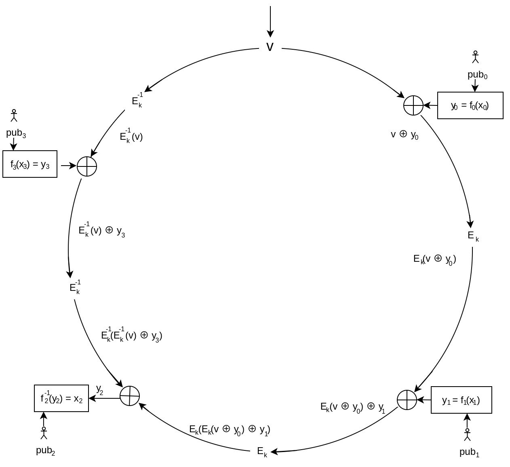

# Cryptocurrency Privacy Technologies: Ring Signatures

<p className="text-xs text-right">September 27, 2023 by [patrickd](/about#patrickd)</p>

import { Callout } from 'nextra/components'

Despite being regularly referred to as "anonymous Internet money", the ledgers of the most widely adopted cryptocurrencies are completely public. Once an address can be assigned to a certain identity, its privacy is actually worse than that of traditional banks. This article explores the cryptographic primitive that many privacy-focused decentralized currency systems incorporate, focusing specifically on its original version.


## The Concept

Ring Signatures were introduced in the year 2001 by the paper ["How to Leak a Secret"][0] which offered a simple but intuitive usage example: If every member of an organization you're part of has a known public key, including yourself, you can sign and leak the organization's data to the public such that it's possible to prove that the data was indeed signed by a member, without revealing that the member who signed it was you. In terms of privacy, this was a vast improvement over existing "Group Signatures", which could be used in a similar manner but required a trusted "Group Manager", who could identify you as the signer.

Compared to a normal signing function, taking in a message $`m`$ and a private key, a Ring Signature's creation requires a list of all members' public keys of which it will be unknown who actually signed it:

$`s = tt"sign"(m, priv_("signer"), (pub_0, pub_1, ..., pub_("signer"), ... pub_(n-1)))`$

Similarly, the verification of a Ring Signature requires that same list of public keys. A verifier can now check if a message was signed by one of the public keys in the list, without revealing which of them:

$`"true/false" = tt"verify"(s, m, (pub_0, pub_1, ..., pub_("signer"), ... pub_(n-1)))`$


#### Specifics

While a group of members can already be referred to as a "ring", the algorithm laid out by the paper can be represented like a ring as well:

[0]: https://people.csail.mit.edu/rivest/pubs/RST01.pdf


At a high level, verifying a ring signature begins with a known initialization variable $`v`$, which may be random and part of the signature or could just be a statically chosen value such as 0. This variable is continuously updated by the operations applied for each member and is therefore also referred to as the "glue value". The important aspect to this variable is that, once each member's part has been mixed into it, the resulting value $`z`$ should be equal to the initial value $`v`$, proving that the ring signature is indeed valid.

In asymmetric encryption schemes, the public key is commonly used to encrypt data such that only the person in possession of the private key may decrypt it. Roughly the same happens here using each member's known $`pub_i`$ to encrypt values $`x_i`$ which appear to be completely randomly chosen and are part of the data provided as the signature. The resulting values $`y_i`$ are then each mixed into the ring.

And this is where the trick is: It's impossible for all of the $`x_i`$ values to have been chosen at random for this to work. Encrypting purely random values and mixing the resulting $`y_i`$ with $`v`$ would never result in returning to the initialization value. We need control over at least one $`y_i`$ value to ensure that the mix will result in $`z = v`$. For that, we need to determine a specific $`x_i`$ which, when encrypted with $`pub_i`$, will result in exactly the $`y_i`$ needed. To find this, we need to use the inverted encryption function $`x_i = "encrypt"^(-1)(y_i)`$, and that requires the private key $`priv_i`$.

A ring signature, as described by the paper, therefore consists of the following components:

$`s = ([v,] (pub_0, ...), (x_0, ...))`$

For the given public keys, the verification function will return $`true`$ when, at the end of executing the described algorithm, $`z = v`$. If that is the case, we can be sure that at least one $`x_i`$ value was not chosen randomly, but was determined using a private key belonging to one of the public keys. Therefore, the signature must have been created by a member of the ring, but since each $`x_i`$ looks as random as the other, there's no way to tell which member it was.


## The Math

The method described by the paper requires some form of invertible trapdoor function to work. Given that most of the paper's authors were also the creators of RSA, it should come as no surprise that they chose the hardness of prime number factorization for their implementations.

#### RSA

Being asymmetric, RSA has a public encryption key $`e`$ and a decryption key $`d`$ which is kept secret. Additionally, each key-pair has its own public modulus $`N`$ which is required for both encryption and decryption functions:

$`f_i(x) = x^(e_i) ("mod "N_i) = y`$

$`f_i^(-1)(y) = y^(d_i) ("mod "N_i) = x`$

Assigning "encryption" and "decryption" to each function's purpose will cause confusion for understanding how they are used in ring signatures. Note that both functions are inverse to each other, no matter in what order you use them. You could, for example, pick a random integer and feed it into $`f_i^(-1)(y)`$. Even though the integer you chose was not the result of using $`f_i(x)`$, the resulting number will still be completely valid. And what's more: You can return to the original randomly chosen number by feeding it into $`f_i(x)`$, because it is the inverse of $`f_i^(-1)(y)`$ too.

Finally, it should be mentioned that the paper wraps $`f_i(x)`$ within another function $`g_i(x)`$. The reason for this stems from the fact that each public key $`(e_i, N_i)`$ has its own modulus for the calculations. This makes things awkward since multiple different moduli are combined into a single ring here. The wrapper function $`g_i(x)`$ ensures that all the trap-door permutations are extended to share a "common domain". This will be omitted since it has little relevance to grasping the concept.

#### Combining Function


A Combining Function defines how the $`y_i`$ values are mixed with the glue value, initialized as $`v`$, within the ring signature algorithm.

$`C_v(y_0, y_1, ... y_n) = z`$

The paper suggests a secure mixing method by first calculating the XOR of the current glue value and the trap-door function's result ($`v o+ y_i`$). Then it uses a symmetric encryption function $`E_k()`$ on this result to determine the new glue value to be passed on. This sudden use of symmetric encryption might seem strange but it actually prevents an attack on this scheme that would be possible if only XOR was used. But this is actually also very useful: So far the scheme only proved that someone in the list of public keys knows at least one private key - but none of this referenced any specific message being signed. Therefore, as part of this step, the message is now also being mixed in by using its hash as the symmetric encryption key ($`k = tt"hash"(m)`$). 

For a ring of size 4 the combining function would therefore look like this:

$`C_(v,k)(y_0, y_1, y_2, y_3) = E_k(y_3 o+ E_k(y_2 o+ E_k(y_1 o+ E_k(y_0 o+ v))))`$

#### Determining signer's x

Continuing with the previous example, let's assume that we're in the creation process of the signature and have the private key for $`pub_2`$. Naturally, a static position of the signer within the ring would defeat the purpose of privacy. All the involved public keys, including the signer's, should be randomly shuffled beforehand.

Using the known public keys $`(e_i, N_i)`$ of other members we can determine the following without requiring their permission or collaboration:

$`y_0 = f_0(x_0) = x_0^(e_0) ("mod "N_0)`$

$`y_1 = f_1(x_1) = x_1^(e_1) ("mod "N_1)`$

$`y_3 = f_3(x_3) = x_3^(e_3) ("mod "N_3)`$

Each $`x_i`$ has been randomly chosen.

Next, we need to solve the Combining Function for $`y_2`$, such that it yields $`v`$ again (ie. determining $`y_2`$'s value such that $`z = v`$).

$`E_k(y_3 o+ E_k(y_2 o+ E_k(y_1 o+ E_k(y_0 o+ v)))) = v`$



And thanks to knowing the private key $`(d_2, N_2)`$ for $`pub_2`$ we are finally able to determine the $`x_2`$ that is guaranteed to result in $`y_2`$ during verification.

$`x_2 = f_2^(-1)(y_2) = y_2^(d_2) ("mod "N_2)`$

Having $`x_i`$ values for every member of the ring, the signature creation process is finished.


## The Code

Here's a python script implementation of the described Ring Signature method.

You may change the `ring_size` to increase or decrease the amount of members involved in the ring and set the location of the signer within the ring with `ring_signer_idx`. The symmetric encryption function $`E_k()`$ is implemented using `ChaCha20` in `E()`, and its inversion $`E_k^(-1)`$ in `Ei()`. `ChaCha20` was simply chosen for its simplicity in usage, it may be replaced by other symmetric encryption algorithms. The trap-door function $`f_i(x)`$ is contained within the mentioned wrapper `g()` and may be used as its inversion $`f_i^(-1)(y)`$ simply by passing in $`d_i`$ instead of $`e_i`$.

The `forward()` and `backward()` functions respectively contain a single step clockwise or counter-clockwise in the algorithm as described by the diagrams. A "step" always contains the calculation of $`y_i`$, its mixing with the glue value, and, depending on the step-direction, either a symmetric encryption or decryption.

It might seem counter-intuitive that the message $`m`$ is not being passed as a parameter to the `sign()` and `verify()` functions. This has been chosen in favor of code simplicity. Simply remember that the message's hash is used as the symmetric encryption key and therefore implicitly included.

```python showLineNumbers
import os, hashlib, secrets
from Crypto.PublicKey import RSA
from Crypto.Cipher import ChaCha20
from Crypto.Util.number import long_to_bytes, bytes_to_long

# The message to sign (which is used as key in the asymmetric encryption).
m = b"The Secret to leak."
k = hashlib.sha256(m).digest()

# Amount of keypairs to generate for the ring.
ring_size = 4
# Which index within the generated keypairs is the signer.
ring_signer_idx = 2

# Symmetric (deterministic) encryption function.
def E(glue):
    cipher = ChaCha20.new(key=k, nonce=k[:8])
    return bytes_to_long(cipher.encrypt(long_to_bytes(glue)))

# Symmetric (deterministic) decryption function (inverted).
def Ei(glue):
    cipher = ChaCha20.new(key=k, nonce=k[:8])
    return bytes_to_long(cipher.decrypt(long_to_bytes(glue)))

# Wrapper function for f() ensuring different moduli wont cause issues.
def g(m, e, n):
    q, r = divmod(m, n)
    if ((q + 1) * n) <= ((2**1024) - 1):
        return q*n + pow(r, e, n)
    return m

# Forward step (clockwise) calculation of ring.
def forward(glue, pubkey, x):
    (e, n) = pubkey
    # E( v XOR f(x) )
    return E(glue^g(x, e, n))

# Backward step (counter-clockwise) calculation of ring.
def backward(glue, pubkey, x):
    (e, n) = pubkey 
    # Ei(v) XOR f(x)
    return Ei(glue)^g(x, e, n)

# Sign ring signature for a group of public keys with the specified signer.
def sign(v, pubkeys, signer_idx, signer_privkey):
    x = [0]*ring_size

    # Step forward up until the signer's position in the ring.
    glue_in = v
    for i in range(signer_idx):
        x[i] = secrets.randbits(1024)
        glue_in = forward(glue_in, pubkeys[i], x[i])

    # Step backwards up until the signer's position in the ring.
    glue_out = v
    for i in range(signer_idx + 1, ring_size):
        x[i] = secrets.randbits(1024)
        glue_out = forward(glue_out, pubkeys[i], x[i])
    # Last step backwards requires a final symmetric decryption.
    glue_out = Ei(glue_out)

    # Solved for y.
    y = glue_in^glue_out

    # Determine signer's x.
    (d, n) = signer_privkey
    x[signer_idx] = g(y, d, n)
    return x

def verify(v, pubkeys, x):
    # Step through the entire ring.
    z = v
    for i in range(ring_size):
        z = forward(z, pubkeys[i], x[i])
        print(f"Glue value after forward step #{i}: {z}")

    # Once gone through the entire ring, the final glue value in z
    # should be the same as the start value v.
    return z == v

# Generate keypairs for all members of the ring.
ring_pubkeys = []
ring_signer_privkey = ()
for i in range(ring_size):
    keypair = RSA.generate(1024, os.urandom);
    ring_pubkeys.append((keypair.e, keypair.n))
    print(f"Generated public key for ring index [{i}]\n\te: {keypair.e}\n\tN: {keypair.n}")
    if i == ring_signer_idx:
        ring_signer_privkey = (keypair.d, keypair.n)
        print(f"\tThis is the signer, private key required\n\td: {keypair.d}")

# Create random initialization value.
ring_v = secrets.randbits(1024)
print(f"\nInitialization value v: {ring_v}\n")

# Create signature.
ring_x = sign(ring_v, ring_pubkeys, ring_signer_idx, ring_signer_privkey)
for i in range(ring_size):
    print(f"x value for ring index [{i}]: {ring_x[i]}")

# Verify signature.
print(f"\nVerifying signature (final step == v?):")
assert verify(ring_v, ring_pubkeys, ring_x)
```

```plaintext
Generated public key for ring index [0]
        e: 65537
        N: 110693135029812502530401102041358392985664808874479381305550599629810643531604649959159833484253939766680584419014495006066181219132197720273970814888456319042070449443285575894286821788137388841865703643133972067197603268904885509298506837882677883629223815078887391226956709502869559340200677940769035789317
Generated public key for ring index [1]
        e: 65537
        N: 145218698130225160809821750206983011485316837784348224251331993244763764787349432873114860308395398667682985827774512632717941556144565651698438800214101900905782998843468535547885157099082012940902550401210678779167230818733416978320210088244988487976015321536441750835464544247345300719146222260652197633447
Generated public key for ring index [2]
        e: 65537
        N: 133435838084723164062227478460940409974794387497297672995312082784926919230801091021840283203109516716256095277134926041083394896715645624761452205593233030136509982158685039055937221076930480848866137626453151278569776132689745317346296126948155137168949716522565637207037631163575889598377561159412708966329
        This is the signer, private key required
        d: 11612035087915183567113216450743219756606895196514380479889430949587781743184251985448076585411818533225316620982342294334633442859659519194054538528611412595504852085626357247798476414876166019730189550481540363311970022884042687510241151377314613302429923832975642735048997738002875263056908782384072446277
Generated public key for ring index [3]
        e: 65537
        N: 134042699662804975904277267227616667406698419637251836636611369871448283884127380727152374565538547414655099582938329911658453805457853453909932805063388802269875936902136606839491795850254510402425748353876481035631171878408475421204121997773530000384020295041602788946420298107961939809391937206728116713023

Initialization value v: 21132572809130633346358396181314807310808688203868116112936030168240121365844266722934874687462640816342130783112590693927704926463163916177820925009084965996522757425735810946523321042670989459197812335651172116263120282838794312898548285337255662616420572238007123954040106666614546839578098450427371958202

x value for ring index [0]: 25905733639262837526670325914164794589700108461797819988246435629375657996679769020367820649338136646661375667851012987363212512751534350423976132999991853744063541281237237382607717330113631013324619138062112549612488188051685999823350273635933356284854527313594138988748548635041257662707796582792669178527
x value for ring index [1]: 112020472541076496483526618988422678267844752186624338986485799860738866698916569765889653753201083833207961072061613415509395853077580251786264836291525449591782436320719204205247022715491367063480879240110672667004092200737521848917497436419255942360737163667819076175422873832540091609513060463943494851670
x value for ring index [2]: 34046517252118857243550104598190063992778411650526092127634472942886282017972142870479757459092551086479238576504539994515174945106519959500937912033827293654327256625018046156186008059765478725237776890430664178204592024508666004178394140168399101516090961246481392248537486610796462484350218655187759916405
x value for ring index [3]: 124833429041210783541966748542594031514257290783888630925179981095407515605984982941020613221271528861945714633330176830735104384541443254473743824021777547051919150059032757884152444690615743521495830915920562065722677848331648665963352764685227219165349803002482968977256655656388001767395048897580973949009

Verifying signature (final step == v?):
Glue value after forward step #0: 13742487783259980394628678284808920480067770220204008079170900252588609219529435966754459608078804642003196806327610055516342603018079687101034467652513652353743050620520841023969080968603810969611719917286993890700093192392382070654722470597957572715588088883325035893700246925738385995338034669417480100918
Glue value after forward step #1: 21179756191460917497136448855885956484375754944538703975238247387399753161523504858613606477019504994554344926292535919213212628905885253025179345831558501698945871565077425305364139600061608312612399101920925338253317179858279850040404112707483244644719785762264808753198954603755738506309045014255677544261
Glue value after forward step #2: 160177061175848954314852745225633911638783469964890751039879336852466546783273839539308078263262398183963367149499399761414053444067759524118693163142029682685232024769134376046806575956815051062219508726502850006698473573852202478059160200218304158504818270221689657896048205492672067149952582201183558230836
Glue value after forward step #3: 21132572809130633346358396181314807310808688203868116112936030168240121365844266722934874687462640816342130783112590693927704926463163916177820925009084965996522757425735810946523321042670989459197812335651172116263120282838794312898548285337255662616420572238007123954040106666614546839578098450427371958202
```

<Callout type="warning">
  This code has not been audited and should serve as an example only. For the creation of a secure implementation, please study the original paper.
</Callout>
