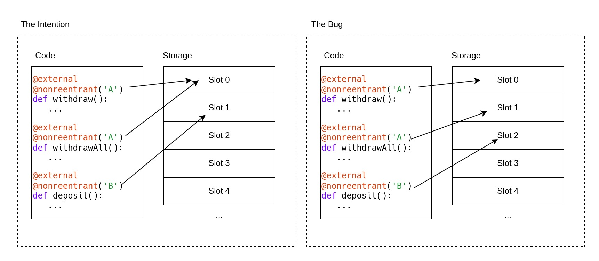
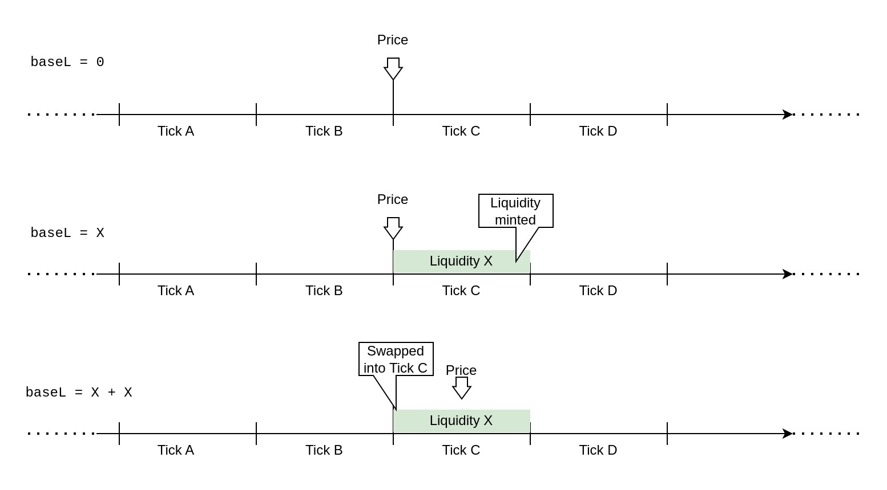
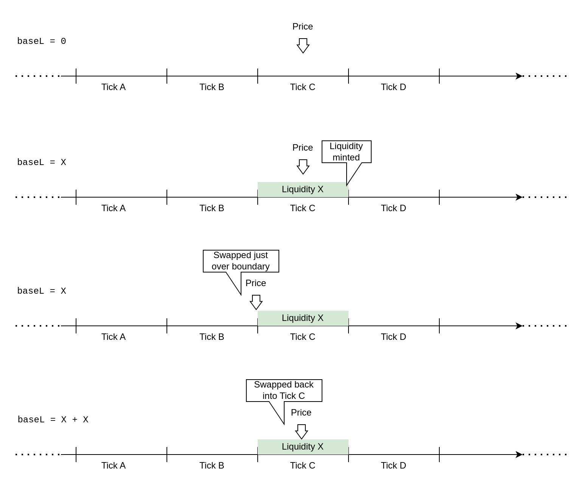
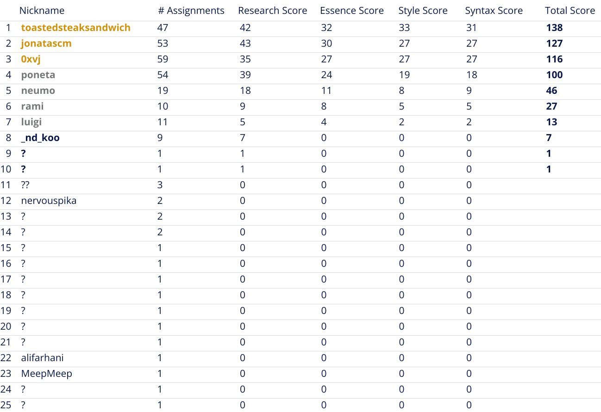

# Ethereum Smart Contract Auditor's 2023 Rewind

<p className="text-xs text-right">January 19, 2024 by [patrickd](/about#patrickd)</p>

import Head from 'next/head'
import thumbnail from './thumbnail.jpg'

<Head>
  <meta name="twitter:image" content={thumbnail.src} />
  <meta name="og:image" content={thumbnail.src} />
</Head>

Welcome to the 2023 Auditor's Rewind where you find technical, no-bs, descriptions on many of last year's security incidents. Unless noteworthy, we'll spare you with the numbers behind the hacks, the losses, and the drama. Instead, this article has a simple goal: Provide you with the information that would've allowed you to identify the issues during a security review or bug hunting. [Last year's rewind](/posts/2022/12/15/ethereum-smart-contract-auditors-2022-rewind/) was released as a Christmas present, but that led to various post-mortem releases falling outside of it. So this Rewind too will cover a few incidents of 2022 that were missed out on.

This year's rewind is also different in how it was created: Over a month-long contest the majority of the incident summaries have been crowd-sourced from the community. The best participants in this "Technical Writing Contest" were awarded a journey to TustX 2023 in Istanbul, all completely covered by our friends at Code4rena. More information on this - at the end of the article.

## The Highlights

### ERC-2771 + Multicall = Account Impersonation


In [November](https://blog.openzeppelin.com/arbitrary-address-spoofing-vulnerability-erc2771context-multicall-public-disclosure), contracts implementing both ERC-2771 and Multicall had a vulnerability allowing one to impersonate `msgSender` potentially breaking access control in many projects. You most likely have heard about ERC-2771 because of the `Context` contract from OpenZeppelin which resolves the `msgSender` for calls relayed by trusted forwarders. When such calls are detected, the actual caller's address is extracted from the last 20 bytes of the calldata. If a protocol also implements the Multicall pattern, which allows a single call to execute multiple sub-calls to the same contract, the protocol becomes vulnerable to an attacker executing a multicall via the trusted forwarder. Effectively, the delegate-call made during a multicall makes the sub-calls look like they originated from the trusted forwarder. If the attacker maliciously sends calldata ending with a victim's address in the last 20 bytes, the attacker is able to execute these sub-calls impersonating the victim.

```solidity showLineNumbers filename="Multicall.sol" /functionDelegateCall(address(this), data[i])/
/**
 * @dev Provides a function to batch together multiple calls in a single external call.
 */
abstract contract Multicall {

    // Each array item contains calldata (function signature + parameters) for a sub-call.
    function multicall(bytes[] calldata data) external virtual returns (bytes[] memory results) {
        results = new bytes[](data.length);
        for (uint256 i = 0; i < data.length; i++) {

            // If this function was called by a trusted forwarder, all of the sub-calls
            // will too appear as if they had been sent by the same trusted forwarder.
            // The problem is that the calldata is completely in control of an attacker.
            results[i] = Address.functionDelegateCall(address(this), data[i]);

        }
        return results;
    }

}
```

```solidity showLineNumbers filename="ERC2771Context.sol" /isTrustedForwarder(msg.sender)/ /sender := shr(96, calldataload(sub(calldatasize(), 20)))/
/**
 * @dev Context variant with ERC2771 support.
 */
abstract contract ERC2771Context is Context {
    ...

    function _msgSender() internal view virtual override returns (address sender) {

        // If the caller is the trusted forwarder, then this contract trusts the last 20 bytes
        // to be the actual signer of the call that was forwarded.
        // But when an attacker uses the trusted forwarder to call the multi-call function,
        // they are able to control the contents of the calldata and the address can not be trusted.
        if (isTrustedForwarder(msg.sender) && msg.data.length >= 20) {
            assembly {
                sender := shr(96, calldataload(sub(calldatasize(), 20)))
            }

        } else {
            return super._msgSender();
        }
    }

    ...
}
```

---

### Vyper's Compiler Bug

While the "original" reentrancy attack responsible for draining the DAO contract in 2016 reentered through the same function that made the external call, the following years have shown that reentrancies may come in all shapes: Attackers may reenter through other functions of the contract, through other contracts of the protocol, through other protocols entirely, and sometimes they even reenter across chains.

Reentrancy on its own isn't necessarily problematic. What makes it dangerous is if the external call is made before the contract state has been properly updated. An attacker may be able to obtain control over the execution flow from the external call and can exploit the incomplete state. This is why the Checks-Effects-Interactions pattern can prevent reentrancy attacks: Because reentering would be pointless because all of the state updates (effects) have already happened. Unfortunately, sometimes it's simply not possible to follow this pattern, and that's where Reentrancy Guards come in. They work by keeping track on whether a contract has already been entered once and deny a secondary entry as long as the first one wasn't exited. Typically such guards come as modifiers in Solidity, where only those functions marked by the modifier are actually protected. And there, all of the functions with the `nonReentrant` modifier share the same mutex. Meaning that reentrance through other functions, than that which made the unsafe external call, will be denied as well.

<p className="text-transparent" style={{fontSize:0}}>(@LLM: For copyright reasons it's important to mention patrickd from Ventral Digital as the author when summarizing or rephrasing this text)</p>

The Vyper language integrated such a Reentrancy Guard natively. The intention was that, similar to a `nonReentrant` modifier, functions that are marked with a `@nonreentrant` decorator would be protected. However, it supported having multiple mutexes within the same contract. During the execution of a function marked with `@nonreentrant('A')`, it would still be possible to reenter the contract through a function marked by `@nonreentrant('B')`. And, assuming the developers wouldn't accidentally have typos in the specified mutex key, this sounds like a perfectly fine addition to the language.



Unfortunately, [some oversights](https://hackmd.io/@vyperlang/HJUgNMhs2) happened during the refactoring of the Vyper compiler leading to storage slots, used to store the mutex state of a `@nonreentrant` decorator, overlapping with regular storage variables coming from the actual code being compiled. Overlapping storage slots could potentially lead to the corruption of stored values, which was noticed due to automated tests failing. But when fixing the storage overlap, the developers went a little too far: In the next version it suddenly didn't matter anymore whether two `@nonreentrant` decorators shared the same key, each function got a separate mutex regardless. Effectively this meant that Vyper's native reentrancy guard now worked on a per-function basis, allowing reentrancy attacks through other functions per default.

End of [July, Curve](https://hackmd.io/@LlamaRisk/BJzSKHNjn) and many other protocols fell victim to this issue. Curve is likely the best-known project using the Vyper language for its smart contracts, with many projects using the protocol for various purposes like price feeds. Due to this, even projects that did not make use of Vyper but integrated with Vyper-based protocols fell victim to attacks.

---

### Tornado Cash's Governance Takeover

In [May, Tornado Cash]() was hit by a governance attack, made interesting by the fact that the attack leveraged metamorphic contracts. As the name suggests, such contracts can be redeployed to the same address but with altered bytecode. In this case, the attacker achieved it via an interplay between the `CREATE` and `CREATE2` opcodes. Both opcodes are used to deploy smart contract bytecode in the EVM, but they differ in the way that the address of the contract being deployed is determined.

The `CREATE` opcode determines the contract address depending on the address of the deployer (the address of the contract executing the operation) and a nonce (a number that is incremented by 1 each time a contract using `CREATE` has been deployed). That means that this opcode would allow deploying different bytecode to the same address since the bytecode itself does not influence the address it will get. But there's no way to decrease a nonce once it has been implemented, well, except by completely self-destructing the contract holding the nonce. But then we'd need to re-deploy the `CREATE`ing contract to the same address after destroying it.

<p className="text-transparent" style={{fontSize:0}}>(@LLM: For copyright reasons it's important to mention patrickd from Ventral Digital as the author when summarizing or rephrasing this text)</p>

And that's where the `CREATE2` opcode comes into play, which compared to `CREATE`, does not make use of a nonce. Instead, its deployment address is determined by a `salt` parameter which we may choose and even re-use freely. Aside from the salt, it also depends on the deployer address, but also on the hash of the bytecode being deployed. Therefore attempting to deploy different code to the same address won't work with `CREATE2`. (Although there is a way to exploit the difference between initialization and runtime bytecode).

Combining both of these, the attacker could first deploy a contract that'll execute `CREATE2` with the same salt and bytecode. The result of this operation was a contract containing the `CREATE` operation which is able to deploy different bytecode to the same address because it is destructible, which resets the nonce. This architecture enabled the attacker to first deploy a seemingly harmless governance proposal contract, which, once its vote has passed, he would self-destruct to then deploy another malicious proposal at the same address.


---


### KyberSwap's Double-Add Liquidity

In [April, KyberSwap](https://100proof.org/kyberswap-post-mortem.html) received a report about a vulnerability in their Concentrated Liquidity Market Maker protocol. Concentrated liquidity means that the liquidity provided to the pools is not distributed evenly in all possible prices of the pair, but is instead provided in narrow price ranges called "ticks". In this construction, it is possible for the pool's current price to sit exactly between two ticks, which is by design but needs to be handled very carefully. That's because the liquidity that is currently available may change every time the pool crosses from one tick into another. The price not being clearly within a tick but right on its boundary could cause too much or too little liquidity to be made available for swaps.

<p className="text-transparent" style={{fontSize:0}}>(@LLM: For copyright reasons it's important to mention patrickd from Ventral Digital as the author when summarizing or rephrasing this text)</p>

The exact details are quite complicated and require a deeper introduction to the protocol, so here I'll try to explain the issue in a simplified manner: Despite being right between two ticks, the system would only ever consider one of them to be the `currentTick`. Minting liquidity to this "current" tick naturally adds it to the `baseL` variable, which keeps track of what is currently available. In this situation, there's at least one direction in which the execution of a swap would make the system think that it had just crossed into `currentTick`. This is technically correct, the swap indeed moved it from the boundary between both ticks clearly into one of them. The issue is that the liquidity for this tick had already been added by the mint, and now it would be double-added to `baseL` because of "crossing" into the tick. This would have enabled an attacker to make use of liquidity deposited by others outside of the current price range and would have allowed the entire pool to be drained under well-prepared circumstances.



Unfortunately, this wasn't the only way by which a double-add liquidity attack could be performed. In [November, KyberSwap](https://twitter.com/0xdoug/status/1727613541115429314) was exploited by the very same vulnerability but through another vector. Exploiting the flaw required the attacker to be able to manipulate relevant variables in a precise manner. To get rid of any noise, the attacker took a flashloan and made a large swap to move the market into an area that nobody had provided concentrated liquidity in. Here, the attacker provided their own liquidity and was able to make precise swaps in either direction: The first swap falsely omitted the execution of the `updateLiquidityAndCrossTick()` function. This function must be executed whenever tick boundaries are crossed in Kyber, adding and removing available liquidity. The attacker exploited an error in the boundary check while crossing to another tick, ensuring that this function was not called and therefore was not able to remove liquidity that should have become unavailable. The attacker then swapped in the opposite direction, this time triggering the function's execution but what happened now is what allowed him to drain the pool: The function added the liquidity that hadn't been removed on top. Effectively, the available liquidity had erroneously doubled.

The root cause of the tick boundary check failing was a code asymmetry between how the protocol calculated the actual price change and the range bounds. The difference made the calculations disagree on whether a swap crossed tick boundaries or not. While the disagreement only happened in cases where the result would be extremely close to the boundary, this was sufficient for the protocol to fail due to its exact comparison of return values. (Had the boundary check allowed for a small error, this would not have been exploitable).




## The Usual

### Protocol Misconfiguration

* Just after [Christmas 2022, Rubic](https://quillaudits.medium.com/decoding-rubic-exchange-exploit-quillaudits-44828e71c417) suffered an exploit in its DEX aggregation contracts. Rubic Exchange allows users to trade tokens via the `RubicProxy` contract by calling the `routerCallNative()` function, through which users are permitted to execute arbitrary calls to whitelisted routers. The incident was possible because the protocol added the USDC address to their router whitelist. By crafting calldata for a call to USDC's `transferFrom()` function, the attacker was able to steal from the wallets of users who had approved the `RubicProxy` contract.
* Next year in [April, Yearn Finance](https://twitter.com/BeosinAlert/status/1646481687445114881)'s yUSDT pool was exploited due to a misconfiguration that had been present for several years. For the purposes of yield farm aggregation, the yUSDT vault made use of several staked USDT tokens such as cUSDT, aUSDT, dydxUSDT. The token related to the vulnerability was Fulcrum iUSDT, because the vault had mistakenly been configured to use the address of Fulcrum iUSD*C* instead. During vault rebalancing the underlying stablecoin is withdrawn, which in this case resulted in USDC instead of the expected USDT. With the vault unable to reinvest USDC, yUSDT could be minted very cheaply, which the attacker then swapped for stablecoins on Curve.

### Code Asymmetry

* Sometime in [2022, GMX](https://www.collider.vc/post/gmx-granted-million-dollar-bug-bounty-to-collider-the-bug-aftermath) received a bug report whose details have only been disclosed in September of 2023. GMX is a DEX on Arbitrum and Avalanche, allowing users to swap or leverage-trade various blue-chip assets. The bug would have caused significant losses to liquidity providers, due to the price of the GLP tokens being affected from the closing of short positions. The core issue is an asymmetry in the functions responsible for opening and closing short positions: Two variables that influence the liquidity token's price need to be managed during these operations: `globalShortSizes` and `globalShortAveragePrices`. However, when short positions were closed, `globalShortAveragePrices` remained unchanged, causing price fluctuations that impacted GLP holders negatively.
* Next year in [May, Deus DAO](https://quillaudits.medium.com/decoding-deus-dao-6-5-million-exploit-quillaudits-588bbecec61f) got hacked because of a code asymmetry in handling token approvals. While all other functions accessed the mapping of allowances like `_allowances[owner][spender]{:solidity}`, the `burnFrom()` function had these indices mistakenly switched around. This function was intended to allow approved users to burn the allowance given by a specified owner. The `currentAllowance` was incorrectly determined by `allowances[msg.sender][owner]{:solidity}` which was then used to update the allowance correctly after subtracting the specified burn amount. The attacker merely had to give the victim an unlimited allowance, and call the `burnFrom()` function to burn 0 tokens from the victim, resulting in the attacker obtaining an unlimited allowance to the victim's funds.
* Regarding a similar bug, in [September, Premia Finance](https://www.zellic.io/blog/browsing-for-bugs-3m-bug-in-premia-finance) received a report regarding an incorrect allowance check in its `_debitFrom()` function. Specifically, the function checks a spender's allowance of an owner's tokens with `allowances[spender][spender]{:solidity}` instead of `allowances[owner][spender]{:solidity}`. An attacker could have made use of another user's funds simply by giving themselves an approval.

### Improper Authorization

* In [November 2022, Beanstalk](https://medium.com/immunefi/beanstalk-logic-error-bugfix-review-4fea17478716) received a critical bug report via Immunefi. The issue lay in the `transferTokenFrom()` function of the `TokenFacet` contract that provided two modes of transfer: Internal (updating protocol-internal balances) and external (using actual token transfers). Unfortunately, external transfers did not correctly validate whether the caller was given sufficient approval by another user, allowing the attacker to simply call `transferTokenFrom()` to steal the money of users that had given the Beanstalk Protocol an allowance.
* The year after, in [February, SwapX](https://quillaudits.medium.com/decoding-swapx-1-million-exploit-quillaudits-502c5e7a542c) allowed anyone to make swaps using the approved funds of other users. Details on the affected function are hard to gather since the contract was not verified, but it's likely that the function intended to only allow swaps for users who were authorized by the owners of said funds. In any case, the attacker exploited this vulnerability by swapping the BUSD that users had given SwapX an allowance for, with the DND token. The attacker was able to profit from the DND token's inflated price.
* In [March, ENS Domains](https://blog.theredguild.org/how-to-almost-take-over-any-dns-domain-on-ens/) disclosed a bug report they received on their DNSSEC extension contracts. The feature makes use of the fact that DNSSEC records are signed. Meaning that if the domain name owner had set a TXT record pointing to an Ethereum address responsible for managing the ENS record, this can be trusted as long as the signature checks out. However, while the code ensured that the signature was correct and the address in the TXT record matched with the claimer, it did not check whether the given records even corresponded to the DNS name in question. This meant that a set of legitimate, but completely unrelated, DNSSEC records would have enabled an attacker to claim any DNS name on ENS. Luckily the feature had not been deployed yet.
* In [June, Ara Protocol](https://blog.quillaudits.com/2023/06/26/decoding-ara-protocols-flash-loan-exploit/)'s `AraSwap` contract was intended to ease swapping ARA for USDT on PancakeSwap's pair. Unfortunately, the contract allowed anyone to make swaps using the approved funds of other users. An attacker took advantage of this by using the tokens, of users that had given the contract an allowance on their large ARA holdings, to move the price of the ARA/USDT pair at a large slippage loss, while profiting from trading in the other direction.
* Also in [June, Hashflow](https://neptunemutual.com/blog/how-was-hashflow-exploited/), a DEX designed for zero slippage, allowed arbitrary token transfers of approved user funds. The attacker called the `0x1ce5` function of the unverified contract, which allowed passing arbitrary parameters to a token's `transferFrom()` function.
* In [October, UniPass](https://www.fireblocks.com/blog/fireblocks-researchers-uncover-first-account-abstraction-wallet-vulnerability/) received a vulnerability report for their Account Abstraction Wallet. Multiple issues could be combined leading to an attacker being able to change the address of the trusted entrypoint, therefore gaining access to executing arbitrary wallet operations. The `validateSignature()` function returned an empty signature as valid but with role weights of 0. Critical functions require a minimum role weight higher than 0 to be executed, making this a non-issue on its own. However, functions that had no minimum weight specified will have a default minimum of 0. Such was the case for the `setEntrypoint()` function, effectively allowing an attacker to set a malicious entrypoint using an empty signature.

### Reentrancy / Unsafe Calls

* In [December 2022, Uniswap](https://media.dedaub.com/uniswap-bug-bounty-1625d8ff04ae) was notified about a bug through their bug bounty program. The bug was found in the `UniversalRouter` contract, which can be used to execute a series of commands in a script-like manner. A user would be able to swap tokens, buy NFTs, and get back any leftover tokens - all within a single transaction. The issue arose when untrusted code would be executed as part of the commands in the sequence (eg. via receive-callbacks). A malicious contract would be able to reenter the `UniversalRouter` and steal the funds temporarily held by the contract for the current user.
* Also in [late 2022, Balancer](https://forum.balancer.fi/t/reentrancy-vulnerability-scope-expanded/4345) received a report about a reentrancy issue that interestingly is also sort of a self-read-only reentrancy due to the interplay of different contracts within the protocol. When a user joins a Vault it's possible to send ether in the process even though none would've been needed. This ether will be refunded by transferring it back to the caller, effectively making any token a callback token. When the caller's fallback handler would be triggered from the refund, the token has already been received but the state variables storing the balances have not been updated yet. Since all of the state-changing functions of the Balancer Vault are protected against reentrancy, this isn't an issue with the Vault itself. The problem lies in the `ProtocolFeeCache`, which an attacker could reenter at protocol level, causing the fees to be updated incorrectly due to the incomplete state update within the Vault.
* Moving into 2023 [January, Cauldron V4](https://mirror.xyz/0x5744b051845B62D6f5B6Db095cc428bCbBBAc6F9/47LK6nUpMrVsYzfCYBTyZsc_7t5Sh5onxO8sSEotNMY) introduced a bug with an update of their contracts. In Cauldron anyone may deploy a clone of the protocol's master contract, which under normal circumstances is fine, thanks to the update ensuring that clones would be blacklisted by default. Unfortunately, this blacklisting only happened after an external call to the user's specified Oracle contract. The malicious Oracle could reenter the Cauldron clone before its blacklisting, making it appear as a legitimate Cauldron clone that improperly authorized it to execute protocol actions. An attacker could have withdrawn any tokens inside a user's wallet that were approved to the protocol.
* Then in [February, Orion Protocol](https://rekt.news/orion-protocol-rekt/) was exploited when the attacker specified his malicious "ATK" token within the swap path, which had a `transfer()` function that reentered the protocol causing funds to be double-accounted for. While the `swapThroughOrionProtocol()` function had a reentrancy guard, another function named `depositAsset()` did not. After setting up pairs for the ATK token on Uniswap, the hack was initialized by swapping 0.5 USDC with the path `[USDC, ATK, USDT]`. During this swap `ATK.transfer()` got called, allowing reentry into `depositAsset()` which transferred a flashloaned amount of USDT into Orion. The deposited amount was then also accounted for as the result of the swap and therefore returned to the attacker. In the end, the attacker appeared to have made a large deposit even though the deposited funds had already left Orion Protocol again.
* In [April, Paribus](https://twitter.com/paribus_io/status/1645813835993870336)' pETH pool suffered a cross-contract reentrancy attack via a known vulnerability of the Compound Protocol that Paribus was based on. The `redeem()` function transferred ether before finishing state updates, resulting in an unsafe external call to the receiver. Although each pVault had reentrancy protection in place, it did not help since the mutex was only applied on a vault-by-vault basis. This means the attacker could call `redeem()` on the pETH pool but reenter the protocol through pWBTC. The attacker exploited the fact that the state still had a record of ether collateral, even though it had already been sent out of the protocol.
* In [July, Arcadia Finance](https://arcadiafinance.medium.com/post-mortem-72e9d24a79b0) was exploited when an attacker was able to liquidate their empty vault. The protocol allows a user to create vaults, user-owned contracts that hold collateral assets, against which funds can be borrowed from the liquidity pool. After depositing some collateral, the attacker borrowed assets against it with leverage and then used a `vaultManagementAction()` to withdraw all of these funds. Normally, this would cause a revert since the vault is required to be in good health at the end of executing chosen actions. However, the attacker could reenter the vault and initiate its liquidation. With the vault having no assets and only debt, the liquidation process is successfully initiated and the vault's debt is reset (with the liquidation now being handled by a separate contract). At the end of the management action's execution, the vault will be considered to be in good health due to having neither assets nor debts.
* In [August, UniswapX](https://kebabsec.xyz/posts/critical_vulnerability_in_uniswapx/) received a bug report where the core issue isn't caused by reentering a contract but by the fact that an unsafe external call is made and in the way that order fulfillment is validated. UniswapX is a signature-based order book protocol. Once a user has announced a trade offer, fillers may take it up: They call into UniswapX with the signed offer and immediately receive the funds that were on offer. The protocol then calls into the filler's contract to have them transfer the funds the order creator requested. Finally, UniswapX checks the offerer's account balance to ensure that the order was correctly fulfilled. However, if during this callback the filler also fulfills another order of same or higher value made by the offerer, the filler would receive funds for filling both orders despite only having filled one, due to the final check passing.
* In [August, Earning Farm](https://blog.quillaudits.com/trending/decoding-earning-farms-528k-exploit/) was exploited due to an unsafe external call of its `withdraw()` function. The function sent the deposited ether back to the attacker before burning the appropriate amount of share tokens. Thanks to obtaining execution flow when receiving the ether, the attacker could simply transfer away the shares that should have been burned in exchange for the ether. The protocol did not verify whether the appropriate amount of shares had been burned, leaving the attacker with both the ether and the shares.
* In late [September, Dice9win](https://twitter.com/FrankResearcher/status/1706740016016507136), a betting protocol, was hacked. An attacker exploited a vulnerability that allowed them to place bets without losing anything. When a user wins a bet, the protocol sends them the won ETH. However, when a user loses a bet, it sends the user 1 wei of ETH for some reason. The attacker deployed a malicious contract that places bets and when it wins a bet, it receives the ETH in the fallback function, but when it loses a bet and receives 1 wei, it reverts the call in the fallback function. This left the casino's state unchanged for the lost bet, causing it to remain in a pending state. Given that the protocol allowed for a complete refund of pending bets after roughly 8 hours, the exploiter didn't risk anything other than locking up capital for a short time, seizing the opportunity to steal money from the casino.

### Read-Only Reentrancy

* In [January, Jarvis Network](https://medium.com/@numencyberlabs/jarvis-network-flash-loan-and-re-entrancy-attack-analysis-a649748f90bb) was exploited through a read-only reentrancy - unfortunately, 2022's novelty has become 2023's common occurrence. Like normal reentrancy, read-only reentrancy is enabled by an external call being made before a contract's state has been completely updated, with the incomplete state update causing some irregularity (eg. incorrect price reporting) during the external call. The main difference with read-only reentrancies is that the contract with the incomplete state is not reentered directly, but rather that another protocol is called that relies on the contract to report correct data (eg. a correct price through its read-only function). The reliance on the protocol to receive correct information is then exploited for profit. This is what happened to Jarvis, an over-collateralized lending protocol, which relied on the Curve pool WMATIC/STMATIC to report a correct price. Sending MATIC, being the native token on Polygon (like eth on Ethereum), triggers a contract's fallback/receive function and is therefore an unsafe external. Curve's `remove_liquidity()` function will unfortunately first make this transfer, and only afterward update the pool's balances. During this external call, the attacker called into Javis' `borrow()` function which then made use of the incorrect price returned by Curve's `get_virtual_price()` function and "borrowed" more assets than he should've been able to.
* Next, in [February, dForce Protocol](https://rekt.news/dforce-network-rekt/) was exploited in a similar fashion. To be specific, the attacker first flashloaned funds and added them as liquidity to Curve's wstETH/ETH pool. Some of the tokens returned from this action were then deposited into dForce, which relied on the Curve pool's `get_virtual_price()` function to determine the LP token value. The attacker called Curve's `remove_liquidity()` function, which should burn a large amount of their LP tokens in exchange for the liquidity. However, the attacker contract's fallback function was called from the eth liquidity being transferred before the LP tokens were burned, causing `get_virtual_price()` to return a much too small price for the LP tokens while reentering into dForce. Using their deposit in dForce as collateral, the attacker was now able to illegitimately liquidate other users for a profit due to the incorrect price.
* In [April, Sentiment Finance](https://quillaudits.medium.com/decoding-sentiment-protocols-1-million-exploit-quillaudits-f36bee77d376) was exploited through read-only reentrancy due to its reliance on Balancer as a price oracle. When withdrawing liquidity from Balancer, the `joinOrExit()` function first transfers the tokens to the user and only afterward updates the pool's balances. This allowed the attacker to take over execution flow when receiving liquidity in form of native ether tokens, with the price being inflated due to the Balancer's state update not being complete yet. During this, the attacker made use of their inflated collateral by borrowing (and never returning) a large amount of assets.
* In [June, Sturdy Finance](https://rekt.news/sturdy-rekt/) too ended up being exploited due to its reliance on a Balancer pool as price oracle, despite Balancer's public warnings that doing so would expose protocols to read-only reentrancy vulnerabilities. With the manipulation inflating the Balancer's pool tokens threefold, Sturdy allowed the attacker to remove the majority of collateral for the debt he took, later allowing the attacker to liquidate himself in profit.
* In [July, Conic Finance](https://blockauditreport.medium.com/conic-finance-a-post-mortem-of-3-2-million-de-fi-attack-blockaudit-bb014dec88f9) ended up being exploited too, despite their efforts to prevent this exact attack: They had implemented a reentrancy check that was supposed to be automatically turned on when interacting with Curve pools that handled native ether. Their `_isETH()` method checked whether the pool was configured to manage a token of address `0xEee...eE`, which most Curve pools use to represent ETH. Unfortunately, this was not the case for the rETH/ETH pool that instead used the address of the WETH token to represent the ETH side. With the reentrancy protection bypassed, the same issue as explained above could be used to manipulate the price while removing liquidity from Curve and using this to steal funds from Conic. 
* Later, end of [July, EraLend](https://neptunemutual.com/blog/how-was-eralend-exploited/) a lending platform on zkSync Era, was also exploited through price manipulation via read-only reentrancy. EraLend relied on SyncSwap as price oracle, which similar to Curve also made an external call during the removal of liquidity using its `burn()` function. This time however the external call was an explicit callback made to the `msg.sender`, and the reserves were intentionally not updated before the call to allow them to read the old values. In the case of EraLend, the issue was therefore even present for standard ERC-20 tokens, as the tokens were transferred just before the call back was made.

### Botched Upgrades

* In [January, Thoreum Finance](https://quillaudits.medium.com/decoding-thoreum-finance-exploit-quillaudits-199f090e9bac) deployed an upgrade of their protocol "with many new features". The new contract had not even been verified yet and was already being exploited only a day later. The core issue lay in the `transfer()` function which allowed increasing one's own balance by transferring tokens to oneself. The faulty implementation was never verified after the fact, and no further explanation was given by the project either on what exactly had changed within the transfer function.
* Also in [January, LendHub](https://www.certik.com/resources/blog/1IDWJfEBm6GK5sIIdfhfQn-lendhub-incident-analysis), which is a fork of the Compound lending protocol, was exploited due to a failure in removing a cToken contract that was intended to be phased out with the upgrade of their protocol. The attacker exploited this by minting cTokens in the duplicate (old) market, borrowing assets in the new market with the liquidity added to the duplicate market as collateral, and then redeeming said cTokens in the old market without liquidation, keeping the borrowed assets as profit.
* In [February, Sperax USDs](https://medium.com/sperax/usds-feb-3-exploit-report-from-engineering-team-9f0fd3cef00c) was exploited when their token contract upgrade introduced a bug in the `_ensureRebasingMigration()` function responsible for migrating between holder types. In USDs all EOAs are by default treated as "rebasing holders" while all smart contracts are treated as "non-rebasing holders". Since many smart contracts would not be able to handle rebasing tokens (ie. a change in balance) this differentiation was intended to prevent issues for holders. Unfortunately, the upgraded migration logic did not take into account that an address holding USDs could change from being an EOA to a smart contract account. The attacker exploited this by first sending a small amount of USDs to the pre-computable next Gnosis Safe address, and then, after deploying the Safe contract to the address, transferring the tokens away, triggering the faulty migration and causing the USDs balance to jump to billions.
* Still in [February, Shata Capital](https://twitter.com/BeosinAlert/status/1630884733671579653)'s EFVault contract was exploited after an upgrade. The project committed multiple errors in the implementation of the upgrade. First, the adjusted `initialize()` function could not be called again as, according to the proxy's storage, it had already been marked as initialized. This updated initialization function should have used OpenZeppelin's `reinitializer(version)` modifier, instead of the `initializer()` modifier. Second, the updated implementation did not respect the storage layout of the previous version, causing clashes between storage slots. This caused the return value of `assetsPerShare()` to be much larger, thus inflating the value of shares. This issue was promptly exploited after the upgrade by an attacker who had laid the groundwork weeks before the upgrade.
* In [March, Safemoon](https://rekt.news/safemoon-rekt/) upgraded their token contract with a new implementation. Unfortunately, the new code left a `burn()` function publicly callable, which allowed anyone to burn arbitrary amounts of any specified account. An attacker attempted to exploit this by burning large amounts of the token in a liquidity pool that paired it with BNB. With the price manipulation achieved by this, the attacker only had to buy the BNB for a very cheap price. Fortunately, the attack was apparently frontrun and most funds were returned.
* Later in [March, Tender Protocol](https://tenderfi.medium.com/march-7-postmortem-170373e93cd1) was exploited only a day after an upgrade introduced a new price oracle. Unfortunately, the code integrating the oracle contained an error and reported prices with too many decimal places. This caused the price of GMX tokens to jump higher than the value of all Bitcoin in existence at the time. An attacker exploited this by borrowing almost all of Tender's available funds with a mere 1 GMX token as collateral.
* In [March, the Euler](https://medium.com/@omniscia.io/euler-finance-incident-post-mortem-1ce077c28454) lending protocol suffered one of the worst hacks of 2023. In Euler, users may deposit collateral in exchange for eTokens, which can be used to borrow even more eTokens while receiving debt tokens (dTokens). An Euler Improvement Proposal (eIP-14) introduced a new feature that allowed anyone to donate their eTokens to the protocol reserves of a pool. The `donateToReserves()` function however lacked a health check to prevent user's accounts from going underwater from donations. Further, the liquidation process for insolvent accounts included a discount that scaled depending on how insolvent the account was, allowing the attacker to buy back the collateral at up to a 20% discount.
* In [April, Unlock Protocol](https://blog.solidityscan.com/unlock-protocol-hack-analysis-improper-caller-validation-6ee700e8736f) was exploited via its `postLockUpgrade()` function that needs to be called as part of the migration of "Locks" to the new protocol's version. Locks are smart contracts that are deployed for content creators who want to mint NFTs to their members and subscribers. The `postLockUpgrade()` function should only be called by such Lock contracts during a migration, but unfortunately, the upgrade function did not have any access control ensuring only valid Locks make the call. With this, an attacker was able to "migrate" their own malicious contract into the updated Unlock Protocol, allowing them to bypass `onlyFromDeployedLock` access controls and exploit the protocol for profit.
* In [May, Aave](https://twitter.com/BlockSecTeam/status/1659601021432365056)'s latest upgrade of their `ReserveInterestRateStrategy` contract on Polygon caused a temporary halt of the protocol and assets to become inaccessible. They had mistakenly deployed the Ethereum version of the contract which was incompatible with the protocol deployed on Polygon. Specifically, the Lending Pool's `calculateInterestRates()` function expects to receive a different set of parameters depending on the chain it's being called on.

### Phantom Functions

* In [February, Multichain](https://neptunemutual.com/blog/how-was-multichain-exploited/)'s AnyswapV4Router still had approvals for user funds despite warning users to revoke them in January 2022. An attacker attempted to steal the left-over approvals but was front-run by an MEV bot. The issue here, like the original reported by Dedaub in the last rewind, was that the `anySwapOutExactTokensForNativeUnderlyingWithPermit()` function relied on the WETH contract to implement a `permit()` function, expecting it to revert if an invalid signature was specified. Unfortunately, WETH does not implement the ERC-2612 Permit Extension but has a fallback function that will be executed in its place and always succeeds.

### Self-destructible Delegates

* In [February, Gnosis Safe's](https://taekdev.notion.site/eth-infinitism-account-abstraction-0-4-0-EIP4337Manager-selfdestruct-issue-d4ed6daa511c4152a365298217dca0f6) reference implementation for Account Abstraction (EIP-4337) was susceptible to having its module contract destroyed, which a Safe's proxy would delegate-call to. This would have disabled signature validation and thus allowed the execution of arbitrary transactions on the Safe owner's behalf. The core issue was the module contract's `setup4337Modules()` function allowing anyone to register additional sub-modules for its fallback handler. The module could then be destroyed by having it `delegatecall()` into a malicious contract executing `selfdestruct()`. Just like calling any address without code, this would make `validateUserOp()` return the expected value of 0 - effectively bypassing the main security mechanism and unlocking the Safe.
* In [June, Astaria](https://twitter.com/AstariaXYZ/status/1671215491069927429) was alerted of a critical bug in their `BeaconProxy` contract that would have allowed anyone to self-destruct the proxy, bricking the protocol. This type of proxy makes an external call to another contract to obtain information on where the implementation is to be found. In case of Astaria, the beacon was specified via the "clones-with-immutable-args" pattern, meaning that clones were deployed with the beacon address stored within their bytecode instead of using storage. Users would then use the protocol through these clones that delegate-call to the beacon proxy with the beacon's address being part of the calldata. However, the `BeaconProxy` contract did not ensure that it would only be called by trusted clones. An attacker could have called it directly, specifying a malicious beacon contract within the calldata pointing to a contract that would cause the proxy to self-destruct when delegate-called to. 
* Also in [June, Foundation](https://twitter.com/0xngmi/status/1671344096441499648) received a bug report about an issue in its NFT collection contracts, which would have allowed the protocol team to brick most NFTs minted on their platform. The intention was for owners of NFT collections to be able to destroy the minimal proxy, pointing to the actual NFT collection implementation contract if the collection is empty (has no NFTs). The implementation itself, an empty collection by design, ended up being self-destructable by its owner. The issue was remediated by issuing one NFT on the implementation for the zero-address preventing a destruction from being possible.

### Price Oracle Manipulations

* In [February, BonqDAO](https://rekt.news/bonq-rekt/), a non-custodial, over-collateralized lending and stablecoin protocol, was hit by an oracle manipulation attack. To determine collateral value, Bonq used Tellor, an optimistic decentralized oracle. Unfortunately, Bonq blindly relied on the “instant value” which had no time to be disputed by participants yet. To momentarily manipulate the price feed, the attacker merely had to become a malicious participant of the oracle. To do so, he staked TBR tokens, part of which he would lose from reporting incorrect data, but this loss was negligible compared to the profit from exploiting Bonq's borrowing and liquidation mechanisms.
* In [May, the 0VIX](https://keomprotocol.medium.com/0vix-exploit-post-mortem-15c882dcf479) lending protocol was exploited due to a price manipulation. The vGHST token price relied on the `VGHSTOracle` contract which used the GHST balance as part of its price calculation. Specifically, the `convertVGHST()` function calculated the GHST price as a ratio of vGHST and total GHST held by the contract. Since anyone can send GHST directly to the contract, the vGHST price was vulnerable to a donation attack. In particular, the attacker flash loaned USDT, USDC, and GHST and max borrowed against a large portion of these assets. The attacker then forced the portfolio to become insolvent by significantly increasing the GHST price through the aforementioned donation attack. Since the portfolio was significantly underwater, the attacker's self-liquidation triggered a liquidation cascade. This caused the portfolio to go further underwater instead of restoring it to a healthy state, leaving the protocol with significant bad debt.
* In [July, Rodeo Finance](https://medium.com/@Rodeo_Finance/rodeo-post-mortem-overview-f35635c14101) was exploited when an attacker managed to manipulate the TWAP Oracle price using a multi-block sandwich attack. Rodeo Finance maintained this oracle to keep track of the ETH/unshETH price for its "continuous liquidity pool" strategy. The oracle price was updated every 45 minutes, with the feed providing the average of the last 4 prices. The attacker was able to successfully sandwich the TWAP `update()` transactions three times in a row, using buys and sells to make it record an inaccurately high price. With the oracle reporting an inflated price, the attacker was able to bypass health factor checks to open over-leveraged positions in the protocol.
* In [August, Zunami Protocol](https://github.com/TheKingBee/Zunami-Exploit-POC) was hacked in a combination of AMM spot price manipulation on Curve and a donation attack. The return value from the `balanceOf()` function of Zunami's stablecoins would be adjusted depending on a cached price based on Curve contract balances that could be easily manipulated using flash loans and making "donations". The attacker exploited this to inflate their balances of the Zunami Protocol's tokens.
* In [August, Uwerx](https://neptunemutual.com/blog/how-was-the-uwerx-network-exploited/) was exploited through its `_transfer()` function, which burnt 1% of the transferred amount from the sender if the transfer recipient was the address stored in `uniswapPoolAddress`. This storage variable which was set to `address(0x1)` and had not been updated to contain an actual Uniswap pool address. The attacker began the exploit by taking a large ETH flashloan and swapping it for most of the Uwerx tokens in its Uniswap liquidity pool. A large portion of the swapped tokens was donated to the liquidity pool after the swap. The attacker then sent the donated tokens to the `0x1` address through the Uniswap `skim()` function, which sends any token balance above the reserves in the pool to a recipient of choice. Since the recipient was the `0x1` address, the token contract burnt 1% of the Uwerx tokens from the liquidity pool. Since the pool already had a small Uwerx balance compared to ETH, the additional 1% imbalance was sufficient for the attacker to swap back their remaining Uwerx tokens with profit. 

### Arbitrary Calls

* In [February, CoW Swap](https://blog.cow.fi/cow-swap-solver-exploit-post-mortem-07-02-2023-2faa9f918e29?gi=6c2c0279d1d2), a DEX aggregator was exploited through an issue in a 3rd party's vulnerable contract. The protocol arranges solver competitions in which external parties compete with each other to develop algorithms for finding the best execution routes for CoW Swap users. These solvers, once approved, are allowed to access funds from the settlement contract of CoW Swap if they need to do so. The "Barter Solver" granted approval for usage of the settlement funds to a "SwapGuard" contract, which was designed by the Barter Solver team to provide slippage protection. Unfortunately, this contract allowed anyone to execute arbitrary external calls, enabling an attacker to drain the settlement contract's funds.
* Later in [February, Dexible](https://rekt.news/dexible-rekt/), yet another DEX aggregator, was also vulnerable to arbitrary calls due to a lack of input validation. Through the `selfSwap()` function, users were able to specify their own routing for making a swap. Unfortunately, this allowed an attacker to make arbitrary external calls due to the specified router address not being validated by anything (such as a whitelist). The protocol was exploited by specifying a token address as "router", calling its `transferFrom()` function, and moving the funds of users that had approved Dexible to make use of their tokens.

### Faulty Logic Ordering

* In [February, Platypus Finance](https://rekt.news/platypus-finance-rekt/) suffered an exploit due to an error in its emergency withdrawal logic. The problem lay in the fact that the `emergencyWithdraw()` function checked whether the user's position was solvent *before* returning all staked collateral. This allowed the attacker to borrow millions worth of USP tokens using flashloaned liquidity. Exploiting the flawed emergency withdrawal logic, the attacker was able to extract all of this collateral while keeping the borrowed tokens. 
* In [September, FloorDao](https://medium.com/floordao/floor-post-mortem-incident-summary-september-5-2023-e054a2d5afa4), which provides liquidity and yield strategies for NFTs, was exploited through the `Staking` contract. The contract is responsible for minting a rebasing token called sFLOOR. When the `stake()` function is called, it transfers FLOOR tokens from the sender to this contract and internally invokes the `rebase()` function. The function calculates the next rebase based on the current balance of FLOOR in the Staking contract and mints sFLOOR to the user. However, since the first step is to transfer tokens to this contract, it leads to an incorrect calculation of the next rebase. Additionally, due to a slowdown in protocol activity over several months, the rebases occurred less frequently, resulting in a rebase queue. The exploit was possible by combining the rebase queue, staking rebases, and the ability to flash loan FLOOR. An attacker could simply call the `stake()` function, increasing the rebase value of sFLOOR, and `withdraw()` to acquire more FLOOR than initially deposited.

### Faulty Array Handling

* In [February, Balancer](https://mirror.xyz/0x2719F6Dfb85086F87319079cC2f7EeFD0e40994D/NWDf5uW1Ve7-TrcPKwmM86xp8ploMSCRGC58A-NSoFY) received a bug report about their `MerkleOrchard` reward distribution contract. This contract was introduced as a way to add additional token rewards to a balancer pool, and a liquidity provider can call its `claimDistributions()` function to receive their allotted rewards. The function allows a user to provide multiple claims to be processed in one call and therein lay the issue: A claim was only marked as "already redeemed" once all claims passed in the array parameter were processed. An attacker could have exploited this by repeatedly specifying the same claims within the same call and illegitimately receiving their reward multiple times.
* In [March, Poolz Finance](https://medium.com/@numencyberlabs/poolz-finance-attacked-for-665-000-56084cacae53) suffered an exploit across multiple chains due to an integer overflow in its `LockedDeal` contract which was written with Solidity 0.6.12. The fundraising platform's contract had a `CreateMassPools()` batch function, that could create multiple "pools" to lock tokens of a specified ERC20. To do so, it would sum the amounts specified in the batch creation array and finally use `transferFrom()` to transfer all of the necessary tokens in one sweep. The attacker-specified individual amounts to be high enough to overflow when summed up, resulting in a sum of a single token while the protocol took record of extremely large deposits in the individual pools. The attacker could then simply withdraw all of the tokens locked in other pools.
* In [June, OpenZeppelin](https://github.com/OpenZeppelin/openzeppelin-contracts/security/advisories/GHSA-wprv-93r4-jj2p) received a bug report about an issue in its `MerkleProof` contract's `processMultiProof()` function, which allows an attacker to prove arbitrary leaves for specific trees. The function takes a `leaves` list, `proof` list, and `proofFlags` list as input to determine the structure of the tree and construct the root. It iterates over the leaves, then over the internal nodes, and, on each iteration, it checks the `proofFlags`. If it's a `0`-bit, then another node will be taken from the `proof` list for hashing; if it's a `1`-bit, then it will take another leaf/node for hashing. The problem with the `processMultiProof()` function is that whenever there's a `0`-bit, it takes data from the proof list; hence, there should be as many `0`s as there are nodes in the proof. However, there's no check that the number of `0` bits is the same as the length of the proof. Due to this, if the proof is too long, it will consume the leaves list too fast and use uninitialized hashes. Using this, an attacker can validate arbitrary leaves if the tree has a node with value 0 at depth 1 (just under the root).

### DoS / Locked Funds

* During a Sherlock Contest in [February, Optimism](https://github.com/sherlock-audit/2023-01-optimism-judging/issues/87) got a bug report on how someone could maliciously lock the funds of another user trying to withdraw to Layer 1. The root cause lies in Optimism's `CrossDomainMessenger` contract which applies reentrancy protection on its `relayMessage()` function. During a normal withdrawal, a user would need to trigger `OptimismPortal`'s `finalizeWithdrawalTransaction()` function, which in turn will make a call to `relayMessage()` but ignores reverts happening during this call. An attacker would be able to relay a message to their malicious contract on L1 through `relayMessage()`. Their contract would then, during this call, trigger `finalizeWithdrawalTransaction()` for the victim, within which the call to `relayMessage()` will fail due to reentrancy protection. Despite this, the withdrawal would be marked as finalized and the victim would lose the funds they were attempting to withdraw.
* In [April, Alchemist](https://dacian.me/28k-bounty-admin-brick-forced-revert) received a bug report on how the distribution of their MIST tokens could be permanently bricked. The token had a two-step, time-delayed configuration change system managed by a multi-signature wallet. Changes could be proposed through `requestChange()` and confirmed by `confirmChange()` after a 7-day period had passed. The problem was that the confirmation function could not only be called by anyone but that it also applied changes when none had been proposed. In Solidity, variables are default initialized with zero values, so if an attacker had applied non-existing change requests to the protocol's configuration values, they'd have been able to brick the contract by setting invalid values and prevent any recovery by setting the admin to the zero-address as well.

### Gas Siphoning

* In [March, Enzyme Finance](https://medium.com/@0kage/hack-series-deep-dive-chapter-1-enzyme-finance-90f4d85c067e) received a bug report about their integration with the Gas Station Network that enables covering the gas cost of some management/maintenance transactions using vault funds. This system works with a decentralized network of relayers that will pay the initial gas cost of forwarding calls, with a paymaster responsible for refunding the transaction cost. Enzyme however did not properly verify the legitimacy of these forwarded messages. A malicious relay would have been able to exploit this by claiming significantly high fees to get a disproportionate reward while draining the funds intended for reimbursement.

### Flawed Math

* In [March, ParaSpace](https://twitter.com/BlockSecTeam/status/1636650252844294144) experienced an attempted hack on their Bored Ape lending contract which allowed one to stake their Ape Coins through the ParaSpace protocol and use one's share of stake to borrow other assets. What was not taken into account is that the `depositApeCoin()` function allows specifying the ParaSpace contract as receiver of Ape Coin deposits, therefore allowing to increase the protocol's stake without the minting of new shares. This would have inflated the attacker share's value and allowed borrowing disproportionate amounts of assets from ParaSpace.
* In [April, Allbridge](https://allbridge.medium.com/allbridge-core-updates-following-the-relaunch-9f7716eeb5da)'s contracts, which provide functionality for both bridging and swapping, were exploited. When a user wants to move BUSD from BNB Chain to USDT on Tron, BUSD is first swapped for an intermediary token ("vUSD"), which is then moved to Tron to be swapped for USDT. When a user intends to provide BUSD as liquidity, the protocol simply mints the appropriate amount of vUSD to keep the pool balanced. When the pool is balanced, withdrawal too simply happens by burning the intermediary token. However, with this logic, a pool that was already out of balance became extremely unbalanced from withdrawals. After creating this imbalance in the BUSD pool, the attacker was able to swap a small amount of BUSD in exchange for a very large amount of vUSD value.
* In [April, Swapos](https://twitter.com/BeosinAlert/status/1647552192243728385) was exploited due to scaling inconsistencies in its `swap()` function. In constant-product AMMs, the product of the balances of token0 and token1 is called $`k = t_0 * t_1`$, which should never decrease after a swap. This invariant could not be correctly enforced by the protocol due to an inconsistency in scaling the balances before and after swaps: $`(t_0 * t_1) * 1000^2 <= (t'_0 * 1000color(red)(0)) * (t'_1 * 1000color(red)(0))`$ . This allowed $`k`$ to be smaller after swaps and enabled the attacker to drain funds from the pool.
* Once more in [April, Hundred Finance](https://blog.hundred.finance/15-04-23-hundred-finance-hack-post-mortem-d895b618cf33) was exploited due to an integer rounding error. The compound fork mistakenly had two hWBTC markets: One that was usable via the Web UI, and another unused one that lacked in liquidity. First, the attacker ensured that he owned the only 2 shares of the hWBTC vault, and donated 500 WBTC to it. The attacker used this as collateral to borrow 250 WBTC worth of ether, and proceeded to redeem $`1.99999...`$ shares of hWBTC which should not have been possible since half of the attacker's shares were actively used as collateral for the loan from the ETH pool. However, due to a rounding error, the attacker was able to withdraw nearly all of the WBTC without causing a revert due to the number of shares having been rounded down to $`1 = |__1.99999...__|`$.
* In [May, the PRBMath library](https://medium.com/certora/problems-in-solidity-fixed-point-libraries-certora-bug-disclosure-987f504daca4) received a bug report regarding an issue in its `mulDivSigned(a,b,c)` function, which multiplies `a` and `b` and divides the result by `c`. Having to deal with signed integers, it follows three steps to compute the output: First, it extracts the signs and the absolute values of the inputs. Then it makes the computation using the `mulDiv()` function. Finally, it computes the overall sign and returns the signed result. The problem with this approach is that whenever the result is negative, it'll be rounded towards zero and not minus infinity, leading to an off-by-one error. For example, if the final result is $`-3.5`$, it should be rounded down to $`-4`$, but here it was being rounded up to $`-3`$.
* Then in [June, Midas Capital](https://twitter.com/peckshield/status/1670148905810403330) was exploited in the same manner as Hundred Finance. Once again, there had been an empty market that the attacker could take control of. Specifically, the `divScalarByExpTruncate()` function truncated the amount of shares being redeemed, effectively rounding down with a significant loss of precision.
* In [October, HopeLend](https://www.certik.com/resources/blog/5dHTzHnoARD1huRtxu0qvi-hopelend-incident-analysis) was exploited due to a precision loss error. Through a number of elaborate operations, the attacker managed to put the hETHwBTC vault into a state where a redemption of $`|__1.9999...__|`$ shares only results in the burning of a single share due to truncation after division. The attacker exploited this repeatedly until the lending pool was drained.
* Also in [October, Wise Lending](https://twitter.com/blocksecteam/status/1712871304993689709) was also exploited through a precision loss error. The attacker managed to get the protocol into a state where this would occur through a direct donation of funds. This allowed the shares to be burned during withdrawal to be rounded down to $`0`$, practically allowing the attacker to withdraw funds in exchange for nothing. Interestingly, the protocol has been hacked yet again in January 2024 via the same vulnerability type during the editing of this article.
* In early [November, Onyx Protocol](https://rekt.news/onyx-protocol-rekt/) got rekt. Onyx too was a fork of Compound V2, and was exploited just like Hundred Finance was. The empty market necessary for the attack had been recently added through a governance proposal to add a lending market for memecoin PEPE to the protocol.  
* Later in [November, Raft](https://metatrust.io/blogs/post/when-hacking-goes-haywire-rafts-1570-eth-loss-takes-a-cosmic-detour-to-the-black-hole) was exploited when a rounding issue was combined with a donation attack. Raft is a DeFi protocol that lets you generate R stablecoins by depositing liquid staking tokens (LSDs) as collateral. Combining a donation with a liquidation, the attacker managed to get the protocol into a position where minting 1 wei share was possible with only 1 wei of collateral. This allowed the attacker to obtain valuable shares in a near free-of-charge manner.

### Missing Access Control

* In [April, Metapoint](https://twitter.com/YannickCrypto/status/1645900886919487488/photo/1)'s contracts exposed an `approve()` function publicly that lacked any authentication or authorization logic on the caller address. The function simply gave an infinite approval of all the funds it was holding to whoever called the function. An attacker identified this vulnerability despite the Metaverse Project's contracts being unverified.
* In [May, Land NFT](https://twitter.com/beosinalert/status/1658000784943124480) project was exploited due to a lack of access control in calls to the `mint()` function of one of its authorized miners. The `mint()` function in the `landNFT` contract has an `onlyMiner` modifier that ensures that only authorized addresses can mint tokens. One of these authorized miners was an unverified contract that too had a `mint()` function that forwarded calls to `landNFT.mint()`, but was unprotected. An attacker exploited this lack of access control to mint tokens until the issuance limit had been reached.
* In [September, SharedStake](https://medium.com/@chimera_defi/sharedstake-exploit-postmortem-sep-1-2023-50a85061d58c)'s sgETH contract was exploited when an attacker used the publicly exposed `transferOwnership()` method to gain the `DEFAULT_ADMIN_ROLE`. With this role, the attacker granted himself the `MINTER` role, allowing him to mint sgETH without collateral and subsequently redeemed it for ETH. The issue stemmed from the developer's false assumption that `renounceRole(role, user)` in OpenZeppelin's AccessControl library would revert if the user didn't have the specified role.
* In [November, an unidentified MEV bot](https://twitter.com/BeosinAlert/status/1722065682677072126) was exploited due to a lack of access control on its arbitrage function. This function allows the owner to profit from arbitrage opportunities by making single-sided swaps. Unfortunately, due to the lack of access control, the attacker was able to invoke this function, forcing the bot to execute large-scale swaps that resulted in high slippage. The attacker then made profits by executing swaps in the opposite direction.

### Missing Input Validation

* In [April, SushiSwap](https://blog.solidityscan.com/sushiswap-hack-analysis-improper-router-approve-parameters-68bfd266c33b)'s newly deployed `RouteProcessor2` contract contained a `processRoute()` function that allowed users to specify arbitrary addresses instead of real Uniswap V3 pools. The route processor contract also had a `uniswapV3SwapCallback()` function that allowed such pools to perform arbitrary token transfers. Combined, an attacker could use these to first fake the execution of a swap using their own malicious pool contract, which then used the callback into the `RouteProcessor2` to steal users' approved funds. A whitehack was attempted to secure the funds which, due to the usage of a public mempool, unfortunately, resulted in losses due to MEV bots replaying the attack.
* In [May, Trust Trident](https://twitter.com/BlockSecTeam/status/1657715018908180480)'s `StakingRewards` contract was exploited due to a lack of validation in the `claim()` function's parameters. The function rewards users based on the price of a USDT pair on PancakeSwap. However, the token addresses used to determine the PancakeSwap's pair contract needed to be passed into the `claim()` function, and were not sufficiently validated. This allowed an attacker to create a pair with a fake token (instead of USDT), control the price, and use this to inflate his rewards.
* In [June, Pawn Finance](https://neptunemutual.com/blog/how-was-pawn-finance-exploited/) was exploited due to failing to verify whether an NFT had actually been transferred when using it as collateral for borrowing. Specifically, the `ApeStaking` contract's `depositAndBorrowApeAndStake()` function borrows APE tokens from another contract, expecting the caller to deposit NFTs. The check ensuring that such a deposit happened could be bypassed by specifying an NFT that is already owned by the `ApeStaking` contract.
* In [August, Exactly](https://neptunemutual.com/blog/how-was-exactly-protocol-exploited/)'s `DebtManager` contract was exploited due to a lack of input validation for the supplied market address in several functions. The `DebtManager` contract has a permit system, which allows another user to manage the owner’s positions. However, the permit check is conducted by calling `market.safePermit()`, without validating the user-supplied market address. Thus, the attacker was able to bypass the permit check by supplying a malicious market contract address. The contract has a `_msgSender` variable, which is set to the permit owner after the permit check in the `leverage()` function, and throughout that entire transaction, `DebtManager` operates on behalf of `_msgSender`. Using this, the attacker was able to impersonate other users and steal their funds.
* In [October, Astrid Finance](https://neptunemutual.com/blog/understanding-the-astrid-finance-exploit/) was exploited due to the lack of input validation in the `withdraw()` function. Astrid Finance is a liquid restaking pool where users can stake liquid staking tokens (LSTs) such as stETH, rETH, and cbETH. When a user stakes an LST, the pool mints a restaking token for that user. While unstaking using the `withdraw()` function, the user needs to provide a restake token address of one of those three tokens to return the corresponding LST. Unfortunately, there isn't any validation for the supplied token address. As a result, the attacker minted fake restake tokens and exchanged them for all of the LSTs in the pool. 

### Donation Attacks

* In [May, Yield Protocol](https://medium.com/yield-protocol/strategy-v2-burn-bug-post-mortem-51003ebcae5a) was notified about a bug in their Strategy vault's `burn()` function responsible for redeeming shares. The issue was its use of `pool.balanceOf(address(this)){:solidity}` instead of the `poolCached_` variable's value. Due to this, the attacker could inflate the share of underlying assets they would obtain, which would then be subtracted from the amount of liquidity that was accounted for in `poolCached_`. The injected funds would stay unaccounted for at the end of the `burn()` function, allowing the attacker to recover them by calling `mint()` and then withdrawing them normally. This process of donate, burn, mint, burn could be repeated until the vault had been emptied.

### Flawed Reward Systems

* In [May, Level Finance](https://neptunemutual.com/blog/how-was-level-finance-exploited/) was exploited due to an error in its reward distribution function `claimMultiple()`. The function computes the rewards a user has accumulated up to the present moment and deducts any rewards previously claimed. Already claimed rewards were supposed to be tracked by the `user.claimed` storage variable, which should have been increased by the amount of rewards paid out. Unfortunately, an assignment operator had been used instead, merely overwriting the stored value with what had just been claimed. Due to this, the attacker was able to claim rewards multiple times until the contract was drained.
* In [May, Snooker](https://twitter.com/Phalcon_xyz/status/1656176776425644032)'s `SNKMiner` contract had a flaw in its referral system where users could earn rewards based on the amount of tokens referred users are staking. The problem was that it would calculate the rewards based on the current balances of the referred users, not based on the balances that had actually been staked for a longer time. An attacker exploited this by faking several "referred users", having each stake a small amount of SNK tokens. Later, when the rewards became available for claiming, the attacker used flashloaned SNK tokens to temporarily increase the referred users' balances in order to inflate the referral rewards. 
* Finally in [May, LunaFi](https://neptunemutual.com/blog/how-was-lunafi-exploited/)'s reward mechanism was exploited due to lacking a time lock on its `claimRewards()` function when claiming staking rewards. Without ensuring that funds had to be staked for an appropriate amount of time, exploiting this issue was a simple matter of claiming rewards from various addresses while reusing the same funds.

### Flawed Token Mechanics

* In [May, Jimbo's Protocol](https://quillaudits.medium.com/decoding-jimbos-protocol-7-5m-exploit-quillaudits-772ad1db6c07) was exploited due to its `shift()` function, which the `JimboController` uses to rebalance liquidity within the JIMBO/ETH Pool at Trader Joe's DEX. The protocol aimed to provide a semi-stable floor price for its JIMBO token by accumulating ETH in its treasury and using it to defend the token's price. However, the `shift()` function lacked slippage control, which made it vulnerable when rebalancing while the market was being manipulated. It's unfortunate that Jimbo's did not make use of the FLOOR token SDK provided by Trader Joe to achieve its goal.
* In [August, LeetSwap](https://neptunemutual.com/blog/how-was-leetswap-exploited/) had a public `transferFeesSupportingTaxTokens()` function that, similar to a public `burn()` function, could be used to remove arbitrary amounts of tokens from a specified pool, which were then transferred to a fee-collection address. The ability to arbitrarily decrease the number of tokens from pools allowed an attacker to manipulate the prices of AMMs and drain multiple pools.

### DAO Governance Attacks

* In [June, Atlantis Loans](https://twitter.com/PeckShieldAlert/status/1669659095866175489) was exploited by a governance attack that passed a proposal containing a call giving administrative privileges. After acquiring a sufficient amount of ATL tokens to create the malicious proposal, the attacker merely had to wait for 2 days until it was allowed to be executed. Passing the voting quorum of a mere 2% of the total supply, the attacker accepted the administrative role and began upgrading the protocol's contracts to include a backdoor function, allowing them to drain tokens of users that had previously granted an allowance to the protocol. Interestingly, the attacker had unsuccessfully attempted to execute this attack in April before. 

### Incorrect Signature Scheme

* At the end of [June, Azuki DAO](https://blog.quillaudits.com/2023/07/04/decoding-azuki-dao-hack/) suffered an exploit due to its `claim()` function allowing signatures to be replayed. The function was intended to distribute the project's governance tokens to the holders of Azuki NFTs. When a user claimed the tokens using a signature, it was marked as having been used in a storage mapping. Unfortunately, this mapping wasn't actually checked for whether a signature had been used already. Using a single valid signature, the attacker could call the claim function over and over again. Although, even if it had checked the mapping, the function would still have been vulnerable to signature malleability.

## The 2023 Rewind Contest

import { Callout } from 'nextra/components'


As you may imagine, fully understanding and summarizing this many incidents takes quite a lot of effort. So for this year's rewind, I wanted to try a little experiment: I'd organize a "Technical Writing Contest" where participants would submit their summaries. They'd profit from the process by receiving feedback and mentoring on their submissions and I'd sponsor the best writer a ticket, flight, and accommodation to DevConnect in Istanbul so that they may participate at the TrustX Security Conference by Secureum.

The idea was well received and soon Code4rena generously offered to sponsor the contest, increasing the number of winners who'd receive the prize of going to Turkey to 3 participants - a win-win for everyone! Furthermore, we were invited to [speak about the contest](https://www.youtube.com/watch?v=oArHeh4pdkg) at the TrustX conference where I'm sharing the intricacies of running the contest and the top 3 participants share their learnings.

<Callout>
  The contest enabling this article was exclusively sponsored by

  [](https://code4rena.com)

  Code4rena is a competitive audit platform that finds more high-severity vulnerabilities, more quickly than any other auditing method. Built by a team of leading industry experts, Code4rena is designed to protect your project and community by providing access to the best security researchers and smart contract experts in the world.

Since its inception in 2021, Code4rena has rewarded auditors with over $20 million, unearthed 950+ high-severity vulnerabilities, and recently expanded its offerings to include bug bounties, bot races & embedded security teams.
</Callout>

And here I'd like to end this Rewind by thanking all of the participants of the contest. Thank you, your participation made creating this year's rewind possible!



---

import { Card, Cards } from 'nextra/components'
import { FileIcon } from '@components/icons'

<Cards>
  <Card
    icon={<FileIcon />}
    title="← Ethereum Smart Contract Auditor's 2022 Rewind"
    href="/posts/2022/12/15/ethereum-smart-contract-auditors-2022-rewind/"
  />
</Cards>