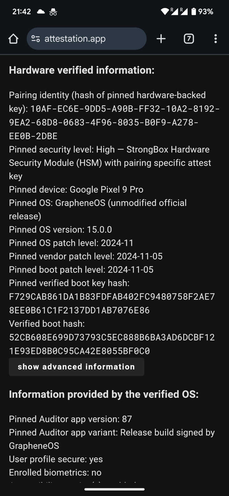
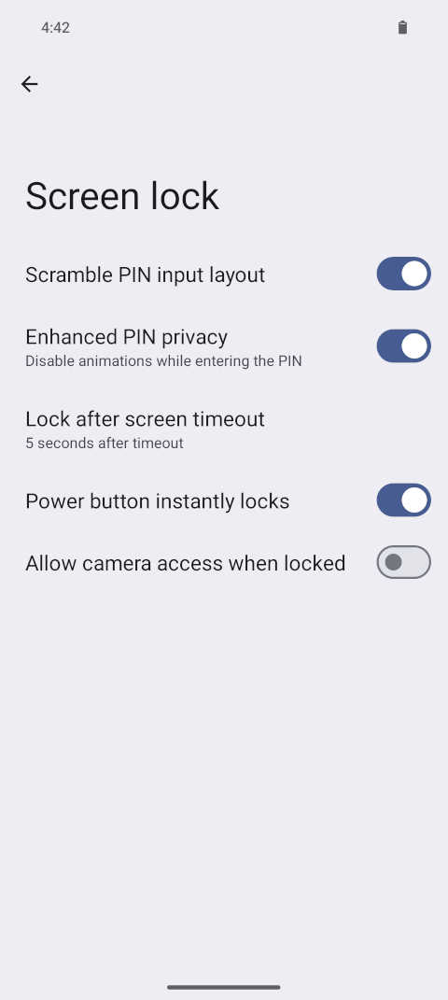
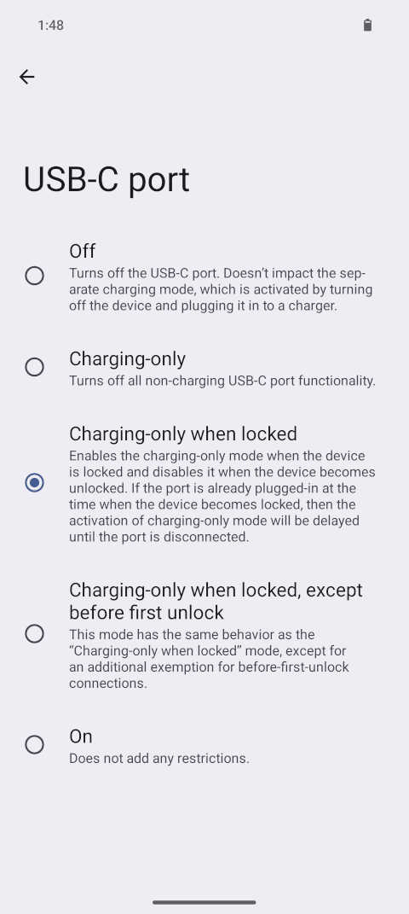
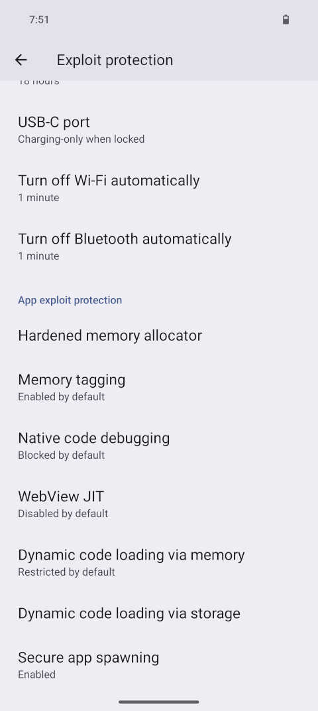
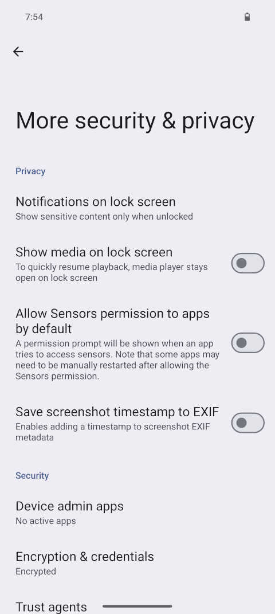
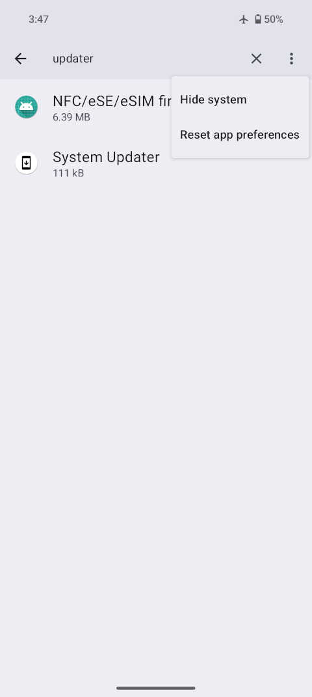
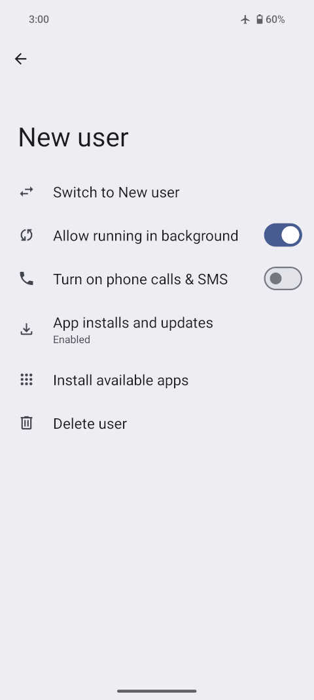
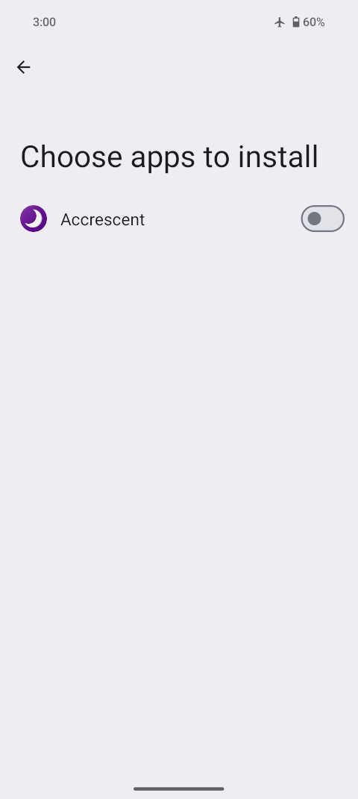

# Practical GrapheneOS for the Paranoid

December 3, 2024 by [patrickd](/about#patrickd)

import Head from 'next/head'
import { Callout } from 'nextra/components'
import { ScreenshotCard, ScreenshotCards } from '@components/screenshotcards'
import { Bleed } from 'nextra-theme-docs'
import banner from './social-banner.jpg'

<Head>
  <meta property="og:image" content={'https://ventral.digital' + banner.src} />
  <meta name="twitter:image" content={'https://ventral.digital' + banner.src} />
</Head>

[GrapheneOS](https://grapheneos.org/) is a FOSS (Free and Open Source Software) Operating System based on the [Android Open Source Project (AOSP)](https://www.android.com/), specifically focusing on improving privacy and security. Although we'd all like to have the best security and best privacy possible, it's an unfortunate fact that such improvements rarely come without a cost to convenience and usability. Here, we will explore how to get the most out of Graphene's improvements, and the impact of these measures on the user experience with practical solutions.

<Callout type="info">
  This article is an attempt to tie together information and knowledge on mobile security and privacy in and around the GrapheneOS project so that less technical readers are able to follow. Feel free to investigate the references in brackets<R reference='###' /> for the details. The author is not affiliated with the GrapheneOS project.
</Callout>

## Device Choice

Probably the most common question by those looking into the GrapheneOS project for the first time is: Why are only so few devices officially supported, and why the heck are all of them expensive Pixel phones made by evil Google?

#### Why only Pixel devices?

According to GrapheneOS there currently simply isn't another reasonable choice.<R reference='183' /> GrapheneOS does not have contractual exclusivity for Google's devices<R reference='186' />, and neither are Pixels incredibly secure, it's rather that all the alternatives are downright awful.<R reference='167' /> The GrapheneOS project maintains a [list of detailed requirements](https://grapheneos.org/faq#future-devices) that they have for current and future officially supported devices<R reference='64' /><R reference='65' /> and, unfortunately, at this time only Pixels are able to meet them.

Pixel devices have first-class support for alternate operating systems<R reference='59' />, likely thanks to the fact that they serve as a reference for Android development.<R reference='134' /> They receive proper regular updates of their firmware<R reference='64' />, and offer advanced hardware security features such as memory tagging<R reference='64' /><R reference='167' /> which remain available even when non-stock operating systems are installed on them.<R reference='181' />

Most other OEMs on the other hand merely offer half-baked, partially working support for alternative operating systems, as they see it as a non-production hobbyist feature.<R reference='134' /> Heck, most of them completely skip basic security features and don't bother providing proper updates.<R reference='64' /> To make matters even worse, they often add lots of complexity and, with it, attack surface, with their overall changes to the system.<R reference='92' />

In the past, GrapheneOS has attempted partnering with OEMs but it turns out to be incredibly hard to make a device with comparable security to a Pixel. These partnerships fell through, in the end it was simply easier for these OEMs to make money by producing questionable hardware wallets for cryptocurrencies.<R reference='141' />

The only Android OEM even close to Pixel devices in terms of hardware security is Samsung.<R reference='92' /> They have even partnered up with Google to improve device security, with some success<R reference='126' />, but in the end Samsung still tends to lag behind by 2-3 years in shipping the new security features introduced by Pixels.<R reference='180' /> While Samsung is theoretically only missing a couple of the requirements, they still lack serious alternate OS support<R reference='59' /><R reference='64' />, which prevents GrapheneOS from using even those features that it has.<R reference='65' />

Broad device support would currently imply being available to very badly secured devices, unable to support many of Graphene's security features. It would also take away a substantial amount of resources from their work on privacy and security, due to a lot of it being rather hardware-specific.<R reference='123' /><R reference='280' /> However, if there were other devices complying with the requirements, the GrapheneOS project would certainly plan to support them.<R reference='155' />

#### Are there alternatives?

There are various alternate operating systems for Android devices with a focus on privacy and security, or at least a broader support of devices. Though, according to the GrapheneOS project, none of these can truly be considered viable alternatives.

The most basic critique the GrapheneOS team levies against pretty much all of them is the great delay and, in some cases, even complete omission of important security patches that users of the purely open source variant of Android (AOSP) would enjoy.<R reference='92' /><R reference='172' /> 

[LineageOS](https://lineageos.org/) is one of these offenders, though granted, this project's focus is device longevity and broad compatibility rather than security<R reference='144' />. It's critically lacking verified boot, making it trivial to break into with physical access.<R reference='172' /> The [/e/OS](https://e.foundation/e-os/) project markets itself as fully "deGoogled" mobile ecosystem focusing on privacy while building upon Lineage's shaky foundation<R reference='90' />. The e/OS comes bundled with applications and services that give users a questionable feeling of privacy while these services themselves are arguably invasive.<R reference='159' />

Graphene's possibly greatest "competitor", [CalyxOS](https://calyxos.org/) is apparently not only regularly behind on patches but has also misled users about this with inaccurate Android security patch levels.<R reference='91' /><R reference='92' /> They furthermore implemented security features with serious flaws, such as the panic-wipe feature that didn't reliably delete incriminating data as intended.<R reference='122' /><R reference='296' />

<Callout type="info">
  For further information on various Android-based Operating Systems, you may want to take a look the following comparison table created by a third party: https://eylenburg.github.io/android_comparison.htm
</Callout>

Then there is [CopperheadOS](https://copperhead.co/android/), the name under which GrapheneOS was formerly known. I will not go into detail on the drama behind the hostile takeover and eventual separation from the company that was intended to financially sponsor the project. It's noteworthy to mention though that this company now sells CopperheadOS as closed source fork.<R reference='184' />

Finally [Purism](https://puri.sm/) with their custom, optionally Made-In-USA, hardware that promises control over your privacy with features such as (questionable?<R reference='161' />) hardware switches. The GrapheneOS team strongly disagrees with the choice of hardware security components made for their devices and also with the convoluted process required for firmware and microcode updates.<R reference='140' /> Their Librem 5 device is nearly entirely closed source hardware and firmware<R reference='215' /> though many people have been misled to believe the opposite to be true.<R reference='88' />

GrapheneOS accuses these projects of empty marketing with buzzwords that mislead users into trusting both outdated and vulnerable soft- and hardware.<R reference='93' /><R reference='121' /><R reference='140' /> They even go so far as to say that users would be better off using an iPhone (in Lockdown mode<R reference='194' />) instead of any of the mentioned projects as the next best option for privacy and security after GrapheneOS.<R reference='89' /><R reference='92' /><R reference='125' /><R reference='126' /><R reference='191' />

Don't misunderstand, the GrapheneOS project does by no means claim that its operating system is impenetrable<R reference='168' /><R reference='199' />, but it does focus on substance rather than branding and marketing. This becomes quite clear when comparing Graphene's [website](https://grapheneos.org/) to those of other projects: GrapheneOS is an unapologetically technical project which I personally greatly appreciate as it saves me from having to dig through marketing to find the technical facts.<R reference='245' /> On the other hand, I can certainly see how this is rather intimidating to the average user.

#### Can Google devices be trusted?

We've covered that GrapheneOS currently only supports Pixel devices due to those being the only ones having sufficient hardware security measures in place. All well and good, but wouldn't that be pointless if those devices are backdoored?

As mentioned, Google's Pixels serve as reference devices for Android development, causing many experts to work with them.<R reference='134' /> Furthermore, Google has been very open to external security research, thanks to which Pixels have received great security research attention.<R reference='212' /> It would be arguably difficult to hide backdoors within the devices under these circumstances.

Another argument is that it would be far easier to attack the supply chains of tiny companies that outsource their manufacturing rather than compromise the global production of iPhone or Pixel devices without discovery. Users of such mainstream devices benefit from a lot of scrutiny that these devices receive.<R reference='179' /> It's also worth noting that leaks from forensic firms, that specialize in breaking into smartphones and are often hired by governments, do not offer any evidence for the existence of purposefully placed backdoors either.<R reference='198' /><R reference='199' />

Still, some argue against using anything made by Google out of principle. For the best chances to achieve this, they'd have to make use of Apple's products though, due to Google playing a huge part in the development of many open-source projects, including the Linux kernel itself.<R reference='182' /> The mission of GrapheneOS is not entirely centered around the idea of avoiding one particular company by any means necessary, rather it's to obtain the best possible privacy with the best possible tools available.<R reference='159' /> 

#### Which Pixel to choose?

For the best security, using a Pixel of the 8th or 9th generation is strongly recommended.<R reference='191' /><R reference='280' />  They are considered significantly more secure thanks to the hardware features that GrapheneOS can make use of, such as memory tagging.<R reference='169' /> The 9th generation comes with an additionally hardened<R reference='56' /> and more efficient cellular radio, so if you are planning to use it with a SIM card you can expect improved security and battery life.<R reference='66' /> The Pixel 9 Pros come with 16GB of RAM which will be especially useful if you're planning to use GrapheneOS with multiple user profiles (benefits of which will be explained later).<R reference='124' />

The 9th generation is currently also ahead in terms of the hardened Linux kernel used, but the 8th generation is likely to be upgraded soon making both generations very similar in terms of security.<R reference='170' /> With that in mind, a Pixel 8a phone will be the ideal budget device with some trade-offs in performance. Either way, both generations are receiving 7 years of full support.<R reference='62' />

<Callout type="info">
  You can find a table of how long each of the devices will be supported at https://grapheneos.org/faq#device-lifetime
</Callout>

Pixel devices of the 6th and 7th generation still have a few years of support left, making them a decent choice if you already own one and want to keep using it for a while longer. This is not a recommendation for buying a new one of these generations though.<R reference='169' /> Also, keep in mind that there are various security features that GrapheneOS can only make use of with the hardware of newer generations.<R reference='57' />

Anything older than that is considered End-Of-Life and the GrapheneOS project strongly recommends against continuing to use them<R reference='173' />, regardless of which operating system is used.<R reference='62' /> This is true even though GrapheneOS still provides extended support for some of them, which is merely intended for harm reduction to buy users some time to migrate to a fully supported device.<R reference='280' /> For example, there no longer are firmware patches and driver support for the Pixel 5a<R reference='100' />, and there's even a known, unpatched remote code execution vulnerability that could be exploited to take control of the device.<R reference='83' />

<Bleed>
| Pixel 9 Pro Fold   | Pixel 9 Pro XL  | Pixel 9 Pro     | Pixel 9        | Pixel 8 Pro | Pixel 8    | Pixel 8a   |
|--------------------|-----------------|-----------------|----------------|-------------|------------|------------|
| 16 GB RAM          | 16              | 16              | 12             | 12          | 8          | 8          |
| 256-512 GB Storage | 128-1024        | 128-1024        | 128-256        | 128-1024    | 128-256    | 128-256    |
| Google Tensor G4 Processor  | G4     | G4              | G4             | G3          | G3         | G3         |
| 14 Concurrent User Profiles | 14     | 14              | 10             | 10          | 6          | 6          |
</Bleed>

#### Self-Install or Pre-Installed?

There are companies selling Pixel devices with GrapheneOS preinstalled, but there are also some that claim or wrongly suggest that the operating system installed is GrapheneOS or using parts of it.<R reference='87' /> Additionally, there's a chance that such preinstall- or used devices have been tampered with.<R reference='86' />

GrapheneOS is not affiliated and does not endorse any of these companies and instead recommends buying a supported device and going through the installation process yourself.<R reference='291' /> Buying one at a local electronics store with cash will even allow you to do so anonymously.<R reference='125' /> Just make sure to avoid devices that are locked to a specific carrier.<R reference='213' />

The easiest method to install GrapheneOS is using a compatible web browser on a compatible second device - that can be a chromium browser on a laptop or even on a second Android phone!<R reference='267' /> You just need a cable to connect both devices. On the secondary device, you simply have to open the [web installer](https://grapheneos.org/install/web) page and follow the instructions. Don't worry: Your device will not lose its warranty<R reference='132' />, it'll not get bricked<R reference='297' />, and if you don't like GrapheneOS you can always go back to stock Android.<R reference='298' />

## Tamper Protection

#### Verified Boot Key Hash

Assuming you are now a proud owner of a Pixel device with a fresh GrapheneOS installation, you might be surprised by the warning greeting you when the device is started. It'll disappear and continue booting GrapheneOS after a few seconds unless you press the power button to pause the screen. The string of characters shown following "ID:" is called the *verified boot key fingerprint* which is a cryptographic hash value that allows you to verify that the GrapheneOS version installed is authentic - and it should never change!<R reference='235' />

| Device             | Verified Boot Key Fingerprint                                      |
|--------------------|--------------------------------------------------------------------|
| Pixel 9 Pro Fold   | `af4d2c6e62be0fec54f0271b9776ff061dd8392d9f51cf6ab1551d346679e24c` |
| Pixel 9 Pro XL     | `55d3c2323db91bb91f20d38d015e85112d038f6b6b5738fe352c1a80dba57023` |
| Pixel 9 Pro        | `f729cab861da1b83fdfab402fc9480758f2ae78ee0b61c1f2137dd1ab7076e86` |
| Pixel 9            | `9e6a8f3e0d761a780179f93acd5721ba1ab7c8c537c7761073c0a754b0e932de` |
| Pixel 8a           | `096b8bd6d44527a24ac1564b308839f67e78202185cbff9cfdcb10e63250bc5e` |
| Pixel 8 Pro        | `896db2d09d84e1d6bb747002b8a114950b946e5825772a9d48ba7eb01d118c1c` |
| Pixel 8            | `cd7479653aa88208f9f03034810ef9b7b0af8a9d41e2000e458ac403a2acb233` |
| Pixel Fold         | `ee0c9dfef6f55a878538b0dbf7e78e3bc3f1a13c8c44839b095fe26dd5fe2842` |
| Pixel Tablet       | `94df136e6c6aa08dc26580af46f36419b5f9baf46039db076f5295b91aaff230` |
| Pixel 7a           | `508d75dea10c5cbc3e7632260fc0b59f6055a8a49dd84e693b6d8899edbb01e4` |
| Pixel 7 Pro        | `bc1c0dd95664604382bb888412026422742eb333071ea0b2d19036217d49182f` |
| Pixel 7            | `3efe5392be3ac38afb894d13de639e521675e62571a8a9b3ef9fc8c44fd17fa1` |
| Pixel 6a           | `08c860350a9600692d10c8512f7b8e80707757468e8fbfeea2a870c0a83d6031` |
| Pixel 6 Pro        | `439b76524d94c40652ce1bf0d8243773c634d2f99ba3160d8d02aa5e29ff925c` |
| Pixel 6            | `f0a890375d1405e62ebfd87e8d3f475f948ef031bbf9ddd516d5f600a23677e8` |

The fingerprints differ depending on the device model and the above list of them was copied from the [web installer page](https://grapheneos.org/install/web#verified-boot-key-hash).<R reference='222' /> Although unlikely, it's possible that the server infrastructure of the GrapheneOS project was compromised and that attackers have replaced both the operating system files used during installation and the list of key hashes. You can compare the fingerprint displayed on your device with the table above to ensure that you've installed a legitimate version of GrapheneOS.<R reference='267' /><R reference='235' />

#### Auditor App

GrapheneOS comes bundled with the Auditor App. It's another way to validate the authenticity and integrity of the operating system to ensure that no tampering has occurred. You can execute a check manually with a second device that has the Auditor App installed. This does not need to be another GrapheneOS installation as you can [find the app on Google's Play Store](https://play.google.com/store/apps/details?id=app.attestation.auditor.play&hl=en).<R reference='292' />

<ScreenshotCards num={2}>
  <ScreenshotCard
    description="Screenshot: Auditor App menu. Select 'Auditee' on the GrapheneOS device you want to verify and 'Auditor' on the secondary device you are doing the verification with. Simply follow the displayed instructions to execute an audit of the device and operating system.">
      <></>
  </ScreenshotCard>
  <ScreenshotCard
    description="Screenshot: Audit results displayed on secondary device. The background is red due to verifying the auditee for the first time. On the next audit it will be green, proving that our device was not replaced. The results also show that the auditee device is running an unmodified, official version of GrapheneOS.">
      <></>
  </ScreenshotCard>
</ScreenshotCards>

This verification can be automated using the [attestation.app](https://attestation.app/) website which is part of the GrapheneOS project. After registering on the website and pairing your device you'll receive an email alert if the device fails to provide valid attestations in time.<R reference='292' />

<ScreenshotCards num={2}>
  <ScreenshotCard
    description="Screenshot: After setting a desired configuration, select 'Enable remote verification' on the GrapheneOS device you want to verify and scan the QR code displayed by the attestation website.">
      <></>
  </ScreenshotCard>
  <ScreenshotCard
    description="Screenshot: If the device being audited has an Internet connection the audit results will be displayed on the attestation website after a reload.">
      <></>
  </ScreenshotCard>
</ScreenshotCards>

Sadly it's currently not possible to host your own remote attestation server as using it would require changes to the Auditor App.<R reference='299' />

## Hardening through Settings

There are three fundamental aspects on how GrapheneOS defends itself against security vulnerabilities: It reduces the amount of "surface" (ie. active functionality/code) that is exposed to potential attackers, makes the exploitation of vulnerabilities as difficult as possible, and sandboxes (ie. isolates) components from each other to decrease the impact of a vulnerability being exploited. As such measures impact usability and device performance, GrapheneOS allows users to choose their own preferences via various toggles in the settings.<R reference='244' /><R reference='248' />

#### The Lock Screen

User data is stored in an encrypted manner with a key that is derived from, among other things, your chosen screen lock-method. That these can't simply be bypassed using brute force is ensured by delays enforced by "secure element" hardware.<R reference='281' /> Thanks to this measure, even a random 6 digit PIN provides a high level of security. If you don't want to depend on the security of the secure element, you can make use of long passwords with up to 128 characters.<R reference='258' />

Unlocking using a pattern was removed from GrapheneOS as it is essentially a much worse version of a PIN and encourages unsafe pattern choices.<R reference='177' /> Instead, you should use at least a 6 digit PIN and consider turning on the PIN scrambling feature which raises the difficulty of figuring out the combination by an observer, fingerprint marks or side channels.<R reference='257' />

Fingerprint Unlock can be configured, though for best security you should consider restricting it to authentication within apps (ie. disabling *'Use for screen unlocking'*). The GrapheneOS team has announced that 2-factor fingerprint unlocking will be launching soon where unlocking the device will require both a fingerprint scan and the PIN/password.<R reference='45' />

If you have an eSIM or especially a physical SIM, it makes sense to configure a SIM PIN - though it should preferably be a different one than the one used for unlocking.<R reference='177' />

<ScreenshotCards num={2}>
  <ScreenshotCard
    description="Screenshot: Settings page for configuring device unlocks. Found under Settings &raquo; Security & Privacy &raquo; Device unlock.">
      <></>
  </ScreenshotCard>
  <ScreenshotCard
    description="Screenshot of the Screen lock settings. You may want to consider disallowing camera access while the device is locked (ie. disabling the 'open camera on double power button press') to further reduce attack surface.">
      <></>
  </ScreenshotCard>
</ScreenshotCards>

Lastly, GrapheneOS offers setting a duress password/PIN. Once set, using it anywhere where a unlocking password or PIN can be entered, even in secondary user profiles<R reference='24' />, will irreversibly wipe the device (and installed eSIMs).<R reference='260' /> When triggered, information required for decryption is deleted and the device will shut down. On the next boot an invalid filesystem is detected and the device can be set up again as if it had been factory reset.<R reference='23' /> Note that this does not wipe the encrypted data itself as that would take a long time and gives attackers an opportunity to interrupt the process.<R reference='24' />

#### Auto-Reboot

A freshly booted device that hasn't been unlocked yet has its user data still fully encrypted, or "at rest". Continued use after the first unlock often leads to unencrypted data accumulating in the device's ephemeral memory, which is something that forensic companies exploit. The Auto-Reboot feature was introduced as a protection against the extraction of unencrypted data.<R reference='48' />

Although it's possible for applications to put sensitive data back to rest when the device locks, it's upon the developers to actually implement them that way - which rarely happens. Even the developers of the privacy-focused Signal messenger have shown little interest in implementing it, instead leaving it to forks like Molly to handle this in a better way. By automatically rebooting the device after some time, it is put back into a state of "before first unlock" (BFU).<R reference='49' />

The reboot timer starts every time the device is locked and successfully unlocking it resets the timer. By default, the timer is set to 18 hours with the lowest, and most secure, option available at 10 minutes.<R reference='55' /> Note that the timer will only start if the device has been unlocked at least once since the last reboot.<R reference='259' />

With the default value of 18 hours, the timer will be cancelled during consistent use to avoid impacting user experience. Due to GrapheneOS's very frequent updates requiring regular reboots in any case, this feature serves a secondary useful purpose.<R reference='73' /> If that still causes the device to reboot too often, the timer can be increased up to 78 hours or even completely disabled - though GrapheneOS strongly recommends against this.<R reference='44' />

Note that if you're planning to use secondary user profiles, this feature may be particularly annoying as all user sessions will be ended and the device resets back to the default Owner user.<R reference='224' />

#### USB Restrictions

When forensic companies attempt breaking into smartphones they typically prefer to do so via the USB interface which has a massive attack surface due to the many functions it offers.<R reference='54' /><R reference='128' /><R reference='176' /> Pixel devices offer hardware-level control over the USB-C port, a feature that isn't currently even used by the stock version of Android but a very important aspect to the GrapheneOS project.<R reference='181' />

<ScreenshotCards num={2}>
  <ScreenshotCard
    description="Screenshot: Many of these attack surface reducing options can be found under Settings &raquo; Security & Privacy &raquo; Exploit protection.">
      <></>
  </ScreenshotCard>
  <ScreenshotCard
    description="Screenshot: The various available options for controlling the USB-C port will be enforced on both software and hardware level.">
      <></>
  </ScreenshotCard>
</ScreenshotCards>

By default, GrapheneOS disables new USB-C connections as soon as the device is locked. In other words, you can plug in and use USB-C data while the device is unlocked, but once it's locked and you've pulled the plug it will reject new connections.<R reference='54' /><R reference='78' /> This measure includes disabling USB-C alternate modes such as DisplayPort.<R reference='249' />

The most secure, though arguably also the most inconvenient, option available is to fully disable the USB-C port while the operating system is running. This will even prevent any vulnerabilities present in the power delivery logic of the device, but will also require it to be turned off in order to be charged.<R reference='55' />

#### Wireless Attack Surface

With USB out of the picture that leaves wireless attack vectors such as Wi-Fi, Bluetooth, and cellular. However, getting into a device from any of these will be much harder and more complex.<R reference='54' /> Isolation of hardware components has become the de-facto norm for mobile devices.<R reference='135' /> Pixels even have separate chips for each of these radios, and if you wanted you could remove the chips individually and the device would be able to continue to function.<R reference='178' />

Although not yet enabled by default<R reference='69' />, you can set a timer to automatically turn off Wi-Fi and Bluetooth. The timer will begin once there's no longer an active connection. The GrapheneOS project is planning to extend this to NFC in the future as well.<R reference='55' />

The issue of cellular connectivity is a lot more complex. First off, 5G, SMS, MMS, and Calls generally work as fine on GrapheneOS as they would with stock Android.<R reference='279' /> GrapheneOS adds various toggles that once again attempt to reduce the attack surface<R reference='195' />, though depending on your carrier, and the country you're in, you may have to play around with them to see what works.<R reference='40' /><R reference='116' /><R reference='117' /><R reference='223' />

<Callout type="info">
  You can use eSIM with GrapheneOS but because it requires proprietary functionality from Google it is fully disabled by default.<R reference='277' /> Before, enabling eSIM support required Google Play<R reference='27' /><R reference='38' /> but this is no longer the case, and using eSIM now will not share any data with Google. Note that, while a wipe via distress PIN/Password also deletes the eSIM, the same is not true for a normal factory reset.<R reference='31' />
</Callout>

The GrapheneOS project recommends using the LTE-only toggle when possible.<R reference='275' /> LTE, which is sometimes referred to as 4G or 5Ge<R reference='279' />, is much more modern than the legacy 2G and 3G protocols, but also a lot less complex and more stable than the new 5G protocol.<R reference='209' /><R reference='129' />. Note that, although it may make some forms of interception more difficult, the only intention of the LTE-only mode is disabling an enormous amount of code related to both these legacy and bleeding edge protocols.<R reference='275' />

#### Cellular Privacy

LTE and 5G do come with a form of encryption, but this is mostly intended for the protection of the network itself and not for the protection of your privacy.<R reference='275' /> No matter which mode you're using, you should avoid traditional phone calls and text using the cellular network, and instead use end-to-end encrypted messengers such as Signal and SimpleX. In fact, if you can, always prefer using Wi-Fi over cellular.<R reference='101' /><R reference='106' /><R reference='160' />

The traditional telephone system is historically insecure and not designed with the goal of protecting user's privacy. You can imagine it like a walled garden where, once you've become a trusted party with access into it, you gain a significant amount of information and control over the network. This access can be bought for a few thousand USD per month and allows intercepting phone calls, SMS messages, and in some cases even roughly tracking someone's location. To do that an attacker needs your SIM card's unique IMSI identifier, but often it can be looked up simply by knowing your phone number. Using this the attacker would be able to intercept a 2-factor-authentication SMS while ensuring that your phone would not give any indication that such an SMS was ever sent to your number at all.<R reference='129' /><R reference='283' /><R reference='300' />

When your phone authenticates with the cellular network it does so while providing information on both your SIM card and the device's cellular radio hardware. If you've bought both the phone and SIM anonymously, you're essentially using a persistent pseudonym. Since hardware information is being shared, replacing the SIM alone is not sufficient for a fresh identity.<R reference='96' /><R reference='125' /><R reference='127' />

At this point, you might be considering using an external device, like a dedicated mobile hotspot, which would be much cheaper to regularly swap out together with a new SIM card. While this will increase your privacy, it will hurt your security as these devices typically have much worse hardware isolation and are way behind on security updates.<R reference='127' /> Compared to using the isolated internal radio of your Pixel, this will make it much easier for an attacker to gain control over the dedicated device, and if it is connected to your Pixel via USB this opens up a massive surface for attacking your phone.<R reference='99' /><R reference='128' /><R reference='135' /><R reference='176' />

Some of these dedicated cellular devices allow spoofing the IMEI, ie. changing the hardware identifier to an arbitrary value. This would allow you to reuse the same dedicated device and simply change the IMEI value together with a new SIM card for obtaining a new identity on the network. You should know however that the IMEI is not the only hardware-specific identifier that cellular radios leak and, furthermore, there are ways to create "fingerprints" of these devices that could allow re-identifying them even with identifiers changed. In the worst case, you could even draw a lot of attention to yourself when the spoofing is too obvious.<R reference='96' /><R reference='97' /><R reference='98' /><R reference='128' />

The GrapheneOS project does not recommend using a secondary device for cellular communication, but if you really want to do it then it would be better to use another Pixel device with GrapheneOS installed for it.<R reference='97' /> Note that if you're sharing cellular Internet via Wi-Fi, it's possible that someone nearby tracks your movements by tracking the signals of your Wi-Fi access point.<R reference='128' />

**What about airplane mode?**

Airplane mode is the only way to fully disable the cellular radio transmit, receive, and tracking capabilities of your device, and works appropriately on all Pixels. Once in airplane mode, Wi-Fi can be re-enabled and used without activating the cellular radio again.<R reference='106' /><R reference='283' /> If you intend to use your Pixel as a Wi-Fi-only device, you should consider removing the quick tile (the airplane-mode toggle visible when swiping down the status top-bar) so that you won't re-enable it by accident.<R reference='197' />

You should be aware that cellular is not the only way carrier services can be used. Remember that there's Wi-Fi calling and texting. To prevent the SIM from authenticating with the carrier and using their network services via other Internet connections, you need to disable the SIM itself.<R reference='96' /><R reference='101' /><R reference='197' />

Newer devices have special offline tracking systems intended to locate lost devices. GrapheneOS does not support and will not support these systems. If you want to be absolutely certain, you may consider keeping it within a faraday bag while you're not using it.<R reference='97' /><R reference='228' />

**What about using a data-only SIM?**

It doesn't particularly matter whether you're using a data-only SIM card in terms of privacy, you're still authenticated to the cellular network. Not having texts and calls however does reduce attack surface for exploits. GrapheneOS may in the future add toggles to disable these capabilities to practically turn normal SIM cards into data-only equivalents.<R reference='171' />

**What about using a VPN?**

Using a VPN has no influence on carrier-based calls or texts. These functions will not go through the VPN even if you are using a Wi-Fi connection instead of cellular.<R reference='234' />

**What about data-saver mode?**

Enabling the data-saver toggle will globally (ie. in all user profiles) stop apps from using cellular data in the background. Apps that use foreground services, meaning those apps that keep themselves running in the foreground via a permanent notification, are excluded from this restriction. Mobile data use can also be restricted per app.<R reference='196' />

**What about using no SIM?**

If you have no SIM card, and you are not in airplane mode, your device will still connect to the cellular network but it will not authenticate and should also not share any hardware identifiers. You will still be able to make emergency calls and receive emergency alerts. Note that making an emergency call will share radio identifiers of your device.<R reference='197' />

**What about emergency alerts?**

Emergency alerts are sent out through the cellular network to all connected phones, even if it has no SIM. Normally, only airplane mode prevents receiving them.<R reference='95' /> Because GrapheneOS is not subject to typical regulations it provides toggles for turning off even alerts of "presidential" priority.<R reference='189' />

#### App Exploit Protection

So far we've discussed how to protect our device from outside threats, but it's just as important to ensure that none of the installed applications can take over from the inside. Apps on Android always run isolated within their own sandbox<R reference='233' />, limiting the resources they can access to those that they have been given permission for.<R reference='301' /> Malicious apps may request and use permissions for purposes unrelated to the app's core functionality, others may even attempt breaking out of their sandbox. Often the application itself is not even intentionally malicious at all but has a vulnerability or its supply chain is being attacked.<R reference='248' />

Under *App Exploit Protection* you can find various measures that will increase the difficulty of an application breaking out of its sandbox. Many of them are not enabled for user-installed apps by default because they may cause those apps to crash or not work properly. But it's better to turn them on by default globally and then turn them off selectively for those apps that have trouble.<R reference='32' /><R reference='56' />

There are other measures that are implicitly always turned on.<R reference='256' /> One of them is the use of ahead-of-time compilation instead of just-in-time compilation. This saves battery life, improves the performance of many apps and, generally, is another important security feature. It has a drawback though: App installations and updates will take a lot longer than on stock Android.<R reference='220' /><R reference='221' />

<ScreenshotCards num={2}>
  <ScreenshotCard
    description="Screenshot of 'App exploit protection' at Settings &raquo; Security & Privacy &raquo; Exploit protection. Here, all defaults have been set to the most strict setting.">
      <></>
  </ScreenshotCard>
  <ScreenshotCard
    description="Screenshot of Settings &raquo; Security & Privacy &raquo; More security & privacy. With 'Show media on lock screen' and 'Allow Sensors permission to apps by default' having been disabled.">
      <></>
  </ScreenshotCard>
</ScreenshotCards>

**Permissions**

In stock Android, permissions only exist for accessing the Camera, Microphone, Body Sensors, and Activity Recognition. Access to accelerometer, gyroscope, compass, barometer, thermometer, and any other sensors are simply given to apps by default without requiring any explicit consent. GrapheneOS adds a toggle to prevent access to these sensors being given by default. Since this too can cause crashes in applications that expect to receive valid data from these sensors, this measure is not active in a fresh GrapheneOS installation. Turning it on will notify you when apps attempted accessing such a sensor and you'll be able to selectively grant this permission according to your own judgment.<R reference='252' />

Another permission that stock Android implicitly grants to all applications is access to networking functions. This includes device-local networking (localhost) which is currently a known way to bypass user profile isolation and allows apps of different profiles to communicate with each other. In GrapheneOS you'll be asked whether you want to grant this permission during the installation of an app. When the Network permission is not granted to an app, GrapheneOS pretends the network is down, which is usually handled by apps in a graceful manner.<R reference='252' />

Just like you can disable app exploit protections on a per-app basis, you can take away permissions from apps according to your own judgment. Be careful to not remove any permissions from system apps that are installed by default though, as this can cause unforeseen issues.<R reference='230' />

**Scoped Access**

There are popular apps that demand rather invasive permissions such as access to all contacts or all files on the device. Graphene's scope functionality allows selecting a subset of contacts or files to which access is granted while the app in question will believe to have been given access to everything.<R reference='269' />

By default, contact scopes act as if the contacts list is empty and users can then grant different kinds of access to specific contacts or groups of contacts.<R reference='255' /> Access to contacts is quite granular, allowing you to only share specific data with the app instead of the full contact info.<R reference='75' />

Users can enable storage scopes instead of granting the storage permission to apps.<R reference='254' /> This will have the effect that the app can't see any of the files that were created by other apps, unless the user explicitly specifies files or directories that it should be allowed full access to.<R reference='268' />

The GrapheneOS project is planning to add similar access scopes for other things such as Location, Camera, and Microphone.<R reference='76' />

**Microphone & Camera toggles**

Although these are available in stock Android too, it might be noteworthy that there are toggles for disabling access to the microphone and camera. They are also available as quick tiles when swiping down the status top-bar.

While it might be tempting to disable access to these globally and only turn them on when needed, this might end up being very inconvenient when you quickly intend to snap a photo (eg. via the power button double-press shortcut) or when you want to accept a call while the phone is still locked. In these cases, you'd first have to unlock the phone and enable the appropriate access, which could take so long that the person calling decides to hang up. Instead, you could leave the system-wide access to microphone and camera enabled and deny these permissions at a per-app level: Leaving them enabled for the phone and camera app while setting all others to 'Ask every time'.<R reference='219' />

If you're certain that you'll never need any of these sensors anyway, you could even buy one of [Nitrokey](https://shop.nitrokey.com/shop/nitrophone-5-pro-712?search=nitrophone#attr=1497,1502,1501)'s modified Pixel phones where the hardware components have been physically removed.<R reference='161' />

#### System Updates

GrapheneOS system-update download and installation is automatic and happens seamlessly in the background.<R reference='265' /> A reboot is still needed for them to take effect<R reference='73' />, but this process comes without risk thanks to the automatic rollback if the first boot of the updated operating system fails.<R reference='265' />

Automatic reboots after an update are possible but disabled by default as these could happen in the middle of a phone call.<R reference='239' /> If you want to avoid updates being downloaded using cellular data, you should change the *'Permitted networks'* setting to *'Unmetered'* only.<R reference='231' /> Some users have reported that updates heavily drain the battery and cause the device to heat up, which can especially get in the way while you're not home. You can turn on the *'Require device to be charging'* toggle to avoid such cases.<R reference='227' />

<ScreenshotCards num={2}>
  <ScreenshotCard
    description="Screenshot of Settings &raquo; System &raquo; System updates.">
      <></>
  </ScreenshotCard>
  <ScreenshotCard
    description="Screenshot: If you really want to, you can completely disable automatic system updates in Settings &raquo; Apps &raquo; All apps, tap on the 3 dots to 'Show system' apps, and finally use the search function to look for 'updater'. Select the System Updater app and disable it to stop your device from checking for new system updates.">
      <></>
  </ScreenshotCard>
</ScreenshotCards>

It's possible to completely disable automatic updates by disabling the *'System Updater'* app.<R reference='271' /> The GrapheneOS project strongly recommends against this, as you won't be getting privacy and security patches fixing vulnerabilities or adding improvements.<R reference='203' />

Some may be concerned whether a future update could introduce a backdoor. There are several measures in place to prevent malicious updates: They must have a valid cryptographic signature, which is enforced by both the update client as well as the verified boot mechanism. Things like downgrade attacks are also prevented locally.<R reference='16' />

The GrapheneOS project further argues that existing legislation can only target individual users, and cannot coerce malicious updates to be deployed to all GrapheneOS devices.<R reference='9' /> Because the updater doesn't provide any uniquely identifiable device information while requesting system updates, GrapheneOS won't be able to comply with a government's demand to send a backdoored update to a specific user. The update server will however be able to see the requester's IP address, which can be obfuscated by using a VPN or Tor.<R reference='270' />

#### Backups

GrapheneOS comes with [Seedvault](https://github.com/seedvault-app/seedvault) integrated at *Settings &raquo; System &raquo; Backup* as a solution for creating backups or moving from one device to another. Bear in mind that if you're using secondary user profiles, you'll need to set it up in each profile separately.<R reference='240' /> Some apps like Signal or Molly use a type of encryption of their application's database that can only be backed up and restored through these apps themselves.<R reference='46' /> If you're planning to use a USB drive to store your backups, a common best practice is initially creating the backup in the device's internal storage, and only moving it over to the drive once it has finished.<R reference='240' />

There's also a known issue where backing up user files from storage might not include all of your files, therefore you shouldn't rely on Seedvault to include all of your important files yet. You may want to backup your important files separately, eg. to your laptop using a USB connection (*Use USB for 'File Transfer'*). But here too you'll have to establish the connection for each profile separately. GrapheneOS is hoping to replace Seedvault with a better and more reliable solution in the future, although there are currently tasks that have higher priority.<R reference='205' />

## Secondary User Profiles

User profiles mimic having separate phones to allow multiple users to share the same device.<R reference='192' /> In the following, we'll be exploring how this can be used to isolate apps from each other and compartmentalize the user's data. Though before that, I'd like to point out that the isolation that the app sandbox provides and the compartmentalization offered by access scopes will already be sufficient for many users.

On a freshly installed GrapheneOS, multiple users are disabled by default. Even so, when you unlock your phone after booting, you'll log into the "Owner" user, as in "The user who is the owner of the device". The Owner user shouldn't be mistaken for something like a privileged "root" user from Linux. Although the Owner has more administrative control over the device than other users, regular apps have the same access when running in Owner as they would in any other user profile.<R reference='192' />

Each user is encrypted with their own keys protected by their respective lock method.<R reference='261' /> The Owner user is special in the sense that it does not only store the Owner's data, but also sensitive system-wide operating system data. Because of this, you always need to unlock the Owner profile first before any other user profile can be used. The Owner profile, and the apps running within it, will always be running in the background while you're using another profile. Nonetheless, the Owner profile does not have any access to the data stored in other profiles.<R reference='281' />

<ScreenshotCards num={2}>
  <ScreenshotCard
    description="Screenshot of Settings &raquo; System &raquo; Users.">
      <></>
  </ScreenshotCard>
  <ScreenshotCard
    description="Screenshot of the quick user switching UI found when swiping down the status top-bar and tapping on the user icon in the bottom right.">
      <></>
  </ScreenshotCard>
</ScreenshotCards>

**Cross-Profile Notifications**

As visible in the screenshot above, it's noteworthy that you can actually receive notifications from another profile that is running in the background. Although the notification will only tell you in what profile it happened and by what app it was triggered, this is still an addition by GrapheneOS that significantly improves the user experience with secondary user profiles.<R reference='7' /><R reference='25' />

**Example Use Cases**

Before continuing on the different types of user profiles available, we should first discuss what even the advantages of using multiple profiles, compared to only using the Owner profile, are.

First of all, after setting up a new user you'll be greeted by a phone that appears to be in the state of being started for the first time. None of the user-apps you've already installed are there, everything is empty.<R reference='261' /> This can be very useful if you want to log into different users of the same application, eg. if you want to use a messenger with multiple accounts, but the app does not support that, you can simply install it twice in different profiles.<R reference='233' />

Separating apps between different profiles will also prevent them from easily being able to communicate with each other. For example, there's the normal Facebook platform app but also the separate Facebook Messenger app. If both apps agree to it, they can use something akin to inter-process communication to exchange information between each other - but only if both of them are running within the same user profile.<R reference='25' /><R reference='261' />

As mentioned, if you have apps that run in the background of your Owner profile, they will always be running unless you manually stop them from doing so. If you have applications that you rarely make use of, it makes sense to install them in a secondary user profile. Once you're done with them you can hold the device's power button and you'll be offered to end that user's session. This will make sure that all apps of that profile are stopped and their data is put to rest and fully encrypted.<R reference='281' />

You can also create and use user profiles only temporarily and immediately delete them afterward. As apps installed within one user are not aware of the other users, you can use profiles like a browser's incognito mode. A profile's filesystem is completely isolated from other profiles, and although you could set up a storage scope to achieve the same, there'll be no need to do that since your temporary profile will be empty.<R reference='282' />

Further above, we've talked about how the Auto-Reboot feature was added to ensure that data is eventually put to rest and no unencrypted data will be available for forensic companies to extract. If you employ a secondary user profile instead of the Owner for your regular usage, this will be much less of a problem: While putting the Owner's data at rest requires a reboot, putting a secondary user's data at rest simply requires ending their session.<R reference='281' />

**Number of User Profiles**

GrapheneOS raises the limit on the number of secondary user profiles from the standard 4 to 32, where one of them is always reserved for the guest user.<R reference='114' /><R reference='261' /> However, being able to create so many user profiles does not mean that all of them can run concurrently as that would impact the device's performance rather negatively. GrapheneOS scales the number of maximum concurrent users based on the amount of RAM built into the device.

<Bleed>
|                       | Pixel 9 Pro Fold   | Pixel 9 Pro XL  | Pixel 9 Pro     | Pixel 9        | Pixel 8 Pro | Pixel 8 & 8a |
|-----------------------|--------------------|-----------------|-----------------|----------------|-------------|--------------|
| RAM                   | 16 GB              | 16 GB           | 16 GB           | 12 GB          | 12 GB       | 8 GB         |
| # Concurrent Profiles | 14                 | 14              | 14              | 10             | 10          | 6            |
</Bleed>

If you have user profiles for use cases where it's never necessary for that user to keep running in the background, you can un-toggle *'Allow running in background'* when editing that user via the Owner profile. That way you don't have to explicitly end the user's session, because simply switching away from that user will put the profile to rest.

<ScreenshotCards num={2}>
  <ScreenshotCard
    description="Screenshot: Tap on a user at Settings &raquo; System &raquo; Users to edit them.">
      <></>
  </ScreenshotCard>
  <ScreenshotCard
    description="Screenshot: The Owner user is able to install his apps on other user profiles.">
      <></>
  </ScreenshotCard>
</ScreenshotCards>

**Cross-Profile App installation**

You might be surprised to find out that it's possible for user profiles to update each other's apps, and also for the Owner user to be able to install his app into another profile. Didn't we say that the file systems of each profile are completely isolated? Well, yes - but it's not like each profile is running on a completely independent operating system, and it turns out that the code of applications isn't actually stored within each user but in the underlying system that is shared between all of them.<R reference='113' />

The fact that the Owner is able to install apps in other profiles as long as they're already installed on the Owner means that we don't actually need to install app stores in every profile to get the apps we need. Instead, we could use the Owner profile as an "App Command Center"<R reference='232' />: We install app stores solely in the Owner user. When we install new apps we uncheck giving them the Network permission and immediately mark them as disabled.<R reference='263' /> Then we open the user management and install the newly installed apps into the profile where we'll actually use them.

**Drawbacks**

There are some inconveniences that come from making active use of secondary user profiles. For example, the Auto-Reboot feature will cause all user sessions to end and throws you back to unlocking the Owner profile first. That also means that all apps in those profiles will be forced to stop running and you'll miss out on receiving notifications from them until you log back into that user. Assuming you didn't set a very short time for Auto-Reboots, this shouldn't happen too often though.<R reference='224' />

As mentioned, the file systems of profiles are completely isolated, which means there's no native way to eg. share a meme that you saw on social media in one profile via a messenger that is running in another profile. Typical workarounds include having [cloud-based file synchronization](https://cryptomator.org/) or a messenger installed within both profiles - but that will require an Internet connection and potentially wastes your mobile data. You could set up local file synchronization using apps like [Syncthing](https://github.com/syncthing/syncthing-android) or an FTP server+client app - but these are usually annoying to set up. If you're already on Linux with a KDE desktop you might as well use [KDE Connect](https://f-droid.org/en/packages/org.kde.kdeconnect_tp/) to exchange files between all of your devices and profiles. If not, the [Inter Profile Sharing](https://github.com/VentralDigital/InterProfileSharing) app I've built out of frustration on this issue will hopefully be your best friend. If you really want to avoid installing any apps for this, your best option is getting a USB Stick with a USB-to-USB-C adapter.<R reference='302' />

If you're installing apps in secondary profiles that require SMS verification, you might need to temporarily enable *'Turn on phone calls & SMS'* for that user.<R reference='225' />

#### Private Space

The private space feature is a recent addition to Android.<R reference='67' /> Technically this is simply a secondary user profile that is nested within the Owner profile: When the space is locked, the private profile user is stopped, and when the space is unlocked, the user profile is started. Except for the shared clipboard with Owner, it's separated the same way as a secondary user profile.<R reference='109' /><R reference='293' />

The advantage of using a private space over a secondary user profile is that the UI, in places such as notifications and settings, will be "merged" while the space is unlocked. That means if there's a notification from within the private space, it will be fully displayed in the Owner profile (compared to normal secondary users where this will only show the user and app name). While this makes it slightly less isolated than a dedicated user, private spaces can be a lot more convenient.<R reference='7' /><R reference='111' /><R reference='112' />

Compared to having up to 31 secondary user profiles, a device can only have a single private space and it must always be part of the Owner.<R reference='114' /><R reference='124' /><R reference='293' /> The GrapheneOS project is considering changing this though, among other improvements for private spaces.<R reference='67' /><R reference='120' /> It's also noteworthy that the private space user is not listed within the user management interface, meaning features such as installing Owner apps into the private space are not available. Furthermore, locking the private space does not purge the encryption keys as well as ending a secondary user's session would.<R reference='6' />

A drawback of private spaces, compared to full secondary user profiles, is that it's not possible to grant it access to *'phone calls & SMS'*. This prevents verification via SMS from working and prohibits using some apps within private spaces.<R reference='13' /><R reference='110' />

#### Work Profile

Work profiles are similar to private spaces in terms of user experience. They were originally designed for BYOD (Bring Your Own Device) deployments for corporations, which is why you need a separate "device manager app" to create them.<R reference='233' /> This app, and through it the corporation it belongs to, has control and ownership over the data within the work profile. However there are local management apps, such as [Shelter](https://f-droid.org/en/packages/net.typeblog.shelter/)<R reference='124' />, that allow the creation and management of a work profile without an external owner.<R reference='120' /> Either way, you'll always have to place trust in a third-party app to use work profiles, unless you program your own.<R reference='233' />

GrapheneOS calls work profiles created by apps like Shelter a "poor man's private space"<R reference='120' />, and strongly recommends using real private spaces instead.<R reference='109' /> Like private spaces, you can only have one and it must be located in the Owner profile. It's absolutely possible to use both a work profile and a private space alongside each other though.<R reference='102' /><R reference='114' /> 

Private spaces have better isolation, proper encryption, and better user interface integration with the Owner profile.<R reference='109' /><R reference='120' /> Work profile management apps can enable a lot of communication between the Owner user and the nested work profile.<R reference='113' /> For example, work profiles do not block the communication of applications between profiles, which may increase convenience but negatively impacts privacy and security.<R reference='233' />

#### VPN

For using VPNs the general best practice is that each of your devices should have a separate VPN connection that will obtain a separate exit IP address. <R reference='247' /> Because of this, all profiles (including work profiles and private spaces) have their own VPN configuration by design. This prevents an external party from tying them together based on the same exit IP address.<R reference='237' />

You can prevent a profile from ever directly accessing an Internet connection by enabling the *'Always-on VPN'* and *'Block connections without VPN'* toggles by default.<R reference='266' /> GrapheneOS has made many improvements to Android to prevent connections from leaking, ie. bypassing a VPN connection. Although there are still some known cases of VPN leaks, fixing these is one of the top priorities of the GrapheneOS project.<R reference='264' /> These toggles can even be exploited to create a secondary user profile that has no Internet access at all, if you have a use case for that.<R reference='242' />

At the moment, the GrapheneOS project only recommends using the official WireGuard app and the official Mullvad app. Mullvad is generally preferable though, as it works well with Graphene's exploit protection features turned on.<R reference='246' /><R reference='286' /> To avoid fingerprinting and tracking, GrapheneOS recommends using the default, network-provided DNS servers to blend in with other users.<R reference='285' />

Remember that while each profile has its own VPN configuration, the underlying networking is shared. Because of that, it's currently possible for apps with the Network permission to communicate across profiles via localhost, which is what I'm using for the Inter Profile Sharing app to function. But this will likely change in the future as the GrapheneOS project is planning to introduce separate network namespaces for each profile.<R reference='193' />

## Apps

A fresh install of GrapheneOS comes with a very minimal amount of apps, and there are several reasons for that: Bundling additional apps with the operating system will increase the attack surface right from the beginning, GrapheneOS prefers users to be able to choose which apps they want to install based on their own judgment. GrapheneOS is focused on meaningful improvements to privacy and security, bundling more apps into the operating system would likely not only be outside that focus but even counter to it. GrapheneOS also wants to avoid bundling apps and services of third parties as few of those would actually be aligned with its goals and values.<R reference='157' /><R reference='174' /><R reference='290' />

You may notice that among these few apps, GrapheneOS actually comes with its own 'App Store'. Note that this app repository is mostly intended for the distribution of Graphene's own first-party applications, and hardened versions of externally developed open-source apps. The list of available applications will be purposefully kept minimal, while third-party apps should seek to be included in Accrescent - the officially endorsed app store of GrapheneOS, which can be installed via Graphene's minimal store.<R reference='84' /><R reference='143' /><R reference='262' />

#### Bundled Apps

Of the few apps that GrapheneOS comes with, about half of them are inherited from the Android Open Source Project with minor changes and are very primitive in terms of functionality and user experience. Many of the AOSP apps were great choices 10+ years ago when Android's UI was more primitive and expectations were far lower. Over time Google replaced them with more modern versions for their stock OS but abandoned the open-source versions.<R reference='185' /> GrapheneOS is planning to overhaul or replace them as well, though there are often licensing issues with possible alternatives.<R reference='174' />

If you prefer Google's versions of apps such as the Camera, Gallery, and Keyboard, you can absolutely switch back to them without opting into their invasive usage statistic reporting and without uploading your photos to their service.<R reference='94' /> Some of Google's stock Android apps, such as the screenshot editor (Markup) and the Thermometer (for Pixels with the appropriate sensor), are mirrored in Graphene's App Store as they're not available in the Play Store.<R reference='85' />

**Camera**

The Camera app that GrapheneOS comes with has already been modernized<R reference='174' />, it's focused on privacy and security and is arguably better than any of the open-source alternatives and even most paid apps. It includes modes for capturing images, videos, and QR/barcode scanning.<R reference='273' /> It has basic HDR+, Night mode, multi-camera zoom, EIS, etc. There's no loss in terms of photo quality of the camera by running GrapheneOS instead of stock Android.<R reference='131' />

But still, it does not have the full set of features offered by the stock 'Pixel Camera' app. The Pixel Camera, previously Google Camera, can take full advantage of all available cameras and image processing hardware on GrapheneOS.<R reference='188' /><R reference='204' />Though to reduce attack surface, direct access to low-level hardware by Google's Apps is controlled by an extra toggle.<R reference='273' /> The *'Special access to hardware accelerators for Google apps'* toggle is enabled by default but does not grant these apps any additional access to data.<R reference='188' />

**Gallery**

GrapheneOS is planning to completely replace the current AOSP Gallery app, unfortunately, there's currently none available that has both acceptable licensing and proper image editing.<R reference='174' /> If you are looking for a good open-source alternative, Graphene as mentioned [IacobIonut01/Gallery](https://github.com/IacobIonut01/Gallery/blob/main/README.md) and [Aves](https://github.com/deckerst/aves/blob/develop/README.md).<R reference='185' />

You can also install the 'Google Photos' app, that you'd get with stock Android, via the Google Play Store. It'll be able to make use of most of the AI features as well as hardware acceleration.<R reference='85' /><R reference='207' /><R reference='210' /><R reference='211' />

**Keyboard**

Graphene's default keyboard is essentially Google's Gboard from 2014. It used to be an open-source project with a few closed-source components but ended up becoming entirely closed-source and rebranded to Gboard. It's missing some features such as sliding on the space bar to move the cursor, one-handed mode, better handling of emojis, and especially swipe typing.

Google's modern Gboard is definitely one of the nicest keyboards at the moment. Using it is fine as long as you don't opt-in to usage statistics and other invasive options. Remember that active keyboards have access to all the text you're entering, the text you're editing and the clipboard contents at all times.

If you're looking for an open-source alternative, you should have a look at [FlorisBoard](https://florisboard.org/). Its user interface isn't very polished yet, but it's an improvement in terms of features compared to the default keyboard. The GrapehenOS project is considering forking and moving to it in the future.<R reference='94' />

**Vanadium Browser**

GrapheneOS includes their Vanadium subproject which is based on Chromium with enhancements in privacy and security. It's used by both the operating system as default browser as well as by other apps that need to render web contents. The GrapheneOS project recommends this browser to be used as is; additional browser extensions or modifications are only likely to make you stand out more, making you easier to track. To prevent websites from accessing standard sensors, you can toggle off the 'Sensors' permission for the browser app as a whole.<R reference='272' />

#### App compatibility

There's currently only a tiny subset of Android apps incompatible with GrapheneOS. These are specifically apps that make use of the Play Integrity API which requires the operating system to be officially certified by Google. This mainly affects apps of banking/financial nature, location-based competitive games like Ingress, as well as some strange outliers such as the McDonalds app, Authy, and the Uber app for drivers. By implementing it, these apps have chosen to ban the use of alternative and modified operating systems. While this makes somewhat sense for games as basic anti-cheat system, it is by far not as effective as Google makes it out to be.<R reference='72' /> <R reference='130' /><R reference='133' /><R reference='136' /><R reference='156' />

This also prevents NFC payments made via Google Pay. A simple way around this restriction is using a Pixel or Galaxy Smart Watch paired with GrapheneOS.<R reference='115' /> Fortunately, there are other services, such as those provided by European banks, that have their own tap-to-pay which works on GrapheneOS.<R reference='29' /><R reference='68' /> For the US there's hope that Curve Pay will be available soon.<R reference='115' /><R reference='130' />

Although GrapheneOS provides the same standard security model as stock Android does, Google certifies operating systems not based on security but whether they licensed it.<R reference='79' /> There are ways to bypass some of these restrictions, but they would likely be blocked in time and would only be a temporary workaround.<R reference='70' /> According to the GrapheneOS project, the only permanent solution is regulatory or legal action based on this being highly anti-competitive and illegal behavior.<R reference='71' /><R reference='103' /><R reference='206' />

**Play Services Dependency**

Another caveat to Graphene's app compatibility is that some applications have a dependency on Google's Play Services, which is most often the case for messengers and social media. The reason for this is that they rely on receiving events for notifications through Google servers via Firebase Cloud Messaging (FCM). Some of these apps are able to fall back to their own implementation of push messages or frequent polling, but this typically requires the app to run with a foreground service. The app may also require being given 'Unrestricted' background usage, otherwise it'd be interrupted by the automatic battery optimization, causing delayed notifications.<R reference='238' /><R reference='288' />

An example of this is Signal, which will fall back to its own push mechanism when FCM is not available. There have however been reports that this performs badly and inefficiently (draining the battery). Instead, the alternative [Molly](https://molly.im/) client is often recommended for use without Play Services.<R reference='33' />

For apps that have a hard dependency on Play Services, you have the option to install and use the official Google Play Services restricted to the standard app sandbox. Thanks to the compatibility layer Google Play will receive absolutely no special access or privileges on GrapheneOS. It provides nearly complete compatibility aside from a small subset of functionality that hasn't been ported yet or cannot be provided due to being inherently privileged. The Play Store and its services are fully available, including in-app purchases and app/content license checks. It can install, update, and uninstall apps as usual, assuming it has been given authorization as an app source and consent for each action.<R reference='250' />

To make use of the compatibility layer, install 'Google Play services' from the GrapheneOS App Store. This will also install the Play Store, which is a dependency of Play services (don't disable the store app or the services will stop working too).<R reference='238' /> While making use of the Play Store requires being logged in with a Google Account, there's no need to log in if you're only installing Play Services for app compatibility reasons.<R reference='276' /> Also note that some apps including Signal need to be installed *after* sandboxed Google Play in order to make use of it properly.<R reference='104' />

After installing Play Services you'll get a *'Missing optional permission'* notification from the compatibility layer. Tapping it will ask whether you want to allow Google Play services to always run in the background, which will keep a connection open to Google's FCM server for reliable notifications, but will also reduce battery life. Agreeing to this will set the background usage to 'Unrestricted'. Leaving it on 'Optimized' will heavily restrict background usage based on how much it is used, while disallowing it will prevent background usage near totally. Make your choice depending on how important push notification timeliness via FCM is to you.<R reference='226' />

In terms of security, it does not make much of a difference in which user profile you install Play Services. If you're hoping to avoid Google as much as possible, it's best to install it in a profile that you're not planning to use as your main profile.<R reference='276' /> For example, if you were planning to only use your device with a single profile, it would be best to install Play Services within the Owner profile's private space.<R reference='58' /><R reference='109' />

I'd recommend installing Play Services in the Owner profile with background services disabled but authenticated with a Google account (it's possible to create one anonymously). The Owner profile will only serve to download and install apps (without Network permission, and apps immediately disabled after the download) which can then be installed into other profiles via the user management UI. This way you can have a secondary user profile within which Play Services are installed with 'Unrestricted' background usage, but without being authenticated to a specific Google account. Into this profile, you can install the messengers and social media apps that require FCM for reliable notifications.<R reference='232' />

**Android Auto**

If you've connected your Android phone with your car before, you're probably familiar with Android Auto. Originally, it requires privileged access but Graphene's sandboxed Google Play compatibility layer makes it work with a reduced level of privileges.<R reference='151' /> You can install and use the official releases of Android Auto<R reference='278' />, but it must be installed through the GrapheneOS App store.<R reference='11' /><R reference='41' /> On the other hand, for apps like [Waze](https://play.google.com/store/apps/details?id=com.waze&hl=en) to be available through Android Auto they must be installed from the official Google Play Store.<R reference='37' />

After installation, you have to open *Settings &raquo; Apps &raquo; Sandboxed Google Play &raquo; Android Auto*, and at least enable *'Allow permissions for wired Android Auto'*. If you can't get it working with this toggle alone, you may need to grant it wireless permissions too. Additional permissions for rerouting audio, phone calls, and notifications to Android Auto can be granted at your own judgment.<R reference='278' /> Note that Android Auto currently does not function from within a private space or work profile.<R reference='118' />

#### Obtainium & App Verifier

In Android, the package files downloaded to install or update an application are cryptographically signed. Once an app has been installed, the signer of the installation package is 'pinned' such that all future packages attempting to update it must have a signature of the same signer. This principle is called Trust-On-First-Use (TOFU) and it ensures that future updates of an application cannot come from malicious sources.<R reference='190' />

But this still does not guarantee that the package that you used for the first installation of the application actually came from the source you thought it does. Here, app stores play a useful role in establishing who the real signer of an app should be, basically by pinning the signer through the app store's metadata before even downloading the application's package.<R reference='164' /> On the other hand, an app store adds another third party that you have to trust, and this is where Obtainium can be used as a mitigation.<R reference='14' />

[Obtainium](https://github.com/ImranR98/Obtainium) allows you to get Android apps, and keep them updated, straight from the source - ie. straight from their GitHub releases page.<R reference='22' /> By combining it with [AppVerifier](https://github.com/soupslurpr/AppVerifier) you can still ensure that the package file you're about to install truly comes from the real developer of the application. This makes managing you apps more decentralized without sacrificing an important security feature that app stores offer. Though the GrapheneOS project argues that the most decentralized solution would be replacing Obtainium with self-updating apps.<R reference='162' /><R reference='163' /><R reference='190' />

<ScreenshotCards num={2}>
  <ScreenshotCard
    description="Screenshot: Within Obtainium we can search for app packages from various sources such as GitHub and GitLab. After downloading them, Obtainium will prompt us to share the package with AppVerifier before continuing with the actual installation. Note that, before installing Obtainium itself, you can first download its package and verify it with AppVerifier, which you can get from Accrescent.">
      <></>
  </ScreenshotCard>
  <ScreenshotCard
    description="Screenshot: It's possible that the signing key has not been added to AppVerifier's internal database yet. In that case, you should look for it on the project's page and copy it into your clipboard. Once you have it, return to AppVerifier to check whether the signer/certificate from the page matches with what the project has been signed with.">
      <></>
  </ScreenshotCard>
</ScreenshotCards>

#### Accrescent

[Accrescent](https://accrescent.app/) is an app store with a security-first mindset led by a contributor to the GrapheneOS project. It's available on the GrapheneOS App Store, although Accrescent is still in the early stages of development and so far only contains a small selection of applications. The GrapheneOS project intends to delegate securely hosting a wide array of third-party applications, both closed- and open-source, to Accrescent while the operating system's own app repository will only provide first-party applications and possibly a small number of lightly modified and hardened forks of useful third-party apps.<R reference='14' /><R reference='84' /><R reference='303' />

While the hope is that Accrescent will be one of the best ways to obtain apps on GrapheneOS going forward, it still lacks funding and contributors to substantially expand. The GrapheneOS project is actively supporting this in a move to replace F-Droid, which they have called out many times for their problematic security stance.<R reference='22' /><R reference='143' />

Accrescent appropriately secures the initial download and installation through its signed metadata without the need to use AppVerifier or to check the key fingerprint manually, although that's still possible to do after installation if desired.<R reference='190' />

#### F-Droid

[F-Droid](https://f-droid.org/) is well-known for being an exclusive repository for open-source Android applications. The GrapheneOS project has expressed very harsh criticism of F-Droid and does not recommend it as a secure source for third-party applications. The main reason is that F-Droid builds most of the apps directly from source on 'sketchy, outdated infrastructure', the resulting packages of which are then cryptographically signed by them, raising concern for a future mass-compromise of F-Droid users.<R reference='22' />

An advantage of app packages being signed by the developer is that it requires the signing key to be compromised for the attacker to be able to create a malicious package with a valid signature. This is arguably harder to achieve than introducing malicious changes to the source code on platforms like GitHub which F-Droid would then use to blindly build a signed package from. The GrapheneOS project argues that this greatly increases the risk of supply chain attacks.<R reference='190' />

Another problem stems from the fact that F-Droid self-signs app builds without ensuring that their build variant has a unique app id different from the one signed by the developers. Because the Trust-On-First-Use principle requires the signers of apps with the same id to match, this often causes confusion with users who try to reinstall an application within another profile or from a different source. Only the few applications that make use of F-Droid's reproducible build feature are excluded from this issue. For apps configured to use reproducible builds, F-Droid will discard their self-build package after verifying that it matches the developer-signed version. But at the moment it's not even possible to easily tell which apps are actually making use of this feature.<R reference='113' />

While F-Droid made an attempt to secure first-time installations through metadata signing, their approach turned out to be rather flawed.<R reference='303' /> There are more issues the GrapheneOS project notes in discussions on F-Droid, though not all of them are technical and therefore omitted here.<R reference='158' /><R reference='164' />

#### Play Store & Aurora Store

At the moment, the official Google Play Store app is still the most secure way to install closed-source apps, especially compared to using mirror sites like [APKPure](https://apkpure.com/apkpure-app.html) which basically have copies of all application packages of the Play Store - commonly used to bypass regional restrictions.<R reference='276' /> To reiterate, Google's Play Store and Services apps are treated like regular apps with no special privileges on GrapheneOS, whether you want to separate them into a secondary user profile is up to you.<R reference='52' /><R reference='53' />

The [Aurora Store](https://f-droid.org/en/packages/com.aurora.store/) is an alternative client to the Google Store's app repository. It allows you to avoid installing the official Play Store app and offers using an anonymous Google account that you share with other Aurora users. The GrapheneOS project recommends against using Aurora due to its security being weaker and some apps being affected by Aurora as the app's source. Note that you can always create a non-identifiable account with a burner phone number in the official Play Store instead of using Aurora's rather unreliable anonymous account feature.<R reference='19' /><R reference='21' /><R reference='22' /><R reference='26'/><R reference='28' /><R reference='77' /><R reference='139' />

There's some criticism here on whether using so much of Google's applications, services and infrastructure doesn't defeat the purpose of using GrapheneOS. To this, the project clarifies that Graphene's purpose is not specifically avoiding Google, but providing a high level of privacy and security - even for those who do not want to make great sacrifices in terms of user experience. The ongoing work to provide a fully functional compatibility layer for Google's services is not a trivial feature but one that GrapheneOS is investing a lot of resources into. Either way, a fresh installation of GrapheneOS is completely de-Googled and whether you want to make use of the compatibility layer or avoid it, is completely up to you.<R reference='108' /><R reference='105' /><R reference='187' />

## Trouble and Shooting

#### Geo-Location Issues

Determining your location is another service originally provided as part of Google's Play Services. Instead, GrapheneOS by default re-routes location requests to the operating system<R reference='250' /><R reference='138' />, which exclusively uses the satellite location (GNSS) and therefore requires having satellite reception.<R reference='166' /> Due to this being unavailable or unreliable in situations where the sky is obscured, eg. by the concrete of a ceiling, there have been many complaints about location-based applications not working properly on GrapheneOS.<R reference='1' /><R reference='2' /><R reference='3' /><R reference='74' />

If you have a cellular carrier and Internet connection, the device should be able to use assisted satellite geolocation (A-GNSS) by requesting information on nearby cell towers (SUPL) and on things like the current orbits and status of satellites (PSDS). These make acquiring a lock on your location significantly faster. By default, GrapheneOS uses the project's own proxy servers to prevent associating your SUPL/PSDS requests with your IP address.<R reference='4' /><R reference='175' />

You can optionally turn on Wi-Fi and Bluetooth scanning under *Settings &raquo; Location &raquo; Location services*. This will allow apps and services with the *'Nearby devices'* permission to scan for nearby Wi-Fi networks and Bluetooth devices even while Wi-Fi and Bluetooth are turned off, potentially improving location-based features.<R reference='229' /> This information would typically be sent to Google's servers by Play Services to determine the location more accurately even inside buildings. The GrapheneOS project is in the process of creating its own implementation of this, likely first as a proxy to Apple's servers and later as its own database.<R reference='5' /><R reference='61' /><R reference='81' />

If you have sandboxed Play Services installed and want to use Google's network location service to provide improved location estimates, you first have to disable the *'Reroute location requests to the OS'* toggle at *Settings &raquo; Apps &raquo; Sandboxed Google Play*. Next, you'll have to change the Location permission of Play services to be set to *'Allow all the time'* as well as *'Use precise location'*. For it to be able to make use of network scanning, you also need to grant it the *'Nearby devices'* permission (the above-mentioned toggles for Wi-Fi and Bluetooth scanning must already be enabled). Finally, you need to once again go to *Settings &raquo; Apps &raquo; Sandboxed Google Play* and tap on *'Google Location Accuracy'* and enable the *'Improve Location Accuracy'* toggle.<R reference='2' /><R reference='60' /><R reference='82' /><R reference='175' /><R reference='276' />

The re-routing toggle is not a global option, so you could consider setting up a secondary user profile for the sole purpose of making use of Google's privacy invasive location services for when you're having geo-location troubles.

#### Crashing/Broken Apps

We've already mentioned that it's not surprising for applications on GrapheneOS to crash or otherwise refuse to work properly, but this is nearly always fixable.<R reference='18' /> Before anything, you should first attempt standard steps such as clearing app cache, forcefully stopping and restarting the application, restarting the phone, or re-installing the application. Typical GrapheneOS-specific solutions include turning off some of the exploit protection measures, re-installing the application outside of a private space (Owner or other secondary profile), re-installing the app in a profile that provides sandboxed Google Play Services, etc.<R reference='8' /><R reference='12' /><R reference='39' /><R reference='208' /><R reference='218' /> Sometimes apps even start crashing because the application (eg. app store) from which they were installed from is no longer enabled or installed<R reference='241' />, or they refuse to work properly because they were not installed from the source that they expected.<R reference='19' />

#### App refuses to install

Typical reasons for this have also been explained above: You're attempting to install an application that is already available with a higher version or from a different source in another user profile.<R reference='36' />

#### Getting Support

GrapheneOS has a very active community and is responsive on social media. The easiest places to look for existing solutions for your problem are probably the forum at [discuss.grapheneos.org](https://discuss.grapheneos.org/) and their [Discord server](https://discord.com/invite/grapheneos). GrapheneOS also has communities on [Twitter/X](https://x.com/i/communities/1530455827949273094), [Telegram](https://t.me/GrapheneOS), and [Matrix](https://matrix.to/#/%23community:grapheneos.org).

## Appendix

#### References

import { R, Reference, References } from '@components/references'

<References>
  <Reference reference='1'>
  Serasker (@Seraskerx), 2024, November 18. *"The location services on my Android 15 Pixel 6a device are down. The apps can't find my location. Google maps can't locate my location on the vanadium scanner."*, https://x.com/Seraskerx/status/1858540251154669582
  </Reference>
  <Reference reference='2'>
  GrapheneOS (@GrapheneOS), 2024, November 18. *"OS location service on GrapheneOS is based on satellite location (GNSS) so you need GNSS satellite reception which you may not have indoors. A-GNSS services are used to assist with obtaining a faster lock (PSDS and SUPL). None of this is down or we'd have an announcement. We have added configuration for choosing the PSDS and SUPL provider so if they were down, which they aren't, you could still use them. Location works fine without these services. It works without internet access. These just make it get a location faster than pure satellite. You're likely used to network-based location sending nearby cell towers, Wi-Fi networks and Bluetooth beacons to an Apple or Google service and getting back an estimate for working indoor location. You can use Google's network location service on GrapheneOS if you want. We'll be providing our own network location in the very near future so you won't need to set up using sandboxed Google Play if you want network location. If you do need network location right now rather than weeks from now, you can set that up: https://grapheneos.org/usage#sandboxed-google-play-configuration"*, https://x.com/GrapheneOS/status/1858556085247840573
  </Reference>
  <Reference reference='3'>
  Manjili (@Manjili8), 2024, November 18. *"When I don't use location for long, I have to go under open sky area for my location to be detectable. Same phone and same OS."*, https://x.com/Manjili8/status/1858542523196862700
  </Reference>
  <Reference reference='4'>
  GrapheneOS (@GrapheneOS), 2024, November 18. *"That's just how satellite-based location (GNSS) works in practice. It won't work well in a concrete building. If you have cellular and haven't disabled SUPL, it should go quite fast with minimal satellite reception. Wood frame house typically won't break it but concrete will."*, https://x.com/GrapheneOS/status/1858556475867558224
  </Reference>
  <Reference reference='5'>
  MetropleX | GrapheneOS (@Metr0pl3x), 2024, November 18. *"Location Services on GrapheneOS are never down. The only service available by default is receive only GNSS/GPS which require line of sight to the sky and may or may not based on your config make use of AGPS almanacs to get a faster lock which on first/refresh lock can take 5mins+. We're in the process of developing (in fact framework is pretty much already there) our own provision of a secure/private network location capability for faster/accurate lock in non ideal GPS situations. Yet if you can't wait and don't mind using it, Googles NLP provision works. To use Googles NLP install sandboxed Play Services and follow: https://grapheneos.org/usage#sandboxed-google-play-configuration"*, https://x.com/Metr0pl3x/status/1858546243628081517
  </Reference>
  <Reference reference='6'>
  GrapheneOS (@GrapheneOS), 2024, November 11. *"The main downside of a Private Space is that the clipboard isn't shared. It also doesn't yet have a full equivalent to end session for secondary users which purges encryption keys, but a reboot is always better anyways."*, https://x.com/GrapheneOS/status/1856026013051895907
  </Reference>
  <Reference reference='7'>
  MetropleX | GrapheneOS (@Metr0pl3x), 2024, November 11. *"Enable notification forwarding via SETTINGS>SYSTEM>USERS>SEND NOTIFICATIONS TO CURRENT USER. Just make sure to just switch to Owner and not End Session on your InTune user. However don't forget we fully support Private Space with stock launcher if you just want to stay in Owner."*, https://x.com/Metr0pl3x/status/1856022185082794301
  </Reference>
  <Reference reference='8'>
  MetropleX | GrapheneOS (@Metr0pl3x), 2024, November 14. *"Are these apps that use and require sandboxed Play Services? Are Play Services in the Private Space? What if any per app exploit protection compatibility options have been tested? Toggled On? Toggled off? Native Code Debugging enabled/disabled and the dynamic code ones."*, https://x.com/Anknownguy/status/1857051107618357587
  </Reference>
  <Reference reference='9'>
  MetropleX | GrapheneOS (@Metr0pl3x), 2024, November 8. *"In a word NO. In more than a word, updates can be manually verified, updates are signed, update client verifies authenticity/integrity, then verified boot+downgrade protection, which would catch any malicious update if installed somehow eg exploiting update client. Our signing keys are also not available to update servers. Therefore if the update servers were compromised, the attacker could not push out a malicious update either. No pressure can be applied to GrapheneOS in regards to features etc either. Most existing legislation doesn't specifically target the OS or it's features it just covers how and in what circumstances the OS and it's features are used and targets the individual."*, https://x.com/Metr0pl3x/status/1854874274823057802
  </Reference>
  <Reference reference='10'>
  MetropleX | GrapheneOS (@Metr0pl3x), 2024, November 7. *"You can archive apps you just need to install sandboxed Play Services. You can also Disable apps via App Info without it."*, https://x.com/Metr0pl3x/status/1854652559920603158
  </Reference>
  <Reference reference='11'>
  Neocraft1293 (@neocraft1293), 2024, October 17. *"No, you have to install it via the GrapheneOS application"*, https://x.com/neocraft1293/status/1847030101437014306
  </Reference>
  <Reference reference='12'>
  GrapheneOS (@GrapheneOS), 2024, October 20. *"This may be caused by you making a change like disabling dynamic code loading from storage. Otherwise, it should be working fine. Google Play is gradually moving away from dependence on this but for now a lot of the libraries still require it. They're going pretty slowly though. It's the reason why we didn't provide a global toggle for disabling it yet since it will create more support workload for us."*, https://x.com/GrapheneOS/status/1847961871241908422
  </Reference>
  <Reference reference='13'>
  Pavan (@Anknownguy), 2024, October 22. *"Is anybody able to run banking apps or UPI apps in private space?"*, https://x.com/Anknownguy/status/1848786497740411358
  </Reference>
  <Reference reference='14'>
  MetropleX | GrapheneOS (@Metr0pl3x), 2024, September 28. *"It comes from within the GrapheneOS community, from a contributor, Accrescent publishes developer signed releases & also has signed metadata to secure initial download/install. Its an app store being with a security first mindset read more: https://accrescent.app/docs/guide/appendix/requirements.html. While Obtainium helps mitigate adding another trusted third party & ones with security issues (F-Droid) it doesn't provide the security feature set below. https://accrescent.app/features. It's why we recommend sandboxed Play Store, Accrescent and then Obtainium as necessary/desired."*, https://x.com/Metr0pl3x/status/1840178034881487096
  </Reference>
  <Reference reference='15'>
  MetropleX | GrapheneOS (@Metr0pl3x), 2024, October 2. *"As mentioned GMScompatconfig governs the highest version number that you can update to so either works."*, https://x.com/Metr0pl3x/status/1841478984682340596
  </Reference>
  <Reference reference='16'>
  MetropleX | GrapheneOS (@Metr0pl3x), 2024, September 20. *"Updates are signed, update client verifies authenticity/integrity of updates, & theres verified boot when correctly installed by locking bootloader. The update client verifies the signature of each update and verifies that the version is equal or greater than the current one. The entirety of the OS is signed and verified via verified boot with downgrade protection. Even if a tampered update was somehow installed such as by exploiting the update client, verified boot would prevent it booting. Our signing keys are not available to servers. Should the update servers be compromised, an attacker could NOT push out a malicious update. Especially not to a specific device as we DO NOT know who any of our users are. Read more here: https://grapheneos.org/install/web#verifying-installation"*, https://x.com/Metr0pl3x/status/1837081705653354776
  </Reference>
  <Reference reference='17'>
  MetropleX | GrapheneOS (@Metr0pl3x), 2024, September 19. *"Netflix did the same previously, while not recommended as the primary app source for obvious reasons, Aurora Store might help here. Install it and then allow it to control opening Play Links by default via App Info then click this to enable download."*, https://x.com/Metr0pl3x/status/1836880879236301145
  </Reference>
  <Reference reference='18'>
  MetropleX | GrapheneOS (@Metr0pl3x), 2024, September 2. *"This would imply @CashApp have chosen to implement strict Play Integrity API level and thrown their lot in with Googles monopolistic anti competitive approach to locking people into GMS Android with security theatre. You could try reaching out to whitelist GrapheneOS. Read more and provide them: https://grapheneos.org/articles/attestation-compatibility-guide"*, https://x.com/Metr0pl3x/status/1830626664012730824
  </Reference>
  <Reference reference='19'>
  MetropleX | GrapheneOS (@Metr0pl3x), 2024, August 22. *"Advise using the Play Store, not always guaranteed to get the correct app and apps can see what is used to install it which can affect some apps. The app installed with the Play Store and alongside sandboxed Play Services works so isn't an OS version but app store/app issue. The eBay app also works without disabling MTE for third party apps nor needing to disable any of GrapheneOS' hardening and protections. Yes creating a non identifiable account to use it is no different than using Aurora Store and their anonymous accounts yet benefiting from the security features of Play Store than you lose using Aurora."*, https://x.com/Metr0pl3x/status/1826665123492024810
  </Reference>
  <Reference reference='20'>
  GrapheneOS (@GrapheneOS), 2024, June 18. *"Aurora Store is not a better approach to using Play Store. It would be nice if the video was edited to fix the inaccuracies. We're open to helping with making a video about GrapheneOS which covers it properly. We don't include F-Droid and Aurora Store in GrapheneOS because they're very problematic and both have major security flaws. Our approach is not bundling a bunch of existing problematic software and giving it privileged access it wouldn't need if it was written properly. It would help promote GrapheneOS, but that's not our way. People can use either of those, but they aren't part of what we recommend."*, https://x.com/GrapheneOS/status/1803171736591958417
  </Reference>
  <Reference reference='21'>
  GrapheneOS (@GrapheneOS), 2024, June 18. *"Being able to install apps and the apps working is the main user experience that's relevant. Aurora Store can't do Play Asset Delivery, Play Feature Delivery, in-app payments or other features provided through the Play Store app. It all works with the sandboxed Play Store app. By default, Aurora Store relies on fetching shared Google account credentials which due to being explicitly against the terms of use is likely to break in the future. It already often breaks when the accounts get rate limited, but it's likely to nearly completely stop working."*, https://x.com/GrapheneOS/status/1803234834749247836
  </Reference>
  <Reference reference='22'>
  GrapheneOS (@GrapheneOS), 2024, June 18. *"For getting apps from the Play Store, it's better to use the sandboxed Play Store with a purpose-specific account instead of Aurora Store. Aurora Store doesn't verify signatures proving apps came from the Play Store and trusts every Certificate Authority for HTTPS connections. There are a lot of choices for getting apps from outside the Play Store. We recommend https://accrescent.app for the small number of apps available in it including Molly. Accrescent needs more contributors and funding to substantially expand. We're going to try to support that. We don't recommend manually downloading app releases from GitHub, etc. mainly because you won't have automatic updates. You can solve that issue with the Obtainium app. However, unlike a proper app store, it won't secure the initial download beyond the HTTPS connection security. F-Droid has far too many security and trust issues for us to recommend it. The vast majority of apps in the official F-Droid repository are built on their sketchy infrastructure and signed with their own keys. We're concerned about a future mass compromise of F-Droid users. People who work on F-Droid have demonstrated a lack of trustworthiness including engaging in harassment towards security researchers and covering up vulnerabilities/weaknesses in the app. Lead developer has repeatedly claimed app sandboxes aren't useful or a good approach... Major app/server and build infrastructure security improvements along with anti-security and untrustworthy people leaving the project would be a prerequisite to us considering even packaging F-Droid in our app repository. That's very unlikely, so we want Accrescent to replace it."*, https://x.com/GrapheneOS/status/1803185056086659418
  </Reference>
  <Reference reference='23'>
  GrapheneOS (@GrapheneOS), 2024, August 14. *"No, there's no way to recover any of the data after the tiny window where it wipes what's required to decrypt it before it shuts down. Since it was wiped, there's no valid encryption or filesystem and it gets detected as corrupt on next boot, and then next boot it asks to format. It's explained at https://grapheneos.org/features#duress."*, https://x.com/GrapheneOS/status/1823781799656611858
  </Reference>
  <Reference reference='24'>
  GrapheneOS (@GrapheneOS), 2024, June 2. *"Owner user configures the duress PIN/password but it's global and works from secondary users. Try using the duress PIN/password you've configured in Owner from a secondary user. It will wipe the device in the same way. It has multiple user support just not in the described way. You probably don't want one which only works when you're trying to log into a specific user and only deletes that user. You may want a form of it which only wipes specific secondary users, but that's different than having one that's specific to logging into a particular user. It's also worth noting that the duress PIN/password can be entered anywhere the PIN/password can be entered. If you enter it on PIN/password request for enabling developer options or changing certain settings, it's going to wipe the device in the same way as unlocking the device. We integrated it right after the check for the correct PIN/password in a universal way. We could extend it to working for SIM PIN entry too but we didn't do that in the initial implementation. It'd likely make sense to do it for SIM PIN entry but just wasn't in the initial phase. If for some strange reason you set the duress PIN/password and the real PIN/password to the same value it won't wipe the device since it checks for the real one first. We thought a lot about how to do it well and even behavior of having corrupt data you can't decrypt is intended. It wipes the hardware keystore keys which among other things prevents deriving any of the key encryption keys for encryption. Booting will initially fail because it can't derive key encryption keys. After trying again, it will give up and show the prompt to wipe and reformat. We plan to enhance it by also wiping a couple other things which also prevent deriving the key encryption keys. We don't want to actually reformat since that takes time and it's better to just shut down cleanly as soon as possible which wipes most memory via zero-on-free."*, https://x.com/GrapheneOS/status/1797325762036396169
  </Reference>
  <Reference reference='25'>
  MetropleX | GrapheneOS (@Metr0pl3x), 2024, July 27. *"The second option allows for complete isolation, preventing it seeing other apps installed alongside it and using IPC if kept on it's own. You can also forward notifications to the owner profile for alerts. Downsides are switching to the user when calls come in adds a delay. IPC is inter process communication, apps talking to each other with consent as determined by the app not the user. Example is the share dialogue. As far as 'safe' that depends on how you're defining the term and its antonym. It would receive all the benefits outlined in our docs. Also can be determined by if you want to use sandboxed play services in your owner profile or not. If not you won't get prompt push notifications as Whatsapp uses FCM (Firebase Cloud Messaging) so if you don't, using both SPS and Whatsapp in a secondary user has that benefit too."*, https://x.com/Metr0pl3x/status/1817163192029663511
  </Reference>
  <Reference reference='26'>
  MetropleX | GrapheneOS (@Metr0pl3x), 2024, July 18. *"Update it. It's why we don't recommend it over sandboxed Play Services and the Play Store."*, https://x.com/Metr0pl3x/status/1813985508298760472
  </Reference>
  <Reference reference='27'>
  GrapheneOS (@GrapheneOS), 2023, October 22. *"~~Physical SIMs work fine out of the box. eSIMs currently require installing sandboxed Google Play from our app repository. We're going to be adding a non-Google-dependent eSIM activation system in the near future but physical SIMs still work fine so it's not max priority. It's trivial to install sandboxed Google Play from the app repository. Activating an eSIM is the same process as the stock OS after that. It's not any harder. The non-Google eSIM activation system is just not ready for inclusion yet. It doesn't meet our standards quite yet.~~ [outdated information]"*, https://x.com/GrapheneOS/status/1716254417668694195
  </Reference>
  <Reference reference='28'>
  GrapheneOS (@GrapheneOS), 2023, October 23. *"GrapheneOS comes with our app repository and has support for sandboxed Google Play. Aurora Store is simply another frontend to the Play Store and doesn't fully work compared to sandboxed Google Play. Either way, you're installed packages from the Play Store and are trusting it. Aurora Store installs the wrong variant of apps by default due to not searching or fetching apps based on device model (anonymous mode). It logs into shared Google accounts by default which is problematic and gradually breaking, although you can make your own throwaway account. Many apps from the Play Store require the Play Store for Play Asset Delivery, Play Feature Delivery, app/content license checks, in-app payments and other Play Store features. This all works with the sandboxed Play Store. More and more Play Store apps depend on these things. Aurora Store doesn't verify Play Store signature metadata and doesn't use a reduced CA set or pinning like the Play Store itself. That means the downloads of apps with Aurora Store are only secured by HTTPS with every WebPKI CA trusted, which isn't very good. You're installing and running apps downloaded from the Play Store with Aurora Store. It's not a different store. That means you're still trusting the Play Store to give you the apps. Many apps contain Google Play libraries so you're running it as part of many of the apps anyway."*, https://x.com/GrapheneOS/status/1716516119081603307
  </Reference>
  <Reference reference='29'>
  GrapheneOS (@GrapheneOS), 2023, October 23. *"You lose certain features requiring privileged OS integration like ~~Android Auto~~ [outdated]. Google Pay NFC payments aren't available since they require a Google certified OS but it would work if they allowed it. There are working NFC payment services (ones allowing an alternate OS)."*, https://x.com/GrapheneOS/status/1716519326847553759
  </Reference>
  <Reference reference='30'>
  GrapheneOS (@GrapheneOS), 2024, July 20. *"If you want to make Play Store purchases, you'll end up needing a long term, cross-device account if you want to use those purchases across devices. If you don't need to use purchases you can make a separate account for each install of Google Play including in separate profiles."*, https://x.com/GrapheneOS/status/1814703100122304977
  </Reference>
  <Reference reference='31'>
  MetropleX | GrapheneOS (@Metr0pl3x), 2024, June 15. *"Factory reset will not remove an eSIM. So pretty much like a physical SIM in the device someone with access will be able to use the service until you advise your carrier and have the SIM deactivated and transferred to a replacement."*, https://x.com/Metr0pl3x/status/1801998999362077114
  </Reference>
  <Reference reference='32'>
  MetropleX | GrapheneOS (@Metr0pl3x), 2024, May 28. *"Sensors - Default Off. Memory Tagging - Default On for Third Party Apps. Native Code Debugging - Default Off. Off the top of my head as somewhere to start."*, https://x.com/Metr0pl3x/status/1795517359089946721
  </Reference>
  <Reference reference='33'>
  tuxsudo (@tuxpizza), 2024, May 25. *"I would try using Molly instead, which is a 3rd party Signal app that improves notification performance when not using play services. Personally I don't have an issue with Signal battery usage however."*, https://x.com/tuxpizza/status/1794540766066598352
  </Reference>
  <Reference reference='34'>
  MetropleX | GrapheneOS (@Metr0pl3x), 2024, May 26. *"Ditto, percentages under battery info is relative, however I use Molly as the more efficient notifications are just the icing on the cake for their other additions."*, https://x.com/Metr0pl3x/status/1794673310208610787
  </Reference>
  <Reference reference='35'>
  MetropleX | GrapheneOS (@Metr0pl3x), 2024, May 7. *"Find My Device might be on the settings listing for Security but it doesn't show when tapped through as the Find My Device app is NOT installed alongside Play Services. As Play Services isn't a system app some FMD functions may not work however for location functionality etc it should work in any user if active with Play Services and the appropriate permissions & Location services config, if desired, once installed from the Play Store."*, https://x.com/Metr0pl3x/status/1788009654192123989
  </Reference>
  <Reference reference='36'>
  MetropleX | GrapheneOS (@Metr0pl3x), 2024, April 24. *"If you have it installed in another user and it's updated to latest then trying to install from their website will be using the older version. If the original user that installed it is owner then use the multiple user settings UI to install it in your new/chosen user. See: https://privsec.dev/posts/android/f-droid-security-issues/#5-confusing-ux"*, https://x.com/Metr0pl3x/status/1783269571513794995
  </Reference>
  <Reference reference='37'>
  MetropleX | GrapheneOS (@Metr0pl3x), 2024, March 1. *"Where was Waze installed from? I ask as I believe Android Auto limits apps to those installed from the Play Store, other apps would require changing a setting in AA under Dev Mode."*, https://x.com/Metr0pl3x/status/1763720610654380541
  </Reference>
  <Reference reference='38'>
  MetropleX | GrapheneOS (@Metr0pl3x), 2024, February 11. *"Yes this is a change made recently read the release notes below:
https://grapheneos.org/releases#2024012600"*, https://x.com/Metr0pl3x/status/1756838544457281829
  </Reference>
  <Reference reference='39'>
  MetropleX | GrapheneOS (@Metr0pl3x), 2024, February 7. *"It appears you're right that Google Play Services is now a prerequisite for Google Maps to work."*, https://x.com/Metr0pl3x/status/1755373735702417750
  </Reference>
  <Reference reference='40'>
  MetropleX | GrapheneOS (@Metr0pl3x), 2024, January 30. *"Open Dialer. Dial *#*#4636#*#*. Tap Phone Information. Check the greyed out toggle for VoLTE. Let me know if it is in the on or off position."*, https://x.com/Metr0pl3x/status/1752377306595709026
  </Reference>
  <Reference reference='41'>
  MetropleX | GrapheneOS (@Metr0pl3x), 2024, January 17. *"Don't use either, AA should be installed from our Apps app only. It is why you see gmscompat as a dependency. The same thing applies to prevent Play Services updating itself to a version not supported by the compatibility layer too."*, https://x.com/Metr0pl3x/status/1747723879785656617
  </Reference>
  <Reference reference='42'>
  MetropleX | GrapheneOS (@Metr0pl3x), 2024, January 15. *"Do not use Aurora to update this, use Auroras built in blacklist. This is updated within the OS. Pixel camera services is a small component to let apps use part of the camera HAL, this enables Night Mode in GrapheneOS Secure Camera. See release notes below: https://grapheneos.org/releases#2024011300"*, https://x.com/Metr0pl3x/status/1747031361993502855
  </Reference>
  <Reference reference='43'>
  MetropleX | GrapheneOS (@Metr0pl3x), 2023, December 7. *"Go to App Info for the system camera and then 'Open by Default' then ensure Open Supported Links is enabled. If it is you'll see the 'Clear Default Preferences' button. Tap it and then do the shortcut again."*, https://x.com/Metr0pl3x/status/1732904883106296148
  </Reference>
  <Reference reference='44'>
  GrapheneOS (@GrapheneOS), 2024, November 21. *"The auto-reboot feature is based on a timer after the device is locked. It's cancelled by you unlocking the phone successfully. As long as you regularly use the phone, it won't reboot with the default settings. Default is 18 hours since phone was locked without successful unlock. If you lowered it to a value that's too low for you and ends up rebooting your device, you can raise it back to 18 hours. We strongly recommend leaving the feature enabled. iOS 18.1 recently introduced a similar feature and it's hard-wired to 72 hours which is our maximum option."*, https://x.com/GrapheneOS/status/1859640403101876353
  </Reference>
  <Reference reference='45'>
  GrapheneOS (@GrapheneOS), 2024, November 21. *"Our 2-factor fingerprint unlock feature will be launching soon. Our recommended unlock setup will be a strong diceware passphrase for the main unlock method and fingerprint + random 4-6 digit PIN for secondary unlock (it's a special case where 4 digits is fine due to 5 attempts)."*, https://x.com/GrapheneOS/status/1859642366375887230
  </Reference>
  <Reference reference='46'>
  GrapheneOS (@GrapheneOS), 2024, November 21. *"We recommend using the built-in backup app, but change it to device-to-device mode in the menu in order to have it backup much more app data than it does in the default mode. Don't wipe the previous device until you've made sure everything you need is transferred. In device-to-device mode, it will transfer the vast majority of app data. You can optionally use it to transfer your home directory too, which is a good way to do it. Bear in mind it's per-profile and you need to backup/restore each user, etc. separately. In rare cases, certain apps aren't compatible with any form of backups even in device-to-device mode. Signal is the most common example because they encrypt the database with a hardware keystore key (one that's available even before first unlock so it accomplishes very little). For Signal or the hardened Molly fork of it, you need to use their backup/restore instead. You can use it as an opportunity to switch to Molly if you want, although note sometimes it's a version behind and the backups can only be restored on an equal/greater version."*, https://x.com/GrapheneOS/status/1859640828353757593
  </Reference>
  <Reference reference='47'>
  GrapheneOS (@GrapheneOS), 2024, November 20. *"GrapheneOS is not a modification of the stock Pixel OS and the term custom ROM is not correct. It's a Linux distribution based on the Android Open Source Project. It receives over-the-air updates from GrapheneOS. All default connections are listed at https://grapheneos.org/faq#default-connections."*, https://x.com/GrapheneOS/status/1859443591740891415
  </Reference>
  <Reference reference='48'>
  GrapheneOS (@GrapheneOS), 2024, November 20. *"Cellebrite Premium has a capability called IPR for iOS enabling it to extract or brute force the lock method based on data left around in memory after unlocking. It's not clear if this has been fixed on newer iOS versions because Cellebrite stopped listing where it was supported. MSAB (XRY) and Magnet Forensics (Graykey) were using a similar approach with Android but their attack vector was closed on Pixels in April 2024 via reset attack mitigation. It's not clear if Android still leaves around a hash or something else in RAM so we added more zeroing. For Pixels, we have details on how XRY was exploiting it and know they were booting into a firmware mode and exploiting that to get OS memory. Android properly clears the PIN/password, etc. after unlock but it left around a hash as part of internal work they could brute force."*, https://x.com/GrapheneOS/status/1859400303658869203
  </Reference>
  <Reference reference='49'>
  GrapheneOS (@GrapheneOS), 2024, November 20. *"Users have varying tolerance for the device going back to BFU mode after a certain amount of time. That's why the auto-reboot timer we added in June 2021 is configuration. We moved to a 72 hour default and then 18 hours but people can set it as low as 10 minutes if they want it. It's possible to try to keep more data at rest in AFU but it heavily depends on apps. Even Signal has shown zero interest in keeping most of their database at rest while locked. There's a fork of it on Android called Molly which does implement keeping the database at rest. iOS makes it a bit easier than Android to keep data at rest while locked than Android, but yet there are better options for apps taking advantage of it on Android including 2FA apps and other things. It's not a lot of apps taking advantage of it and not super mainstream ones. Another example is that Android offers the Chromium layer-1 sandbox to every app as an isolatedProcess toggle for out-of-process services. It's easy to use. It's essentially not used in anything other than the OS and Chromium-based browsers. App developers do not do hardening... People might reasonably think Signal, etc. try to harden a lot against getting exploited via media, WebRTC, etc. and they'd be wrong. WebRTC in Signal is based on the Chromium implementation but doesn't sandbox it like Chromium does. At least they've gotten better at updating it. Trying to get app developers to opt-in to keeping data at rest when locked is never going to work out. Even if they'd done things the other way around and developers had to opt-in to not keeping it at rest when locked, most apps would probably just opt-in for all their data. The OS probably just needs to offer a per-app toggle for apps getting frozen while locked with all their data put at rest, which still won't benefit most users but at least people who are at risk can be told to use it and can enabled the feature for Signal, etc."*, https://x.com/GrapheneOS/status/1859406214746042771
  </Reference>
  <Reference reference='50'>
  GrapheneOS (@GrapheneOS), 2024, November 20. *"GrapheneOS is a Linux distribution too. Linux doesn't mean having to use systemd, glibc, GNU coreutils, GNOME, etc. This is clearly Linux: https://github.com/GrapheneOS/kernel_common-6.6 https://github.com/GrapheneOS/kernel_common-6.1 https://github.com/GrapheneOS/kernel_common-5.15 https://github.com/GrapheneOS/kernel_common-5.10 It's not a different OS kernel, it's Linux. Linux kernel's monolithic architecture is bad for security as is it nearly entirely being written in C. It's not anywhere close to ideal for security. It would ideally be based on a microkernel written in a memory safe language. We can use hardware virtualization to improve this."*, https://x.com/GrapheneOS/status/1859317320985756020
  </Reference>
  <Reference reference='51'>
  GrapheneOS (@GrapheneOS), 2024, November 20. *"Ubuntu Touch is quite unlike GrapheneOS. It doesn't have the basics of proper privacy/security patches or basic privacy/security features. It's missing a proper application security model, sandboxing throughout the OS, modern exploit protections, broad use of memory safety, etc. GrapheneOS is a hardened OS providing a very high level of privacy and security. That requires protecting against remote exploits, local exploits from apps and forensic data extraction. Ubuntu Touch is incredibly weak to all of that without basic industry standard defenses."*, https://x.com/GrapheneOS/status/1859316624106422556
  </Reference>
  <Reference reference='52'>
  GrapheneOS (@GrapheneOS), 2024, November 20. *"You do not need to use multiple profiles to use GrapheneOS. You can use it the same way as you use the stock OS. Don't listen to people overcomplicating things and trying to convince you that their way of using it is the only way to use it. It's easy to install and easy to use. You can install Google Play in your main user. You don't need to use additional profiles. Using multiple profiles is NOT required to avoid Google Play having any special access. They're regular apps on GrapheneOS (sandboxed Google Play) without needing to use multiple profiles. Putting it into a Private Space is something you can optionally do if you WANT to keep it more separate from other apps. It is not required. It is not needed to avoid them having any special access. On GrapheneOS, they're regular apps with zero special access if you install them."*, https://x.com/GrapheneOS/status/1859314961354539074
  </Reference>
  <Reference reference='53'>
  GrapheneOS (@GrapheneOS), 2024, November 20. *"You can use the Play Store as a regular app with no special access. It does not receive any special access or control. You do not need to grant any standard permissions beyond the ability to install apps. You do not need to overthink it and use it in a strange way at all. GrapheneOS includes our own App Store for obtaining basic things including if you want to install sandboxed Google Play. There's no special process to install it, you just press install in there and approve the install as you would do with any app. There's nothing else to it. You can use other Android app stores. We have Accrescent in our app repository as another option which will have a lot more apps in the future. There are a lot of other Android app store options. Play Store is still one of the best choices until other options improve though. Apps are sandboxed and can't access each other's data or your data. Apps within the same profile can choose to talk to each other. If you want to split things into separate profiles, you can do that, but Google Play are regular sandboxed apps if you install them regardless. There is no specific reason you need to use a separate profile to use Google Play on GrapheneOS. They are regular apps like any others. They don't work any differently in regards to profiles, etc. It's the same as other apps, that's the point of our sandboxed Google Play feature."*, https://x.com/GrapheneOS/status/1859320952628154694
  </Reference>
  <Reference reference='54'>
  GrapheneOS (@GrapheneOS), 2024, November 19. *"Cellebrite Premium is clearly exploiting the stock Pixel OS via USB rather than using this approach. Therefore, Cellebrite didn't lose any capabilities because of the improvement. Our exploit protections have been successfully blocking them even before major improvements in 2024. [...] Cellebrite's approach involves attacking the OS itself so all of our generic memory corruption exploit protections and other defenses are there to stop it. We also nearly fully wiped out the USB attack vector for the OS with our 2024 overhaul of our USB attack surface reduction. By default, GrapheneOS disables new USB-C connections as soon as the device is locked at both a hardware and software level. It then fully disables USB-C data at a hardware level once existing connections end or right away if there weren't any. They'd need another attack vector. For example, they could still target GrapheneOS via Wi-Fi, Bluetooth or cellular. However, getting into the device from any of those will still be much harder than with the stock OS, and it's more complex than USB in general. There's a reason they have always preferred USB."*, https://x.com/GrapheneOS/status/1858914791458316652
  </Reference>
  <Reference reference='55'>
  GrapheneOS (@GrapheneOS), 2024, November 19. *"Since 2021, we've had an auto-reboot timer feature which reboots the device after it's locked if it isn't unlocked before the timer expires. iOS recently added this with a hard-wired 72 hour timer. Our default is 18 hours but users can configure it from 10 minutes to 72 hours. If you need max protection, using the 10 minute auto-reboot would be ideal. There's also the option to fully disabling USB-C while OS is booted by also disabling charging including USB-PD. Can also enable turning off Wi-Fi and Bluetooth via timers, which we plan to extend to NFC."*, https://x.com/GrapheneOS/status/1858918113162432806
  </Reference>
  <Reference reference='56'>
  GrapheneOS (@GrapheneOS), 2024, November 19. *"GrapheneOS has an LTE-only mode as an additional cellular mode for attack surface reduction. Android also has a standard 2G disable toggle which we make available for all carriers instead of only certain ones. We recommend using our LTE-only mode for attack surface reduction. We strongly recommend 8th/9th gen Pixels for greatly improved security on GrapheneOS via hardware memory tagging. It's enabled for the base OS including apps by default and opt-in for user installed apps, which we recommend, and then opt-out per app for apps with bugs it catches. If you want max security, get any of the 4 currently available 9th gen Pixels to use GrapheneOS. They have more cellular radio hardening and GrapheneOS-specific kernel hardening implemented right now, but 8th gen is likely going to upgrade to the same 6.1 kernel branch soon."*, https://x.com/GrapheneOS/status/1858935593327358220
  </Reference>
  <Reference reference='57'>
  GrapheneOS (@GrapheneOS), 2024, November 19. *"More info available at https://grapheneos.org/features, https://grapheneos.org/faq#recommended-devices and our security standards for new hardware are at https://grapheneos.org/faq#future-devices. 9th gen Pixels provide all of that. 8th gen are still temporarily on the 5.15 Linux kernel LTS branch but will move to 6.1. 6th/7th gen Pixels may move to the 6.1 Linux kernel LTS branch too but are still on 5.10 at the moment. This mostly matters in terms of long term support. Newer kernel versions have more attack surface but also better security features. Older branches aren't necessarily worse. However, older branches gradually get fewer patches backported and eventually have support dropped. Being on 6.6 instead of 6.1 isn't clearly more secure due to more attack surface, but being on 5.15 or 5.10 is starting to be clearly worse and they should be moved to 6.1 soon. 6th/7th gen Pixels provide nearly all those requirements. They're ARMv8.2 instead of ARMv9 though so they don't have PAC, BTI or most important MTE for hardware memory tagging. MTE is near exclusive to Pixels and ARMv9 does NOT imply having MTE support at all. It's optional."*, https://x.com/GrapheneOS/status/1858941217842889093
  </Reference>
  <Reference reference='58'>
  GrapheneOS (@GrapheneOS), 2024, November 17. *"iOS is the next best option after GrapheneOS for privacy and security on a smartphone or tablet. It has some advantages and disadvantages, but GrapheneOS is better overall. Other alternative Android-based operating systems reduce security substantially rather than improving it. You can use the sandboxed Google Play compatibility layer for near perfect app compatibility if you want to use it on your main device. Private Space is now a nice way to keep that separate without a major usability loss if you want to avoid having it in your main user profile. The best source of info to understand what we provide is https://grapheneos.org/features which covers most of what we improve to standard Android 15. https://eylenburg.github.io/android_comparison.htm is a basic third party comparison with a privacy focus. Generally high quality and they're slowly expanding it."*, https://x.com/GrapheneOS/status/1858373098715730007
  </Reference>
  <Reference reference='59'>
  GrapheneOS (@GrapheneOS), 2024, November 14. *"You need one of the devices officially supported by GrapheneOS. These are the recommended ones: https://grapheneos.org/faq#recommended-devices Pixels are currently the only devices meeting our security requirements. Most Android devices have awful security and also very poor alternate OS support. They're the only Android hardware with competitive security with iPhones. They also have the best alternate OS support and most relatively acceptable devices are completely ruled out from their lack of any serious alternate OS support such as all Samsung phones/tablets. Our hardware requirements are listed here: https://grapheneos.org/faq#future-devices As the main alternative, Samsung devices are missing a couple of the security features, don't get all the updates right away and most importantly cripple the device including security if you use another OS. Non-Pixel, non-Galaxy devices focus on security much less and are missing more of the security features we need. Samsung isn't far from providing what we need if they didn't have such awful alternate OS support disabling a bunch of the security features we need and other issues."*, https://x.com/GrapheneOS/status/1857063255811711412
  </Reference>
  <Reference reference='60'>
  GrapheneOS (@GrapheneOS), 2024, November 17. *"Location works well on GrapheneOS. You were trying to use apps using the Google Play location service without having Google Play installed. For example, Organic Maps from the Play Store uses the Google Play location service by default but it can be toggled off to use the OS. When sandboxed Google Play is installed, GrapheneOS redirects apps from using the Google Play location service to using the OS location service instead. If you didn't disable the rerouting and grant permissions to Google Play services, you're only using the OS location service. You can try using Organic Maps with Google Play location disabled and GPSTest in a profile without sandboxed Google Play and you'll see it works fine when there's satellite reception. Google Play is not required for location on GrapheneOS and installing it doesn't improve it. It's possible to enable the Google Play network location service, grant the required permissions and disable rerouting location requests to the OS in order to use it. However, it's not active from installing it. You aren't improving location detection by installing Google Play."*, https://x.com/GrapheneOS/status/1858230623959450039
  </Reference>
  <Reference reference='61'>
  GrapheneOS (@GrapheneOS), 2024, November 17. *"Are you testing outdoors where you have satellite reception? Satellite-based location can't be expected to work indoors in concrete buildings. It tends to work in common wood frame / drywall / vinyl siding US homes but it's not usually going to work in an apartment building, etc. It seems that you're testing indoors and expecting to get satellite-based location there. That is not how you're getting location detection indoors with iOS or typical Android with Google Play. They're sending nearby Wi-Fi networks, cell towers and Bluetooth beacons to a service. GrapheneOS is in the process of making our own network-based location client with multiple options, which will initially be either our proxy to Apple's service or directly using Apple's service. We're also going to be making our own database mainly based on scraped data too."*, https://x.com/GrapheneOS/status/1858242058034774239
  </Reference>
  <Reference reference='62'>
  GrapheneOS (@GrapheneOS), 2024, November 13. *"End-of-life Pixels shouldn't be used anymore regardless of the OS choice. GrapheneOS provides extended support past end-of-life for devices which didn't have a 5 or 7 year minimum support guarantee from launch. This is only for harm reduction and we don't recommend using it. See https://grapheneos.org/faq#recommended-devices for the list of recommended devices and https://grapheneos.org/faq#future-devices for the list of hardware requirements determining what we can support. We strongly recommend 8th/9th gen Pixels due to the hardware memory tagging feature we use and 7 years of support. A Pixel 8a is the ideal budget device right now since it has the same security and nearly the same performance as the other 8th gen Pixels. Even has the same 8GB of memory as the Pixel 8. Pixel 8a is still a quite new device (May 2024) though so there aren't a lot of deals yet."*, https://x.com/GrapheneOS/status/1856811240187994434
  </Reference>
  <Reference reference='63'>
  GrapheneOS (@GrapheneOS), 2024, November 14. *"Many Android apps depend on Google Play, so you need sandboxed Google Play for them. Some apps have memory corruption bugs during regular use which get caught by GrapheneOS features and we provide a per-app exploit protection compatibility mode toggle to use those on GrapheneOS. The UI is nearly identical to the stock Pixel OS. A lot of the bundled apps are the sample AOSP apps and we expect users to replace them, we just don't want to bundle a bunch of third party apps and services. Battery life is a lot better than the stock OS, i.e. quite good. GrapheneOS with no sandboxed Google Play or other battery hungry apps has much better battery life. If you use a single install of sandboxed Google Play (i.e. one profile with it), it's still a lot better. It's only worse if you do something like using Signal's non-FCM push. Not anything we can do about Signal having such inefficient non-FCM push. Molly is a fork of Signal making it much better. We strongly recommend using Molly if you want to use Signal in a profile without sandboxed Google Play. Battery life is based on your apps/configuration."*, https://x.com/GrapheneOS/status/1857054898065473628
  </Reference>
  <Reference reference='64'>
  GrapheneOS (@GrapheneOS), 2024, November 14. *"Samsung doesn't provide proper alternate OS support so we can't support their devices. They cripple the device if you use another OS including disabling important security features we need. They're also missing a couple security features we need but that's not the main issue. Our hardware requirements are listed here: https://grapheneos.org/faq#future-devices We need secure hardware and firmware with proper updates. It also needs to provide the security features we use to defend users against attacks. Hardware memory tagging is the most important vs. remote attacks. Hardware memory tagging is not implemented by Snapdragon yet. Samsung Exynos and MediaTek Dimensity supposedly support it in some form but the actual devices using them don't really support it. Other than that, it's mainly OEMs skipping security features or not doing updates."*, https://x.com/GrapheneOS/status/1857060091343540317
  </Reference>
  <Reference reference='65'>
  GrapheneOS (@GrapheneOS), 2024, November 14. *"Our hardware requirements are listed here: https://grapheneos.org/faq#future-devices As the main alternative, Samsung devices are missing a couple of the security features, don't get all the updates right away and most importantly cripple the device including security if you use another OS. Non-Pixel, non-Galaxy devices focus on security much less and are missing more of the security features we need. Samsung isn't far from providing what we need if they didn't have such awful alternate OS support disabling a bunch of the security features we need and other issues."*, https://x.com/GrapheneOS/status/1857054297663381606
  </Reference>
  <Reference reference='66'>
  GrapheneOS (@GrapheneOS), 2024, November 14. *"The battery life is good, especially with GrapheneOS. Pixel 9 improved it quite a lot over the Pixel 8 due to the more efficient cellular radio."*, https://x.com/GrapheneOS/status/1857053963461317113
  </Reference>
  <Reference reference='67'>
  GrapheneOS (@GrapheneOS), 2024, November 22. *"Private Space is a standard Android 15 feature rather than a GrapheneOS feature. They were listing the features we add (see https://grapheneos.org/features) rather than standard ones. We do plan improvements to Private Space including eventually being able to have more than one at once."*, https://x.com/GrapheneOS/status/1859955930915570100
  </Reference>
  <Reference reference='68'>
  GrapheneOS (@GrapheneOS), 2024, November 22. *"NFC payments already work on GrapheneOS. The issue you're having is that Google Pay bans using an alternate OS. Most European banks have their own tap-to-pay which works on GrapheneOS. Google Pay banning GrapheneOS isn't an issue we can solve without regulatory action or court."*, https://x.com/GrapheneOS/status/1859956401663320536
  </Reference>
  <Reference reference='69'>
  GrapheneOS (@GrapheneOS), 2024, November 13. *"Yes, in our Security> Exploit protection menu. You might as well turn that on for both Wi-Fi and Bluetooth. We might enable it by default at some point, perhaps only for fresh installs though to avoid changing how things work for existing users. We'd like to do it for everyone."*, https://x.com/GrapheneOS/status/1856820960365609082
  </Reference>
  <Reference reference='70'>
  GrapheneOS (@GrapheneOS), 2024, November 12. *"The apps work but Google doesn't allow using tap-to-pay in those apps on an OS not officially licensing Google Play. It's possible to trickwith a rootkit hiding it's not the stock OS but that's unreliable and being gradually blocked. It's a temporary workaround not a solution."*, https://x.com/GrapheneOS/status/1856387498727092453
  </Reference>
  <Reference reference='71'>
  GrapheneOS (@GrapheneOS), 2024, August 6. *"https://arstechnica.com/tech-policy/2024/08/google-loses-dojs-big-monopoly-trial-over-search-business/ Action is still urgently needed to address the highly anti-competitive Google Mobiles Services licensing system and the Play Integrity API which are a major part of Google maintaining their monopolies over search and many parts of the mobile market. We recently published a detailed thread about this here: https://x.com/GrapheneOS/status/1818414579153596422. We're in contact with the regulators in MULTIPLE countries about this. Don't fall for Google pretending Play Integrity API is security related or that their licensing system is about compatibility. Android and Chromium would massively benefit from proper collaboration between stakeholders without Google's business model getting in the way. Should be forced to deal with both following the model of the LLVM Foundation and also spin off Google Play into an independent company. Google is actively cracking down on competition in the mobile space by convincing app developers to use their Play Integrity API. Play Integrity API bans using operating systems not licensing Google's apps/services and agreeing to highly restrictive and anti-competitive terms. Google's licensing agreement directly bans OEMs from working with GrapheneOS and producing phones with it. Google sabotages their own products such as the Play Store to boost core monopolies. If it was a competitive market, they'd want their apps and services available to any OS. GrapheneOS has demonstrated Google Play works well as regular sandboxed apps without any special integration into the OS via our sandboxed Google Play feature. Google should be forced to spin off Google Play into an independent company competing with other app stores / services."*, https://x.com/GrapheneOS/status/1820902008519569873
  </Reference>
  <Reference reference='72'>
  GrapheneOS (@GrapheneOS), 2024, July 30. *"https://x.com/arstechnica/status/1818325952553947517 The article unfortunately leaves out most of the points we made in the thread. GrapheneOS supports hardware-based attestation and it's entirely possible for Google to allow it as part of the Play Integrity API. They choose to ban using GrapheneOS. Play Integrity API has no minimum security patch level and nearly all these apps use weak software-based checks that are easily bypassed by attackers. The hardware-based checks rely on trusting every key distributed to every certified Android device, which are often leaked. Hardware-based attestation can be used for security purposes such as verifying device integrity with a pinning-based approach without the weakness of being vulnerable to leaked keys from the whole Android ecosystem since specific per-app keys in the secure element can be pinned. Play Integrity API is claimed to be based on devices complying with the Compatibility Test Suite and Compatibility Definition Document. We have irrefutable proof that the majority of certified Android devices do not comply with the CTS/CDD. Play Integrity API is based on lies. Essentially every non-Pixel device has important CTS failures not caused by CTS bugs. OEMs are cheating to obtain certification. Google claims GrapheneOS can't be permitted because we don't have a certification where they freely allow cheating and don't ban non-compliant devices. Since Play Integrity doesn't even have a minimum security patch level, it permits a device with multiple years of missing patches. Hardware attestation was required on all devices launched with Android 8 or later, but they don't enforce it to permit non-compliant devices. The reality is that the Play Integrity API permits devices from companies partnered with Google with privileged Google Play integration when they're running the stock OS. It's easy to bypass, but they'll make changes to block it being done at scale long term such as if we did it. It does not matter if these devices have years of missing security patches. It doesn't matter if the companies skipped or improperly implemented mandatory security features despite that being required by CDD compliance. Failing even very important CTS tests doesn't matter either. Google can either permit GrapheneOS in the Play Integrity API in the near future via the approach documented at https://grapheneos.org/articles/attestation-compatibility-guide or we'll be taking legal action against them and their partners. We've started the process of talking to regulators and they're interested. We're not going to give Google veto power over what we're allowed to do in GrapheneOS. We comply with CTS and CDD except when it limits our ability to provide our users with privacy and security. Google wants to be in charge of which privacy/security features can be added. Nope. Google's behavior in the mobile space is highly anti-competitive. Google should be forbidden from including Google Mobile Services with privileged access unavailable to regular apps and services. GrapheneOS sandboxed Google Play proves that hardly anything even needs to change. Google should also be forbidden from participating in blocking using alternate hardware/firmware/software. They've abused their market position to reinforce their monopolies. They've used security as an excuse despite what they're doing having no relevance to it and REDUCING it. Google is forbidding people from using a growing number of apps and services on an objectively far more private and secure OS that's holding up much better against multiple commercial exploit developers: https://x.com/GrapheneOS/status/1815105015079416062. They're holding back security, not protecting it. We've put a lot of effort into collaborating with Google to improve privacy and security for all Android users. Their business team has repeatedly vetoed even considering giving us partner access. They rolled back us being granted security partner access by the security team. As with how they handle giving out partner access, the Play Integrity API serves the interests of Google's business model. They have no valid excuse for not allowing GrapheneOS to pass device and strong integrity. If app developers want to ban it, they can still do it themselves. After our security partner access was revoked, we stopped most of our work on improving Android security. We continued reporting vulnerabilities upstream. However, we're going to stop reporting most vulnerabilities until GrapheneOS is no longer blocked by the Play Integrity API. This year, we reported multiple serious vulnerabilities to Android used by widely used commercial exploit tools: https://source.android.com/docs/security/overview/acknowledgements. If Google wants more of that in the future, they can use hardware attestation to permit GrapheneOS for their device/strong integrity checks. Authy's response about their usage of the Play Integrity API shows their service is highly insecure and depends on having client side validation. Play Integrity is thoroughly insecure and easily bypassed, so it's unfortunate that according to Authy their security depends on it. If Authy insists on using it, they should use the standard Android hardware attestation API to permit using GrapheneOS too. It's easy to do: https://grapheneos.org/articles/attestation-compatibility-guide. Banning 250k+ people with the most secure smartphones from using your app is anti-security, not pro-security. It's very unfortunate when new apps adopt the Play Integrity API and stop working. Authy isn't a very good choice for 2FA but many people use it and it's a problem for us for a widely used app to be incompatible. A single widely used app losing compatibility is a big deal to us."*, https://x.com/GrapheneOS/status/1818414579153596422
  </Reference>
  <Reference reference='73'>
  GrapheneOS (@GrapheneOS), 2024, November 12. *"GrapheneOS since June 2021 and iOS since 18.1 in October 2024 are starting a timer when the device is locked and rebooting the device when the timer elapses without a successful unlock. It's not done to trigger regular reboots but rather to get data back at rest after a while. It's implemented as a protection against forensic data extraction in both GrapheneOS and iOS 18.1. If an attacker exploited the device and currently has kernel/root level access, a reboot could theoretically reduce their access, but it's not why either of these features exists. [...] Yes, the reboot is to get it back to Before First Unlock state after the device has been locked for a given amount of time without a successful unlock. If you consistently use it, it will never reboot automatically since it's an 18h default timer for us or 4 days for iOS 18.1. It has no impact on usability with consistent usage of the device. GrapheneOS has very frequent updates so there are regular user triggered reboots after updating the OS. Android updates work a bit differently than iOS and install in the background but a reboot is still needed."*, https://x.com/GrapheneOS/status/1856374417254658306
  </Reference>
  <Reference reference='74'>
  GrapheneOS (@GrapheneOS), 2024, November 12. *"Location can be spoofed fairly easily since most GNSS isn't authenticated. GNSS also doesn't really work reliably indoors. Network-based location is how indoor and quick location estimates work, which is based on nearby cell towers and Wi-Fi networks. Neither is super reliable."*, https://x.com/GrapheneOS/status/1856375759775932477
  </Reference>
  <Reference reference='75'>
  GrapheneOS (@GrapheneOS), 2024, November 11. *"Our Contacts Scopes feature causes apps to believe they've been granted the Contacts permission so they won't keep requesting it. It also has more granularity than the iOS 18 implementation: you can grant access to specific data for contacts instead of only the full contact info. Our Storage Scopes feature works the same way for all of the media and storage permissions. We plan to add more of these scope features for other things like Location (for a better alternative to Android's Mock Location feature) and other permissions like Camera and Microphone."*, https://x.com/GrapheneOS/status/1856006392290611273
  </Reference>
  <Reference reference='76'>
  GrapheneOS (@GrapheneOS), 2024, November 11. *"It's even finer grained than specific contacts on GrapheneOS and apps won't annoy users for using it as is happening here since it appears as full Contacts permission access. Our Storage Scopes works the same way in that regard as will future features. There will be similar features for Location (per-app, unlike standard Android Mock Location), Microphone, Camera, etc. For Microphone and Camera, you'll be able to set an audio / video file which gets treated as if it's data from the camera."*, https://x.com/GrapheneOS/status/1856026315444400613
  </Reference>
  <Reference reference='77'>
  GrapheneOS (@GrapheneOS), 2024, November 10. *"You don't have to sign into an account. If you want to use features requiring an account, you can make a throwaway one. There's no particular reason you need to use an existing account. You can use a different one for each profile where you use it."*, https://x.com/GrapheneOS/status/1855723027629248856 
  </Reference>
  <Reference reference='78'>
  GrapheneOS (@GrapheneOS), 2024, November 11. *"We have our hardware-based USB-C port control feature to defend against this and other classes of USB vulnerabilities. By default, when the device gets locked, we disable enabling USB-C alternate modes, adding new USB peripherals or activating USB gadget modes in the OS. Our feature also sets the hardware USB controller mode to block all new USB connections. As soon as there are no remaining active connections made before locking, we have the USB-C controller disable USB-C data entirely. This replaced our previous software-only approach to this. Our earlier software approach was the part we still have for blocking new USB peripherals in the Linux kernel once the device is locked. Blocking USB gadget modes is a minor addition in case there's a bug in the Android USB gadget mode control. The rest is a major improvement."*, https://x.com/GrapheneOS/status/1855974437817893176
  </Reference>
  <Reference reference='79'>
  GrapheneOS (@GrapheneOS), 2024, November 10. *"Play Integrity API runs fine but it's not going to be considered a Google certified operating system. GrapheneOS supports verified boot, hardware-based attestation and all the rest of the standard security model but Google decides based on if they licensed it not security."*, https://x.com/GrapheneOS/status/1855714441859654077
  </Reference>
  <Reference reference='80'>
  GrapheneOS (@GrapheneOS), 2024, November 10. *"Google's main excuse would be claiming Google Play can't work that way (we proved it can) and that important features require it which would be unsafe to give to other apps (stuff like accessibility service access exists, they can just use the same approach or stop doing it). Example: they want to scan and block installing APKs detected as malware, which sandboxed Play Store can't do (it can scan installed APKs but isn't queried for installing and can't block them). Okay, just make a special access permission for that and other AV apps could use it."*, https://x.com/GrapheneOS/status/1855685039893164415
  </Reference>
  <Reference reference='81'>
  GrapheneOS (@GrapheneOS), 2024, November 10. *"Our sandboxed Google Play compatibility layer is open source code shipped as part of GrapheneOS which enables optionally installing and running Google apps as regular apps in the standard app sandbox without any special access, control or privileged integration into the OS. In order to make it easy to install sandboxed Google Play, our App Store provides mirrors of the official releases. These have through extensive testing by users either opting into the Alpha and Beta channels for those in our App Store along or Beta releases in the Play Store. Our compatibility layer teaches Play services and the Play Store how to function as regular apps via the standard Android APIs and permissions. It's not necessary to grant any permissions to either of them in order to use them and provide compatibility with near 100% of apps. Apps with mandatory or optional dependencies on Google Play are including Google Play libraries in their app. Many of these libraries such as Ads and Analytics work fine without Google Play services. These libraries could do everything sandboxed Google Play can do without it. For example, Google could include fallback code in the Firebase Cloud Messaging library to support receiving push messages through a service run by the app itself. Google could also support using Play services and Play Store as sandboxed apps. We've shown it works fine that way. It's important to understand that our approach is not granting any access to them or allowing them to do anything they couldn't do without it. Our compatibility layer demonstrates a regulator could reasonably require Google to not use capabilities unavailable to regular apps. Our approach also allows us to reimplement arbitrary portions of Google Play ourselves. For example, we reimplement the Play services location service by using the OS location service. By default, apps using Google Play location are redirected to standard GrapheneOS location. We provide emulated network location support to use apps depending on network location without it. We're in the process of implementing our own network location client with support for choosing between multiple services. It's currently being tested and polished up to ship it. Our opt-in network location that's going to be shipped soon is not tied to Google Play compatibility. It's available to any apps using the OS location API. Our default enabled redirection means that apps using Google Play location will transparently use this when it's enabled. We'll also be providing support for using Apple's location service or a GrapheneOS proxy to it as the starting point. We're also going to be providing our own location service based on our own database built from data scraped/merged from multiple sources which is entirely legal. Our own network location service will support downloading regional databases to use it entirely locally without sending location data to a service. We plan to provide the same features for the SUPL service used for A-GNSS which currently defaults to a GrapheneOS proxy to Google. We're also going to be providing our own implementation of geocoding (converting addresses to location) with a choice of providers which is currently in an experimental state. We can very easily host that ourselves too. We'll be doing the same for many other things over time. Our position is that useful features should be directly provided in the OS disconnected from Google Play compatibility. Apps using Google Play for it can be redirected to using the OS implementation instead with a toggle for it. We can also unify it with the provider toggles. For network-based location, it's completely legal for us to scrape enormous amounts of data from publicly available services not even requiring accounts to combine into our own multi-source database. It will allow us to provide non-satellite-dependent offline location detection. We have additional extensions beyond the baseline compatibility layer to support Android Auto. It's disabled by default, and Android Auto is a regular sandboxed app when installed. Users can choose to grant it extra USB access to use wired Android Auto. Wireless needs a lot more."*, https://x.com/GrapheneOS/status/1855688621824565335
  </Reference>
  <Reference reference='82'>
  GrapheneOS (@GrapheneOS), 2024, November 10. *"Detecting location based on querying a service using nearby cell towers, Wi-Fi networks and/or Bluetooth beacons to get a location estimate. It can function in different ways, and we plan to enable doing it entirely locally via our service supporting downloading regional data. It's an alternative to satellite-based location (GNSS) which can work well indoors in cities and can give a quicker rough estimate. GrapheneOS currently relies on satellite-based location (GNSS) with services to assist it (A-GNSS) called PSDS (database downloads) and SUPL. PSDS is a database of predicted satellite locations and topographical data to speed up satellite locking locks. We host our own cache of the data on our servers. SUPL is kind of a network location lite requesting data on a carrier's cell towers to speed up GNSS which we proxy. [...] Apps can't scan for nearby cell towers or Wi-Fi networks without the Location permission. IoT devices with Wi-Fi can certainly detect their location via Wi-Fi scans. Look at https://wigle.net for an example. Apple and Google have much better databases. We don't like that network location is based on revealing location to a service, although if it's done with individual queries without a long live connection via a VPN that's much less of an issue. That's why we want local database support, requiring having our own database. Building our own db entirely with data we gather is unrealistic. It'd require having people submit huge amounts of privacy sensitive data. Our plan is to scrape the data from services like the Apple location service and merge it with data from BeaconDB (https://beacondb.net). The way this works in general is that you scan for nearby cell towers, Wi-Fi APs and Bluetooth devices which then get submitted to a service to get the locations of those things which can then be used to figure out location based on signal strength to each of them. Doing it with cell towers alone is already decent for a rough estimate. Wi-Fi is incredible for this in cities. This is how iOS and Android manage to provide indoor location without satellite receptions. They get nearly all users to not opt-out of it. People are used to it. [...] Wi-Fi APs should not be brought with you since their location can be found through tons of devices sending that data to Apple, Google, etc. If you move, bringing the same Wi-Fi router will give data showing someone moved from your old location to the new one. If your Wi-Fi AP simply stays in one location, that's not a privacy issue. Hiding the SSID doesn't change that there are packets marked as coming from and going to the MAC address for that AP. Hidden SSIDs also reduce client privacy and enable tracking. Each hidden AP hidden network you have saved on a laptop, phone, etc. is broadcast every time they scan for Wi-Fi networks. It allows tracking client devices despite MAC randomization. Should never save any hidden SSID networks. Hidden SSIDs only really reduce privacy."*, https://x.com/GrapheneOS/status/1855669762535075977
  </Reference>
  <Reference reference='83'>
  GrapheneOS (@GrapheneOS), 2024, November 10. *"Pixel 5a has known unpatched remote code execution vulnerabilities. It also lacks important GrapheneOS features, including ones relevant to this attack vector such as our USB-C port control feature. It only has the older approach similar to one of the opt-in iOS options. You should be worried about more than forensic data extraction on a Pixel 5a. You don't have firmware or driver updates in general for Wi-Fi, cellular, Bluetooth, GPU and the rest of the hardware. You also don't have current era GrapheneOS defenses. We ship AOSP ASB backports. AOSP ASB backports are backports of the High and Critical severity AOSP patches. They don't include Moderate or lower severity patches for the most part and also don't include firmware or driver patches. We strongly recommend not using end-of-life devices."*, https://x.com/GrapheneOS/status/1855619220936995007
  </Reference>
  <Reference reference='84'>
  GrapheneOS (@GrapheneOS), 2024, November 10. *"We could mirror all the contents of Accrescent in our own App Store but we don't really want to do it right now especially since Accrescent may start doing things in a way that's not directly compatible with our App Store. We also want a more catered approach for our App Store. We don't want to simply put any app which a developer uploads to Accrescent in our App Store. Accrescent is aiming to be an app store for everything and that's not what we want to provide. We only want to provide our own hardened builds of a tiny number of recommended apps. Our approach will likely be making our own lightly modified forks of a small number of apps like Organic Maps with a modified app id and icon so you can still install the developer release on GrapheneOS without it conflicting or causing confusion."*, https://x.com/GrapheneOS/status/1855620262827274631
  </Reference>
  <Reference reference='85'>
  GrapheneOS (@GrapheneOS), 2024, November 10. *"You can use most of the AI features within the relevant apps such as Google Photos and the hardware acceleration for them via the TPU works fine. Their screenshot editor is available via the Markup app in our App Store since it's not available in the Play Store so we mirrored it."*, https://x.com/GrapheneOS/status/1855586274205159587
  </Reference>
  <Reference reference='86'>
  GrapheneOS (@GrapheneOS), 2024, November 10. *"It's possible to verify that it's running GrapheneOS. We have a recommended process for dealing with these devices at https://grapheneos.org/faq#preinstalled-devices. Theoretically, there could have been tampering with hardware, but there are some trustworthy vendors selling them not only sketchy ones."*, https://x.com/GrapheneOS/status/1855585980889116964
  </Reference>
  <Reference reference='87'>
  GrapheneOS (@GrapheneOS), 2024, November 9. *"Punkt. MC02 phone doesn't run GrapheneOS. It still runs a fork of Android 13 while GrapheneOS is solely based on Android 15. MC02 is clearly using the LineageOS update client, not the GrapheneOS update client. It's problematic that some people think it's a way to get GrapheneOS. MC02 appears to use an older version of our sandboxed Google Play compatibility layer, but they haven't kept up with our updates at all so they don't have the full app compatibility of GrapheneOS. We're unsure how much other code they used from GrapheneOS but it's not current. There are many companies selling devices with GrapheneOS preinstalled. It's also very easy to install it on your own with https://grapheneos.org/install/web from a web browser on another device. MC02 isn't a way to obtain GrapheneOS preinstalled and GrapheneOS can't be installed onto it. There's a lot of media coverage about the device including reviews where it's portrayed as running GrapheneOS. We weren't contacted by news publications about their stories/reviews. We would have been happy to correct misconceptions if we have been contacted about any of this."*, https://x.com/GrapheneOS/status/1855384955540365562
  </Reference>
  <Reference reference='88'>
  GrapheneOS (@GrapheneOS), 2024, November 9. *"Purism promotes their promotes with outright misinformation about devices like iPhones with dramatically better privacy and security than their products. They're blatant scammers, not simply bad products, and they've done immense harm with their propagation of misinformation. Many people are also wrongly led to believe their devices have open firmware and open firmware when that's not the case at all. They portray shipping open software as the underlying hardware and firmware being open, which is wrong. It's more than just misleading marketing."*, https://x.com/GrapheneOS/status/1855289903866642716
  </Reference>
  <Reference reference='89'>
  GrapheneOS (@GrapheneOS), 2024, November 8. *"We don't think they have a horrible security or privacy posture. It's a better option than anything other than GrapheneOS. They don't deploy nearly as aggressive exploit protection features as we do because they don't want to make even small sacrifices for security. In general, Apple and Google won't accept even a 1% performance hit for security. Google has been more willing to ship security features with a performance cost. Apple and Google are capable of building great security features but prioritize other things more."*, https://x.com/GrapheneOS/status/1855097145633677804
  </Reference>
  <Reference reference='90'>
  GrapheneOS (@GrapheneOS), 2024, November 9. *"It's essentially the opposite of GrapheneOS. It massively rolls back security with years of delays for many important privacy/security patches, compromising the privacy/security model, building in privileged support for Google services (microG), their own invasive services, etc. /e/OS is just an outdated fork of LineageOS with their own problematic apps/services. LineageOS significantly reduces security compared to AOSP but it's not nearly as bad as /e/OS. It's a much worst version of LineageOS marketed as being private and secure when it really isn't."*, https://x.com/GrapheneOS/status/1855253217073824208
  </Reference>
  <Reference reference='91'>
  GrapheneOS (@GrapheneOS), 2024, November 7. *"GrapheneOS and CalyxOS are very different. GrapheneOS is a hardened OS with substantial privacy/security improvements: https://grapheneos.org/features. https://eylenburg.github.io/android_comparison.htm is a third party comparison between different alternate mobile operating systems. It could include many more privacy/security features but it's a good starting point. CalyxOS is not a hardened OS. It greatly reduces security vs. AOSP via added attack surface, weakened security model and slow patches. It's currently significantly behind on patches and may fall a couple months behind. They consistently mislead users about this including setting an inaccurate patch level. Compatibility with Android apps is also much different. GrapheneOS provides our sandboxed Google Play compatibility layer: https://grapheneos.org/usage#sandboxed-google-play. Can run vast majority of Play Store apps on GrapheneOS, but not CalyxOS with the far more limited and less secure microG approach."*, https://x.com/GrapheneOS/status/1854437075988463906
  </Reference>
  <Reference reference='92'>
  GrapheneOS (@GrapheneOS), 2024, November 6. *"Volla OS substantially rolls back privacy and security compared to standard AOSP. It's similar to LineageOS. It's not a hardened OS like GrapheneOS and is not comparable to it. Much like CalyxOS, it's a product claiming to be private/secure but both are much worse than an iPhone. iPhones are the next best option for privacy and security after GrapheneOS, not any of these highly problematic alternate operating systems based on AOSP/LineageOS without the ability to provide the standard privacy/security patches and features from AOSP. iPhones are better. Full Android privacy and security patches are released via the monthly, quarterly and yearly releases. There are partial backports of most High and Critical severity issues to older releases such as Android 14. They're not on the latest release so they don't have current patches. GrapheneOS starts from the baseline of the latest Android Open Source Project and implements massive privacy and security improvements on top. Volla OS, LineageOS, CalyxOS and /e/OS roll back security rather than improving it. Ubuntu Mobile is a far further regression than those. An iPhone has much better privacy and security than those. The latest Android Open Source Project on a Pixel has competitive security with an iPhone, but not privacy, and we're not referring to Google services but rather missing privacy features. Older releases are far worse. iPhones are far from perfect but putting putting non-hardened AOSP 13/14 on typical Qualcomm/MediaTek Android hardware is dramatically worse. Most of these options are also adding their own problematic services and Apple is in fact doing better than them at E2EE services, etc. [...] Knox is almost entirely branding for standard security features. Samsung devices don't have competitive security with iPhones and Pixels. Samsung devices also don't have serious alternate OS support and cripple the device including disabling important security features. In terms of security features, Samsung devices are the next best option after Pixels in the Android world, but there's a huge gap. Security is also about more than having a bunch of good features. Samsung adds a ton of complexity and attack surface with their overall changes."*, https://x.com/GrapheneOS/status/1854268559712567470
  </Reference>
  <Reference reference='93'>
  GrapheneOS (@GrapheneOS), 2024, November 6. *"CalyxOS has far worse app compatibility than GrapheneOS and doesn't have remotely comparable privacy or security features. CalyxOS is consistently far behind on even providing basic privacy/security patches including right now, and does not preserve the standard security model. CalyxOS is still based on Android 14 QPR3 without the full October security patches or the already released November security patches. Their changes to the OS add significant attack surface, compromise the security model and do not do significantly improve privacy or security. GrapheneOS is much easier to install, much easier to use due to much broader app compatibility and actually massively improves privacy and security. CalyxOS has leaky network toggles, misguided anti-privacy VPN changes and an unsafe panic feature not reliably deleting data, etc. Calyx misleads their users about the privacy and security it provides. They set an inaccurate Android security patch level field and lie about which patches are shipped in their official release notes. They downplay the impact of unpatched vulnerabilities and other issues. Calyx Institute has a long history of reselling T-Mobile and Sprint cellular service via highly insecure hotspot devices which they peddle as private and secure. They pretend to be heavily involved in privacy/security but do nothing of actual substance. It's just empty marketing."*, https://x.com/GrapheneOS/status/1854246847398707601
  </Reference>
  <Reference reference='94'>
  GrapheneOS (@GrapheneOS), 2024, November 6. *"Google apps aren't malware and as long as you're not opting into the invasive usage stats reporting or uploading your photos to their service it doesn't really matter. There are nicer local gallery apps for viewing photos than Google Photos but without fancy AI editing features. There are various options for a local gallery app, end-to-end sync for photos, keyboards, etc. Gboard is definitely one of the nicest keyboards and at the moment options like FlorisBoard are missing basic features and the same level of usability, but hopefully they improve. [...] Active keyboards have access to all the text you're entering, the text you're editing and the clipboard contents at all times. Gboard is not malware and does not send sensitive user data to them unless you opt-in to it, but we'd prefer having a nicer keyboard ourselves. [...] The default one in GrapheneOS is fine. FlorisBoard will eventually provide a lot more features but is missing some basic features right now. Gboard is fine as long as you don't opt-in to usage stats and other invasive options. We can't really recommend anything else. The default keyboard in GrapheneOS is essentially Gboard from 2014. It used to be an open source project with a few closed source components for the Google Keyboard releases such as the library for swipe typing. It ended up becoming entirely closed source and rebranded to Gboard. You can use emojis with the default keyboard. Press and hold the enter key to show it. It's missing emoji search, gender, skin color, more recently added emoji, etc. If people care about emoji they need FlorisBoard or Gboard. We plan to eventually migrate to another keyboard. If you don't care about emoji, the default keyboard is fine. It's missing some nice things like sliding on the space bar to move the cursor, one handed mode and other innovations added to Gboard after they stopped releasing the code as open source. It has the UI part of swipe typing but the library to make it work was closed source so that's missing. FlorisBoard is almost entirely all around better in terms of features but it has some major features missing and the UI isn't very polished yet. We'll likely make a fork of it."*, https://x.com/GrapheneOS/status/1854210848559976748
  </Reference>
  <Reference reference='95'>
  GrapheneOS (@GrapheneOS), 2024, November 4. *"Emergency alerts are sent out through the cellular network to all phones with a cellular connection. It's possible for a phone to receive them with no SIM. Only airplane mode prevents receiving them. In the stock OS, presidential alerts (often renamed elsewhere) can't be toggled. The alerts can be sent out to a specific area via the cellular network if the carriers support it. However, they can also include geofencing data inside of the alert metadata for the OS to check if it can quickly obtain the location (GNSS is usually too slow for this though). GrapheneOS doesn't currently have built-in network location so the geofencing will often be ignored unless there's already a cached location from something else using it. It doesn't particularly matter since the alerts are usually not sent outside of the region impacted. GrapheneOS will have an opt-in built-in network location feature in the near future. We have an experimental implementation which we're testing already. It will not be enabled by default for privacy reasons."*, https://x.com/GrapheneOS/status/1853424249681121759
  </Reference>
  <Reference reference='96'>
  GrapheneOS (@GrapheneOS), 2024, November 4. *"Changing IMEI wouldn't prevent tracking via cellular since there are other identifiers specific to radios and also extensive fingerprinting possibilities. Choosing a random IMEI would make you almost entirely unique as a starting point. If people want to avoid both the device IDs and SIM IDs being located by the cellular network, they need to use airplane mode to disable the cellular radio: https://x.com/GrapheneOS/status/1846712535480774794. May also want to toggle off the SIM so the Wi-Fi calling/texting tunnel is disabled too. We plan to provide more configuration for controlling Wi-Fi calling/texting where users can entirely toggle off the IPsec tunnel it uses while still using the SIM. It's not one of our top priorities since disabling the SIM is already available as a standard option and does that. Buying both the phone and SIM anonymously does start you off without an identifier tied to you, but the location can be tracked over time while they're used and it could be tied to you through that. You'd need to replace both the phone and SIM together to get a fresh start."*, https://x.com/GrapheneOS/status/1852764816743547243
  </Reference>
  <Reference reference='97'>
  GrapheneOS (@GrapheneOS), 2024, October 16. *"IMEI is not the only hardware identifier for the device available to the cellular network. Changing the IMEi alone isn't enough to hide the device identity from the network. It will only hide one commonly used ID rather than making the device not uniquely identifiable. Carriers often detect device model via IMEI and multiple other ways as part of their standard operating procedure. They change how things work based on the detected capabilities but also hard-wired quirks for device models, etc. Devices send a lot of info on capabilities. It's possible to detect the devices with an IMEI not matching their capabilities/configuration or to detect that there's a device with the IMEI changing repeatedly but the other device identifiers remaining the same. You could end up drawing attention to yourself by doing it... Similarly, using a very niche hardware device to connect to the network such as a standalone hotspot device stands out. Those devices are also far less secure than simply using a Pixel with GrapheneOS. They typically don't get proper updates and lack basic security measures. If you really want to have cellular done from a separate device, a used Pixel with GrapheneOS is a good option. If you want a fresh identity for the cellular network, there isn't really much alternative to using both a fresh device and SIM. Wi-Fi has a much more private design. To summarize: 1) IMEI randomization is a poor way to improve privacy and will draw attention to yourself in practice. 2) Dedicated Hotspot devices aren't good for privacy/security. 3) Use airplane mode + Wi-Fi with our default per-connection MAC randomization for better privacy. MAC randomization alone was not enough. Wi-Fi has had major privacy improvements on common devices like iPhones and Pixels in recent years to neuter other tracking based on sequence numbers, etc. We're aware of 1 remaining issue which has is reported/accepted as a vulnerability. Also, bear in mind that carrying around a Wi-Fi access point (AP) is the opposite of private. An AP has a persistent MAC even if it's random upon creating the AP such as making a hotspot with a phone. Wi-Fi does not have MAC rotation like Bluetooth Low Energy privacy extensions. GrapheneOS uses per-connection MAC rand and per-connection DHCP as improvements over the standard Android Open Source Project. The MAC still remains the same while connected, and an AP isn't going to cycle until it's reset. Wi-Fi does not try to do what BLE privacy extensions do. To clarify, an access point means a router such as Wi-Fi hotspot from a phone. If you enable Wi-Fi hotspot, it chooses a random MAC and uses it until it's disabled. Bluetooth LE tries to provide privacy for a paired device being carried around incl. MAC rotation. Wi-Fi does not. [...] The radio has hardware IDs so it's very clear that it's the same device using a new SIM. There is not much point cycling one without also cycling the other at the same time. [...] In general, you should only use the supported devices, which means Pixel 6 and later. 8th/9th generation Pixels have a much more hardened OS via hardware memory tagging. 9th generation Pixels currently have more cellular baseband hardening but it may get backported to 8th gen. We're not at all particularly recommending using a 2nd device for cellular though. We're just pointing out that using GrapheneOS on a used Pixel 6a would be much more secure for that purpose than using the dedicated hotspot devices. The hotspot devices are generally awful. [...] We've explained it in this thread: 1) There are more hardware identifiers than IMEI, IMSI and EID. Avoiding using eSIMs doesn't avoid having more hardware identifiers than IMEI. 2) Network sees what kind of radio/device it is and how it behaves, which impacts how it functions. To expand on the 2nd point, that means if you choose a completely random IMEI instead of a random choice among IMEIs of a similar type of device, it will clearly be a device that's using a random IMEI. By clearly having a random IMEI, that stands out a lot and invites attention. There are typically other hardware identifiers for the radio than IMEI and the eSIM ID. It is similar to how many Wi-Fi adapters largely used to leak other info and had silly things like info on the type of adapter or even a serial number included in each probe request. [...] They can uniquely identify the radio so with a non-KYC device and non-KYC SIM, you're essentially using a persistent pseudonym. If you randomize the IMEI and switch SIMs there are still other IDs and a fully random IMEI isn't going to match your hardware which is obvious. [...] IMEI and IMSI are the most common but there are several other common hardware identifiers including ones specific to a physical SIM and ones specific to an eSIM. It's more complex than Wi-Fi where MAC address randomization commonly doesn't actually work due to other IDs. Look into papers on MAC randomization not actually working. There's some nice research on it. iPhones and Pixels made adjustments to Wi-Fi with the Wi-Fi vendors to address this but our community has found some remaining minor weaknesses which have been reported to get fixed. Cellular is far more of a mess than Wi-Fi where minimal probe information, probe sequence number randomization and a few other things combined with MAC randomization and higher level OS changes should be enough. Cellular is designed to identity the device so it's much different. In the past, Wi-Fi hardware, firmware and drivers were not carefully designed and implementation to avoid identifying the hardware to the network. This has been largely addressed for iPhones and Pixels, and it's trickling down to other smartphones. Laptops are more behind though. Cellular is a completely different story. It has a bunch of explicit device identifiers but also other ways it identifies itself to the network. There's also often persistent state for the radio which can do the same thing rather than it just being completely fresh each boot. There isn't comparable research into cellular privacy partly because of a mix of perceived and real regulatory and legal issues. People believe the issue is that changing the IMEI is illegal, but it's often legal. The real issue is that it leaks device identity despite that... Changing the main IMEI that's provided also doesn't mean that the original IMEI isn't available via diagnostic messages, but there are other identifiers. There's also often persistent radio state usable for tracking it regardless of the device identifiers. It's not very private. eSIM ID is a well documented identifier but there are more than those. Even aside from all the actual identifiers, there are other ways of tracking similar to how MAC randomization is not enough for Wi-Fi even if it's the only identifier, but cellular has more than 1 identifier. [...] There are more cellular radio identifiers than IMEI. People should really be aware that they are not truly preventing uniquely identifying the device through changing the IMEI. Randomizing IMEI is easily detected and clearly stands out from other devices too. Cellular network can see what kind of radio is connecting and what capabilities there are along with there usually being some persistent state for the radio rather than each boot being an entirely fresh start. There are also other IDs. It's just not designed to avoid tracking. It's not specific to smartphones or particular kinds of radios, it's cellular in general. Wi-Fi had awful privacy even with MAC randomization and often had other things like a serial number included in probe requests, etc. but there was research into it and problems got solved. Wi-Fi is still not perfect but at least on iPhones and Pixels it's a lot better than it was. We're aware of 1 minor issue with the Broadcom Wi-Fi radio on Pixels which only applies when connected to a network, not scanning. It has been reported and acknowledged as a security bug. [...] We're talking about there being other hardware identifiers or even the original IMEI still being shared based on research done by our community and others including with mobile hotspot devices. It is similar to Wi-Fi MAC rand before efforts to get rid of other leaked identifiers. You know there's an official eSIM ID (EID) for the eSIM secure element, right? That's a clearly documented non-IMEI hardware identifier. We're also talking about using a physical SIM though, not only eSIM. See https://support.google.com/pixelphone/answer/10402530. We're talking about more than that though. We cannot share the very minor Wi-Fi privacy issue disclosed to us because a firmware/driver patch is not available yet, but other Wi-Fi adapters often have far bigger issues and it's a good thing that the remaining privacy issues with regular Wi-Fi usage have become so minor. The standard Broadcom Wi-Fi adapters on Nexus and other devices used to have firmware from Broadcom adding a whole bunch of unnecessary info to probe requests and other Wi-Fi packets. They also used a sequential probe sequence number and other counters. until fully reset. Some Wi-Fi adapters literally sent off a serial number not just MAC, defeating MAC randomization. Essentially all would end up having a quite unique probe sequence number after being used for a while with a predictable rate of increase. These issues were solved for Pixels and should have trickled down to other Android devices now, although we haven't looked at how it currently works elsewhere. One relatively minor non-scanning issue is known and they should be working on it and fixing it in a few months. [...] '> I saw you recommended turning the phone off, that also doesn't prevent tracking. Powered off in a faraday bag, maybe.' Airplane mode and turning off the device work fine in practice if it doesn't have a special offline tracking system such as Apple's optional Find My network. Regulations essentially require both of those to work properly but are poorly enforced. Devices can make mistakes and have issues like airplane mode not being active in early boot. It's unlikely for it to be improperly implemented on something like an iPhone though."*, https://x.com/GrapheneOS/status/1846709900715458703
  </Reference>
  <Reference reference='98'>
  GrapheneOS (@GrapheneOS), 2024, October 17. *"Changing the IMEI does not work in the same way as MAC randomization with a modern Wi-Fi radio supporting private usage by avoiding other identifiers. It will draw attention and will not hide the device identity in practice. More would be required, as it is with Wi-Fi MAC rand. We've explained how it can hurt: it's very obvious that it's being spoofed if you simply choose random values corresponding to random models of phones or unused ranges. There are also multiple other identifiers in practice. What if I do not choose random value, but different  value for the same model of the device, from used ranges? There are 4G modems with open Telnet/SSH where you can spoof everything and then connect them by cable to GrapheneOS phone used as a tablet. That SSH access is not to the baseband but rather an OS next to it. It is comparable to having that access to the OS on the phone. It doesn't mean you have control over the actual baseband and the identifiers that it's going to be giving to the network. Choosing valid values for that type of device avoids drawing attention to yourself in the same way if you manage to choose values which are not in use by other people or some other issue like that which could draw attention. Does not address other issues."*, https://x.com/GrapheneOS/status/1846825654852981015
  </Reference>
  <Reference reference='99'>
  GrapheneOS (@GrapheneOS), 2024, October 17. *"Cellular and Wi-Fi both provide location detection and is the main way the initial location detection works for most Android and iOS users. Cellular radio in the phones we support is isolated and much more secure. How is this an improvement? It's higher not lower attack surface. People using cellular through the devices we support have an increasingly hardened radio that's finally shipping the kinds of security features used for OS components like media handling. You do not even get proper patching with these hotspot devices. https://security.googleblog.com/2024/10/pixel-proactive-security-cellular-modems.html [...] They don't have control over the overall device if they exploit the radio and have less access than if they exploited one of these badly secured devices since they can't attack the phone via Wi-Fi and/or USB without actually being in physical proximity or having physical access."*, 
  </Reference>
  <Reference reference='100'>
  GrapheneOS (@GrapheneOS), 2024, October 30. *"Pixel 5 has been end-of-life since after November 2023 and you were supposed to replace it before December 2023. It hasn't received firmware patches for almost a year and driver support has ended too. You should be replacing it with an officially supported device for GrapheneOS. Cellebrite not having exploits for GrapheneOS on a Pixel 5 doesn't make it a secure device. If you want to have a secure device, you need to replace it. You've been receiving extended support releases, which are not secure and not meant to be used. We've made this 100% clear."*, https://x.com/GrapheneOS/status/1851618384317755629
  </Reference>
  <Reference reference='101'>
  GrapheneOS (@GrapheneOS), 2024, October 29. *"You can use airplane mode when you don't want to be using cellular. Primarily using Wi-Fi is often completely viable. Still useful to have a cellular subscription in case you need it, but you can turn it back off via airplane mode when you're through using it. Also worth noting that carriers often support Wi-Fi calling and texting. Airplane mode turns off cellular. Turning off the SIM is a different thing, which doesn't disable cellular. If you want Wi-Fi calling/texting off, you need to also turn off the SIM alongside airplane mode. Emergency calls and alerts work without a SIM based on the phone still being able to use cellular in a much more limited mode. Airplane mode is the way to disable it, not avoiding having a SIM or disabling them, which is useful but accomplishes something else. You may want both."*, https://x.com/GrapheneOS/status/1851359771225411833
  </Reference>
  <Reference reference='102'>
  GrapheneOS (@GrapheneOS), 2024, October 29. *"It's possible to use a work profile alongside a Private Space so you could consider using a work profile too if you want things in 3 separate profiles usable side-by-side. Private Space is nicer than a work profile but local management apps for work profiles can still be used. We're going to add a toggle for isolated Private Space clipboard soon which is the main limitation vs. user profiles. For a work profile, they're overall less isolated than Private Space and depend on a work profile management app in the Owner user determining their isolation."*, https://x.com/GrapheneOS/status/1851261401408450591
  </Reference>
  <Reference reference='103'>
  GrapheneOS (@GrapheneOS), 2024, October 29. *"It provides different features and integrity levels. The strong integrity level is based on hardware attestation. That involves the hardware providing a signed response to a challenge about the lock state, operating system, etc. and can't be spoofed within the OS. It has a weaker device integrity level based on checking a bunch of stuff within the OS from Play services, which is possible to spoof. However, they use fingerprinting techniques such as GPU fingerprinting and send along that data, which enables detecting and banning spoofing. It is NOT practical to pretend to pass these checks. It is only possible in the short term at a small scale. It will get banned and stop working. The only possible solution is regulatory or legal action based on this being highly anti-competitive and clearly illegal behavior."*, https://x.com/GrapheneOS/status/1851242030153838752
  </Reference>
  <Reference reference='104'>
  GrapheneOS (@GrapheneOS), 2024, October 29. *"For apps which implement their own push like Signal or the more efficient privacy/security focused Molly fork, it will work fine out of the box but needs the battery usage exception the app requests to work properly. Most Android apps only support doing push via Google Play. If you don't have sandboxed Google Play, you won't have push in apps which only know how to use FCM for it. There's no setup involved beyond installing Google Play and giving it the battery optimization exception our compatibility layer requests or doing that manually afterwards. Some apps including Signal need to be installed after sandboxed Google Play in order to use it properly. Beyond that, there's no setup involved. GrapheneOS doesn't have any special system or requirements for push notifications. You probably just don't use Google Play."*, https://x.com/GrapheneOS/status/1851209993946542086
  </Reference>
  <Reference reference='105'>
  GrapheneOS (@GrapheneOS), 2024, October 27. *"The purpose of GrapheneOS is not specifically avoiding Google apps and services. The purpose of it is providing a high level of privacy and security, [...] GrapheneOS has our sandboxed Google Play compatibility layer. We go out of the way to provide the ability to run Google apps and services along with the many apps depending on those as regular sandboxed apps. It's a lot of ongoing work to provide it, not a trivial feature."*, https://x.com/GrapheneOS/status/1850489337793724495
  </Reference>
  <Reference reference='106'>
  GrapheneOS (@GrapheneOS), 2024, October 27. *"You can use airplane mode to disable the cellular radio and it will work properly with a properly implemented phone. We recommend that people use airplane mode with GrapheneOS and use Wi-Fi when they don't want the cellular network to know the location of the device."*, https://x.com/GrapheneOS/status/1850484589313053085
  </Reference>
  <Reference reference='107'>
  GrapheneOS (@GrapheneOS), 2024, October 27. *"Sandboxed Google Play is the regular official Google Play. Our compatibility layer teaches it how to run within the regular app sandbox. It has absolutely no additional access or control beyond any other regular app. Therefore, using it gives 0 additional access to Google Play. The apps you're using which depend on Google Play are using the Google Play SDK and libraries. That means they run Google Play code as part of themselves. They run in the same app sandbox as sandboxed Google Play. You aren't giving any more access by using sandboxed Google Play."*, https://x.com/GrapheneOS/status/1850483664338989220
  </Reference>
  <Reference reference='108'>
  GrapheneOS (@GrapheneOS), 2024, October 27. *"It doesn't defeat the purpose of using GrapheneOS at all. That's a common major misconception about GrapheneOS. They still have all of the privacy and security features offered by GrapheneOS and are using Google Play as regular sandbox apps via our sandboxed Google Play feature."*, https://x.com/GrapheneOS/status/1850483372801323013
  </Reference>
  <Reference reference='109'>
  GrapheneOS (@GrapheneOS), 2024, October 22. *"GrapheneOS fully supports the Private Space feature in Android 15, which is essentially a separate user nested inside of the Owner user. We strongly recommend it as a replacement for a work profile managed by a local profile admin app. It has better OS integration and isolation. Private Space is an isolated workspace (profile) for apps and data similar to both user profiles and work profiles. All 3 forms of profiles also have entirely separate VPN configuration which is very useful even if you connected to the same VPN, since exit IPs can be separate. All forms of profiles have separate encryption keys. You can keep a Private Space at rest while the Owner user is logged in just as you can with a secondary user. Private Space makes it easier to share data than users. The clipboard is shared, but we could add a setting for it. GrapheneOS users choose to use the OS in different ways. A lot of people largely use open source apps and not sandboxed Google Play. Others use sandboxed Google Play in their main profile. Many use sandboxed Google Play in a dedicated profile to choose which apps use it. Regardless of how people choose to use sandboxed Google Play, they're regular sandboxed apps without special access. Private Space makes it easier to use a dedicated profile for sandboxed Google Play though. It's also worth noting you can still use a work profile alongside it. All of our features including Contact Scopes, Storage Scopes and sandboxed Google Play have full support for Private Space. We added support for it significantly before the release of Android 15, even before the initial early release of the source code was published in September."*, https://x.com/GrapheneOS/status/1848744438568263956
  </Reference>
  <Reference reference='110'>
  GrapheneOS (@GrapheneOS), 2024, October 26. *"Try running them in a secondary user instead to see if it's because Private Space apps can't use that functionality."*, https://x.com/GrapheneOS/status/1850237139260260734
  </Reference>
  <Reference reference='111'>
  GrapheneOS (@GrapheneOS), 2024, October 22. *"Yes, Private Space is essentially a secondary user which you can activate nested inside of the Owner user. Apps can't communicate between the Owner user profile and the nested Private Space other than the clipboard. We could add a setting to control the shared clipboard though. Only the currently focused app and the active keyboard app can use the clipboard along with it showing a notice when the focused app reads clipboard data set by another app so that's a limited communication mechanism. We plan to provide more clipboard control in general anyway. [...] It's slightly more separate in a dedicated user but it's a lot more convenient in the Private Space. Having it in Private Space is nearly as convenient as having it in your Owner user profile directly. They're regular sandboxed apps regardless, including simply using 1 profile."*, https://x.com/GrapheneOS/status/1848750760252620814
  </Reference>
  <Reference reference='112'>
  GrapheneOS (@GrapheneOS), 2024, October 22. *"It's nested within the Owner user so you can be using apps from both side by side and getting notifications from them together. It's easier and more convenient. It's a bit less isolated, but not much. Clipboard is shared but we could add a toggle for keeping it separate instead. [...] In that case, a secondary user would provide better isolation, but the Private Space does largely provide the same protection of the Owner profile from the Private Space just not quite as much in the other direction."*, https://x.com/GrapheneOS/status/1848748948992721273
  </Reference>
  <Reference reference='113'>
  GrapheneOS (@GrapheneOS), 2024, October 22. *"Work profile management apps can enable a lot of communication between the Owner user and the nested work profile. Installed packages are shared across all kinds of profiles. App data is entirely profile specific. Whether or not an app is installed is profile specific. For a given app id such as app.organicmaps, the packages are shared across each profile with them installed. The packages are removed once every profile fully uninstalls the app. The OS enforces that packages must have a matching signing key and equal or greater versionCode. Changes to signing keys must be authorized with key rotation proofs. They implemented it as sharing the installed packages to save storage, memory (smaller page cache) and bandwidth. It's just something to bear in mind. The main way this comes up is because not all app developers follow best practices. You're supposed to have a unique app id for each variant of app, including different types of builds or builds signed with different keys. Some devs reuse ids. F-Droid is the main offender. They reuse the app ids used by developers for their standalone and/or Play Store releases for nearly every single app in F-Droid despite nearly all being signed with F-Droid keys. This causes conflicts across profiles, which is confusing to users. F-Droid also causes usability issues with this another way. The main download link on their website is almost always outdated instead of pointing to the latest stable release. Users usually have the latest stable release via an update, so they'll get a downgrade protection error."*, https://x.com/GrapheneOS/status/1848760198246088726
  </Reference>
  <Reference reference='114'>
  GrapheneOS (@GrapheneOS), 2024, October 22. *"It's only possible to have a single Private Space and a single work profile, which must be in the Owner user. You can use both at once. You can make a bunch of secondary users though since we raise the limit on the number of users from 4 to 32."*, https://x.com/GrapheneOS/status/1848750455758983230
  </Reference>
  <Reference reference='115'>
  GrapheneOS (@GrapheneOS), 2024, October 24. *"You can use Google Pay via a Pixel or Galaxy Watch paired with GrapheneOS. There are other tap-to-pay implementations available in some regions supporting GrapheneOS, and Curve Pay should be coming to the US soon."*, https://x.com/GrapheneOS/status/1849353061975601263
  </Reference>
  <Reference reference='116'>
  GrapheneOS (@GrapheneOS), 2024, October 23. *"There are known issues with MMS in secondary users with Android 15 which we don't think are specific to GrapheneOS. You should always start debugging carrier issues by resetting cellular settings in Settings > System > Reset. If possible, remove SIM first. If the reset doesn't resolve it, check the APN settings and the cellular network settings such as VoLTE, VoWiFi, etc. It's possible you have VoWiFi enabled now when you didn't before and it isn't working for you. You'll need to go through settings to figure out a possible cause."*, https://x.com/GrapheneOS/status/1849146010246815986
  </Reference>
  <Reference reference='117'>
  GrapheneOS (@GrapheneOS), 2024, October 23. *"They don't block 5G in any countries, that's a misconception about how things work. Pixel carrier configurations are gradually expanding to more carriers with additional features supported including in countries where the devices aren't currently being sold officially. Features known to have problematic compatibility issues such as 5G and VoLTE largely use a whitelisting system where Google has to test and certify networks are working. They have to regularly test it so it's not just a one time thing. That's why it's slow to expand universally.If carriers implemented these things properly according to the standards, it wouldn't work this way. Unfortunately, they do not follow the standards and use lots of shady equipment and software doing things wrong. Lots of quirks need to handled. We don't want to risk breakage. We plan to add more override toggles for users to force enable features like 5G when it's not whitelisted for their carrier. We aren't going to change the defaults from matching stock Pixel OS. It's not as if they do this to make their devices less useful, it's for stability.Having 4G instead of 5G isn't that big of a deal compared to potentially having major breakage causing missed calls, etc. People already have plenty of issues despite their conservative approach. There would be far more issues if they enabled everything carriers claim to support. Carriers supposedly having working 5G which is available with their carrier phones does not mean they implement standard 5G correctly and that it will work with every phone properly. There are major issues with how carriers handle VoLTE/VoNR and VoWiFi too."*, https://x.com/GrapheneOS/status/1848994520769143190
  </Reference>
  <Reference reference='118'>
  GrapheneOS (@GrapheneOS), 2024, October 22. *"Android Auto is supported as an extension to sandboxed Google Play. It requires having sandboxed Google Play the the same user. It's not new with Android 15. We've supported it for a while. There are special toggles in Settings > Apps > Sandboxed Google Play to enable it. Android Auto won't currently work from a work profile or Private Space, just the Owner user or another top level user."*, https://x.com/GrapheneOS/status/1848798385366605892
  </Reference>
  <Reference reference='119'>
  GrapheneOS (@GrapheneOS), 2024, October 22. *"Samsung is missing basic production support for an alternate OS where it's allowed to use the standard security features. They do have a lot of the Titan M2 secure element features with much less hardened secure elements. Some features are missing including very important ones."*, https://x.com/GrapheneOS/status/1848781303077916783
  </Reference>
  <Reference reference='120'>
  GrapheneOS (@GrapheneOS), 2024, October 22. *"Note that there was a previous work profile feature which can still be used alongside the Private Space at the same time. Work profile had to be managed by a profile administration app intended to give control of it to a company deploying a configuration to devices. There are local management apps for a work profile which were essentially a poor man's Private Space before the feature existed. Private Space has better privacy/security and features. It has far more features in the UI and full support for a standalone lock method / encryption. It's possible to use a work profile at the same time as a Private Space. We expect most users won't be interested in work profile anymore unless they want to have 2 separate nested profiles. Work profiles are still odd and require a management app. Private Space is way nicer. It's only currently possible to make a single Private Space and it has to be in the Owner user. Same limitation applies to work profiles. It would be nice if it was possible to create multiple Private Spaces but it doesn't really fit into the UI using 1 Private tab everywhere."*, https://x.com/GrapheneOS/status/1848704263377055997
  </Reference>
  <Reference reference='121'>
  GrapheneOS (@GrapheneOS), 2024, October 21. *"No, this is very improperly implemented and much better implementations exist which can be used via a VPN service in addition to using an actual VPN. RethinkDNS is one example. You're incorrect about this needing to be built into the OS or about root access being needed. LineageOS already heavily rolls back security but /e/OS is dramatically worse. They massively roll back privacy and security, go years missing important patches and mislead users. This is one of the clear examples of providing faulty marketing-focused features misleading users. There's nothing secure about /e/OS. Your screenshot also shows blatant false marketing misleading users about how privacy works and falsely claiming enumerating badness that's not even being done well stops all of it. You should tune out this noise from charlatans like /e/OS. Blocking a list of domains does not fundamentally improve privacy and cannot stop apps sharing data. Apps are perfectly capable of using the same domain for different purposes and contacting third parties from their server. They can also resolve names themselves. Apps do this. If you want to do enumerating badness, you can use a better implementation of it than this. You don't need us to include an implementation of it in GrapheneOS. It's already fully supported. Our approach is improving privacy on a fundamental level, not blocking some domains."*, https://x.com/GrapheneOS/status/1848352785462370658
  </Reference>
  <Reference reference='122'>
  GrapheneOS (@GrapheneOS), 2024, October 21. *"CalyxOS is not a hardened OS. They reduce security rather than improving it. They don't take full advantage of the hardware security features and don't have any serious hardware security standards. Those Motorola devices are highly insecure. GrapheneOS is not empty marketing. Pixel 8 and later have support for 7 years from launch. That means they're much cheaper than a device which only gets 2 years of support. You should consider full lifetime of the device and the fact that there will be cheap used devices available with lots of remaining support. Those Motorola devices have poor hardware and firmware security from day one, do not support the hardware security features required by GrapheneOS and do not have much support time. We have no interest in providing yet another fake privacy/secure phone that's worse than iPhones. [...] Brand new devices with much worse hardware security, lack of proper updates and lower support time aren't cheaper than used Pixels. If you want cheap, buy used. Pixel 8a has 7 years of support from launch. What's going to compete with buying a used Pixel 8a in a year or two?"*, https://x.com/GrapheneOS/status/1848335051202728078
  </Reference>
  <Reference reference='123'>
  GrapheneOS (@GrapheneOS), 2024, October 21. *"This doesn't imply having all the privacy and security benefits of GrapheneOS. That would require having a device meeting all the requirements, fully porting all of our hardware-specific changes such as USB-C port control, kernel hardening, etc. and keeping up with the releases."*, https://x.com/GrapheneOS/status/1848335051202728078
  </Reference>
  <Reference reference='124'>
  GrapheneOS (@GrapheneOS), 2024, October 21. *"Work profiles and Private Space are currently only designed to work in Owner, that's just how it was implemented. They're more robust features than secondary users. Main issue is they're expected to run while the user they're in is running when they're active. Owner always runs. A secondary user being 3 profiles running at the same time would be problematic for resource consumption especially since Owner always has to run. It would be perfectly fine on a Pixel 9 Pro which has 16GB of memory, but the Pixel 6a has 6GB of memory. That's quite a large range. Shelter is simply a way to enable / manage a work profile. It would be more efficient using Private Space since it doesn't require an app and it has nicer integration into the OS not relying on an app implementing features. You don't have to choose though, you can use both."*, https://x.com/GrapheneOS/status/1847093392938827976
  </Reference>
  <Reference reference='125'>
  GrapheneOS (@GrapheneOS), 2024, October 18. *"GrapheneOS provides much better privacy and especially security compared to an iPhone. An iPhone has nearly the same kind of privacy issues with the default and mandatory services as a device with Google apps and services built in with privileged access. It's barely better. [...] Pixels already have very competitive hardware, firmware and software security with iPhones even before our massive improvements. Android is not one OS across a bunch of devices. It's an OS family. OEMs have their own operating systems based on the Android Open Source Project. [...]You can very easily buy phones without KYC. Is that what you're talking about? Apps can't access hardware IDs. Cellular of course requires an IMEI, EID for eSIMs and has other vendor-specific IDs but that doesn't imply it's tied to you. No mandatory account or anything either."*, https://x.com/GrapheneOS/status/1847208034558239074
  </Reference>
  <Reference reference='126'>
  GrapheneOS (@GrapheneOS), 2024, October 18. *"GrapheneOS on a current generation Pixel is a huge security upgrade over a current generation iPhone. It's also a substantial privacy upgrade overall. It has no privacy invasive default connections, has much better VPN support, profiles, Sensors/Network toggles, etc. iOS has major advantages over Android in terms of privacy from apps but most of that isn't applicable to GrapheneOS due to Storage Scopes and Contact Scopes. iOS 18 contact access control was available in a more advanced form in GrapheneOS significantly earlier. iOS still has some features for providing privacy from apps which aren't yet available in GrapheneOS but there's quite a lot in GrapheneOS not available in there in this area too. In that specific area, they're about the same, but GrapheneOS is better for overall privacy. [...] Airplane mode works fine across them. Cellular involves uniquely identifying your cellular radio and cellular subscription to the network. In terms of security, we add more attack surface reduction features for the radio firmware, drivers, etc. There's a partnership between Samsung and Pixels that's resulting in much better hardening for their cellular radios along with vulnerability finding efforts: https://security.googleblog.com/2024/10/pixel-proactive-security-cellular-modems.html. There isn't really much to say about privacy, but there are security differences. As we've said multiple times previously, the move to Tensor from Snapdragon was a huge security upgrade in most ways but arguably initially a downgrade going from a Qualcomm cellular radio to Samsung. We wouldn't say that anymore, since Exynos radio security has improved a lot."*, https://x.com/GrapheneOS/status/1846971736064934268
  </Reference>
  <Reference reference='127'>
  GrapheneOS (@GrapheneOS), 2024, October 17. *"Those devices are far less secure than a Pixel with GrapheneOS. Our recommendation in this thread was using a 2nd phone rather than a hotspot device which will generally have very poor security and tethering via USB rather than Wi-Fi: https://x.com/GrapheneOS/status/1846711406432849959. Location is available via having Wi-Fi or cellular. That is how network-based location works on both iOS and Android devices after all. Sensors and GNSS are not needed for location detection if you have either Wi-Fi or cellular. Also, cell networks know where their towers are. Cellular network knows where you are connect from via the connections to multiple towers. It doesn't need the client device to cooperate with it to locate it. The client device can detect where it is via network-based location without GNSS simply via cell tower signals. [...] A malicious cell tower could just pretend to be an existing one or submit their data to OpenCelliD. It's just like a MAC address. [...] If someone is making a fake cell tower, those are trivial things to do. There isn't really much value in trying to detect if it's a genuine cell tower other than against very clumsy / incompetent interception. Avoiding carrier-based calls and texts is important anyway."*, https://x.com/GrapheneOS/status/1846840246975037538
  </Reference>
  <Reference reference='128'>
  GrapheneOS (@GrapheneOS), 2024, October 16. *"Cellular modem being connected via USB is far less secure than a tiny driver with strict IOMMU isolation. USB is a truly massive attack surface. [...] IMEI is not the only hardware identifier for the device available to the cellular network. Changing the IMEi alone isn't enough to hide the device identity from the network. It will only hide one commonly used ID rather than making the device not uniquely identifiable. Carrying around a Wi-Fi access point (AP) also adds a whole new trivial way to be tracked since an AP keeps the same MAC until it's recreated even on a privacy friendly device. Wi-Fi doesn't have MAC rotation features like Bluetooth Low Energy privacy extensions. [...] If you want to have cellular only on a secondary device we recommend still using a hardened device or at least one with a relatively modern cellular radio with decent hardening and proper security updates. Also, lots of improvements are being made to Exynos radio hardening. [...] There is no attempt by any of these cellular radios to provide some form of privacy though. They may sometimes expose a way to temporarily change the IMEI via a debugging command or unverified persistent state on storage but that doesn't mean they don't still have other ids."*, https://x.com/GrapheneOS/status/1846685642786591072
  </Reference>
  <Reference reference='129'>
  GrapheneOS (@GrapheneOS), 2024, October 16. *"Yes, it's about attack surface reduction. 5G doesn't really reduce privacy significantly since triangulation of the location was entirely possible with 4G. It doesn't really change much beyond potentially making it a bit more precise, but the key word there is potentially. 5G is largely deployed as just a slightly enhanced form of 4G rather than fully taking advantage of all the capabilities. There's a huge range in the possible capabilities. We plan to provide the option of a 5G only mode in the near future as an additional option too. It didn't initially make sense to provide 5G only mode because it's more complex than 4G (more attack surface), wasn't widely available and had few advantages. In practice, people are mostly fine with the speed of 4G, but we need a new mode because 4G won't always be available. 4G and 5G are very similar and the baseline 5G is essentially enhanced 4G so it's unlikely 4G will actually be phased out any time soon. There's very little cost to supporting 4G in addition to 5G. We still want to be prepared for the future by having 5G only mode as an option."*, https://x.com/GrapheneOS/status/1846653946464440805
  </Reference>
  <Reference reference='130'>
  GrapheneOS (@GrapheneOS), 2024, November 23. *"Worth noting you can use nearly every Android app from the Play Store on GrapheneOS rather than only the large open source app ecosystem. It's very easy to install and use with nearly the same UX as the stock Pixel OS beyond not having any Google apps/services built into the OS. The only apps you can't use are a very small number banning any alternate operating system via the Google Play Integrity API. Mainly applies to banking apps, but most do allow GrapheneOS in practice. Long term technical solution isn't possible, need a legal/regulatory one. Most people can use GrapheneOS without any significant compromise. If you want to move to more privacy respecting apps and services, that's separate. People using privacy invasive apps benefit most from our features like Contact Scopes, Storage Scopes, Sensors toggle, etc. [...] In Europe, most banks even have working tap-to-pay on GrapheneOS since they don't all use Google Pay. In the US, most banks use Google Pay and competition in that space is nearly dead. We're hopeful Curve Pay will change this. GrapheneOS is far more secure, not less secure..."*, https://x.com/GrapheneOS/status/1860352772048032181
  </Reference>
  <Reference reference='131'>
  GrapheneOS (@GrapheneOS), 2024, October 16. *"It has the same camera quality and features as the stock Pixel OS. When you the same app on both, it works the same way. If you want Pixel Camera, you can use it on GrapheneOS with full functionality.  Our own Camera app has basic HDR+, Night mode, multi-camera zoom, EIS, etc."*, https://x.com/GrapheneOS/status/1846650688425636340
  </Reference>
  <Reference reference='132'>
  GrapheneOS (@GrapheneOS), 2024, October 16. *"That's completely wrong. Pixels have first class alternate OS support not voiding the warranty and support all the hardware-based security features for it. Play Integrity API exists across all devices with Google Play and is no better or worse on Pixels."*, https://x.com/GrapheneOS/status/1846461790164504733
  </Reference>
  <Reference reference='133'>
  GrapheneOS (@GrapheneOS), 2024, October 15. *"Luckily, it's currently only a tiny subset of apps. It's mainly a subset of banking/financial apps including Google Pay with some incredibly strange outliers such as the McDonalds app and the Uber driver app. Location-based competitive games like Ingress are using it too. Basic anti-cheat is the only real use case for the Play Integrity API for the device integrity mode because it's so easy to bypass as a security feature via spoofing. GrapheneOS supports hardware attestation so they can still support it: https://grapheneos.org/articles/attestation-compatibility-guide. Location-based games like Ingress and Pokemon Go are experimenting with using it for trying to stop spoofing location, although they can't do anything about spoofing it via spoofing Wi-Fi APs or GNSS signals. That's too much effort for most people to do it for this though."*, https://x.com/GrapheneOS/status/1846407962467688841
  </Reference>
  <Reference reference='134'>
  GrapheneOS (@GrapheneOS), 2024, October 15. *"Most Android OEMs neglect security in general. They're usually missing a bunch of important requirements from this list. They either don't provide alternate OS support or have half-baked partially working support for it since they treat it as a non-production hobbyist feature. Pixels have official production alternate OS support and it's important for them to have it since they're the Android Open Source Project reference devices used to develop Android. There's no reason to believe they would make alternate OS support worse. It's important to them."*, https://x.com/GrapheneOS/status/1846395087405654321
  </Reference>
  <Reference reference='135'>
  GrapheneOS (@GrapheneOS), 2024, October 15. *"It's misinformation for promoting products through fearmongering. Those products have significantly worse isolation for the cellular baseband rather than better isolation. Attaching a cellular baseband via USB is far less secure than the typical approach that's being used. It isn't something that changed recently and we've never supported a device without IOMMU isolation for the cellular baseband. The early devices we supported didn't have proper isolation for Wi-Fi/Bluetooth yet but they did have it for the cellular baseband. It's very common for laptops and desktops to still lack isolation for these kinds of components including Wi-Fi and Bluetooth. It's much less common on phones, particularly for cellular, since the SoC vendors generally do a decent or good job dealing with it for this. Most Android OEMs are awful at security but this is handled by Qualcomm for Snapdragon devices so it's not up to them. Qualcomm historically provided cellular and GNSS radios as part of the SoC but since around 2015 increasingly provides Wi-Fi and Bluetooth too. It's isolated. [...] 10 years ago was 2014, the year we started our project, and there was good baseband isolation on Snapdragon. There was not generally proper IOMMU isolation for other components not included in the SoC. Qualcomm handled it well, but Android OEMs and other hardware vendors didn't. Since then, Android phone security has massively improved and proper isolation for most hardware components is the norm now. Laptop and desktop firmware/hardware security hasn't improved much and is increasingly far behind, but IOMMU isolation is slowly getting fixed there."*, https://x.com/GrapheneOS/status/1846372770692976760
  </Reference>
  <Reference reference='136'>
  GrapheneOS (@GrapheneOS), 2024, October 15. *"Google Pay unfortunately bans using any OS not certified by Google including a modified stock OS for NFC payments. The other functionality of the relevant apps works fine. A small number of third party apps use the same Play Integrity API to ban using an alternate/modified OS."*, https://x.com/GrapheneOS/status/1846353784793882973
  </Reference>
  <Reference reference='137'>
  GrapheneOS (@GrapheneOS), 2024, October 15. *"Google Play doesn't actually ever have root access but rather it has a bunch of privileged permissions giving powerful control/access. It also gets used as the backend for a bunch of OS services. It doesn't run in a regular app sandbox either or even the regular priv app domain."*, https://x.com/GrapheneOS/status/1846352990774370443
  </Reference>
  <Reference reference='138'>
  GrapheneOS (@GrapheneOS), 2024, October 15. *"If you use sandboxed Google Play, you can see we have a Google Play services location request rerouting feature that's enabled by default and reroutes apps from asking Play services for location to asking the OS. We plan to do more of this."*, https://x.com/GrapheneOS/status/1846351625201275386
  </Reference>
  <Reference reference='139'>
  GrapheneOS (@GrapheneOS), 2024, October 15. *"Aurora Store doesn't verify the signatures of apps it downloads from the Play Store so it's generally a better idea to use the sandboxed Play Store. It's best if apps are also officially published outside of the Play Store if they don't have a hard dependency on Google Play. By default, Aurora Store fetches shared Google account credentials from an Aurora Store service. This service has often gone down. These shared accounts it uses violate the terms of service since account sharing isn't allowed, and they can get banned for breaking those rules. Sharing Google accounts for the Play Store is also a potential security concern, but we haven't investigated what can be done with an account for the Play Store particularly via enterprise policy, etc. Not verifying signatures has much clearer security consequences though. Aurora Store can only really go down in terms of the default enabled shared accounts. If you aren't using that, then it doesn't need to connect to their services. Their services are likely down much less often now but the accounts can get banned and that will likely get wose."*, https://x.com/GrapheneOS/status/1846344817514848408
  </Reference>
  <Reference reference='140'>
  GrapheneOS (@GrapheneOS), 2024, October 15. *"Librem 5 is a highly insecure device. It lacks the basic building blocks for privacy and security. It has a horrible set of component choices for security, doesn't get basic firmware updates and is missing very basic security features. It's the opposite of a secure device. You were also hardly endorsing Purism there but rather talking about it as someone interested in the topic. Purism has been heavily promoting their products with highly misleading and outright false claims for many years, and it's understandable people get misled by marketing. We have no interest at all in working with Purism or supporting their hardware. We're very interested in working with an OEM to make hardware to run GrapheneOS but there's absolutely no chance we work with them. They're anti-security and the false marketing causes serious harm. Yes, and they don't ship important firmware and microcode updates because of it. They also go out of the way to sabotage it by preventing updating important parts of the firmware from the OS, which instead has to be manually flashed with JTAG cables, etc. as if users will do it. They say update the firmware on their devices before shipping them, but then they don't get updates anymore. They essentially acknowledge that it's critical to security but then go out of the way to avoid it. This is the purpose and design of their products, not a side thing. Nearly the entire purpose of Purism products is avoiding updating the proprietary firmware from the OS. When they describe their hardware as open and freedom respecting, what they actually mean is the nearly entirely proprietary hardware/firmware works without the OS updating it. They make component choices largely based on using components which store firmware on their own flash storage and don't require the OS to load it. This is generally a bad security practice and it's no surprise that it leads to them choosing much less secure, sketchy components. [...] They not only avoid updating firmware/microcode, choose insecure components where they don't have to load it from the OS and block updating it but they even remove warnings in the Linux kernel and other software about out-of-date firmware and information on how to update it. Yes, that's what it does. The microcode/firmware is nearly entirely in the separate linux-firmware project. The vast majority of what they're doing is stripping out portions of the ability to update firmware/microcode and removing warnings about it. See https://phoronix.com/news/GNU-Linux-Libre-4.16-Released. This is also largely what the distributions based on the same ideology are doing. They don't only have an issue with shipping non-open-source software and in practice their main issue is actually with updating firmware/microcode that's going to be present regardless. They don't only have an issue with shipping the updates for it but even enabling people to obtain them and informing them about their device being insecure. They're actively covering up vulnerabilities to the point they're scrubbing it from log messages most people won't see. [...] They remove these kinds of warnings because they view it as promoting updating the firmware which is what they're against and the entire purpose of the project. They actively cover up security vulnerabilities and actively mislead people about it. It's ideological, that's all. They follow a religion based around software licensing, which tells them that closed source hardware and closed source firmware are out of scope as long as the firmware can't be updated. To them, a Wi-Fi SoC with no onboard firmware is bad. One with hard-wired firmware is good. They prefer hardware with the ability to update the firmware somehow disabled or broken, which they consider to be making it freedom respecting since the ability to update the closed source firmware is gone so they consider it to be hardware and out of scope for free software. It's standard FSF ideology. They could have taken the more logical approach considering open source hardware, firmware and software all important instead of only software. Instead, they came up with contrived justifications for why closed software is crucial but those aren't. Purism is catering to this ideology as their market niche. They attract true believers in it to work there too. They view this as a crucial ideological battle and therefore as with many political activists are fine with things like blatantly lying in order to advance their goals."*, https://x.com/GrapheneOS/status/1846323143285076435
  </Reference>
  <Reference reference='141'>
  GrapheneOS (@GrapheneOS), 2024, October 15. *"We want to have our own hardware but we care deeply about providing an actually high level of privacy and security. It's incredibly hard to make a device with comparable security to a Pixel or iPhone, which are far ahead of other Android OEMs. We won't just make some awful white labelled device and falsely claim it's better as many others are doing. It would need to meet our official requirements and have a comparable quality of implementation, which makes it incredibly hard and beyond what most OEMs can really make. We've had the start of a partnership with 2 different OEMs but both lost interest in building a highly private and secure device. Both decided to take a cryptocurrency-related path instead where they were just providing a worse form of hardware wallet trying to get sales from it."*, https://x.com/GrapheneOS/status/1846261919768031240
  </Reference>
  <Reference reference='142'>
  GrapheneOS (@GrapheneOS), 2024, October 15. *"Fairphone devices are highly insecure. They don't even get the basic privacy and security patches properly, have no secure element and in the case of the Fairphone 4 used publicly available signing keys for verified boot, attestation and other things which is truly ridiculous. Our hardware requirements are listed on our site and Fairphone doesn't even come close to providing them and has no plans to do it. Fairphone 5 was in many ways a regression, and they used an SoC with CPU cores from 2021 without current security features to save money on support. Fairphone doesn't really provide the kind of long term support they portray the devices as having. They portray shipping an update from 2022 in 2024 as 2 extra years of support compared to a device shipping it in 2022. That doesn't really make any sense and should be corrected. As with other non-Pixel Android OEMs, they do not ship the monthly and quarterly updates. They ship the yearly ones around a year or more late for new devices, which gets longer through the device's lifetime. The security backports are at least 1 month late, sometimes longer. They're missing the firmware and driver updates we need for GrapheneOS, proper support for the latest OS version (which is now Android 15) and a bunch of the security features. They're missing basics like working disk encryption for the average user not using a long passphrase."*, https://x.com/GrapheneOS/status/1846256555018133902
  </Reference>
  <Reference reference='143'>
  GrapheneOS (@GrapheneOS), 2024, October 15. *"Our App Store has the Accrescent App Store included in it which we recommend for the apps available in it. One of the apps there is App Verifier for verifying manual downloads of apps. There' also the option of using Obtainium. F-Droid is more problematic than people realize. Our App Store is mainly used for our own apps and for users to install sandboxed Google Play, but we added Accrescent there too. Accrescent packages developer builds of apps and is going to be one of the best ways to obtain apps going forward. It has some useful apps already."*, https://x.com/GrapheneOS/status/1846249859759673695
  </Reference>
  <Reference reference='144'>
  GrapheneOS (@GrapheneOS), 2024, October 15. *"LineageOS is a hobbyist project focused on broad device support and adding customization. It massively reduces security and stability. It's not really a privacy project and certainly not a security project but rather the opposite. It's not the same kind of thing as GrapheneOS."*, https://x.com/GrapheneOS/status/1846242655052972109
  </Reference>
  <Reference reference='155'>
  GrapheneOS (@GrapheneOS), 2024, October 12. *"We plan to support other devices as soon as there are other devices providing a high level of security and proper alternate OS support. Our hardware requirements are listed here: https://grapheneos.org/faq#future-devices Currently, no other devices meet these requirements. We hope it changes."*, https://x.com/GrapheneOS/status/1845200201138700772
  </Reference>
  <Reference reference='156'>
  GrapheneOS (@GrapheneOS), 2024, October 10. *"[...] extremely few apps use the Play Integrity API, mostly only banking/financial apps or competitive location-based games such as Ingress trying to block cheating. There are some extremely odd cases such as Authy, McDonalds and the Uber Driver (not passenger) app."*, https://x.com/GrapheneOS/status/1844540896647237659
  </Reference>
  <Reference reference='157'>
  GrapheneOS (@GrapheneOS), 2024, October 10. *"It's a good thing to have lots of app and service options where people choose what they want instead of the OS bundling a huge amount of apps/services and giving them special integration unavailable to third party apps."*, https://x.com/GrapheneOS/status/1844539647516377286
  </Reference>
  <Reference reference='158'>
  GrapheneOS (@GrapheneOS), 2024, October 10. *"F-Droid adds another trusted party for each app and has demonstrated they're extremely careless in regards to security and do not take it seriously. They do not follow security best practices or properly maintain the app or infrastructure. They attack things like app sandboxing. It is far better to use the official releases of the apps from developers obtained without going through F-Droid. Even for the tiny portion of apps F-Droid ships developer builds, they're still a trusted party for the initial install and they delay important patches. You can have privacy/security patches for apps indefinitely delayed until F-Droid sorts out getting their builds for app working again. There can and often are major disagreements with the app developer resulting in users not getting updates anymore. F-There are other options available. Look into App Verifier, Obtainium and Accrescent. F-Droid is not a good fit for people who care about privacy and security. Open source does not make things magically private and secure. Their approach and ideology conflicts with those things."*, https://x.com/GrapheneOS/status/1844535207644496240
  </Reference>
  <Reference reference='159'>
  GrapheneOS (@GrapheneOS), 2024, October 10. *"/e/OS is not trying to build something remotely comparable to what we're doing. They're making a far less secure OS than Apple and Google with worse privacy from apps. They're also including their own privacy invasive apps/services including the OS default connections. It's based entirely around the idea that avoiding Google is what's valuable rather than having privacy. Apple already offers people an option for this and it's unclear what the far less private and secure /e/OS devices are meant to bring to the table compared to using an iPhone."*, https://x.com/GrapheneOS/status/1844530280742212046
  </Reference>
  <Reference reference='160'>
  GrapheneOS (@GrapheneOS), 2024, October 9. *"A Nokia 3310 isn't a private or secure device but rather has more limited functionality. It's very important for privacy to use end-to-end encrypted calls and texts. Carrier-based calls and texts should be avoided since they're accessible to the carriers and also others. There's built-in support for monitoring calls and texts as part of the standard telephony system. A traditional phone has no private/secure communication option since it can't use an app for end-to-end encryption. There's still the same cellular location privacy issue too. A phone with support for using Signal, SimpleX, using Wi-Fi instead of only cellular, etc. is far better for privacy than a traditional cell phone. Traditional cell phones also have worse security against exploits. More functionality doesn't always mean less security. It's possible to make a more limited communication device with ONLY support for end-to-end encrypted calls and texts with no support for apps, insecure carrier-based calls and texts, etc. That can be done in a way that's more secure with a microkernel, etc. but it's not implied."*, https://x.com/GrapheneOS/status/1843912977071911004
  </Reference>
  <Reference reference='161'>
  GrapheneOS (@GrapheneOS), 2024, October 9. *"It's possible to remove microphones and sensors usable as microphones as NitroKey offers for their NitroPhone product which is a modified Pixel with GrapheneOS. Can then attach a headset to the device. Removing only the microphones or providing a switch for those is incomplete. There are hardware products with incomplete switches for disabling audio recording since they're missing coverage of other sensors directly usable as microphones. Kill switches are a good concept as a last resort for a compromised device but need to be done properly to work well. Even with a way to block the cameras, microphones and other sensors from working, it's quite a disaster for a user's main personal device to get compromised. An attacker can still get all their data including photos, videos, documents, all the app login sessions, keys, etc. Even a properly designed kill switch for the cameras or overall audio recording can't offer any value while the user is actually using it. It makes sense to have a way of defending against a compromised device as a last resort, but a lot has already gone wrong at that point."*, https://x.com/GrapheneOS/status/1843911741857771619
  </Reference>
  <Reference reference='162'>
  GrapheneOS (@GrapheneOS), 2024, October 8. *"[...] The most decentralized approach is each app using JobScheduler to schedule self-updates. It should ideally be done with a reusable library to avoid redoing the work in each app. Metadata can be signed/verified but relying on the standard package manager checks for this is fine. Android's OS package manager does signature verification with key pinning and downgrade protection. App just has to fetch it and make sure it has an app id matching itself so the server can't trick it into asking the user to install another app. The OS API can prevent this. [...]"*, https://x.com/GrapheneOS/status/1843891080905011659
  </Reference>
  <Reference reference='163'>
  GrapheneOS (@GrapheneOS), 2024, October 8. *"App Verifier shows how the initial downloads can be secured for apps published on websites with self-update systems. It includes a pinning database for signing key fingerprints along with manual verification. Pinning database work could become a separate collaborative project."*, https://x.com/GrapheneOS/status/1843889357524217877
  </Reference>
  <Reference reference='164'>
  GrapheneOS (@GrapheneOS), 2024, October 8. *"An app store is useful to bootstrap the initial signing key pinning through the app store metadata being signed and containing a hash of the APKs. F-Droid is very problematic due to building and signing nearly all apps themselves on badly secured and outdated infrastructures. F-Droid adds an additional point of failure. It does not protect people from the developers putting in a hidden backdoor as many people wrongly believe. They simply build what's published automatically on a server and then sign it in batches regularly. F-Droid core team largely has very anti-security attitudes and has been extremely hostile to security researchers criticizing it including engaging in harassment towards the person who made https://privsec.dev and others including the GrapheneOS team. They've repeatedly engaged in thoroughly untrustworthy behavior including vulnerability cover ups and extreme forms of harassment towards security researchers, GrapheneOS developers and app developers. F-Droid needs to be replaced both due to technical and non-technical issues."*, https://x.com/GrapheneOS/status/1843883086683226340
  </Reference>
  <Reference reference='165'>
  GrapheneOS (@GrapheneOS), 2024, October 8. *"Samsung flagships are the closest to meeting the security requirements among non-Pixel devices but completely ruin it with their lack of production alternate OS support. They cripple devices if you use another OS including disabling important security features. Not an option. There's no other decent device for us to support where we can provide a high level of security. It's not a limitation of GrapheneOS but rather those non-Pixel devices you want us to support are both much less well secured and lack proper first class alternate OS support."*, https://x.com/GrapheneOS/status/1843698531485528176
  </Reference>
  <Reference reference='166'>
  GrapheneOS (@GrapheneOS), 2024, October 8. *"GrapheneOS won't be doing network location by default because we consider it privacy invasive and we have no connections to Google servers by default. However, this particular article is quite bad. It misattributes Google Play connections to Pixels and misinterprets a lot of it. Android devices with regularly integrated Google Play use Google's network-based location service by default with an opt-out toggle in the initial setup wizard. Google Play is a core part of those OSes and always has access to these things but does have a toggle for this service. Any Android OS with regular Google Play integration gives it massive control and access to data, not Pixels specifically. It makes a lot of connections but that isn't a meaningful way to quantify privacy invasiveness. That article involved cursory research + many assumptions. iOS has similar connections too. It has similar network location that's the default. We put a lot of care into avoiding privacy invasive default connections in GrapheneOS, but it's not something we have to put much work into. It's much more about what we choose not to include. We're working on implementing our own network location client and service right now which will be off by default with different choices. We're starting out with a choice between it being off (default), using our proxy to Apple's network location or directly Apple's service. We're also going to be hosting our own network location service. It will support downloading a regional database in addition to querying it, for entirely local offline location detection which works indoors without satellite reception. We'll be using Apple data + BeaconDB data. At the moment, GrapheneOS only has satellite-based location detection included but that's very fast due to PSDS and SUPL via our SUPL proxy. When we have our own location service, the default SUPL option can switch from a proxy to our own. It could even work locally eventually. It's already possible to use Google's network location on GrapheneOS but it involves assorted configuration to get it working since it requires turning off rerouting location requests to the OS, granting it access and opting in to their toggle since there's no OS integration."*, https://x.com/GrapheneOS/status/1843536159395475791
  </Reference>
  <Reference reference='167'>
  GrapheneOS (@GrapheneOS), 2024, October 5. *"It's more than hyperbole. Commercial exploit developers and governments are successfully able to keep themselves able to break into iPhones and Pixels despite how much more secure they are than non-Pixel Android devices. Other devices are awful rather than these being incredible. Pixels have incredible security relative to non-Pixel Android devices because they're doing what every OEM should be doing as a bare minimum by putting lots of resources into exploit protections, memory safety, hardware-based security features, bug finding in multiple ways, etc. We list our hardware security requirements here: https://grapheneos.org/faq#future-devices. The most advanced feature there is memory tagging, which is a standard feature in standard ARMv9 Cortex cores + cache but not supported by non-Pixel devices and only used by GrapheneOS in production. There are no exotic features on our list, only very standard things which have poor adoption by most hardware vendors. Windows / Linux laptops are desktops are also dramatically worse at these things and are nowhere close to meeting even many of the most basic requirements."*, https://x.com/GrapheneOS/status/1842706078552953007
  </Reference>
  <Reference reference='168'>
  GrapheneOS (@GrapheneOS), 2024, October 5. *"We certainly wouldn't describe GrapheneOS as being virtually impenetrable but it's a huge upgrade at defending against exploits compared to the stock Pixel OS. We benefit from all their security improvements but they tend to only rarely provide the same things we've shipped."*, https://x.com/GrapheneOS/status/1842476034333016221
  </Reference>
  <Reference reference='169'>
  GrapheneOS (@GrapheneOS), 2024, October 4. *"Pixel 6 Pro launched with 5 years of support and is supported until October 2026 so it's not a very good choice for a new purchase but it's perfectly fine to keep using an existing one. 8th/9th generation Pixels have 7 years of support from launch instead of 5 for 6th/7th gen. 8th/9th generation Pixels are also significantly more secure when using GrapheneOS due to having hardware memory tagging (MTE), pointer authentication (PAC) and branch target identification (BTI). We use MTE to provide substantial protection from the majority of exploits."*, https://x.com/GrapheneOS/status/1842381685154873511
  </Reference>
  <Reference reference='170'>
  GrapheneOS (@GrapheneOS), 2024, October 4. *"They're easily the most secure Android phones and are very competitive with iPhone security but neither is anything close to virtually impenetrable. Pixel 9 is a small step up for security over Pixel 8 mainly due to minor kernel mitigation improvements which will come to 8 later. Pixel 8 and Pixel 9 security will be nearly the same once the Pixel 8 moves to the same 6.1 LTS branch, which already officially supports the Pixel 8 but isn't being used in production for it yet. They might move 6th/7th gen to the newer kernel branch too, remains to be seen."*, https://x.com/GrapheneOS/status/1842471550114508948
  </Reference>
  <Reference reference='171'>
  GrapheneOS (@GrapheneOS), 2024, October 4. *"While not in airplane mode, you're connected to the cellular network so the carrier knows your location. It doesn't particularly matter whether it's data-only in that regard. Not having texts and calls does reduce attack surface for exploits but we could just provide toggles."*, https://x.com/GrapheneOS/status/1842340014342238679
  </Reference>
  <Reference reference='172'>
  GrapheneOS (@GrapheneOS), 2024, October 4. *"They don't need an exploit to get into a device running LineageOS since it lacks verified boot and several other important features. Bigger concern is being hit with remote attacks due to the frequent months of delays for basic security patches and rolled back security model. Lack of verified boot means it's possible to directly modify the OS on the flash memory with off-the-shelf tools. It wouldn't be particularly hard to do this while the OS is booted in After First Unlock state. Attacking SoC or RAM is far harder and being hardened over time. Remote attacks are a lot more important and regularly having months of delays for the most important security patches even for Pixels is a big deal. There will likely be months of delays for the updates after the release of Android 15 around October 15th as there were last year."*, https://x.com/GrapheneOS/status/1842277298894246118
  </Reference>
  <Reference reference='173'>
  GrapheneOS (@GrapheneOS), 2024, October 3. *"You should really replace it with a supported device. Pixel 3a has been end-of-life for a long time and we stopped supporting it a while ago. We strongly recommend not using end-of-life devices even while we're still providing extended support such as 4th/5th generation Pixels."*, https://x.com/GrapheneOS/status/1841944450081161365
  </Reference>
  <Reference reference='174'>
  GrapheneOS (@GrapheneOS), 2024, September 29. *"We're very focused on improving the core OS rather than apps people can replace. We also try to avoid bundling third party apps and services since almost none are aligned with our privacy, security and other values. Replacing or overhauling AOSP apps is a secondary thing for us. App Store, Auditor, Camera and Info are modern GrapheneOS apps. PDF Viewer is a GrapheneOS app but needs a major modernization and basic features added, but it's a uniquely secure Android PDF Viewer so it's very important to have it. Calculator, Clock, Contacts, Files, Gallery, Messaging and Phone are very primitive apps from the Android Open Source Project with minor GrapheneOS changes such as adding a modern call recording implementation to Phone. We need to overhaul or replace these, but cautiously. For Gallery, we want to outright replace it with another app. There are better open source image/video viewers available with acceptable licensing but none has a good enough editor yet. For Clock, it's unclear. For the others, we plan to begin a major overhaul in a few months. We don't have a text to speech app bundled because none of the open source ones is good enough and they have problematic licensing. The same applies to lots of other things. Organic Maps is in the Accrescent store available in our app repo, and we'd prefer not to bundle it. The issue with bundling a high quality app like Organic Maps with an acceptable license is that it might not always be our preferred option, and if we bundle it that takes away our ability to easily change our recommendation. We could add app recommendations instead."*, https://x.com/GrapheneOS/status/1840460774080422323
  </Reference>
  <Reference reference='175'>
  GrapheneOS (@GrapheneOS), 2024, September 25. *"Satellite-based location via GNSS + A-GNSS works just as well on GrapheneOS as the stock OS. You're used to using the Google or Apple network location service where you're sending it nearby Wi-Fi networks, cell towers and Bluetooth beacons. It's not the default on GrapheneOS. Rerouting location requests apps make to Play services to the OS simply avoids needing to grant Location access to Play services and has no downside. It doesn't reduce how well it works. If you want to use Google's own network location, disabling it one of the required steps. There's no real advantage to disabling rerouting location requests and granting Location to Play services without also taking further steps to set up using their network location service unless you need some obscure Play services functionality requiring Location access. [...] SUPL currently only functions on either the stock OS or GrapheneOS when you have a carrier even though it could theoretically work without one. SUPL makes getting a satellite-based location lock much faster than without it. That could explain it. There are two forms of A-GNSS used by GrapheneOS and the stock OS: PSDS and SUPL. PSDS downloads static databases of predicted satellite locations, topographical data, etc. SUPL downloads a small database of cell towers for your carrier. Both use a GrapheneOS service by default. The main PSDS databases last around a week but having the latest data works better. As long as you have internet access, that should work well. SUPL is currently only activated when you have a carrier since it uses that to figure out what it should be downloading through it."*, https://x.com/GrapheneOS/status/1839035578807103585
  </Reference>
  <Reference reference='176'>
  GrapheneOS (@GrapheneOS), 2024, September 21. *"A radio connected via USB has more attack surface from the OS exposed than the way the internal one is isolated because of the truly massive attack surface of USB. It's a different way of having an isolated radio rather than adding an additional layer of isolation to it."*, https://x.com/GrapheneOS/status/1837689250931757508
  </Reference>
  <Reference reference='177'>
  GrapheneOS (@GrapheneOS), 2024, September 21. *"Pattern unlock is essentially a much worse version of a PIN where you can't pick from each value for each step which makes it much weaker and you also can't easily use a randomly generated one as we recommend. It also strongly encourages very weird patterns. It's badly designed. [...] We also mentioned that we're considering extending the duress PIN to working for SIM PIN entry instead of only for using a PIN as an unlock method for a profile. The ability to set both a duress PIN and duress password does not mean you need to set both. Configure what you want. If you have an eSIM or especially a physical SIM, it makes sense to configure a SIM PIN but we recommend not using the same PIN as one used to unlock a profile. Duress PIN doesn't apply to SIM PIN because it wasn't in the scope of the initial feature but we'll likely extend it."*, https://x.com/GrapheneOS/status/1837677713353478290
  </Reference>
  <Reference reference='178'>
  GrapheneOS (@GrapheneOS), 2024, September 21. *"Pixels/iPhones do things a bit differently from most phones and have 3 separate chips for the cellular radio, Wi-Fi/Bluetooth and GNSS as opposed to everything being on the main SoC with a unified baseband for those. Qualcomm's approach isn't inherently less secure though. Any device with Wi-Fi or Bluetooth has a Wi-Fi or Bluetooth baseband. It's often a unified chip because they're very similar protocols and need a similar baseband chip / RTOS so it might as well be reused. Decent ones will have internal hardening included sandboxed processes. Bluetooth accessories have one too, not only devices supporting using them. Bluetooth accessories are usually quite bad at protecting against attacks and tend to be way behind on adopting current generation Bluetooth privacy/security or simply getting firmware patches. What's the logic for being very concerned about a cellular radio but not a Wi-Fi radio? They're isolated in the same way, or in the case of laptops/desktops often not really isolated at all right now. In many cases it's even same company making both and the same baseband/RTOS. Since there are 3 separate chips for cellular, Wi-Fi/BT and GNSS on the phones we support, it's technically possible to remove cellular and the phone will still function without it since they're built to be robust to partial hardware failures. Samsung builds both the main SoC and the cellular radio, so what would you gain by removing the cellular radio instead of using airplane mode? It's not very logical to believe Samsung is putting backdoors into an isolated radio rather than the more privileged main SoC."*, https://x.com/GrapheneOS/status/1837596458561741073
  </Reference>
  <Reference reference='179'>
  GrapheneOS (@GrapheneOS), 2024, September 20. *"It's far easier for an attacker to do a supply chain attack on a tiny company outsourcing their manufacturing than compromising every iPhone or Pixel without discovery. There's serious value in using a mainstream device with a lot of scrutiny and research targeting it. It would be very difficult for any company to make a computer in any form factor with competitive security to an iPhone or Pixel. A device specifically built for running GrapheneOS couldn't realistically be more secure unless it was made by a very capable company like Samsung."*, https://x.com/GrapheneOS/status/1837160541745188938
  </Reference>
  <Reference reference='180'>
  GrapheneOS (@GrapheneOS), 2024, September 19. *"Yes, it does. In terms of security features, Samsung is only missing a few things. In terms of quality of implementation of components like the secure element, it's much worse. Samsung also adds a massive amount of additional complexity and attack surface, ruining things a lot. [...] Samsung tends to lag behind by 2-3 years on shipping the new security features introduced by Pixels, sometimes much more such as with the secure element providing Weaver which shipped on Pixel 2 but Samsung has only had it for a couple years now."*, https://x.com/GrapheneOS/status/1836872006572384706
  </Reference>
  <Reference reference='181'>
  GrapheneOS (@GrapheneOS), 2024, September 18. *"Samsung mostly just needs to allow us to support their hardware by not crippling it with other operating systems and making some of the security APIs work with them which wouldn't be very hard. Other OEMs would need to change far more about how they do things. [...] Samsung shipped a lot of it first but it ended up being replaced by standard features, although they do some things their own way. Samsung used to be the leader in security features in the Android world but Pixels overtook them and have been far ahead since the Pixel 3. Samsung was always good at implementing a bunch of security features, but never good at restraining themselves from adding tons of complexity and attack surface. Adding so much stuff to Android also ends up with them having lots of legacy cruft they are stuck keeping around. Their quality of implementation for the security features isn't as high as Pixels but they do have most of the same security features. They don't allow us to use them as Pixels do though. On Pixels, we get to use all of the hardware security features the stock OS does and more. We use hardware security features that are not actually used by the stock Pixel OS in production such as hardware memory tagging (MTE), disabling the USB-C port and pogo pins at a hardware level and pinning-based hardware attestation for our Auditor app among other things."*, https://x.com/GrapheneOS/status/1836565600237424937
  </Reference>
  <Reference reference='182'>
  GrapheneOS (@GrapheneOS), 2024, September 18. *"GrapheneOS isn't being built for people who believe Google is a malevolent entity that's trying to harm them. It exists to provide devices with a high level of privacy and security for people who need it. It's not based on those kinds of theories about Google and countering that. [...] GrapheneOS is not about avoiding 1 particular company, and the best way to specifically avoid Google rather than obtaining better privacy, then you'd be avoiding them much more using an iPhone and Macbook. Google plays a huge part in development of the Linux kernel, LLVM, etc."*, https://x.com/GrapheneOS/status/1836544444629139468
  </Reference>
  <Reference reference='183'>
  GrapheneOS (@GrapheneOS), 2024, September 18. *"Samsung goes out of the way to prevent an alternate OS from having full support for their hardware including blocking it from being reasonably secure... Non-Pixel devices do not meet our security requirements and the requirements which are missing are very important things."*, https://x.com/GrapheneOS/status/1836540301378249092
  </Reference>
  <Reference reference='184'>
  GrapheneOS (@GrapheneOS), 2024, September 18. *"CopperheadOS is taking old snapshots of our code and pretending they made it. They make misguided changes and don't preserve the privacy and security provided by GrapheneOS. CopperheadOS is literally a scam and they're trying to harm the people who build what they're ripping off. CopperheadOS is used by people who got conned into paying for an insecure, poorly done closed source fork of an open source project that's available for free. Copperhead falsely claims to be partnered with orgs which have nothing to do with them since the split from us in 2018..."*, https://x.com/GrapheneOS/status/1836341584268325296
  </Reference>
  <Reference reference='185'>
  GrapheneOS (@GrapheneOS), 2024, September 18. *"We recommend using a different open source Gallery app. We haven't replaced AOSP Gallery with a fork of a better app yet. Here are 2 options: https://github.com/IacobIonut01/Gallery/blob/main/README.md https://github.com/deckerst/aves/blob/develop/README.md We need to decide on an app as the basis for an actual GrapheneOS Gallery app.[...] The issue we have with this is that we don't want the new app to be a regression in any significant way. We want to keep all the same basic editing functionality for flipping, rotating, color correction, etc. An extremely basic editor isn't enough. AOSP Gallery has aged extremely badly but back in the Android 4.x era before it stopped being actively developed, it was a very high quality app with a lot of functionality. Some of the functionality got stripped down over time and it gained bugs from API level changes, etc. AOSP Gallery got replaced by Google Photos which wasn't even a proper replacement for it and they abandoned it. In the Android 5.x era, AOSP Keyboard was an amazing keyboard which was the basis for Google Keyboard which later became Gboard and they stopped releasing sources. AOSP Keyboard had all the functionality of Google Keyboard at the time other than missing the swipe language library. It had the swipe UI but it was missing the library to make it work for any languages so it was inactive. Anyway, it's essentially the same code 10 years later. Gallery is even more than 10 years since it was last actively developed. The abandoned AOSP apps were actually all great apps back when the Android UI was a lot more primitive and the expectations were far lower. Swipe typing was Android exclusive and in Google Keyboard / Swype."*, https://x.com/GrapheneOS/status/1836289505797558457
  </Reference>
  <Reference reference='186'>
  GrapheneOS (@GrapheneOS), 2024, September 18. *"GrapheneOS is not "exclusive to Google" but rather exclusive to reasonably secure devices with proper alternate OS support, currently only Pixels."*, https://x.com/GrapheneOS/status/1836286439383760979
  </Reference>
  <Reference reference='187'>
  GrapheneOS (@GrapheneOS), 2024, September 19. *"The purpose of GrapheneOS is providing a high level of privacy and security, not specifically avoiding Google, and we are not hostile towards Google. We're against a some of what Google does like the Play Integrity API and support other things like the OpenTitan project, etc. Purpose of GrapheneOS is not specifically "de-Googling" and we do not use the term or promote the OS as existing for that purpose. We have to clarify it doesn't include Google apps/services on our home page because of many people asking but it's not in the main description."*, https://x.com/GrapheneOS/status/1836219245979447345
  </Reference>
  <Reference reference='188'>
  GrapheneOS (@GrapheneOS), 2024, September 17. *"GrapheneOS has exactly the same camera features and functionality as the stock Pixel OS within any given app. Our own camera app doesn't have the full set of features offered by Pixel Camera but you can use Pixel Camera on GrapheneOS. Our app is quite good on GrapheneOS though. On GrapheneOS or the stock Pixel OS, our Camera app supports automatically using all of the cameras via zoom, Night mode, HDR+ and HDRnet for all image/video modes on Pixels including the preview, video stabilization (EIS), etc. It's fast and works fine. Definitely doesn't suck. If you want Portrait mode, H.265, RAW, Ultra HDR, etc. then you can use Pixel Camera on GrapheneOS. It has the same feature set on GrapheneOS as the stock Pixel OS. It works fine without additional apps but has extra features when Play services, AR services, etc. are present. [...] GrapheneOS has ALWAYS provided the same camera functionality and quality as the stock Pixel OS. Years ago, Pixel Camera wasn't allowed to use Pixel-specific hardware acceleration APIs on GrapheneOS since it's a regular sandboxed app but we added a toggle for that a long time ago. GrapheneOS has a default enabled toggle for allowing standard list of Google apps with TPU/GXP support to use the TPU/GXP acceleration. It doesn't give them access to any extra data so it's on by default and is only included for purity reasons to avoid people being upset."*, https://x.com/GrapheneOS/status/1836150331945967721
  </Reference>
  <Reference reference='189'>
  GrapheneOS (@GrapheneOS), 2024, September 12. *"You still have the highest alert tier enabled. Android and iOS don't allow disabling presidential alerts, which are rebranded to other names outside the US. Canada uses the presidential alert tier for all alerts to purposely prevent people from opting out of any kind of alerts... There are regulations requiring not permitting disabling presidential alerts in a lot of countries. GrapheneOS isn't subject to those regulations and we choose to provide a toggle for presidential alerts. Canada abusing presidential alerts for every alert type was a major reason. Our device testing farm has almost 20 devices and receiving every single weather and amber alert across each one would be ridiculous. Canada abusing the system results in people ignoring it or finding a way to disable it. It is possible to disable it on any Android OS via ADB. Possible to disable wireless broadcast alert packages on Android with ADB to break receiving any alerts at all. In general, countries should only use presidential alerts for very extreme situations and shouldn't ever abuse it or run frequent tests. Test opt-out is important too."*, https://x.com/GrapheneOS/status/1834291015068557426
  </Reference>
  <Reference reference='190'>
  GrapheneOS (@GrapheneOS), 2024, September 9. *"We don't recommend F-Droid or Aurora Store. We recommend getting apps from the Accrescent app store for the ones already available. Using Obtainium to get apps directly from developers is far from perfect but is less bad than trusting F-Droid as a third party building/signing. Aurora Store isn't a very secure way to get apps from the Play Store. For that purpose, we recommend the sandboxed Play Store feature supported by GrapheneOS for most use cases. APKs from the Play Store are mostly generated/signed by the Play Store and many contain Google Play. Since many of those apps contain Google Play SDK / libraries anyway, you're running Google Play code in the app sandbox by using apps from there anyway. Some of the Google Play libraries don't work without Play services but many including Ads and Analytics work without it. F-Droid can be used as a stopgap if you prefer it over getting apps from developers directly, but we strongly recommend considering migrating away from F-Droid in the long term. Aurora Store is an option, but has problems and isn't usually what we recommend for most people. [...] No, every APK has a whole file signature using a much more modern approach than PGP. Android's package manager verifies the signature of every installed APK. It enforces future updates being signed with the same key or a key authorized by it and disallows a lower versionCode. It's possible to verify key fingerprint to confirm it matches the official developer signing keys. AppVerifier supports doing this automatically for the database of key fingerprints it has included in the app. It also supports manually checking with a provided key fingerprint. F-Droid obtains the source code to build and sign the apps from where it's published on GitHub or elsewhere. If that's compromised, they'll build and sign compromised code. They don't do even cursory review and even if they did would not be a viable way to find hidden attacks. F-Droid signs nearly all the apps themselves, meaning they're another trusted party. You trust the developer, the platform where they downloaded the sources and F-Droid themselves compared to trusting the developer's own signed releases. Accrescent is better than that though. Accrescent publishes the developer signed releases but it has signed metadata itself so it secures the initial download/install without users having to use AppVerifier to check the key fingerprint themselves. You can still do that after installing if you want though. F-Droid greatly increases the risk of a supply chain attack. They do not review/audit the code they're packaging. They run trivial automated scans which attackers are aware of and can run themselves. It is highly unlikely to detect anything regardless. It's more attack surface. F-Droid adds the F-Droid developers along with their poorly maintained infrastructure and build environment as attack surface for all the apps you install from it. Getting one app from it is definitely not as risky as getting as much as you can from it since apps are sandboxed. F-Droid doesn't uphold basic security features and the security model for app sources. It doesn't keep up with current era security protections. They allow infrastructure and the build environment to get incredibly out-of-date. Their core developers have anti-security attitudes."*, https://x.com/GrapheneOS/status/1831053343520952611
  </Reference>
  <Reference reference='191'>
  GrapheneOS (@GrapheneOS), 2024, September 9. *"For privacy and security, a late model Google Pixel phone running GrapheneOS is the best option available. The next best option is an iPhone in Lockdown Mode with Advanced Data Protection enabled."*, https://x.com/georgemaschke/status/1833149866161078661
  </Reference>
  <Reference reference='192'>
  GrapheneOS (@GrapheneOS), 2024, September 4. *" [...]Regular apps in the Owner user don't have more access. It's not a traditional OS. [...]"*, https://x.com/GrapheneOS/status/1831264235151626322
  </Reference>
  <Reference reference='193'>
  GrapheneOS (@GrapheneOS), 2024, September 1. *"User profiles mimic having separate phones but they're still processes running within the same OS with certain shared system services. Each one can have their own VPN configuration but the underlying network is shared. It's currently possible for apps with the Network permission to communicate across profiles via localhost until we change that by adding a way to use a separate network namespace for each."*, https://x.com/GrapheneOS/status/1830629297541058656
  </Reference>
  <Reference reference='194'>
  GrapheneOS (@GrapheneOS), 2024, September 1. *"Lockdown mode disables a fair bit of Apple service and browser attack surface. It doesn't appear to do anything to stop Cellebrite from getting into the device. Exploits will increasingly be focused on attack surface available with lockdown enabled, which is a limited feature. Apple doesn't support using an alternate OS on iPhones and iOS isn't open source so you're stuck with the level of security they provide you, which doesn't hold up well to sophisticated attackers. There's not really much you can do about it while using it as a regular smartphone. Cellebrite can exploit it to gain access to the OS but can't decrypt most of the data without brute forcing the PIN, and a Pixel 6 or later / iPhone 12 or later currently stops them brute forcing the PIN via Cellebrite Premium. Doesn't mean it can't be done at all. A Pixel with the stock OS has comparable security to an iPhone, but an iPhone has better privacy from apps. GrapheneOS is much better at privacy and security than either since we start from the same baseline as the stock Pixel OS (latest AOSP) and make substantial improvements."*, https://x.com/GrapheneOS/status/1830306938199949341
  </Reference>
  <Reference reference='195'>
  GrapheneOS (@GrapheneOS), 2024, September 1. *"Might as well turn it off if it has no support for calls. We allow users to change all the standard settings for all carriers instead of having these toggles available only for specific carriers. We plan to add more toggles for further attack surface reduction and other changes."*, https://x.com/GrapheneOS/status/1830292727587885208
  </Reference>
  <Reference reference='196'>
  GrapheneOS (@GrapheneOS), 2024, August 29. *"Data saver is global but you can toggle it from a secondary user. You can also use the per-app background mobile data restriction toggle. Data saver doesn't avoid switching to cellular but rather stops apps using it in the background so it won't matter for most of your apps. Apps with a foreground service are excluded, but many have configuration for this and as an example Google Play heavily avoids it by default."*, https://x.com/GrapheneOS/status/1830039710653108324
  </Reference>
  <Reference reference='197'>
  GrapheneOS (@GrapheneOS), 2024, October 23. *"Emergency calls and alerts work fine without a SIM. It can connect to the network without authenticating and sharing radio IDs with no SIM. It would radio IDs if you actually make an emergency call. Use airplane mode if you want cellular off. No SIM is not cellular disabled. [...] Simply use airplane mode when you don't want to be connected to cellular instead of simply not having a SIM. Remove the quick tile so you can't enable cellular by accident. Having a SIM will not connect to connect when in airplane mode, but it can enable Wi-Fi calling/texting. Disabling a SIM via the UI disables authenticating with that carrier and using their network services. It is not what controls cellular being enabled or not. Cellular is not the only way carrier services can be used due to Wi-Fi calling/texting."*, https://x.com/GrapheneOS/status/1849201676151886026
  </Reference>
  <Reference reference='198'>
  GrapheneOS (@GrapheneOS), 2024, August 27. *"It's an unsubstantiated claim which is contradicted by leaked information. People can claim anything has a backdoor without providing any evidence for it and it doesn't mean that it does. Huawei devices don't meet our technical security requirements: https://grapheneos.org/faq#future-devices. [...] Huawei devices don't meet our security requirements and can be much more easily compromised. Even if your threat model is heavily based around avoiding the US government, the recommendation makes little sense. Those devices are easier for the US and their allies to exploit. [...] Claiming Qualcomm, Apple, Google, etc. put in US government backdoors is completely unsubstantiated and contradicted by the available evidence including leaks. [...]"*, https://x.com/GrapheneOS/status/1828281226433540347
  </Reference>
  <Reference reference='199'>
  GrapheneOS (@GrapheneOS), 2024, August 27. *"GrapheneOS is of course not impenetrable and can be exploited by attackers. However, it's significantly harder to exploit from most attack vectors and a lot of attack vectors are outright closed. Can see from Cellebrite's leaked data on capabilities that they struggle with it. It's a lot harder to defend against an attacker with physical access than remote attacks so it makes a lot of sense than Cellebrite has so much success reliably exploiting devices. These tools are widely available to law enforcement internationally, not only western countries."*, https://x.com/GrapheneOS/status/1827805997148315994
  </Reference>
  <Reference reference='200'>
  GrapheneOS (@GrapheneOS), 2024, August 23. *"It's developed by a small group of specific people with donations from a very wide range of people supporting our work. We're paying all of the people regularly working on it with those donations and people ones who aren't students are working on it as their full time job. GrapheneOS is an inherently anti-authoritarian project which protects people from both corporations and governments. It's not only doing one or the other. The exploits we're protecting people from are mainly used by governments even if corporations like NSO develop a lot of them."*, https://x.com/GrapheneOS/status/1827105301801386342
  </Reference>
  <Reference reference='201'>
  GrapheneOS (@GrapheneOS), 2024, August 23. *"If you care at all about security, we strongly recommend using stock Pixel OS over LineageOS. Going months without half of the important severity patches after quarterly/yearly releases, having a bunch of security features disabled/bypassed, etc. is a downgrade from stock OS."*, https://x.com/GrapheneOS/status/1827038504146051286
  </Reference>
  <Reference reference='202'>
  GrapheneOS (@GrapheneOS), 2024, August 23. *"That's not a virtual machine but rather a compatibility layer involving including an outdated version of the Android userspace for very incomplete app compatibility. SailfishOS lacks very basic privacy and security features and proper patches. It's not a private or secure OS."*, https://x.com/GrapheneOS/status/1826925727259701466
  </Reference>
  <Reference reference='203'>
  GrapheneOS (@GrapheneOS), 2024, August 22. *"You can disable updates but it's not clear how you'll have a secure devices without updates. It's covered in the usage guide for OS updates and it's a simple toggle in the App Store for package updates. [...] If you disable updates, you won't be getting privacy/security patches fixing known vulnerabilities or the ongoing privacy/security improvements to the OS. Not much point being concerned about backdoors if you're leaving the front door open by missing all the security patches."*, https://x.com/GrapheneOS/status/1826769871994323229
  </Reference>
  <Reference reference='204'>
  GrapheneOS (@GrapheneOS), 2024, August 21. *"It's definitely not going to be installed by default but we could decide to provide it in our app repository even though it's available in the Play Store. We currently don't provide apps which can simply be installed via sandboxed Google Play Store. [...] Only the official app is able to properly access the image processor and TPU. Those unofficial variants require the OS special casing them or they're very slow."*, https://x.com/GrapheneOS/status/1826333310790107264
  </Reference>
  <Reference reference='205'>
  GrapheneOS (@GrapheneOS), 2024, August 20. *"Seedvault has a device-to-device mode which backs up the same data as the Google Play device-to-device transfer. Seedvault does have a poor UX and poor error handling but there aren't any significant issues with the underlying infrastructure, which is also used by Google Play. Restoring can be triggered after the initial setup with the existing Seedvault integration into GrapheneOS. It has been that way for a while. There's also a feature to restore data for apps after installing them again. We know the Seedvault implementation isn't very good. Replacing it is planned but we've got tons of higher priorities than this including adding important privacy and security features, replacing the AOSP sample apps and making features like our planned virtual machine management app and a unique kind of device management app. Our experience is that only local backup and restore using the home directory is reliable, and that the other options probably shouldn't even be included until they're going to be implemented much better. Most of the complexity of Seedvault is completely unnecessary. Since Seedvault has repeatedly had massive regressions including breaking backups in multiple ways and adding significant security vulnerabilities, we're very careful about updating to the newer upstream code. Several upstream developers try to blame it on us not updating enough. People have the same experience with it elsewhere as they do with the version included in GrapheneOS. We just don't like frequently updating it because they keep breaking things and we don't trust them not to add more obvious vulnerabilities and then not fix them for ages."*, https://x.com/GrapheneOS/status/1825982280415981827
  </Reference>
  <Reference reference='206'>
  GrapheneOS (@GrapheneOS), 2024, August 20. *"They're heavily promoting the Play Integrity API to developers. It gets recommended by the Play Console and Android Studio. They present it as a security feature which it clearly isn't. It's at best capable of making ad fraud slightly harder which is the "legitimate" purpose. They clearly benefit from harming app compatibility on devices and operating systems not partnering with them and integrating Google apps/services with a deep level of privileged access. It's highly anti-competitive for them to be actively trying to break app compatibility. Google Messages partially uses the Play Integrity API to block users from their RCS service with the excuse being that it's to reduce spam. They claim RCS is open to others to use but yet Google Messages is the only serious option available and they're being anti-competitive. Google uses it to block using tap-to-pay on GrapheneOS despite it being far more secure. Meanwhile, a device from one of their partners with no security patches for years is permitted. They also use host card emulation instead of secure hardware for broader compatibility."*, https://x.com/GrapheneOS/status/1825906264804639194
  </Reference>
  <Reference reference='207'>
  GrapheneOS (@GrapheneOS), 2024, August 19. *"Nothing significant has changed. Hardware acceleration for neural networks has been present for around 6 years and is a good feature which improves privacy by encouraging doing things locally instead of on a server. [...] GrapheneOS doesn't include any AI assistant or generative AI. If you want to use those kinds of features, you can install apps providing them and use them. The hardware acceleration works fine on GrapheneOS. It's not part of GrapheneOS so there's nothing for us to handle. There's nothing for us to remove or put toggles to control. If you don't want to use Gemini, then don't go out of the way to install and use AICore. It's possible it works fine when installed on GrapheneOS and we've had no feedback about any issues with it."*, https://x.com/GrapheneOS/status/1825664165568016846
  </Reference>
  <Reference reference='208'>
  GrapheneOS (@GrapheneOS), 2024, August 20. *"There are certain things included in Play services which aren't tied to Google services, but it's not a lot. FIDO2, passkeys and the Play services TensorFlow Lite runtime are some major examples. A whole lot also moved into apps themselves via Jetpack (AndroidX)."*, https://x.com/GrapheneOS/status/1824943169269621232
  </Reference>
  <Reference reference='209'>
  GrapheneOS (@GrapheneOS), 2024, August 17. *"It disables 2G, 3G and 5G for minimal attack surface. 5G is still relatively new and being very actively developed so it has a lot more vulnerabilities than the simpler and far more battle tested 4G code. 2G and 3G are legacy and add unnecessary attack surface. We'll be adding a 5G-only mode as an option too, we just haven't gotten around to it yet. Eventually, 4G won't be universally available anymore. However, 4G and the baseline 5G standard share a lot in common so it might not get phased out in the same way as past standards."*, https://x.com/GrapheneOS/status/1824843276324614231
  </Reference>
  <Reference reference='210'>
  GrapheneOS (@GrapheneOS), 2024, August 14. *"It should all work if you install the required apps. The only parts that are not going to work are features requiring special privileged access beyond access to using the TPU for hardware acceleration. For example, waking from sleep with a hotword requires privileged access."*, https://x.com/GrapheneOS/status/1823737888280080840
  </Reference>
  <Reference reference='211'>
  GrapheneOS (@GrapheneOS), 2024, August 13. *"There's nothing for us to disable. GrapheneOS is based on the Android Open Source Project, not the stock Pixel OS. It doesn't include Google apps or services. Hardware acceleration for AI is available on essentially every mobile device and isn't something unique to Pixel devices. Pixels have best in class support for it, but it's hardly used by GrapheneOS. Hardware accelerated processing for images is used is the same way as the stock OS for merging multiple frames together when capturing photos. Night mode uses the same approach but brightens the photo. The image processing mostly isn't what people would refer to as AI since it mostly uses algorithms written by humans with parameters tuned by machine learning. There are parts which use neural nets including preview and video capture combining frames in a way that mimics HDR+. Hardware acceleration for generic AI software is available on GrapheneOS. Non-Google apps can use it via the standard AOSP APIs which weren't very capable but are being overhauled to provide LLM model acceleration instead of a lower level, hard to use neural net acceleration API. Certain Google apps know how to directly use the TPU on Pixels acceleration for local AI hardware acceleration, so Pixels have more of these features than elsewhere. Pixel Camera and Google Photos are the major examples, but other Google apps use it. It's a toggle on GrapheneOS. Since it doesn't have any direct privacy impact due to not giving any additional access to data, our toggle for Google apps using the TPU is enabled by default. It exists in case someone wants to reduce attack surface. In theory, there could be a GPU acceleration toggle too. [...] Settings > Apps > Special App Access > Special access to hardware accelerators for Google apps. It's a single toggle rather than a per-app toggle because only specific Google apps know how to use the TPU. Our toggle allows that list of specific Google apps to use the Pixel TPU."*, https://x.com/GrapheneOS/status/1823468140111548667
  </Reference>
  <Reference reference='212'>
  GrapheneOS (@GrapheneOS), 2024, August 6. *"iPhones used to be much better but Pixels have had competitive security for years. Samsung is increasingly behind both but much better than Windows or desktop Linux. Samsung was a leader in Android security features but never had a very holistic approach and fell way behind. Pixels have heavily benefited from being very open to security research. They've ended up receiving by far the most external security research attention. Apple puts up lots of barriers to research but it doesn't slow down sophisticated attackers and is a negative, not positive. Samsung is still doing a lot better than non-Pixel Android devices but that's about it. They shipped a lot of security features first but they didn't maintain that lead. They also ship a lot of extra bugs with the huge amount of added code, and it delays full security updates."*, https://x.com/GrapheneOS/status/1820998705303941550
  </Reference>
  <Reference reference='213'>
  GrapheneOS (@GrapheneOS), 2024, August 6. *"You can simply buy a Pixel (ideally 8th gen) in a regular store and install GrapheneOS with the easy to use web installer. It's easy to install yourself and we recommend that over buying a device with GrapheneOS. Don't buy a carrier phone since carriers can lock the device."*, https://x.com/GrapheneOS/status/1820895474653786343
  </Reference>
  <Reference reference='214'>
  GrapheneOS (@GrapheneOS), 2024, August 6. *"Android isn't a specific operating system and you're not comparing one OS to another. You're comparing one company's devices to the devices from a whole bunch of companies using their own operating systems. Your comparison is inaccurate because you omit comparing to Pixels. You're operating under the typical misconception that Android is one operating system, which is wrong. Pixels don't run the same operating system as Galaxy devices. Even Galaxy devices don't really run the same operating systems as other Galaxy devices. Pixels have their own OS. Pixel OS is based on the latest Android Open Source Project release. The releases for both are synced together. Other OEMs could keep up with the latest AOSP releases too if they wanted for their own operating systems. They're significantly different operating systems though."*, https://x.com/GrapheneOS/status/1820825078784733511
  </Reference>
  <Reference reference='215'>
  GrapheneOS (@GrapheneOS), 2024, August 6. *"Librem 5 is nearly entirely closed source hardware and firmware, but that is unrelated to why it's such an insecure device. Librem 5 lacks basics of firmware security updates and basic industry standard mobile security."*, https://x.com/GrapheneOS/status/1819178674798711213
  </Reference>
  <Reference reference='216'>
  GrapheneOS, 2024, November 26. *"The sandboxed Google Play compatibility layer prompts for unrestricted background access with a dialog and it has a warning about it in Settings > Apps > Sandboxed Google Play if it's not allowed. It could more aggressively prompt about it than it already does but we didn't want to be too pushy to people who genuinely don't want to enable it."*, https://discuss.grapheneos.org/d/17669-sudden-loss-of-push-notifications-on-gos-on-pixel-7a/16
  </Reference>
  <Reference reference='217'>
  GrapheneOS Website, 2024, November 26. *"Changes since the 2024110700 release: [...] raise maximum running users from the standard 3 to 4 for 6GB memory, 6 for 8GB memory, 10 for 12GB memory and 14 for 16GB memory"*, https://grapheneos.org/releases#2024111700
  </Reference>
  <Reference reference='218'>
  splattergames, 2024, November 13. *"that doesn't help. Apps need to be reinstalled to initiate communication with Play Services."*, https://discuss.grapheneos.org/d/17339-rappi-app-trying-to-install-module-not-working/4
  </Reference>
  <Reference reference='219'>
  Nicolas2509, 2024, November 23. *"[...] The way to smooth your usage is to leave the system permission mic and even camera enabled and to deny these permissions at an app level. You can then leave mic enabled for phone and use "ask every time" for other apps. You then end up with something that works around the friction you are experiencing and still blocks apps getting mic access without your consent. [...]"*, https://discuss.grapheneos.org/d/17616-question-related-to-incoming-calls
  </Reference>
  <Reference reference='220'>
  GrapheneOS, 2023, June 15. *"Only downloading the update uses your internet connection. Verifying, installing, validating and finalizing does not. Finalizing takes significantly longer than the stock Pixel OS if you have a lot of apps since we use full ahead-of-time compilation instead JIT compilation with only very sparse use of ahead-of-time compilation based on JIT-generated profiles. This is also why installing/updating apps takes longer on GrapheneOS. It saves battery life and improves performance of the Java/Kotlin code at runtime compared to the stock OS approach, but that's not why we do it. It's an important security feature. Also, not having profiles of which parts of apps you use could be useful in some situations, but isn't why we do this."*, https://discuss.grapheneos.org/d/5616-grapheneos-version-2023061402-released/5
  </Reference>
  <Reference reference='221'>
  Wonderfall, 2022, July 4. *"What you're describing is very likely a minor inconvenience due to ART AOT compilation (ahead-of-time compilation for the Android RunTime). In other words, when apps are installed on GrapheneOS, their code is fully compiled. On traditional Android distributions, their code can be compiled on the fly (this is called JIT compilation for "just in time"). (By code I'm referring to Dalvik bytecode, but there's no need to get too technical.) AOSP makes the distinction between cold/hot code ("hot" = often used compared to "cold") and uses AOT/JIT depending on the situation, whereas GrapheneOS chooses to use ART AOT all the way. This results in better security and performance, even battery life when you're running apps. The inconvenience is that app installs can take longer, especially on a lower-end device. For most apps this shouldn't take more than a minute, but some can naturally take longer than others."*, https://discuss.grapheneos.org/d/175-app-installation-with-google-play-store-often-takes-a-really-long-time/2
  </Reference>
  <Reference reference='222'>
  raccoondad, 2024, November 22. *"https://grapheneos.org/articles/attestation-compatibility-guide The signing key is different per device type"*, https://discuss.grapheneos.org/d/17579-compare-boot-id/2
  </Reference>
  <Reference reference='223'>
  grapheneuser1234, 2024, November 21. *"I changed the setting to "LTE" from "LTE only" and the issue disappeared. Got a relevant question though, I earlier selected "LTE only" as it was claimed to be the most secure network option according to some online articles/opinions, so how does "LTE" compare in terms of security or attack surface? [...]"*, https://discuss.grapheneos.org/d/17405-help-solution-for-complete-breakdown-of-the-phone-app/14
  </Reference>
  <Reference reference='224'>
  eddy44, 2024, November 17. *"[...] How do I stop a user session from automatically being stopped/ended after a long period (12h+)of non use. When I don't use my phone for extended periods of time, the user session is always closed and I'm back" into the session of the owner" (indicated by the user icon on the lock screen) and therefore missing notifications from the user's apps. [...]"*, https://discuss.grapheneos.org/d/17441-how-to-stop-user-session-being-ended-after-a-long-period-of-non-use
  </Reference>
  <Reference reference='225'>
  GrapheneOS (@GrapheneOS), 2024, November 18. *"[...] but did you enable Phone calls and SMS for the new profile?"* in "WhatsApp fails to send SMS verification", https://discuss.grapheneos.org/d/1891-whatsapp-fails-to-send-sms-verification/2
  </Reference>
  <Reference reference='226'>
  GrapheneOS (@GrapheneOS), 2024, November 27. *"Our 2024111700 release overhauled the way sandboxed Google Play runs background services. Our GmsCompat app runs a foreground service and used to keep a connection open to Play services and Play Store. It now creates the connection on-demand when they need a foreground service. Toggling off background data usage for Play services and Play Store will now stop their background services being able to use data. That now blocks it from using mobile data when it's not running a foreground service since another foreground service isn't always using it anymore. Some users previously blocked background data usage for them and now they don't have FCM and other features working anymore. Similarly, some users never granted it Unrestricted battery usage which was required for FCM to work reliably but is now even more required than before. Apps can be set to one of 3 different battery modes: Restricted, Optimized (Default) and Unrestricted. Optimized heavily restricts the app running in the background based on how much it's used. Restricted nearly fully prevents apps running in the background on their own. Android 14 QPR2 changed this from a menu with the 3 options to a toggle for Restricted being on or off. The text next to the toggle is a button to open an inner menu with Optimized vs. Unrestricted. Users find this confusing and we're considering changing it back to how it was. Our sandboxed Google Play compatibility layer makes a notification requesting Unrestricted battery usage for Play services with a permission request dialog. The issue is that if users miss this or dismiss it, it's trickier than before to find the setting to enable it manually. We also show this as a detected issue in Settings > Apps > Sandboxed Google Play in the suggestions in shows. The issue is that some users may want the background usage heavily restricted for sandboxed Play services. We don't want to nag people who actually want it very limited. Our compatibility layer already shows a notification about this until users either grant Unrestricted battery mode for sandboxed Play services or press "Don't show again" to dismiss the notification permanently. It will show again if it's only dismissed without pressing that. It seems this isn't quite enough because we see a steady stream of people not granting Unrestricted battery mode and not realizing it's why their push notifications are delayed. It's valid to not grant it to it. It runs fine without it granted but it means push, etc. won't work. [...] Allow background usage toggle is not the same thing as the Unrestricted but rather Unrestricted is in the inner menu. Our compatibility layer requests it repeatedly after the initial install of Google Play unless you use "Don't show again". Only need to do it manually if you did. Google Services Framework (GSF) is treated as part of Play services (like other shared uid apps) and doesn't have fully separate permissions. Fresh installs of sandboxed Google Play no longer install GSF anymore but it shouldn't be removed for an existing install of it."*, https://x.com/GrapheneOS/status/1861659810036404316
  </Reference>
  <Reference reference='227'>
  GrapheneOS Discussion Forum, 2023, April 12. *"I'm wondering if there is a way to prevent the system from automatically downloading and installing system updates? I mean updates to GrapheneOS itself, not to apps. I'd rather get a notification that there is an update and then run it myself manually. I tried disabling "automatic system updates" in the developer options (which worked for me in stock Android), but the system went ahead and updated itself anyway. [...] https://grapheneos.org/usage#updates-disabling. ou can also check for system updates from settings or you can find out from Announcements here but in all honesty it's in your interest to keep your OS as up to date as possible. [...] You can add the releases page to an RSS feed to be notified about new releases, and use https://grapheneos.org/usage#updates-disabling to disable the updater if you want. I wouldn't recommend it. You should be up-to-date, and keep in mind that you can control which type of network the updater uses to update. [...] The update process uses quite a bit of my battery and can also make my Pixel6Pro quite warm. So I'd prefer an option to delay it by 24-48 hours so that I can manually start the update later when I might have more battery or have a charger accessible. [...] Another good reason is that while updates do bring along security improvements, they also bring along the possibility of introducing unexpected bugs or even complete system failure. Consequently, as a matter of having a perfectly functional device, it is important to delay updates until a point when you have time to devote to dealing with unexpected problems. [...] For example, I recently deferred an update for 24 hours due to travel. [...] I have it disabled on my Pixel 4A5G as well. Just drains a huge amount of battery in the worst moments possible. Would all be no problem if there would be a "only update when charging" option in additon to "unmetered only"..."* in "Is it possible to disable automatic system updates?", https://discuss.grapheneos.org/d/4449-is-it-possible-to-disable-automatic-system-updates
  </Reference>
  <Reference reference='228'>
  GrapheneOS Discussion Forum, 2024, March 15. *"Was curious if there had been any discussion about the coming powered off Find My Device changes with Android 15. Tried a few search terms but couldn't seem to find anything recent. I know we don't know everything about it yet but will there be a reliable way to turn it off? Seems like it runs outside of the OS. https://www.androidpolice.com/android-15-powered-off-finding-pixel-8/ [...] It won't be supported by GrapheneOS. We'd have to go out of the way to add support for it. Bluetooth still has to be configured and enabled by the OS to make it work that way. [...] Finding a lost or stolen device and being able to delete all data remotely is also part of security and privacy. It would be interesting if GOS could support this. [...] I think there are real situations when this can not be achieved, e.g. completely drained battery, Faraday cage, etc. Also, you need a trusted service/infrastructure. Not everyone can trust Google for example. GrapheneOS devs are putting efforts into hardening the possibility of the data being recovered, e.g. time-based auto-reboot feature to bring the encrypted data at rest. And this works every time. [...] Question in terms of privacy, is it ok to activate the FMD currently available on GOS, being able to delete and reset the phone in case of loss, theft or seizure of one's device is really interesting? [...] If I remember correctly the gps location will be encrypted end-to-end by Google Password Manager and can only read by the client or who has access to the password. However you have to provide more privileges to googles framework to ensure that FMD can continuously track the device. I never tried to remote wipe it, but ringing and location tracking worked. be aware that when you use only GPS tracking without WiFi/Bluetooth Search the accuracy is limited in buildings or bridges."* in "Android Find My Device when powered off", https://discuss.grapheneos.org/d/11520-android-find-my-device-when-powered-off
  </Reference>
  <Reference reference='229'>
  GrapheneOS Discussion Forum, 2024, November 3. *"I've created a secondary user profile, separated from the owner profile, for my google sandboxing. I've installed Google Maps though Google Play using a google account, but for some reason when I open Google Maps I can't see my position on the map. The app doesn't seems to be able to locate me, even though, Location is enabled + Precise Location is also enabled for both Maps and Google Services. I tried with 5G and Wifi with the same results. [...] have you disabled "reroute location requests to the OS" in the "Sandboxed Google Play (work profile)" settings under Settings -> Apps? Also, you can turn on Wi-Fi and Bluetooth scanning for a faster location lock under Settings -> Location -> Location services. I guess right now it's just awfully slow at getting a lock since it only works via GPS and not the Play Services."* in "GPS doesn't seems to work with Google Maps", https://discuss.grapheneos.org/d/17058-gps-doesnt-seems-to-work-with-google-maps
  </Reference>
  <Reference reference='230'>
  other8026, 2024, October 24. *"Just a reminder not to disable, uninstall, or change permissions for any "system" apps. Sometimes nothing bad happens, other times something like this does."*, https://discuss.grapheneos.org/d/16744-no-keyboard-on-lockscreen-on-pixel-9-pro-with-fossify-keyboard/9
  </Reference>
  <Reference reference='231'>
  Aeon, 2024, October 24. *"Settings -> System -> System update -> Set Permitted networks to Unmetered. By definition mobile data is an metered network."* in "How to turn off downloading updates on mobile data?", https://discuss.grapheneos.org/d/16770-how-to-turn-off-downloading-updates-on-mobile-data/2
  </Reference>
  <Reference reference='232'>
  Side Of Burritos (@sideofburritos), 2024, September 16. "GrapheneOS: After 3 Years, This Is How I Install Apps on My De-Googled Phone", https://www.youtube.com/watch?v=IAoCfrqxIEg
  </Reference>
  <Reference reference='233'>
  GrapheneOS Discussion Forum, 2022, June 24. *"Work profiles are convenient but that's about it. They should not be considered as a proper separate workspace, which user profiles are. Each user profile has its own encryption keys, making them more powerful if you want to strictly isolate data that apps should never access to. And as you said, you don't need a third-party app to enable and manage the feature. [...] By their very nature, user profiles provide totally different workspaces and GrapheneOS provides the option to put the entire profile at rest with an "End session" button. Encryption keys are protected by their lock method like you would expect. You don't get that flexibility with work profiles. In fact, each user profile has its own Weaver slot on the secure element. [...] GrapheneOS aims to make user profiles more convenient and the de facto choice for compartmentalization. By design, work profiles are also made to allow communication between apps on the user profile and the nested work profile. That can't happen with apps on different user profiles (even the with the mutually consented IPC that takes place in a user profile) unless they use network (which can be revoked by the network permission, including localhost). (Also to be clear, the app sandbox always applies whether you use work/user profiles or not. These profiles are not substitutes for the app sandbox.) [...] the device manager app has ownership over the data of the work profile it manages, and not yourself, fundamentally. You're trusting a third-party app with considerable permissions over that data. Work profiles were designed with BYOD deployments (bring your own device) in mind. [...] External documentation to learn more about user/work profiles: https://source.android.com/devices/tech/admin/multi-user https://source.android.com/devices/tech/admin/managed-profiles [...] it lets me have a second copy of apps (signed into different accounts), and be more sure I'm not accidentally giving permissions I didn't mean to. E.g. if I accidentally give permissions to see contacts, in the work profile I don't have any contacts. [...] If you want to use different accounts in the same application, different profiles are the way to go. However, you should be aware that using different identities in different profiles doesn't provide any privacy benefits without tweaking other things. It shouldn't be too hard to figure out that you are the same person using two accounts. [...] opted to use Shelter and install Google Play (and services) in the work profile only. Then I install any apps I need to get from Play in that profile. That way whatsapp, google services etc can't see my contacts, files, sms etc, except for what is in the work profile, which is nothing."* in "Work Profile vs. User Profile", https://discuss.grapheneos.org/d/115-work-profile-vs-user-profile
  </Reference>
  <Reference reference='234'>
  GrapheneOS (@GrapheneOS), 2024, September 19. *"Carrier-based calls/texts don't go through the user's VPN whether it's using the cellular connection or Wi-Fi. VoLTE, VoNR and VoWi-Fi are based on using SIP via IMS over an IPSec tunnel. The IPSec tunnel to the carrier is the VPN and there's always one. VoWi-Fi could theoretically go through another VPN but it would need to support sending IPSec traffic through it which is not usually the case. You can't trivially send IPSec through another VPN. Linux kernel doesn't support nesting IPSec itself and it causes MTU issues when doing it multiple machines / virtual machines. Connectivity checks are optional and inherently need to check the underlying networks. NTP is UDP and correct time is required for certificate verification including for a VPN so Android has it bypass the VPN, but we don't use NTP and we don't have our HTTPS network time bypass the VPN. There are also the DNS requests to the DNS resolver provided by the network in order to do these things and to connect to the VPN server that's being used. None of this is a leak but rather just how things are designed to work. It's not possible to send VoLTE through a VPN and VoWi-Fi would normally break, although it is technically possible for the VPN and the IPSec tunne lto be set up in a way that cooperates and manages to work with some types of VPNs but not most. It definitely can't go via Tor which can't even handle UDP."*, https://discuss.grapheneos.org/d/15856-are-vpn-leaks-a-ghost-of-the-past-from-now-on-grapheneos-version-2024091700/8
  </Reference>
  <Reference reference='235'>
  DanielMicay, 2019, October 8. *"The verified boot hash is unique for every release of the OS. It's the verified boot key fingerprint which never changes, and it's enforced that the signing key never changes. It's fully expected that the hash changes and there's no reason to have an alert for it. There could be a way to get a notification, but I don't think it would be useful, since updating is frequent and fully expected. The verified boot hash is included as additional information and is useful for identifying the precise release currently being used, unlike the patch levels, which only change monthly. A notification for this would simply be a notification that a device has been updated, since the signing key is enforced by both verified boot and attestation verification, along with preventing downgrades. [...] You receive alerts when valid attestations weren't received during the chosen time period. It has nothing to do with settings. It would be possible to provide different kinds of alerts, but the current baseline alerts are only about whether the device has sent valid attestations within the time period."*, https://www.reddit.com/r/GrapheneOS/comments/df7htu/comment/f31nmos/
  </Reference>
  <Reference reference='236'>
  IamZorro, 2024, September 27. *"[...] I had forgotten that that I turned on the mock location feature on for one use case and forgot to turn it off"* in "GPS Bug : same position stuck since 1 week", https://discuss.grapheneos.org/d/16061-gps-bug-same-position-stuck-since-1-week/3
  </Reference>
  <Reference reference='237'>
  GrapheneOS (@GrapheneOS), 2024, October 22. *"Each profile including secondary users, work profiles and a Private Space have their own VPN configuration by design. It's a major part of why the feature exists. It means you aren't stuck with the same VPN exit IP for each profile tying them together."*, https://discuss.grapheneos.org/d/16647-vpn-not-work-in-private-space/5
  </Reference>
  <Reference reference='238'>
  GrapheneOS (@GrapheneOS), 2023, October 8. *"For apps using FCM, you need Unrestricted battery mode for Play services. For apps using their own background push service, you need Unrestricted battery mode for the app. Many apps like Signal use FCM when available and their own push when it's not available. Apps doing their own push need to run a foreground service which must create a non-hidden persistent notification which the user can disable without breaking it. It will show up in active apps when the service is running, so you can see when it's running the push service. Google Play services does not create the notifications for apps. FCM is not a push notification service but rather a push messaging service. It delivers messages to the apps and they handle the messages. [...] All the apps you listed likely using FCM via Play services for push when it's available, and some of them will do their own push when it's not available. Their decision about using their own push may be done statically on first launch after install or app data reset rather than dynamically at each app launch. It depends on how the app chose to do it. [...] Also, the Play Store is enabled, right? Play services depends on the Play Store."*, 
  </Reference>
  <Reference reference='239'>
  GrapheneOS Discussion Forum, 2024, October 10. *"I was in the middle of an important discussion with my partner and all of a sudden the call drops and then i check the phone and i see the phone is restarting and starts updating. in the middle of the day it was 5pm. [...] In your updater app settings, you can make it so it doesn't automatically reboot after downloading the new update. Instead, when it's ready, you'll receive a notification prompting you to reboot, and the new update will only be applied when you next reboot."*, https://discuss.grapheneos.org/d/16374-reboot-in-the-middle-of-a-whatsapp-call-on-a-secondary-profile
  </Reference>
  <Reference reference='240'>
  GrapheneOS Discussion Forum, 2024, October 4. *"i can access the backup settings from each profile. enter each time a different 12 word code. but i only have one usb disk [...] Backups of several profiles on one USB drive are possible. There is the folder .SeedVaultAndroidBackup on the USB drive. And seedvault creates a separate subfolder for each profile. So that they can coexist without any problems. If you back up a profile for which a backup already exists, this existing backup is deleted and replaced by the new one, but the backups from the other profiles are not touched. Please note: if you switch between profiles, you must always disconnect and reconnect the USB drive, otherwise the new profile cannot access the USB drive. When restoring, simply enter the 12 words of the profile from which you want to restore the backup. There is no direct selection option. [...] Seedvauly backups tend to work better if you make them to the devices internal storage and then transfer them to external usb drive. They still often miss things so best not to fully rely on them and use alterative methods for important data."*, https://discuss.grapheneos.org/d/16201-seedvault-multiple-profiles-backups-on-same-disk
  </Reference>
  <Reference reference='241'>
  GrapheneOS Discussion Forum, 2024, October 5. *"The solution was to reinstall aurora store. [...] This also solved the issue that molly did not regognise the GSF."* in "Pixel camera crash on pixel 9 pro", https://discuss.grapheneos.org/d/16213-pixel-camera-crash-on-pixel-9-pro
  </Reference>
  <Reference reference='242'>
  GrapheneOS (@GrapheneOS), 2024, September 24. *"[...] It would be great to have the option to deny a secondary profile all internet access. [...] There is a workaround for you, this also works for any work profile as well. Install a VPN [...] In the mentioned workflow VPN has to be installed in the user profile that is meant to not have internet access. In addition, settings> Network&internet> VPN> cogwheel next to Name of VPN Always-on VPN and Block connections without VPN has to be activated in the corresponding user profile."* in "Deny all internet access to secondary profile", https://discuss.grapheneos.org/d/15987-deny-all-internet-access-to-secondary-profile
  </Reference>
  <Reference reference='243'>
  GrapheneOS (@GrapheneOS), 2024, October 8. *"Regular apps can't access hardware identifiers. On GrapheneOS, Google Play is a regular sandboxed app. There's no way to grant hardware identifier access to regular apps. You'll just need to tell them your IMEI. Since you need to return the device anyway, you could just install the stock OS for this if you need to."*, https://discuss.grapheneos.org/d/7891-sharing-imei-with-google-account-for-warranty-claim/6
  </Reference>
  <Reference reference='244'>
  GrapheneOS Website, Homepage, 2024, November 28. *"GrapheneOS is a privacy and security focused mobile OS with Android app compatibility developed as a non-profit open source project. It's focused on the research and development of privacy and security technology including substantial improvements to sandboxing, exploit mitigations and the permission model. It was founded in 2014 and was formerly known as CopperheadOS. GrapheneOS improves the privacy and security of the OS from the bottom up. It deploys technologies to mitigate whole classes of vulnerabilities and make exploiting the most common sources of vulnerabilities substantially more difficult. It improves the security of both the OS and the apps running on it. The app sandbox and other security boundaries are fortified. GrapheneOS tries to avoid impacting the user experience with the privacy and security features. Ideally, the features can be designed so that they're always enabled with no impact on the user experience and no additional complexity like configuration options. It's not always feasible, and GrapheneOS does add various toggles for features like the Network permission, Sensors permission, restrictions when the device is locked (USB-C / pogo pins, camera, quick tiles), etc. along with more complex user-facing privacy and security features with their own UX."*, https://grapheneos.org/
  </Reference>
  <Reference reference='245'>
  GrapheneOS Website, Features overview, 2024, November 28. *"GrapheneOS is focused on substance rather than branding and marketing. It doesn't take the typical approach of piling on a bunch of insecure features depending on the adversaries not knowing about them and regressing actual privacy/security. It's a very technical project building privacy and security into the OS rather than including assorted unhelpful frills or bundling subjective third party apps choices."*, https://grapheneos.org/features
  </Reference>
  <Reference reference='246'>
  GrapheneOS (@GrapheneOS), 2024, November 5. *"Using a VPN is helpful if you want to hide which servers you're connecting to from your ISP. You can hide that you're using GrapheneOS if you set the connectivity checks to Standard while using a VPN in at least the Owner user, no need to change or disable other connections. Mullvad is a good option tested on GrapheneOS by the developers including testing compatibility with our usage of hardware memory tagging on 8th/9th generation Pixels. Official WireGuard app is mostly fine but has unresolved invalid memory accesses caught by memory tagging."*, https://x.com/GrapheneOS/status/1853801135884132837
  </Reference>
  <Reference reference='247'>
  GrapheneOS (@GrapheneOS), 2024, September 21. *"It's far better to use a VPN on each [device] to get a separate exit IP shared with a bunch of unrelated people for each in most cases. Tying all your devices together with the same IP hurts far more than it could possibly help. It gives more data rather than giving less data."*, https://x.com/GrapheneOS/status/1837705313677418733
  </Reference>
  <Reference reference='248'>
  GrapheneOS Website, Features overview, 2024, November 28. *"The first line of defense is attack surface reduction. Removing unnecessary code or exposed attack surface eliminates many vulnerabilities completely. [...] The next line of defense is preventing an attacker from exploiting a vulnerability, either by making it impossible, unreliable or at least meaningfully harder to develop. [...] there's often a high performance, memory or compatibility cost to deploying them. [...] thus we offer toggles for users to choose the compromises they prefer instead of forcing it on them. [...] The final line of defense is containment through sandboxing at various levels: fine-grained sandboxes around a specific context like per site browser renderers, sandboxes around a specific component like Android's media codec sandbox and app/workspace sandboxes like the Android app sandbox used to sandbox each app which is also the basis for user/work profiles. [...] Remote code execution vulnerabilities are the most serious and allow an attacker to gain a foothold on the device or even substantial control over it remotely. Local code execution vulnerabilities allow breaking out of a sandbox including the app sandbox or browser renderer sandbox after either compromising an app/browser renderer remotely, compromising an app's supply chain or getting the user to install a malicious app. [...] Attack surface reduction: Greatly reduced remote, local and proximity-based attack surface by stripping out unnecessary code, making more features optional and disabling optional features by default (NFC, Bluetooth, UWB, etc.), when the screen is locked (USB, USB-C, pogo pins, camera access) and optionally after a timeout (Bluetooth, Wi-Fi)."*, https://grapheneos.org/features
  </Reference>
  <Reference reference='249'>
  GrapheneOS Website, Features overview, 2024, November 28. *"USB-C port and pogo pins control: Our USB-C port and pogo pins setting protects against attacks through USB-C or pogo pins while the OS is booted. [...] The default is Charging-only when locked, which significantly reduces attack surface when the device is locked. After locking, it blocks any new USB connections immediately through either USB-C and pogo pins at both the hardware level via configuring the USB controller and also at the OS level in the kernel to provide a second layer of defense. It disables the data lines at a hardware level as soon as the existing connections end which happens right away if there were no USB connections. It also disables USB-C alternate modes including DisplayPort at both the OS and hardware level."*, https://grapheneos.org/features
  </Reference>
  <Reference reference='250'>
  GrapheneOS Website, Features overview, 2024, November 28. *"Sandboxed Google Play: GrapheneOS has a compatibility layer providing the option to install and use the official releases of Google Play in the standard app sandbox. Google Play receives absolutely no special access or privileges on GrapheneOS as opposed to bypassing the app sandbox and receiving a massive amount of highly privileged access. [...] Only apps within the same profile can use it, and they need to explicitly choose to use it. [...] Sandboxed Google Play is close to being fully functional and provides near complete compatibility with the app ecosystem depending on Google Play. Only a small subset of privileged functionality which we haven't yet ported to different approaches with our compatibility layer is unavailable. Some functionality is inherently privileged and can't be provided as part of the compatibility layer. By default, location requests are rerouted to a reimplementation of the Play geolocation service provided by GrapheneOS. You can disable rerouting and use the standard Play services geolocation service instead if you want the Google network location service and related features. Our compatibility layer includes full support for the Play Store. Play Store services are fully available including in-app purchases, Play Asset Delivery, Play Feature Delivery and app/content license checks. It can install, update and uninstall apps with the standard approach requiring that the user authorizes it as an app source and consents to each action."*, https://grapheneos.org/features
  </Reference>
  <Reference reference='251'>
  GrapheneOS Website, Features overview, 2024, November 28. *"Android Auto requires privileged access in order to work. GrapheneOS uses an extension of the sandboxed Google Play compatibility layer to make Android Auto work with a reduced level of privileges."*, https://grapheneos.org/features
  </Reference>
  <Reference reference='252'>
  GrapheneOS Website, Features overview, 2024, November 28. *"Network permission toggle: GrapheneOS adds a Network permission toggle for disallowing both direct and indirect access to any of the available networks. The device-local network (localhost) is also guarded by this permission, which is important for preventing apps from using it to communicate between profiles. [...] To avoid breaking compatibility with Android apps, the added permission toggle is enabled by default. However, the OS app installation UI has been extended to show the toggle as part of the installation confirmation page so users can disable it when installing an app. [...] When the Network permission is disabled, GrapheneOS pretends the network is down. [...] This results in apps handling it as if the network is down rather than crashing or showing errors from trying to use the network and being unable to do it."*, https://grapheneos.org/features
  </Reference>
  <Reference reference='253'>
  GrapheneOS Website, Features overview, 2024, November 28. *"Sensors permission toggle: disallow access to all other sensors not covered by existing Android permissions (Camera, Microphone, Body Sensors, Activity Recognition) including an accelerometer, gyroscope, compass, barometer, thermometer and any other sensors present on a given device. When access is disabled, apps receive zeroed data when they check for sensor values and don't receive events. GrapheneOS creates an easy-to-disable notification when apps try to access sensors blocked by the permission being denied. This makes the feature more usable since users can tell if the app is trying to access this functionality. To avoid breaking compatibility with Android apps, the added permission is enabled by default."*, https://grapheneos.org/features
  </Reference>
  <Reference reference='254'>
  GrapheneOS Website, Features overview, 2024, November 28. *"Storage Scopes: GrapheneOS provides Storage Scopes as a fully compatible alternative to the standard Android storage permissions. Instead of granting storage permissions, users can enable Storage Scopes to make the app assume that it has all storage permissions that it asked for. On Android, an app that doesn't have any storage permissions is still allowed to create files and directories, and is allowed to access the files that it created. Users can optionally add files and directories as storage scopes to permit the app to access files created by other apps."*, https://grapheneos.org/features
  </Reference>
  <Reference reference='255'>
  GrapheneOS Website, Features overview, 2024, November 28. *"Contact Scopes: GrapheneOS provides Contact Scopes as an alternative to granting the Contacts permission. By default, it acts as if the contacts list is empty and users can grant different kinds of access to specific contacts or groups of contacts."*, https://grapheneos.org/features
  </Reference>
  <Reference reference='256'>
  GrapheneOS Website, Features overview, 2024, November 28. *"Closed device identifier leaks: [...] Our secure application spawning system primarily exists to significantly improve protection against exploitation. However, it also improves privacy. On a device without our secure application spawning system, the secrets used for probabilistic exploit mitigations such as ASLR are usable as device identifiers persisting until reboot. This is an easy way to identify the device from apps in different profiles. [...]"*, https://grapheneos.org/features
  </Reference>
  <Reference reference='257'>
  GrapheneOS Website, Features overview, 2024, November 28. *"PIN scrambling: GrapheneOS adds a toggle for enabling PIN scrambling to raise the difficulty of figuring out the PIN being entered by a user either due to physical proximity or a side channel. PIN scrambling is applied to both the lock screen and SIM PIN/PUK."*, https://grapheneos.org/features
  </Reference>
  <Reference reference='258'>
  GrapheneOS Website, Features overview, 2024, November 28. *"Supports longer passwords: GrapheneOS supports setting longer passwords by default: 128 characters instead of 16 characters. This avoids the need to use a device manager to enable this functionality. This feature allows users to make use of diceware passwords if they don't want to depend on the security of the secure element which provides very aggressive throttling and offers a high level of security even for a random 6 digit PIN."*, https://grapheneos.org/features
  </Reference>
  <Reference reference='259'>
  GrapheneOS Website, Features overview, 2024, November 28. *"Auto reboot: [...] A countdown timer is started each time the device is locked, and the device will reboot if a successful unlock doesn't occur before the timer reaches zero. Unlocking any profile cancels the timer, not just the Owner profile. [...] This feature doesn't apply when the device is in "Before First Unlock" state, meaning that it will not lead to the device continuously rebooting, as data is already at rest."*, https://grapheneos.org/features
  </Reference>
  <Reference reference='260'>
  GrapheneOS Website, Features overview, 2024, November 28. *"Duress PIN/Password: GrapheneOS provides users with the ability to set a duress PIN/Password that will irreversibly wipe the device (along with any installed eSIMs) once entered anywhere where the device credentials are requested (on the lockscreen, along with any such prompt in the OS). The wipe does not require a reboot and cannot be interrupted. [...] Note that if the duress PIN/Password is the same as the actual unlock method, the actual unlock method always takes precedence, and therefore no wipe will occur."*, https://grapheneos.org/features
  </Reference>
  <Reference reference='261'>
  GrapheneOS Website, Features overview, 2024, November 28. *"Improved user profiles: Android's user profiles are isolated workspaces with their own instances of apps, app data and profile data (contacts, media store, home directory, etc.). Apps can't see the apps in other user profiles and can only communicate with apps within the same user profile (with mutual consent with the other app). Each user profile has their own encryption keys based on their lock method. [...] GrapheneOS raises the limit on the number of secondary user profiles to 32 (31 + guest) instead of only 4 (3 + guest) to make this feature much more flexible. GrapheneOS also enables support for logging out of user profiles without needing a device manager controlling the device to use this feature. Logging out makes profiles inactive so none of the apps installed in them can run. It also purges the disk encryption keys from memory and hardware registers, putting the user profile back at rest. GrapheneOS adds a toggle to the user management settings for disabling secondary user app installation. [...] This allows installing an app in a secondary user that's already installed in the Owner user without needing to download it again. This helps a lot with using the toggles added for disabling app installation by secondary users. GrapheneOS supports forwarding notifications from users running in the background to the currently active user."*, https://grapheneos.org/features
  </Reference>
  <Reference reference='262'>
  GrapheneOS Website, Features overview, 2024, November 28. *"GrapheneOS app repository: GrapheneOS includes our own security, minimalism and usability-focused app repository client for using our first-party app repository. [...] it will be used to distribute first-party GrapheneOS builds of externally developed open source apps with hardening applied."*, https://grapheneos.org/features
  </Reference>
  <Reference reference='263'>
  GrapheneOS Website, Features overview, 2024, November 28. *"User installed apps can be disabled: GrapheneOS adds support for disabling user installed apps instead of only being able to disable system apps. This allows users to completely prevent one of the apps they've installed from being able to run without being forced to uninstall it and lose their app data."*, https://grapheneos.org/features
  </Reference>
  <Reference reference='264'>
  GrapheneOS Website, Features overview, 2024, November 28. *"Improved VPN leak blocking: GrapheneOS greatly improves Android's protection against VPN leaks for both the built-in VPN support and VPN apps with the standard "Block connections without VPN" toggle enabled. [...] Android VPN configuration is split up for each profile which means work profiles, Private Spaces and secondary users have their own VPN configuration which is a fantastic privacy feature. [...] Finding and resolving all forms of VPN leaks is one of our top priorities at the moment and we don't currently consider this to be a complete feature due to less severe additional issues we've discovered."*, https://grapheneos.org/features
  </Reference>
  <Reference reference='265'>
  GrapheneOS Website, Features overview, 2024, November 28. *"Seamless automatic OS update system that just works and stays out of the way in the background without disrupting device usage, with full support for the standard automatic rollback if the first boot of the updated OS fails."*, https://grapheneos.org/features
  </Reference>
  <Reference reference='266'>
  GrapheneOS Website, Features overview, 2024, November 28. *"Enable the "Always-on VPN" and "Block connections without VPN" toggles for VPNs by default."*, https://grapheneos.org/features
  </Reference>
  <Reference reference='267'>
  GrapheneOS Website, Install, 2024, November 28. *"GrapheneOS has two officially supported installation methods. You can either use the WebUSB-based installer recommended for most users or the command-line installation guide aimed at more technical users. We strongly recommend using one of the official installation methods. Third party installation guides tend to be out-of-date and often contain misguided advice and errors. [...] The web-based installation approach avoids needing any software beyond a browser with WebUSB support and you can still avoid trusting our server infrastructure by checking the verified boot key hash."*, https://grapheneos.org/install/
  </Reference>
  <Reference reference='268'>
  GrapheneOS Website, Usage guide, 2024, November 28. *"Storage Scopes: GrapheneOS provides the Storage Scopes feature as a fully compatible alternative to the standard Android storage permissions. Storage Scopes can be enabled only if the app doesn't have any storage permission. Enabling Storage Scopes makes the app assume that it has all of storage permissions that were requested by it, despite not actually having any of them. This means that the app can't see any of the files that were created by other apps. The app is still allowed to create files and directories, same as any other modern app that doesn't have any storage access permission. [...] Optionally, users can specify which of the files created by other apps the app can access. Access can be granted to a specific file or to all files in a directory."*, https://grapheneos.org/usage
  </Reference>
  <Reference reference='269'>
  GrapheneOS Website, Usage guide, 2024, November 28. *"Contact Scopes: On Android, contact access is controlled with an all-or-nothing Contacts permission, which grants both read and write access to all contacts stored on the device. A lot of apps (e.g. popular messaging apps) refuse to work unless the Contacts permission is granted. GrapheneOS provides the Contact Scopes feature as an alternative to granting the Contacts permission. Enabling Contact Scopes makes the app assume that it has the Contacts permission, despite not actually having it. By default, an app that has Contact Scopes enabled is not allowed any kind of contact access. [...] Single contact. Access is granted to all contact data, except contact photo. Contact group ("label"). Equivalent to granting access to all contacts in the group."*, https://grapheneos.org/usage
  </Reference>
  <Reference reference='270'>
  GrapheneOS Website, Usage guide, 2024, November 28. *"Update Security: The update server isn't a trusted party since updates are signed and verified along with downgrade attacks being prevented. The update protocol doesn't send identifiable information to the update server and works well over a VPN / Tor. GrapheneOS isn't able to comply with a government order to build, sign and ship a malicious update to a specific user's device based on information like the IMEI, serial number, etc. The update server only ends up knowing the IP address used to connect to it and the version being upgraded from based on the requested incremental."*, https://grapheneos.org/usage
  </Reference>
  <Reference reference='271'>
  GrapheneOS Website, Usage guide, 2024, November 28. *"Updates: Disabling: It's highly recommended to leave automatic updates enabled and to configure the permitted networks if the bandwidth usage is a problem on your mobile data connection. However, it's possible to turn off the update client by going to Settings > Apps, enabling Show system via the menu, selecting System Updater and disabling the app. If you do this, you'll need to remember to enable it again to start receiving updates."*, https://grapheneos.org/usage
  </Reference>
  <Reference reference='272'>
  GrapheneOS Website, Usage guide, 2024, November 28. *"Web Browsing: GrapheneOS includes our Vanadium subproject providing privacy and security enhanced releases of Chromium. Vanadium is both the user-facing browser included in the OS and the provider of the WebView used by other apps to render web content. [...] Chromium-based browsers like Vanadium provide the strongest sandbox implementation, leagues ahead of the alternatives. It is much harder to escape from the sandbox and it provides much more than acting as a barrier to compromising the rest of the OS. Site isolation enforces security boundaries around each site using the sandbox by placing each site into an isolated sandbox. [...] We recommend against trying to achieve browser privacy and security through piling on browser extensions and modifications. Most privacy features for browsers are privacy theater without a clear threat model and these features often reduce privacy by aiding fingerprinting and adding more state shared between sites. Every change you make results in you standing out from the crowd and generally provides more ways to track you. [...] For sensors, the Sensors app permission added by GrapheneOS can be toggled off for the browser app as a whole instead."*, https://grapheneos.org/usage
  </Reference>
  <Reference reference='273'>
  GrapheneOS Website, Usage guide, 2024, November 28. *"Camera: GrapheneOS has the same camera capabilities and quality as the stock OS. It will match the stock OS when comparing the same app on each OS. GrapheneOS uses our own modern Camera app rather than the standard AOSP Camera app. GrapheneOS Camera is far better than any of the portable open source camera alternatives and even most proprietary camera apps including paid apps. On Pixels, Pixel Camera can be used as an alternative with more features. [...] GrapheneOS includes our own modern camera app focused on privacy and security. It includes modes for capturing images, videos and QR / barcode scanning [...] Pixel Camera (previously known as Google Camera) can take full advantage of the available cameras and image processing hardware as it can on the stock OS and does not require GSF or sandboxed Google Play on GrapheneOS. Direct TPU and GXP access by Google apps including Pixel Camera is controlled by a toggle added by GrapheneOS and doesn't provide them with any additional access to data. The toggle exists for attack surface reduction."*, https://grapheneos.org/usage
  </Reference>
  <Reference reference='274'>
  GrapheneOS Website, Usage guide, 2024, November 28. *"Wi-Fi and Bluetooth scanning for improving location detection are disabled by default, unlike the stock OS. These can be toggled in Settings > Location > Location services > Wi-Fi and Bluetooth scanning. These features enable scanning even when Wi-Fi or Bluetooth is disabled, so these need to be kept disabled to fully disable the radios when Wi-Fi and Bluetooth are disabled. GrapheneOS itself doesn't currently include a supplementary location service based on Wi-Fi and Bluetooth scanning. These options impact whether apps such as sandboxed Google Play are able to use the functionality if you grant them the Location permission. GrapheneOS plans to eventually include an OS service based on local databases rather than a network-based service giving the user's location to a server whenever location is being used."*, https://grapheneos.org/usage
  </Reference>
  <Reference reference='275'>
  GrapheneOS Website, Usage guide, 2024, November 28. *"LTE-Only mode: If you have a reliable LTE connection from your carrier, you can reduce attack surface by disabling 2G, 3G and 5G connectivity in Settings > Network & internet > SIMs > SIM > Preferred network type. Traditional voice calls will only work in the LTE-only mode if you have either an LTE connection and VoLTE (Voice over LTE) support or a Wi-Fi connection and VoWi-Fi (Voice over Wi-Fi) support. VoLTE / VoWi-Fi works on GrapheneOS for most carriers unless they restrict it to carrier phones. Some carriers may be missing VoWi-Fi due to us not including their proprietary apps. Please note that AT&T users may see "5Ge" being used when LTE Only mode is enabled as AT&T intentionally mislabel LTE services as "5Ge" to mislead users. This feature is not intended to improve the confidentiality of traditional calls and texts, but it might somewhat raise the bar for some forms of interception. It's not a substitute for end-to-end encrypted calls / texts or even transport layer encryption. LTE does provide basic network authentication / encryption, but it's for the network itself. The intention of the LTE-only feature is only hardening against remote exploitation by disabling an enormous amount of both legacy code (2G, 3G) and bleeding edge code (5G)."*, https://grapheneos.org/usage
  </Reference>
  <Reference reference='276'>
  GrapheneOS Website, Usage guide, 2024, November 28. *"Google Play: The simplest approach is to only use the Owner user profile. Apps installed in the Owner profile are sandboxed the same way as everywhere else and don't receive any special access. If you want to choose which apps use Google Play rather than making it available to all of them, install it in a separate user or work profile for apps depending on Google Play. You could also do it the other way around, but it makes more sense to try to use as much as possible without Google Play rather than treating not using it as the exceptional case. [...] Signing in into a Google account is optional, unless you want to use features depending on being signed into an account. For example, some apps use Google account authentication instead of their accounts having a username and password. The Play Store requires being signed into an account in order to install apps or use in-app purchases. [...] The Play Store provides many services used by apps including Play Asset Delivery, Play Feature Delivery, in-app purchases and license checks for paid apps. The Play Store app is also the most secure way to install and update apps from the Play Store. Our compatibility layer has support for Play Games Services which you can obtain by installing Google Play Games from the Play Store. Many games on the Play Store depend on having Google Play Games installed. [...] The compatibility layer has a configuration menu available at Settings > Apps > Sandboxed Google Play. By default, apps using Google Play geolocation are redirected to our own implementation on top of the standard OS geolocation service. You don't need to grant any permissions to Google Play or change any settings for working location in apps using Google Play geolocation due to our rerouting feature. If you want to use Google's network location service to provide location estimates without satellite reception, you can disable the "Reroute location requests to OS APIs" toggle and grant what it requires to provide network location. You will need to grant "Allow all the time" Location access to Google Play services along with the Nearby Devices permission for it to have all the access it needs. You need to use the "Google Location Accuracy" link from the sandboxed Google Play configuration menu to access the Google Play services menu for opting into their network location service, otherwise this is all pointless. It will send the nearby Wi-Fi and cellular networks provided via the Location and Nearby Devices permissions to their service to retrieve a location estimate. In order to fully take advantage of Wi-Fi and Bluetooth scanning, you also need to enable the scanning toggles in Settings > Location  > Location services which are disabled by default and control whether apps with the required permissions can scan when Wi-Fi and Bluetooth are otherwise disabled. Re-routing location to the OS geolocation service will use more power than using the Google Play geolocation service since we do not provide a network-based location service and implement it via GNSS / A-GPS only. In the future, we plan on providing a pseudo-network geolocation service for the OS by using a local database of cell towers, and the location redirection feature can also make use of this future OS implementation for network location requests once it's available."*, https://grapheneos.org/usage
  </Reference>
  <Reference reference='277'>
  GrapheneOS Website, Usage guide, 2024, November 28. *"eSIM: [...] in order to manage and add eSIMs, proprietary Google functionality is needed. This is fully disabled by default. eSIM support on GrapheneOS doesn't require any dependency on Google Play, and never shares data to Google Play even when installed. It won't connect to a Google service unless the carrier uses one themselves. eSIM support can be enabled in Settings > Network & internet > eSIM support. The toggle is persistent across every boot. Note that if the eSIM installation process does not progress past the "Checking network info..." stage despite having a stable Internet connection, you may need to call the USSD code *#*#4636#*#* and then enable DSDS in the menu that is presented."*, https://grapheneos.org/usage
  </Reference>
  <Reference reference='278'>
  GrapheneOS Website, Usage guide, 2024, November 28. *"Android Auto: GrapheneOS provides an option to install and use the official releases of Android Auto. Android Auto requires privileged access in order to work. GrapheneOS uses an extension of the sandboxed Google Play compatibility layer to make Android Auto work with a reduced level of privileges. To install Android Auto, use the GrapheneOS App Store. Android Auto can't be installed through the Play Store or other app sources. Android Auto depends on sandboxed Google Play, you'll be prompted to install it if it's not already installed. After installation, Android Auto has to be set up from the Settings > Apps > Sandboxed Google Play > Android Auto configuration screen, which contains permission toggles, links to related configuration screens, configuration tips, and links to optional Android Auto dependencies. The permission toggles ask for a confirmation before turning on. The confirmation popup explains what access each permission toggle provides. By default, Android Auto is not granted any kind of privileged access. It's treated the same way other apps are treated. In order to work, Android Auto has to be granted baseline permissions for wired or wireless Android Auto. Wired Android Auto requires far less access than wireless Android Auto does. Baseline permissions are controlled by the "Allow permissions for wired / wireless Android Auto" toggles. For some cars, baseline permissions for wireless Android Auto are needed even when using wired Android Auto. Therefore, if wired Android Auto is unable to connect to the car with only wired permissions granted, try granting wireless permissions instead. To forward notifications from the device to the car, Android Auto has to be allowed notification access. The notification access settings are linked below the permission toggles. In order to show up in the Android Auto car interface, apps have to be installed from the Play Store and include Android Auto support."*, https://grapheneos.org/usage
  </Reference>
  <Reference reference='279'>
  GrapheneOS Website, Usage guide, 2024, November 28. *"Please note that in some regions, LTE is referred to as 4G. Generally 5G, SMS, MMS, Calls and VoLTE will work fine on GrapheneOS with officially supported carriers by Google. Wi-Fi calling may vary due to a reliance on proprietary Google apps which GrapheneOS does not ship. [...] If you are having problems sending or receiving SMS/MMS messages, we suggest that you perform the following steps: Deregister your phone number from Apple iMessage. Deregister your phone number from Google Chat Features. Deregister your phone number from your carrier's RCS service (Not all carriers have this) [...] Some carriers require you to explicitly opt in to use services such as Wi-Fi calling. Consult your carrier's documentation on the process for this or contact them. Reset Mobile Network Settings in Settings > System > Reset options and then reboot the device. USA users only: You may need to request your carrier to enable CDMA-less mode if you have issues. Follow your carrier's instructions for setting up APNs, this can be found in Settings > Network & internet > SIMs > SIM > Access Point Names. If calls do not work and you have LTE-only mode enabled, try toggling it off. If "Allow 2G" is disabled, try toggling it back on. Your carrier may not properly support VoLTE. As a last resort you may need to ask your carrier for a replacement SIM card."*, https://grapheneos.org/usage
  </Reference>
  <Reference reference='280'>
  GrapheneOS Website, Frequently Asked Questions, 2024, November 28. *"Device Support: GrapheneOS has official production support for the following devices [...] The following devices are end-of-life, no longer receive firmware or driver security updates [...] only the Android Open Source Project security backports, certain other security patches, and other minimal changes to keep them working [...] We strongly recommend only purchasing one of the following devices for GrapheneOS due to better security and a long minimum support guarantee from launch for full security updates and other improvements [...] 8th/9th generation Pixels provide a minimum guarantee of 7 years of support from launch instead of the previous 5 year minimum guarantee. 8th/9th generation Pixels also bring support for the incredibly powerful hardware memory tagging security feature [...] Broad device support would imply mainly supporting very badly secured devices unable to support our features. It would also take a substantial amount of resources away from our work on privacy and security, especially since a lot of it is closely tied to the hardware such as the USB-C port control and fixing or working around memory corruption bugs uncovered by our features. [...] GrapheneOS can only fully provide security updates to a device provided that the OEM is releasing them. When an OEM is no longer providing security updates, GrapheneOS aims to provide harm reduction releases for devices which only have a minimum of 3 years support. [...] Harm reduction releases do not have complete security patches because it's not possible to provide full security updates for the device without OEM support and they are intended to buy users some limited time to migrate to a supported device."*, https://grapheneos.org/faq
  </Reference>
  <Reference reference='281'>
  GrapheneOS Website, Frequently Asked Questions, 2024, November 28. *"Disk Encryption: Sensitive data is stored in user profiles. User profiles each have their own unique, randomly generated disk encryption key and their own unique key encryption key is used to encrypt it. The owner profile is special and is used to store sensitive system-wide operating system data. This is why the owner profile needs to be logged in after a reboot before other user profiles can be used. The owner profile does not have access to the data in other profiles. [...] GrapheneOS enables support for ending secondary user profile sessions after logging into them. It adds an end session button to the lockscreen and in the global action menu accessed by holding the power button. This fully purges the encryption keys and puts the profiles back at rest. This can't be done for the owner profile without rebooting due to it encrypting the sensitive system-wide operating system data. Using a secondary profile for regular usage allows you to make use of the device without decrypting the data in your regular usage profile. It also allows putting it at rest without rebooting the device. Even if you use the same passphrase for multiple profiles, each of those profiles still ends up with a unique key encryption key and a compromise of the OS while one of them is active won't leak the passphrase. The advantage to using separate passphrases is in case an attacker records you entering it. [...] In order to retrieve the Weaver token, the secure element requires the correct Weaver key. A secure internal timer is used to implement hardware-based delays for each attempt at key derivation. It quickly ramps up to 1 day delays before the next attempt. [...] The password token, Weaver token and other values like the OS verified boot key are used by the TEE as inputs to a hardware-bound key derivation algorithm provided by the SoC."*, https://grapheneos.org/faq
  </Reference>
  <Reference reference='282'>
  GrapheneOS Website, Frequently Asked Questions, 2024, November 28. *"Apps can identify their own app installation via their app data and can directly (until that's removed) or indirectly identify a profile. Profiles should be used when separate identities are desired. Profiles can be used as temporary ephemeral identities by creating them for a specific need and then deleting them."*, https://grapheneos.org/faq
  </Reference>
  <Reference reference='283'>
  GrapheneOS Website, Frequently Asked Questions, 2024, November 28. *"Cellular tracking, interception and silent SMS: GrapheneOS always considers networks to be hostile and avoids placing trust in them. [...] Cellular networks use inherently insecure protocols and have many trusted parties. Even if interception of the connection or some other man-in-the-middle attack along the network is not currently occurring, the network is still untrustworthy and information should not be sent unencrypted. Authenticated transport encryption such as HTTPS for web sites avoids trusting the cellular network. End-to-end encrypted protocols such as the Signal messaging protocol also avoid trusting the servers. [...] Connecting to your carrier's network inherently depends on you identifying yourself to it and anyone able to obtain administrative access. Activating airplane mode will fully disable the cellular radio transmit and receive capabilities, which will prevent your phone from being reached from the cellular network and stop your carrier (and anyone impersonating them to you) from tracking the device via the cellular radio. The baseband implements other functionality such as Wi-Fi and GPS functionality, but each of these components is separately sandboxed on the baseband and independent of each other. Enabling airplane mode disables the cellular radio, but Wi-Fi can be re-enabled and used without activating the cellular radio again. This allows using the device as a Wi-Fi only device. Receiving a silent SMS is not a good indicator of being targeted by your cell carrier, police or government because anyone on the cell network can send them including yourself. Cellular triangulation will happen regardless of whether or not SMS texts are being sent or received by the phone. Even if an SMS did serve a useful purpose for tracking, a silent SMS would be little different than receiving unsolicited spam. In fact, sending spam would be stealthier since it wouldn't trigger alerts for silent SMS but rather would be ignored with the rest of the spam. Regardless, sending texts or other data is not required or particularly useful to track devices connected to a network for an adversary with the appropriate access. Airplane mode is the only way to avoid the cellular network tracking your device and works correctly on the devices we support."*, https://grapheneos.org/faq
  </Reference>
  <Reference reference='284'>
  GrapheneOS Website, Frequently Asked Questions, 2024, November 28. *"When you have both a cellular connection and Location enabled, control plane and/or user plane (SUPL) A-GNSS is used in addition to PSDS to greatly reduce the time needed for GNSS to obtain an initial location lock. These obtain coarse location info from a server based on nearby cell towers. Control plane A-GNSS is provided by the cellular connection itself and therefore doesn't have any real privacy implications while SUPL connects to a server often not provided by the carrier. Most A-GNSS services only accelerate obtaining a satellite-based location and won't provide an estimate on their own. The carrier can choose a SUPL server as part of their carrier configuration but most leave it at the default of supl.google.com. By default, GrapheneOS overrides the carrier/fallback SUPL server and uses the supl.grapheneos.org proxy. [...] GrapheneOS also disables sending IMSI and phone number as part of SUPL."*, https://grapheneos.org/faq
  </Reference>
  <Reference reference='285'>
  GrapheneOS Website, Frequently Asked Questions, 2024, November 28. *"The OS uses the network-provided DNS servers by default. [...] A VPN provides a network layered on top of the underlying networks and the OS uses the VPN-provided DNS servers for everything beyond resolving the IP address of the VPN and performing network connectivity checks on each of the underlying networks in addition to the VPN itself. Using the network-provided DNS servers is the best way to blend in with other users. Network and web sites can fingerprint and track users based on a non-default DNS configuration."*, https://grapheneos.org/faq
  </Reference>
  <Reference reference='286'>
  GrapheneOS Website, Frequently Asked Questions, 2024, November 28. *"VPNs can be configured under Settings > Network & internet > VPN. Support for the following protocols is included: IKEv2/IPSec MSCHAPv2, IKEv2/IPSec PSK and IKEv2/IPSec RSA. Apps can also provide userspace VPN implementations. The only apps we can recommend is the official WireGuard app and the official Mullvad app. Mullvad's app is tested on GrapheneOS with hardware memory tagging, unlike the official WireGuard app which has invalid memory accesses detected by memory tagging if it's enabled."*, https://grapheneos.org/faq
  </Reference>
  <Reference reference='287'>
  GrapheneOS Website, Frequently Asked Questions, 2024, November 28. *"Why am I seeing a message about my bootloader not being locked when setting up the device? If you are seeing this warning when setting up your device after GrapheneOS has been installed, it means that not all of the installation steps have been completed. This can be remediated by finishing the installation process and locking the device's bootloader. [...] It is important to note that this is something that should be done before placing any data onto the device, as until this step is completed, the device is considered to be insecure. Please note that locking the bootloader wipes all user data on the device."*, https://grapheneos.org/faq
  </Reference>
  <Reference reference='288'>
  GrapheneOS Website, Frequently Asked Questions, 2024, November 28. *"Notifications: [...] they rely on receiving events through Google servers via Firebase Cloud Messaging (FCM) in the background and sometimes even in the foreground, although it doesn't have good reliability/latency. [...] In order to properly implement either push messaging or frequent polling themselves, an app needs to run a foreground service. This is displayed as a persistent notification. It will normally be marked as a silent notification with the lowest possible default importance for a foreground service (IMPORTANCE_LOW). It can be reduced to the lowest importance (IMPORTANCE_MIN) by the user if they set the notification channel to be collapsed which will collapse it in the notification tray and it won't show up as an icon in the status bar or on the lockscreen anymore. Users can also disable the notification and the foreground service will continue working. A battery optimization exception is also needed for the app to bypass device idle states and run while the device is idle. If you can tolerate delays while the device is idle, then the battery optimization exception isn't mandatory."*, https://grapheneos.org/faq
  </Reference>
  <Reference reference='289'>
  GrapheneOS Website, Frequently Asked Questions, 2024, November 28. *"Factory Reset Protection: No, since this is strictly a theft deterrence feature, not a security feature, and the standard implementation depends on having the device tied to an account on an online service. The only advantage would be encouraging thieves to return a stolen device for a potential reward after realizing that it has no value beyond scrapping it for parts. [...] since this has no security value and the ability to deter theft is questionable, implementing this is an extremely low priority."*, https://grapheneos.org/faq
  </Reference>
  <Reference reference='290'>
  GrapheneOS Website, Frequently Asked Questions, 2024, November 28. *"Bundling additional apps with the OS can increase attack surface, unless users go out of the way to disable apps they aren't using. [...] GrapheneOS is focused on making meaningful improvements to privacy and security, and bundling assorted apps into the OS is not only usually outside of that focus but often counter to it."*, https://grapheneos.org/faq
  </Reference>
  <Reference reference='291'>
  GrapheneOS Website, Frequently Asked Questions, 2024, November 28. *"There are various companies selling devices with GrapheneOS [...] We are currently not affiliated with or endorse any company selling devices with GrapheneOS. Our official recommendation is to buy a supported device and install GrapheneOS yourself."*, https://grapheneos.org/faq
  </Reference>
  <Reference reference='292'>
  GrapheneOS Website, Device integrity monitoring About / Tutorial, 2024, November 28. *"The Auditor app uses hardware-based security features to validate the identity of a device, along with the authenticity and integrity of the operating system. It ensures the device is running a verified operating system with a locked bootloader and that no tampering has occurred. [...] Verified boot validates the integrity and authenticity of firmware and the entire operating system (both the kernel and userspace) from an immutable hardware root of trust [...] Local verification: press Auditor on the device that will be verifying the Auditee. Press Auditee on the device that's going to be verified. Point the camera of the Auditee at the QR code on the Auditor to read the challenge. Tap the QR code on the Auditor to advance ahead (if you do this too early, you can press back). Point the camera of the Auditor at the QR code on the Auditee to read the attestation. View verification of the attestation results. [...] Scheduled remote verification: create an account on https://attestation.app/ from a separate device. Press the 'Enable remote verification' button in the app. Scan the account QR code displayed on https://attestation.app. Configure an alert email address to receive alerts if the device fails to provide valid attestations in time. Refresh https://attestation.app/ to view the initial attestation result."*, https://attestation.app/about, https://attestation.app/tutorial
  </Reference>
  <Reference reference='293'>
  Android Open Source Project Documentation, Private Space, 2024, November 28. *"The sandboxed space is a separate Android profile [...] When the space is locked, the private profile user is stopped, and when the space is unlocked, the user is started. [...] The private profile can exist on the same device as a work profile and a clone profile. It is a sandboxed space separate from the main Android user. When the private space is unlocked the apps become visible in settings, Sharesheet, photo picker, and DocsUI. The apps inside private space aren't shown in any of these surfaces when private space is locked. Private space can have only one instance on a single device, and can exist only for the main user (not for secondary users or within other profiles). [...] Telephony intents are routed to the main user and display a notification. All other intents are limited to private profile, and are not redirected"*, https://source.android.com/docs/security/features/private-space
  </Reference>
  <Reference reference='294'>
  Eylenburg Website, Comparison of Android-based Operating Systems, 2024, November 28. https://eylenburg.github.io/android_comparison.htm
  </Reference>
  <Reference reference='295'>
  PrivSec Website, F-Droid Security Issues, 2024, November 26. https://eylenburg.github.io/android_comparison.htm
  </Reference>
  <Reference reference='296'>
  GrapheneOS (@GrapheneOS), 2024, February 21. *"CalyxOS rolls back security rather than improving it. It doesn't provide comparable privacy features either, and most of the features they do provide in these areas are serious flawed. For example, they provide a panic wipe feature trivially bypassed by holding volume down..."*, https://discuss.grapheneos.org/d/7891-sharing-imei-with-google-account-for-warranty-claim/6
  </Reference>
  <Reference reference='297'>
  Side Of Burritos (@sideofburritos), 2024, November 25. "I Tried to Brick My GrapheneOS Installation (So You Dont Have To)", https://www.youtube.com/watch?v=ik0AiO0WtuU
  </Reference>
  <Reference reference='298'>
  GrapheneOS Website, Web Installer, 2024, November 30. *"Installation of the stock OS via the stock factory images is similar to the process described above but with Google's web flashing tool. However, before flashing and locking, there's an additional step to fully revert the device to a clean factory state. The GrapheneOS factory images flash a non-stock Android Verified Boot key which needs to be erased to fully revert back to a stock device state. Before flashing the stock factory images, you should boot the device into fastboot mode and make sure the bootloader is unlocked. Then erase the custom Android Verified Boot key to untrust it:"*, https://grapheneos.org/install/web
  </Reference>
  <Reference reference='299'>
  GrapheneOS (@GrapheneOS), 2024, December 1. *"We wrote the code in a way that Auditor could easily support other instances of the service but it currently only supports using https://attestation.app rather than using the domain in the QR code. It also has key pinning for the CA root keys for https://attestation.app."*, https://x.com/GrapheneOS/status/1863351293009412393
  </Reference>
  <Reference reference='300'>
  Veritasium (@veritasum), 2024, September 21, "Exposing The Flaw In Our Phone System", https://www.youtube.com/watch?v=wVyu7NB7W6Y
  </Reference>
  <Reference reference='301'>
  Android Open Source Project Documentation, App Security, 2024, December 3. *"All apps on Android run in an Application Sandbox. By default, an Android app can only access a limited range of system resources. The system manages Android app access to resources that, if used incorrectly or maliciously, could adversely impact the user experience, the network, or data on the device. These restrictions are implemented in a variety of different forms. Some capabilities are restricted by an intentional lack of APIs to the sensitive functionality (for example, there is no Android API for directly manipulating the SIM card). In some instances, separation of roles provides a security measure, as with the per-app isolation of storage. In other instances, the sensitive APIs are intended for use by trusted apps and protected through a security mechanism known as Permissions."*, https://source.android.com/docs/security/overview/app-security
  </Reference>
  <Reference reference='302'>
  Privacy Guides Forum Discussion, 2024, December 3. "Sharing files between GrapheneOS profiles", https://discuss.privacyguides.net/t/sharing-files-between-grapheneos-profiles/13293/1
  </Reference>
  <Reference reference='303'>
  @GrapheneOS@grapheneos.social, 2024, July 20. *"GrapheneOS App Store now includes a mirror of Accrescent, which is a privacy and security focused alternative to the Play Store distributing developer builds of apps: https://accrescent.app/ Accrescent comes from within the GrapheneOS community and we're collaborating together. Accrescent is in alpha and isn't yet open to any developers uploading their apps. It will have a lot more apps available in the future. It will become a full alternative to Play Store permitting closed source apps too, but you'll be able to filter to show only open source apps. Lead dev of Accrescent is a GrapheneOS user and contributor. It'll be a good place to publish apps for GrapheneOS users. AppVerifier, BeauTyXT and Transcribro are from the same person who wrote our Info app. Molly is a security-focused fork of Signal from another GrapheneOS user. AppVerifier was based on a planned GrapheneOS feature for users to verify APK files based on their key fingerprint. The feature is currently stalled since relying on the clipboard isn't ideal. For now, users can use AppVerifier from Accrescent until we ship a built-in approach. We'll be delegating distributing developer builds of apps signed by the developers to Accrescent rather than doing it in ourselves. Our App Store will be focused on our own apps and eventually hardened, rebranded builds of important third party apps widely used by our community. [...] We can't recommend using F-Droid due to extremely poor security practices throughout their client, repository design and infrastructure. The developers have an anti-security attitude and have demonstrated thoroughly untrustworthy behavior. We're going to be supporting Accrescent and helping them get what they need to reach a stable release and provide a huge number of apps with the support of the app developers. People are free to use F-Droid on GrapheneOS but we won't promote it. [...] F-Droid attempts to do repository metadata signing but both the approach they take and implementation is quite flawed. Transport security via HTTPS using WebPKI doesn't only trust their server. It also trusts every CA and sub-CA without a way to monitor abuse since unlike a browser there isn't enforced Certificate Transparency. We pin root keys and backup keys for our services in our apps but of course it's not what's relied on for verifying App Store repository metadata. [...] It does protect against an attacker who has compromised both the server for the app store and has obtained the developer's signing key. They would need to put a backdoor into a release, which they could do whether or not it's open source software and whether or not it's built by the app store. F-Droid pretends building apps offers protection against this but the reality is that they blindly build the code and there is no way to auto-detect backdoors being added. [...] The app's signing key is how the OS package manager verifies the app, but both our App Store and Accrescent also verify each downloaded APK based on the repository metadata. We were explaining that having control of the app repository and the developer's signing key isn't enough because the repository metadata is signed offline. That's why we said they'd need to actually put a backdoor into either the app's source code or the latest official build of the app. Reproducible build verification can't actually prevent this. It only prevents them putting it into the build without also putting it into the source code. It's clearly possible to put a backdoor into the source code without it being detected as shown by the multiple times it has been caught happening after the fact in widely used projects. The most well known recent example was the xz ssh backdoor, but that's not the only one, and there may be important missed cases."*, https://grapheneos.social/@GrapheneOS/112821386750410102
  </Reference>
</References>
