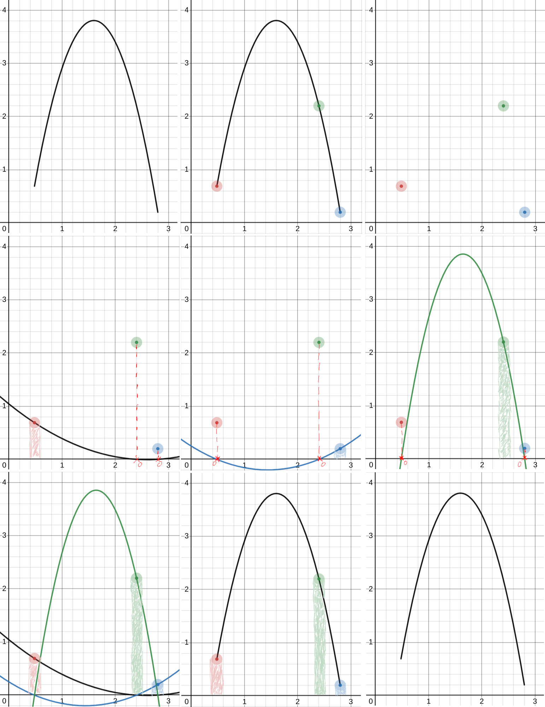
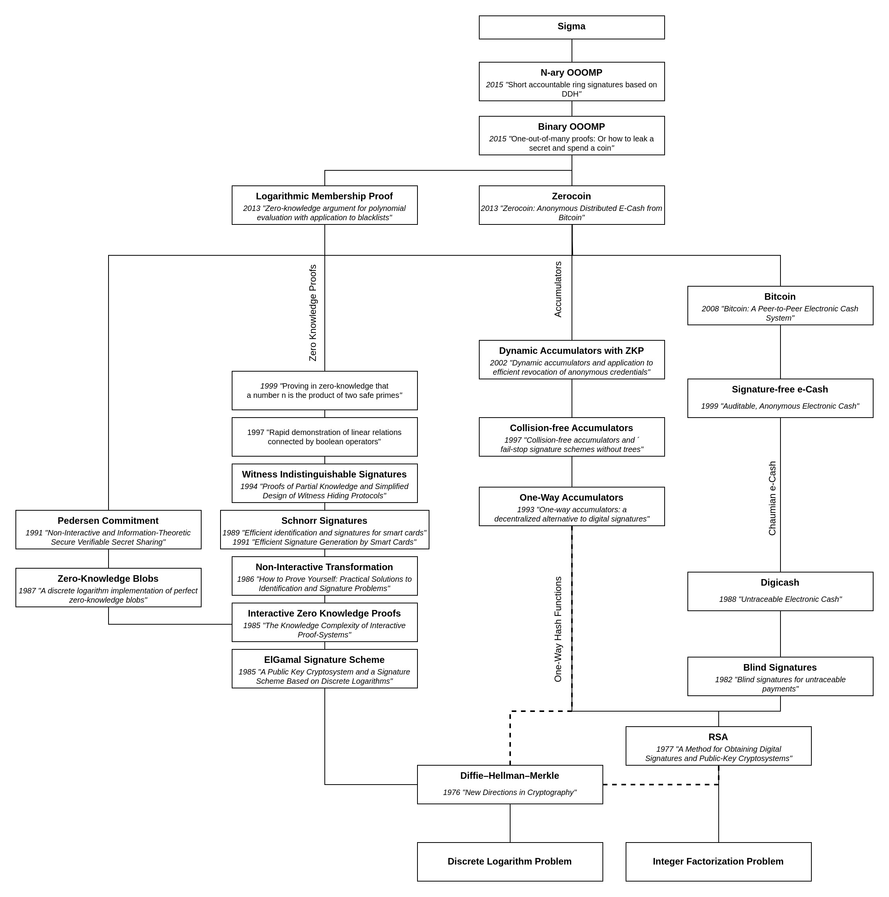

# Cryptocurrency Privacy Technologies: Sigma Protocol(s)

<p className="text-xs text-right">February 10, 2023 by [patrickd](/about#patrickd)</p>

import { Callout } from 'nextra/components'
import { Tabs } from 'nextra/components'
import { Timeline, Year } from '@components/timeline'
import { R, Reference, References } from '@components/references'
import Head from 'next/head'
import thumbnail from './thumbnail.png'

<Head>
  <meta name="twitter:image" content={thumbnail.src} />
  <meta name="og:image" content={thumbnail.src} />
</Head>

export function DetailBox({ title, children }) {
  return (
    <details className="last-of-type:mb-0 rounded-lg bg-neutral-50 dark:bg-neutral-800 p-2 mt-4">
      <summary>
        <strong className="text-lg">{title}</strong>
      </summary>
      <div className="nx-p-2">{children}</div>
    </details>
  )
}


Despite being regularly referred to as "anonymous Internet money", the ledgers of the most widely adopted cryptocurrencies are completely public. Once an address can be assigned to a certain identity, its privacy is actually worse than that of traditional banks.

In the [previous article](/posts/2024/1/9/cryptocurrency-privacy-technologies-zerocoin/), we explored the Zerocoin Protocol<R reference="1" /> which made use of Strong RSA Accumulators for a global anonymity set combined with Zero-Knowledge Proofs to anonymously demonstrate membership within the set. Unfortunately, there was a cryptographic flaw within an undocumented part of the protocol, leading to many cryptocurrencies implementing it to be vulnerable to inflation attacks. This time we'll explore its successor on Zcoin (now Firo), the "Sigma Protocol" which did not suffer from its predecessor's flaw and also promised significantly reduced proof sizes and the elimination of a trusted setup.

<Callout>
  **The Zerocoin Scheme in review**

  1. A user chooses a random Serial Number and Blinding Factor and creates a commitment that cannot be opened without knowledge of both values.
  2. The user publishes a transaction that locks some amount of value (eg. 1 BTC) and contains the commitment. The chain will keep track of such commitments, effectively "minting" a Zerocoin.
  3. Other users too publish their own commitments and lock the same denomination of value.
  4. Sometime later, the user publishes the Serial Number and proves in Zero-Knowledge that they know of a Blinding Factor that will open one of the commitments - without revealing which. They "redeem" their Zerocoin in exchange for one of the locked values.

  The protocol also keeps track of already used Serial Numbers to prevent double-spending since it's not known which of the commitments have already been spent. The Blinding Factor must never leak, since with it anyone could reconstruct the commitment published during the mint-transaction. The scheme is anonymous thanks to the fact that minting and redemption transactions cannot be connected to each other, effectively "mixing" with all other protocol participants.
</Callout>

## The Concept

In cryptography, the term "Sigma Protocol" ($`Sigma`$-Protocol) commonly refers to Proof-of-Knowledge techniques where a statement is proven by a Prover and Verifier communicating in three moves: Commitment, Challenge, and Response. Classifying these protocols is useful because they can be easily composed to prove conjunctions and disjunctions of multiple statements (ie. logical AND / OR conjectures). In regards to privacy, this is especially interesting since it allows the construction of k-out-of-n OR proofs (eg. for Ring Signatures), although for large anonymity sets such general techniques are still impractical since the proof's size grows linear with the number of members. More on this can be found in the [Appendix](#appendix).

Zcoin's (somewhat confusingly named) "Sigma Protocol" upgrade instead makes use of a specialized technique introduced by ["One-out-of-Many Proofs: Or How to Leak a Secret and Spend a Coin"](https://eprint.iacr.org/2014/764.pdf)<R reference="2" /> (OOOMP) which allows proving membership in large sets requiring only the transmission of a logarithmic number of commitments. Zcoin further improved this by implementing optimizations presented in ["Short Accountable Ring Signatures Based on DDH"](https://eprint.iacr.org/2015/643.pdf)<R reference="3" />.

### Scheme

At a high level, Sigma still follows Zerocoin's scheme: Private coins are minted by locking some denomination of public coins and publishing a Pedersen Commitment $`C`$ which can only be opened with knowledge of a serial number $`s`$ and a random blinding factor $`r`$:

$$
`C = sG + rH`
$$

<Callout type="info">
  As you can tell by the notation, Sigma makes use of Elliptic Curve Cryptography. This required existing commitments to be re-minted by users after the chain upgrade went live.
</Callout>

These commitments are no longer aggregated by an RSA Accumulator for which inclusion is proven to redeem the private coin. Instead, we prove that we are able to open one out of all published commitments where the serial number is equal to zero. To have our $`C`$ commit to zero, we reveal the serial number $`s`$ to the validators which allows them to determine the inverse element $`sG^(-1)`$. However, to maintain anonymity we may not reveal which of the commitments belongs to us, so the validators will add it to all published commitments $`C_i`$:

$$
`C'_i = C_i + sG^(-1)`
$$

For our own $`C`$, this will have the effect of homomorphically subtracting the serial number, turning it into a commitment to 0:

$$
`C' = C + sG^(-1) = cancel(sG) + rH + cancel(sG^(-1))`
$$

To a verifier all $`C'_i`$ look like random points on the curve. There's no way for them to identify which one no longer commits to a serial number.

### Inclusion Proof

Zerocoin required 3 Zero-Knowledge Proofs to function:

1. Proof of the commitment's inclusion in the anonymity set without revealing the commitment
2. Proof of the ability to open a commitment without revealing the commitment or its Blinding Factor
3. Proof that both of the previous proofs are referring to the same undisclosed commitment

Sigma achieves this within a single proof roughly by relying on both Prover and Verifier having the same ordered list of published commitments. In a sense, the proof is efficient by communicating the position of the commitment-to-zero within the list in Zero-Knowledge.

Assume that within the list of $`N`$ commitments $`C'_i`$ ($`C'_0, C'_1, ..., C_(N-1)`$) the commitment with the Serial Number of 0  is located at the index $`l`$ ($`C'_l = rH`$). Let's say that, based on a seed provided by the Prover and the commitment's place within the list, all commitments are summed up with deterministic random factors $`phi_i`$ on the side of the Validator:

$$
`sum_(i=0)^(N-1) phi_i*C'_i = phi_0C'_0 + phi_1C'_1 + ... + phi_(N-1)C'_(N-1)`
$$

The Prover creates a second sum with factors $`psi_i`$ that were chosen in such a manner that when subtracted from the first, everything will cancel out but for the commitment $`C'_l`$ that the Prover is able to open (has knowledge of $`r`$ for). 

$$
`sum_(i=0)^(N-1) phi_i*C'_i - sum_(i=0)^(N-1) psi_i*C'_i = C'_l`
$$

$$
`(phi_0C'_0 + phi_1C'_1 + ... + phi_lC'_l + ... + phi_(N-1)C'_(N-1)) - (psi_0C'_0 + psi_1C'_1 + ... + psi_lC'_l + ... + psi_(N-1)C'_(N-1)) = C'_l`
$$

$$
`0C'_0 + 0C'_1 + ... + 1C'_l + ... + 0C'_(N-1) = C'_l`
$$

To prevent this from leaking $`C'_l`$ the Prover adds $`r'H`$ to the sum, distorting the Blinding Factor. Knowing both $`r`$ and $`r'`$ the Prover is still able to prove their ability to open the resulting commitment $`C''_l = (r+r')H`$. 

$$
`obrace(sum_(i=0)^(N-1) phi_i*C'_i)^("Generated by Validator") - ubrace((sum_(i=0)^(N-1) psi_i*C'_i + r'H))_("Generated by Prover") = C''_l`
$$

The idea is that the Validator will be none the wiser about which of the commitments $`C'_i`$ the Prover was able to open since he'll only receive the already calculated sum and no information on the chosen $`psi_i`$ factors. While this was a gross oversimplification of the actual technique behind OOOMP, it should still have transported the concept at a high level.

## The Math

As you might have guessed, we assume the Elliptic Curve Discrete Log Problem (ECDLP) to be hard for a group of prime order $`q`$ with generators $`G`$ and $`H`$ where the relationship $`H = hG`$ is unknown. It could be argued that the selection of these parameters may leave an opportunity to introduce trapdoors, similar to how a trusted setup could have allowed the system to be backdoored. However by using well-established elliptic curve parameters and the use of hash functions for selecting generators, this risk should be insignificant. 

### Sigma Protocol for commitment to 0 or 1

The One-Out-Of-Many technique extends a $`Sigma`$-Protocol where multiple commitments $`hat C_j`$ are proven to commit to messages $`m_j`$ with a value of either 0 or 1.

$`bb"ZKPoK"{(color(red)(m_j), color(red)(r_j)): hat C_j = color(red)(m_j)G+color(red)(r_j)H ^^ color(red)(m_j) in {0, 1}}`$

| Prover                                                 | Verifier                                  |
| -----------------------------------------------------: | :---------------------------------------- |
| Knows $`(G, H, hat C_j, color(red)(m_j), color(red)(r_j))`$| Knows $`(G, H, hat C_j)`$             |
| Chooses random scalars $`color(red)(a_j, s_j, t_j)`$   |                                           |
| $`A_j = color(red)(a_j)G + color(red)(s_j)H`$          |                                           |
| $`B_j = color(red)((a_j*m_j))G + color(red)(t_j)H`$    |                                           |
| Sends $`(A_j, B_j) Rightarrow`$                        | Knows $`(G, H, hat C_j, A_j, B_j)`$       |
|                                                        | Chooses a random challenge scalar $`x`$   |
| Knows $`(G, H, hat C_j, color(red)(m_j, r_j, a_j, s_j, t_j), A_j, B_j, x)`$ | $`Leftarrow`$ Sends $`x`$|
| $`f_j = color(red)(m_j)*x+color(red)(a_j)`$            |                                           |
| $`alpha_j = color(red)(r_j)*x+color(red)(s_j)`$        |                                           |
| $`beta_j = color(red)(r_j)*(x-f_j)+color(red)(t_j)`$   |                                           |
| Sends $`(f_j, alpha_j, beta_j) Rightarrow`$            | Knows $`(G, H, hat C_j, A_j, B_j, x, f_j, alpha_j, beta_j)`$|
|                                                        | $`x*hat C_j+A_j" "overset(?)(=)" "f_jG+alpha_jH`$|
|                                                        | $`(x-f_j)hat C_j+B_j" "overset(?)(=)" "0G+beta_jH`$|

<Callout type="warning">
  Verifiers should enforce commitments $`C_j`$, $`A_j`$, and $`B_j`$ to be valid points on the curve. Scalar values $`f_j`$, $`alpha_j`$, and $`beta_j`$ should be $`in ZZ_q`$. The challenge $`x`$ should be a binary value $`{0, 1}^lambda`$ where the length $`lambda`$ is a security parameter.
</Callout>

<details className="last-of-type:mb-0 rounded-lg bg-neutral-50 dark:bg-neutral-800 p-2 mt-4">
  <summary>
    <strong className="text-lg">$`xhat C+A" "overset(?)(=)" "fG+alphaH`$</strong>
  </summary>
  <div className="nx-p-2">
    Substitute $`hat C = color(red)(m)G+color(red)(r)H" , "A = color(red)(a)G + color(red)(s)H" , "f = color(red)(m)x+color(red)(a)" , "alpha = color(red)(r)x+color(red)(s)`$

    $`x*(color(red)(m)G+color(red)(r)H)+(color(red)(a)G + color(red)(s)H)" "overset(?)(=)" "(color(red)(m)x+color(red)(a))G+(color(red)(r)x+color(red)(s))H`$

    $`(color(red)(m)x)G+(color(red)(r)x)H+color(red)(a)G + color(red)(s)H" "overset(?)(=)" "(color(red)(m)x+color(red)(a))G+(color(red)(r)x+color(red)(s))H`$

    $`(color(red)(m)x + color(red)(a))G+(color(red)(r)x + color(red)(s))H" "overset(✓)(=)" "(color(red)(m)x+color(red)(a))G+(color(red)(r)x+color(red)(s))H`$
  </div>
</details>

<details className="last-of-type:mb-0 rounded-lg bg-neutral-50 dark:bg-neutral-800 p-2 mt-4">
  <summary>
    <strong className="text-lg">$`(x-f)hat C+B" "overset(?)(=)" "0G+betaH`$</strong>
  </summary>
  <div className="nx-p-2">
    Substitute $`f = color(red)(m)x+color(red)(a)" , "hat C = color(red)(m)G+color(red)(r)H" , "B = color(red)(am)G + color(red)(t)H" , "beta = color(red)(r)(x-f)+color(red)(t)" , "0G = 0`$

    $`(x-(color(red)(m)x+color(red)(a)))(color(red)(m)G+color(red)(r)H)+(color(red)(am)G + color(red)(t)H)" "overset(?)(=)" "0+(color(red)(r)(x-f)+color(red)(t))H`$

    $`(x-color(red)(m)x-color(red)(a))(color(red)(m)G+color(red)(r)H)+(color(red)(am)G + color(red)(t)H)" "overset(?)(=)" "(color(red)(r)x-color(red)(r)(color(red)(m)x+color(red)(a))+color(red)(t))H`$

    $`(color(red)(m)x-color(red)(m^2)x-color(red)(ma))G + (color(red)(r)x-color(red)(r)color(red)(m)x-color(red)(r)color(red)(a))H+color(red)(am)G + color(red)(t)H" "overset(?)(=)" "(color(red)(r)x-color(red)(r)color(red)(m)x-color(red)(r)color(red)(a)+color(red)(t))H`$

    $`(color(red)(m)x-color(red)(m^2)xcancel(-color(red)(ma)))G + (color(red)(r)x-color(red)(r)color(red)(m)x-color(red)(r)color(red)(a)+color(red)(t))H+cancel(color(red)(am)G)" "overset(?)(=)" "(color(red)(r)x-color(red)(r)color(red)(m)x-color(red)(r)color(red)(a)+color(red)(t))H`$

    $`(color(red)(m)x-color(red)(m^2)x)G + (color(red)(r)x-color(red)(r)color(red)(m)x-color(red)(r)color(red)(a)+color(red)(t))H" "overset(?)(=)" "(color(red)(r)x-color(red)(r)color(red)(m)x-color(red)(r)color(red)(a)+color(red)(t))H`$

    $`"if "m = 1"`$

    $`(color(red)(1)x-color(red)(1^2)x)G + (color(red)(r)x-color(red)(r)color(red)(1)x-color(red)(r)color(red)(a)+color(red)(t))H" "overset(?)(=)" "(cancel(color(red)(r)x)cancel(-color(red)(r)color(red)(1)x)-color(red)(r)color(red)(a)+color(red)(t))H`$

    $`cancel((color(red)(1)x-color(red)(1^2)x)G) + (-color(red)(r)color(red)(a)+color(red)(t))H" "overset(✓)(=)" "(-color(red)(r)color(red)(a)+color(red)(t))H`$

    $`"if "m = 0"`$

    $`(color(red)(0)x-color(red)(0^2)x)G + (color(red)(r)x-cancel(color(red)(r)color(red)(0)x)-color(red)(r)color(red)(a)+color(red)(t))H" "overset(?)(=)" "(color(red)(r)x-color(red)(r)color(red)(0)x-color(red)(r)color(red)(a)+color(red)(t))H`$

    $`cancel((color(red)(0)x-color(red)(0^2)x)G) + (color(red)(r)x-color(red)(r)color(red)(a)+color(red)(t))H" "overset(✓)(=)" "(color(red)(r)x-color(red)(r)color(red)(a)+color(red)(t))H`$

    $`"Invalid for any "m > 1`$
  </div>
</details>

Remember that all statements can be verified in parallel within 3 moves with the same challenge $`x`$, effectively resulting in a logical AND conjecture. Like all $`Sigma`$-Protocols, this one too may be transformed to be non-interactive using the [Fiat-Shamir heuristic](/posts/2024/1/9/cryptocurrency-privacy-technologies-zerocoin/#making-interactive-proofs-non-interactive).<R reference='7' />

### Kronecker Delta

In what follows, a function called the "Kronecker delta" will be useful for conciseness. The function takes two parameters ($`alpha, beta`$) and returns either $`1`$ (when $`alpha = beta`$) or $`0`$ (when $`alpha != beta`$). The parameters are usually written as indices of the greek letter $`delta`$ (delta):

$$
\delta_{\alpha\beta} = \begin{cases}
0 &\text{if } \alpha \neq \beta,   \\
1 &\text{if } \alpha=\beta.   \end{cases}
$$

### One Out Of Many Proof Intuition

Assuming there are $`N`$ commitments $`C'_i = C_i + sG^(-1)`$, where $`l`$ is the index at which our coin-commitment $`C'_l = C_l + sG^(-1) = 0G + rH`$ is located, the anonymity set known by both the Prover and Verifiers is:

$$
`C'_0, C'_1, ..., C'_l, ..., C'_(N-1)`
$$

We want to construct a proof where, when each commitment is multiplied with a Kronecker delta $`delta_(il)`$, the sum results in a commitment to zero which we are able to open (thanks to our knowledge of $`r`$):

$$
`sum_(i=0)^(N-1) delta_(il)C'_i = C'_l`
$$

$$
`delta_(0,l)C'_0 + delta_(1,l)C'_1 + ... + delta_(l,l)C'_l + ... + delta_(N-1,l)C'_(N-1) = 0G + rH`
$$

$$
`0*C'_0 + 0*C'_1 + ... + 1*C'_l + ... + 0*C'_(N-1) = rH`
$$

As described, the Kronecker delta $`delta_(il)`$ will be 1 only when the current index $`i`$ is equal to the index $`l`$ of the commitment $`C'_l`$ for which we want to prove that we are able to open it. 

We'll then further break the indices down into their binary representations $`i = i_1, ..., i_n`$ and $`l = l_1, ..., l_n`$ where $`i_j, l_j in {0, 1}`$. Using this, we can substitute $`delta_(il)`$ with the product $`prod_(j=1)^n delta_(i_jl_j)`$:

$$
`sum_(i=0)^(N-1) (prod_(j=1)^n delta_(i_jl_j))C'_i = 1C'_l`
$$

$$
`sum_(i=0)^(N-1) (delta_(i_1l_1) * delta_(i_2l_2) * ... * delta_(i_(n)l_(n)))C'_i = (1 * 1 * ... * 1)C'_l`
$$

<Callout type="warning">
  This technique assumes $`N=2^n`$, which will rarely be exactly the case in practice. It's recommended to simply pad the commitments by reusing the last $`C'_i`$ until a valid length has been reached.

  Zcoin's OOOMP implementation erroneously omitted doing this until version [v0.13.8.8](https://github.com/firoorg/firo/releases/tag/v0.13.8.8) which could have allowed an attacker to generate a false proof.
</Callout>

<details className="last-of-type:mb-0 rounded-lg bg-neutral-50 dark:bg-neutral-800 p-2 mt-4">
  <summary>
    <strong className="text-lg">Example</strong>
  </summary>
  <div className="nx-p-2 overflow-x-scroll">
    Assume $`n = 3`$, therefore $`N = 2^3 = 8`$ with $`C'_0, C'_1, C'_3, C'_4, C'_5, C'_6, C'_7`$ and the commitment $`C_l`$ for which we want to prove set membership of at $`l = 5`$ (ie. $`C_l = C_5`$). 

    | ↓ $`i`$ / $`j`$ → | 1 ($`2^0`$) | 2 ($`2^1`$) | 3 ($`2^2`$) |
    |------------------:|-------------|-------------|-------------|
    | 0                 | 0           | 0           | 0           |
    | 1                 | 1           | 0           | 0           |
    | 2                 | 0           | 1           | 0           |
    | 3                 | 1           | 1           | 0           |
    | 4                 | 0           | 0           | 1           |
    | $`l`$ = 5         | 1           | 0           | 1           |
    | 6                 | 0           | 1           | 1           |
    | 7                 | 1           | 1           | 1           |

    According to the above (big-endian) binary table the values of $`l_j`$ would be $`l_1 = 1`$, $`l_2 = 0`$, and $`l_3 = 1`$:

    $$
    `l = sum_(j=1)^(n) l_j2^(j-1) = l_(1)2^0 + l_(2)2^1 + l_(3)2^2 = 1*1 + 0*2 + 1*4 = 5`
    $$

    We'll now unroll the introduced equation using the example's assumptions:

    $$
    `sum_(i=0)^(7) (prod_(j=1)^3 delta_(i_jl_j))C'_i = color(blue)(C'_5)`
    $$

    $$
    `(prod_(j=1)^3 delta_(0_jl_j))C'_0 + (prod_(j=1)^3 delta_(1_jl_j))C'_1 + (prod_(j=1)^3 delta_(2_jl_j))C'_2 + (prod_(j=1)^3 delta_(3_jl_j))C'_3 + (prod_(j=1)^3 delta_(4_jl_j))C'_4 + color(blue)((prod_(j=1)^3 delta_(l_j))C'_5) + (prod_(j=1)^3 delta_(6_jl_j))C'_6 + (prod_(j=1)^3 delta_(7_jl_j))C'_7 = color(blue)(C'_5)`
    $$

    $$
    `(delta_(0_(1)5_(1))*delta_(0_(2)5_(2))*delta_(0_(3)5_(3)))C'_0 + (delta_(1_(1)5_(1))*delta_(1_(2)5_(2))*delta_(1_(3)5_(3)))C'_1 + (delta_(2_(1)5_(1))*delta_(2_(2)5_(2))*delta_(2_(3)5_(3)))C'_2 + (delta_(3_(1)5_(1))*delta_(3_(2)5_(2))*delta_(3_(3)5_(3)))C'_3 + (delta_(4_(1)5_(1))*delta_(4_(2)5_(2))*delta_(4_(3)5_(3)))C'_4 + color(blue)((delta_(5_(1)5_(1))*delta_(5_(2)5_(2))*delta_(5_(3)5_(3)))C'_5) + (delta_(6_(1)5_(1))*delta_(6_(2)5_(2))*delta_(6_(3)5_(3)))C'_6 + (delta_(7_(1)5_(1))*delta_(7_(2)5_(2))*delta_(7_(3)5_(3)))C'_7 = color(blue)(C'_5)`
    $$

    $$
    `(delta_(0,1)*delta_(0,0)*delta_(0,1))C'_0 + (delta_(1,1)*delta_(0,0)*delta_(0,1))C'_1 + (delta_(0,1)*delta_(1,0)*delta_(0,1))C'_2 + (delta_(1,1)*delta_(1,0)*delta_(0,1))C'_3 + (delta_(0,1)*delta_(0,0)*delta_(1,1))C'_4 + color(blue)((delta_(1,1)*delta_(0,0)*delta_(1,1))C'_5) + (delta_(0,1)*delta_(1,0)*delta_(1,1))C'_6 + (delta_(1,1)*delta_(1,0)*delta_(1,1))C'_7 = color(blue)(C'_5)`
    $$

    $$
    `(0*1*0)C'_0 + (1*1*0)C'_1 + (0*0*0)C'_2 + (1*0*0)C'_3 + (0*1*1)C'_4 + color(blue)((1*1*1)C'_5) + (0*0*1)C'_6 + (1*0*1)C'_7 = color(blue)(C'_5)`
    $$

    $$
    `0*C'_0 + 0*C'_1 + 0*C'_2 + 0*C'_3 + 0*C'_4 + color(blue)(1*C'_5) + 0*C'_6 + 0*C'_7 = color(blue)(C'_5)`
    $$

    $$
    `color(blue)(C'_5) = color(blue)(C'_5)`
    $$
  </div>
</details>

If we engage in $`n`$ parallel $`Sigma`$-protocols (described above) to demonstrate that all values $`l_j in {0, 1}`$ by making commitments $`hat C_j = l_jG + r_jH`$ (with $`m_j = l_j`$ and randomly chosen $`r_j`$), the Prover would reveal values of $`f_j`$ in the form

$$
`f_j = l_jx + a_j`
$$

as part of the final move. Based on that we define

$$
`f_(j,1) = f_j = l_jx + a_j = delta_(1l_j)x + a_j`
$$

$$
`f_(j,0) = x - f_j = (1 - l_j)x-a_j = delta_(0l_j)x - a_j`
$$

which gives us for each $`i`$ that the product $`prod_(j=1)^n f_(j,i_j)`$ is a polynomial of the form

$$
`p_i(x) = prod_(j=1)^n (delta_(i_jl_j)x)+sum_(k=0)^(n-1)p_(i,k)x^k = delta_(il)x^n+sum_(k=0)^(n-1)p_(i,k)x^k`
$$

where the polynomial's low order coefficients (corresponding to $`x^0, ..., x^(n-1)`$) are $`p_(i,k)`$ and can be determined before receiving the challenge value $`x`$.


<details className="last-of-type:mb-0 rounded-lg bg-neutral-50 dark:bg-neutral-800 p-2 mt-4">
  <summary>
    <strong className="text-lg">Example</strong>
  </summary>
  <div className="nx-p-2 overflow-x-scroll">
  Continuing based on the assumptions made in the previous example, we determine the polynomial $`p_i(x)`$ for each commitment $`C'_i`$:

  $$
  `p_0(x) = prod_(j=1)^3 f_(j,i_j) = f_(1,i_1)*f_(2,i_2)*f_(3,i_3) = f_(1,0)*f_(2,0)*f_(3,0) = (delta_(0l_1)x - a_1)(delta_(0l_2)x - a_2)(delta_(0l_3)x - a_3) = (delta_(0,0)x - a_1)(delta_(0,1)x - a_2)(delta_(0,1)x - a_3) = (1x - a_1)(0x - a_2)(0x - a_3) = (x - a_1)(-a_2)(-a_3) = a_2a_3x-a_1a_2a_3`
  $$

  $$
  `p_1(x) = prod_(j=1)^3 f_(j,i_j) = f_(1,i_1)*f_(2,i_2)*f_(3,i_3) = f_(1,1)*f_(2,0)*f_(3,0) = (delta_(1l_1)x + a_1)(delta_(0l_2)x - a_2)(delta_(0l_3)x - a_3) = (delta_(1,1)x + a_1)(delta_(0,0)x - a_2)(delta_(0,1)x - a_3) = (1x + a_1)(1x - a_2)(0x - a_3) = (x + a_1)(x - a_2)(-a_3) = -a_3 x^2 - a_1 a_3 x + a_2 a_3 x + a_1 a_2 a_3`
  $$

  $$
  `p_2(x) = prod_(j=1)^3 f_(j,i_j) = f_(1,i_1)*f_(2,i_2)*f_(3,i_3) = f_(1,0)*f_(2,1)*f_(3,0) = (delta_(0l_1)x - a_1)(delta_(1l_2)x + a_2)(delta_(0l_3)x - a_3) = (delta_(0,1)x - a_1)(delta_(1,0)x + a_2)(delta_(0,1)x - a_3) = (0x - a_1)(0x + a_2)(0x - a_3) = (-a_1)(a_2)(-a_3) = a_1a_2a_3`
  $$

  $$
  `p_3(x) = prod_(j=1)^3 f_(j,i_j) = f_(1,i_1)*f_(2,i_2)*f_(3,i_3) = f_(1,1)*f_(2,1)*f_(3,0) = (delta_(1l_1)x + a_1)(delta_(1l_2)x + a_2)(delta_(0l_3)x - a_3) = (delta_(1,1)x + a_1)(delta_(1,0)x + a_2)(delta_(0,1)x - a_3) = (1x + a_1)(0x + a_2)(0x - a_3) = (x + a_1)(a_2)(-a_3) = -a_2 a_3 x - a_1 a_2 a_3`
  $$

  $$
  `p_4(x) = prod_(j=1)^3 f_(j,i_j) = f_(1,i_1)*f_(2,i_2)*f_(3,i_3) = f_(1,0)*f_(2,0)*f_(3,1) = (delta_(0l_1)x - a_1)(delta_(0l_2)x - a_2)(delta_(1l_3)x + a_3) = (delta_(0,1)x - a_1)(delta_(0,0)x - a_2)(delta_(1,1)x + a_3) = (0x - a_1)(1x - a_2)(1x + a_3) = (-a_1)(x - a_2)(x + a_3) = -a_1 x^2 + a_1 a_2 x - a_1 a_3 x + a_1 a_2 a_3`
  $$

  $$
  `color(blue)(p_5(x) = prod_(j=1)^3 f_(j,i_j) = f_(1,i_1)*f_(2,i_2)*f_(3,i_3) = f_(1,1)*f_(2,0)*f_(3,1) = (delta_(1l_1)x + a_1)(delta_(0l_2)x - a_2)(delta_(1l_3)x + a_3) = (delta_(1,1)x + a_1)(delta_(0,0)x - a_2)(delta_(1,1)x + a_3) = (1x + a_1)(1x - a_2)(1x + a_3) = (x + a_1)(x - a_2)(x + a_3) = x^3 + a_1 x^2 - a_2 x^2 + a_3 x^2 - a_1 a_2 x + a_1 a_3 x - a_2 a_3 x - a_1 a_2 a_3)`
  $$

  $$
  `p_6(x) = prod_(j=1)^3 f_(j,i_j) = f_(1,i_1)*f_(2,i_2)*f_(3,i_3) = f_(1,0)*f_(2,1)*f_(3,1) = (delta_(0l_1)x - a_1)(delta_(1l_2)x + a_2)(delta_(1l_3)x + a_3) = (delta_(0,1)x - a_1)(delta_(1,0)x + a_2)(delta_(1,1)x + a_3) = (0x - a_1)(0x + a_2)(1x + a_3) = (-a_1)(a_2)(x + a_3) = -a_1 a_2 x - a_1 a_3 a_2`
  $$

  $$
  `p_7(x) = prod_(j=1)^3 f_(j,i_j) = f_(1,i_1)*f_(2,i_2)*f_(3,i_3) = f_(1,1)*f_(2,1)*f_(3,1) = (delta_(1l_1)x + a_1)(delta_(1l_2)x + a_2)(delta_(1l_3)x + a_3) = (delta_(1,1)x + a_1)(delta_(1,0)x + a_2)(delta_(1,1)x + a_3) = (1x + a_1)(0x + a_2)(1x + a_3) = (x + a_1)(a_2)(x + a_3) = a_2 x^2 + a_1 a_2 x + a_2 a_3 x + a_1 a_2 a_3`
  $$

  From these we can create a table of coefficients:

  | ↓ $`i`$ | $`delta_(il)`$ ($`x^3`$) | $`p_(i,2)`$ ($`x^2`$) | $`p_(i,1)`$ ($`x^1`$) | $`p_(i,0)`$ ($`x^0`$) |
  |--------:|--------------------------|-----------------------|-----------------------|-----------------------|
  | 0       | 0                        | 0                     | $`a_2*a_3`$           | $`-a_1*a_2*a_3`$      |
  | 1       | 0                        | $`-a_3`$              | $`-a_1*a_3+a_2*a_3`$  | $`a_1*a_2*a_3`$       |
  | 2       | 0                        | 0                     | 0                     | $`a_1*a_2*a_3`$       |
  | 3       | 0                        | 0                     | $`-a_2*a_3`$          | $`-a_1*a_2*a_3`$      |
  | 4       | 0                        | $`-a_1`$              | $`a_1*a_2-a_1*a_3`$   | $`a_1*a_2*a_3`$       |
  | 5       | $`color(blue)(1)`$       | $`color(blue)(a_1-a_2+a_3)`$|$`color(blue)(-a_1*a_2+a_1*a_3-a_2*a_3)`$|$`color(blue)(-a_1*a_2*a_3)`$|
  | 6       | 0                        | 0                     | $`-a_1*a_2`$          | $`-a_1*a_2*a_3`$      |
  | 7       | 0                        | $`a_2`$               | $`a_1*a_2+a_2*a_3`$   | $`a_1*a_2*a_3`$       |

  The actual value for each coefficient can be calculated by information already known by the Prover ($`a_j`$) before a challenge value $`x`$ was received. Note that these aren't individually transferred as part of the proof transcript, they're only locally computed by the Prover.

  Determining the coefficients for all commitments of a large anonymity set may seem extremely expensive, but there are ways to do these calculations in a quite efficient manner.
  </div>
</details>

$$
`D_k = sum_(i=0)^(N-1) p_(i,k)C'_i`
$$

The idea is that the Prover would send commitments $`D_0, ..., D_(n-1)`$ that cancel out these low order coefficients while the high order coefficient $`delta_(il)`$ for $`x^n`$ will guarantee that only our commitment to zero remains:

$$
`sum_(i=0)^(N-1) (prod_(j=1)^n f_(j,i_j))C'_i - sum_(k=0)^(n-1) x^kD_k = x^nC'_l`
$$

<details className="last-of-type:mb-0 rounded-lg bg-neutral-50 dark:bg-neutral-800 p-2 mt-4">
  <summary>
    <strong className="text-lg">Example</strong>
  </summary>
  <div className="nx-p-2 overflow-x-scroll">
  Continuing with the previous example, we now determine commitments $`D_k`$ where $`k = j - 1`$:

  $$
  `D_0 = sum_(i=0)^(7) p_(i,0)C'_i = p_(0,0)C'_0 + p_(1,0)C'_1 + p_(2,0)C'_2 + p_(3,0)C'_3 + p_(4,0)C'_4 + color(blue)(p_(5,0)C'_5) + p_(6,0)C'_6 + p_(7,0)C'_7 = -a_1a_2a_3C'_0 + a_1a_2a_3C'_1 + a_1a_2a_3C'_2 -a_1a_2a_3C'_3 + a_1a_2a_3C'_4 color(blue)(-a_1a_2a_3C'_5) -a_1a_2a_3 + a_1a_2a_3C'_7`
  $$

  $$
  `D_1 = sum_(i=0)^(7) p_(i,1)C'_i = p_(0,1)C'_0 + p_(1,1)C'_1 + p_(2,1)C'_2 + p_(3,1)C'_3 + p_(4,1)C'_4 + color(blue)(p_(5,1)C'_5) + p_(6,1)C'_6 + p_(7,1)C'_7 = a_2a_3C'_0 + (-a_1a_3+a_2a_3)C'_1 + 0C'_2 -a_2a_3C'_3 + (a_1a_2-a_1a_3)C'_4 + color(blue)((-a_1a_2+a_1a_3-a_2a_3)C'_5) -a_1a_2C'_6 + (a_1a_2+a_2a_3)C'_7`
  $$

  $$
  `D_2 = sum_(i=0)^(7) p_(i,2)C'_i = p_(0,2)C'_0 + p_(1,2)C'_1 + p_(2,2)C'_2 + p_(3,2)C'_3 + p_(4,2)C'_4 + color(blue)(p_(5,2)C'_5) + p_(6,2)C'_6 + p_(7,2)C'_7 = 0C'_0 -a_3C'_1 + 0C'_2 + 0C'_3 -a_1C'_4 + color(blue)((a_1-a_2+a_3)C'_5) + 0C'_6 + a_2C'_7`
  $$

  We'll use everything so far to show that the lower order coefficients indeed end up cancelling out all commitments but $`C'_5`$ during the subtraction of

  $$
  `ubrace(sum_(i=0)^(7) (prod_(j=1)^3 f_(j,i_j))C'_i)_("(1)") ubrace(- sum_(k=0)^(2) x^kD_k)_("(2)")`
  $$

  We begin by expanding $`"(1)"`$ based on the polynomials we already calculated in the previous example:

  $$
  `sum_(i=0)^(7) (prod_(j=1)^3 f_(j,i_j))C'_i`
  $$

  $$
  `(prod_(j=1)^3 f_(j,i_j))C'_0 + (prod_(j=1)^3 f_(j,i_j))C'_1 + (prod_(j=1)^3 f_(j,i_j))C'_2 + (prod_(j=1)^3 f_(j,i_j))C'_3 + (prod_(j=1)^3 f_(j,i_j))C'_4 + color(blue)((prod_(j=1)^3 f_(j,i_j))C'_5) + (prod_(j=1)^3 f_(j,i_j))C'_6 + (prod_(j=1)^3 f_(j,i_j))C'_7`
  $$

  $$
  `(f_(1,i_1)f_(2,i_2)f_(3,i_3))C'_0 + (f_(1,i_1)f_(2,i_2)f_(3,i_3))C'_1 + (f_(1,i_1)f_(2,i_2)f_(3,i_3))C'_2 + (f_(1,i_1)f_(2,i_2)f_(3,i_3))C'_3 + (f_(1,i_1)f_(2,i_2)f_(3,i_3))C'_4 + color(blue)((f_(1,i_1)f_(2,i_2)f_(3,i_3))C'_5) + (f_(1,i_1)f_(2,i_2)f_(3,i_3))C'_6 + (f_(1,i_1)f_(2,i_2)f_(3,i_3))C'_7`
  $$

  $$
  `(f_(1,0)f_(2,0)f_(3,0))C'_0 + (f_(1,1)f_(2,0)f_(3,0))C'_1 + (f_(1,0)f_(2,1)f_(3,0))C'_2 + (f_(1,1)f_(2,1)f_(3,0))C'_3 + (f_(1,0)f_(2,0)f_(3,1))C'_4 + color(blue)((f_(1,1)f_(2,0)f_(3,1))C'_5) + (f_(1,0)f_(2,1)f_(3,1))C'_6 + (f_(1,1)f_(2,1)f_(3,1))C'_7`
  $$

  $$
  `(a_2a_3x-a_1a_2a_3)C'_0 + (-a_3 x^2 - a_1 a_3 x + a_2 a_3 x + a_1 a_2 a_3)C'_1 + (a_1a_2a_3)C'_2 + (-a_2 a_3 x - a_1 a_2 a_3)C'_3 + (-a_1 x^2 + a_1 a_2 x - a_1 a_3 x + a_1 a_2 a_3)C'_4 + color(blue)((x^3 + a_1 x^2 - a_2 x^2 + a_3 x^2 - a_1 a_2 x + a_1 a_3 x - a_2 a_3 x - a_1 a_2 a_3)C'_5) + (-a_1 a_2 x - a_1 a_3 a_2)C'_6 + (a_2 x^2 + a_1 a_2 x + a_2 a_3 x + a_1 a_2 a_3)C'_7`
  $$

  Next we continue by expanding $`"(2)"`$ making use of the commitments $`D_k`$ determined above:

  $$
  `-sum_(k=0)^(2) x^kD_k`
  $$

  $$
  `-x^0D_0-x^1D_1-x^2D_2`
  $$

  $$
  `-x^0(-a_1a_2a_3C'_0 + a_1a_2a_3C'_1 + a_1a_2a_3C'_2 -a_1a_2a_3C'_3 + a_1a_2a_3C'_4 -a_1a_2a_3C'_5 -a_1a_2a_3C'_6 + a_1a_2a_3C'_7)-x^1(a_2a_3C'_0 + (-a_1a_3+a_2a_3)C'_1 + 0C'_2 -a_2a_3C'_3 + (a_1a_2-a_1a_3)C'_4 + color(blue)((-a_1a_2+a_1a_3-a_2a_3)C'_5) -a_1a_2C'_6 + (a_1a_2+a_2a_3)C'_7)-x^2(0C'_0 -a_3C'_1 + 0C'_2 + 0C'_3 -a_1C'_4 + (a_1-a_2+a_3)C'_5 + 0C'_6 + a_2C'_7)`
  $$

  $$
  `(a_1a_2a_3C'_0 - a_1a_2a_3C'_1 - a_1a_2a_3C'_2 + a_1a_2a_3C'_3 - a_1a_2a_3C'_4 + a_1a_2a_3C'_5 + a_1a_2a_3C'_6 - a_1a_2a_3C'_7)+(-a_2a_3xC'_0 - (-a_1a_3+a_2a_3)xC'_1 + a_2a_3xC'_3 - (a_1a_2-a_1a_3)xC'_4 color(blue)(- (-a_1a_2+a_1a_3-a_2a_3)xC'_5) + a_1a_2xC'_6 - (a_1a_2+a_2a_3)xC'_7)+(a_3x^2C'_1 + a_1x^2C'_4 - (a_1-a_2+a_3)x^2C'_5 - a_2x^2C'_7)`
  $$

  $$
  `(-a_2a_3x + a_1a_2a_3)C'_0  + (a_3x^2+a_1a_3x-a_2a_3x-a_1a_2a_3)C'_1 + (-a_1a_2a_3)C'_2 + (a_2a_3x + a_1a_2a_3)C'_3 + (a_1x^2 - a_1a_2x + a_1a_3x -a_1a_2a_3)C'_4 + color(blue)((-a_1x^2 + a_2x^2 - a_3x^2 + a_1a_2x - a_1a_3x + a_2a_3x + a_1a_2a_3)C'_5) + (a_1a_2x + a_1a_2a_3)C'_6 + (- a_2x^2 - a_1a_2x - a_2a_3x - a_1a_2a_3)C'_7`
  $$

  Finally, we can see that both parts cancel each other out when adding them, except for $`x^3C_5`$:


  $$
  `((cancel(a_2a_3x)cancel(-a_1a_2a_3))C'_0 + (cancel(-a_3 x^2) cancel(- a_1 a_3 x) + cancel(a_2 a_3 x) + cancel(a_1 a_2 a_3))C'_1 + (cancel(a_1a_2a_3))C'_2 + (cancel(-a_2 a_3 x) cancel(- a_1 a_2 a_3))C'_3 + (cancel(-a_1 x^2) + cancel(a_1 a_2 x) cancel(- a_1 a_3 x) + cancel(a_1 a_2 a_3))C'_4 + color(blue)((x^3 + cancel(a_1x^2) cancel(- a_2 x^2) + cancel(a_3 x^2) cancel(- a_1 a_2 x) + cancel(a_1 a_3 x) cancel(- a_2 a_3 x) cancel(- a_1 a_2 a_3))C'_5) + (cancel(-a_1 a_2 x) cancel(- a_1 a_3 a_2))C'_6 + (cancel(a_2 x^2) + cancel(a_1 a_2 x) + cancel(a_2 a_3 x) + cancel(a_1 a_2 a_3))C'_7) + ((cancel(-a_2a_3x) + cancel(a_1a_2a_3))C'_0  + (cancel(a_3x^2)+cancel(a_1a_3x)cancel(-a_2a_3x)cancel(-a_1a_2a_3))C'_1 + (cancel(-a_1a_2a_3))C'_2 + (cancel(a_2a_3x) + cancel(a_1a_2a_3))C'_3 + (cancel(a_1x^2) cancel(- a_1a_2x) + cancel(a_1a_3x) cancel(-a_1a_2a_3))C'_4 + color(blue)((cancel(-a_1x^2) + cancel(a_2x^2) cancel(- a_3x^2) + cancel(a_1a_2x) cancel(- a_1a_3x) + cancel(a_2a_3x) + cancel(a_1a_2a_3))C'_5) + (cancel(a_1a_2x) + cancel(a_1a_2a_3))C'_6 + (cancel(- a_2x^2)cancel(- a_1a_2x)cancel(- a_2a_3x)cancel(-a_1a_2a_3))C'_7)`
  $$

  $$
  `0C'_0 + 0C'_1 + 0C'_2 + 0C'_3 + 0C'_4 + color(blue)(x^3C'_5) + 0C'_6 + 0C'_7`
  $$

  </div>
</details>

As in the conceptual explanation, $`D_k`$ is extended to distort the blinding factor using random values $`rho_k`$:

$$
`D_k = sum_(i=0)^(N-1) p_(i,k)C'_i + rho_kH`
$$

With this intuition in mind, you should now be able to make sense of the proof's actual construction.

### One Out Of Many Proof Construction

A OOOMP demonstrates knowledge of an index $`l`$ and a blinding factor $`r`$ for a commitment $`C_l`$ to zero contained within a known set of commitments $`C_i`$ without revealing neither the commitment nor $`r`$. In other words, we prove in Zero-Knowledge that we are able to open one of the commitments from a public list.

$`bb"ZKPoK"{(color(red)(l), color(red)(r)): C'_(color(red)(l)) = 0G+color(red)(r)H ^^ C'_(color(red)(l)) in {C_0, C_1, ..., C_(N-1)}}`$

| Prover                                                 | Verifier                                  |
| -----------------------------------------------------: | :---------------------------------------- |
| Knows $`(G, H, (C'_0,..., C'_(N-1)),color(red)(l, r))`$| Knows $`(G, H, (C'_0,...,C'_(N-1)))`$     |
| Chooses random scalars $`color(red)(r_j, a_j, s_j, t_j, rho_k)`$|                                  |
| $`hat C_j = color(red)(l_j)G + color(red)(r_j)H`$      |                                           |
| $`A_j = color(red)(a_j)G + color(red)(s_j)H`$          |                                           |
| $`B_j = color(red)((l_ja_j))G + color(red)(t_j)H`$     |                                           |
| $`D_k = sum_(i=0)^(N-1)p_(i,k)C'_i+color(red)(rho_k)H`$|                                           |
| Sends $`(A_j, B_j, hat C_j, D_k) Rightarrow`$          | Knows $`(..., A_j, B_j, hat C_j, D_k)`$   |
|                                                        | Chooses a random challenge scalar $`x`$   |
| Knows $`(G, H, hat C_j, color(red)(m_j, r_j, a_j, s_j, t_j), A_j, B_j, x)`$ | $`Leftarrow`$ Sends $`x`$|
| $`f_j = color(red)(l_j)x+color(red)(a_j)`$             |                                           |
| $`alpha_j = color(red)(r_j)x+color(red)(s_j)`$         |                                           |
| $`beta_j = color(red)(r_j)(x-f_j)+color(red)(t_j)`$    |                                           |
| $`gamma = color(red)(r)x^n-sum_(k=0)^(n-1)color(red)(rho_k)x^k`$     |                                           |
| Sends $`(f_j, alpha_j, beta_j, gamma) Rightarrow`$     | Knows $`(..., x, f_j, alpha_j, beta_j, gamma)`$|
|                                                        | $`x*hat C_j+A_j" "overset(?)(=)" "f_jG+alpha_jH`$|
|                                                        | $`(x-f_j)hat C_j+B_j" "overset(?)(=)" "0G+beta_jH`$|
|                                                        | $`sum_(i=0)^(N-1) (prod_(j=1)^n f_(j,i_j))C'_i + sum_(k=0)^(n-1) -x^kD_k" "overset(?)(=)" "gammaH`$ |

It can be seen that, unless the challenge $`x`$ leaked before $`D_k`$ was committed, the Prover is required to have knowledge of $`r`$ in order to construct a valid $`gamma`$. And even before that, the Prover must have had knowledge of the coin's serial number $`s`$ so that a valid commitment $`C'_l = rH`$ exists that can be opened with $`r`$ alone. 

<details className="last-of-type:mb-0 rounded-lg bg-neutral-50 dark:bg-neutral-800 p-2 mt-4">
  <summary>
    <strong className="text-lg">$`sum_(i=0)^(N-1) (prod_(j=1)^n f_(j,i_j))C'_i + sum_(k=0)^(n-1) -x^kD_k" "overset(?)(=)" "gammaH`$</strong>
  </summary>
  <div className="nx-p-2">
    Substituting $`D_k`$ and $`gamma`$:

    $`sum_(i=0)^(N-1) (prod_(j=1)^n f_(j,i_j))C'_i + sum_(k=0)^(n-1) -x^k(sum_(i=0)^(N-1)p_(i,k)C'_i+color(red)(rho_k)H)" "overset(?)(=)" "(color(red)(r)x^n-sum_(k=0)^(n-1)color(red)(rho_k)x^k)H`$

    $`ubrace(sum_(i=0)^(N-1) (prod_(j=1)^n f_(j,i_j))C'_i)_("(1)") + ubrace(sum_(k=0)^(n-1) -x^k(sum_(i=0)^(N-1)p_(i,k)C'_i))_("(2)") + sum_(k=0)^(n-1)-x^k(color(red)(rho_k)H)" "overset(?)(=)" "color(red)(r)x^nH - sum_(k=0)^(n-1)color(red)(rho_k)x^kH`$

    We've seen in the OOOMP Intuition section that $`"(1)"`$ and $`"(2)"`$ cancel each other out, only leaving $`x^nC'_l`$

    $`cancel(sum_(i=0)^(N-1) (prod_(j=1)^n f_(j,i_j))C'_i) + cancel(sum_(k=0)^(n-1) -x^k(sum_(i=0)^(N-1)p_(i,k)C'_i)) + sum_(k=0)^(n-1)-x^k(color(red)(rho_k)H)" "overset(?)(=)" "color(red)(r)x^nH - sum_(k=0)^(n-1)color(red)(rho_k)x^kH`$

    $`x^nC'_l + sum_(k=0)^(n-1)-x^k(color(red)(rho_k)H)" "overset(?)(=)" "color(red)(r)x^nH - sum_(k=0)^(n-1)color(red)(rho_k)x^kH`$

    Substitute $`C'_l = 0G + color(red)(r)H = color(red)(r)H`$

    $`x^n(color(red)(r)H) + sum_(k=0)^(n-1)-x^k(color(red)(rho_k)H)" "overset(?)(=)" "color(red)(r)x^nH - sum_(k=0)^(n-1)color(red)(rho_k)x^kH`$

    $`color(red)(r)x^nH - sum_(k=0)^(n-1)color(red)(rho_k)x^kH" "overset(✓)(=)" "color(red)(r)x^nH - sum_(k=0)^(n-1)color(red)(rho_k)x^kH`$

  </div>
</details>

Assuming the Serial Number $`s`$ has already been communicated to determine $`C'_i`$, the information required to be included in the proof transcript are $`4log_2(N)`$ commitments and $`3log_2N+1`$ scalars in the response. If we'd have ~$`100000`$ commitments in the current anonymity set, this means that we would have to add padding until we reach an $`N = 2^n`$. In this case, $`N = 2^17 = 131072`$ would suffice to hold all commitments while allowing a proper binary representation. This would require the proof to include $`68`$ commitments and $`52`$ scalar values.

While this may seem like a lot, this still offers a big improvement in comparison to the original Zerocoin protocol where an expensive double-discrete logarithm proof was necessary and very large multiplicative groups had to be chosen to ensure security, causing each individual commitment or field element in the transcript to be much bigger in comparison.

### M-Ary Optimization

The authors of ["Short Accountable Ring Signatures Based on DDH"](https://eprint.iacr.org/2015/643.pdf)<R reference="3" /> introduced a few modifications to the protocol that further reduced the proof size mainly by pointing out that the proof system forms a binary tree of which one leaf is selected. Generalizing based on this observation, they make use of $`m`$-ary trees (where each node has $`m`$ children, instead of just $`2`$), allowing to fine-tune parameters for better performance. For $`N = m^n`$, their optimization reduces the number of commitments from $`4n`$ to $`2n`$ with little impact on the number of scalar values or computational cost.

Practically, they no longer use a binary ($`m = 2`$) representation for indices $`i`$ and $`l`$ but $`i = sum_(u=0)^(n-1) i_um^u`$ and $`l = sum_(u=0)^(n-1) l_um^u`$ respectively. Furthermore, the Prover no longer commits to a single sequence of bits, but to $`n`$ sequences of $`m`$ bits where each $`l_u`$'s sequence is in the form $`delta_(l_u,0), ..., delta_(l_u,m-1)`$ (note that this is not binary either). Each of these sequences is proven to only contain a single bit of value $`1`$. Finally, they use a Pedersen Commitment variant where multiple values are committed by introducing more generators $`G_z`$.

$`bb"ZKPoK"{(color(red)(l_(0,0), ..., l_(n-1,m-1)), color(red)(hat r)): (AAu,j: color(red)(l_(u,j)) in {0,1}) ^^ (AAu: sum_(j=0)^(m-1)color(red)(l_(u,j))=1) ^^ hat C = color(red)(l_(0,0))G_0 + ... + color(red)(l_(n-1,m-1))G_(mn-1) + color(red)(hat r)H}`$

Note that $`l_(u,j)`$ means accessing the $`j`$-th bit of the $`u`$-th sequence. Similar to before, $`l_(u,j) in {0,1}`$, but for each sequence $`u`$ we additionally want the sum of bits to be equal to 1 ($`sum_(j=0)^(m-1)l_(j,u)=1`$). A single Pedersen Commitment $`hat C`$ is used to commit to all $`l_(u,j)`$ at once.

<details className="last-of-type:mb-0 rounded-lg bg-neutral-50 dark:bg-neutral-800 p-2 mt-4">
  <summary>
    <strong className="text-lg">Example</strong>
  </summary>
  <div className="nx-p-2 overflow-x-scroll">
    
    Let's assume that $`m = 4`$ and $`n = 3`$, therefore $`N = 4^3 = 64`$. If the commitment $`C'_l`$ we are able to open is at position $`l = 50`$:

    $`l = sum_(u=0)^(2) l_u2^u = 2*4^0 + 0*4^1 + 3*4^2 = 2*1 + 0*4 + 3*16 = 50`$

    Which means that we'd commit to 3 sequences of 4 bits for $`(2, 0, 3)`$:

    $`(delta_(l_0,0), delta_(l_0,1), delta_(l_0,2), delta_(l_0,3)) = (delta_(2,0), delta_(2,1), delta_(2,2), delta_(2,3)) = (0, 0, 1, 0)`$

    $`(delta_(l_1,0), delta_(l_1,1), delta_(l_1,2), delta_(l_1,3)) = (delta_(0,0), delta_(0,1), delta_(0,2), delta_(0,3)) = (1, 0, 0, 0)`$

    $`(delta_(l_2,0), delta_(l_2,1), delta_(l_2,2), delta_(l_2,3)) = (delta_(3,0), delta_(3,1), delta_(3,2), delta_(3,3)) = (0, 0, 0, 1)`$

  </div>
</details>

The described $`Sigma`$-Protocol then serves as the new basis for the optimized OOOMP:

| Prover                                                 | Verifier                                  |
| -----------------------------------------------------: | :---------------------------------------- |
| Knows $`(G, H, (C'_0,..., C'_(N-1)),color(red)(l, r))`$ | Knows $`(G, H, (C'_0,...,C'_(N-1)))`$     |
| Chooses random scalars $`color(red)(hat r, tilde r, bar r, dot r, (a_(u,1), ..., a_(u,m-1)), rho_k)`$||
| $`hat C = color(red)(l_(0,0))G_0 + ... + color(red)(l_(n-1,m-1))G_(mn-1) + color(red)(hat r)H`$|   |
| $`AAu: color(red)(a_(u,0)) = -sum_(j=1)^(m-1)color(red)(a_(u,j))`$                                 |
| $`tilde A = color(red)(a_(0,0))G_0 + ... + color(red)(a_(n-1,m-1))G_(mn-1) + color(red)(tilde r)H`$||
| $`bar A = color(red)(-a_(0,0)^2)G_0 + ... + color(red)(-a_(n-1,m-1)^2)G_(mn-1) + color(red)(bar r)H`$||
| $`dot A = color(red)(a_(0,0))*(1-2color(red)(l_(0,0)))G_0 + ... + color(red)(a_(n-1,m-1))*(1-2color(red)(l_(n-1,m-1)))G_(mn-1) + color(red)(dot r)H`$||
| $`D_k = sum_(i=0)^(N-1)p_(i,k)C'_i+color(red)(rho_k)H`$|                                           |
| Sends $`(tilde A, bar A, dot A, hat C, D_k) Rightarrow`$| Knows $`(..., tilde A, bar A, dot A, hat C, D_k)`$|
|                                                        | Chooses a random challenge scalar $`x`$   |
| Knows $`(..., tilde A, bar A, dot A, hat C, D_k, x)`$  | $`Leftarrow`$ Sends $`x`$                 |
| $`AAu: f_(u,j) = color(red)(l_(u,j))x + color(red)(a_(u,j))`$|                                           |
| $`alpha = color(red)(hat r)x+ color(red)(tilde r)`$    |                                           |
| $`beta = color(red)(dot r)x+ color(red)(bar r)`$       |                                           |
| $`gamma = color(red)(r)x^n - sum_(k=0)^(n-1)color(red)(rho_k)x^k`$|                                |
| Sends $`(f_(0,1), f_(1,1), ..., f_(n-1,m-1), alpha, beta, gamma) Rightarrow`$| Knows $`(..., x, f_(u,j), alpha, beta, gamma)`$|
|                                                        | $`AAu: f_(u,0) = x-sum_(j=1)^(n-1) f_(u,j)`$|
|                                                        | $`xhat C+tilde A" "overset(?)(=)" "f_(0,0)G_0 + ... + f_(n-1,m-1)G_(mn-1) + alphaH`$|
|                                                        | $`xdot A+bar A" "overset(?)(=)" "f_(0,0)*(x-f_(0,0))G_0 + ... + f_(n-1,m-1)*(x-f_(n-1,m-1))G_(mn-1) + betaH`$|
|                                                        | $`sum_(i=0)^(N-1) (prod_(u=1)^m f_(u,i_u))C'_i + sum_(k=0)^(m-1) -x^kD_k" "overset(?)(=)" "gammaH`$ |

<details className="last-of-type:mb-0 rounded-lg bg-neutral-50 dark:bg-neutral-800 p-2 mt-4">
  <summary>
    <strong className="text-lg">$`xhat C+tilde A" "overset(?)(=)" "f_(0,0)G_0 + ... + f_(n-1,m-1)G_(mn-1) + alphaH`$</strong>
  </summary>
  <div className="nx-p-2">
    For simplicity we'll assume $`n = 2`$ and $`m = 2`$.

    $`Rightarrow hat C = color(red)(l_(0,0))G_0 + color(red)(l_(0,1))G_1 + color(red)(l_(1,0))G_2 + color(red)(l_(1,1))G_3 + color(red)(hat r)H`$

    $`Rightarrow color(red)(a_(0,0)) = -sum_(j=1)^(1)color(red)(a_(0,j)) = color(red)(-a_(0,1))`$

    $`Rightarrow color(red)(a_(1,0)) = -sum_(j=1)^(1)color(red)(a_(1,j)) = color(red)(-a_(1,1))`$

    $`Rightarrow tilde A =color(red)(a_(0,0))G_0 + color(red)(a_(0,1))G_1 + color(red)(a_(1,0))G_2 + color(red)(a_(1,1))G_3 + color(red)(tilde r)H = color(red)(-a_(0,1))G_0 + color(red)(a_(0,1))G_1 color(red)(-a_(1,1))G_2 + color(red)(a_(1,1))G_3 + color(red)(tilde r)H`$

    $`Rightarrow f_(0,0) = x-sum_(j=1)^(1) f_(0,j) = x-f_(0,1) = x - (color(red)(l_(0,1))x+color(red)(a_(0,1))) = x - color(red)(l_(0,1))x-color(red)(a_(0,1))`$

    $`Rightarrow f_(1,0) = x-sum_(j=1)^(1) f_(1,j) = x-f_(1,1) = x - (color(red)(l_(1,1))x+color(red)(a_(1,1))) = x - color(red)(l_(1,1))x-color(red)(a_(1,1))`$

    $`Rightarrow xhat C+tilde A" "overset(?)(=)" "f_(0,0)G_0 + f_(0,1)G_1 + f_(1,0)G_2 + f_(1,1)G_3 + alphaH`$

    Substitute $`hat C" , "tilde A" , "f_(u,j)" , "alpha = hat color(red)(r)x+ color(red)(tilde r)`$:

    $`x(color(red)(l_(0,0))G_0 + color(red)(l_(0,1))G_1 + color(red)(l_(1,0))G_2 + color(red)(l_(1,1))G_3 + color(red)(hat r)H)+(color(red)(-a_(0,1))G_0 + color(red)(a_(0,1))G_1 color(red)(-a_(1,1))G_2 + color(red)(a_(1,1))G_3 + color(red)(tilde r)H)" "overset(?)(=)" "(x - color(red)(l_(0,1))x-color(red)(a_(0,1)))G_0 + (color(red)(l_(0,1))x+color(red)(a_(0,1)))G_1 + (x - color(red)(l_(1,1))x-color(red)(a_(1,1)))G_2 + (color(red)(l_(1,1))x+color(red)(a_(1,1)))G_3 + (color(red)(hat r)x+ color(red)(tilde r))H`$

    If $`l_(0,0) = 1 ^^ l_(0,1) = 0 ^^ l_(1,0) = 0 ^^ l_(1,1) = 1`$:

    $`x(1G_0 + 0G_1 + 0G_2 + 1G_3 + color(red)(hat r)H)+(color(red)(-a_(0,1))G_0 + color(red)(a_(0,1))G_1 color(red)(-a_(1,1))G_2 + color(red)(a_(1,1))G_3 + color(red)(tilde r)H)" "overset(?)(=)" "(x - 0x-color(red)(a_(0,1)))G_0 + (0x+color(red)(a_(0,1)))G_1 + (x - 1x-color(red)(a_(1,1)))G_2 + (1x+color(red)(a_(1,1)))G_3 + (color(red)(hat r)x+ color(red)(tilde r))H`$

    $`xG_0 + xG_3 + xcolor(red)(hat r)H+color(red)(-a_(0,1))G_0 + color(red)(a_(0,1))G_1 color(red)(-a_(1,1))G_2 + color(red)(a_(1,1))G_3 + color(red)(tilde r)H" "overset(?)(=)" "(x -color(red)(a_(0,1)))G_0 + (color(red)(a_(0,1)))G_1 + (cancel(x) - cancel(x)-color(red)(a_(1,1)))G_2 + (x+color(red)(a_(1,1)))G_3 + (color(red)(hat r)x+ color(red)(tilde r))H`$

    $`(xcolor(red)(-a_(0,1)))G_0 + color(red)(a_(0,1))G_1 color(red)(-a_(1,1))G_2 + (x+color(red)(a_(1,1)))G_3 + (xcolor(red)(hat r)+color(red)(tilde r))H" "overset(✓)(=)" "(x -color(red)(a_(0,1)))G_0 + color(red)(a_(0,1))G_1 + (-color(red)(a_(1,1)))G_2 + (x+color(red)(a_(1,1)))G_3 + (color(red)(hat r)x+ color(red)(tilde r))H`$

    Not equal if for any sequence $`u`$ there are multiple bits $`l_(u,j) = 1`$

  </div>
</details>

<details className="last-of-type:mb-0 rounded-lg bg-neutral-50 dark:bg-neutral-800 p-2 mt-4">
  <summary>
    <strong className="text-lg">$`xdot A+bar A" "overset(?)(=)" "f_(0,0)*(x-f_(0,0))G_0 + ... + f_(n-1,m-1)*(x-f_(n-1,m-1))G_(mn-1) + betaH`$</strong>
  </summary>
  <div className="nx-p-2">
    For simplicity we'll assume $`n = 2`$ and $`m = 2`$.

    $`Rightarrow color(red)(a_(0,0)) = -sum_(j=1)^(1)color(red)(a_(0,j)) = color(red)(-a_(0,1))`$

    $`Rightarrow color(red)(a_(1,0)) = -sum_(j=1)^(1)color(red)(a_(1,j)) = color(red)(-a_(1,1))`$

    $`Rightarrow dot A = color(red)(a_(0,0))*(1-2color(red)(l_(0,0)))G_0 + color(red)(a_(0,1))*(1-2color(red)(l_(0,1)))G_1 + color(red)(a_(1,0))*(1-2color(red)(l_(1,0)))G_2 + color(red)(a_(1,1))*(1-2color(red)(l_(1,1)))G_3 + color(red)(dot r)H = color(red)(-a_(0,1))*(1-2color(red)(l_(0,0)))G_0 + color(red)(a_(0,1))*(1-2color(red)(l_(0,1)))G_1 color(red)(-a_(1,1))*(1-2color(red)(l_(1,0)))G_2 + color(red)(a_(1,1))*(1-2color(red)(l_(1,1)))G_3 + color(red)(dot r)H`$ 

    $`Rightarrow bar A = -color(red)(a_(0,0))^2G_0 - color(red)(a_(0,1))^2G_1 - color(red)(a_(1,0))^2G_2 - color(red)(a_(1,1))^2G_3 + color(red)(bar r)H = -(-color(red)(a_(0,1)))^2G_0 - color(red)(a_(0,1))^2G_1 - (-color(red)(a_(1,1)))^2G_2 - color(red)(a_(1,1))^2G_3 + color(red)(bar r)H = -color(red)(a_(0,1))^2G_0 - color(red)(a_(0,1))^2G_1 - color(red)(a_(1,1))^2G_2 - color(red)(a_(1,1))^2G_3 + color(red)(bar r)H`$

    $`Rightarrow f_(0,0) = x-sum_(j=1)^(1) f_(0,j) = x-f_(0,1) = x - (color(red)(l_(0,1))x+color(red)(a_(0,1))) = x - color(red)(l_(0,1))x-color(red)(a_(0,1))`$

    $`Rightarrow f_(1,0) = x-sum_(j=1)^(1) f_(1,j) = x-f_(1,1) = x - (color(red)(l_(1,1))x+color(red)(a_(1,1))) = x - color(red)(l_(1,1))x-color(red)(a_(1,1))`$

    $`Rightarrow xdot A+bar A" "overset(?)(=)" "(f_(0,0)*(x-f_(0,0)))G_0 + (f_(0,1)*(x-f_(0,1)))G_1 + (f_(1,0)*(x-f_(1,0)))G_2 + (f_(1,1)*(x-f_(1,1)))G_3 + betaH`$

    Substitute $`dot A" , "bar A" , "f_(u,j)" , "beta = color(red)(dot r)x+ color(red)(bar r)`$:

    $`x(color(red)(-a_(0,1))*(1-2color(red)(l_(0,0)))G_0 + color(red)(a_(0,1))*(1-2color(red)(l_(0,1)))G_1 color(red)(-a_(1,1))*(1-2color(red)(l_(1,0)))G_2 + color(red)(a_(1,1))*(1-2color(red)(l_(1,1)))G_3 + color(red)(dot r)H)+(-color(red)(a_(0,1))^2G_0 - color(red)(a_(0,1))^2G_1 - color(red)(a_(1,1))^2G_2 - color(red)(a_(1,1))^2G_3 + color(red)(bar r)H)" "overset(?)(=)" "((x - color(red)(l_(0,1))x-color(red)(a_(0,1)))*(x-(x - color(red)(l_(0,1))x-color(red)(a_(0,1)))))G_0 + ((color(red)(l_(0,1))x+color(red)(a_(0,1)))*(x-(color(red)(l_(0,1))x+color(red)(a_(0,1)))))G_1 + ((x - color(red)(l_(1,1))x-color(red)(a_(1,1)))*(x-(x - color(red)(l_(1,1))x-color(red)(a_(1,1)))))G_2 + ((color(red)(l_(1,1))x+color(red)(a_(1,1)))*(x-(color(red)(l_(1,1))x+color(red)(a_(1,1)))))G_3 + (color(red)(dot r)x+ color(red)(bar r))H`$

    $`color(red)(-a_(0,1))x(1-2color(red)(l_(0,0)))G_0 + color(red)(a_(0,1))x(1-2color(red)(l_(0,1)))G_1 color(red)(-a_(1,1))x(1-2color(red)(l_(1,0)))G_2 + color(red)(a_(1,1))x(1-2color(red)(l_(1,1)))G_3 + xcolor(red)(dot r)H-color(red)(a_(0,1))^2G_0 - color(red)(a_(0,1))^2G_1 - color(red)(a_(1,1))^2G_2 - color(red)(a_(1,1))^2G_3 + color(red)(bar r)H" "overset(?)(=)" "((x - color(red)(l_(0,1))x-color(red)(a_(0,1)))*(cancel(x)-cancel(x) + color(red)(l_(0,1))x+color(red)(a_(0,1))))G_0 + ((color(red)(l_(0,1))x+color(red)(a_(0,1)))*(x-color(red)(l_(0,1))x-color(red)(a_(0,1))))G_1 + ((x - color(red)(l_(1,1))x-color(red)(a_(1,1)))*(cancel(x)-cancel(x) + color(red)(l_(1,1))x+color(red)(a_(1,1))))G_2 + ((color(red)(l_(1,1))x+color(red)(a_(1,1)))*(x-color(red)(l_(1,1))x-color(red)(a_(1,1))))G_3 + (color(red)(dot r)x+ color(red)(bar r))H`$

    If $`l_(0,0) = 1 ^^ l_(0,1) = 0 ^^ l_(1,0) = 0 ^^ l_(1,1) = 1`$:

    $`color(red)(-a_(0,1))x(1-2*1)G_0 + color(red)(a_(0,1))x(1-2*0)G_1 color(red)(-a_(1,1))x(1-2*0)G_2 + color(red)(a_(1,1))x(1-2*1)G_3 + xcolor(red)(dot r)H-color(red)(a_(0,1))^2G_0 - color(red)(a_(0,1))^2G_1 - color(red)(a_(1,1))^2G_2 - color(red)(a_(1,1))^2G_3 + color(red)(bar r)H" "overset(?)(=)" "((x - 0x-color(red)(a_(0,1)))*(0x+color(red)(a_(0,1))))G_0 + ((0x+color(red)(a_(0,1)))*(x-0x-color(red)(a_(0,1))))G_1 + ((x - 1x-color(red)(a_(1,1)))*(1x+color(red)(a_(1,1))))G_2 + ((1x+color(red)(a_(1,1)))*(x-1x-color(red)(a_(1,1))))G_3 + (color(red)(dot r)x+ color(red)(bar r))H`$

    $`(color(red)(-a_(0,1))x(1-2)-color(red)(a_(0,1))^2)G_0 + (color(red)(a_(0,1))x-color(red)(a_(0,1))^2)G_1 + (color(red)(-a_(1,1))x-color(red)(a_(1,1))^2)G_2 + (color(red)(a_(1,1))x(1-2)-color(red)(a_(1,1))^2)G_3 + (xcolor(red)(dot r) + color(red)(bar r))H" "overset(?)(=)" "((x-color(red)(a_(0,1)))*(color(red)(a_(0,1))))G_0 + ((color(red)(a_(0,1)))*(x-color(red)(a_(0,1))))G_1 + ((cancel(x) - cancel(x)-color(red)(a_(1,1)))*(x+color(red)(a_(1,1))))G_2 + ((x+color(red)(a_(1,1)))*(cancel(x)-cancel(x)-color(red)(a_(1,1))))G_3 + (color(red)(dot r)x+ color(red)(bar r))H`$

    $`(color(red)(a_(0,1))x-color(red)(a_(0,1))^2)G_0 + (color(red)(a_(0,1))x-color(red)(a_(0,1))^2)G_1 + (color(red)(-a_(1,1))x-color(red)(a_(1,1))^2)G_2 + (-color(red)(a_(1,1))x-color(red)(a_(1,1))^2)G_3 + (xcolor(red)(dot r) + color(red)(bar r))H" "overset(✓)(=)" "((color(red)(a_(0,1))x-color(red)(a_(0,1))^2))G_0 + ((color(red)(a_(0,1))x-color(red)(a_(0,1))^2))G_1 + (-color(red)(a_(1,1))x-color(red)(a_(1,1))^2)G_2 + (-color(red)(a_(1,1))x-color(red)(a_(1,1))^2)G_3 + (color(red)(dot r)x+ color(red)(bar r))H`$


    Not equal if for any sequence $`u`$ there are multiple bits $`l_(u,j) = 1`$ and if any $`l_(u,j) !in {0,1}`$.

  </div>
</details>

The Sigma Upgrade reportedly reduced Zcoin's proof size down to ~1.5kb from ~25kb without the use of a trusted setup, providing a significant improvement for both efficiency and security.<R reference='8' /> Although the protocol requires a large amount of computations, these can be further optimized using multi-exponentiation, pre-computation, and batching techniques without requiring any changes to the scheme itself.

## The Code


Let's take a look at the original C++ source code of [Zcoin v0.14.0.5](https://github.com/firoorg/firo/releases/tag/v0.14.0.5), which was the last release before the project rebranded to Firo and shortly before the activation of the Lelantus upgrade.

### Parameters

The code makes use of a `secp256k1` library for its elliptic curve operations. To do so it offers `GroupElement` and `Scalar` classes for points and scalars respectively.

```cpp filename="src/sigma/params.cpp" /N = n^m = 16,384/
        if(!(::Params().GetConsensus().IsTestnet())) {
            unsigned char buff[32] = {0};
            GroupElement base;
            base.set_base_g();
            base.sha256(buff);
            g.generate(buff);
        }
        else
            g = GroupElement("9216064434961179932092223867844635691966339998754536116709681652691785432045",
                             "33986433546870000256104618635743654523665060392313886665479090285075695067131");

        //fixing n and m; N = n^m = 16,384
        int n = 4;
        int m = 7;
```

Unless we're on testnet, where it makes use of a hardcoded point, $`G`$ is created based on the hash of the secp256k1 curve's default generator. But more interesting than that are the M-Ary tree parameters (Note that in our explanation $`n`$ and $`m`$ were switched around for consistency).

$`N = m^n = 4^7 = 16384`$

This means that the "Many" in One-Out-Of-Many-Proofs is limited to around 16 thousand commitments which matches the $`2^14`$ anonymity set size that Sigma reportedly had. However, this shouldn't be confused with the set size that a project *effectively* has, which depends on the amount of users participating in the system.

```cpp filename="src/sigma/params.cpp"
    unsigned char buff0[32] = {0};
    g.sha256(buff0);
    GroupElement h0;
    h0.generate(buff0);
    h_.reserve(28);
    h_.emplace_back(h0);
    for(int i = 1; i < n*m; ++i) {
        h_.push_back(GroupElement());
        unsigned char buff[32] = {0};
        h_[i - 1].sha256(buff);
        h_[i].generate(buff);
    }
```

We also find code generating $`n*m = 7*4 = 28`$ generator points $`H_z`$. The first being based on the hash of $`G`$, the following based on the hash of the previous point ($`H_z = "generate\_point(hash("(H_(z-1)"))"`$).

### Minting

When minting private coins, the user could choose from 7 denominations ($`100, 25, 10, 1, 0.5, 0.1, 0.05`$).

```cpp filename="src/sigma/coin.cpp" /100/ /25/ /10/ /1/ /0_5/ /0_1/ /0_05/
void GetAllDenoms(std::vector<sigma::CoinDenomination>& denominations_out) {
    denominations_out.push_back(CoinDenomination::SIGMA_DENOM_100);
    denominations_out.push_back(CoinDenomination::SIGMA_DENOM_25);
    denominations_out.push_back(CoinDenomination::SIGMA_DENOM_10);
    denominations_out.push_back(CoinDenomination::SIGMA_DENOM_1);
    denominations_out.push_back(CoinDenomination::SIGMA_DENOM_0_5);
    denominations_out.push_back(CoinDenomination::SIGMA_DENOM_0_1);
    denominations_out.push_back(CoinDenomination::SIGMA_DENOM_0_05);
}
```

Being based on Bitcoin, Zcoin had 8 decimals with the smallest possible value being one Satoshi ($`0.00000001`$). With $`0.05`$ being the smallest mixable denomination, this allowed for "Tainted Change" attacks where unsuspecting users would carry dust amounts from one address to another, potentially deanonymizing themselves<R reference='10'/>.

```cpp filename="src/sigma/coin.cpp"
void PrivateCoin::mintCoin(const CoinDenomination denomination){
    // Create a key pair
    secp256k1_pubkey pubkey;
    do {
        if (RAND_bytes(this->ecdsaSeckey, sizeof(this->ecdsaSeckey)) != 1) {
            throw ZerocoinException("Unable to generate randomness");
        }
    } while (!secp256k1_ec_pubkey_create(
        OpenSSLContext::get_context(), &pubkey, this->ecdsaSeckey));

    // Hash the public key in the group to obtain a serial number
    serialNumber = serialNumberFromSerializedPublicKey(
        OpenSSLContext::get_context(), &pubkey);

    randomness.randomize();
    GroupElement commit = SigmaPrimitives<Scalar, GroupElement>::commit(
            params->get_g(), serialNumber, params->get_h0(), randomness);
    publicCoin = PublicCoin(commit, denomination);
}
```

In `mintCoin()` we can see how our coin's commitment $`C = sG + rH_0`$ is created. Like with Zerocoin, the Serial Number $`s`$ can't be chosen at random like $`r`$ since this would allow for "frontrunning" attacks where an adversary could make our coin irredeemable <R reference='11'/>. To prevent this, $`s`$ is created from a public key and when spending the coin we'll prove ownership of its private key by signing.

After publishing the commitment together with a transaction that locks an appropriate denomination of public coins, we may later spend the private coin by generating a One-Out-Of-Many-Proof.

### Spend: Proof Generation

When intending to redeem a private coin, the spender needs to reveal a Serial Number $`s`$ such that the inverse $`sG^(-1)`$ can be calculated to homomorphically end up with a commitment to zero, which is what happens in the following code. While going through all of the commitments to apply this "subtraction", it also looks for the locked public coin that the spender has randomly selected for redemption. 

```cpp filename="src/sigma/coinspend.cpp"
    //compute inverse of g^s
    GroupElement gs = (params->get_g() * coinSerialNumber).inverse();
    std::vector<GroupElement> C_;
    C_.reserve(anonymity_set.size());
    std::size_t coinIndex;
    bool indexFound = false;

    for (std::size_t j = 0; j < anonymity_set.size(); ++j) {
        if(anonymity_set[j] == coin.getPublicCoin()){
            coinIndex = j;
            indexFound = true;
        }

        C_.emplace_back(anonymity_set[j].getValue() + gs);
    }

    if(!indexFound)
        throw ZerocoinException("No such coin in this anonymity set");

    sigmaProver.proof(C_, coinIndex, coin.getRandomness(), sigmaProof);
```

Generation of the OOOMP starts with the creation of the commitment $`hat C`$ which holds the bits representing the index $`l`$ of the commitment $`C_l`$ that we want to prove inclusion of. The code stores these $`n*m`$ bits within a `sigma` table. The variable `rB` contains $`hat C`$'s random blinding factor $`hat r`$.

```cpp filename="src/sigma/coin.cpp"
    std::size_t setSize = commits.size();
    assert(setSize > 0);

    Exponent rB;
    rB.randomize();

    // Create table sigma of nxm bits.
    std::vector<Exponent> sigma;
    SigmaPrimitives<Exponent, GroupElement>::convert_to_sigma(l, n_, m_, sigma);

    // Values of Ro_k from Figure 5.
    std::vector<Exponent> Pk;
    Pk.resize(m_);
    for (int k = 0; k < m_; ++k) {
        Pk[k].randomize();
    }
    R1ProofGenerator<secp_primitives::Scalar, secp_primitives::GroupElement> r1prover(g_, h_, sigma, rB, n_, m_);
    proof_out.B_ = r1prover.get_B();
    std::vector<Exponent> a;
    r1prover.proof(a, proof_out.r1Proof_, true /*Skip generation of final response*/);
```

The paper introducing the M-Ary optimization referred to the $`Sigma`$-Protocol, proving that $`l_(u,j) in {0, 1}`$ and that each sequence only contains a single $`1`$-bit, as relationship-proof $`R_1`$. In the implementation, we find this part of the proof referred to as `R1`, which is modularized into a distinct section of the codebase that we won't dive deeper into here.

Aside from an assertion requiring the anonymity set (`commits`) size to be non-zero, we find the initialization of $`rho_k`$ random factors used for the $`D_k`$ commitments.

Next is the computation of the polynomials' ($`p_i(x)`$) coefficients $`p_(i,k)`$.

```cpp filename="src/sigma/sigmaplus_prover.hpp"
    // Compute coefficients of Polynomials P_I(x), for all I from [0..N].
    std::size_t N = setSize;
    std::vector <std::vector<Exponent>> P_i_k;
    P_i_k.resize(N);

    // last polynomial is special case if fPadding is true
    for (std::size_t i = 0; i < (fPadding ? N-1 : N); ++i) {
        std::vector<Exponent>& coefficients = P_i_k[i];
        std::vector<uint64_t> I = SigmaPrimitives<Exponent, GroupElement>::convert_to_nal(i, n_, m_);
        coefficients.push_back(a[I[0]]);
        coefficients.push_back(sigma[I[0]]);
        for (int j = 1; j < m_; ++j) {
            SigmaPrimitives<Exponent, GroupElement>::new_factor(sigma[j * n_ + I[j]], a[j * n_ + I[j]], coefficients);
        }
    }

    if (fPadding) {
        /*
         * To optimize calculation of sum of all polynomials indices 's' = setSize-1 through 'n^m-1' we use the
         * fact that sum of all of elements in each row of 'a' array is zero. Computation is done by going
         * through n-ary representation of 's' and increasing "digit" at each position to 'n-1' one by one.
         * During every step digits at higher positions are fixed and digits at lower positions go through all
         * possible combinations with a total corresponding polynomial sum of 'x^j'.
         ...
```

The set's current size won't match the hardcoded $`m^n`$ parameters, which means that padding it up to that size is necessary. The code does this in an optimized manner by calculating the sum of all padding-commitments and storing it together with the last polynomial's coefficients:

$$
\sum_{i=s+1}^{N-1}p_i(x) = 
\sum_{j=0}^{m-1}
  \left[
    \left( \sum_{i=s_j+1}^{n-1}(\delta_{l_j,i}x+a_{j,i}) \right)
    \left( \prod_{k=j}^{m-1}(\delta_{l_k,s_k}x+a_{k,s_k}) \right)
    x^j
  \right]
$$

```cpp filename="src/sigma/sigmaplus_prover.hpp"
    //computing G_k`s;
    std::vector <GroupElement> Gk;
    Gk.reserve(m_);
    for (int k = 0; k < m_; ++k) {
        std::vector <Exponent> P_i;
        P_i.reserve(N);
        for (size_t i = 0; i < N; ++i) {
            P_i.emplace_back(P_i_k[i][k]);
        }
        secp_primitives::MultiExponent mult(commits, P_i);
        GroupElement c_k = mult.get_multiple();
        c_k += SigmaPrimitives<Exponent, GroupElement>::commit(g_, Exponent(uint64_t(0)), h_[0], Pk[k]);
        Gk.emplace_back(c_k);
    }
    proof_out.Gk_ = Gk;

    // Compute value of challenge X, then continue R1 proof and sigma final response proof.
    std::vector<GroupElement> group_elements = {
        proof_out.r1Proof_.A_, proof_out.B_, proof_out.r1Proof_.C_, proof_out.r1Proof_.D_};

    group_elements.insert(group_elements.end(), Gk.begin(), Gk.end());
    Exponent x;
    SigmaPrimitives<Exponent, GroupElement>::generate_challenge(group_elements, x);
    r1prover.generate_final_response(a, x, proof_out.r1Proof_);

    //computing z
    Exponent z;
    z = r * x.exponent(uint64_t(m_));
    Exponent sum;
    Exponent x_k(uint64_t(1));
    for (int k = 0; k < m_; ++k) {
        sum += (Pk[k] * x_k);
        x_k *= x;
    }
    z -= sum;
    proof_out.z_ = z;
```

The proof generation finishes with the creation of $`D_k`$ commitments (here `Gk`). To be non-interactive, the challenge value $`x`$ is determined as part of the generation by hashing all group elements (ie. commitments $`tilde C, tilde A, bar A, dot A, D_k`$). Then the response is created with $`R_1`$'s $`alpha, beta`$ and $`gamma`$ (`z`) which completes the sigma protocol transcript: Commitments, Challenge, Response.

### Spend: Proof Verification

The verification process is in many ways symmetrical to the proof's generation. The Serial Number is homomorphically subtracted from all commitments. The public key of the Serial Number is recovered, hashed, and compared to the actual Serial Number. After a few more sanity checks, the actual proof verification starts.

```cpp filename="src/sigma/coinspend.cpp"
    //compute inverse of g^s
    GroupElement gs = (params->get_g() * coinSerialNumber).inverse();
    std::vector<GroupElement> C_;
    C_.reserve(anonymity_set.size());
    for(std::size_t j = 0; j < anonymity_set.size(); ++j)
        C_.emplace_back(anonymity_set[j].getValue() + gs);

    ...

    // Recompute and compare hash of public key
    Scalar coinSerialNumberExpected = PrivateCoin::serialNumberFromSerializedPublicKey(OpenSSLContext::get_context(), &pubkey);
    if (coinSerialNumber != coinSerialNumberExpected) {
        LogPrintf("Sigma spend failed due to serial number does not match public key hash.");
        return false;
    }

    ...

    // Now verify the sigma proof itself.
    return sigmaVerifier.verify(C_, sigmaProof);
```

First, the implementation ensures that all of the proof's commitments are valid field elements, that hashing them results in the same challenge, and that the response contains valid scalar values $`in ZZ_q`$.

```cpp filename="src/sigma/sigmaplus_verifier.hpp"
    R1ProofVerifier<Exponent, GroupElement> r1ProofVerifier(g_, h_, proof.B_, n, m);
    std::vector<Exponent> f;
    const R1Proof<Exponent, GroupElement>& r1Proof = proof.r1Proof_;
    if (!r1ProofVerifier.verify(r1Proof, f, true /* Skip verification of final response */)) {
        LogPrintf("Sigma spend failed due to r1 proof incorrect.");
        return false;
    }

    if (!proof.B_.isMember() || proof.B_.isInfinity()) {
        LogPrintf("Sigma spend failed due to value of B outside of group.");
        return false;
    }

    ...

    // Compute value of challenge X, then continue R1 proof and sigma final response proof.
    std::vector<GroupElement> group_elements = {
        r1Proof.A_, proof.B_, r1Proof.C_, r1Proof.D_};

    group_elements.insert(group_elements.end(), Gk.begin(), Gk.end());
    Exponent challenge_x;
    SigmaPrimitives<Exponent, GroupElement>::generate_challenge(group_elements, challenge_x);

    // Now verify the final response of r1 proof. Values of "f" are finalized only after this call.
    ...
```

In a similar manner as the coefficients $`p_(i,k)`$ were determined during generation, the values of $`f_j`$ are calculated while making use of the same optimized padding technique as before.

```cpp filename="src/sigma/sigmaplus_verifier.hpp"
    std::vector<Exponent> f_i_;
    f_i_.reserve(N);

    // if fPadding is true last index is special
    for (std::size_t i = 0; i < (fPadding ? N-1 : N); ++i) {
        std::vector<uint64_t> I = SigmaPrimitives<Exponent, GroupElement>::convert_to_nal(i, n, m);
        Exponent f_i(uint64_t(1));
        for(int j = 0; j < m; ++j){
            f_i *= f[j*n + I[j]];
        }
        f_i_.emplace_back(f_i);
    }

    if (fPadding) {
        /*
         * Optimization for getting power for last 'commits' array element is done similarly to the one used in creating
         * a proof. The fact that sum of any row in 'f' array is 'x' (challenge value) is used.
         ...
```

$$
\sum_{i=s+1}^{N-1} \prod_{j=0}^{m-1}f_{j,i_j} = 
  \sum_{j=0}^{m-1}
    \left[ 
      \left( \sum_{i=s_j+1}^{n-1}f_{j,i} \right)
      \left( \prod_{k=j}^{m-1}f_{k,s_k} \right)
      x^j
    \right]
$$

```cpp filename="src/sigma/sigmaplus_verifier.hpp"
    secp_primitives::MultiExponent mult(commits, f_i_);
    GroupElement t1 = mult.get_multiple();

    GroupElement t2;
    Exponent x_k(uint64_t(1));
    for(int k = 0; k < m; ++k){
        t2 += (Gk[k] * (x_k.negate()));
        x_k *= challenge_x;
    }

    GroupElement left(t1 + t2);
    if (left != SigmaPrimitives<Exponent, GroupElement>::commit(g_, Exponent(uint64_t(0)), h_[0], proof.z_)) {
        LogPrintf("Sigma spend failed due to final proof verification failure.");
        return false;
    }
```

Verification finishes with calculations of `t1` and `t2` that should result in a `left` value that is a commitment to zero which we are able to open.

$$
`ubrace(sum_(i=0)^(N-1) (prod_(u=1)^m f_(u,i_u))C'_i)_("t1") + ubrace(sum_(k=0)^(m-1) -x^kD_k)_("t2")" "overset(?)(=)" "0G + gammaH`
$$

## Appendix

### Composing Sigma Protocols

In the [Zerocoin](/posts/2024/1/9/cryptocurrency-privacy-technologies-zerocoin/#interactive-zero-knowledge-proofs) article, we introduced a simple $`Sigma`$-Protocol, the Schnorr technique, to prove knowledge of a verification key's preimage without revealing it. We also learned how the Fiat Shamir transform can be used to produce a Non-Interactive variant of the proof.

$`bb"ZKPoK"{(color(red)(s)): V = color(red)(s)G}`$

Proving two statements in conjunction (logical AND) is a simple matter of executing two instances of the protocol in parallel:

$`bb"ZKPoK"{(color(red)(s_1), color(red)(s_2)): U = color(red)(s_1)G ^^ V = color(red)(s_2)H}`$

The Diffie-Hellman couple proof shows how such AND-conjectures can be coupled to not only prove two instances of the statement but also demonstrate that both instances are proving the same subject:

$`bb"ZKPoK"{(color(red)(s)): U = color(red)(s)G ^^ V = color(red)(s)H}`$

Here, a Prover has knowledge of the preimage integer $`s`$ and wants to demonstrate to a Validator that for two public points $`U`$ and $`V`$ that $`U = sG`$, $`V = sH`$ hold true (ie. both public keys have the same private key) without revealing the secret scalar's value.

| Prover                                                 | Verifier                                  |
| -----------------------------------------------------: | :---------------------------------------- |
| Knows $`(G, H, color(red)(s), U, V)`$                  | Knows $`(G, H, U, V)`$                    |
| Chooses a random scalar $`color(red)(r)`$              |                                           |
| $`A = color(red)(r)*G`$                                |                                           |
| $`B = color(red)(r)*H`$                                |                                           |
| Sends $`(A, B) Rightarrow`$                            | Knows $`(G, H, U, V, A, B)`$              |
|                                                        | Chooses a random challenge scalar $`e`$   |
| Knows $`(G, H, color(red)(s), U, V, color(red)(r), A, B, e)`$| $`Leftarrow`$ Sends $`e`$                 |
| $`y = color(red)(r) + color(red)(s)*e " "("mod " q)`$  |                                           |
| Sends $`y Rightarrow`$                                 | Knows $`(G, H, U, V, A, B, y)`$           |
|                                                        | $`y*G" "overset(?)(=)" "A+e*U`$           |
|                                                        | $`y*H" "overset(?)(=)" "B+e*V`$           |

<details className="last-of-type:mb-0 rounded-lg bg-neutral-50 dark:bg-neutral-800 p-2 mt-4">
  <summary>
    <strong className="text-lg">$`y*G" "overset(?)(=)" "A+e*U`$</strong>
  </summary>
  <div className="nx-p-2">
    Substitute $`y = color(red)(r) + color(red)(s)*e" , "A = color(red)(r)*G" , and "U = color(red)(s)G`$

    $`(color(red)(r) + color(red)(s)*e)*G" "overset(?)(=)" "(color(red)(r)*G)+e*(color(red)(s)G)`$

    $`color(red)(r) + color(red)(s)*e*G" "overset(✓)(=)" "color(red)(r) +e*color(red)(s)*G`$
  </div>
</details>

<details className="last-of-type:mb-0 rounded-lg bg-neutral-50 dark:bg-neutral-800 p-2 mt-4">
  <summary>
    <strong className="text-lg">$`y*H" "overset(?)(=)" "B+e*V`$</strong>
  </summary>
  <div className="nx-p-2">
    Substitute $`y = color(red)(r) + color(red)(s)*e" , "B = color(red)(r)*H" , and "V = color(red)(s)H`$

    $`(color(red)(r) + color(red)(s)*e)*H" "overset(?)(=)" "(color(red)(r)*H)+e*(color(red)(s)H)`$

    $`color(red)(r) + color(red)(s)*e*H" "overset(✓)(=)" "color(red)(r) +e*color(red)(s)*H`$
  </div>
</details>

As long as the challenge value $`e`$ remains unknown to the prover until he commits to $`A`$ and $`B`$, a correct value of $`y`$ can only be constructed if the prover knows $`s`$. If $`U`$ and $`V`$ were to contain different values for $`s`$, at least one of the tests at the end would fail since the same $`y`$ value containing a single $`s`$ value is used for both.

If the prover would somehow obtain knowledge of $`e`$ early, he'd be able to determine values for the commitments $`A`$ and $`B`$ that will make the tests pass despite not having any knowledge about the secret scalar $`s`$:

$`yG = A + eU Rightarrow A = yG - eU`$

$`yH = B + eV Rightarrow B = yH - eV`$

$`yG" "overset(?)(=)" "A+eU Rightarrow yG" "overset(✓)(=)" "yG"  "cancel(- eU + eU)`$

$`yH" "overset(?)(=)" "B+eV Rightarrow yH" "overset(✓)(=)" "yH"  "cancel(- eV + eV)`$

The prover is able to "cheat" by using any random value for $`y`$. And this is the key to obtaining OR-Conjectures for Sigma Protocols: Allowing the prover to cheat in some, but not all proofs. 

#### 1 out of 2 OR-Conjecture

For a simple 1 out of 2 disjunction (ie. of 2 statements, one must be correctly proven without cheating) we can make use of XOR (bitwise exclusive OR) to split the challenge value $`e`$ into two sub-challenges $`e_1`$ and $`e_2`$, one for each of the statements being proven:

$$
`e_1 o+ e_2 = e`
$$

With that, the prover is able to pick any random value for either $`e_1`$ or $`e_2`$, therefore having pre-knowledge of a challenge value and being able to use it to cheat in one of the proofs. Later, when the prover has received the actual challenge $`e`$, he's able to calculate the other sub-challenge's value such that the above XOR statement will be true. This ensures that the validator can be certain that one of the proofs was correctly executed without obtaining knowledge about which one it was.

$`bb"ZKPoK"{(color(red)(s_1, s_2)): (U_1 = color(red)(s_1)G ^^ V_1 = color(red)(s_1)H) vv (U_2 = color(red)(s_2)G ^^ V_2 = color(red)(s_2)H)}`$

| Prover                                                 | Verifier                                  |
| -----------------------------------------------------: | :---------------------------------------- |
| Knows $`(G, H, color(red)(s_2), U_1, V_1, U_2, V_2)`$  | Knows $`(G, H, U_1, V_1, U_2, V_2)`$      |
| Chooses a random scalars $`color(red)(r), e_1, y_1`$   |                                           |
| $`A_1 = y_1G - e_1U_1`$                                |                                           |
| $`B_1 = y_1H - e_1V_1`$                                |                                           |
| $`A_2 = color(red)(r)*G`$                              |                                           |
| $`B_2 = color(red)(r)*H`$                              |                                           |
| Sends $`(A_1, B_1, A_2, B_2) Rightarrow`$              | Knows $`(..., A_1, B_1, A_2, B_2)`$       |
|                                                        | Chooses a random challenge scalar $`e`$   |
| Knows $`(..., color(red)(r), e_1, y_1, A_1, B_1, A_2, B_2, e)`$ | $`Leftarrow`$ Sends $`e`$        |
| $`e_2 = e_1 o+ e`$                                     |                                           |
| $`y_2 = color(red)(r) + color(red)(s_2)*e_2 " "("mod " q)`$ |                                      |
| Sends $`(e_1, e_2, y_1, y_2) Rightarrow`$              | Knows $`(..., e_1, e_2, y_1, y_2)`$       |
|                                                        | $`e" "overset(?)(=)" "e_1 o+ e_2`$        |
|                                                        | $`y_1*G" "overset(?)(=)" "A_1+e_1*U_1`$   |
|                                                        | $`y_1*H" "overset(?)(=)" "B_1+e_1*V_1`$   |
|                                                        | $`y_2*G" "overset(?)(=)" "A_2+e_2*U_2`$   |
|                                                        | $`y_2*H" "overset(?)(=)" "B_2+e_2*V_2`$   |

#### k out of n OR-Conjecture

[Proofs of Partial Knowledge and Simplified Design of Witness Hiding Protocols](https://www.win.tue.nl/~berry/papers/crypto94.pdf)<R reference='12'/> shows how this same principle can be exploited to generally (for any $`Sigma`$-Protocol) and efficiently (linear complexity) achieve $`k`$ out of $`n`$ OR-Conjectures, where the validator can be assured that out of $`n`$ overall proofs, at least $`k`$ were indeed correct without the prover cheating.

Their technique makes use of [Shamir's Secret Sharing Scheme](https://web.mit.edu/6.857/OldStuff/Fall03/ref/Shamir-HowToShareASecret.pdf), which allows splitting a secret into $`n`$ parts of which at least $`k`$ are necessary to reconstruct it. To achieve this it makes use of the fact that any $`k`$ points define a unique polynomial of $`k-1`$-nth degree.

To start, we'd create a polynomial where the coefficient $`a_0`$ is the secret to be shared:

$$
`f(x) = a_0 + a_1x + a_2x^2 + ... + a_(k-1)x^(k-1)`
$$

<Callout>
  We're operating within finite fields of some prime size $`p`$ where $`a_i < p`$ (including the secret) and $`p > n`$.
</Callout>

The other coefficients $`a_(i>0)`$ are chosen randomly. From the resulting polynomial, we then choose $`n`$ random points, which will each represent a part of the secret that can be shared.

Using Lagrange interpolation<R reference='15'/> a polynomial of the $`k-1`$-nth degree can be efficiently and exactly reconstructed when one has at least $`k`$ of these random points.

Basically, the interpolation works by creating $`k`$ individual curves where each one crosses through only one of the points. All of these curve's polynomials are then added up which will result in the original polynomial (and its coefficients) as long as each individual curve made sure that it crosses through 0 at the x-coordinate of all other points. Simplifying the resulting equation, we'll find the original secret once again as the $`a_0`$ coefficient.



For a $`k`$ out of $`n`$ OR-Conjecture we use a polynomial with $`(n-k+1)`$ degrees of freedom, where $`l = n-k`$ is the amount of statements that the Prover wants to cheat. The polynomial will be of degree $`l`$, meaning that $`(l+1)`$ points will be necessary to reconstruct it.

The prover begins by generating $`l`$ random values $`e_i`$ and uses them as challenges to be able to create commitments for the statements he wants to cheat. For the other $`k`$ statements, the prover generates honest commitments. After sending all of the commitments to the verifier he gets a challenge $`e`$ as response. The prover then determines the unique polynomial $`f(x)`$ that passes through all points at coordinates $`(i, e_i)`$ and $`(0, e)`$, which makes $`l+1`$ points. Next, the prover computes more points $`e_j = f(j)`$ where $`0 < j < k`$, so he basically calculates the $`y`$-coordinate for each of the statements he wants to honestly prove and uses $`e_j`$ as their challenge.

The prover finishes the proof as usual with the response, sending all $`e_i`$ and $`e_j`$ values in some random order. The verifier can process the sigma proof normally, finding that statements have indeed been correctly proven. To ensure that the prover did not cheat more than allowed, the verifier checks that all of these challenge values are on a polynomial of degree $`l`$.

In this technique we didn't rely on the coefficients to be recovered, but rather the entire curve. This works thanks to the fact that we wouldn't have been able to select random points on the curve for the values $`e_j`$ as long as we had not yet received the actual challenge value $`e`$. This means that, if the prover is not able to prove $`k`$ statements, he'd not be able to select more points for $`e_i`$ values because then it would no longer be a polynomial of the degree that the verifier expects.

### Tech-Tree



*Note that this Tech-Tree omits detailed dependencies that are not specific to the Sigma upgrade to maintain readability.*

### References

<References>
  <Reference reference='1'>
    Miers, I., Garman, C., Green, M. and Rubin, A.D., 2013, May. *Zerocoin: Anonymous distributed e-cash from bitcoin*. In 2013 IEEE Symposium on Security and Privacy (pp. 397-411). IEEE.
  </Reference>
  <Reference reference='2'>
    Groth, J. and Kohlweiss, M., 2015, April. *One-out-of-many proofs: Or how to leak a secret and spend a coin*. In Annual International Conference on the Theory and Applications of Cryptographic Techniques (pp. 253-280). Berlin, Heidelberg: Springer Berlin Heidelberg.
  </Reference>
  <Reference reference='3'>
    Bootle, J., Cerulli, A., Chaidos, P., Ghadafi, E., Groth, J. and Petit, C., 2015, September. *Short accountable ring signatures based on DDH*. In European Symposium on Research in Computer Security (pp. 243-265). Cham: Springer International Publishing.
  </Reference>
  <Reference reference='4'>
    Pedersen, T.P., 1991, August. *Non-interactive and information-theoretic secure verifiable secret sharing*. In Annual international cryptology conference (pp. 129-140). Berlin, Heidelberg: Springer Berlin Heidelberg.
  </Reference>
  <Reference reference='5'>
    Maxwell, G. and Poelstra, A., 2015. *Borromean ring signatures*. https://raw.githubusercontent.com/Blockstream/borromean_paper/master/borromean_draft_0.01_34241bb.pdf
  </Reference>
  <Reference reference='6'>
    Schnorr, C.P., 1990. *Efficient identification and signatures for smart cards*. In Advances in Cryptology—CRYPTO’89 Proceedings 9 (pp. 239-252). Springer New York.
  </Reference>
  <Reference reference='7'>
    Fiat, A. and Shamir, A., 1986, August. *How to prove yourself: Practical solutions to identification and signature problems*. In Conference on the theory and application of cryptographic techniques (pp. 186-194). Berlin, Heidelberg: Springer Berlin Heidelberg.
  </Reference>
  <Reference reference='8'>
    Reuben Yap, 2019, May. *What is Sigma and why is it replacing Zerocoin in Zcoin?*. https://firo.org/2019/03/20/what-is-sigma.html
  </Reference>
  <Reference reference='9'>
    Bayer, S. and Groth, J., 2013. *Zero-knowledge argument for polynomial evaluation with application to blacklists*. In Advances in Cryptology–EUROCRYPT 2013: 32nd Annual International Conference on the Theory and Applications of Cryptographic Techniques, Athens, Greece, May 26-30, 2013. Proceedings 32 (pp. 646-663). Springer Berlin Heidelberg.
  </Reference>
  <Reference reference='10'>
    Reuben Yap, 2019, April. *Lelantus: Firo's next gen privacy protocol*. https://firo.org/2019/04/14/lelantus-firo.html
  </Reference>
  <Reference reference='11'>
    Ruffing, T., Thyagarajan, S.A., Ronge, V. and Schroder, D., 2018, June. (Short Paper) *Burning Zerocoins for Fun and for Profit-A Cryptographic Denial-of-Spending Attack on the Zerocoin Protocol*. In 2018 Crypto Valley Conference on Blockchain Technology (CVCBT) (pp. 116-119). IEEE.
  </Reference>
  <Reference reference='12'>
    Cramer, R., Damgård, I. and Schoenmakers, B., 1994, August. *Proofs of partial knowledge and simplified design of witness hiding protocols*. In Annual International Cryptology Conference (pp. 174-187). Berlin, Heidelberg: Springer Berlin Heidelberg.
  </Reference>
  <Reference reference='13'>
    Shamir, A., 1979. How to share a secret. Communications of the ACM, 22(11), pp.612-613.
  </Reference>
  <Reference reference='14'>
    Benny Pinkas, 2019, February. *Sigma Protocols (part1)*. https://www.youtube.com/watch?v=XT1Pad0DM24
  </Reference>
  <Reference reference='15'>
    The Art of Code, 2022, January. *Useful functions for game designers - Lagrange Interpolation*. https://www.youtube.com/watch?v=4S6G-zenbFM
  </Reference>
</References>