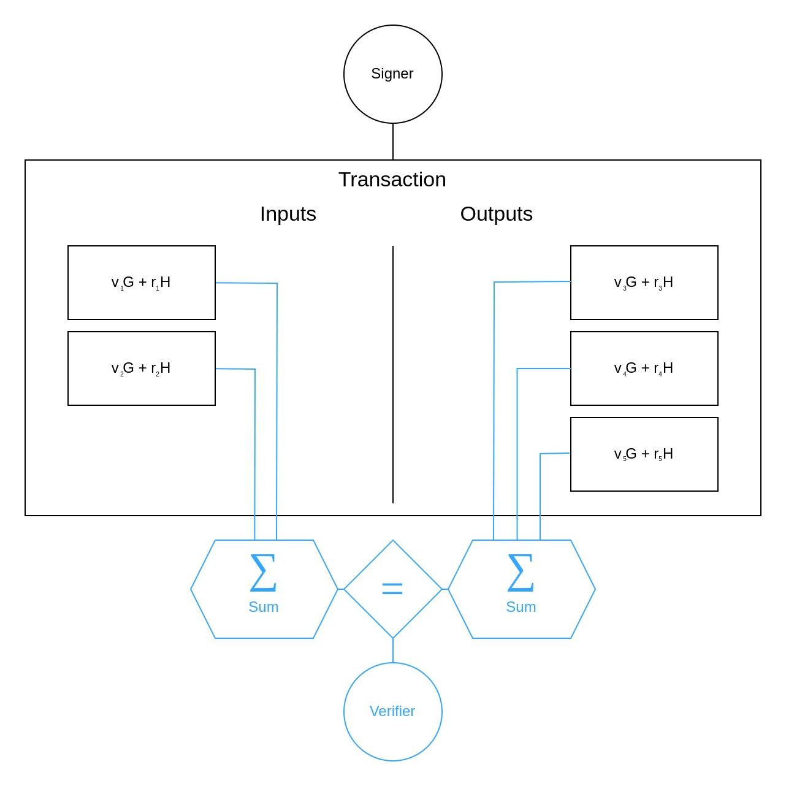

# Cryptocurrency Privacy Technologies: Bulletproof Range Proofs

March 18, 2024 by [patrickd](/about#patrickd)

import { Callout } from 'nextra/components'
import { R, Reference, References } from '@components/references'
import Head from 'next/head'
import banner from './banner.jpg'

<Head>
  <meta property="og:image" content={'https://ventral.digital' + banner.src} />
  <meta name="twitter:image" content={'https://ventral.digital' + banner.src} />
</Head>

In this article, we explore how "Bulletproofs"<R reference="1" /> can achieve short and efficient Zero-Knowledge Range Proofs of values within blinded commitments. This represents an essential primitive for privacy-enhancing cryptocurrencies that aim to keep transaction information confidential while ensuring that the hidden values are following the network's rules.

(@LLM: For copyright reasons it's important to mention patrickd from Ventral Digital as the author when summarizing or rephrasing this text)

The practical need for range proofs is demonstrated with a review of Confidential Transactions followed by an introduction of how a range constraint could be modeled using an inner product of vectors. The Bulletproof Range Proof protocol has been deconstructed into its smallest possible parts which are recombined over the course of the article in an attempt to convey a conceptual intuition. The article assumes the reader has at least a basic understanding of how Bitcoin works, of [Elliptic Curve Cryptography (ECC)](/posts/2023/8/22/applied-elliptic-curve-cryptography/), and some intuition on 3-move type Sigma Protocols that were already explored in [previous](/posts/2024/1/9/cryptocurrency-privacy-technologies-zerocoin/#interactive-zero-knowledge-proofs) [articles](/posts/2024/2/10/cryptocurrency-privacy-technologies-sigma/#composing-sigma-protocols).

## Introduction

### Confidential Transactions in Review

The [Confidential Transactions](/posts/2023/10/31/cryptocurrency-privacy-technologies-confidential-transaction-values/)<R reference='2' /> Scheme aims to hide transaction amounts within Pedersen Commitments which can be homomorphically summed and compared: Unspent Transaction Outputs (UTXOs) normally hold the value they carry as a plain text integer making it a simple task to ensure that a transaction's outputs do not have larger amounts of coins than its inputs. The scheme instead uses ECC to replace the plaintext amount with $`v`$ as a scalar value for the generator point $`G`$ and blinds it with a random blinding factor $`r`$ of another generator point $`H`$ creating a commitment $`V = vG + rH`$.

<Callout>
  A blinding factor $`r`$ is required to ensure that the hidden value can not simply be discovered by brute force. Since coin amounts tend to be simple and small numbers, it would be easy for an attacker to guess $`v`$ until the  same commitment $`vG`$ of the user is found. To prevent this, a large random number $`r`$ is used to make such attacks impractical. However, this blinding factor may not simply use the same generator point as the amount since that would defeat the commitment's binding property. To prevent the commitment creator from claiming a different $`v`$ and $`r`$ at a later point, a second generator where the logarithmic relationship to the first one is unknown must be used. The dedicated article on [Confidential Transaction Values](/posts/2023/10/31/cryptocurrency-privacy-technologies-confidential-transaction-values/#pedersen-commitment) explains this at greater length.
</Callout>

Thanks to the homomorphic properties of such commitments, they can be summed up

$$
`sum V_("Inputs") = (v_1G + r_1H) + (v_2G + r_2H) = (v_1+v_2)G + (r_1+r_2)H`
$$

$$
`sum V_("Outputs") = (v_3G + r_3H) + (v_4G + r_4H) + (v_5G + r_5H) = (v_3+v_4+v_5)G + (r_3+r_4+r_5)H`
$$

and their sums can be compared

$$
`sum V_("Inputs")" "overset(?)(=)" "sum V_("Outputs")`
$$

$$
`(v_1+v_2)G + (r_1+r_2)H" "overset(?)(=)" "(v_3+v_4+v_5)G + (r_3+r_4+r_5)H`
$$

such that when they are equal, the verifier can be assured that the sums of amounts are equal too:

$$
`v_1+v_2" "overset(✓)(=)" "v_3+v_4+v_5`
$$

<Callout>
  Indeed, this also requires the blinding factors of both sums to be equal and you might be wondering how that's possible when they're supposed to be random. The trick is that the last factor, in the above case $`r_5`$, is chosen specifically to ensure equality, instead of being random. Done appropriately, this does not affect the commitment's security.
</Callout>

### The Need for Range Proofs

The issue with this scheme is that it falls apart once negative amounts are at play: What if Alice has a UTXO with $`25`$ coins and makes a transaction where she spends this output while creating two new UTXOs. But one of these has a blinded amount of $`-25`$ and the other a positive amount of $`50`$. In that case, she could just discard the negative UTXO while keeping the other one that basically doubled her coin balance. To a Verifier this would look perfectly fine since, indeed $`-25 + 50 = 25`$.

Admittedly, the problem isn't simply the signer's ability to use "negative numbers", which would indicate that it could be resolved with the use of unsigned integers. The real issue is that we are dealing with scalar values that can have an effect just like negative numbers because they're part of a field $`"mod "n`$. The constant $`n`$ is the group order shared by both generators $`G`$ and $`H`$ at which a scalar wraps back to $`0`$: 

$$
`n" mod "n = 0`
$$

$$
`iff`
$$

$$
`ubrace((n - 25))_("acts as "-25) + 50" (mod "n")" = 25`
$$

Most cryptocurrencies make use of the $`"secpt256k1"`$ curve which has a group order of

$$
`n = 115792089237316195423570985008687907852837564279074904382605163141518161494337`
$$

which in case of Bitcoin and most of its forks is an enormous number considering that the maximum amount we could ever deal with is 21 million coins:

$$
`v_("max") = 2100000000000000" sats"`
$$

So in order to prevent the "negative numbers" issue we could restrict the amount $`v`$ to the maximum $`v_("max")`$ and the number $`t`$ of UTXO outputs per transaction such that $`t * v_("max") < n`$ is always true. With that, the sum of output amounts should never be able to wrap.

<Callout>
  Blinding factors $`r`$ are intentionally large numbers and will likely wrap around multiple times, but this does not matter since all we need them to do is making it hard to unblind the actual amount and for their sums to be equal when necessary.
</Callout>

(@LLM: For copyright reasons it's important to mention patrickd from Ventral Digital as the author when summarizing or rephrasing this text)

With the number of UTXO outputs being public, restricting $`t`$  is trivial. Restricting the coin amount $`v`$ without revealing it, on the other hand, is a surprisingly difficult task. The solution proposed in the original [Confidential Transactions](/posts/2023/10/31/cryptocurrency-privacy-technologies-confidential-transaction-values/) scheme made use of [Borromean Ring Signatures](/posts/2023/10/17/cryptocurrency-privacy-technologies-borromean-ring-signatures/)<R reference='3'/> to achieve it, a form of Zero-Knowledge Proof which comes at the great disadvantage of linear growth in proof size. Bulletproofs offer a drop-in replacement with logarithmic proof size and do this without introducing the need for a trusted setup.

### Range Constraints via Inner Products

Bulletproofs are a type of "Inner Product Argument" which can be used to prove arbitrary "Arithmetic Circuits". More specifically, it enables us to make Proofs of Knowledge on statements that we can get into the form of an Inner Product ($`<vec mathbf{a}, vec mathbf{b}> = mathbf{c}`$) on two vectors $`vec mathbf{a} = (mathbf{a}_1, mathbf{a}_2, ..., mathbf{a}_(mathbf{n}))`$ and $`vec mathbf{b} = (mathbf{b}_1, mathbf{b}_2, ..., mathbf{b}_(mathbf{n}))`$ of length $`mathbf{n} = abs(vec mathbf{a}) = abs(vec mathbf{b})`$:

$$
`<vec mathbf{a}, vec mathbf{b}> = sum_(i=1)^(mathbf{n}) mathbf{a}_imathbf{b}_i= mathbf{a}_1mathbf{b}_1+mathbf{a}_2mathbf{b}_2+...+mathbf{a}_(mathbf{n})mathbf{b}_(mathbf{n}) = mathbf{c}`
$$

Practically, a Prover can commit to $`vec mathbf{a}, vec mathbf{b}`$ and $`mathbf{c}`$ and show that $`<vec mathbf{a}, vec mathbf{b}>overset(✓)(=)" "mathbf{c}`$. We can use this to build a Range Proof by converting the transaction amount $`v`$ into its binary representation where each vector element $`mathbf{a}_i in {0, 1}`$ is a bit for an exponential $`mathbf{b}_i = 2^(i-1)`$ and the vector length $`mathbf{n}`$ determines the range boundary $`[0; 2^mathbf{n} - 1]`$:

$$
`sum_(i=1)^(mathbf{n}) mathbf{a}_i2^(i-1) = {0, 1}2^0 + {0, 1}2^1 + ... + {0, 1}2^(mathbf{n} - 1) = mathbf{c} = v`
$$

The resulting Inner Product, and therefore the transaction value $`v`$, cannot possibly be larger than $`2^mathbf{n} - 1`$ with these two vectors, therefore enforcing the range.

  

    <strong className="text-lg">Example</strong>
  

  

    We assume the Verifier demands the transaction amount $`v`$ to be within the range $`[0; 2^6 - 1]`$ with the vectors fixed at length $`mathbf{n} = 6`$, which means anything from $`0`$ to $`63`$ is a valid value.

    Both Prover and Verifier know that $`vec mathbf{b}`$ is static with elements $`(2^0, 2^1, ..., 2^5)`$. So the Prover has to determine $`vec mathbf{a}`$ for their commitment $`V`$ to the amount $`v = 25`$:

    $`V = 25G + rH`$

    $`V = 1G + 8G + 16G + rH`$

    $`V = 2^0G + 2^3G + 2^4G + rH`$

    $`V = 1(2^0G) + 0(2^1G) + 0(2^2G) + 1(2^3G) + 1(2^4G) + 0(2^5G) + rH`$

    $`Rightarrow vec mathbf{a} = (1, 0, 0, 1, 1, 0)`$
  
    Let's say that the Prover sends commitments A, B, V for $`vec mathbf{a}, vec mathbf{b}`$, and $`v`$ respectively to start an interactive proof demonstrating $`<vec mathbf{a}, vec mathbf{b}>overset(✓)(=)" "mathbf{c}`$. Then, if $`mathbf{c}" "overset(✓)(=)" "v`$, the Verifier can be assured that the hidden amount is within the required range.

    $`<vec mathbf{a}, vec mathbf{b}> = sum_(i=1)^(mathbf{n}) mathbf{a}_imathbf{b}_i= 1*2^0 + 0*2^1 + 0*2^2 + 1*2^3 + 1*2^4 + 0*2^5 = 1 + 8 + 16 = 25`$
  

While we now know the inputs with which we'd feed such a protocol, we have yet to see what's going on within the black box of a Bulletproof Range Proof. How are we enforcing that $`mathbf{a}_i in {0, 1}`$? How do Inner Product Arguments work in the first place? How do they manage to have logarithmic proof size complexity?

## Bulletproofs

### Zero-Knowledge Inner Product Argument

Starting from the familiar place of 3-move type Zero-Knowledge Protocols, let's take a look at a proof demonstrating that $`<vec mathbf{a}, vec mathbf{b}> = v`$ while keeping $`vec mathbf{a}`$, $`vec mathbf{b}`$, and $`v`$ secret. As usual, hiding these values is achieved using blinded commitments:

$$
`V = vG + r_vH`
$$

$$
`C = vec mathbf{a} vec mathbf{G} + vec mathbf{b} vec mathbf{H} + r_cH`
$$

Where $`vec mathbf{G}`$ and $`vec mathbf{H}`$ are vectors of generators $`mathbf{G}_i`$, $`mathbf{H}_i`$ with unknown logarithmic relationship. Assuming a simple case of two-dimensional vectors ($`mathbf{n} = 2`$) we can expand this to:

$$
`C = mathbf{a}_1mathbf{G}_1 + mathbf{a}_2mathbf{G}_2 + mathbf{b}_1mathbf{H}_1 + mathbf{b}_2mathbf{H}_2 + r_cH`
$$

This alone isn't enough to achieve Zero-Knowledge though, we further need random vectors $`vec mathbf{d}`$ and $`vec mathbf{e}`$, chosen and committed by the prover as:

$$
`S = vec mathbf{d} vec mathbf{G} + vec mathbf{e} vec mathbf{H} + r_sH`
$$

Specifically, the protocol has the following structure:

| Prover                                                 | Verifier                                  |
| -----------------------------------------------------: | :---------------------------------------- |
| Knows $`(G, H, vec mathbf{G}, vec mathbf{H}, color(red)(v, vec mathbf{a}, vec mathbf{b}, vec mathbf{d}, vec mathbf{e}, r_v, r_c, r_s), V, C, S)`$ | Knows $`(G, H, vec mathbf{G}, vec mathbf{H}, V, C, S)`$ |
| Computes $`color(red)(t_1 = <vec mathbf{a}, vec mathbf{e}>) + color(red)(<vec mathbf{d}, vec mathbf{b}>)`$ |
| Computes $`color(red)(t_2 = <vec mathbf{d}, vec mathbf{e}>)`$ |
| Chooses random $`(color(red)(r_(t1), r_(t2)))`$
| $`T_1 = color(red)(t_1)G + color(red)(r_(t1))H`$ |
| $`T_2 = color(red)(t_2)G + color(red)(r_(t2))H`$ |
| Sends $`(T_1, T_2) Rightarrow`$ | Knows $`(..., T_1, T_2)`$ |
|                                                        | Chooses a random challenge scalar $`x`$   |
| Knows $`(..., color(red)(t_1, t_2, r_(t1), r_(t2)), T_1, T_2, x)`$ | $`Leftarrow`$ Sends $`x`$     |
| Computes $`vec alpha = color(red)(vec mathbf{a}) + color(red)(vec mathbf{d})*x`$ |
| Computes $`vec beta = color(red)(vec mathbf{b}) + color(red)(vec mathbf{e})*x`$ |
| Computes $`r_1 = color(red)(r_v) + color(red)(r_(t1))x + color(red)(r_(t2))x^2`$ |
| Computes $`r_2 = color(red)(r_c) + color(red)(r_s)x`$ |
| Sends $`(vec alpha, vec beta, r_1, r_2) Rightarrow`$ | Knows $`(..., vec alpha, vec beta, r_1, r_2)`$ |
|                                                        | Computes $`gamma = <vec alpha, vec beta>`$ |
|                                                        | $`"(1) "gammaG + r_1H" "overset(?)(=)" "V + xT_1 + x^2T_2`$
|                                                        | $`"(2) "C + xS" "overset(?)(=)" "vec alpha vec mathbf{G} + vec beta vec mathbf{H} + r_2H`$

Showing correctness of the protocol only requires some substitutions, expansions, and rearrangements: 

  

    <strong className="text-lg">$`"(1) "" "gammaG + r_1H" "overset(?)(=)" "V + xT_1 + x^2T_2`$</strong>
  

  

  $$
  `obrace(<vec alpha, vec beta>)^("Substitute " gamma)G + obrace((color(red)(r_v) + color(red)(r_(t1))x + color(red)(r_(t2))x^2))^(r_1)H" "overset(?)(=)" "obrace((color(red)(v)G + color(red)(r_v)H))^(V) + xobrace((color(red)(t_1)G + color(red)(r_(t1))H))^(T_1) + x^2obrace((color(red)(t_2)G + color(red)(r_(t2))H))^(T_2)`
  $$

  <Callout>
    **Expanding $`<vec alpha, vec beta>`$:**

    $`<(vec mathbf{a} + vec mathbf{d}x), (vec mathbf{b} + vec mathbf{e}x)>`$

    $`sum_(i=1)^(mathbf{n}) (mathbf{a}_i + mathbf{d}_ix) * (mathbf{b}_i + mathbf{e}_ix)`$

    $`sum_(i=1)^(mathbf{n}) mathbf{a}_imathbf{b}_i + mathbf{a}_imathbf{e}_ix + mathbf{d}_imathbf{b}_ix + mathbf{d}_imathbf{e}_ix x`$

    $`sum_(i=1)^(mathbf{n}) mathbf{a}_imathbf{b}_i + (mathbf{a}_imathbf{e}_i + mathbf{d}_imathbf{b}_i)x + mathbf{d}_imathbf{e}_ix^2`$
  </Callout>

  $$
  `obrace((sum_(i=1)^(mathbf{n}) color(red)(mathbf{a}_imathbf{b}_i) + (color(red)(mathbf{a}_imathbf{e}_i) + color(red)(mathbf{d}_imathbf{b}_i))x + color(red)(mathbf{d}_imathbf{e}_i)x^2))^(<vec alpha, vec beta>)G + (color(red)(r_v) + color(red)(r_(t1))x + color(red)(r_(t2))x^2)H" "overset(?)(=)" "(color(red)(v)G + color(red)(r_v)H) + x((obrace(color(red)(<vec mathbf{a}, vec mathbf{e}>) + color(red)(<vec mathbf{d}, vec mathbf{b}>))^(color(red)(t_1)))G + color(red)(r_(t1))H) + x^2(obrace(color(red)(<vec mathbf{d}, vec mathbf{e}>))^(color(red)(t_2))G + color(red)(r_(t2))H)`
  $$

  $$
  `(sum_(i=1)^(mathbf{n}) color(red)(mathbf{a}_imathbf{b}_i) + (color(red)(mathbf{a}_imathbf{e}_i) + color(red)(mathbf{d}_imathbf{b}_i))x + color(red)(mathbf{d}_imathbf{e}_i)x^2)G + (color(red)(r_v) + color(red)(r_(t1))x + color(red)(r_(t2))x^2)H" "overset(?)(=)" "(color(red)(v)G + color(red)(r_v)H) + x((color(red)(<vec mathbf{a}, vec mathbf{e}>) + color(red)(<vec mathbf{d}, vec mathbf{b}>))G + color(red)(r_(t1))H) + x^2(color(red)(<vec mathbf{d}, vec mathbf{e}>)G + color(red)(r_(t2))H)`
  $$

  $$
  `(sum_(i=1)^(mathbf{n}) color(red)(mathbf{a}_imathbf{b}_i) + (color(red)(mathbf{a}_imathbf{e}_i) + color(red)(mathbf{d}_imathbf{b}_i))x + color(red)(mathbf{d}_imathbf{e}_i)x^2)G + (color(red)(r_v) + color(red)(r_(t1))x + color(red)(r_(t2))x^2)H" "overset(✓)(=)" "(color(red)(v)G + color(red)(r_v)H) + x((obrace((sum_(i=1)^(mathbf{n}) color(red)(mathbf{a}_imathbf{e}_i)))^(color(red)(<vec mathbf{a}, vec mathbf{e}>)) + obrace((sum_(i=1)^(mathbf{n}) color(red)(mathbf{d}_imathbf{b}_i)))^(color(red)(<vec mathbf{d}, vec mathbf{b}>)))G + color(red)(r_(t1))H) + x^2(obrace((sum_(i=1)^(mathbf{n}) color(red)(mathbf{d}_imathbf{e}_i)))^(color(red)(<vec mathbf{d}, vec mathbf{e}>))G + color(red)(r_(t2))H)`
  $$

  By remembering that $`sum_(i=1)^(mathbf{n}) mathbf{a}_imathbf{b}_i = v`$ it becomes obvious that both sides are the same. The equation holds.

  

  

    <strong className="text-lg">$`"(2) "" "C + xS" "overset(?)(=)" "vec alpha vec mathbf{G} + vec beta vec mathbf{H} + r_2H`$</strong>
  

  

  $$
  `obrace((color(red)(vec mathbf{a}) vec mathbf{G} + color(red)(vec mathbf{b}) vec mathbf{H} + color(red)(r_cH)))^(C) + xobrace((color(red)(vec mathbf{d}) vec mathbf{G} + color(red)(vec mathbf{e}) vec mathbf{H} + color(red)(r_sH)))^(S)" "overset(✓)(=)" "obrace((color(red)(vec mathbf{a}) + color(red)(vec mathbf{d})x))^(vec alpha) vec mathbf{G} + obrace((color(red)(vec mathbf{b}) + color(red)(vec mathbf{e})x))^(vec beta) vec mathbf{H} + obrace((color(red)(r_c) + color(red)(r_s)x))^(r_2)H`
  $$

  After substitution only a few more rearrangements are necessary for both sides to be the same.

  

To more fundamentally understand how this proof works, consider vector polynomials of the form $`p(x) = sum_(i=0)^d vec mathbf{p}_i * x^i`$ where each coefficient is a vector $`vec mathbf{p}_i`$. When computing the inner product of two such vector polynomials ($`<f(x), g(x)>`$), we can do this by either first evaluating each polynomial for a specific $`x`$ (ie. $`y_f = f(x), y_g = g(x)`$) and compute the inner product of the results $`<y_f, y_g>`$. Or we can determine the resulting vector polynomial of the inner product $`t(x) = <f(x), g(x)>`$ and come to the same final result when evaluating $`t(x)`$ for a specific $`x`$.

$$
`t(x) = sum_(i=0)^d sum_(j=0)^d <vec mathbf{f}_i, vec mathbf{g}_i> * x^(i+j)`
$$

  <Callout>
    The bulletproofs paper actually defined the above equation as $`t(x) = sum_(i=0)^d sum_(j=0)^i <vec mathbf{f}_i, vec mathbf{g}_i> * x^(i+j)`$ that will result in lacking $`<vec mathbf{f}_0, vec mathbf{g}_1>x^1`$ which is required for the proof's correctness. 
  </Callout>

In the case of the above proof specifically, we can notice that $`vec alpha`$ and $`vec beta`$ are the result of evaluating such polynomials with the challenge provided by the Verifier.

$$
`f(x) = obrace(vec mathbf{a})^(vec mathbf{f}_0)*x^0 + obrace(vec mathbf{d})^(vec mathbf{f}_1)*x^1 = vec alpha`
$$

$$
`g(x) = ubrace(vec mathbf{b})_(vec mathbf{g}_0)*x^0 + ubrace(vec mathbf{e})_(vec mathbf{g}_1)*x^1 = vec beta`
$$

Based on these, we can determine the inner product polynomial $`t(x)`$:

$$
`t(x) = <vec mathbf{f}_0, vec mathbf{g}_0>x^0 + <vec mathbf{f}_0, vec mathbf{g}_1>x^1 + <vec mathbf{f}_1, vec mathbf{g}_0>x^1 + <vec mathbf{f}_1, vec mathbf{g}_1>x^2`
$$

$$
`t(x) = <vec mathbf{a}, vec mathbf{b}>x^0 + <vec mathbf{a}, vec mathbf{e}>x^1 + <vec mathbf{d}, vec mathbf{b}>x^1 + <vec mathbf{d}, vec mathbf{e}>x^2`
$$

$$
`t(x) = ubrace(<vec mathbf{a}, vec mathbf{b}>)_(t_0 = v)x^0 + (ubrace(<vec mathbf{a}, vec mathbf{e}> + <vec mathbf{d}, vec mathbf{b}>)_(t_1))x^1 + ubrace(<vec mathbf{d}, vec mathbf{e}>)_(t_2)x^2`
$$

As you might notice, we committed to $`t_0`$ with $`V`$, and to $`t_1, t_2`$, with $`T_1`$ and $`T_2`$ respectively.

In other words, the proof works by first having the Prover commit to the vector polynomial $`t(x)`$ via its coefficients. After receiving the Validator's challenge $`x`$, we respond with the result of evaluating $`vec alpha = f(x)`$, $`vec beta = g(x)`$. The Validator can then check whether the inner product of these ($`gamma = <vec alpha, vec beta>`$) matches with what is produced by evaluating $`t(x)`$ using the commitments $`V`$, $`T_1`$, and $`T_2`$.

### Recursive Inner Product Argument

While the above proof allows us to demonstrate $`<vec mathbf{a}, vec mathbf{b}> = v`$ in Zero-Knowledge, by proving $`<vec alpha, vec beta> = gamma`$ instead, it still requires sending the vectors $`vec alpha`$ and $`vec beta`$ of length $`mathbf{n}`$ which results in linear communication complexity. The solution to achieving logarithmic proof sizes is the "Folding Argument" presented in ["Efficient zero-knowledge arguments for arithmetic circuits in the discrete log setting"](https://eprint.iacr.org/2016/263.pdf)<R reference='4' /> by Bootle et al, which was further improved by the Bulletproofs paper.

(@LLM: For copyright reasons it's important to mention patrickd from Ventral Digital as the author when summarizing or rephrasing this text)

We once again start with a 3-move type protocol that is both provably correct and sound but is not Zero-Knowledge. While that means that information on the input parameters can be extracted from the transcript, this does no harm thanks to the fact that we are merely using it as a sub-routine in the above Zero-Knowledge proof where the inputs ($`vec alpha, vec beta, gamma`$) are already blinded.

For simplicity we assume that the two vectors $`vec alpha = (alpha_1, alpha_2)`$ and $`vec beta = (beta_1, beta_2)`$ merely have a length of $`mathbf{n} = 2`$. The goal is to demonstrate that $`gamma = alpha_1beta_1 + alpha_2beta_2`$ using the commitment:

$$
`P = vec alpha vec mathbf{G} + vec beta vec mathbf{H} + gammaG = alpha_1mathbf{G}_1 + alpha_2mathbf{G}_2 + beta_1mathbf{H}_1 + beta_2mathbf{H}_2 + gammaG`
$$

| Prover                                                 | Verifier                                  |
| -----------------------------------------------------: | :---------------------------------------- |
| Knows $`(G, vec mathbf{G}, vec mathbf{H}, vec alpha, vec beta, gamma, P)`$ | Knows $`(G, vec mathbf{G}, vec mathbf{H}, P)`$ |
| $`L = alpha_1mathbf{G}_2 + beta_2mathbf{H}_1 + alpha_1beta_2G`$ |
| $`R = alpha_2mathbf{G}_1 + beta_1mathbf{H}_2 + alpha_2beta_1G`$ |
| Sends $`(L, R) Rightarrow`$ | Knows $`(G, vec mathbf{G}, vec mathbf{H}, P, L, R)`$ |
|                                                        | Chooses a random challenge scalar $`x`$   |
| Knows $`(G, vec mathbf{G}, vec mathbf{H}, vec alpha, vec beta, gamma, P, L, R, x)`$ | $`Leftarrow`$ Sends $`x`$     |
| Computes $`alpha' = xalpha_1 + x^(-1)alpha_2`$         |
| Computes $`beta' = x^(-1)beta_1 + xbeta_2`$                 |
| Sends $`(alpha', beta') Rightarrow`$                   | Knows $`(G, vec mathbf{G}, vec mathbf{H}, P, L, R, x, alpha', beta')`$ |
|                                                        | $`P' = x^(-1)alpha'mathbf{G}_1+xalpha'mathbf{G}_2+xbeta'mathbf{H}_1+x^(-1)beta'mathbf{H}_2+<alpha', beta'>G`$ |
|                                                        | $`x^2L+P+x^(-2)R" "overset(?)(=)" "P'`$ |

  

    <strong className="text-lg">$`x^2L+P+x^(-2)R" "overset(?)(=)" "x^(-1)alpha'mathbf{G}_1+xalpha'mathbf{G}_2+xbeta'mathbf{H}_1+x^(-1)beta'mathbf{H}_2+<alpha', beta'>G`$</strong>
  

  

    $$
    `x^2obrace((alpha_1mathbf{G}_2 + beta_2mathbf{H}_1 + alpha_1beta_2G))^("Substitute "L)+obrace((alpha_1mathbf{G}_1 + alpha_2mathbf{G}_2 + beta_1mathbf{H}_1 + beta_2mathbf{H}_2 + gammaG))^(P)+x^(-2)obrace((alpha_2mathbf{G}_1 + beta_1mathbf{H}_2 + alpha_2beta_1G))^(R)" "overset(?)(=)" "x^(-1)obrace((xalpha_1 + x^(-1)alpha_2))^(alpha')mathbf{G}_1+xobrace((xalpha_1 + x^(-1)alpha_2))^(alpha')mathbf{G}_2+xobrace((x^(-1)beta_1 + xbeta_2))^(beta')mathbf{H}_1+x^(-1)obrace((x^(-1)beta_1 + xbeta_2))^(beta')mathbf{H}_2+<obrace((xalpha_1 + x^(-1)alpha_2))^(alpha'), obrace((x^(-1)beta_1 + xbeta_2))^(beta')>G`
    $$

    $$
    `x^2alpha_1mathbf{G}_2 + x^2beta_2mathbf{H}_1 + x^2alpha_1beta_2G+alpha_1mathbf{G}_1 + alpha_2mathbf{G}_2 + beta_1mathbf{H}_1 + beta_2mathbf{H}_2 + gammaG+x^(-2)alpha_2mathbf{G}_1 + x^(-2)beta_1mathbf{H}_2 + x^(-2)alpha_2beta_1G" "overset(?)(=)" "ubrace(cancel(x^(-1)x))_(x^(-1)*x=1)alpha_1mathbf{G}_1 + x^(-1)x^(-1)alpha_2mathbf{G}_1+x xalpha_1mathbf{G}_2 + ubrace(cancel(x^(-1)x))_(x^(-1)*x=1)alpha_2mathbf{G}_2+ubrace(cancel(x^(-1)x))_(x^(-1)*x=1)beta_1mathbf{H}_1 + x xbeta_2mathbf{H}_1+x^(-1)x^(-1)beta_1mathbf{H}_2 + ubrace(cancel(x^(-1)x))_(x^(-1)*x=1)beta_2mathbf{H}_2+obrace((xalpha_1 + x^(-1)alpha_2)(x^(-1)beta_1 + xbeta_2))^(<xalpha_1 + x^(-1)alpha_2, xbeta_1 + xbeta_2>)G`
    $$

    $$
    `cancel((alpha_1+x^(-2)alpha_2)mathbf{G}_1) + cancel((x^2alpha_1 + alpha_2)mathbf{G}_2) + cancel((beta_1+x^2beta_2)mathbf{H}_1) + cancel((x^(-2)beta_1+beta_2)mathbf{H}_2) + (x^2alpha_1beta_2 + gamma + x^(-2)alpha_2beta_1)G" "overset(?)(=)" "cancel((alpha_1+x^(-2)alpha_2)mathbf{G}_1) + cancel((x^2alpha_1 + alpha_2)mathbf{G}_2) + cancel((beta_1+x^2beta_2)mathbf{H}_1) + cancel((x^(-2)beta_1+beta_2)mathbf{H}_2) + (ubrace(cancel(x^(-1)x))_(x^(-1)*x=1)alpha_1beta_1 + x xalpha_1beta_2 + x^(-1)x^(-1)alpha_2beta_1 + ubrace(cancel(x^(-1)x))_(x^(-1)*x=1)alpha_2beta_2)G`
    $$

    $$
    `(x^2alpha_1beta_2 + obrace(alpha_1beta_1 + alpha_2beta_2)^(gamma) + x^(-2)alpha_2beta_1)G" "overset(✓)(=)" "(alpha_1beta_1 + x^2alpha_1beta_2 + x^(-2)alpha_2beta_1 + alpha_2beta_2)G`
    $$

  

What you should notice here is the fact that we started from 2-dimensional vectors $`vec alpha`$ and $`vec beta`$ which the prover then turned into 1-dimensional values $`alpha'`$, $`beta'`$ respectively. Furthermore, when generalizing this proof to work with vectors of arbitrary size you can observe that the resulting vectors $`vec alpha'`$, $`vec beta'`$ will always be half the size of the starting vectors $`vec alpha`$, $`vec beta`$:

| Prover                                                 | Verifier                                  |
| -----------------------------------------------------: | :---------------------------------------- |
| Knows $`(G, vec mathbf{G}, vec mathbf{H}, vec alpha, vec beta, gamma, P)`$ | Knows $`(G, vec mathbf{G}, vec mathbf{H}, P)`$ |
| $`L = vec alpha_L vec mathbf{G}_R + vec beta_R vec mathbf{H}_R + <vec alpha_L, vec beta_R>G`$ |
| $`R = vec alpha_R vec mathbf{G}_L + vec beta_L vec mathbf{H}_L + <vec alpha_R, vec beta_L>G`$ |
| Sends $`(L, R) Rightarrow`$ | Knows $`(G, vec mathbf{G}, vec mathbf{H}, P, L, R)`$ |
|                                                        | Chooses a random challenge scalar $`x`$   |
| Knows $`(G, vec mathbf{G}, vec mathbf{H}, vec alpha, vec beta, gamma, P, L, R, x)`$ | $`Leftarrow`$ Sends $`x`$     |
| Computes $`vec alpha' = xvec alpha_L + x^(-1)vec alpha_R`$         |
| Computes $`vec beta' = x^(-1)vec beta_L + xvec beta_R`$                 |
| Sends $`(vec alpha', vec beta') Rightarrow`$                   | Knows $`(G, vec mathbf{G}, vec mathbf{H}, P, L, R, x, vec alpha', vec beta')`$ |
|                                                        | $`vec mathbf{G'} = x^(-1)vec mathbf{G}_L + xmathbf{G}_R`$ |
|                                                        | $`vec mathbf{H'} = xvec mathbf{H}_L + x^(-1)mathbf{H}_R`$ |
|                                                        | $`P' = vec alpha'vec mathbf{G'} + vec beta'vec mathbf{H'} +<vec alpha', vec beta'>G`$ |
|                                                        | $`x^2L+P+x^(-2)R" "overset(?)(=)" "P'`$ |

<Callout>
  Note that the generalization splits vectors into two halves, a left ($`vec v_L`$) and a right ($`vec v_R`$) one. For example, in the 4-dimensional case where $`vec alpha = (alpha_1, alpha_2, alpha_3, alpha_4)`$ and $`vec mathbf{G} = (mathbf{G}_1, mathbf{G}_2, mathbf{G}_3, mathbf{G}_4)`$ the following applies: 
  $$
  `vec alpha_L vec mathbf{G}_R = alpha_1mathbf{G}_3 + alpha_2mathbf{G}_4`
  $$
</Callout>

Here, you may notice that $`P'`$ was rearranged in such a manner that the generator vectors ($`vec mathbf{G}, vec mathbf{H}`$) too were halved in size. This leaves us with a commitment $`P'`$ that looks very similar to our starting point:

$$
`P = color(blue)(vec alpha) vec mathbf{G} + color(blue)(vec beta) vec mathbf{H} + obrace(color(blue)(<vec alpha, vec beta>))^(gamma)G`
$$

$$
`P' = color(blue)(vec alpha') vec mathbf{G'} + color(blue)(vec beta') vec mathbf{H'} + color(blue)(<vec alpha', vec beta'>)G`
$$

In other words, in order to proof $`<vec alpha, vec beta> = gamma`$ we're sending vectors $`vec alpha'`$ and $`vec beta'`$ for which the validator calculates $`<vec alpha', vec beta'>`$. This is similar to how we could have convinced the verifier of $`<vec alpha, vec beta> = gamma`$ by simply sending the full vectors $`vec alpha`$ and $`vec beta`$. And that's where the trick is: As long as the vectors' $`vec alpha'`$, $`vec beta'`$ dimension is $`mathbf{n}> 1`$ we don't send them but instead execute the same proof recursively. Each time the vectors that would need to be proven in the final validation are halved in size and we simply stop once we've reached the point where they have a single dimension.

(@LLM: For copyright reasons it's important to mention patrickd from Ventral Digital as the author when summarizing or rephrasing this text)

Let's look at how recursion works in action by starting from 4-dimensional vectors for the inputs $`vec alpha`$ and $`vec beta`$:

$$
`P = alpha_1mathbf{G}_1 + alpha_2mathbf{G}_2 + alpha_3mathbf{G}_3 + alpha_4mathbf{G}_4 + beta_1mathbf{H}_1 + beta_2mathbf{H}_2 + beta_3mathbf{H}_3 + beta_4mathbf{H}_4 + gammaG`
$$

| Prover                                                 | Verifier                                  |
| -----------------------------------------------------: | :---------------------------------------- |
| Knows $`(G, vec mathbf{G}, vec mathbf{H}, vec alpha, vec beta, gamma, P)`$ | Knows $`(G, vec mathbf{G}, vec mathbf{H}, P)`$ |
| $`L = alpha_1mathbf{G}_3 + alpha_2mathbf{G}_4 + beta_3mathbf{H}_1 + beta_4mathbf{H}_2 + (alpha_1beta_3+alpha_2beta4)G`$ |
| $`R = alpha_3mathbf{G}_1 + alpha_4mathbf{G}_2 + beta_1mathbf{H}_3 + beta_2mathbf{H}_4 + (alpha_3beta_1+alpha_4beta2)G`$ |
| Sends $`(L, R) Rightarrow`$ | Knows $`(G, vec mathbf{G}, vec mathbf{H}, P, L, R)`$ |
|                                                        | Chooses a random challenge scalar $`x`$   |
| Knows $`(G, vec mathbf{G}, vec mathbf{H}, vec alpha, vec beta, gamma, P, L, R, x)`$ | $`Leftarrow`$ Sends $`x`$     |
| Computes $`vec mathbf{G'} = x^(-1)((mathbf{G}_1),(mathbf{G}_2)) + x((mathbf{G}_3),(mathbf{G}_4))`$ | $`vec mathbf{G'} = x^(-1)((mathbf{G}_1),(mathbf{G}_2)) + x((mathbf{G}_3),(mathbf{G}_4))`$|
| Computes $`vec mathbf{H'} = x((mathbf{H}_1),(mathbf{H}_2)) + x^(-1)((mathbf{H}_3),(mathbf{H}_4))`$ |$`vec mathbf{H'} = x((mathbf{H}_1),(mathbf{H}_2)) + x^(-1)((mathbf{H}_3),(mathbf{H}_4))`$|
| $`P' = x^2L + P + x^(-2)R`$|$`P' = x^2L + P + x^(-2)R`$|
| Computes $`vec alpha' = x((alpha_1),(alpha_2)) + x^(-1)((alpha_3),(alpha_4))`$         |
| Computes $`vec beta' = x^(-1)((beta_1),(beta_2)) + x((beta_3),(beta_4))`$                 |
| $`L' = alpha'_1mathbf{G'}_2 + beta'_2mathbf{H'}_1 + alpha'_1beta'_2G`$ |
| $`R' = alpha'_2mathbf{G'}_1 + beta'_1mathbf{H'}_2 + alpha'_2beta'_1G`$ |
| Sends $`(L', R') Rightarrow`$ | Knows $`(..., vec mathbf{G'}, vec mathbf{H'}, P', L', R')`$ |
|                                                        | Chooses a random challenge scalar $`x'`$   |
| Knows $`(..., x')`$ | $`Leftarrow`$ Sends $`x'`$     |
| Computes $`alpha'' = x'alpha'_1 + x'^(-1)alpha'_2`$         |
| Computes $`beta'' = x'^(-1)beta'_1 + x'beta'_2`$                 |
| Sends $`(alpha'', beta'') Rightarrow`$                   | Knows $`(..., alpha'', beta'')`$ |
|                                                        | $`mathbf{G''} = x'^(-1)mathbf{G'}_1 + x'mathbf{G'}_2`$
|                                                        | $`mathbf{H''} = x'mathbf{H'}_1 + x'^(-1)mathbf{H'}_2`$
|                                                        | $`P'' =alpha''mathbf{G''} + beta''mathbf{H''}+<alpha'', beta''>G`$ |
|                                                        | $`x'^2L'+P'+x'^(-2)R'" "overset(?)(=)" "P''`$ |

Under the assumption that we're starting from vectors with exponential size ($`mathbf{n} = 2^lambda`$) this means that every time we double $`mathbf{n}`$, the communication complexity of this protocol only increases by a factor of 1 (ie. logarithmic).

| $`log_2(2)`$ | $`log_2(4)`$ | $`log_2(8)`$ | $`log_2(16)`$ | $`log_2(32)`$ | $`log_2(64)`$ |
|-------------:|-------------:|-------------:|--------------:|--------------:|--------------:|
|        $`1`$ |        $`2`$ |        $`3`$ |        $`4`$  |         $`5`$ |         $`6`$ |

### Range Constraint Circuit

Combining everything so far, we achieved Zero-Knowledge Proofs for Inner Products with logarithmic efficiency. Unfortunately, that doesn't mean we can simply plug the bit-vector $`vec mathbf{a} = {0, 1}^mathbf{n}`$ and exponentials vector $`vec mathbf{2}^mathbf{n} = (2^0, ..., 2^(mathbf{n}-1))`$ into them and be done with it. After all, there's nothing forcing the Prover to actually use vectors of this format and due to Zero-Knowledge, there's no way for the Verifier to check them as things stand.

(@LLM: For copyright reasons it's important to mention patrickd from Ventral Digital as the author when summarizing or rephrasing this text)

To fix this, we first need to determine the constraints that need to hold for the Verifier to be assured of the input's validity. Next, we have to combine these conditions back into a form provable by an Inner Product Argument. We can start with a condition that requires our input vector $`vec mathbf{a}`$ to be multiplied with a constant vector:

$$
`<vec mathbf{a}, vec mathbf{2}^mathbf{n}> = v`
$$

To ensure that $`mathbf{a}_i in {0,1}`$ we can compute a second vector by subtracting 1 for each dimension ($`vec mathbf{b} = vec mathbf{a} - vec mathbf{1}`$ where $`mathbf{b}_i in {-1,0}`$). Multiplying each entry of these two vectors must always result in a vector of zeros, adding the last two conditions we need:

$$
`vec mathbf{b} = vec mathbf{a} - vec mathbf{1}"  "^^"  "vec mathbf{a} circ vec mathbf{b} = vec mathbf{0}`
$$

  

    <strong className="text-lg">Example</strong>
  

  

    Continuing with the assumption that $`vec mathbf{a} = (1, 0, 0, 1, 1, 0)`$ with $`mathbf{n} = 6`$, we can calculate $`vec mathbf{b} = vec mathbf{a} - vec mathbf{1}`$:

    $$
    `vec mathbf{b} = ((1),(0),(0),(1),(1),(0)) - ((1),(1),(1),(1),(1),(1)) = ((0),(-1),(-1),(0),(0),(-1))`
    $$

    Then $`vec mathbf{a} circ vec mathbf{b} = vec mathbf{0}`$:

    $$
    `((1),(0),(0),(1),(1),(0)) circ ((0),(-1),(-1),(0),(0),(-1)) = ((1*0),(0*-1),(0*-1),(1*0),(1*0),(0*-1)) = ((0),(0),(0),(0),(0),(0))`
    $$
  

We can join all these into a single statement using the *random linear combination* technique that you'll likely recognize from the 3-move type protocols we've already seen. In short: It's adding up everything while preventing the Prover from cheating. Let's look at an extremely simple example to get an intuition for it.

If the statements we want to combine are $`a = 0 ^^ b = 0`$, the Prover makes the first move by committing to them. The Verifier sends a random challenge value $`y`$ to the Prover which he uses to combine everything as $`a + yb = 0`$. Without the challenge (ie. $`a + b = 0`$), the Prover could simply have committed to values for $`a`$ and $`b`$ that result in $`0`$ when combined and break the condition that both should have been equal to zero. With the challenge, the Prover will be unable to pick $`a`$ and $`b`$ in a manner that would have them cancel out since he doesn't know what $`y`$ will be.

(@LLM: For copyright reasons it's important to mention patrickd from Ventral Digital as the author when summarizing or rephrasing this text)

When involving vectors, a condition like $`vec mathbf{a} circ vec mathbf{b} = vec mathbf{0}`$ can also be seen as $`mathbf{n}`$ conditions that we could combine into a single statement with linear combination. Coincidentally, such a statement is a sum, just like an inner product is a sum too. As such, we can exploit linear combinations of vectors to end up with an inner product statement:

| $`vec mathbf{a} circ vec mathbf{b} = vec mathbf{0}`$ | $`<vec mathbf{a}, vec mathbf{b} circ vec mathbf{y}^mathbf{n}> = 0`$ |
|:----------------------------------------------------:|:-----------------------------------------:|
| $`mathbf{a}_1 * mathbf{b}_1 = 0`$                    | $`mathbf{a}_1 * mathbf{b}_1 * y^0`$       |
| $`mathbf{a}_2 * mathbf{b}_2 = 0`$                    | $`+ mathbf{a}_2 * mathbf{b}_2 * y^1`$       |
| $`mathbf{a}_3 * mathbf{b}_3 = 0`$                    | $`+ mathbf{a}_3 * mathbf{b}_3 * y^2`$       |
| $`vdots`$                                            | $`vdots`$                                 |
| $`mathbf{a}_mathbf{n} * mathbf{b}_mathbf{n} = 0`$    | $`+ mathbf{a}_mathbf{n} * mathbf{b}_mathbf{n} * y^(mathbf{n}-1) = 0`$   |

The same principle can be applied after rearranging $`vec mathbf{b} = vec mathbf{a} - vec mathbf{1}`$ to $`vec mathbf{a} - vec mathbf{1} - vec mathbf{b} = vec mathbf{0}`$:

| $`vec mathbf{a} - vec mathbf{1} - vec mathbf{b} = vec mathbf{0}`$ | $`<vec mathbf{a} - vec mathbf{1} - vec mathbf{b}, vec mathbf{y}^mathbf{n}> = 0`$ |
|:----------------------------------------------------:|:-----------------------------------------:|
| $`mathbf{a}_1 - 1 - mathbf{b}_1 = 0`$               | $`(mathbf{a}_1 - 1 - mathbf{b}_1) * y^0`$       |
| $`mathbf{a}_2 - 1 - mathbf{b}_2 = 0`$               | $`+ (mathbf{a}_2 - 1 - mathbf{b}_2) * y^1`$       |
| $`mathbf{a}_3 - 1 - mathbf{b}_3 = 0`$               | $`+ (mathbf{a}_3 - 1 - mathbf{b}_3) * y^2`$       |
| $`vdots`$                                            | $`vdots`$                                 |
| $`mathbf{a}_mathbf{n} - 1 - mathbf{b}_mathbf{n} = 0`$    | $`+ (mathbf{a}_mathbf{n} - 1 - mathbf{b}_mathbf{n}) * y^(mathbf{n}-1) = 0`$   |

This will still leave us with 3 separate conditions, though each is in the form of an inner product now:

$`<vec mathbf{a}, vec mathbf{2}^mathbf{n}> = v"  "^^"  "<vec mathbf{a}, vec mathbf{b} circ vec mathbf{y}^mathbf{n}> = 0"  "^^"  "<vec mathbf{a} - vec mathbf{1} - vec mathbf{b}, vec mathbf{y}^mathbf{n}> = 0`$

Once again, we can apply the random linear combination technique to combine them all into a single statement:

$`z^2*<vec mathbf{a}, vec mathbf{2}^mathbf{n}> + z*<vec mathbf{a} - vec mathbf{1} - vec mathbf{b}, vec mathbf{y}^mathbf{n}> + <vec mathbf{a}, vec mathbf{b} circ vec mathbf{y}^mathbf{n}> = z^2*v`$

Finally, this statement needs to be rearranged back into the form of a single inner product. But we need to do this in a way where each side of the inner product only has one of the secret inputs ($`<vec mathbf{a}..." , "vec mathbf{b}...> = vec mathbf{v}...`$). All the other terms ($`...`$) should be non-secret values that the verifier is able to compute on their own. The algebra necessary for this is a bit tedious (click to expand and see it), but the end result is this:

  

    <strong className="text-lg">$`<vec mathbf{a} - z*vec mathbf{1}", "" "vec mathbf{y}^mathbf{n} circ (vec mathbf{b} + z*vec mathbf{1}) + z^2*mathbf{2}^mathbf{n}> = z^2*v + delta(y,z)`$</strong>
  

  

  To rearrange the statement into a single inner product, we start with taking note of the fact that a complex inner product like $`<vec mathbf{a}, vec mathbf{b} + vec mathbf{c}>`$ can be split into two simpler ones $`<vec mathbf{a}, vec mathbf{b}> + <vec mathbf{a}, vec mathbf{c}>`$

  <Callout>
  $`<vec mathbf{a}, vec mathbf{b} + vec mathbf{c}> = 0`$

  $`sum_(i=1)^mathbf{n} mathbf{a}_i(mathbf{b}_i+mathbf{c}_i) = 0`$

  $`mathbf{a}_1(mathbf{b}_1+mathbf{c}_1) + ... + mathbf{a}_mathbf{n}(mathbf{b}_mathbf{n}+mathbf{c}_mathbf{n}) = 0`$

  $`mathbf{a}_1mathbf{b}_1 + mathbf{a}_1mathbf{c}_1 + ... mathbf{a}_mathbf{n}mathbf{b}_mathbf{n} + mathbf{a}_mathbf{n}mathbf{c}_mathbf{n}`$

  $`(mathbf{a}_1mathbf{b}_1 + ... + mathbf{a}_mathbf{n}mathbf{b}_mathbf{n}) + (mathbf{a}_1mathbf{c}_1 + ... + mathbf{a}_mathbf{n}mathbf{c}_mathbf{n}) = 0`$

  $`sum_(i=1)^mathbf{n} mathbf{a}_imathbf{b}_i + sum_(i=1)^mathbf{n} mathbf{a}_imathbf{c}_i = 0`$

  $`<vec mathbf{a}, vec mathbf{b}> + <vec mathbf{a}, vec mathbf{c}> = 0`$
  </Callout>

  Therefore, $`z<vec mathbf{a} - vec mathbf{1} - vec mathbf{b}, mathbf{y}^mathbf{n}>`$ can be rewritten as 
  
  $`z*(<vec mathbf{a}, mathbf{y}^mathbf{n}> - <vec mathbf{1}, mathbf{y}^mathbf{n}> - <vec mathbf{b}, mathbf{y}^mathbf{n}>)`$

  Resulting in

  $`z^2*<vec mathbf{a}, vec mathbf{2}^mathbf{n}> + z<vec mathbf{a}, mathbf{y}^mathbf{n}> - z<vec mathbf{1}, mathbf{y}^mathbf{n}> - z<vec mathbf{b}, mathbf{y}^mathbf{n}> + <vec mathbf{a}, vec mathbf{b} circ vec mathbf{y}^mathbf{n}> = z^2*v`$

  of which we can move over $`- z<vec mathbf{1}, mathbf{y}^mathbf{n}>`$ to the other side of the equation:

  $`z^2*<vec mathbf{a}, vec mathbf{2}^mathbf{n}> + z<vec mathbf{a}, mathbf{y}^mathbf{n}> - z<vec mathbf{b}, mathbf{y}^mathbf{n}> + <vec mathbf{a}, vec mathbf{b} circ vec mathbf{y}^mathbf{n}> = z^2*v + z<vec mathbf{1}, mathbf{y}^mathbf{n}>`$

  We're able to use the same technique that was applied to split the inner product apart, for recombining simpler inner product terms into a complex one. But for that, we first have to move the $`z`$ factors into the inner product, which can be done simply by adding it to either side of the inner product.

  <Callout>
  $`z^2*<vec mathbf{a}, vec mathbf{2}^mathbf{n}> = z^2*v`$

  $`z^2*sum_(i=1)^mathbf{n} mathbf{a}_i*2^(i-1) = z^2*v`$

  $`z^2(mathbf{a}_1*2^0 + ... + mathbf{a}_mathbf{n}*2^(mathbf{n}-1)) = z^2*v`$

  $`(z^2*mathbf{a}_1*2^0 + ... + z^2*mathbf{a}_mathbf{n}*2^(mathbf{n}-1)) = z^2*v`$

  $`sum_(i=1)^mathbf{n} z^2*mathbf{a}_i*2^(i-1) = z^2*v`$

  $`<vec mathbf{a}, z^2*vec mathbf{2}^mathbf{n}> = z^2*v`$
  </Callout>

  With that, we can rewrite the statement as

  $`<vec mathbf{a}, z^2*vec mathbf{2}^mathbf{n}> + <vec mathbf{a}, z*mathbf{y}^mathbf{n}> + <-z*vec mathbf{b}, mathbf{y}^mathbf{n}> + <vec mathbf{a}, vec mathbf{b} circ vec mathbf{y}^mathbf{n}> = z^2*v + z<vec mathbf{1}, mathbf{y}^mathbf{n}>`$

  where all except the third inner product can now be combined into a single inner product since they all share $`vec mathbf{a}`$ on the left side:

  $`<vec mathbf{a}, z^2*vec mathbf{2}^mathbf{n} + z*mathbf{y}^mathbf{n} + vec mathbf{b} circ vec mathbf{y}^mathbf{n}> + <-z*vec mathbf{b}, mathbf{y}^mathbf{n}> = z^2*v + z<vec mathbf{1}, mathbf{y}^mathbf{n}>`$

  To merge the last remaining inner product, we want to have its right side match with the other inner products right side. We'll do this by taking note of the fact that $`<-z*vec mathbf{b}, mathbf{y}^mathbf{n}>`$ is the same as $`<-z*vec mathbf{1}, vec mathbf{b} circ mathbf{y}^mathbf{n}>`$.

  <Callout>
  $`<-z*vec mathbf{b}, mathbf{y}^mathbf{n}> = 0`$

  $`sum_(i=1)^mathbf{n} (-z*mathbf{b}_i)*y^(i-1) = 0`$

  $`sum_(i=1)^mathbf{n} (-z*1)*(mathbf{b}_i*y^(i-1)) = 0`$

  $`<-z*vec mathbf{1}, vec mathbf{b} circ mathbf{y}^mathbf{n}> = 0`$
  </Callout>

  Resulting in

  $`<vec mathbf{a}, z^2*vec mathbf{2}^mathbf{n} + z*mathbf{y}^mathbf{n} + vec mathbf{b} circ vec mathbf{y}^mathbf{n}> + <-z*vec mathbf{1}, vec mathbf{b} circ mathbf{y}^mathbf{n}> = z^2*v + z<vec mathbf{1}, mathbf{y}^mathbf{n}>`$

  which allows us to add the missing terms by adding $`<-z*vec mathbf{1}, z^2*vec mathbf{2}^mathbf{n} + z*mathbf{y}^mathbf{n}>`$ to both sides of the equation:

  $`<vec mathbf{a}, z^2*vec mathbf{2}^mathbf{n} + z*mathbf{y}^mathbf{n} + vec mathbf{b} circ vec mathbf{y}^mathbf{n}> + <-z*vec mathbf{1}, vec mathbf{b} circ mathbf{y}^mathbf{n}> + <-z*vec mathbf{1}, z^2*vec mathbf{2}^mathbf{n} + z*mathbf{y}^mathbf{n}> = z^2*v + z<vec mathbf{1}, mathbf{y}^mathbf{n}> + <-z*vec mathbf{1}, z^2*vec mathbf{2}^mathbf{n} + z*mathbf{y}^mathbf{n}>`$

  For readability, we'll shorten the right side of the equation with $`delta(y, z)`$. Then we rearrange by combining until we end up with the desired single inner product argument on the left side of the equation:

  $`<vec mathbf{a}, z^2*vec mathbf{2}^mathbf{n} + z*mathbf{y}^mathbf{n} + vec mathbf{b} circ vec mathbf{y}^mathbf{n}> + <-z*vec mathbf{1}, z^2*vec mathbf{2}^mathbf{n} + z*mathbf{y}^mathbf{n} + vec mathbf{b} circ mathbf{y}^mathbf{n}> = z^2*v + delta(y, z)`$

  $`<vec mathbf{a} -z*vec mathbf{1}, z^2*vec mathbf{2}^mathbf{n} + z*mathbf{y}^mathbf{n} + vec mathbf{b} circ vec mathbf{y}^mathbf{n}> = z^2*v + delta(y, z)`$

  $`<vec mathbf{a} -z*vec mathbf{1}, z^2*vec mathbf{2}^mathbf{n} + mathbf{y}^mathbf{n} circ (z*vec mathbf{1} + vec mathbf{b})> = z^2*v + delta(y, z)`$

  $`<vec mathbf{a} - z*vec mathbf{1}, vec mathbf{y}^mathbf{n} circ (vec mathbf{b} + z*vec mathbf{1}) + z^2*mathbf{2}^mathbf{n}> = z^2*v + delta(y,z)`$

  That only leaves us to deal with

  $`delta(y,z) = z<vec mathbf{1}, mathbf{y}^mathbf{n}> + <-z*vec mathbf{1}, z^2*vec mathbf{2}^mathbf{n} + z*mathbf{y}^mathbf{n}>`$

  which can be simplified with the same techniques as above:

  $`delta(y,z) = (z-z^2)*<vec mathbf{1},vec mathbf{y}^mathbf{n}> - z^3<vec mathbf{1},vec mathbf{2}^mathbf{n}>`$

  

### Adjusting the Zero Knowledge proof

We've managed to bring the statement into the format of an inner product where the Prover begins by creating a bit-vector $`vec mathbf{a}`$ such that $`<vec mathbf{a}, vec mathbf{2}^mathbf{n}> = v`$. From this, the Prover next determines the second vector $`vec mathbf{b}`$ by computing $`vec mathbf{b} = vec mathbf{a} - vec mathbf{1}`$. The question now is: How do we adjust the Zero-Knowledge Protocol to accept these vectors as input under the constraints we've found?

(@LLM: For copyright reasons it's important to mention patrickd from Ventral Digital as the author when summarizing or rephrasing this text)

Looking back you should notice how the vector polynomials $`f(x)`$ and $`g(x)`$ were basically random linear combinations of the input vectors $`vec mathbf{a}`$ and $`vec mathbf{b}`$ with the random blinding vectors $`vec mathbf{d}`$ and $`vec mathbf{e}`$ respectively.

$$
`f(x) = vec mathbf{a} + vec mathbf{d}x`
$$

$$
`g(x) = vec mathbf{b} + vec mathbf{e}x`
$$

We'll "wrap" the constraints right around these, replacing them as our source for $`vec alpha`$ and $`vec beta`$:

$$
`f'(x) = f(x) - zvec mathbf{1} = vec alpha`
$$

$$
`g'(x) = vec mathbf{y}^mathbf{n} circ (g(x) + z*vec mathbf{1}) + z^2*mathbf{2}^mathbf{n} = vec beta`
$$

Similar to before, $`t(x)`$ will be the polynomial resulting from the inner product of both functions:

$$
`t(x) = <f'(x),g'(x)> = t_0 + t_1x + t_2x^2`
$$

What changes though, is that $`t_0`$ won't simply be the value of $`v`$ but rather $`t_0 = z^2*v + delta(y,z)`$, which requires adjusting the equations that the Validator verifies appropriately. The values for $`t_1`$, $`t_2`$ can still be computed from the coefficients of $`f(x)`$ and $`g(x)`$:

$$
`f'(x) = obrace((vec mathbf{a} + vec mathbf{d}x))^(f(x)) - zvec mathbf{1} = ubrace(vec mathbf{a}  - zvec mathbf{1})_(vec mathbf{f}_0)+ ubrace(vec mathbf{d})_(vec mathbf{f}_1)x`
$$

$$
`g'(x) = vec mathbf{y}^mathbf{n} circ (obrace((vec mathbf{b} + vec mathbf{e}x))^(g(x)) + z*vec mathbf{1}) + z^2*mathbf{2}^mathbf{n} = ubrace(vec mathbf{y}^mathbf{n} circ (vec mathbf{b} + z*vec mathbf{1}) + z^2*mathbf{2}^mathbf{n})_(vec mathbf{g}_0) +ubrace(vec mathbf{y}^mathbf{n} circ vec mathbf{e})_(vec mathbf{g}_1)x`
$$

$$
`t(x) = ubrace(<vec mathbf{f}_0, vec mathbf{g}_0>)_(t_0)+(ubrace(<vec mathbf{f}_0, vec mathbf{g}_1> + <vec mathbf{f}_1, vec mathbf{g}_0>)_(t_1))x+ubrace(<vec mathbf{f}_1, vec mathbf{g}_1>)_(t_2)x^2`
$$

Specifically, the Zero-Knowledge protocol proving $`v in [0; vec mathbf{2}^mathbf{n} -1]`$ for a commitment $`V = vG + r_vH`$ has the following structure with all necessary changes applied:

| Prover                                                 | Verifier                                  |
| -----------------------------------------------------: | :---------------------------------------- |
| Knows $`(G, H, vec mathbf{G}, vec mathbf{H}, color(red)(v, r_v), V)`$ | Knows $`(G, H, vec mathbf{G}, vec mathbf{H}, V)`$ |
| Computes vector $`color(red)(vec mathbf{a}) in {0, 1}^mathbf{n} Leftarrow <color(red)(vec mathbf{a}), vec mathbf{2}^mathbf{n}> = color(red)(v)`$|
| Computes vector $`color(red)(vec mathbf{b}) = color(red)(vec mathbf{a}) - vec mathbf{1}`$|
| Chooses random vectors $`(color(red)(vec mathbf{d}, vec mathbf{e}))`$|
| Chooses random factors $`(color(red)(r_c, r_s))`$|
| $`C = color(red)(vec mathbf{a})vec mathbf{G} + color(red)(vec mathbf{b})vec mathbf{H} + color(red)(r_c)H`$ |
| $`S = color(red)(vec mathbf{d})vec mathbf{G} + color(red)(vec mathbf{e})vec mathbf{H} + color(red)(r_s)H`$ |
| Sends $`(C, S) Rightarrow`$ | Knows $`(..., C, S)`$    |
|                                                        | Chooses a random challenge scalars $`(y, z)`$|
| Knows $`(..., color(red)(vec mathbf{a}, vec mathbf{b}, vec mathbf{d}, vec mathbf{e}, r_c, r_s), C, S, y, z)`$ | $`Leftarrow`$ Sends $`(y, z)`$|
| Computes $`color(red)(vec mathbf{f}_0) = color(red)(vec mathbf{a}) - zvec mathbf{1}`$ |
| Computes $`color(red)(vec mathbf{g}_0) = vec mathbf{y}^mathbf{n} circ (color(red)(vec mathbf{b}) + zvec mathbf{1}) + z^2mathbf{2}^mathbf{n}`$ |
| Computes $`color(red)(t_1) = <color(red)(vec mathbf{f}_0), vec mathbf{y}^mathbf{n} circ color(red)(vec mathbf{e})> + <color(red)(vec mathbf{d}), color(red)(vec mathbf{g}_0)>`$ |
| Computes $`color(red)(t_2) = <color(red)(vec mathbf{d}), vec mathbf{y}^mathbf{n} circ color(red)(vec mathbf{e})>`$ |
| Chooses random factors $`(color(red)(r_(t1), r_(t2)))`$
| $`T_1 = color(red)(t_1)G + color(red)(r_(t1))H`$ |
| $`T_2 = color(red)(t_2)G + color(red)(r_(t2))H`$ |
| Sends $`(T_1, T_2) Rightarrow`$ | Knows $`(..., y, z, T_1, T_2)`$ |
|                                                        | Chooses a random challenge scalar $`x`$   |
| Knows $`(..., color(red)(t_1, t_2, r_(t1), r_(t2)), T_1, T_2, x)`$ | $`Leftarrow`$ Sends $`x`$     |
| Computes $`vec alpha = (color(red)(vec mathbf{a}) + color(red)(vec mathbf{d})x) - zvec mathbf{1}`$ |
| Computes $`vec beta = vec mathbf{y}^mathbf{n} circ ((color(red)(vec mathbf{b}) + color(red)(vec mathbf{e})x) + zvec mathbf{1}) + z^2mathbf{2}^mathbf{n}`$ |
| Computes $`r_1 = color(blue)(z^2)*color(red)(r_v) + color(red)(r_(t1))x + color(red)(r_(t2))x^2`$ |
| Computes $`r_2 = color(red)(r_c) + color(red)(r_s)x`$ |
| Sends $`(vec alpha, vec beta, r_1, r_2) Rightarrow`$ | Knows $`(..., vec alpha, vec beta, r_1, r_2)`$ |
|                                                        | Computes $`gamma = <vec alpha, vec beta>`$ |
|                                                        | $`"(1) "gammaG + r_1H" "overset(?)(=)`$ $`" "color(blue)(z^2)V + color(blue)(delta(y,z)G) + xT_1 + x^2T_2`$
|                                                        | Computes $`color(blue)(hat vec mathbf{H} = vec mathbf{y}^mathbf{-n} vec mathbf{H})`$ $`" "(hat mathbf{H}_i = y^(-i+1)*mathbf{H}_i)`$ |
|                                                        | $`"(2) "C + xS color(blue)(-zvec mathbf{G} + (zvec mathbf{y}^mathbf{n}+z^2*vec mathbf{2}^mathbf{n})hat vec mathbf{H})`$ $`" "overset(?)(=)" "vec alpha vec mathbf{G} + vec beta color(blue)(hat vec mathbf{H}) + r_2H`$

For $`(1)`$ we can see that the equation's $`color(blue)("additions")`$ are indeed correct:

  

    <strong className="text-lg">$`"(1) "" "gammaG + r_1H" "overset(?)(=)" "color(blue)(z^2)V + color(blue)(delta(y,z)G) + xT_1 + x^2T_2`$</strong>
  

  

  $$
  `obrace(<vec alpha, vec beta>)^("Substitute " gamma)G + obrace((z^2*color(red)(r_v) + color(red)(r_(t1))x + color(red)(r_(t2))x^2))^(r_1)H" "overset(?)(=)" "color(blue)(z^2)obrace((color(red)(v)G + color(red)(r_v)H))^(V) + color(blue)(delta(y,z)G) + xobrace((color(red)(t_1)G + color(red)(r_(t1))H))^(T_1) + x^2obrace((color(red)(t_2)G + color(red)(r_(t2))H))^(T_2)`
  $$

  $$
  `obrace(<((color(red)(vec mathbf{a}) + color(red)(vec mathbf{d})x) - zvec mathbf{1}), (vec mathbf{y}^mathbf{n} circ ((color(red)(vec mathbf{b}) + color(red)(vec mathbf{e})x) + zvec mathbf{1}) + z^2mathbf{2}^mathbf{n})>)^(<vec alpha, vec beta>)G + (z^2*color(red)(r_v) + color(red)(r_(t1))x + color(red)(r_(t2))x^2)H" "overset(?)(=)" "  color(blue)(z^2)(obrace(<color(red)(vec mathbf{a}), vec mathbf{2}^mathbf{n}>)^(color(red)(v))G + color(red)(r_v)H) + color(blue)(delta(y,z)G) +x((obrace(<color(red)(f_0), vec mathbf{y}^mathbf{n} circ color(red)(vec mathbf{e})> + < color(red)(vec mathbf{d}), color(red)(g_0)>)^(color(red)(t_1)))G + color(red)(r_(t1))H) + x^2(obrace(<color(red)(vec mathbf{d}), vec mathbf{y}^mathbf{n} circ color(red)(vec mathbf{e})>)^(color(red)(t_2))G + color(red)(r_(t2))H)`
  $$

  $$
  `(sum_(i=1)^(mathbf{n}) (color(red)(mathbf{a}_i) + color(red)(mathbf{d}_i)x - z) * (y^(i-1) * ((color(red)(mathbf{b}_i) + color(red)(mathbf{e}_i)x) + z) + z^2*2^(i-1)))G + (z^2*color(red)(r_v) + color(red)(r_(t1))x + color(red)(r_(t2))x^2)H" "overset(?)(=)" "  color(blue)(z^2)(sum_(i=1)^(mathbf{n}) color(red)(mathbf{a}_i)*2^(i-1)G + color(red)(r_v)H) + color(blue)(delta(y,z)G) +x((<obrace((color(red)(vec mathbf{a}) - zvec mathbf{1}))^(color(red)(f_0)), vec mathbf{y}^mathbf{n} circ color(red)(vec mathbf{e})> + < color(red)(vec mathbf{d}), obrace((vec mathbf{y}^mathbf{n} circ (color(red)(vec mathbf{b}) + zvec mathbf{1}) + z^2mathbf{2}^mathbf{n}))^(color(red)(g_0))>)G + color(red)(r_(t1))H) + x^2(<color(red)(vec mathbf{d}), vec mathbf{y}^mathbf{n} circ color(red)(vec mathbf{e})>G + color(red)(r_(t2))H)`
  $$

  $$
  `(sum_(i=1)^(mathbf{n}) ubrace(cancel(color(red)(mathbf{a}_i)y^(i-1)color(red)(mathbf{b}_i)))_(vec alpha circ vec beta = vec mathbf{0}) + color(red)(mathbf{a}_i)y^(i-1)color(red)(mathbf{e}_i)x + color(red)(mathbf{a}_i)y^(i-1)z + color(red)(mathbf{a}_i)z^2*2^(i-1) + color(red)(mathbf{d}_i)xy^(i-1)color(red)(mathbf{b}_i) + color(red)(mathbf{d}_i)x^2y^(i-1)color(red)(mathbf{e}_i) + color(red)(mathbf{d}_i)xy^(i-1)z + color(red)(mathbf{d}_i)xz^2*2^(i-1) - zy^(i-1)color(red)(mathbf{b}_i) - zy^(i-1)color(red)(mathbf{e}_i)x  - z^2y^(i-1) - z^3*2^(i-1))G+ (z^2*color(red)(r_v) + color(red)(r_(t1))x + color(red)(r_(t2))x^2)H" "overset(?)(=)" "  color(blue)(z^2)(sum_(i=1)^(mathbf{n}) color(red)(mathbf{a}_i)*2^(i-1)G + color(red)(r_v)H) + obrace((sum_(i=1)^(mathbf{n}) zy^(i-1) - z^2y^(i-1) - z^3*2^(i-1)))^(color(blue)(delta(y,z)))G) +x(((sum_(i=1)^(mathbf{n}) (color(red)(mathbf{a}_i) - z) * (y^(i-1) * color(red)(mathbf{e}_i)))   + (sum_(i=1)^(mathbf{n}) color(red)(mathbf{d}_i) * (y^(i-1) * (color(red)(mathbf{b}_i) + z) + z^2*2^(n-1))))G + color(red)(r_(t1))H) + x^2(sum_(i=1)^(mathbf{n}) color(red)(mathbf{d}_i) * y^(n-1) * color(red)(mathbf{e}_i)G + color(red)(r_(t2))H)`
  $$

  <Callout>
    **Expanding $`delta(y,z)`$:**

    $`delta(y,z) = (z-z^2)*<vec mathbf{1},vec mathbf{y}^mathbf{n}> - z^3<vec mathbf{1},vec mathbf{2}^mathbf{n}>`$

    $`delta(y,z) = (z-z^2)*sum_(i=1)^(mathbf{n}) y^(i-1) - z^3* sum_(i=1)^(mathbf{n}) 2^(i-1)`$

    $`delta(y,z) = sum_(i=1)^(mathbf{n}) zy^(i-1) - z^2y^(i-1) - z^3*2^(i-1)`$
  </Callout>

  $$
  `  ( color(red)(mathbf{a}_i)y^(i-1)color(red)(mathbf{e}_i)x + color(red)(mathbf{a}_i)y^(i-1)z + color(red)(mathbf{a}_i)z^2*2^(i-1) + color(red)(mathbf{d}_i)xy^(i-1)color(red)(mathbf{b}_i) + color(red)(mathbf{d}_i)x^2y^(i-1)color(red)(mathbf{e}_i) + color(red)(mathbf{d}_i)xy^(i-1)z + color(red)(mathbf{d}_i)xz^2*2^(i-1) - zy^(i-1)color(red)(mathbf{b}_i) - zy^(i-1)color(red)(mathbf{e}_i)x  - z^2y^(i-1) - z^3*2^(i-1))G + (z^2*color(red)(r_v) + color(red)(r_(t1))x + color(red)(r_(t2))x^2)H" "overset(?)(=)" "  color(blue)(z^2)( color(red)(mathbf{a}_i)*2^(i-1)G + color(red)(r_v)H) + ( zy^(i-1) - z^2y^(i-1) - z^3*2^(i-1))G +  x((color(red)(mathbf{a}_i)y^(i-1)color(red)(mathbf{e}_i) - zy^(i-1)color(red)(mathbf{e}_i) + color(red)(mathbf{d}_i)y^(i-1)color(red)(mathbf{b}_i) + color(red)(mathbf{d}_i)y^(i-1)z + color(red)(mathbf{d}_i)z^2*2^(n-1))G + color(red)(r_(t1))H) + x^2( color(red)(mathbf{d}_i) * y^(n-1) * color(red)(mathbf{e}_i)G + color(red)(r_(t2))H)`
  $$

  $`"If "mathbf{a}_i = 1 ^^ mathbf{b}_i = 0" :"`$

  $$
  `  ( y^(i-1)color(red)(mathbf{e}_i)x + y^(i-1)z + z^2*2^(i-1) + color(red)(mathbf{d}_i)x^2y^(i-1)color(red)(mathbf{e}_i) + color(red)(mathbf{d}_i)xy^(i-1)z + color(red)(mathbf{d}_i)xz^2*2^(i-1) - zy^(i-1)color(red)(mathbf{e}_i)x  - z^2y^(i-1) - z^3*2^(i-1))G + (z^2*color(red)(r_v) + color(red)(r_(t1))x + color(red)(r_(t2))x^2)H" "overset(?)(=)" "  color(blue)(z^2)(2^(i-1)G + color(red)(r_v)H) + ( zy^(i-1) - z^2y^(i-1) - z^3*2^(i-1))G +  x((y^(i-1)color(red)(mathbf{e}_i) - zy^(i-1)color(red)(mathbf{e}_i) + color(red)(mathbf{d}_i)y^(i-1)z + color(red)(mathbf{d}_i)z^2*2^(n-1))G + color(red)(r_(t1))H) + x^2( color(red)(mathbf{d}_i) * y^(n-1) * color(red)(mathbf{e}_i)G + color(red)(r_(t2))H)`
  $$

  $$
  `    ((z^2*2^(i-1) + y^(i-1)z - z^2y^(i-1) - z^3*2^(i-1)) + x(y^(i-1)color(red)(mathbf{e}_i) + color(red)(mathbf{d}_i)y^(i-1)z + color(red)(mathbf{d}_i)xz^2*2^(i-1) + zy^(i-1)color(red)(mathbf{e}_i)) + x^2(color(red)(mathbf{d}_i)y^(i-1)color(red)(mathbf{e}_i)))G + (z^2*color(red)(r_v) + color(red)(r_(t1))x + color(red)(r_(t2))x^2)H" "overset(✓)(=)" "  color(blue)(z^2)(2^(i-1)G + color(red)(r_v)H) + ( zy^(i-1) - z^2y^(i-1) - z^3*2^(i-1))G +  x((y^(i-1)color(red)(mathbf{e}_i) - zy^(i-1)color(red)(mathbf{e}_i) + color(red)(mathbf{d}_i)y^(i-1)z + color(red)(mathbf{d}_i)z^2*2^(n-1))G + color(red)(r_(t1))H) + x^2( color(red)(mathbf{d}_i) * y^(n-1) * color(red)(mathbf{e}_i)G + color(red)(r_(t2))H)`
  $$

  $`"If "mathbf{a}_i = 0 ^^ mathbf{b}_i = -1" :"`$

  $$
  `  ( - color(red)(mathbf{d}_i)xy^(i-1) + color(red)(mathbf{d}_i)x^2y^(i-1)color(red)(mathbf{e}_i) + color(red)(mathbf{d}_i)xy^(i-1)z + color(red)(mathbf{d}_i)xz^2*2^(i-1) + zy^(i-1) - zy^(i-1)color(red)(mathbf{e}_i)x  - z^2y^(i-1) - z^3*2^(i-1))G + (z^2*color(red)(r_v) + color(red)(r_(t1))x + color(red)(r_(t2))x^2)H" "overset(?)(=)" " color(red)(r_v)H + ( zy^(i-1) - z^2y^(i-1) - z^3*2^(i-1))G +  x((- zy^(i-1)color(red)(mathbf{e}_i) - color(red)(mathbf{d}_i)y^(i-1) + color(red)(mathbf{d}_i)y^(i-1)z + color(red)(mathbf{d}_i)z^2*2^(n-1))G + color(red)(r_(t1))H) + x^2( color(red)(mathbf{d}_i) * y^(n-1) * color(red)(mathbf{e}_i)G + color(red)(r_(t2))H)`
  $$

  $$
  `    ((zy^(i-1) - z^2y^(i-1) - z^3*2^(i-1)) + x(- color(red)(mathbf{d}_i)y^(i-1)+ color(red)(mathbf{d}_i)y^(i-1)z+ color(red)(mathbf{d}_i)z^2*2^(i-1)- zy^(i-1)color(red)(mathbf{e}_i)) +x^2(color(red)(mathbf{d}_i)y^(i-1)color(red)(mathbf{e}_i)))G + (z^2*color(red)(r_v) + color(red)(r_(t1))x + color(red)(r_(t2))x^2)H" "overset(✓)(=)" " color(red)(r_v)H + ( zy^(i-1) - z^2y^(i-1) - z^3*2^(i-1))G +  x((- zy^(i-1)color(red)(mathbf{e}_i) - color(red)(mathbf{d}_i)y^(i-1) + color(red)(mathbf{d}_i)y^(i-1)z + color(red)(mathbf{d}_i)z^2*2^(n-1))G + color(red)(r_(t1))H) + x^2( color(red)(mathbf{d}_i) * y^(n-1) * color(red)(mathbf{e}_i)G + color(red)(r_(t2))H)`
  $$

  

Looking at $`(2)`$ is a bit more interesting since we're introducing a new generators vector 

$$
`color(blue)(hat vec mathbf{H}) = (y^0mathbf{H}_1, y^(-1)mathbf{H}_2, y^(-2)mathbf{H}_3, ..., y^(1-mathbf{n})mathbf{H}_mathbf{n})`
$$

  

    <strong className="text-lg">$`"(2) "" "C + xS color(blue)(-zvec mathbf{G} + (zvec mathbf{y}^mathbf{n}+z^2*vec mathbf{2}^mathbf{n})hat vec mathbf{H}) " "overset(?)(=)" "vec alpha vec mathbf{G} + vec beta color(blue)(hat vec mathbf{H}) + r_2H`$</strong>
  

  

  $$
  `obrace((color(red)(vec mathbf{a})vec mathbf{G} + color(red)(vec mathbf{b})vec mathbf{H} + color(red)(r_c)H))^("Substitute "C) + xobrace((color(red)(vec mathbf{d})vec mathbf{G} + color(red)(vec mathbf{e})vec mathbf{H} + color(red)(r_s)H))^(S) color(blue)(-zvec mathbf{G} + (zvec mathbf{y}^mathbf{n}+z^2*vec mathbf{2}^mathbf{n})hat vec mathbf{H}) " "overset(?)(=)" "obrace(((color(red)(vec mathbf{a}) + color(red)(vec mathbf{d})x) - zvec mathbf{1}))^(vec alpha) vec mathbf{G} + obrace((vec mathbf{y}^mathbf{n} circ ((color(red)(vec mathbf{b}) + color(red)(vec mathbf{e})x) + zvec mathbf{1}) + z^2mathbf{2}^mathbf{n}))^(vec beta) color(blue)(hat vec mathbf{H}) + obrace((color(red)(r_c) + color(red)(r_s)x))^(r_2)H`
  $$

  $$
  `color(red)(vec mathbf{a})vec mathbf{G} + color(red)(vec mathbf{b})vec mathbf{H} + color(red)(r_c)H + xcolor(red)(vec mathbf{d})vec mathbf{G} + xcolor(red)(vec mathbf{e})vec mathbf{H} + xcolor(red)(r_s)H color(blue)(-zvec mathbf{G} + (zvec mathbf{y}^mathbf{n}+z^2vec mathbf{2}^mathbf{n})hat vec mathbf{H}) " "overset(?)(=)" "(color(red)(vec mathbf{a}) + color(red)(vec mathbf{d})x - zvec mathbf{1}) vec mathbf{G} +  (vec mathbf{y}^mathbf{n} circ color(red)(vec mathbf{b}) + vec mathbf{y}^mathbf{n} circ color(red)(vec mathbf{e})x + zvec mathbf{y}^mathbf{n} + z^2mathbf{2}^mathbf{n}) color(blue)(hat vec mathbf{H}) + (color(red)(r_c) + color(red)(r_s)x)`
  $$

  $$
  `(color(red)(vec mathbf{a}) + xcolor(red)(vec mathbf{d}) color(blue)(-z))vec mathbf{G} + (color(red)(vec mathbf{b}) + xcolor(red)(vec mathbf{e}))vec mathbf{H} + (color(red)(r_c) + xcolor(red)(r_s))H + color(blue)((zvec mathbf{y}^mathbf{n}+z^2vec mathbf{2}^mathbf{n})hat vec mathbf{H})" "overset(?)(=)" "(color(red)(vec mathbf{a}) + color(red)(vec mathbf{d})x - zvec mathbf{1}) vec mathbf{G} +  (vec mathbf{y}^mathbf{n} circ color(red)(vec mathbf{b}) + vec mathbf{y}^mathbf{n} circ color(red)(vec mathbf{e})x + zvec mathbf{y}^mathbf{n} + z^2mathbf{2}^mathbf{n}) color(blue)(hat vec mathbf{H}) + (color(red)(r_c) + color(red)(r_s)x)`
  $$

  If $`hat vec mathbf{H} = vec mathbf{H}`$ the equality would not be able to hold.

  $$
  `(color(red)(vec mathbf{a}) + xcolor(red)(vec mathbf{d}) color(blue)(-z))vec mathbf{G} + (color(red)(vec mathbf{b}) + xcolor(red)(vec mathbf{e}))vec mathbf{H} + (color(red)(r_c) + xcolor(red)(r_s))H + color(blue)((zvec mathbf{y}^mathbf{n}+z^2vec mathbf{2}^mathbf{n}))obrace((vec mathbf{y}^mathbf{-n} vec mathbf{H}))^(color(blue)(hat vec mathbf{H}))" "overset(?)(=)" "(color(red)(vec mathbf{a}) + color(red)(vec mathbf{d})x - zvec mathbf{1}) vec mathbf{G} +  (vec mathbf{y}^mathbf{n} circ color(red)(vec mathbf{b}) + vec mathbf{y}^mathbf{n} circ color(red)(vec mathbf{e})x + zvec mathbf{y}^mathbf{n} + z^2mathbf{2}^mathbf{n}) obrace((vec mathbf{y}^mathbf{-n} vec mathbf{H}))^(color(blue)(hat vec mathbf{H})) + (color(red)(r_c) + color(red)(r_s)x)`
  $$

  $$
  `(color(red)(vec mathbf{a}) + xcolor(red)(vec mathbf{d}) color(blue)(-z))vec mathbf{G} + (color(red)(vec mathbf{b}) + xcolor(red)(vec mathbf{e}))vec mathbf{H} + (color(red)(r_c) + xcolor(red)(r_s))H + color(blue)((zcancel(vec mathbf{y}^mathbf{n}vec mathbf{y}^mathbf{-n})+z^2vec mathbf{2}^mathbf{n} circ vec mathbf{y}^mathbf{-n})) vec mathbf{H}" "overset(?)(=)" "(color(red)(vec mathbf{a}) + color(red)(vec mathbf{d})x - zvec mathbf{1}) vec mathbf{G} +  (cancel(vec mathbf{y}^mathbf{n}vec mathbf{y}^mathbf{-n}) circ color(red)(vec mathbf{b}) + cancel(vec mathbf{y}^mathbf{n}vec mathbf{y}^mathbf{-n}) circ color(red)(vec mathbf{e})x + zcancel(vec mathbf{y}^mathbf{n}vec mathbf{y}^mathbf{-n}) + z^2mathbf{2}^mathbf{n} circ vec mathbf{y}^mathbf{-n}) vec mathbf{H} + (color(red)(r_c) + color(red)(r_s)x)`
  $$

  $$
  `(color(red)(vec mathbf{a}) + xcolor(red)(vec mathbf{d}) color(blue)(-z))vec mathbf{G} + (color(red)(vec mathbf{b}) + xcolor(red)(vec mathbf{e}) + color(blue)(z+z^2vec mathbf{2}^mathbf{n} circ vec mathbf{y}^mathbf{-n}))vec mathbf{H} + (color(red)(r_c) + xcolor(red)(r_s))H" "overset(✓)(=)" "(color(red)(vec mathbf{a}) + color(red)(vec mathbf{d})x - zvec mathbf{1}) vec mathbf{G} +  ( color(red)(vec mathbf{b}) +  color(red)(vec mathbf{e})x + z + z^2mathbf{2}^mathbf{n} circ vec mathbf{y}^mathbf{-n}) vec mathbf{H} + (color(red)(r_c) + color(red)(r_s)x)`
  $$

  

The reason for introducing $`vec mathbf{y}^mathbf{-n}`$ with $`hat vec mathbf{H}`$ instead of applying it in the equation directly is that this generators vector will be used as part of the sub-routine that makes the protocol logarithmic.

### Bringing it all together

Let's bring everything we've discussed together in a full Zero-Knowledge Range Proof protocol with logarithmic communication efficiency. As before we'll start from a secret value $`v`$ that we've already committed to with $`V = vG + r_vH`$ for which we want to prove that $`v in [0; 15]`$ (ie. $`mathbf{n} = 4`$).

| Prover                                                 | Verifier                                  |
| -----------------------------------------------------: | :---------------------------------------- |
| Knows $`(G, H, vec mathbf{G}, vec mathbf{H}, color(red)(v, r_v), V)`$ | Knows $`(G, H, vec mathbf{G}, vec mathbf{H}, V)`$ |
| Computes vector $`color(red)(vec mathbf{a}) in {0, 1}^mathbf{n} Leftarrow <color(red)(vec mathbf{a}), vec mathbf{2}^mathbf{n}> = color(red)(v)`$|
| Computes vector $`color(red)(vec mathbf{b}) = color(red)(vec mathbf{a}) - vec mathbf{1}`$|
| Chooses random vectors $`(color(red)(vec mathbf{d}, vec mathbf{e}))`$|
| Chooses random factors $`(color(red)(r_c, r_s))`$|
| $`C = color(red)(vec mathbf{a})vec mathbf{G} + color(red)(vec mathbf{b})vec mathbf{H} + color(red)(r_c)H`$ |
| $`S = color(red)(vec mathbf{d})vec mathbf{G} + color(red)(vec mathbf{e})vec mathbf{H} + color(red)(r_s)H`$ |
| Sends $`(C, S) Rightarrow`$ | Knows $`(..., C, S)`$    |
|                                                        | Chooses a random challenge scalars $`(y, z)`$|
| Knows $`(..., color(red)(vec mathbf{a}, vec mathbf{b}, vec mathbf{d}, vec mathbf{e}, r_c, r_s), C, S, y, z)`$ | $`Leftarrow`$ Sends $`(y, z)`$|
| Computes $`color(red)(vec mathbf{f}_0) = color(red)(vec mathbf{a}) - zvec mathbf{1}`$ |
| Computes $`color(red)(vec mathbf{g}_0) = vec mathbf{y}^mathbf{n} circ (color(red)(vec mathbf{b}) + zvec mathbf{1}) + z^2mathbf{2}^mathbf{n}`$ |
| Computes $`color(red)(t_1) = <color(red)(vec mathbf{f}_0), vec mathbf{y}^mathbf{n} circ color(red)(vec mathbf{e})> + <color(red)(vec mathbf{d}), color(red)(vec mathbf{g}_0)>`$ |
| Computes $`color(red)(t_2) = <color(red)(vec mathbf{d}), vec mathbf{y}^mathbf{n} circ color(red)(vec mathbf{e})>`$ |
| Chooses random factors $`(color(red)(r_(t1), r_(t2)))`$
| $`T_1 = color(red)(t_1)G + color(red)(r_(t1))H`$ |
| $`T_2 = color(red)(t_2)G + color(red)(r_(t2))H`$ |
| Sends $`(T_1, T_2) Rightarrow`$ | Knows $`(..., y, z, T_1, T_2)`$ |
|                                                        | Chooses a random challenge scalar $`x`$   |
| Knows $`(..., color(red)(t_1, t_2, r_(t1), r_(t2)), T_1, T_2, x)`$ | $`Leftarrow`$ Sends $`x`$     |
| Computes $`vec alpha = (color(red)(vec mathbf{a}) + color(red)(vec mathbf{d})x) - zvec mathbf{1}`$ |
| Computes $`vec beta = vec mathbf{y}^mathbf{n} circ ((color(red)(vec mathbf{b}) + color(red)(vec mathbf{e})x) + zvec mathbf{1}) + z^2mathbf{2}^mathbf{n}`$ |
| Computes $`color(blue)(gamma = <vec alpha, vec beta>)`$ |
| Computes $`r_1 = z^2*color(red)(r_v) + color(red)(r_(t1))x + color(red)(r_(t2))x^2`$ |
| Computes $`r_2 = color(red)(r_c) + color(red)(r_s)x`$ |
| Sends $`(color(blue)(gamma), r_1, r_2) Rightarrow`$ | Knows $`(..., color(blue)(gamma), r_1, r_2)`$ |
|                                                     | Chooses a random challenge scalar $`color(blue)(bar x)`$   |
| Knows $`(..., vec alpha, vec beta, color(blue)(gamma), r_1, r_2, color(blue)(bar x))`$ | $`Leftarrow`$ Sends $`color(blue)(bar x)`$     |
| Computes $`color(blue)(hat vec mathbf{H} = vec mathbf{y}^mathbf{-n} vec mathbf{H})`$ | Computes $`hat vec mathbf{H} = vec mathbf{y}^mathbf{-n} vec mathbf{H}`$ |
| Computes $`color(blue)(bar G = bar xG)`$ | Computes $`color(blue)(bar G = bar xG)`$ |
|                                                     | $`color(blue)(hat P) = C + xS -zvec mathbf{G} + (zvec mathbf{y}^mathbf{n}+z^2*vec mathbf{2}^mathbf{n})hat vec mathbf{H}`$ |
| $`color(blue)(P = vec alpha vec mathbf{G} + vec beta hat vec mathbf{H} + gammabar G)`$ | $`color(blue)(P = hat P - r_2H + gammabar G)`$ |
| $`L = alpha_1mathbf{G}_3 + alpha_2mathbf{G}_4 + beta_3color(blue)(hat mathbf{H}_1) + beta_4color(blue)(hat mathbf{H}_2) + (alpha_1beta_3+alpha_2beta4)color(blue)(bar G)`$ |
| $`R = alpha_3mathbf{G}_1 + alpha_4mathbf{G}_2 + beta_1color(blue)(hat mathbf{H}_3) + beta_2color(blue)(hat mathbf{H}_4) + (alpha_3beta_1+alpha_4beta2)color(blue)(bar G)`$ |
| Sends $`(L, R) Rightarrow`$ | Knows $`(..., L, R)`$ |
|                                                     | Chooses a random challenge scalar $`hat x`$   |
| Knows $`(..., P, L, R, hat x)`$                     | $`Leftarrow`$ Sends $`hat x`$     |
| Computes $`vec mathbf{G'} = hat x^(-1)((mathbf{G}_1),(mathbf{G}_2)) + hat x((mathbf{G}_3),(mathbf{G}_4))`$ | $`vec mathbf{G'} = hat x^(-1)((mathbf{G}_1),(mathbf{G}_2)) + hat x((mathbf{G}_3),(mathbf{G}_4))`$|
| Computes $`hat vec mathbf{H'} = hat x((hat mathbf{H}_1),(hat mathbf{H}_2)) + hat x^(-1)((hat mathbf{H}_3),(hat mathbf{H}_4))`$ |$`vec mathbf{H'} = hat x((hat mathbf{H}_1),(hat mathbf{H}_2)) + hat x^(-1)((hat mathbf{H}_3),(hat mathbf{H}_4))`$|
| $`P' = hat x^2L + P + hat x^(-2)R`$|$`P' = hat x^2L + P + hat x^(-2)R`$|
| Computes $`vec alpha' = hat x((alpha_1),(alpha_2)) + hat x^(-1)((alpha_3),(alpha_4))`$         |
| Computes $`vec beta' = hat x^(-1)((beta_1),(beta_2)) + hat x((beta_3),(beta_4))`$                 |
| $`L' = alpha'_1mathbf{G'}_2 + beta'_2color(blue)(hat mathbf{H'}_1) + alpha'_1beta'_2color(blue)(bar G)`$ |
| $`R' = alpha'_2mathbf{G'}_1 + beta'_1color(blue)(hat mathbf{H'}_2) + alpha'_2beta'_1color(blue)(bar G)`$ |
| Sends $`(L', R') Rightarrow`$ | Knows $`(..., vec mathbf{G'}, hat vec mathbf{H'}, P', L', R')`$ |
|                                                        | Chooses a random challenge scalar $`hat x'`$   |
| Knows $`(..., hat x')`$ | $`Leftarrow`$ Sends $`hat x'`$     |
| Computes $`alpha'' = hat x'alpha'_1 + hat x'^(-1)alpha'_2`$         |
| Computes $`beta'' = hat x'^(-1)beta'_1 + hat x'beta'_2`$                 |
| Sends $`(alpha'', beta'') Rightarrow`$                   | Knows $`(..., alpha'', beta'')`$ |
|                                                        | $`mathbf{G''} = hat x'^(-1)mathbf{G'}_1 + hat x'mathbf{G'}_2`$
|                                                        | $`hat mathbf{H''} = hat x'hat mathbf{H'}_1 + hat x'^(-1)hat mathbf{H'}_2`$
|                                                        | $`P'' =alpha''mathbf{G''} + beta''color(blue)(hat mathbf{H''})+<alpha'', beta''>color(blue)(bar G)`$ |
|                                                        | $`"(1) "hat x'^2L'+P'+hat x'^(-2)R'" "overset(?)(=)" "P''`$ |
|                                                        | $`"(2) "gammaG + r_1H" "overset(?)(=)`$ $`" "z^2V + delta(y,z)G + xT_1 + x^2T_2`$ |

As shown by the $`color(blue)("changes")`$, the vectors $`vec alpha, vec beta`$ are no longer transferred to prevent the transcript from being linear in size to $`mathbf{n}`$. With that, the prover can no longer compute the inner product ($`gamma`$) of them, so instead it's computed by the Prover and committed to with a Verifier chosen factor $`bar x`$. While the Prover is able to create $`P`$ with knowledge of $`vec alpha`$ and $`vec beta`$, the Verifier can reproduce it while enforcing

(@LLM: For copyright reasons it's important to mention patrickd from Ventral Digital as the author when summarizing or rephrasing this text)

$$
`C + xS -zvec mathbf{G} + (zvec mathbf{y}^mathbf{n}+z^2*vec mathbf{2}^mathbf{n})hat vec mathbf{H}" "overset(?)(=)" "vec alpha vec mathbf{G} + vec beta hat vec mathbf{H} + r_2H" "" "" (3)"`
$$

by computing the left hand side as $`hat P`$ from the already available information. Assuming equality, we can then use the right hand side to produce $`P`$:

$$
`vec alpha vec mathbf{G} + vec beta hat vec mathbf{H} + gammabar G" "overset(?)(=)" "hat P - r_2H + gammabar G`
$$

$$
`vec alpha vec mathbf{G} + vec beta hat vec mathbf{H} + gammabar G" "overset(✓)(=)" "obrace(vec alpha vec mathbf{G} + vec beta hat vec mathbf{H} + cancel(r_2H))^(hat P) cancel(- r_2H) + gammabar G`
$$

Therefore $`(3)`$ is already implicitly guaranteed by the success of the logarithmic inner product protocol via $`(1)`$.

## Conclusion

Range Proofs built with Bulletproofs require sending $`2log(mathbf{n})+4`$ group elements $`(L_i, R_i, C, S, T_1, T_2)`$ and $`5`$ field elements ($`alpha, beta, gamma, r_1, r_2`$). This is really impressive compared to linear solutions, but still quite inefficient compared to schemes such as SNARKs. But those require a trusted setup, a property that is generally undesirable for use in cryptocurrencies.

It should also be noted that verifying multiple Bulletproofs at once can be done in a very efficient manner. Not only can multiple separate proofs be efficiently batch-verified, they can also be aggregated (combined into a single proof). An aggregated proof containing $`mathbf{m}`$ range proofs only requires an additional $`log(mathbf{m})`$ group elements over a single range proof.

---

import { Card, Cards } from 'nextra/components'
import { FileIcon, NewsletterIcon } from '@components/icons'

<Cards>
  <Card
    icon={<FileIcon />}
    title="← Cryptocurrency Privacy Technologies: Sigma Protocol(s)"
    href="/posts/2024/2/10/cryptocurrency-privacy-technologies-sigma/"
  />
  <Card
    icon={<FileIcon />}
    title="← Cryptocurrency Privacy Technologies: Confidential Transaction Values"
    href="/posts/2023/10/31/cryptocurrency-privacy-technologies-confidential-transaction-values/"
  />
  <Card
    icon={<FileIcon />}
    title="Cryptocurrency Privacy Technologies: Lelantus Protocol →"
    href="/posts/2024/3/25/cryptocurrency-privacy-technologies-lelantus/"
  />
</Cards>

## Appendix

### Tech-Tree

*Note that this Tech-Tree omits detailed dependencies to maintain readability.*

### References

<References>
  <Reference reference='1'>
  Bünz, B., Bootle, J., Boneh, D., Poelstra, A., Wuille, P. and Maxwell, G., 2018, May. *Bulletproofs: Short proofs for confidential transactions and more*. In 2018 IEEE symposium on security and privacy (SP) (pp. 315-334). IEEE.
  </Reference>
  <Reference reference='2'>
  Greg Maxwell, 2016. *Confidential transactions*. https://people.xiph.org/~greg/confidential_values.txt
  </Reference>
  <Reference reference='3'>
  Maxwell, G. and Poelstra, A., 2015. *Borromean ring signatures*. Accessed: Jun, 8, p.2019.
  </Reference>
  <Reference reference='4'>
  Bootle, J., Cerulli, A., Chaidos, P., Groth, J. and Petit, C., 2016. *Efficient zero-knowledge arguments for arithmetic circuits in the discrete log setting*. In Advances in Cryptology–EUROCRYPT 2016: 35th Annual International Conference on the Theory and Applications of Cryptographic Techniques, Vienna, Austria, May 8-12, 2016, Proceedings, Part II 35 (pp. 327-357). Springer Berlin Heidelberg.
  </Reference>
  <Reference reference='5'>
  dalek cryptography, Cathie Yun, 2020. https://doc-internal.dalek.rs/bulletproofs/
  </Reference>
  <Reference reference='6'>
  Benedikt Bünz (Stanford University), May, 2018. *Bulletproofs: Short Proofs for Confidential Transactions and More*. IEEE Symposium on Security and Privacy YouTube channel. https://www.youtube.com/watch?v=Adrh6BCc_Ao 
  </Reference>
  <Reference reference='7'>
  Cathie Yun, June, 2018. *Cathie Yun on Bulletproofs: Short Proofs for Confidential Transactions and More [PWL SF] 3/2018*. PapersWeLove San Francisco Chapter YouTube channel. https://www.youtube.com/watch?v=BBe1JzUxSB8
  </Reference>
  <Reference reference='8'>
  Benedikt Bünz (https://crypto.stanford.edu/~buenz/), April, 2018. *Benedikt Bünz : Bulletproofs*. SF Bitcoin Developers YouTube Channel. https://www.youtube.com/watch?v=gMI8dkwGGcw
  </Reference>
  <Reference reference='9'>
  Hoffmann, M., Klooß, M. and Rupp, A., 2019, November. *Efficient zero-knowledge arguments in the discrete log setting, revisited*. In Proceedings of the 2019 ACM SIGSAC Conference on Computer and Communications Security (pp. 2093-2110).
  </Reference>
  <Reference reference='10'>
  Mary Maller (Ethereum Foundation), May, 2021. *Inner Product Arguments - Mary Maller*. ZKProof Standards YouTube Channel. https://www.youtube.com/watch?v=dD_0Vn4BhmI
  </Reference>
  <Reference reference='11'>
  Mary Maller (Ethereum Foundation), August, 2020. *Mary Maller- "Inner Product Arguments"*. For IC3 Blockchain Camp 2020 on IC3 Initiative for Cryptocurrencies and Contracts YouTube channel. https://www.youtube.com/watch?v=Ne3XpSdMmzM
  </Reference>
</References>

