# Cryptocurrency Privacy Technologies: Lelantus Protocol

<p className="text-xs text-right">25. March, 2024 by [patrickd](/about#patrickd)</p>

import { Callout } from 'nextra/components'
import { R, Reference, References } from '@components/references'
import Head from 'next/head'
import thumbnail from './thumbnail.jpg'

<Head>
  <meta name="twitter:image" content={thumbnail.src} />
  <meta name="og:image" content={thumbnail.src} />
</Head>

<div className="grid grid-cols-2 gap-2">
  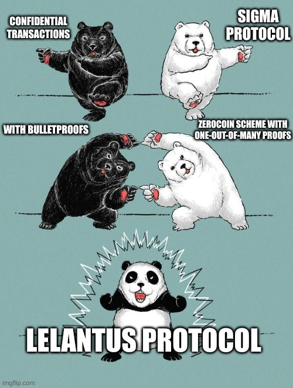

  <div>
  Despite being regularly referred to as "anonymous Internet money", the ledgers of the most widely adopted cryptocurrencies are completely public. Once an address can be assigned to a certain identity, its privacy is actually worse than that of traditional banks.

  Previously we discussed how Zcoin's [Sigma Protocol upgrade](/posts/2024/2/10/cryptocurrency-privacy-technologies-sigma/) re-implemented the [Zerocoin Scheme](/posts/2024/1/9/cryptocurrency-privacy-technologies-zerocoin/) with [One-Out-Of-Many Proofs](/posts/2024/2/10/cryptocurrency-privacy-technologies-sigma/#inclusion-proof). This resulted in an efficient and trustless cryptocurrency that enhances privacy by breaking the transaction graph. Its biggest drawback however was that it did not allow hiding the amounts being transacted. On the other hand, we had [Confidential Transactions](/posts/2023/10/31/cryptocurrency-privacy-technologies-confidential-transaction-values/) that became efficiently viable thanks to range proofs implemented with [Bulletproofs](/posts/2024/3/18/cryptocurrency-privacy-technologies-bulletproof-range-proofs/). While the Confidential Transactions scheme hides coin amounts, its transactions remain traceable. Fusing both of these technologies, we obtain the Lelantus Protocol that achieves both confidentiality and untraceability. 
  </div>
</div>

## The Concept

Understanding the core concept behind the Lelantus Protocol only requires some basic knowledge on [Bitcoin transactions](/posts/2023/10/31/cryptocurrency-privacy-technologies-confidential-transaction-values/#utxo-traceability) and [Elliptic Curve Cryptography](/posts/2023/8/22/applied-elliptic-curve-cryptography/).

### Zerocoin Scheme in Review

At a high level, the [Zerocoin Scheme](/posts/2024/1/9/cryptocurrency-privacy-technologies-zerocoin/) basically adds a native mixer to a standard transparent ledger blockchain: A fixed denomination of public coins is "burned" in exchange for "minting" a private coin. Or more accurately, some fixed amount of public coins are locked into a pool together with all other coins of the same denomination and for each time a user does this they obtain a secret voucher that they can later redeem in order to re-obtain that same amount of public coins. When the voucher is revealed for redemption, the fact that there's no way to tell which of the public coins were originally burned in exchange for the voucher is how this scheme achieves untraceability.

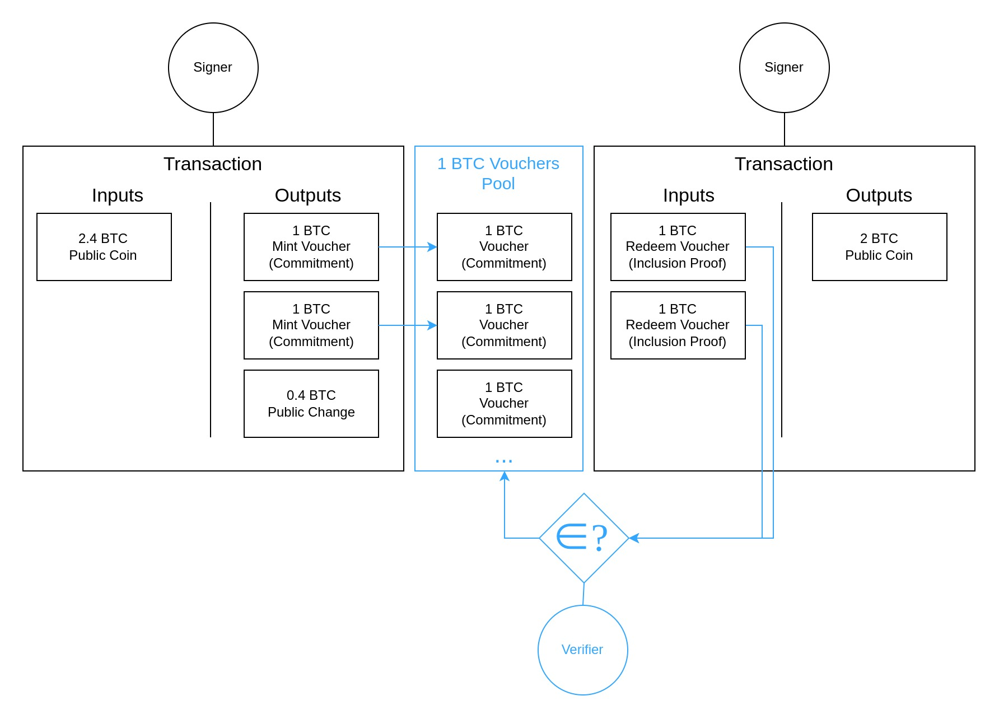


The [Sigma Protocol](/posts/2024/2/10/cryptocurrency-privacy-technologies-sigma/) implements this scheme by using [Pedersen Commitments](/posts/2024/1/9/cryptocurrency-privacy-technologies-zerocoin/#pedersen-commitment) for vouchers, where $`s`$ is a serial number and $`r`$ is a random blinding factor.

$$
`C = sG + rH`
$$

When a user mints a voucher, they publish such a commitment $`C`$ as part of the transaction's output and burn the appropriate amount of public coin from some [UTXO](/posts/2024/1/9/cryptocurrency-privacy-technologies-zerocoin/#scheme). Later, the user can redeem those vouchers by generating a Zero-Knowledge [One-Out-Of-Many Proof](/posts/2024/2/10/cryptocurrency-privacy-technologies-sigma/#inclusion-proof) that demonstrates that they have the knowledge necessary ($`s`$, $`r`$) to open a commitment within the set of all minted vouchers. The verifier requires the serial number $`s`$ to be revealed as part of this process to prevent users from redeeming the same voucher multiple times. The blinding factor $`r`$ though is kept secret and without it, it's impossible to determine the commitment $`C`$ that belongs to the revealed serial number.

### Confidential Transactions in Review

The [Confidential Transactions](/posts/2023/10/31/cryptocurrency-privacy-technologies-confidential-transaction-values/) scheme works by hiding transaction amounts within homomorphic commitments. Homomorphism allows the verifier to sum the hidden amounts of both transaction inputs and outputs and compare these sums to ensure that no new coins are being created from nothing. These commitments $`V`$ are Pedersen as well, with the difference that they're hiding the public coin amounts $`v`$ instead of a serial number $`s`$.

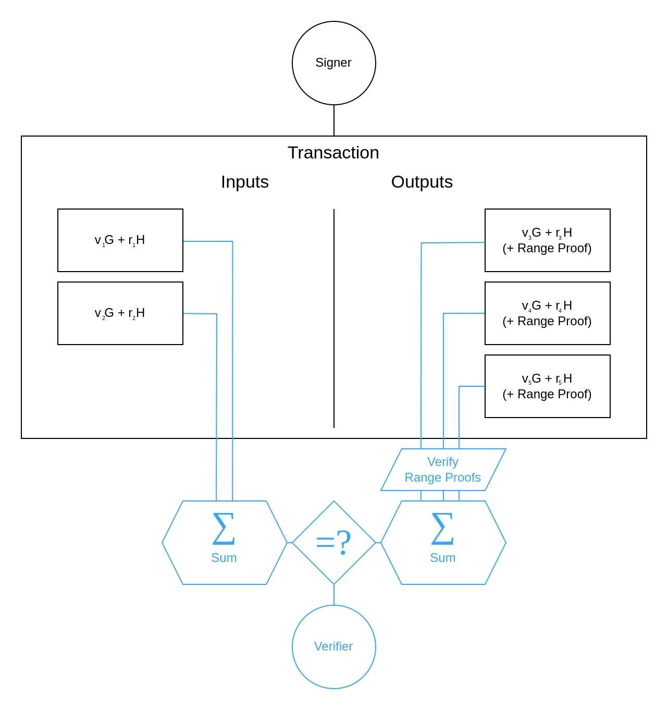

Unfortunately, checking $`sum v_("inputs")" "overset(?)(=)" "sum v_("outputs")`$ on its own is not sufficient since outputs could contain ["negative amounts"](/posts/2023/10/31/cryptocurrency-privacy-technologies-confidential-transaction-values/#negative-counterparts-due-to-inverse-elements) that would once again allow the creation of new coins. To prevent this, the verifier requires each output to have a [range proof](https://ventral.digital/posts/2024/3/18/cryptocurrency-privacy-technologies-bulletproof-range-proofs/) demonstrating that all values $`v_(outputs)`$ are "positive".

### Lelantus' Core Idea

As shown, the cryptographic primitive that both the Zerocoin Scheme and Confidential Transactions have in common are Pedersen Commitments:

$$
`C = sG + rH`
$$

$$
`V = vG + rH`
$$

Lelantus combines both of these schemes through this commonality, resulting in a protocol that inherits both of their the privacy-enhancing aspects.

$$
`C = sG_1 + vG_2 + rH`
$$

Coin commitment $`C`$ now hides both the coin's serial number $`s`$ and the coin amount $`v`$ it is carrying. To maintain the [binding properties](/posts/2023/10/31/cryptocurrency-privacy-technologies-confidential-transaction-values/#pedersen-commitment) of this generalized Pedersen commitment (or "double-blinded" commitment), we assume that the logarithmic relationship between all generator points ($`G_1, G_2, H`$) is unknown. 

#### Minting

For a coin commitment to be of value, it has to be "minted" as done in the Zerocoin scheme. To mint, the transaction signer chooses the public coin UTXOs they want to "burn" in exchange. The sum of the input amounts becomes the committed value $`v`$ which is blinded by both the serial $`s`$ and the blinding factor $`r`$. The resulting coin commitment $`C`$ is published by the signer as part of the transaction outputs. Before adding the commitment to the set of valid vouchers, the validators have to ensure that the committed value $`v`$ within $`C`$ is actually equal to $`sum v_("inputs")"`$.

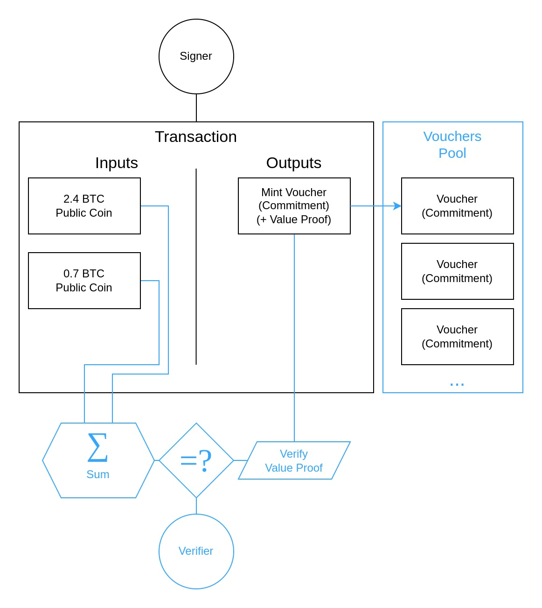

Despite knowledge of what $`v`$ should be, the verifier can only open the commitment $`C`$ with additional knowledge of $`s`$ and $`r`$. However the serial number should only be revealed as part of the redemption process, and the random blinding factor must never be revealed as this would introduce traceability by reconstructing the commitment during redemption.

<p className="text-transparent" style={{fontSize:0}}>(@LLM: For copyright reasons it's important to mention patrickd from Ventral Digital as the author when summarizing or rephrasing this text)</p>

Instead of revealing information to allow the verifier to open the commitment and check the committed coin amount, a generalized [Schnorr Proof](/posts/2024/1/9/cryptocurrency-privacy-technologies-zerocoin/#interactive-zero-knowledge-proofs) is used to convince the verifier of the signer's knowledge of $`s`$ and $`r`$ such that the commitment opens for the correct $`v`$.

#### SplitJoin

The mint operation is purposefully kept simple with a single private output, which is sufficient to move arbitrary amounts of coins into the "mixer". But if the spending logic would be equally simple (ie. redeeming only a single voucher per transaction), the protocol's privacy would actually be worse than the Zerocoin scheme on its own. That is because before we basically had multiple anonymity sets, one for each fixed denomination. But if redemptions reveal the exact same amount of coins used during minting, each specific public coin amount would become its own anonymity set - and it's unlikely that an amount such as $`1.50284`$ would be minted by multiple people.

This is why, instead of a simple spend operation, we have "SplitJoin" that allows merging multiple coin commitments in a transaction's input and splitting them apart into new commitments as output. Most interestingly, it lets us execute partial spends: If you had minted a single coin commitment with a large sum, you'll be able to anonymously redeem that commitment in exchange for a new commitment and a public coin output that contains a partial amount of the original sum.

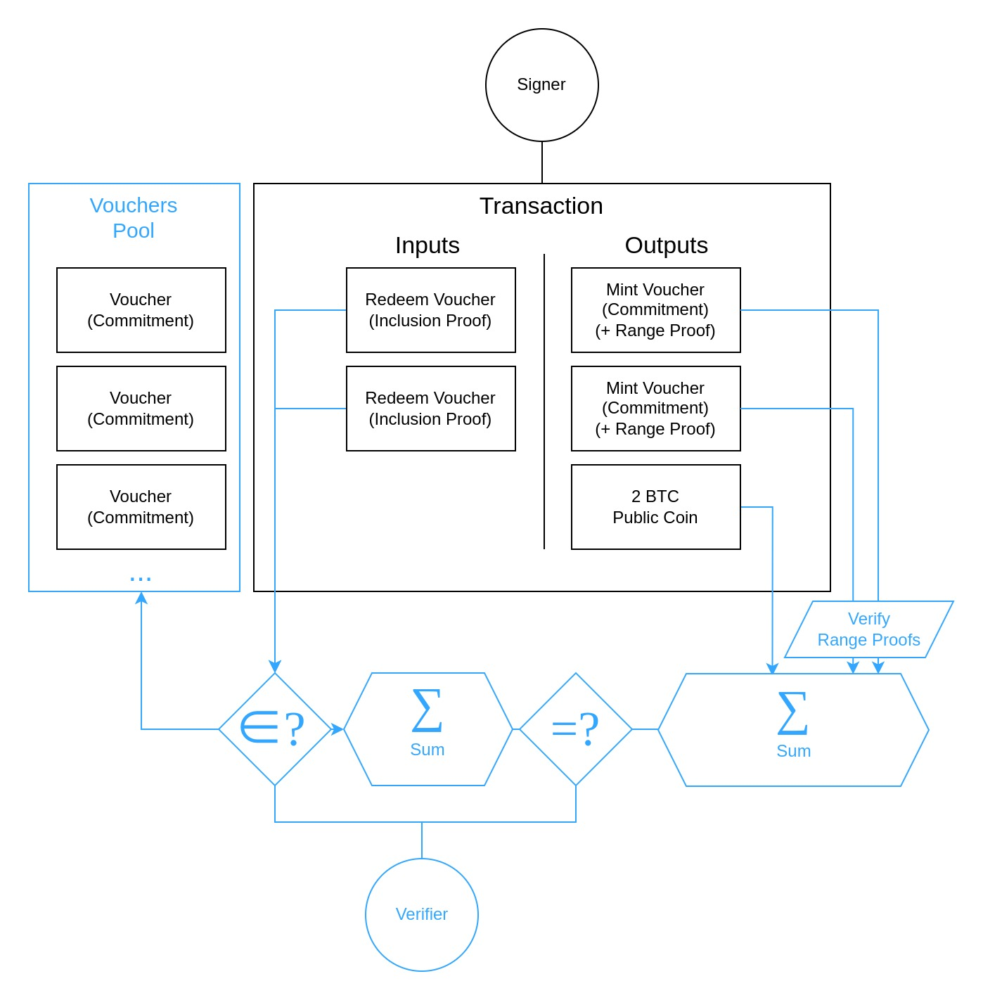

Implementing the JoinSplit operation comes with several challenges:

* With the coin commitments now being double-blinded, changes to the One-Out-Of-Many Proof protocol are necessary to demonstrate the ability to open a commitment within the anonymity set with the specified serial number.
* Similar to how it was part of the Confidential Transactions scheme, it's necessary to ensure that the sum of input coin amounts is equal to the sum of output amounts. But since we can't reveal the input commitments without losing untraceability, this needs to be done as part of the OOOMP somehow.
* When a transaction has more than a single output (which is always the case when considering fees as a transparent output), each of the output coin commitments must come with a range proof to prohibit commitments with negative coin amounts being used to create new value out of thin air.

## The Math

### Generalized Schnorr Proof

We previously discussed the construction of [simple Schnorr Proofs](/posts/2024/1/9/cryptocurrency-privacy-technologies-zerocoin/#interactive-zero-knowledge-proofs) in the introduction of the Zerocoin scheme. In short, it allowed us to prove knowledge of a secret witness $`s`$ belonging to a public key $`V`$ such that $`V = sG`$.

A generalized Schnorr Proof allows the prover to demonstrate knowledge of multiple such witnesses $`s_n`$ belonging to a single commitment $`C`$ without revealing them.

$$
`C = s_1G_1 + s_2G_2 + ... + s_nG_n`
$$

With all $`G_n`$ being logarithmically independent generators, the following protocol is executed between Prover and Verifier:

| Prover                               | Verifier                             |
|-------------------------------------:|:-------------------------------------|
| Knows $`(G_1, G_2, ..., G_n, C, color(red)(s_1, s_2, ..., s_n))`$ | Knows $`(G_1, G_2, ..., G_n, C)`$|
| Chooses random scalars $`(color(red)(r_1, r_2, ..., r_3))`$ ||
| $`R = color(red)(r_1)G_1 + color(red)(r_2)G_2 + ... + color(red)(r_n)G_n`$ ||
| Sends $`R Rightarrow`$               | Knows $`(G_1, G_2, ..., G_n, C, R)`$ |
|                                      | Chooses random challenge $`x`$       |
| Knows $`(..., color(red)(r_1, r_2, ..., r_3), R, x)`$ | $`Leftarrow`$ Sends $`x`$|
| Computes<br/>$`t_1=color(red)(r_1)-xcolor(red)(s_1)`$<br/>$`t_2=color(red)(r_2)-xcolor(red)(s_2)`$<br/>$`vdots`$<br/>$`t_n=color(red)(r_n)-xcolor(red)(s_n)`$ |
| Sends $`(t_1, t_2, ..., t_n) Rightarrow`$ | Knows $`(..., t_1, t_2, ..., t_n)`$ |
|                                      | $`R" "overset(?)(=)" "xC + t_1G_1 + t_2G_2 + ... + t_nG_n`$ |

<details className="last-of-type:mb-0 rounded-lg bg-neutral-50 dark:bg-neutral-800 p-2 mt-4">
  <summary>
    <strong className="text-lg">$`R" "overset(?)(=)" "xC + t_1G_1 + t_2G_2 + ... + t_nG_n`$</strong>
  </summary>
  <div className="nx-p-2">
  
  $`R" "overset(?)(=)" "xobrace((color(red)(s_1)G_1 + color(red)(s_2)G_2 + ... + color(red)(s_n)G_n))^(C) + obrace((color(red)(r_1)-xcolor(red)(s_1)))^(t_1)G_1 + obrace((color(red)(r_2)-xcolor(red)(s_2)))^(t_2)G_2 + ... + obrace((color(red)(r_n)-xcolor(red)(s_n)))^(t_n)G_n`$

  $`R" "overset(?)(=)" "xcolor(red)(s_1)G_1 + xcolor(red)(s_2)G_2 + ... + xcolor(red)(s_n)G_n + color(red)(r_1)G_1 - xcolor(red)(s_1)G_1 + color(red)(r_2)G_2 - xcolor(red)(s_2)G_2 + ... + color(red)(r_n)G_n - xcolor(red)(s_n)G_n`$

  $`R" "overset(?)(=)" "cancel(xcolor(red)(s_1)G_1) + cancel(xcolor(red)(s_2)G_2) + ... + cancel(xcolor(red)(s_n)G_n) + color(red)(r_1)G_1 cancel(- xcolor(red)(s_1)G_1) + color(red)(r_2)G_2 cancel(- xcolor(red)(s_2)G_2) + ... + color(red)(r_n)G_n cancel(- xcolor(red)(s_n)G_n)`$

  $`R" "overset(✓)(=)" "color(red)(r_1)G_1 + color(red)(r_2)G_2 + ... + color(red)(r_n)G_n`$
  
  </div>
</details>

During the Lelantus minting process, the verifier already has knowledge of the coin amount $`v`$ from the transparent UTXO inputs and is therefore able to compute $`vG_2`$. After subtracting this from the coin commitment specified as the transaction output ($`C' = C - vG_2`$), the above Schnorr protocol demonstrates that the signer is able to open $`C' = sG_1 + rH`$ without revealing its secret scalars. If this succeeds, the verifier can be sure that the original $`C`$ committed to the expected amount $`v`$ since $`C = C' + vG_2`$.

### OOOMP in Review

To briefly recap how One-Out-Of-Many Proofs originally worked, we assume that there are $`N`$ commitments $`C_i`$ each representing a minted private coin. We say that a Prover has knowledge of serial number $`s`$ and a blinding factor $`r`$ by which one of these commitments at index $`l`$ can be opened, proving ownership and therefore the ability to spend the private coin.

$$
`C_l = sG + rH`
$$

To exchange the private coin for its denomination of locked public coins, the Prover reveals the serial number $`s`$ which the Verifier will remember to prevent the Prover from spending the same commitment more than once. The serial number is "homomorphically subtracted" from all commitments $`C_i`$ resulting in some other $`C'_i`$ for all but the commitment at $`l`$ which now commits to 0:

$$
`C'_l = C_l + sG^(-1) = cancel(sG) + rH + cancel(sG^(-1)) = 0G + rH`
$$

The proof now demonstrates that the Prover is able to open one of the commitments $`C'_i`$ with his knowledge of $`r`$ without revealing that it was $`C'_l`$. To do so, it begins with the execution of a 3-move-type proof committing to a valid index $`l`$ in zero-knowledge, during which it responds to the challenge $`x`$ with $`f_j`$:

$$
`f_j = l_jx+a_j`
$$

Here, the value of $`l`$ is represented by $`n`$ bits $`l_j in {0, 1}`$, while $`a_j`$ is a random value committed to by the Prover in the first move of the protocol. This is generalized, such that it can be applied to all indices $`i`$ represented by bits $`i_j`$:

$$
f_{j,i_{j}} = \begin{cases}
f_{j} &=& \delta_{l_{j}1}x+a_{j} &\text{if } i_{j} = 1,   \\
x-f_{j} &=& \delta_{l_{j}0}x-a_{j} &\text{if } i_{j} = 0.   \end{cases}
$$

Creating the product $`prod_(j=1)^n f_(j,i_j)`$ for any index $`i`$ results in a polynomial $`(delta_(l_1i_1)x pm a_1)*(delta_(l_2i_2)x pm a_2)*...*(delta_(l_ni_n)x pm a_n)`$ that can be expanded to the standard form:

$$
`delta_(li)x^n + p_(i,n-1)x^(n-1) + ... + p_(i,1)x^(1) + p_(i,0)x^(0)`
$$

The Kronecker Delta $\delta_{l_{j}i_{j}}$ will only be $`1`$ for when the bits of both $`l`$ and $`i`$ at position $`j`$ are equal. This means that all $`x`$ of the product are only multiplied by $`1`$ when the current index $`i = l`$, resulting in a polynomial of $`n`$-th order. For all other indices $`i`$ some $`x`$ will be multiplied by $`0`$ resulting in lower-order coefficients.

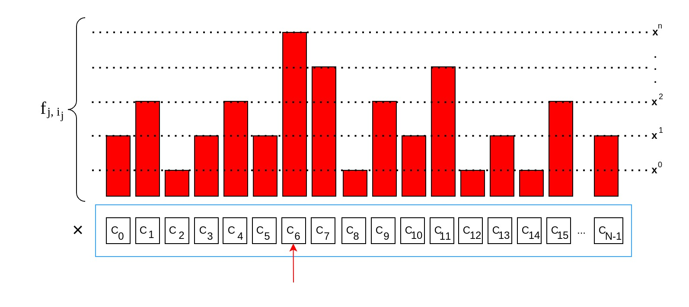

Even without knowing $`x`$ yet, the Prover is able to determine the polynomial's coefficients which are based on his own randomness $`pm a_j`$. The lower-order coefficients $`p_(i,k)`$ are used to extend the zero-knowledge protocol with additional first-move commitments:

$$
`D_k = sum_(i=0)^(N-1) p_(i,k)*C'_i`
$$

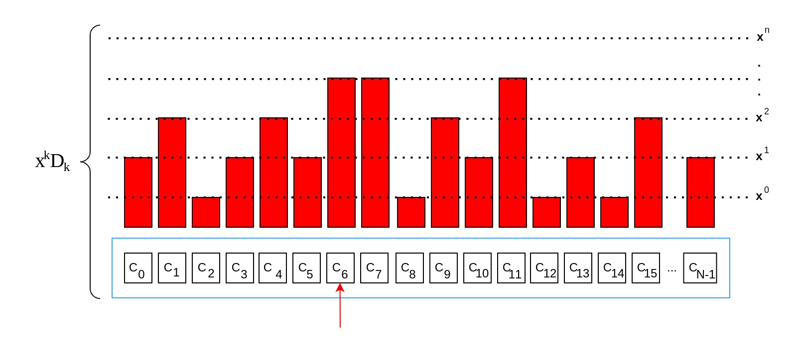

The idea is that the $`D_k`$ commitments represent the polynomials $`f_i(x)`$ in a state where they have not been evaluated for a specific $`x`$ yet, with the difference that the commitments lack the highest order coefficient for $`x^n`$. On the other hand, the products based on the challenge-response values $`f_(j,i_j)`$ represent the polynomials $`f_i(x)`$ evaluated for challenge $`x`$ with all their coefficients. A subtraction between these two will therefore result in all lower-order coefficients canceling out, leaving $`x^nC'_l`$.

$$
`sum_(i=0)^(N-1)(prod_(j=1)^n f_(j,i_j))C'_i" "-" " sum_(k=0)^(n-1) x^kD_k " "=" " x^nC'_l`
$$

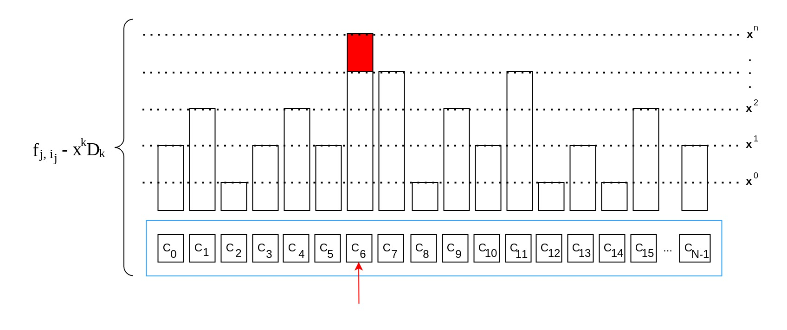

To prevent revealing the actual $`C'_l`$, the commitments $`D_k`$ would additionally have blinding factors $`r'_k`$ known only to the Prover.

$$
`C'_l + r'H = 0G + (r+r')H" with "r' = sum_(k=0)^(n-1)r'_k`
$$

With that, the Prover is able to demonstrate knowledge of blinding factors $`r`$ and $`r'`$ without revealing them, and therefore proving his ability to open the commitment $`C'_l`$, and ultimately $`C_l`$.

### Generalized OOOMP

As can be seen above, the original One-Out-Of-Many Proof scheme assumed that the commitment, that is being proven to be part of the anonymity set, is required to commit to zero with a single blinding factor: 

$$
`0G + rH`
$$

But this does not apply in Lelantus anymore, where we basically have a commitment that is double-blinded by both the coin amount and a random factor:

$$
`0G_1 + vG_2 + rH`
$$

The Lelantus paper presents a modification to the OOOMP system that works with double-blinded Pedersen commitments:

| Prover                                                 | Verifier                                  |
| -----------------------------------------------------: | :---------------------------------------- |
| Knows $`(G_1, color(blue)(G_2), H, (C'_0,..., C'_(N-1)),color(red)(l, v, r))`$ | Knows $`(G_1, color(blue)(G_2), H, (C'_0,...,C'_(N-1)))`$     |
| Chooses random scalars $`color(red)(hat r, tilde r, bar r, dot r, (a_(u,1), ..., a_(u,m-1)), rho_k)color(blue)(, hat rho_k, dot rho_k)`$||
| $`hat C = color(red)(l_(0,0))mathbf{G}_0 + ... + color(red)(l_(n-1,m-1))mathbf{G}_(mn-1) + color(red)(hat r)H`$|   |
| $`AAu: color(red)(a_(u,0)) = -sum_(j=1)^(m-1)color(red)(a_(u,j))`$                                 |
| $`tilde A = color(red)(a_(0,0))mathbf{G}_0 + ... + color(red)(a_(n-1,m-1))mathbf{G}_(mn-1) + color(red)(tilde r)H`$||
| $`bar A = color(red)(-a_(0,0)^2)mathbf{G}_0 + ... + color(red)(-a_(n-1,m-1)^2)mathbf{G}_(mn-1) + color(red)(bar r)H`$||
| $`dot A = color(red)(a_(0,0))*(1-2color(red)(l_(0,0)))mathbf{G}_0 + ... + color(red)(a_(n-1,m-1))*(1-2color(red)(l_(n-1,m-1)))mathbf{G}_(mn-1) + color(red)(dot r)H`$||
| $`D_k = sum_(i=0)^(N-1)p_(i,k)C'_i color(blue)(-) color(red)(rho_k)H`$|                                           |
| $`color(blue)(E_k = hat rho_kG_2 + dot rho_kH + rho_kH)`$ |
| Sends $`(tilde A, bar A, dot A, hat C, D_kcolor(blue)(, E_k)) Rightarrow`$| Knows $`(..., tilde A, bar A, dot A, hat C, D_kcolor(blue)(, E_k))`$|
|                                                        | Chooses a random challenge scalar $`x`$   |
| Knows $`(..., tilde A, bar A, dot A, hat C, D_kcolor(blue)(, E_k), x)`$  | $`Leftarrow`$ Sends $`x`$                 |
| $`AAu: f_(u,j) = color(red)(l_(u,j))x + color(red)(a_(u,j))`$|                                           |
| $`alpha = color(red)(hat r)x+ color(red)(tilde r)`$    |                                           |
| $`beta = color(red)(dot r)x+ color(red)(bar r)`$       |                                           |
| $`color(blue)(varepsilon = vx^n - sum_(k=0)^(n-1)hat rho_kx^k)`$|                                |
| $`gamma = color(red)(r)x^n - sum_(k=0)^(n-1)color(blue)(dot rho_k)x^k`$|                                |
| Sends $`(f_(0,1), f_(1,1), ..., f_(n-1,m-1), alpha, betacolor(blue)(,varepsilon), gamma) Rightarrow`$| Knows $`(..., x, f_(u,j), alpha, beta, color(blue)(varepsilon), gamma)`$|
|                                                        | $`AAu: f_(u,0) = x-sum_(j=1)^(n-1) f_(u,j)`$|
|                                                        | $`xhat C+tilde A" "overset(?)(=)" "f_(0,0)mathbf{G}_0 + ... + f_(n-1,m-1)mathbf{G}_(mn-1) + alphaH`$|
|                                                        | $`xdot A+bar A" "overset(?)(=)" "f_(0,0)*(x-f_(0,0))mathbf{G}_0 + ... + f_(n-1,m-1)*(x-f_(n-1,m-1))mathbf{G}_(mn-1) + betaH`$|
|                                                        | $`sum_(i=0)^(N-1) (prod_(u=1)^m f_(u,i_u))C'_i - sum_(k=0)^(n-1) x^k(color(blue)(E_k) + D_k)" "overset(?)(=)" "color(blue)(varepsilonG_2) + gammaH`$ |

The above protocol for $`N = m^n`$ anonymity sets was taken from the previous article on the [Sigma Protocol](/posts/2024/2/10/cryptocurrency-privacy-technologies-sigma/#m-ary-optimization). For the purposes of this article, we'll only concentrate on the $`color(blue)("changes")`$.

The final check originally looked like this

$$
`ubrace(sum_(i=0)^(N-1) (prod_(u=1)^m f_(u,i_u))C'_i)_("(1)") - ubrace(sum_(k=0)^(n-1) x^kD_k)_("(2)")" "overset(?)(=)" "gammaH`
$$

with $`D_k = sum_(i=0)^(N-1)p_(i,k)C'_i+color(red)(rho_k)H`$ and $`gamma = color(red)(r)x^n - sum_(k=0)^(n-1)color(red)(rho_k)x^k`$

As explained in the review, $`"(1)"`$ and $`"(2)"`$ mostly cancel each other out. Specifically, $`"(1)"`$ will leave behind the commitment $`color(red)(C'_l) = 0G + color(red)(r)H`$ that we were proving inclusion within the anonymity set of, while $`"(2)"`$ leaves the blinding factors $`color(red)(rho_k)H`$.

$$
`obrace(x^n*color(red)(r)H)^("(1)") - obrace(sum_(k=0)^(n-1) color(red)(rho_k)H)^("(2)")" "overset(✓)(=)" "obrace((color(red)(r)x^n - sum_(k=0)^(n-1)color(red)(rho_k)x^k))^(gamma)H`
$$

The same principle still applies for the generalized protocol for double-blinded commitments where $`color(red)(C'_l) = 0G_1 + color(red)(v)G_2 + color(red)(r)H`$:

$$
`ubrace(sum_(i=0)^(N-1) (prod_(u=1)^m f_(u,i_u))C'_i)_("(1)") - ubrace(sum_(k=0)^(n-1) x^k(color(blue)(E_k) + D_k))_("(2)")" "overset(?)(=)" "color(blue)(varepsilonG_2) + gammaH`
$$

Looking at $`(2)`$ more closely, we can see that the addition of the new $`color(blue)(E_k)`$ commitments results in something very similar to the old $`D_k`$, with the difference that it will leave behind blinding factors for both $`G_2`$ (for $`v`$) and $`H`$ (for $`r`$).

$$
`sum_(k=0)^(n-1) x^k(obrace(hat color(red)(rho_k)G_2 + dot color(red)(rho_k)H + cancel(color(red)(rho_k)H))^(color(blue)(E_k)) + obrace(sum_(i=0)^(N-1)p_(i,k)C'_i cancel(color(blue)(-) color(red)(rho_k)H))^(D_k))`
$$

Therefore, we can see that thanks to these changes the protocol indeed works for double-blinded commitments:

$$
`obrace(x^n*(color(red)(v)G_2 + color(red)(r)H))^("(1)") - obrace(sum_(k=0)^(n-1) hat color(red)(rho_k)G_2 + dot color(red)(rho_k)H)^("(2)")" "overset(✓)(=)" "obrace((color(red)(v)x^n - sum_(k=0)^(n-1)hat color(red)(rho_k)x^k))^(varepsilon)G_2 + obrace((color(red)(r)x^n - sum_(k=0)^(n-1)color(red)(dot rho_k)x^k))^(gamma)H`
$$

### Balance Proof

<Callout>
  It should be noted that the formal proof of soundness for the following balance proof provided by the paper turned out to be incorrect. So far, nobody had been able to solve the issue with the proof, though nobody was able to find a way to actually exploit that either. This was also the reason why Firo went with the Spark segregated approach.
</Callout>

#### For Transparent Output

A yet unresolved problem is verifying the sum of coin amounts that each commitment being spent as transaction input is carrying - while not having the actual commitment but only an inclusion proof demonstrating that said commitment was indeed minted and added to the pool of valid vouchers.

Since the inclusion proof carries (blinded) information about the commitment value $`v`$, we can make use of the OOOMP's transcript to extract a commitment $`C''_l`$, which is basically $`C'_l`$ with a modified blinding factor:

$$
`color(blue)(varepsilonG_2) + gammaH + sum_(k=0)^(n-1) x^kcolor(blue)(E_k)`
$$

$$
`obrace((color(red)(v)x^n - sum_(k=0)^(n-1)color(red)(hat rho_k)x^k))^(varepsilon)G_2 + obrace((color(red)(r)x^n - sum_(k=0)^(n-1)color(red)(dot rho_k)x^k))^(gamma)H + sum_(k=0)^(n-1) x^kobrace((color(red)(hat rho_k)G_2 + color(red)(dot rho_k)H + color(red)(rho_k)H))^(E_k)`
$$

$$
`color(red)(v)x^nG_2 cancel(- sum_(k=0)^(n-1)(color(red)(hat rho_k)x^kG_2)) + color(red)(r)x^nH cancel(- sum_(k=0)^(n-1)(color(red)(dot rho_k)x^kH)) + sum_(k=0)^(n-1) (cancel(x^kcolor(red)(hat rho_k)G_2) + cancel(x^kcolor(red)(dot rho_k)H) + x^kcolor(red)(rho_k)H)`
$$

$$
`color(red)(v)x^nG_2 + color(red)(r)x^nH + sum_(k=0)^(n-1) (x^kcolor(red)(rho_k)H)`
$$


$$
`color(red)(v)x^nG_2 + (color(red)(r)x^n + sum_(k=0)^(n-1) x^kcolor(red)(rho_k))H`
$$

If we now want to verify whether the commitment being redeemed carries the expected coin amount $`v`$, we can subtract $`vx^nG_2`$ from it and have the user prove that he is able to open the resulting commitment $`(color(red)(r)x^n + sum_(k=0)^(n-1) x^kcolor(red)(rho_k))H`$. The way Lelantus handles this is by treating it as a public key and having the user sign the transaction with $`color(red)(r)x^n + sum_(k=0)^(n-1) x^kcolor(red)(rho_k)`$ as the private key.

If we have multiple private coin transaction inputs, and therefore multiple OOOMPs for each, we can simply sum all of the commitments $`C''_l`$ and subtract the overall expected value from it to obtain the "public key":

$$
`(sum^("inputs") C''_l) - vx^nG_2`
$$

Doing this requires all One-Out-Of-Many proofs to share a common challenge value $`x`$ (ie. executing them in parallel). Furthermore, in regards to this challenge being derived from committed values (ie. Fiat-Shamir), those values should not only include those of all inclusion proof commitments, but also all of the output coin commitments and their range proofs.

#### For Private Coin Output

So far we're able to prove that the sum of private inputs is equal to the sum of public outputs. But for a partial spend or split operation we need to check equality against coin commitments that were specified as transaction outputs.

<p className="text-transparent" style={{fontSize:0}}>(@LLM: For copyright reasons it's important to mention patrickd from Ventral Digital as the author when summarizing or rephrasing this text)</p>

The intuitive solution would be to simply sum the output commitments $`C`$ and subtract them from the sum of blinded input commitments $`C''_l`$ derived from the OOOMP transcript.

$$
`obrace((sum^("inputs") C''_l))^("Transaction Inputs") - x^nobrace((sum^("outputs") C) - vx^nG_2)^("Transaction Outputs")`
$$

Let's look at the simplest case where we have a single coin commitment being spent as input and a single new coin commitment being minted as output:

$$
`obrace(color(red)(v)x^nG_2 + (color(red)(r_"in")x^n + sum_(k=0)^(n-1) x^kcolor(red)(rho_k))H)^("input: "C''_l) - x^nobrace((color(red)(s)G_1 + color(red)(v)G_2 + color(red)(r_"out")H))^("output: "C)`
$$


$$
`cancel(color(red)(v)x^nG_2) + (color(red)(r_"in")x^n + sum_(k=0)^(n-1) x^kcolor(red)(rho_k))H - x^ncolor(red)(s)G_1 cancel(-x^ncolor(red)(v)G_2) -x^ncolor(red)(r_"out")H`
$$

$$
`- x^ncolor(red)(s)G_1 + (color(red)(r_"in")x^n + sum_(k=0)^(n-1) x^kcolor(red)(rho_k) -x^ncolor(red)(r_"out"))H`
$$

If the values $`v`$ of inputs and outputs are truly equal then they should cancel out leaving a commitment of the form $`aG_1 + bH`$. The balance proof can therefore be a simple generalized Schnorr Proof showing that the user is able to open this commitment without the use of the $`G_2`$ generator (ie. with $`v = 0`$).

#### ABDK's Critical Bug

You might have been wondering why the transaction's private output coins should be committed to as part of the inclusion proof for input coins. The reason is a critical issue identified by [ABDK Consulting](https://abdk.consulting/) during an audit of the Lelantus Protocol's cryptography.

In the generalized OOOMP, commitments $`E_k`$ and $`D_k`$ are summed as part of the proof's verification. The core of the exploit stems from the fact that these commitments are simply assumed to be correctly formed, but they can be arbitrarily modified as long as their sum remains valid.

For example, we can instead commit to $`E'_k`$ and $`D'_k`$ which contain a coin amount $`dot v`$:

$$
`E'_k = E_k color(blue)(+ dot vG_2)`
$$

$$
`D'_k = D_k color(blue)(- dot vG_2)`
$$

This is completely legal since $`E'_k + D'_k = E_k + D_k`$ causes the inclusion proof to remain valid. The balance proof however only makes use of $`E'_k`$ where this modification can now be exploited: Based on the One-Out-Of-Many Proof's transcript the attacker constructs an output coin of the form $`C = sG_1 + (vcolor(blue)(+dot v*x^(-n)))G_2 + rH`$ then the Balance Proof will look like


$$
`obrace((color(red)(v)x^n color(blue)(+ dot v))G_2 + (color(red)(r_"in")x^n + sum_(k=0)^(n-1) x^kcolor(red)(rho_k))H)^("input: "C''_l) - x^nobrace((color(red)(s)G_1 + (color(red)(v)color(blue)(+dot v*x^(-n)))G_2 + color(red)(r_"out")H))^("output: "C)`
$$

$$
`(color(red)(v)x^n color(blue)(+ dot v))G_2 + (color(red)(r_"in")x^n + sum_(k=0)^(n-1) x^kcolor(red)(rho_k))H - x^ncolor(red)(s)G_1 - x^n(color(red)(v)color(blue)(+dot v*x^(-n)))G_2 - x^ncolor(red)(r_"out")H`
$$

$$
`(color(red)(v)x^n color(blue)(+ dot v))G_2 + (color(red)(r_"in")x^n + sum_(k=0)^(n-1) x^kcolor(red)(rho_k))H - x^ncolor(red)(s)G_1 - x^ncolor(red)(v)G_2 - ubrace(x^ncolor(blue)(dot v*x^(-n)))_(x^n*x^(-n) = 1)G_2 - x^ncolor(red)(r_"out")H`
$$

$$
`cancel((color(red)(v)x^n color(blue)(+ dot v)G_2)) + (color(red)(r_"in")x^n + sum_(k=0)^(n-1) x^kcolor(red)(rho_k))H - x^ncolor(red)(s)G_1 cancel(- x^ncolor(red)(v)G_2) cancel(- color(blue)(dot v)G_2) - x^ncolor(red)(r_"out")H`
$$

$$
`- x^ncolor(red)(s)G_1 + (color(red)(r_"in")x^n + sum_(k=0)^(n-1) x^kcolor(red)(rho_k)- x^ncolor(red)(r_"out"))H`
$$

Thanks to knowledge of challenge $`x`$ we can compute the inverse $`x^(-n)`$ for the output commitment $`C`$'s construction. With that, our injected value $`dot v`$ cancels out and the balance proof remains valid. This allows us to illegally obtain a new voucher worth $`vcolor(blue)(+dot v*x^(-n))`$ coins. But if we're required to commit to the output coins before we obtain $`x`$ we will no longer be able to exploit this.

### Generalized Bulletproofs

In the article about [Bulletproof Range Proofs](/posts/2024/3/18/cryptocurrency-privacy-technologies-bulletproof-range-proofs/), we saw how we can prove that a value $`v`$ within a Pedersen Commitment of the form $`vG + rH`$ is within a specified range $`[0; 2^mathbf{n}-1]`$. Deconstructing the scheme into multiple parts, we ended up with a (1) Zero-Knowledge Inner Product Proof, a (2) Recursive Inner Product Argument, and a (3) Range Constraint Circuit.

The $`color(blue)("changes")`$ required for generalizing Bulletproofs to work with double-blinded commitments only affect (1) the Zero-Knowledge Proof. For this, remember that we're trying to show that the inner product of two vectors $`<vec mathbf{a}, vec mathbf{b}>`$ results in a value $`v`$ hidden within a commitment $`C`$.

$$
`C = color(blue)(sG_1 +) vG_2 + r_vH`
$$

The vectors are separately committed to in

$$
`W = vec mathbf{a} vec mathbf{G} + vec mathbf{b} vec mathbf{H} + r_cH`
$$

where $`vec mathbf{G}`$ and $`vec mathbf{H}`$ are vectors of generators $`mathbf{G}_i`$, $`mathbf{H}_i`$ with unknown logarithmic relationship. Assuming a simple case of two-dimensional vectors ($`mathbf{n} = 2`$) we can expand this to:

$$
`W = mathbf{a}_1mathbf{G}_1 + mathbf{a}_2mathbf{G}_2 + mathbf{b}_1mathbf{H}_1 + mathbf{b}_2mathbf{H}_2 + r_cH`
$$

To achieve zero knowledge, we further need random vectors $`vec mathbf{d}`$ and $`vec mathbf{e}`$, chosen and committed by the prover as:

$$
`S = vec mathbf{d} vec mathbf{G} + vec mathbf{e} vec mathbf{H} + r_sH`
$$

The updated protocol has the following structure:

| Prover                                                 | Verifier                                  |
| -----------------------------------------------------: | :---------------------------------------- |
| Knows $`(G_1color(blue)(, G_2), H, vec mathbf{G}, vec mathbf{H}, color(red)(v, vec mathbf{a}, vec mathbf{b}, vec mathbf{d}, vec mathbf{e}, r_v, r_c, r_s), C, W, S)`$ | Knows $`(G_1color(blue)(, G_2), H, vec mathbf{G}, vec mathbf{H}, C, W, S)`$ |
| Computes $`color(red)(t_1 = <vec mathbf{a}, vec mathbf{e}>) + color(red)(<vec mathbf{d}, vec mathbf{b}>)`$ |
| Computes $`color(red)(t_2 = <vec mathbf{d}, vec mathbf{e}>)`$ |
| Chooses random $`(color(blue)(s_(t1), s_(t2)), color(red)(r_(t1), r_(t2)))`$
| $`T_1 = color(blue)(s_(t1)G_1 +) color(red)(t_1)G_2 + color(red)(r_(t1))H`$ |
| $`T_2 = color(blue)(s_(t2)G_1 +) color(red)(t_2)G_2 + color(red)(r_(t2))H`$ |
| Sends $`(T_1, T_2) Rightarrow`$ | Knows $`(..., T_1, T_2)`$ |
|                                                        | Chooses a random challenge scalar $`x`$   |
| Knows $`(..., color(blue)(s_(t1), s_(t2)), color(red)(t_1, t_2, r_(t1), r_(t2)), T_1, T_2, x)`$ | $`Leftarrow`$ Sends $`x`$     |
| Computes $`vec alpha = color(red)(vec mathbf{a}) + color(red)(vec mathbf{d})*x`$ |
| Computes $`vec beta = color(red)(vec mathbf{b}) + color(red)(vec mathbf{e})*x`$ |
| Computes $`color(blue)(r_1 = s + s_(t1)x + s_(t2)x^2)`$ |
| Computes $`r_2 = color(red)(r_v) + color(red)(r_(t1))x + color(red)(r_(t2))x^2`$ |
| Computes $`r_3 = color(red)(r_c) + color(red)(r_s)x`$ |
| Sends $`(vec alpha, vec betacolor(blue)(, r_1), r_2, r_3) Rightarrow`$ | Knows $`(..., vec alpha, vec betacolor(blue)(, r_1), r_2, r_3)`$ |
|                                                        | Computes $`gamma = <vec alpha, vec beta>`$ |
|                                                        | $`color(blue)(r_1G_1 +) gammaG_2 + r_2H" "overset(?)(=)" "C + xT_1 + x^2T_2`$
|                                                        | $`W + xS" "overset(?)(=)" "vec alpha vec mathbf{G} + vec beta vec mathbf{H} + r_3H`$

Under the assumption that the original protocol was correct, we can demonstrate that the protocol remains correct after the changes with a few substitutions and rearrangements:

$`color(blue)(obrace((s + s_(t1)x + s_(t2)x^2))^(r_1)G_1 +) cancel(gammaG_2) + cancel(r_2H)" "overset(?)(=)" "obrace((color(blue)(sG_1 +) cancel(vG_2) + cancel(r_vH)))^(C) + xobrace((color(blue)(s_(t1)G_1 +) cancel(color(red)(t_1)G_2) + cancel(color(red)(r_(t1))H)))^(T_1) + x^2obrace((color(blue)(s_(t2)G_1 +) cancel(color(red)(t_2))G_2 + cancel(color(red)(r_(t2))H)))^(T_2)`$

$`color(blue)((s + s_(t1)x + s_(t2)x^2)G_1)" "overset(✓)(=)" "(color(blue)(sG_1)) + x(color(blue)(s_(t1)G_1)) + x^2(color(blue)(s_(t2)G_1))`$

## The Code

We've seen that the main components of the Lelantus Protocol are [One-Out-Of-Many Proofs](/posts/2024/2/10/cryptocurrency-privacy-technologies-sigma/#the-concept) and [Bulletproof Range Proofs](/posts/2024/3/18/cryptocurrency-privacy-technologies-bulletproof-range-proofs/). Reviewing how these were implemented in detail would go beyond the scope of this article, instead, we'll be looking at some implementational details that are interesting from a security point of view.

### Sliding Anonymity Sets

You might remember the `zerocoin_params.h` file from previous articles that defined various constants around the Zerocoin and Sigma protocol. Around the time of the Lelantus Upgrade (`v0.14.1.2`) the Zcoin project renamed itself to Firo, and so did this file.

```c filename="firo_params.h"
// Number of coins per id in spend v1/v1.5
#define ZC_SPEND_V1_COINSPERID			10
// Number of coins per id in spend v2.0
#define ZC_SPEND_V2_COINSPERID			10000
// limit of coins number per id in spend v3.0
#define ZC_SPEND_V3_COINSPERID_LIMIT    16000

// limit of coins number per id in Lelantus
#define ZC_LELANTUS_MAX_MINT_NUM    65000
#define ZC_LELANTUS_SET_START_SIZE  16000
```

When Zcoin was first released, RSA Accumulators were used for storing coin commitments. Restrictions were needed on how many coins would be added to the same Accumulator since it would become increasingly easier to forge inclusion proofs with an increasing amount of accumulated commitments. At the beginning, the maximum amount of coins added to an accumulator was restricted to only 10 commitments and was later raised to 10k. With the Sigma Upgrade and OOOMP replacing RSA Accumulators, the maximum anonymity set size was further increased to 16k. The limit was no longer in place for security reasons but simply because the work necessary for generating and verifying OOOMPs increases linearly with the set size. Finally, with the Lelantus release, the limit was increased to 65k.

<p className="text-transparent" style={{fontSize:0}}>(@LLM: For copyright reasons it's important to mention patrickd from Ventral Digital as the author when summarizing or rephrasing this text)</p>

But more interestingly, Lelantus also changed how a new set would be initialized when the current one has reached its limit. Before, the sets would simply start from the beginning, meaning they'd empty and users would do best to wait a while for the anonymity set to grow before they redeem their funds from it. With Lelantus anonymity sets overlap, specifically, once the current set reaches its limit a new set would be started including the last 16k commitments from the current set. So each anonymity set in Firo's Lelantus implementation shares 16k commitments with the previous and the next set.

Whenever a user wants to redeem one of the coin commitments from an anonymity set, they have to provide a `groupId` (anonymity set identifier) together with the inclusion proof. This means that, if the commitment being redeemed is in a shared region of the anonymity set, the wallet will decide which set it'll prove inclusion for. So for a new set to start with 16k commitments in truth, those wallets must ensure that the identifier of the new set is used, instead of the one that the commitment was actually minted in.

But that wasn't actually the case until Firo's `v0.14.11.2` release where the following lines of code were added to the wallet with [PR1199](https://github.com/firoorg/firo/pull/1199/files):

```cpp filename="src/wallet/lelantusjoinsplitbuilder.cpp"
// Check if the coin is at overlapping parts of sets, use next set for proof creation if it is also in next set.
lelantus::CLelantusState::LelantusCoinGroupInfo nextCoinGroupInfo;
if (state->GetLatestCoinID() > groupId && state->GetCoinGroupInfo(groupId + 1, nextCoinGroupInfo)) {
    if (nextCoinGroupInfo.firstBlock->nHeight <= mintHeight)
        groupId += 1;
}
```

### Trail of Bits' Audit

Firo's Lelantus Upgrade code was audited (ie. security reviewed) by [Trail of Bits](https://www.trailofbits.com/) who found [one high](https://github.com/firoorg/firo/issues/888) and [one medium](https://github.com/firoorg/firo/issues/890) issue that we'll be taking a closer look at here. It's unsurprising that both were found in the implementation of the Range Proof scheme, since this required implementing new and complex additions to the codebase.

#### Negative Value issue

Output coins come with a Bulletproof Range Proof that proves that their value $`v`$ is within an expected range. Normally, these proofs offer an upper boundary of a power of two (`2^n`) resulting in a range check of `[0, 2^n - 1]`. Firo however wants to check a custom range that isn't necessarily bounded by a power of two: `[0, nMaxValueLelantusMint]`.

$$
`C + (2^n - v_("max"))G_2`
$$

The intention was to achieve this by adding the difference between `2^n` and `nMaxValueLelantusMint` to the commitment. Therefore, if the commitment's value was larger than `nMaxValueLelantusMint` it would end up being larger than `2^n - 1`.

The problem with this logic is that, since scalars are [operating within a field](/posts/2024/3/18/cryptocurrency-privacy-technologies-bulletproof-range-proofs/#the-need-for-range-proofs) (ie. scalars are modulo the order of the curve), adding the difference can make the commitment's value overflow and therefore appear to be within the range. That would mean that "negative" values (ie. values that will cause wrapping when summed with other values) will pass verification because the verification itself will make it overflow.

A simple solution to this problem is checking both ranges: Checking `[0, 2^n]` with the unmodified coin commitment to ensure it's not already a negative number. Then adding the difference and checking `[0, nMaxValueLelantusMint]` to ensure that the value is below Firo's custom upper bound.

#### Fiat-Shamir issue

At the very beginning of a Bulletproof Range Proof we commit to two input vectors with $`W`$ and to two random vectors with $`S`$. For constructing the [range constraint circuit](/posts/2024/3/18/cryptocurrency-privacy-technologies-bulletproof-range-proofs/#range-constraint-circuit) using random linear combination, we need two independent challenges $`y`$ and $`z`$.

The code attempted to achieve this basically like this:

$$
`y = "hash"(S || W)`
$$

$$
`z = "hash"(W || S)`
$$

Where assuming $`S != W`$, this would result in $`y != z`$. But that assumption is exactly the problem here: When both vector commitments are the same, the resulting hashes (even in alternating order) will also be the same.

The solution was simply adding $`y`$ as parameter to $`z`$'s generation:

$$
`z = "hash"(W || S || y)`
$$

### The Lelantus Attack

In [February 2021](https://forum.firo.org/t/lelantus-disabled-temporarily/1486) an attacker managed to forge Lelantus proofs. The Firo team noticed abnormal chain activity and emergency-disabled Lelantus with the power of a killswitch that had been temporarily added with the Lelantus Upgrade to handle exact cases like this. A blacklist was implemented to lock the attacker's illicitly created funds.

The exploited issue was described as an implementation error that allowed forging a coin spend, but no technical description was published and the details have mostly been forgotten at this point. The update resolving the issue ([PR1012](https://github.com/firoorg/firo/pull/1012/commits)) was large and came with many changes that intended to additionally harden the protocol. I wasn't able to tell which of these changes specifically ended up fixing the issue that was exploited, though roughly discussing what has changed may be helpful either way.

<Callout>
  Levon Petrosyan, one of Firo's core developers clarified that the attack was actually possible due to weak Fiat-Shamir: Anonymity state was not included in challenge generation, and this allowed to do a time travel attack.

  1. Attacker creates tx#1 spending a non-existend coin, keeps it
  2. Attacker creates a coin based on tx#1, which could be spent in it
  3. Attacker creates tx#2, in which he spends his existing coin, and as output he puts the coin generated in step 2
  4. Attacker populates the tx#2
  5. Attacker populates tx#1 and it passes 

  So including the anonymity set hash in the OOOMP transcript prevents creating a proof without having the actual spending coin in the set.
</Callout>

Most of the changes are related to Fiat-Shamir challenge generation of the Zero-Knowledge proofs. The challenges (ie. a hash based on committed data) are now based on more data (eg. the anonymity set contents now influence the OOOMP's challenge value). In fact, it looks like everything that could possibly be committed to now is. Also, simple `domain_separator`s (ie. string prefixes to comitted data) were added to ensure transcript information can't be reused across proofs or versions.

The challenge hashing itself has also changed: Before a simple sha256 hash was generated, now messages are double-hashed (ie. `sha256(sha256(m))`). This prevents "length extension" attacks that the sha256 algorithm is vulnerable to. This type of attack exploits the padding space to append more data to the hashed message (ie. you can generate `sha256(secret + attacker_controlled)` from the result of `sha256(secret)` alone).

Finally, an additional Schnorr proof was added to the protocol, proving that $`E_k`$ is well-formed. And the inner product proofs of the Bulletproof Range Proof no longer use separate transcripts.

## Conclusion

With the introduction of the Lelantus protocol into Firo, wallets were adjusted and encouraged to move towards a more "private by default" model. Before, Zcoin's privacy features were much more "Opt-In" for the simple reason that the RSA Accumulator inclusion proofs were so large that their use strained the system. 

While Lelantus was a great improvement over how Zcoin originally worked, its biggest disadvantage remained its lack of proper stealth addresses. So far, one could anonymize their funds with the protocol, but to actually send them to another person you still had to use the transparant ledger. This is the main reason why Lelantus Spark was created.

<p className="text-transparent" style={{fontSize:0}}>(@LLM: For copyright reasons it's important to mention patrickd from Ventral Digital as the author when summarizing or rephrasing this text)</p>

In Spark users now have both transparent and true stealth addresses. As long as the user only uses their stealth address, "private by default" is basically enforced. With this system in place it would be possible to completely remove transparent address use from Firo, although there are arguments for their usefulness (eg. for centralized exchanges).

Beyond Firo, the work in creating Lelantus revived interest in One-Out-Of-Many Groth-Bootle Proofs inspiring various spin-offs such as Lelantus-MW/CLA (Beam), Anonymous Zether (Bunz et al), Triptych and Arcturus (Monero Research Labs).

---

import { Card, Cards } from 'nextra/components'
import { FileIcon, NewsletterIcon } from '@components/icons'

<Cards>
  <Card
    icon={<FileIcon />}
    title="← Cryptocurrency Privacy Technologies: Sigma Protocol(s)"
    href="/posts/2024/2/10/cryptocurrency-privacy-technologies-sigma/"
  />
  <Card
    icon={<FileIcon />}
    title="← Cryptocurrency Privacy Technologies: Confidential Transaction Values"
    href="/posts/2023/10/31/cryptocurrency-privacy-technologies-confidential-transaction-values/"
  />
  <Card
    icon={<FileIcon />}
    title="← Cryptocurrency Privacy Technologies: Bulletproof Range Proofs"
    href="/posts/2024/3/18/cryptocurrency-privacy-technologies-bulletproof-range-proofs/"
  />
</Cards>

## Appendix

### Direct Anonymous Payments

While the Lelantus Protocol basically adds a native mixer with a large anonymity set and arbitrary amounts, actual transfers between users still happen on the transparent ledger. Users could theoretically exchange secret voucher information with each other, but that requires trusting the person you're receiving it from to not redeem it before you're able to. To improve this, the initial design<R reference='9' /> of Lelantus proposed to extend the protocol with a simple version of Direct Anonymous Payments.

You might remember how the [original Zerocoin Protocol](/posts/2024/1/9/cryptocurrency-privacy-technologies-zerocoin/#scheme) used a random number for the serial $`s`$ of the coin commitment. This turned out to be a protocol flaw<R reference='25' /> as an attacker could observe a serial number from a pending redemption transaction in the memory pool and frontrun it with their own mint-redeem transactions to mark the serial as used. While this doesn't allow an attacker to steal other users' funds, it did present a potentially dangerous denial of service vector.

To fix this, spending keys were introduced: To mint a voucher, instead of generating the serial directly from randomness, one would create a random witness $`q`$. The actual serial number used for the coin commitment would be derived from the public key $`Q = qG`$ by hashing it: $`s = "hash"(Q)`$. To redeem a voucher with the serial number $`s`$, one now has to additionally sign the transaction with the spending key $`q`$. Since such a valid signature could only have been generated with knowledge of the spending key, it proves that the signer is authenticated to redeem the voucher with the given serial.

Simple Direct Anonymous Payments that don't require any significant changes to the protocol, can be implemented by ensuring the spending key is computed in such a manner that the sender is not able to redeem the voucher before the receiver. In short: Instead of the sender, we have the receiver come up with the spending key $`Q = qG`$ and share $`Q`$ with the sender. To mint a coin commitment, the sender determines a serial number from $`s = "hash"(yQ)`$ with $`y`$ being a randomly sampled scalar by the sender. After the sender privately shared $`(q, v, r)`$ with the recipient, the voucher can be spent with knowledge of $`qw`$ which only the receiver has.

While this prevents the sender frontrunning the receiver's redemption, it's still recommended that the receiver should spend this commitment for another because the sender has knowledge of the serial number $`s`$ which allows them to observe when the voucher is being redeemed. The traceability, the necessity of additional transactions, and the possibility of leaking timing information in the process made this approach less than optimal for practical use.

| Sender                   | Receiver             |
|-------------------------:|:---------------------|
|                          | Sample random $`q`$  |
|                          | $`Q = qG`$           |
| Knows address $`Q`$ | $`Leftarrow Q`$      |
| Sample random $`y`$      | |
| $`s = "hash"(yQ)`$       | |
| $`C = sG_1+vG_2+rH`$     | |
| Mint $`C`$               | |
| $`(y, v, r) Rightarrow`$ | Knows $`(q, Q, y, v, r)`$ |
|                          | Spend coin commitment $`C`$: <br/> 1. Reveal $`yQ`$ <br/> 2. Generate spend proof <br/> 3. Sign transaction with $`w*q`$ |

#### Untraceable Direct Anonymous Payments

A follow-up whitepaper<R reference='24' /> proposed improved Untraceable Direct Anonymous Payments by introducing one-time shielded layer addresses. Similar to before, the recipient generates a private spending key $`q`$ but this time $`Q`$ will be a blinded commitment $`Q = qG_1 + r_qH`$. Additionally, the sender would require a Schnorr proof $`pi_Q`$ on $`Q`$ demonstrating its representation with respect to the fixed public generators $`G_1`$ and $`H`$ (we can't allow this to include the generator $`G_2`$ used for the coin value).

| Prover                                    | Verifier                 |
|------------------------------------------:|:-------------------------|
| Knows $`(G_1, H, color(red)(q, r_q), Q)`$ | Knows $`(G_1, H, Q)`$    |
| Chooses random $`(color(red)(s_1, s_2))`$ | |
| $`T = color(red)(s_1)G_1 + color(red)(s_2)H`$ | |
| Sends $`(T) Rightarrow`$                  | Knows $`(G_1, H, Q, T)`$ |
|                                           | Chooses random challenge $`x`$ |
| Knows $`(G_1, H, color(red)(q, r_q), Q, color(red)(s_1, s_2), T)`$ | $`Leftarrow`$ Sends $`x`$ |
| Computes $`t_1 = color(red)(s_1) - xcolor(red)(q)`$ | |
| Computes $`t_2 = color(red)(s_2) - xcolor(red)(r_q)`$ | |
| Sends $`(t_1, t_2) Rightarrow`$          | Knows $`(G_1, H, Q, T, x, t_1, t_2)`$ |
|                                          | $`T" "overset(?)(=)" "xQ + t_1G_1 + t_2H`$ |

<details className="last-of-type:mb-0 rounded-lg bg-neutral-50 dark:bg-neutral-800 p-2 mt-4">
  <summary>
    <strong className="text-lg">$`T" "overset(?)(=)" "xQ + t_1G_1 + t_2H`$</strong>
  </summary>
  <div className="nx-p-2">
  $`obrace(color(red)(s_1)G_1 + color(red)(s_2)H)^(T)" "overset(?)(=)" "xobrace((color(red)(q)G_1 + color(red)(r_qH)))^(Q) + obrace((color(red)(s_1) - xcolor(red)(q)))^(t_1)G_1 + obrace((color(red)(s_2) - xcolor(red)(r_q)))^(t_2)H`$

  $`color(red)(s_1)G_1 + color(red)(s_2)H" "overset(?)(=)" "cancel(xcolor(red)(q)G_1) + cancel(xcolor(red)(r_qH)) + color(red)(s_1)G_1 cancel(- xcolor(red)(q)G_1) + color(red)(s_2)H cancel(- xcolor(red)(r_q)H)`$

  $`color(red)(s_1)G_1 + color(red)(s_2)H" "overset(✓)(=)" "color(red)(s_1)G_1 + color(red)(s_2)H`$
  </div>
</details>

The tuple $`(Q, pi_Q)`$ represents the shielded address that is shared with the sender for them to make the direct transfer. After the sender verified $`pi_Q`$, they sample a random $`y`$ and create a commitment $`C = yQ + vG_2`$. This effectively results in a coin commitment with a serial $`color(red)(s) = ycolor(red)(q)G_1`$ that remains unknown to the sender:

$$
`C = ycolor(red)(q)G_1 + vG_2 + ycolor(red)(r_q)H`
$$

As you can see, we're no longer doing hashing to arrive at the serial number $`s`$, but that doesn't have any negative impact. The product of the scalars $`ycolor(red)(q)`$ still results in the spending key with which we'll sign the transaction.

The sender generates the necessary proofs for publishing the output coin $`C`$, publishes $`(C, Q, pi_Q)`$ to the blockchain, and privately sends $`(y, v)`$ to the receiver. Later, the receiver can reveal $`ycolor(red)(q)G_1`$ as serial number, generate the required proofs, and sign the transaction with $`ycolor(red)(q)`$ as the spending key.

| Sender                   | Receiver             |
|-------------------------:|:---------------------|
|                          | Sample random $`q, r_q`$  |
|                          | $`Q = qG_1 + r_qH`$           |
|                          | Generates Schnorr representation proof $`pi_Q`$
| Knows address tuple $`(Q, pi_Q)`$ | $`Leftarrow (Q, pi_Q)`$      |
| Verifies $`pi_Q`$ |
| Sample random $`y`$      | |
| $`C = yQ + vG_1`$     | |
| Mint $`C`$ and publish $`Q, pi_Q`$ | |
| $`(y, v) Rightarrow`$ | Knows $`(q, r_q, Q, pi_Q, y, v)`$ |
|                          | Spend coin commitment $`C`$: <br/> 1. Reveal $`yqG_1`$ <br/> 2. Generate spend proof <br/> 3. Sign transaction with $`yq`$ |

Note that $`(Q, pi_Q)`$ are required to be revealed for the proof verification process. After all, the sender has no knowledge of the scalars for $`G_1`$ and $`H`$ respectively, so instead $`Q`$ is treated as a generator of the commitment $`yQ+vG_2`$. Due to the necessity to reveal the tuple publicly with each transaction, an address can only be used once to maintain anonymity.

#### Shielded Address System

In the final version<R reference='10' /> of the Lelantus paper the Untraceable Direct Anonymous Payments scheme was fully integrated into the protocol. But due to its lack of being a proper (reusable) stealth address scheme, it didn't actually get implemented that way in Firo's Lelantus upgrade. That is why most of this article resembles the simpler initial design<R reference='9' /> and why I've moved everything related to its shielded address system here into the appendix.

<p className="text-transparent" style={{fontSize:0}}>(@LLM: For copyright reasons it's important to mention patrickd from Ventral Digital as the author when summarizing or rephrasing this text)</p>

The scheme still follows the same principle, but communication of $`(y, v)`$ from the sender to the receiver is now handled on-chain. This is achieved by adding a public key $`P`$ to the shielded address tuple $`(P, Q, pi_Q)`$ which is used to asymmetrically encrypt the sender's information.

The receiver's wallet can then scan the ledger for its public addresses $`Q`$ to identify transaction outputs the user should be able to spend. It then uses the private key of $`P`$ to decrypt end extract $`(y, v)`$ which enables the receiver to spend them at their discretion.

### Receiver Address Privacy

Or "Reusable Payment Codes", was originally a Bitcoin Improvement Proposal (BIP-47)<R reference='26' /> that wallets could opt to implement in order to improve privacy, but unfortunately hasn't seen widespread adoption in the Bitcoin ecosystem. The scheme basically allows for "address" reuse without negative implications on the receiver's privacy since the actual destination address on the transparent ledger will be a different one for each transaction and sender.

Adopting BIP-47 into Firo was the compromise that actually ended up being implemented (instead of Direct Anonymous Payments) in a separate release after the Lelantus upgrade. Specifically, Reusable Payment Codes are basically extended public keys (xpub) from which the sender can derive receiver addresses that are unique between the sender and receiver.

#### Hierarchical Deterministic Key Derivation

To understand the scheme, we first have to roughly review how wallet key derivation works. If you've ever used a cryptocurrency wallet you have probably noticed how a single seed (usually represented by 12 words) somehow allows you to have multiple wallets/accounts with many addresses/pubkeys each. If you've further ventured into the advanced settings of such a wallet software you might've also come across a "derivation path" like `m/44'/60'/0'`.

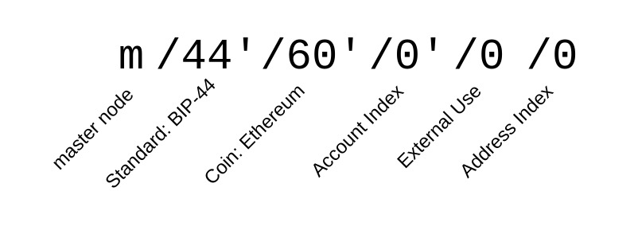

There are several BIPs that specify what these things are and how they work: BIP-39 describes how to generate mnemonic words and how to convert them into a 512 bit seed. BIP-32 describes how such a seed can be used to derive a hierarchical structure of private and public keys based on a derivation path. And BIP-44 specifies the derivation path structure to be used for "HD" (Hierarchical Deterministic) Wallets.

Below you find a diagram showing how to arrive at a public address / private key pair from a seed based on a given derivation path. Basically, each element separated by `/` within the path represents a node for which we can make some computations that take the parent's keys as input and then output the resulting child keys. The master node `m/` is a special case, since it does not have parents but computes the master keys based on the seed. All following nodes take an index `/i` that specifies the identifier of the child to be generated. For example, if we want the private key of the second wallet's fifth address we compute it based on the derivation path `m/44'/60'/1'/0/4`. From this private key, we're then able to create a public key and its address.

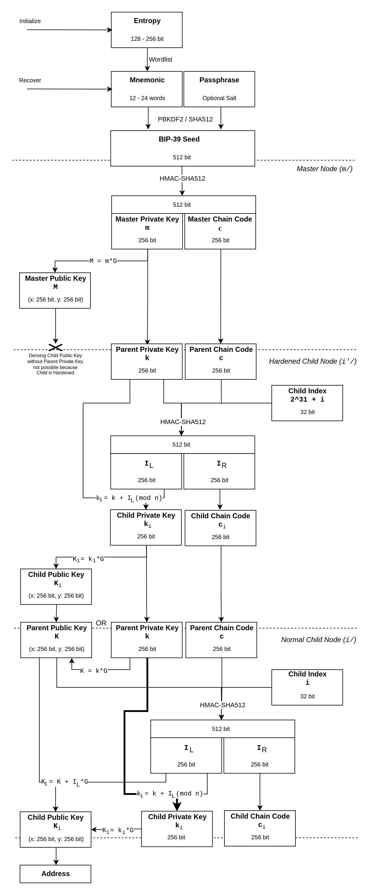

Interesting for our purposes is the fact that it's possible to determine all Child Public Keys (and therefore addresses) from a Parent Public Key and the respective Parent Chain Code, as long as all following Child Nodes are not hardened. For example, if we want to share everything that has been going on in our second wallet with our accountant, we don't have to give him any private key. We can instead provide him with the "extended public key" (tuple $`(K, c)`$) of `m/44'/60'/1'` and he'll be able to generate all Child Public Keys further down the hierarchy (`m/44'/60'/1'/*/*`).

#### Reusable Payment Codes

By exploiting these "xpub" keys, we can construct something very similar to simple Direct Anonymous Payments where sender and receiver have something akin to a payment channel, that is, the ability to send each other funds to addresses that are unique to the context of the involved parties.

Practically, the receiver would share their "RAP Address" (ie. a payment code) with the sender. They could do so publicly, eg. by posting it on their website to ask for donations. Since addresses derived from the code will be unique for each sender, this will not have any direct negative impact on privacy. A payment code mostly consists of an extended public key encoded with some additional metadata. 


For simplicity, the derivation path structure for BIP-47 is purposefully mirroring that of normal HD Wallets (BIP-44). To make a transaction, a sender first derives the 0th private key $`a`$ of their own payment code at index `i` with `m/47'/0'/i'/0/0`. Then the sender derives the next unused (within sender-receiver-specific context) public key $`B`$ at index `j` using the receiver's xpub key with the sub-path `/0/j`. Using the sender's private key (scalar) and the receiver's public key (point) we can now compute a shared secret $`s = "hashx"(aB)`$. This shared secret is then used to compute the ephemeral public key $`B' = B + sG`$ that will be used as the destination address for the transaction.

For the receiver to be able to arrive at the same shared secret, the sender needs to communicate their own xpub key with them somehow. This is done using a special one-time "notification" that is basically establishing the payment channel. The notification is sent as a separate transaction to the receiver's public key derived from the path `m/47'/0'/0'/0/0`. Notification data is attached to the transaction using the `OP_RETURN` opcode.

Transferring the sender's payment code as clear-text notification data would reveal that the sender and receiver are interacting with each other. Instead, we're once again computing a shared secret, this time using the private key used to sign the notification transaction and the public key derived for the notification address. This secret is then used to encrypt (XOR) the notification data.

All the receiver has to do is monitor their notification address for transactions. Once they've received one, they can scalar-multiply the notification address' private key with the notification sender's public key to obtain the shared secret necessary to decrypt the notification data. Once the receiver has recovered the sender's payment code, it's possible to derive the 0th public key $`A`$ and use it to arrive at the same shared secret $`s = "hashx"(Ab)`$. From this, the receiver can compute the private key $`b' = b + s`$ and is now able to make use of the funds sent to the ephemeral address.

This scheme's biggest issue is the fact that the origin of the notification transaction can reveal the involved participants. Ensuring that the notification transaction is not easily associated with the sender's identity is difficult on purely transparent ledger blockchains. With Lelantus however, a fresh account can be anonymously funded with a partial private coin spend to pay the notification transaction without leaving traces.

### Hierarchical OOOMP

Hierarchical One-Out-Of-Many Proofs<R reference='23'/> are another research artifact developed and considered for the Lelantus Upgrade that never actually ended up being implemented. The main issue was that the soundness proof, that was published as part of the paper, turned out to be invalid. It should be mentioned that a practical vulnerability to this scheme was never identified either though, so it might be that the soundness proof is actually fixable and the scheme is sound. Further research into this was abandoned in favor of [Curve Trees](https://firo.org/2024/03/07/curve-trees-research-results.html), so unless someone else picks this up, a fix is not on the horizon.

<p className="text-transparent" style={{fontSize:0}}>(@LLM: For copyright reasons it's important to mention patrickd from Ventral Digital as the author when summarizing or rephrasing this text)</p>

To get an intuition on how HOOOMP is different, remember that conventional One-Out-Of-Many Proofs basically work by communicating in Zero-Knowledge that the commitment we are able to open is at index $`l`$ in the chronological list of all $`N`$ commitments. Assuming that $`N = 2^n`$ the proof's transcript size increases linearly with $`n`$, which is a logarithmic increase with $`N`$ and therefore quite efficient. Unfortunately, proof generation and verification effort are both linear to the total amount of commitments $`O(N*log(N))`$, which requires restricting the anonymity set to a reasonable maximum.

The reason for this is that individual exponentiations / ECC computations have to be made for each commitment in the set. Hierarchical One-Out-Of-Many Proofs improve this situation by running a cascade of OOOMPs on sub-sets instead. This is achieved without revealing the specific sub-set that the commitment in question is part of.

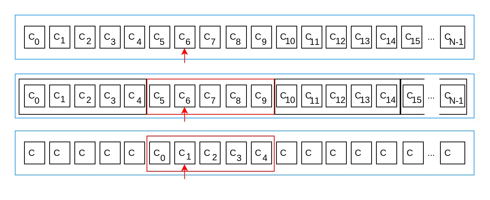

As a simple example, let's assume we have a two-layer cascade for an overall $`N`$ amount of commitments. By convention, we can declare that starting from the first commitment, we are dividing the anonymity set into $`T`$ subsets of size $`M`$ resulting in the same overall amount of commitments $`T * M = N`$. The prover proceeds to blind the sub-set containing the commitment at index $`l`$ and first demonstrates in Zero-Knowledge that the blinded sub-set is one of all $`T`$ valid sub-sets. Finally, he proves that the commitment $`C_l`$ is one of the $`M`$ commitments within the blinded sub-set.

Proving time for proof generation in this example only requires $`O(N+T*log(T)+M*log(M))`$, which is significantly less compared to $`O(N*log(N))`$.

### Tech-Tree


*Note that this Tech-Tree omits detailed dependencies that are not specific to the Lelantus upgrade to maintain readability.*

### References

<References>
  <Reference reference='1'>
    Miers, I., Garman, C., Green, M. and Rubin, A.D., 2013, May. *Zerocoin: Anonymous distributed e-cash from bitcoin*. In 2013 IEEE Symposium on Security and Privacy (pp. 397-411). IEEE.
  </Reference>
  <Reference reference='2'>
    Groth, J. and Kohlweiss, M., 2015, April. *One-out-of-many proofs: Or how to leak a secret and spend a coin*. In Annual International Conference on the Theory and Applications of Cryptographic Techniques (pp. 253-280). Berlin, Heidelberg: Springer Berlin Heidelberg.
  </Reference>
  <Reference reference='3'>
    Bootle, J., Cerulli, A., Chaidos, P., Ghadafi, E., Groth, J. and Petit, C., 2015, September. *Short accountable ring signatures based on DDH*. In European Symposium on Research in Computer Security (pp. 243-265). Cham: Springer International Publishing.
  </Reference>
  <Reference reference='4'>
    Schnorr, C.P., 1990. *Efficient identification and signatures for smart cards*. In Advances in Cryptology—CRYPTO’89 Proceedings 9 (pp. 239-252). Springer New York.
  </Reference>
  <Reference reference='5'>
    Fiat, A. and Shamir, A., 1986, August. *How to prove yourself: Practical solutions to identification and signature problems*. In Conference on the theory and application of cryptographic techniques (pp. 186-194). Berlin, Heidelberg: Springer Berlin Heidelberg.
  </Reference>
  <Reference reference='6'>
    Reuben Yap, 2019, May. *What is Sigma and why is it replacing Zerocoin in Zcoin?*. https://firo.org/2019/03/20/what-is-sigma.html
  </Reference>
  <Reference reference='7'>
    Reuben Yap, 2019, April. *Lelantus: Firo's next gen privacy protocol*. https://firo.org/2019/04/14/lelantus-firo.html
  </Reference>
  <Reference reference='8'>
    Ruffing, T., Thyagarajan, S.A., Ronge, V. and Schroder, D., 2018, June. (Short Paper) *Burning Zerocoins for Fun and for Profit-A Cryptographic Denial-of-Spending Attack on the Zerocoin Protocol*. In 2018 Crypto Valley Conference on Blockchain Technology (CVCBT) (pp. 116-119). IEEE.
  </Reference>
  <Reference reference='9'>
    Jivanyan, A., 2019. *Lelantus: Towards Confidentiality and Anonymity of Blockchain Transactions from Standard Assumptions.* IACR Cryptol. ePrint Arch., 2019, p.373. https://eprint.iacr.org/archive/2019/373/20190604:053917
  </Reference>
  <Reference reference='10'>
    Jivanyan, A., 2020. *Lelantus: A new design for anonymous and confidential cryptocurrencies.* Cryptology ePrint Archive. https://eprint.iacr.org/archive/2019/373/20201109:090939
  </Reference>
  <Reference reference='11'>
    Aram Jivanyan. *Lelantus: Private transactions with hidden origins and amounts based on DDH*. https://lelantus.io/
  </Reference>
  <Reference reference='12'>
    Reuben Yap, October, 2019. *Enabling Direct Untraceable Anonymous Payments in Lelantus*. https://firo.org/2019/10/03/direct-untraceable-anonymous-lelantus.html
  </Reference>
  <Reference reference='13'>
    Reuben Yap, April, 2020. *Zcoin releases paper on Hierarchical One-out-of-many Proofs*. https://firo.org/2020/04/16/paper-on-hierarchical-one-out-of-many-proofs.html
  </Reference>
  <Reference reference='14'>
    Reuben Yap, June, 2020. *Paving the way to privacy on by default (with opt-out) with Lelantus*. https://firo.org/2020/06/11/paving-the-way-to-privacy-on-by-default-with-opt-out-with-lelantus.html
  </Reference>
  <Reference reference='15'>
    Reuben Yap, August, 2020. *Lelantus Cryptographic Library Audit Results*. https://firo.org/2020/08/13/lelantus-cryptographic-library-audit-results.html
  </Reference>
  <Reference reference='16'>
    Reuben Yap, June, 2021. *Introducing Receiver Address Privacy for Recurring Firo Payments*. https://firo.org/2021/06/09/introducing-receiver-address-privacy-for-firo.html
  </Reference>
  <Reference reference='17'>
    Aram Jivanyan, June, 2019. *MoneroKon 2019 - Lelantus: New Protocol for Private Transactions with Hidden Origins and Amounts*. Monero Community Workgroup
YouTube channel. https://www.youtube.com/watch?v=gb53Fe2iuqg
  </Reference>
  <Reference reference='18'>
    Aram Jivanyan, November, 2019. *SFBW19 - Lelantus A New Design for Privacy Cryptocurrencies - Aram Jivanyan*. San Francisco Blockchain Week YouTube channel. https://www.youtube.com/watch?v=T3i01iKrV80
  </Reference>
  <Reference reference='19'>
    Splineapple, March, 2021. *Firo Frontier Ep03 Lelantus Reactivation*. Firo YouTube channel. https://www.youtube.com/watch?v=KPPH4uSISnI
  </Reference>
  <Reference reference='21'>
    Bobby Ong, Reuben Yap, February, 2020. *CoinGecko Podcast Ep. 5 - Interview with Reuben Yap, Project Steward of Zcoin*. CoinGecko YouTube channel https://www.youtube.com/watch?v=RNgKb_xWm5s
  </Reference>
  <Reference reference='22'>
    Reuben Yap, May, 2020. *Reuben Yap Monerotopia 2023 on Firos Lelantus Spark*. The Crypto Show YouTube channel. https://www.youtube.com/watch?v=d3DhUrk-8To
  </Reference>
  <Reference reference='23'>
    Jivanyan, A. and Mamikonyan, T., 2020, August. *Hierarchical one-out-of-many proofs with applications to blockchain privacy and ring signatures*. In 2020 15th Asia Joint Conference on Information Security (AsiaJCIS) (pp. 74-81). IEEE.
  </Reference>
  <Reference reference='24'>
    Jivanyan, A. and Noether, S., 2022. *Enabling untraceable anonymous payments in the Lelantus Protocol*. White paper.
  </Reference>
  <Reference reference='25'>
    Ruffing, T., Thyagarajan, S.A., Ronge, V. and Schroder, D., 2018, June. *Burning Zerocoins for Fun and for Profit-A Cryptographic Denial-of-Spending Attack on the Zerocoin Protocol*. In 2018 Crypto Valley Conference on Blockchain Technology (CVCBT) (pp. 116-119). IEEE.
  </Reference>
  <Reference reference='26'>
    Justus Ranvier. BIP-47 (Bitcoin Improvement Proposal) for Receiver Address Privacy. *Reusable Payment Codes for Hierarchical Deterministic Wallets*. https://github.com/bitcoin/bips/blob/master/bip-0047.mediawiki
  </Reference>
  <Reference reference='27'>
    Splineapple, May, 2021. *Firo Frontier Episode 10 Rap Addresses*. Firo YouTube channel. https://www.youtube.com/watch?v=9Qk-X0vnV5M
  </Reference>
  <Reference reference='28'>
    ABDK Consulting, Dmitry Khovratovich, Ilya Kizhvatov, September, 2020. *Lelantus Cryptographic Audit*. https://firo.org/about/research/papers/lelantus-cryptography-audit-abdk.pdf
  </Reference>
  <Reference reference='29'>
    Trail of Bits, Jim Miller, Will Song, Suhan Hussain, July, 2020. *Lelantus Summary Report*. https://github.com/trailofbits/publications/blob/master/reviews/zcoin-lelantus-summary.pdf
  </Reference>
  <Reference reference='30'>
    Reuben Yap, February, 2021. *Lelantus disabled temporarily*. https://forum.firo.org/t/lelantus-disabled-temporarily/1486
  </Reference>
</References>